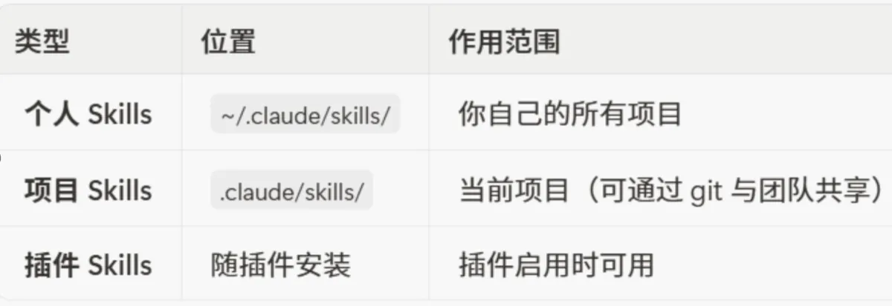
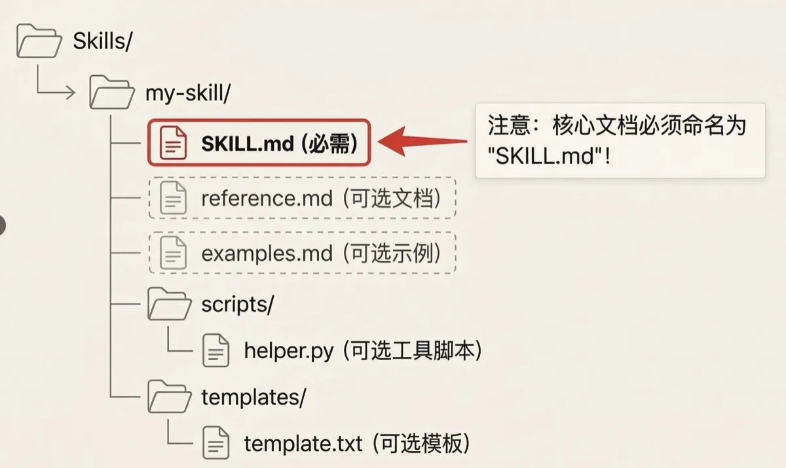

+++
date = '2026-01-12T10:00:00+08:00'
draft = false
title = 'Claude Code Skills: Create Custom AI Abilities in 30 Seconds'
description = 'Learn how to build Claude Code Skills that turn your expertise into reusable AI modules. Step-by-step guide with practical SKILL.md examples for developers and teams.'
toc = true
tags = ['Claude Code', 'AI Agent', 'Skills', 'Productivity']
categories = ['AI Guides']
keywords = ['Claude Code Skills', 'SKILL.md tutorial', 'Claude Code custom skills', 'AI workflow automation', 'Claude Code tips']
+++


## Introduction

For months, one question kept nagging me: **How do you teach an AI your personal expertise?**

CLAUDE.md lets Claude Code remember your preferences and project context. But how do you encode your actual *capabilities* -- your workflows, your domain knowledge, your hard-won best practices -- into something the AI can use?

The answer is **Skills**.

Skills fundamentally changed how I collaborate with AI. Instead of a generic assistant that answers questions, Claude Code becomes a team member that proactively applies specialized knowledge at exactly the right moment. It is the difference between working with an intern who needs constant direction and collaborating with a senior colleague who just *gets it*.

Despite the name, Claude Code is not just a coding tool. It is a general-purpose agent that can handle all kinds of work on your machine. Skills are the plugin system that makes its capabilities infinitely extensible.

The real breakthrough: Skills let you *abstract* anyone's expertise into portable, reusable modules. Whether you work in marketing, product management, operations, or engineering, you can package what you know and share it with your team.

## What Exactly Is a Skill?

> A Skill is a self-contained capability unit that bundles domain knowledge, workflows, and best practices into something Claude Code can automatically invoke.

The key difference from slash commands (`/command`): you never trigger a Skill manually. Claude Code reads the conversation context and decides when to activate the right Skill on its own. Think of it as a seasoned colleague who notices you are working on a specific task and steps in: "I know how to handle this. Let me help."

Skills can be stored at different levels, each with a different scope:



Consider the possibilities:

- **For individuals**: Package your go-to code snippets, writing style, or data analysis workflows into personal Skills. Claude Code becomes the assistant that truly understands how *you* work.

- **For teams**: Design standards, API guidelines, deployment procedures -- turn them all into project Skills committed to your repo. When a new team member joins, Claude Code automatically onboards them. No more repetitive training sessions.

## How to Create a Skill in 30 Seconds

It sounds complicated, but it is surprisingly simple. You need one folder and one file. Here is the step-by-step breakdown.

### Step 1: Create Your Skill Directory

> Team collaboration works best with project Skills because they can be committed to git. Every team member who pulls the repo automatically gains the new capability.

```bash
# Create a personal Skill (only you can use it)
mkdir -p ~/.claude/skills/demo-skill

# Or create a project Skill (shared with your team)
mkdir -p .claude/skills/demo-company-skill
```

### Step 2: Write the SKILL.md File

> A complete Skill example is included at the end of this article. If you want to see the full picture first, scroll down to the appendix.

This is the heart of every Skill. It has two parts: YAML frontmatter (metadata) and Markdown (instructions). Both are straightforward.

```markdown
---
name: your-skill-name
description: Brief description of what this Skill does and when to use it
---

# Your Skill Name

## Instructions
Provide clear, step-by-step guidance for Claude.

## Examples
Show concrete examples of how to use this Skill.
```

#### Naming Conventions

Use English gerund form (verb + -ing) for the `name` field so the capability is immediately clear.

Good: `processing-pdfs`, `analyzing-spreadsheets`, `writing-documentation`
Bad: `helper`, `utils`, `documents` (too vague)

#### The Magic of `description`

> The `description` field determines whether Claude Code can intelligently activate your Skill. It must clearly state what the Skill does and when to use it, written in the third person.

Good example:

```yaml
---
name: Feynman-Simplifier-Skill
description: Transforms any complex scientific, technical, or philosophical concept into analogies a 5-year-old can understand, and pinpoints the user's knowledge gaps.
---
```

Bad example:

```yaml
---
name: explainer1
description: A tool that explains things and makes hard stuff simple.
---
```

The more precise your description and the more trigger keywords it contains (like `git diff`, `commit message`), the better Claude Code understands when to activate it.

#### Let Claude Code Write the Skill for You

You can even ask Claude Code to generate Skills. Try this prompt template:

```
Generate a complete SKILL.md with these requirements:
- [Describe the capability you want]

Requirements:
1. Include proper YAML frontmatter
2. Use gerund form for the name
3. Write description in third person with trigger terms
4. Add Instructions and Examples sections
```

### Step 3: Directory Structure (Where Most People Go Wrong)



Focus on three key elements in this diagram:

1. **skills/**: The skills folder inside the `.claude` directory.

2. **my-skill/**: This is where most people make mistakes. Every SKILL.md file *must* live inside its own subfolder. Claude Code will not recognize a SKILL.md placed directly in the `skills/` directory.

3. **SKILL.md**: The actual skill document we have been discussing above.

After setting this up, type `/skills` in Claude Code to see all available Skills in your directory. That is all there is to it.

## Real-World Example: 1,000 User Complaints to Product Insights in 40 Seconds

The first three days after a product release are brutal. App Store reviews, support tickets, and community complaints flood in simultaneously. The traditional approach -- assigning two interns to copy feedback into spreadsheets, tag each entry manually, and compile a summary -- takes an entire day and still misses critical issues.

We solved this by creating a project Skill called `feedback-analyst`.

The SKILL.md description was specific and deliberate:

> description: Reads user feedback or review lists, performs sentiment analysis, automatically categorizes entries as "bug", "UX improvement", or "feature request", and extracts the top 5 most frequent pain points. Activated when the user provides raw feedback data and requests analysis.

Now, whenever the operations team exports a messy CSV of user reviews, they simply tell Claude Code: "Analyze this week's negative reviews and find the main patterns." Claude Code automatically activates the Skill, processes thousands of entries, filters out pure venting, and delivers actionable insights: "60% of negative reviews cite unreadable text in the new dark mode. Recommend prioritizing this fix."

The entire process takes seconds instead of a full day. And this is just the beginning -- you can use similar Skills to analyze competitor App Store reviews for market opportunities, distill user interview transcripts, or extract key trends from industry reports.

The most important implication: Skills turn individual expertise into modular, shareable components. These modules can circulate within your team or even externally -- which is also why some people raise concerns about AI platforms extracting specialized professional knowledge.

## Practical Skill Templates You Will Want to Copy

### Smart Git Commit Assistant

Never struggle with commit messages again:

`````markdown
---
name: auto-git-commit
description: Analyzes git diff output and generates conventional commit messages following standard format
---

# Smart Git Commit

## Steps
1. Run git diff --staged to review changes
2. Classify the change type:
   - New file -> feat
   - Bug fix -> fix
   - Documentation -> docs
   - Refactoring -> refactor
3. Extract key changes
4. Generate commit message

## Commit Format
type(scope): short description

- feat: New feature
- fix: Bug fix
- docs: Documentation
- style: Formatting
- refactor: Code restructuring
- test: Tests
- chore: Build/tooling

## Example
Input: Modified login logic, fixed password validation issue
Output: fix(auth): resolve password validation in login flow
`````

### Meeting Notes to Action Items

Turn lengthy meeting recordings into executable task lists:

`````markdown
---
name: meeting-to-action
description: Converts meeting notes into actionable task lists with owners and deadlines
---

# Meeting Notes to Action Items

## Detection Rules
Trigger keywords:
- "needs to..." / "should..." -> Task
- "responsible for..." / "owned by..." -> Owner
- "by next week / tomorrow / end of month..." -> Deadline
- "confirm / follow up / complete..." -> Action

## Output Format
### Action Items
- [ ] [Alice] Complete product prototype (due: Jan 15)
- [ ] [Bob] Contact supplier for pricing (due: this Friday)
- [ ] [Team] Submit test report by next Tuesday

### Items Needing Clarification
- Does the budget include marketing spend? (Finance to confirm)
`````

### Executive-Ready Weekly Report Generator

The format leadership actually wants to read:

`````markdown
---
name: boss-report
description: Generates executive-style weekly reports that emphasize business value and outcomes over activity logs
---

# Executive Weekly Report

## Core Principles
Leadership does not care what you did. They care about:
1. What value you created for the company
2. What problems you solved
3. What risks need attention

## Structure Template

### Key Outcomes This Week (3 max)
- Lead with data: increased by XX%, saved $XX
- Don't write "completed XX task"
- Write "achieved XX outcome through XX approach"

### Next Week Focus (3 max)
- Only include high-impact items
- Flag any support needed

### Risk Alerts (if any)
- Keep it brief
- Include recommended mitigation

## Bad vs Good Examples
Bad: Completed the user system development
Good: New user system launched, registration conversion up 23%, projected $15K monthly revenue increase

Bad: Attended 5 meetings
Good: Drove cross-team alignment, resolved a 2-month supply chain bottleneck
`````

## Appendix: A Complete Skill Example

`````markdown
---
name: convert-to-word
description: Converts PDF documents to editable Word (.docx) format preserving layout and formatting
---

# Convert PDF to Word

This skill converts PDF documents to editable Word (.docx) format.

## Usage

When the user requests to convert a PDF to Word format:

1. Install required dependencies if not already installed:
```bash
pip install pdf2docx python-docx PyPDF2
```

2. Use the following Python code to perform the conversion:

```python
from pdf2docx import Converter
from pathlib import Path

def convert_pdf_to_word(pdf_path, output_path=None):
    """Convert a PDF file to Word (.docx) format."""
    pdf_file = Path(pdf_path)

    if not pdf_file.exists():
        raise FileNotFoundError(f"PDF file not found: {pdf_path}")

    if output_path is None:
        output_path = pdf_file.with_suffix('.docx')
    else:
        output_path = Path(output_path)

    print(f"Converting {pdf_file.name}...")

    converter = Converter(str(pdf_file))
    converter.convert(str(output_path))
    converter.close()

    if output_path.exists():
        file_size = output_path.stat().st_size / 1024
        print(f"Conversion successful!")
        print(f"  Output: {output_path}")
        print(f"  Size: {file_size:.2f} KB")
        return str(output_path)
    else:
        raise RuntimeError("Conversion failed")

# Example usage:
# convert_pdf_to_word("document.pdf")
# convert_pdf_to_word("report.pdf", "output/report.docx")
```

## Features

- Preserves text formatting
- Retains images and graphics
- Maintains table structures
- Supports multi-page documents
- Simple error handling

## Limitations

- Complex layouts may not convert perfectly
- Scanned PDFs require OCR preprocessing
- Password-protected PDFs need to be unlocked first
`````

## Advanced Tips to Supercharge Your Skills

### Tip 1: Trigger Word Matrix

Don't rely on a single description. Use a trigger word matrix to improve activation rates:

```markdown
---
description: Analyzes user feedback, customer reviews, negative ratings, complaints, suggestions, and grievances to extract key issues and improvement areas
---

## Trigger Keywords
- user feedback, customer feedback, feedback analysis
- negative reviews, review analysis, bad ratings
- complaint handling, complaint analysis
- product suggestions, improvement ideas, optimization proposals
- user frustrations, customer pain points
```

### Tip 2: Progressive Output

Avoid information overload with layered responses:

```markdown
## Output Strategy

### First response: One-sentence summary
Core conclusion only, under 50 words

### If the user says "details"
Expand to 3 key points

### If the user says "more details"
Full analysis report

### If the user asks "why"
Explain the reasoning process
```

### Tip 3: Graceful Degradation

Build in error handling so the Skill never fails silently:

```markdown
## Fallback Mechanism

Try in order:
1. Best case: Call API for real-time data
2. If that fails: Use cached data
3. Still failing: Use generic template
4. All else fails: Ask the user to provide input

Never show raw error messages. Degrade gracefully.
```

## Common Pitfalls and How to Avoid Them

### Pitfall 1: Wrong Directory Structure Kills Your Skill

**Wrong**:
```
.claude/skills/my-skill.md
```

**Correct**:
```
.claude/skills/my-skill/SKILL.md
```

It must be inside a folder. It must be named `SKILL.md`. It is case-sensitive.

### Pitfall 2: Description Too Long

Keep descriptions under 20 words for best results. Longer descriptions actually reduce activation rates.

### Pitfall 3: Over-Engineering with Skills

Not everything needs a Skill. For simple one-off tasks, just ask Claude directly. Avoid unnecessary complexity.

## Conclusion

If AI was previously a powerful but generic brain, the Skills system transforms it into something far more personal. It shifts the power to define capabilities from AI companies back to individual users and teams.

We are no longer passive consumers of AI. We are active trainers and enablers. Skills let AI deeply integrate into your specific workflows, understand your unique context, and become a true partner rather than a generic tool.

If you want to experience this level of human-AI collaboration, start by creating one simple Skill for a task you do repeatedly. Open Claude Code, describe what you need, or just create a `SKILL.md` yourself.

The hardest part is getting started -- and this article has already cleared that path for you.

---

## Related Reading

- [Claude Code Skills Complete Guide](/posts/ai/2026-01-08-claudecode-skill-guide/)
- [Claude Code Browser Automation: Comparing Agent Browser, Playwright, and DevTools](/posts/ai/2026-01-28-claude-code-browser-automation/)
- [Claude Code Best Practices Guide](/posts/ai/2026-01-06-claudecode-best-practices/)
- [Agent Skills: A New Paradigm for AI Programming](/posts/ai/2026-01-19-agent-skills-new-programming/)
