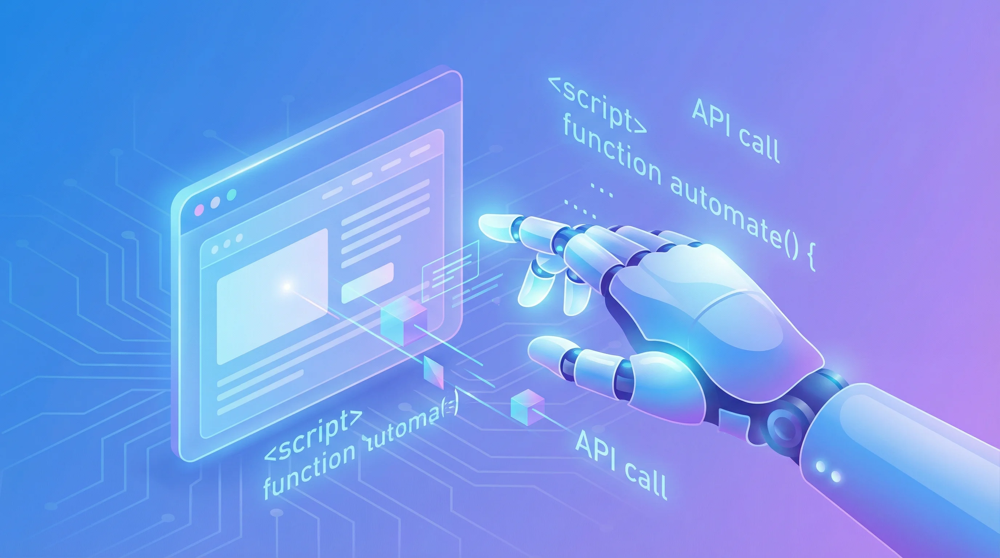

+++
date = '2026-01-13T08:00:00+08:00'
title = 'Vercel Agent Browser: AI-Native Browser Automation CLI Tool'
description = 'Vercel open-sourced Agent Browser, a snapshot-driven browser automation CLI built with Rust and Node.js, designed specifically for AI agents to interact with web pages.'
toc = true
tags = ['AI', 'Vercel', 'Browser Automation', 'Agent', 'CLI']
categories = ['AI Guides']
keywords = ['Vercel Agent Browser', 'AI browser automation', 'headless browser CLI', 'Playwright alternative', 'AI agent browser tool', 'snapshot-driven automation']
+++


Vercel recently open-sourced **Agent Browser**, a command-line tool purpose-built for AI agents that need to interact with web pages. Unlike traditional browser automation frameworks that rely on CSS selectors and XPath, Agent Browser introduces a snapshot-driven interaction model that aligns naturally with how AI agents perceive and act on information.

## What Is Agent Browser?

Agent Browser is a headless browser automation CLI designed for AI agent workflows. It combines Rust for native CLI performance with a Node.js daemon that manages Playwright-powered browser instances.

The core idea is simple: give AI agents a way to "see" a web page as a structured list of interactive elements, then let them act on those elements by reference — no selectors required.

## Key Features

### High-Performance Client-Daemon Architecture

Agent Browser separates the CLI client from the browser engine:

- **Rust CLI** — native binary with millisecond startup time and minimal memory footprint
- **Node.js daemon** — manages long-running Playwright browser instances
- **Persistent connections** — reuses browser sessions across commands for fast repeated operations

### Snapshot-Driven Interaction (The Killer Feature)

This is what sets Agent Browser apart. Traditional automation tools require you to locate elements using brittle CSS selectors or XPath expressions. Agent Browser uses **accessibility tree snapshots** instead:

```bash
# Get a page snapshot with interactive element references
agent-browser snapshot -i --json
```

Each element in the snapshot gets a unique reference (e.g., `@e1`, `@e2`). AI agents can use these references directly to click buttons, fill forms, or extract text — without writing a single selector.

### Full Browser Control

**Navigation:**
- Open URLs, go back/forward, refresh
- Multi-tab management

**Interaction:**
- Click, fill, type, hover
- Checkbox and dropdown selection
- File upload, scroll

**Data extraction:**
- Text and attribute extraction
- Screenshots, PDF generation
- Network request monitoring

**Advanced capabilities:**
- JavaScript execution
- Network interception and request mocking
- Cookie and storage management
- Isolated multi-session support

## Installation and Usage

### Installation

```bash
# Install via npm
npm install -g agent-browser

# Download Chromium
agent-browser install
```

### The Snapshot-Interact-Verify Loop

The recommended workflow follows a simple three-step cycle:

```bash
# 1. Open the target page
agent-browser open https://example.com

# 2. Take a snapshot (interactive elements only)
agent-browser snapshot -i --json

# 3. Interact using element references
agent-browser click @e5
agent-browser fill @e3 "Hello World"

# 4. Re-snapshot to verify the result
agent-browser snapshot -i --json
```

### Advanced Examples

**Login and save session state:**

```bash
# Navigate to login page
agent-browser open https://example.com/login
agent-browser fill @username "user@example.com"
agent-browser fill @password "password"
agent-browser click @submit

# Save authentication state for later reuse
agent-browser save-auth ./auth-state.json
```

**Parallel isolated sessions:**

```bash
# Create separate browser sessions
agent-browser open https://site1.com --session session1
agent-browser open https://site2.com --session session2
```

## Architecture Overview

```
┌─────────────────┐     ┌──────────────────────┐
│   Rust CLI      │────▶│   Node.js Daemon     │
│   (Native perf) │     │   (Playwright)       │
└─────────────────┘     └──────────────────────┘
                               │
                               ▼
                        ┌──────────────────┐
                        │    Chromium       │
                        │    Instance       │
                        └──────────────────┘
```

Why this architecture works well:
- **Fast startup** — Rust CLI launches in milliseconds
- **Resource efficient** — daemon reuses browser instances across commands
- **Cross-platform** — runs on Windows, macOS, and Linux

## Integration with Claude Code

Agent Browser ships with an official **Claude Code Skill**, enabling seamless browser automation directly from your AI coding assistant. Once installed, Claude Code can:

- Run automated web tests
- Fill out forms
- Capture screenshots and scrape data
- Analyze web page content

### Step 1: Create the Skill Directory

```bash
mkdir -p ~/.claude/skills/agent-browser
```

### Step 2: Download the Official SKILL.md

```bash
curl -o ~/.claude/skills/agent-browser/SKILL.md \
  https://raw.githubusercontent.com/vercel-labs/agent-browser/main/skills/agent-browser/SKILL.md
```

Alternatively, create `~/.claude/skills/agent-browser/SKILL.md` manually:

```markdown
---
name: agent-browser
description: Automates browser interactions for web testing, form filling, screenshots, and data extraction.
---

# Browser Automation with agent-browser

## Quick start

agent-browser open <url>        # Navigate to page
agent-browser snapshot -i       # Get interactive elements with refs
agent-browser click @e1         # Click element by ref
agent-browser fill @e2 "text"   # Fill input by ref
agent-browser close             # Close browser

## Core workflow

1. Navigate: agent-browser open <url>
2. Snapshot: agent-browser snapshot -i (returns elements with refs like @e1, @e2)
3. Interact using refs from the snapshot
4. Re-snapshot after navigation or significant DOM changes
```

### Step 3: Restart Claude Code

After installation, restart Claude Code. You can invoke the skill by typing `/agent-browser` in any conversation.

### Command Reference

| Command | Description |
|---------|-------------|
| `agent-browser open <url>` | Navigate to a URL |
| `agent-browser snapshot -i` | Get interactive element snapshot |
| `agent-browser click @e1` | Click an element by reference |
| `agent-browser fill @e2 "text"` | Fill an input field |
| `agent-browser screenshot` | Capture a screenshot |
| `agent-browser wait @e1` | Wait for an element to appear |
| `agent-browser close` | Close the browser |

### Practical Example: Automated Login

```bash
# Open the login page
agent-browser open https://example.com/login

# Get page elements
agent-browser snapshot -i
# Output: textbox "Email" [ref=e1], textbox "Password" [ref=e2], button "Submit" [ref=e3]

# Fill the form and submit
agent-browser fill @e1 "user@example.com"
agent-browser fill @e2 "password123"
agent-browser click @e3

# Wait for navigation to complete
agent-browser wait --load networkidle

# Save login state for future sessions
agent-browser state save auth.json
```

## Use Cases

- **AI agent development** — build agents that can browse and interact with the web
- **End-to-end testing** — automate web application testing with snapshot-based assertions
- **Web scraping** — extract structured data from web pages
- **RPA workflows** — automate repetitive browser tasks

## Final Thoughts

Agent Browser addresses a real gap in the AI tooling ecosystem. Its snapshot-driven model fits naturally into the way AI agents work: observe the current state, decide what to do, execute the action, and verify the result.

If you are building AI agents that need web interaction capabilities, Agent Browser is worth evaluating.

**Repository**: [https://github.com/vercel-labs/agent-browser](https://github.com/vercel-labs/agent-browser)

**License**: Apache 2.0

## Related Reading

- [Browser Automation in Claude Code: 5 Tools Compared (2026)](/posts/ai/2026-01-28-claude-code-browser-automation/) — Side-by-side comparison of browser automation approaches
- [Claude Code Complete Guide: From Beginner to Power User](/posts/ai/2026-01-14-claude-code-guide/) — The comprehensive reference for Claude Code
- [Claude Code Skills Guide: Teach AI Your Exact Workflow](/posts/ai/2026-01-08-claudecode-skill-guide/) — How to create and install Skills like Agent Browser
- [MCP Protocol Explained: The Universal Standard for AI Integration](/posts/ai/2026-02-20-mcp-protocol-guide/) — The protocol layer that powers AI tool integrations
- [AI Coding Agents 2026: The Complete Comparison](/posts/ai/2026-03-10-ai-coding-agents-comparison-2026/) — How different AI coding tools stack up

## Series Navigation

This is Part 1 of the **Browser Automation for AI Agents** series — the arc from headless drivers, to attaching to your real browser, to cutting the token bill, to sharing your logged-in session:

1. **This article**: Vercel Agent Browser — a snapshot-driven CLI built for agents, not test suites
2. [Browser Automation in Claude Code: 5 Tools Compared](/posts/ai/2026-01-28-claude-code-browser-automation/) — the field map: token cost, speed, stability
3. [Chrome DevTools MCP Setup 2026](/posts/ai/2026-03-17-chrome-devtools-mcp-guide/) — attaching to your real browser, and the port 9222 traps
4. [Playwright CLI + Skills: 0-Token Automation](/posts/ai/2026-04-18-playwright-cli-skill-zero-token-automation/) — the pattern that removes the MCP token tax
5. [Claude Code Screenshot MCP Setup](/posts/ai/2026-07-21-claude-code-screenshot-mcp-frontend-debugging/) — the frontend debugging loop, 10,220 vs 65 tokens
6. [ubrowser Review](/posts/ai/2026-07-27-ubrowser-review/) — the right design trapped in an abandoned repo
7. ego lite Review: Your Logged-In Browser, Handed to Claude Code (coming next) — handing agents your logged-in session through Spaces
