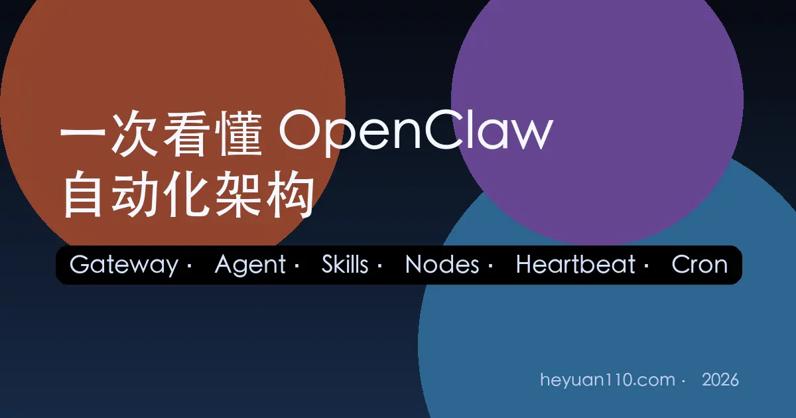
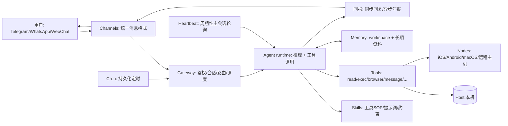

+++
date = '2026-02-14T08:10:00+08:00'
draft = false
title = '拆解 OpenClaw 自动化架构：从消息到执行的完整链路'
description = '从架构视角拆解 OpenClaw 的“自动化原理”：消息如何经由 Gateway 路由到 Agent，如何用 Skills 调工具、跨设备 Nodes 执行，Memory 如何存取，Heartbeat 与 Cron 如何让助手在后台持续工作，并用端到端案例串起完整链路。'
toc = true
tags = ['OpenClaw', 'AI Agent', '架构', '自动化', 'Skills']
categories = ['AI原理']
keywords = ['OpenClaw 架构', 'OpenClaw Gateway', 'OpenClaw Heartbeat', 'OpenClaw Cron', 'AI Agent 自动化原理']
+++

很多“AI 助手”看起来能自动干活，但当你真的要把它跑成 **7×24 小时在线、跨设备、可控可审计** 的系统时，问题会立刻变成：

- 为什么它能在 Telegram/WhatsApp/网页里同时接消息？
- 为什么同一条指令能调用浏览器、写文件、跑命令、甚至让手机拍照？
- 为什么它能“隔一段时间自己来汇报”，又不会把聊天刷屏？

OpenClaw 的答案不是“更聪明的模型”，而是一套**清晰的控制平面（Gateway）+ 可插拔执行面（Skills/Tools/Nodes）+ 可持续调度（Heartbeat/Cron）** 的工程架构。

如果你还没上手安装，建议先读这篇入门（实战视角）：
- [OpenClaw 超详细上手教程](/posts/ai/2026-02-12-openclaw-usage-tutorial/)

本文则从“系统是怎么运转的”出发，把 OpenClaw 的关键组件拆开讲清楚。

---

## 0. 先给你一个“最短心智模型”

把 OpenClaw 想象成一家公司：

- **Gateway（网关/中枢）**：前台 + 总机 + 调度中心。负责鉴权、连接管理、路由、调度。
- **Agent（员工/执行者）**：拿到任务后做推理、拆解步骤、决定调用哪些工具。
- **Skills（SOP/工具使用说明书）**：告诉员工“这类事怎么做”，以及“工具该怎么调用”。
- **Channels（客服入口）**：Telegram/WhatsApp/Slack/WebChat… 统一进件、统一出件。
- **Nodes（外包团队/外设）**：你的另一台电脑、手机、平板，能执行命令、拍照、录屏、展示 Canvas。
- **Memory（知识库/档案）**：短期上下文 + 长期资料（文件化 + 检索）。
- **Heartbeat（巡逻机制）**：每隔一段时间“主动抬头看一眼”，但有“没事就别打扰”的协议。
- **Cron（排班表/定时器）**：把“什么时候该做什么”固化成可持久化的计划。

接下来我们把这套公司机制，拆成一张架构图。

---

## 1. Gateway：为什么它是“控制平面”而不是“聊天机器人”

在 OpenClaw 的官方定义里，Gateway 是一个常驻进程：**负责路由、控制、连接与安全边界**，而 Agent 只是其中被唤醒执行的一段运行时。

你可以把它理解为：

1) **统一入口**：所有渠道（Telegram/WhatsApp/Slack/WebChat…）的入站消息，都会先到 Gateway。

2) **鉴权与隔离**：Gateway 默认要求鉴权（token/password），并支持多实例/多 profile 做更严格隔离（不同端口、不同 state dir、不同 workspace）。

3) **会话与事件**：Gateway 维护 session transcript（JSONL），并通过 WebSocket 协议对外提供控制/事件流（连接挑战、presence、tick、heartbeat…）。

4) **请求路由**：把“某个 channel 的某个对话”路由到**哪个 agent**（以及哪个 workspace/工具权限）。这也是多用户隔离与多角色（main/work/research…）的基础。

官方文档：
- Gateway 运行手册（端口/绑定/热重载/协议概览）：https://docs.openclaw.ai/gateway
- 协议与控制面概念（WS connect/hello-ok 等）：https://docs.openclaw.ai/gateway/protocol

> 这也是为什么 OpenClaw 更像“你自己的本地 AI 助理平台”，而不仅是一个 Bot：它把渠道、会话、调度、工具都收敛在一个可运维的控制平面里。

---

## 2. Agent：不是“一个提示词”，而是一个可被调度的运行时

很多人理解的 Agent = “system prompt + LLM”。在 OpenClaw 里，Agent 更接近一个运行时：

- 有自己的 **workspace**（工具默认 cwd 与上下文注入来源）
- 有自己的 **skills 集**（指导如何调用工具）
- 有自己的 **sessions**（对话历史的持久化）
- 有自己的 **队列策略**（steer/followup/collect 等，决定并发消息如何影响当前运行）

官方文档里提到：OpenClaw 内置一个嵌入式 runtime（派生自 pi-mono），并把 session 管理、工具 wiring 这部分作为 OpenClaw 自己的能力来做。

文档：
- Agent runtime 概念说明：https://docs.openclaw.ai/concepts/agent
- Workspace 作为“家”的规范：https://docs.openclaw.ai/concepts/agent-workspace

你也可以结合站内文章理解“多角色 + 隔离”的价值：
- [OpenClaw + Claude Code 的协作工作流](/posts/ai/2026-01-31-openclaw-claude-code-workflow/)

---

## 3. Skills：把“会用工具”从模型能力变成工程能力

你在草稿里把 Skills 写成“工具箱/标准接口”，这个方向是对的，但还可以更精确一点：

- **Tools（工具）** 是“能力的 API”（例如 browser、exec、read/write、nodes、message…）
- **Skills（技能）** 是“如何用这些 API 完成任务的可复用方法论 + 约束”

OpenClaw 使用的是与 AgentSkills 兼容的 skill 文件夹规范：一个 skill 目录里有 `SKILL.md`（带 YAML front matter），描述技能用途、触发方式、以及操作步骤。

这带来两个非常工程化的收益：

1) **可审计**：你能读 skill 的文本，知道它会怎么做；它不是黑箱“模型自己想出来的”。
2) **可移植**：同一个 skill 可以在不同 agent / 不同机器复用（甚至同步/发布）。

官方文档：
- Skills 机制（加载顺序、workspace 覆盖、gating、安全注意）：https://docs.openclaw.ai/tools/skills
- AgentSkills 规范（生态层面）：https://agentskills.io

站内延伸阅读（技能=新编程范式）：
- [Agent Skills：AI 时代的新编程方式](/posts/ai/2026-01-19-agent-skills-new-programming/)

---

## 4. Channels：把“多平台消息”统一成系统事件

Channels 的价值不是“支持很多 IM”，而是把每个平台不同的消息结构（文本/图片/音频/引用/群规则）统一成：

- **入站事件**：来自谁、在哪个会话、是什么内容、带哪些媒体
- **出站交付**：如何分块、如何格式化、怎么避免刷屏

这也是为什么 Heartbeat/Cron 的“输出交付”可以统一处理：它们最终仍走 channel adapter。

官方文档（按平台拆分）：https://docs.openclaw.ai/channels

---

## 5. Nodes：让“执行”跨出 Gateway 所在那台机器

你草稿里提到“跨设备执行、心跳重连”。准确地说：

- **Node 是外设/伴生设备**，连接到 Gateway 的同一个 WebSocket 端口，但以 role: node 身份握手。
- Gateway 可以把某些 tool 调用（例如 system.run、camera、screen record、canvas）转发给 node 去执行。

这让 OpenClaw 具备一个很关键的能力：

> 模型运行在 Gateway 主机上，但执行面可以分散到多台设备（手机/平板/另一台电脑）。

官方文档：
- Nodes 概念与配对（devices approve、node host、exec approvals）：https://docs.openclaw.ai/nodes

站内延伸（你会更关注“怎么用”，不是“是什么”）：
- [OpenClaw 使用教程（含多渠道/配对/排障）](/posts/ai/2026-02-12-openclaw-usage-tutorial/)

---

## 6. Memory：短期上下文 + 长期资料，为什么“文件化”比“塞进提示词”更可靠

在 OpenClaw 体系里，Memory 通常分两层：

- **短期**：当前 session 的对话历史（由 Gateway 持久化为 JSONL）
- **长期**：workspace 里的文件（例如 `memory/YYYY-MM-DD.md`、`MEMORY.md`、项目资料 Markdown 等），必要时再配合检索/摘要

这种“文件化记忆”的思路，在长期运行的个人助手里特别关键：

- 你可以手动编辑/纠错（对抗模型幻觉）
- 你可以做版本管理（git）
- 你可以做隐私边界（哪些文件只在 main 私聊加载，哪些不加载）

站内文章建议你配套阅读：
- [OpenClaw 的 Memory Strategy（怎么组织长期记忆）](/posts/ai/2026-01-31-openclaw-memory-strategy/)
- [ClaudeMD vs README：把知识放在哪更有效](/posts/ai/2026-01-31-claudemd-vs-readme/)
- [Claude 的记忆与文档协作指南](/posts/ai/2026-01-12-claudemd-memory-guide/)

---

## 7. Heartbeat：为什么它能“主动”，又不会一直打扰你

Heartbeat 的核心不是“定时跑一下模型”，而是一个**响应契约（response contract）**：

- Gateway 会周期性触发 main session 的 agent turn
- 如果模型判断“没事”，必须回复 `HEARTBEAT_OK`
- Gateway 会把 `HEARTBEAT_OK` 当作 ack，并在内容很短时**直接丢弃**，避免把“我没事”刷到你的聊天里

这很像一个“巡逻系统”的设计：

- 有事才报警
- 没事就静默

官方文档（强烈建议读）：
- Heartbeat 机制与配置：https://docs.openclaw.ai/gateway/heartbeat

---

## 8. Cron：把“什么时候做什么”变成可持久化的调度系统

Cron 是 Gateway 内置 scheduler。它和 Heartbeat 的关系可以这样理解：

- **Cron 负责“到点叫醒谁”**（持久化、重启不丢）
- **Heartbeat 负责“被叫醒后用主会话上下文巡逻/执行 system event”**

更关键的点在于：Cron 有两种执行风格：

1) **Main session job（systemEvent）**
- Cron 只是往主会话塞一个系统事件
- 事件通常在下一次 Heartbeat 执行（也可以 wake now 立即触发）

2) **Isolated job（agentTurn）**
- Cron 直接跑一个隔离会话 `cron:<jobId>` 的 agent turn
- 默认可“announce”把结果投递到目标聊天，同时给主会话留一条摘要

这解决了后台自动化最常见的问题：

- “每天早上汇总”这种任务，不应该污染你的主对话上下文
- 但你仍然希望它**按时运行 + 结果可交付**

官方文档：
- Cron jobs（执行风格、存储位置、交付模式）：https://docs.openclaw.ai/automation/cron-jobs

---

## 9. 端到端例子：一条指令如何从消息变成“真正干活”

我们用一个具体例子串起来：

> “每周一早上 9 点，帮我汇总上周 GitHub 的 PR 和本周日历安排，发到 Telegram。”

### 9.1 一次性配置（Cron 创建）

- 你用 CLI / UI 创建 cron job（持久化在 Gateway）：
  - schedule：每周一 09:00（带时区）
  - sessionTarget：isolated（避免污染主对话）
  - payload：agentTurn（一个明确的汇总指令）
  - delivery：announce → telegram/to=<chatId>

### 9.2 到点触发（Cron → Gateway）

- Cron 到点触发
- Gateway 创建一次 isolated agent turn（新的 session，不继承历史）

### 9.3 推理与执行（Agent → Skills → Tools）

- Agent 读取 skill：知道怎么调用 browser（登录 GitHub、筛选 PR）、怎么读取日历（取决于你装的 skill/plugin）
- Agent 调用工具：
  - browser：打开 GitHub 页面、抓取列表
  - read/write：生成 Markdown 摘要（落盘到 workspace，形成长期资料）

### 9.4 结果交付（delivery → Channels）

- Cron “announce” 把结果走 Telegram adapter 发出去
- 同时在 main session 留一个简短 summary（可选）

这个链路里，**Gateway 永远是调度与路由者**，Agent 永远是被唤醒的执行者；Skills 让执行可复制；Nodes 让执行跨设备；Heartbeat/Cron 让它可持续。

---

## 10. 常见误解与工程建议（少踩坑）

1) **把“自动化”理解成“模型自己会”**
- 更可靠的做法：把 SOP 写成 skills，把状态写进文件（workspace/memory），让自动化变成可维护的系统。

2) **后台任务污染主对话**
- 优先用 cron isolated + announce。
- 主会话只保留高价值上下文。

3) **跨设备执行不等于远程控制一切**
- Nodes 的执行权限要配合 allowlist/approvals；默认应该保守。

如果你对“OpenClaw 自动化会踩的坑”更感兴趣，可以读我同日写的排坑清单：
- [OpenClaw 自动化常见坑与规避策略](/posts/ai/2026-02-14-openclaw-automation-pitfalls/)

---

## 相关阅读（站内）

- [OpenClaw 超详细上手教程](/posts/ai/2026-02-12-openclaw-usage-tutorial/)
- [OpenClaw 的 Memory Strategy](/posts/ai/2026-01-31-openclaw-memory-strategy/)
- [OpenClaw + Claude Code 的协作工作流](/posts/ai/2026-01-31-openclaw-claude-code-workflow/)
- [Agent Skills：AI 时代的新编程方式](/posts/ai/2026-01-19-agent-skills-new-programming/)
- [ClaudeMD vs README](/posts/ai/2026-01-31-claudemd-vs-readme/)

## 相关阅读（外链）

- OpenClaw GitHub：https://github.com/openclaw/openclaw
- Gateway Runbook：https://docs.openclaw.ai/gateway
- Heartbeat：https://docs.openclaw.ai/gateway/heartbeat
- Cron jobs：https://docs.openclaw.ai/automation/cron-jobs
- Skills（AgentSkills 兼容）：https://docs.openclaw.ai/tools/skills
- AgentSkills 规范：https://agentskills.io
