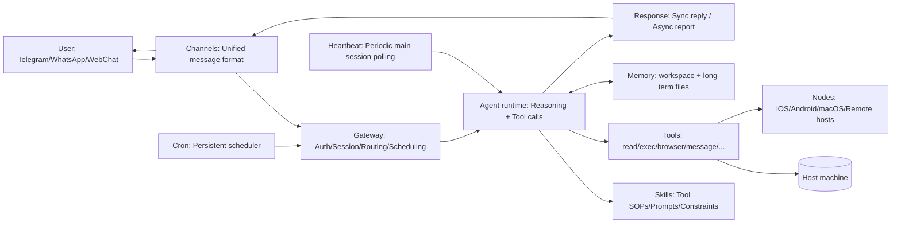

+++
date = '2026-02-14T08:10:00+08:00'
draft = false
title = 'OpenClaw Architecture Deep Dive: How Automation Actually Works'
description = 'A complete walkthrough of OpenClaw internals — how Gateway routes messages to Agents, how Skills orchestrate tools, how Nodes enable cross-device execution, and how Heartbeat and Cron power always-on automation.'
toc = true
tags = ['OpenClaw', 'AI Agent', 'Architecture', 'Automation', 'Skills']
categories = ['AI Guides']
keywords = ['OpenClaw architecture', 'OpenClaw Gateway', 'OpenClaw Heartbeat', 'OpenClaw Cron', 'AI agent automation', 'OpenClaw internals', 'AI assistant platform']
+++

Many "AI assistants" can do things on demand, but when you try to run one as a **24/7, cross-device, auditable production system**, the real questions surface quickly:

- How can it receive messages from Telegram, WhatsApp, and web simultaneously?
- How can a single instruction trigger a browser, write files, run commands, and even take a photo on your phone?
- How can it proactively report back on a schedule without flooding your chat?

OpenClaw's answer is not "a smarter model." It is an engineering architecture built on a **clear control plane (Gateway) + pluggable execution layer (Skills/Tools/Nodes) + persistent scheduling (Heartbeat/Cron)**.

If you have not set up OpenClaw yet, start with this hands-on tutorial:
- [OpenClaw Complete Setup Tutorial](/posts/ai/2026-02-12-openclaw-usage-tutorial/)

This article takes you inside the system — breaking down each key component and how they work together.

---

## 0. The Shortest Mental Model

Think of OpenClaw as a company:

- **Gateway (Headquarters)**: Reception, switchboard, and dispatch center. Handles authentication, connection management, routing, and scheduling.
- **Agent (Employee)**: Receives tasks, reasons through steps, and decides which tools to call.
- **Skills (SOPs / Playbooks)**: Tell employees "how to handle this type of task" and "how to use each tool."
- **Channels (Customer Service Desks)**: Telegram, WhatsApp, Slack, WebChat — unified inbound and outbound messaging.
- **Nodes (Remote Teams / Peripherals)**: Your other computer, phone, or tablet — capable of running commands, taking photos, recording screens, or rendering Canvas.
- **Memory (Knowledge Base / Archives)**: Short-term conversation context + long-term files (file-based + retrievable).
- **Heartbeat (Patrol System)**: Periodically "looks up to check," but follows a "don't disturb if nothing's happening" protocol.
- **Cron (Shift Schedule / Timer)**: Persists "what to do and when" as durable scheduled jobs.

Here is how these components connect:

---

## 1. Gateway: A Control Plane, Not a Chatbot

In OpenClaw's official architecture, the Gateway is a long-running process responsible for **routing, control, connection management, and security boundaries**. The Agent is merely a runtime that gets invoked when needed.

Here is what the Gateway handles:

1) **Unified entry point**: All inbound messages from every channel (Telegram, WhatsApp, Slack, WebChat) hit the Gateway first.

2) **Authentication and isolation**: The Gateway requires authentication by default (token/password) and supports multi-instance / multi-profile configurations for stricter isolation (different ports, state directories, and workspaces).

3) **Sessions and events**: The Gateway maintains session transcripts (JSONL) and exposes a WebSocket-based control/event stream (connection challenges, presence, ticks, heartbeats, etc.).

4) **Request routing**: Routes "a conversation from a specific channel" to the **correct agent** (with the right workspace and tool permissions). This is the foundation for multi-user isolation and multi-role setups (main/work/research, etc.).

Official docs:
- Gateway runbook (ports, binding, hot reload, protocol overview): https://docs.openclaw.ai/gateway
- Protocol and control plane concepts (WS connect/hello-ok): https://docs.openclaw.ai/gateway/protocol

> This is why OpenClaw feels more like "your own local AI assistant platform" than just a bot — it consolidates channels, sessions, scheduling, and tools into a single, operable control plane.

---

## 2. Agent: Not Just a Prompt — A Schedulable Runtime

Many people think of an Agent as "system prompt + LLM." In OpenClaw, the Agent is closer to a full runtime:

- Has its own **workspace** (the default working directory for tools, and the source for context injection)
- Has its own **skills set** (guides how tools are invoked)
- Has its own **sessions** (persisted conversation history)
- Has its own **queue strategy** (steer/followup/collect — controls how concurrent messages affect the current run)

OpenClaw ships an embedded runtime (derived from pi-mono) and handles session management and tool wiring as first-class platform capabilities.

Docs:
- Agent runtime concepts: https://docs.openclaw.ai/concepts/agent
- Workspace as "home": https://docs.openclaw.ai/concepts/agent-workspace

Related reading on multi-role isolation:
- [OpenClaw + Claude Code Collaboration Workflow](/posts/ai/2026-01-31-openclaw-claude-code-workflow/)

---

## 3. Skills: Turning Tool Usage from Model Talent into Engineering Discipline

The distinction matters:

- **Tools** are capability APIs (browser, exec, read/write, nodes, message, etc.)
- **Skills** are reusable methodologies + constraints for how to use those APIs to accomplish tasks

OpenClaw uses the AgentSkills-compatible folder convention: each skill directory contains a `SKILL.md` (with YAML front matter) describing the skill's purpose, trigger conditions, and step-by-step procedures.

This yields two critical engineering benefits:

1) **Auditable**: You can read the skill text and know exactly what it will do. It is not a black box "the model figured out on its own."
2) **Portable**: The same skill can be reused across different agents, different machines, and even published to a shared registry.

Official docs:
- Skills mechanism (loading order, workspace overrides, gating, security): https://docs.openclaw.ai/tools/skills
- AgentSkills specification (ecosystem-level): https://agentskills.io

Related reading:
- [Agent Skills: The New Programming Paradigm for AI](/posts/ai/2026-01-19-agent-skills-new-programming/)

---

## 4. Channels: Unifying Multi-Platform Messages into System Events

The value of Channels is not "supporting lots of messengers." It is normalizing each platform's different message structures (text, images, audio, quotes, group rules) into:

- **Inbound events**: Who sent it, which conversation, what content, which media attachments
- **Outbound delivery**: How to chunk, how to format, how to avoid flooding

This is also why Heartbeat and Cron outputs can be delivered uniformly — they ultimately go through channel adapters.

Official docs (organized by platform): https://docs.openclaw.ai/channels

---

## 5. Nodes: Extending Execution Beyond the Gateway Machine

Nodes are companion devices that connect to the Gateway's WebSocket port with a `role: node` handshake. The Gateway can then forward specific tool calls (system.run, camera, screen record, canvas) to a node for execution.

This gives OpenClaw a critical capability:

> The model runs on the Gateway host, but the execution surface can span multiple devices — phones, tablets, and other computers.

Official docs:
- Nodes concepts and pairing (device approval, node hosting, exec approvals): https://docs.openclaw.ai/nodes

Related reading:
- [OpenClaw Setup Tutorial (including multi-channel, pairing, troubleshooting)](/posts/ai/2026-02-12-openclaw-usage-tutorial/)

---

## 6. Memory: Why File-Based Storage Beats Prompt Stuffing

In OpenClaw's system, Memory operates on two layers:

- **Short-term**: Current session conversation history (persisted by the Gateway as JSONL)
- **Long-term**: Files in the workspace (`memory/YYYY-MM-DD.md`, `MEMORY.md`, project documentation in Markdown, etc.), with retrieval and summarization as needed

This file-based memory approach is especially powerful for long-running personal assistants:

- You can manually edit and correct entries (fighting hallucinations)
- You can version-control everything (git)
- You can set privacy boundaries (which files load in private main chat vs. which do not)

Related reading:
- [OpenClaw Memory Strategy: How to Organize Long-Term Memory](/posts/ai/2026-01-31-openclaw-memory-strategy/)
- [ClaudeMD vs README: Where to Put Knowledge Effectively](/posts/ai/2026-01-31-claudemd-vs-readme/)
- [Claude Memory and Documentation Collaboration Guide](/posts/ai/2026-01-12-claudemd-memory-guide/)

---

## 7. Heartbeat: Proactive Without Being Annoying

The Heartbeat is not "run the model on a timer." It is a **response contract**:

- The Gateway periodically triggers an agent turn in the main session
- If the model determines "nothing to report," it must respond with `HEARTBEAT_OK`
- The Gateway treats `HEARTBEAT_OK` as an acknowledgment and **silently discards** short responses, preventing "I'm fine" messages from flooding your chat

Think of it as a patrol system:

- Sound the alarm only when something needs attention
- Stay silent otherwise

Official docs (strongly recommended):
- Heartbeat mechanism and configuration: https://docs.openclaw.ai/gateway/heartbeat

---

## 8. Cron: Persistent Scheduling That Survives Restarts

Cron is the Gateway's built-in scheduler. Its relationship to Heartbeat:

- **Cron decides "when to wake whom"** (persistent, survives restarts)
- **Heartbeat handles "what to do once awake in the main session context"**

Cron supports two execution styles:

1) **Main session job (systemEvent)**
- Cron injects a system event into the main session
- The event is typically processed during the next Heartbeat cycle (or immediately via "wake now")

2) **Isolated job (agentTurn)**
- Cron runs an agent turn in an isolated session (`cron:<jobId>`)
- Can "announce" results to a target chat while leaving a brief summary in the main session

This solves the most common background automation problem:

- A "daily morning summary" task should not pollute your main conversation context
- But you still want it to **run on schedule and deliver results**

Official docs:
- Cron jobs (execution styles, storage, delivery modes): https://docs.openclaw.ai/automation/cron-jobs

---

## 9. End-to-End Example: From Message to Execution

Let us trace a concrete example through the entire system:

> "Every Monday at 9 AM, summarize last week's GitHub PRs and this week's calendar, then send it to Telegram."

### 9.1 One-Time Setup (Creating the Cron Job)

- You create a cron job via CLI or UI (persisted in the Gateway):
  - schedule: Every Monday 09:00 (with timezone)
  - sessionTarget: isolated (avoid polluting the main conversation)
  - payload: agentTurn (an explicit summarization instruction)
  - delivery: announce to telegram/to=\<chatId\>

### 9.2 Trigger (Cron to Gateway)

- Cron fires at the scheduled time
- Gateway creates an isolated agent turn (new session, no inherited history)

### 9.3 Reasoning and Execution (Agent to Skills to Tools)

- Agent loads the relevant skill: knows how to call browser (log into GitHub, filter PRs) and how to read calendar (depends on installed skill/plugin)
- Agent invokes tools:
  - browser: Opens GitHub page, extracts PR list
  - read/write: Generates a Markdown summary (saved to workspace for long-term reference)

### 9.4 Result Delivery (Delivery to Channels)

- Cron's "announce" sends results through the Telegram adapter
- Optionally leaves a brief summary in the main session

In this pipeline, **the Gateway is always the scheduler and router**, the Agent is always the invoked executor. Skills make execution reproducible. Nodes make execution cross-device. Heartbeat and Cron make it continuous.

---

## 10. Common Misconceptions and Engineering Advice

1) **Assuming "automation" means "the model just knows"**
- The reliable approach: Write SOPs as skills, persist state as files (workspace/memory), and turn automation into a maintainable system.

2) **Background tasks polluting the main conversation**
- Prefer cron isolated + announce.
- Keep only high-value context in the main session.

3) **Cross-device execution does not mean remote-control everything**
- Node execution permissions should use allowlists and approvals. Default to conservative settings.

For more on automation pitfalls, see my companion article:
- [OpenClaw Automation Pitfalls and How to Avoid Them](/posts/ai/2026-02-14-openclaw-automation-pitfalls/)

---

## Related Reading (Internal)

- [OpenClaw Complete Setup Tutorial](/posts/ai/2026-02-12-openclaw-usage-tutorial/)
- [OpenClaw Memory Strategy](/posts/ai/2026-01-31-openclaw-memory-strategy/)
- [OpenClaw + Claude Code Collaboration Workflow](/posts/ai/2026-01-31-openclaw-claude-code-workflow/)
- [Agent Skills: The New Programming Paradigm for AI](/posts/ai/2026-01-19-agent-skills-new-programming/)
- [ClaudeMD vs README](/posts/ai/2026-01-31-claudemd-vs-readme/)

## Related Reading (External)

- OpenClaw GitHub: https://github.com/openclaw/openclaw
- Gateway Runbook: https://docs.openclaw.ai/gateway
- Heartbeat: https://docs.openclaw.ai/gateway/heartbeat
- Cron jobs: https://docs.openclaw.ai/automation/cron-jobs
- Skills (AgentSkills compatible): https://docs.openclaw.ai/tools/skills
- AgentSkills specification: https://agentskills.io
