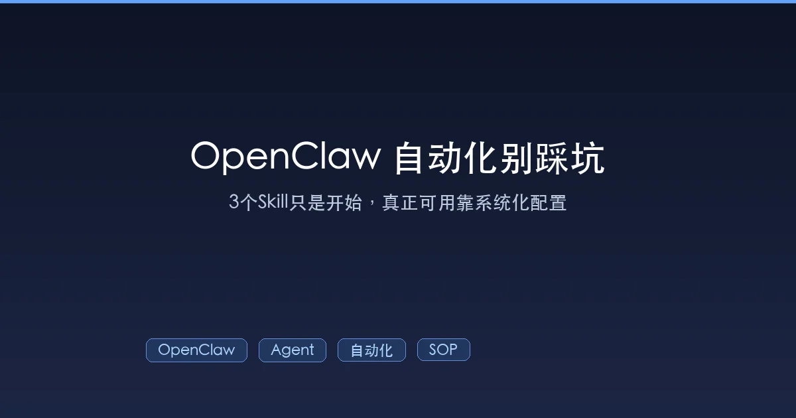

+++
date = '2026-02-14T07:32:00+08:00'
draft = false
title = 'OpenClaw 自动化别踩坑：装 3 个 Skill 不等于真的好用'
description = '很多人以为给 OpenClaw 装上 tavily-search、find-skills、proactive-agent 就能自动化起飞。真正决定可用性的，是会话隔离、任务调度、进度汇报这些系统工程。本文用真实翻车案例和完整配置模板，帮你避开最常见的坑。'
toc = true
tags = ['OpenClaw', 'Agent', '自动化', 'Skills', '产品方法']
categories = ['AI实战']
keywords = ['OpenClaw 配置优化', '会话隔离', '任务隔离', 'Agent 调度', 'AI 助手团队协作', 'dmScope', 'clawdhub', 'clawhub', 'proactive-agent-1-2-4', 'proactive-agent']
+++



你在社区里一定刷到过这种推荐：

```bash
clawdhub install tavily-search
clawdhub install find-skills
clawdhub install proactive-agent   # 原名 proactive-agent-1-2-4，已更名
```

> **⚠️ 重要更新（2026-02）**：社区里很多教程写的是 `clawhub install proactive-agent-1-2-4`，这里有两个坑需要注意：
>
> 1. **命令名称**：正确的 CLI 工具是 **`clawdhub`**（有个 d），不是 `clawhub`。`clawdhub` 是 [ClawHub](https://clawhub.ai/) 的官方命令行工具，通过 `npm i -g clawdhub` 安装。
> 2. **Skill 改名**：`proactive-agent-1-2-4` 这个 Skill 在 ClawHub 上已经找不到了，作者 [halthelobster](https://clawhub.ai/halthelobster/proactive-agent) 已将其**更名为 `proactive-agent`**（当前版本 v3.1.0）。如果你按照旧教程执行 `clawdhub install proactive-agent-1-2-4` 会报 "Skill not found" 错误，改用 `clawdhub install proactive-agent` 即可。

"给 AI 助手开眼、找工具、变主动，体验直接起飞。"

我自己也照做了。装完之后确实惊艳了一下——助手能搜网页了，能自己挑工具了，还会主动汇报进展。但用了不到一周，问题开始冒出来：A 的调研结果跑到了 B 的聊天窗口里；连续丢 3 个任务，后面两个把前面那个的上下文冲没了；助手说"正在处理"，然后就没然后了。

**这才意识到：Skill 是引擎，但底盘没搭好的话，引擎越强翻车越快。**

这篇文章不讲"该装哪些 Skill"——那些文章到处都是。我要讲的是：**装完之后，你需要做哪些系统配置，才能让这些 Skill 真正稳定地跑起来。**

如果你还没装过 OpenClaw，建议先看这篇入门教程：[OpenClaw 超详细上手教程](/posts/ai/2026-02-12-openclaw-usage-tutorial/)。

---

## 零、先把 ClawdHub CLI 装好

在安装任何 Skill 之前，你需要先装好 [ClawdHub CLI](https://docs.openclaw.ai/tools/clawhub)——这是 OpenClaw 生态的 Skill 包管理器，用来搜索、安装、更新和发布 Skill。

### 安装

```bash
# 通过 npm 全局安装
npm i -g clawdhub

# 或者用 pnpm
pnpm add -g clawdhub
```

安装完成后验证一下：

```bash
clawdhub --version
```

### 登录（可选，发布 Skill 时需要）

```bash
clawdhub login    # 浏览器授权登录
clawdhub whoami   # 查看当前登录用户
```

### 常用命令速查

| 命令 | 说明 |
|------|------|
| `clawdhub search "关键词"` | 搜索 Skill（支持自然语言） |
| `clawdhub install <slug>` | 安装指定 Skill |
| `clawdhub install <slug> --version <ver>` | 安装指定版本 |
| `clawdhub update --all` | 更新所有已安装 Skill |
| `clawdhub list` | 列出已安装 Skill |
| `clawdhub publish <path>` | 发布 Skill 到 ClawHub |

### 配置项

ClawdHub 支持以下环境变量覆盖默认行为：

- `CLAWHUB_WORKDIR`：覆盖默认工作目录
- `CLAWHUB_CONFIG_PATH`：自定义令牌存储路径
- `CLAWHUB_DISABLE_TELEMETRY=1`：禁用遥测数据

安装好的 Skill 默认存放在 `<workspace>/skills` 目录下，OpenClaw 会在下次启动会话时自动加载新 Skill。更多细节参考 [ClawdHub 官方文档](https://docs.openclaw.ai/tools/clawhub)。

---

## 一、这 3 个 Skill 到底做了什么

先快速过一遍，确保我们在同一起跑线上。

### tavily-search：给助手装上"眼睛"

OpenClaw 默认不能联网。没有搜索能力的助手做调研，就像闭着眼睛写报告——它会编出一份格式完美、事实全错的文档。

[tavily-search](https://github.com/openclaw/skills/blob/main/skills/arun-8687/tavily-search/SKILL.md) 接入了 Tavily 的 AI 优化搜索 API，返回的不是原始网页列表，而是提炼过的摘要片段，特别适合 Agent 消化。它还支持 `--deep` 模式做深度调研，以及 `--topic news` 只搜新闻。

### find-skills：给助手装上"工具箱索引"

[ClawHub 上有 5700+ 个社区 Skill](https://github.com/VoltAgent/awesome-openclaw-skills)。没有 find-skills，助手面对一个任务只会用自己已有的能力硬抗；有了它，助手能先搜一圈"有没有现成工具能干这事"，然后自己装上用。

打个比方：没有 find-skills 的助手像一个只带了螺丝刀的维修工；有了它，维修工旁边多了一个五金店，缺什么工具自己去拿。

### proactive-agent：给助手装上"主动性"

> **注意**：这个 Skill 的旧版本叫 `proactive-agent-1-2-4`，目前在 ClawHub 上已搜不到这个名字。作者 halthelobster 将其重新整合并更名为 **[`proactive-agent`](https://clawhub.ai/halthelobster/proactive-agent)**，最新版本 v3.1.0 新增了 WAL 协议（Write-Ahead Logging）、Working Buffer、自治 Cron 等实战功能。如果你之前装的是旧版，建议执行 `clawdhub install proactive-agent` 升级到新版。

默认的 OpenClaw 是被动的——你不说话，它就不动。proactive-agent 让它能在后台持续检查条件、主动执行任务、主动汇报结果。

三个 Skill 加在一起，助手的**能力上限**确实拉高了一大截。问题在于：能力上限和日常体验之间，还隔着一层**系统底盘**。

---

## 二、四个最常见的翻车现场

下面四个场景，我自己全踩过。如果你觉得"装完 Skill 怎么感觉还是不对"，大概率是下面某一条在作祟。

### 翻车 1："调研报告"全是编的

**场景**：你让助手调研一个竞品，它花了 5 分钟生成了一份详细报告——数据、引用、分析一应俱全。但你一查引用链接，全是 404。

**为什么会这样**：tavily-search 装了没错，但 API Key 过期了 / 免费额度用完了 / 网络不通。关键是——**助手不会告诉你搜索失败了**。它会悄悄退回到"用训练数据编答案"模式，并且编得很像那么回事。

**这就像**：你雇了个助理去市场调研，结果他出门发现车没油了，但不好意思跟你说，于是坐在咖啡厅里凭想象写了一份报告交差。

**根因**：联网能力没有做**健康检查和降级提示**。助手应该在搜索失败时明确告知"我现在无法联网，以下内容基于已有知识，可能不准确"，而不是假装一切正常。

**怎么防**：

```json5
// 在 Agent 的 system prompt 里加一条硬规则
// "如果 tavily-search 调用失败或返回 0 结果，
//  必须明确告知用户，不得用训练数据替代"
```

同时定期检查 [Tavily Dashboard](https://tavily.com) 的 API 用量和 Key 状态。

### 翻车 2：聊天内容"串台"

**场景**：团队 5 个人都在用同一个 OpenClaw Agent。小王问了一个关于客户 A 合同的问题，结果小李的聊天窗口里突然出现了客户 A 的合同细节。

**为什么会这样**：OpenClaw 的默认 `dmScope` 是 `main`——**所有人的 DM 共享同一个会话**。官方文档明确警告：

> "If your agent can receive DMs from multiple people, you should strongly consider enabling secure DM mode."
> — [OpenClaw Session Management](https://docs.openclaw.ai/concepts/session)

**这就像**：一个客服热线，所有来电都接到同一个房间的同一个话筒上。前一个客户的投诉内容，后一个客户能听得一清二楚。

**根因**：会话隔离没有配置。这是 OpenClaw 的默认行为，不是 bug，但在多人场景下就是个定时炸弹。

### 翻车 3：任务互相"踩踏"

**场景**：你连续给助手发了 3 个指令——"调研竞品 A"、"写一份周报"、"翻译这段文档"。结果周报里混进了竞品 A 的分析内容，翻译结果里出现了周报的数据。

**为什么会这样**：3 个任务跑在同一个会话里，共享同一份上下文。第 2 个任务能看到第 1 个任务的全部中间过程，第 3 个能看到前两个的。当上下文窗口不够用时，OpenClaw 会做压缩（compaction），这时候任务之间的边界就更模糊了。

**这就像**：你让一个人同时在三块白板上写不同的方案，但这三块白板其实是同一块——前一个方案擦不干净，后一个方案就写到残留内容上面了。

**根因**：没有任务级别的上下文隔离。[OpenClaw 的 cron 系统](https://docs.openclaw.ai/automation/cron-jobs)其实已经支持隔离执行（`isolated jobs` 跑在独立的 `cron:<jobId>` session 里），但如果你不主动用这个机制，所有任务默认就挤在主会话里。

### 翻车 4：助手"装死"

**场景**：你让助手做一个需要 15 分钟的深度调研。它回了一句"好的，我来处理"，然后就没动静了。10 分钟后你忍不住问"进展如何？"，它回复"我正在处理中"。又过了 5 分钟，它突然吐出一大段结果——但你完全不知道这 15 分钟里它到底在干什么，卡在哪过，跳过了什么。

**这就像**：你把文件交给一个同事处理，他接过去就关上门了。你不知道他是在认真干活还是在刷手机，直到截止时间他突然把结果甩过来。

**根因**：没有进度汇报机制。对用户来说，"没有反馈"和"出了问题"看起来一模一样。[实际运维经验](https://gist.github.com/digitalknk/ec360aab27ca47cb4106a183b2c25a98)表明，超过 24 小时没有状态更新的任务，有很高概率已经静默失败了。

---

## 三、真正该优先做的 4 个系统配置

上面四个翻车的根因，归结起来就是四件没做好的系统工程。下面按优先级排序——**必须从上往下做，跳步会前功尽弃**。

### 配置 1：会话隔离（防串台）——最高优先级

这是多人使用的底线。不做这一步，后面全白搭。

OpenClaw 的 `dmScope` 有四个档位，[官方文档](https://docs.openclaw.ai/concepts/session)里写得很清楚：

| dmScope | 隔离粒度 | 适用场景 |
|---------|----------|----------|
| `main` | 不隔离，所有 DM 共享 | 仅限个人单独使用 |
| `per-peer` | 按发送者 ID 隔离 | 多人用同一个 Agent，但只有一个渠道 |
| `per-channel-peer` | 按渠道 + 发送者隔离 | **推荐**：多人 + 多渠道（Telegram + Discord 等） |
| `per-account-channel-peer` | 按账号 + 渠道 + 发送者隔离 | 多个 Agent 账号并行运营 |

配置方法（编辑 `~/.openclaw/openclaw.json`）：

```json5
{
  session: {
    // 多人 + 多渠道场景的推荐配置
    dmScope: "per-channel-peer",

    // 如果同一个人在 Telegram 和 Discord 上都联系你的 Agent，
    // 可以用 identityLinks 把他们合并成同一个身份
    identityLinks: {
      alice: ["telegram:123456789", "discord:987654321"],
      bob: ["telegram:111222333", "whatsapp:44455566"]
    },

    // 每天凌晨 4 点自动重置会话，防止上下文无限膨胀
    reset: {
      mode: "daily",
      atHour: 4
    }
  }
}
```

**一个容易忽略的细节**：`identityLinks` 不只是"方便"——如果 Alice 在 Telegram 上给了一个指令，然后在 Discord 上问"刚才那个任务怎么样了"，没有 identityLinks 的话，Discord 端的会话根本不知道有这个任务。

### 配置 2：任务隔离（防上下文污染）

会话隔离解决的是"人和人之间不串台"，任务隔离解决的是"同一个人的多个任务不互相污染"。

核心原则：**主会话只做调度，重任务必须在子会话里执行。**

打个比方：主会话是你的收件箱，子会话是每个任务的专属工作台。你不会把三个项目的文件堆在同一张桌子上做——虽然你做得到，但最终一定会拿错文件。

OpenClaw 的 cron 系统已经内置了隔离执行能力。一个隔离的 cron job 跑在 `cron:<jobId>` 的独立 session 里，**没有前序对话的上下文**：

```json5
// 隔离执行的 cron job 示例：每天早上 8 点生成新闻简报
{
  id: "morning-briefing",
  schedule: { cron: "0 8 * * *", tz: "Asia/Shanghai" },
  payload: {
    kind: "agentTurn",           // 独立 agent turn，不走主会话
    message: "搜索过去 24 小时的 AI 领域重要新闻，生成中文简报",
    model: "claude-sonnet-4-5",  // 可以指定不同的模型
    thinking: "medium"
  },
  delivery: {
    mode: "announce",            // 执行完后把结果发到指定频道
    channel: "telegram:-1001234567890"
  }
}
```

对比一下**主会话 job**（共享上下文，适合轻量检查）：

```json5
// 主会话 job 示例：每 30 分钟检查一次邮件
{
  id: "email-check",
  schedule: { every: 1800000 },  // 30 分钟
  payload: {
    kind: "systemEvent",          // 系统事件，走主会话
    text: "检查是否有新的重要邮件"
  },
  wake: "next-heartbeat"          // 等下一个心跳周期再处理
}
```

**什么时候用隔离，什么时候用共享**？判断标准很简单：

- **需要上下文**的轻任务（快速问答、状态检查）→ 主会话
- **不需要上下文**的重任务（调研、代码生成、批处理）→ 隔离执行
- **精确定时**的任务 → 隔离 cron job
- **模糊间隔**的批量检查 → 主会话 heartbeat

### 配置 3：并发控制（防资源踩踏）

没有并发控制，proactive-agent 的"主动性"会变成灾难——它可能同时启动 5 个深度调研任务，每个都在调 Tavily API 和大模型，结果 API 限额瞬间打满、Token 成本飙升。

[一位运维工程师的实战记录](https://gist.github.com/digitalknk/ec360aab27ca47cb4106a183b2c25a98)给出了非常实际的建议：

```json5
{
  // 主任务并发上限
  maxConcurrent: 4,

  // 子 Agent 并发上限（并行调研、批量处理等）
  subagents: {
    maxConcurrent: 8
  }
}
```

**为什么不能设太高**：一个坏任务如果进入重试循环，会把并发槽占满，导致其他正常任务排不上队。这叫**级联失败**——一个任务炸了，拖垮全局。

**为什么不能设太低**：设成 1 就变成串行了，proactive-agent 的并发优势完全浪费。

实际经验值：4 个主任务 + 8 个子 Agent 对大多数团队场景够用。如果你的月度 API 预算在 50 美元以内，建议主任务降到 2~3。

**成本控制的关键一招**：用便宜模型做"看门人"，贵模型做"干活的"。

```json5
{
  // Heartbeat 和状态检查用便宜模型
  heartbeat: {
    model: "gpt-4o-mini"   // "数万 token 的心跳检查只花几分钱"
  },
  // 真正需要推理的任务才用贵模型
  tasks: {
    model: "claude-sonnet-4-5"
  }
}
```

### 配置 4：进度汇报（防信息黑洞）

不汇报 = 装死。这不只是体验问题——运维经验表明，**超过 24 小时没有状态更新的任务，大概率已经静默失败了**。

最小汇报节奏（写进 Agent 的 system prompt 里当硬规则）：

| 阶段 | 要求 | 示例 |
|------|------|------|
| **接单** | 立即回复，说明预计耗时 | "收到，预计 10 分钟完成。我会先搜索最新数据，然后整理成报告。" |
| **进行中** | 每 2~5 分钟同步进展 | "已完成竞品 A 和 B 的数据收集，正在分析 C，还需要约 5 分钟。" |
| **遇阻** | 立即说明原因和下一步 | "Tavily 搜索返回 0 结果，可能是关键词太窄。我换个关键词重试。" |
| **完成** | 给出结果 + 一句话总结 | "报告已完成。核心发现：竞品 A 在价格上有 15% 优势，但功能覆盖不如我们。" |

**更进一步**：如果你用 Todoist 或类似工具做任务管理，可以让 Agent 把每个任务的状态同步上去。这样你打开 Todoist 就能看到 Queue / Active / Blocked / Done 四个分类，一目了然。这比在聊天窗口里翻历史记录高效得多。

---

## 四、完整落地模板：5~10 人团队直接照抄

把上面四个配置串起来，以下是一个可以直接用于 5~10 人团队的完整配置模板。

### 接入层：管好"谁能找 Agent 说话"

```json5
// ~/.openclaw/openclaw.json
{
  session: {
    dmScope: "per-channel-peer",
    identityLinks: {
      // 把同一个人在不同平台的 ID 合并
      张三: ["telegram:111", "discord:222"],
      李四: ["telegram:333", "whatsapp:444"]
    },
    reset: { mode: "daily", atHour: 4 }
  },

  // 群聊防误触发：必须 @Agent 才响应
  groups: {
    requireMention: true
  }
}
```

### 执行层：管好"任务怎么跑"

```json5
{
  maxConcurrent: 3,           // 主任务并发上限
  subagents: {
    maxConcurrent: 6          // 子 Agent 并发上限
  },

  // 模型路由：省钱的关键
  models: {
    coordinator: "claude-sonnet-4-5",  // 调度用中档模型
    heartbeat: "gpt-4o-mini",          // 心跳检查用便宜模型
    deepWork: "claude-opus-4"          // 深度任务用顶配模型
  },

  // 重试策略：指数退避，防止重试风暴
  retry: {
    maxAttempts: 2,
    backoff: "30s → 1m → 5m"   // OpenClaw 内置指数退避
  }
}
```

### 调度层：管好"什么时候跑什么"

```json5
// ~/.openclaw/cron/jobs.json
[
  // 1. 每天早上 8 点：新闻简报（隔离执行，不污染主会话）
  {
    id: "morning-briefing",
    schedule: { cron: "0 8 * * *", tz: "Asia/Shanghai" },
    payload: {
      kind: "agentTurn",
      message: "搜索过去 24 小时的重要新闻，生成简报",
      model: "claude-sonnet-4-5"
    },
    delivery: { mode: "announce", channel: "telegram:xxx" }
  },

  // 2. 每 30 分钟：邮件检查（主会话，轻量级）
  {
    id: "email-monitor",
    schedule: { every: 1800000 },
    payload: { kind: "systemEvent", text: "检查新邮件" },
    wake: "next-heartbeat"
  },

  // 3. 每周五下午 5 点：周报（隔离执行）
  {
    id: "weekly-review",
    schedule: { cron: "0 17 * * 5", tz: "Asia/Shanghai" },
    payload: {
      kind: "agentTurn",
      message: "汇总本周完成的任务、遇到的阻塞、下周计划",
      model: "claude-sonnet-4-5",
      thinking: "medium"
    },
    delivery: { mode: "announce", channel: "telegram:xxx" }
  }
]
```

### 汇报层：管好"用户能看到什么"

在 Agent 的 system prompt 里加入以下硬规则：

```markdown
## 任务执行规范（必须遵守）

1. 收到任务后，立即回复确认 + 预计耗时
2. 每 3 分钟汇报一次进展（正在做什么、完成了什么、还剩什么）
3. 遇到阻塞立即说明（原因 + 你的下一步计划）
4. 如果联网搜索失败，必须明确告知，不得用训练数据静默替代
5. 完成后给出：结果摘要（3 句话以内） + 详细内容
```

### 治理层：每周 15 分钟复盘

每周花 15 分钟看三件事：

1. **哪些任务重复出现了 3 次以上？** → 固化成 Skill 或 cron job
2. **哪些任务超时或失败了？** → 分析根因，调整配置
3. **本周 API 成本是多少？** → 检查是否有任务进入重试循环烧钱

---

## 总结

回到最初的问题："装 3 个 Skill 会不会更好用？"

**会。但只是第一步。**

tavily-search 给了助手搜索能力，find-skills 给了它工具发现能力，proactive-agent 给了它主动性。这三个 Skill 提升的是**能力上限**。但日常使用的稳定性，取决于**系统下限**——四个必须做的配置：

| 配置 | 解决的问题 | 不做的后果 |
|------|-----------|-----------|
| **会话隔离** | 人和人之间串台 | 客户 A 的数据泄露给客户 B |
| **任务隔离** | 任务之间上下文污染 | 周报里混进了竞品分析的内容 |
| **并发控制** | 资源踩踏、成本失控 | API 限额打满，月账单翻 5 倍 |
| **进度汇报** | 用户不知道助手在干什么 | 任务静默失败 24 小时才发现 |

**先可控，再高效。先稳定，再放量。** 把这四件事做好，你的 OpenClaw 才能从"偶尔惊艳"变成"持续可交付"。

---

## 相关阅读

- [OpenClaw 超详细上手教程（从 0 到可用）](/posts/ai/2026-02-12-openclaw-usage-tutorial/)
- [拆解 OpenClaw 自动化架构：从消息到执行的完整链路](/posts/ai/2026-02-14-openclaw-architecture-deep-dive/)
- [OpenClaw × Claude Code 工作流实践](/posts/ai/2026-01-31-openclaw-claude-code-workflow/)
- [OpenClaw 记忆系统策略（MEMORY.md 实战）](/posts/ai/2026-01-31-openclaw-memory-strategy/)
- [Claude Code 的 Skill 设计模式](/posts/ai/2026-01-12-claudecode-skill-patterns/)
- [AI 时代的工作流：从想法到交付的完整指南](/posts/ai/2026-01-30-ai-workflow-real-guide/)
