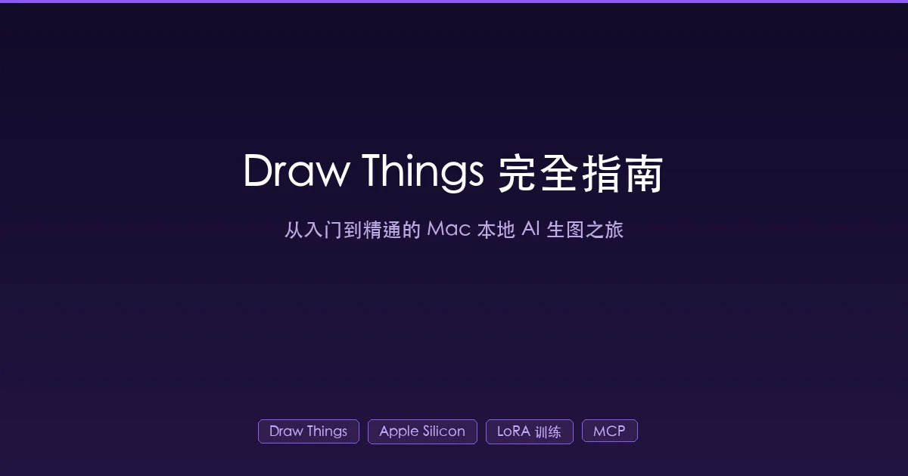

+++
date = '2026-02-15T12:00:00+08:00'
draft = false
title = 'Draw Things 完全指南：Mac 本地 AI 生图从入门到精通'
description = 'Draw Things 深度教程：从零开始学会 Mac 本地 AI 生图，涵盖模型选择、提示词技巧、ControlNet、本地 LoRA 训练、脚本自动化到 MCP 集成，小白到高手的完整进阶路线。'
toc = true
tags = ['Draw Things', 'AI 生图', 'Mac', 'LoRA', 'ControlNet']
categories = ['AI实战']
keywords = ['Draw Things 教程', 'Mac 本地生图', 'Apple Silicon AI', 'Draw Things LoRA 训练', 'Draw Things MCP']
+++



你有没有想过，手边那台 Mac 其实是一台**免费的 AI 画师工作站**？不用花钱订阅 Midjourney，不用把图片上传到云端，不用担心隐私泄露——只需要一个叫 **Draw Things** 的 App，你就能在 Mac 上本地生成任何风格的 AI 图像。

但大多数人对 Draw Things 的认知停留在"装上来，输入提示词，点生成"的阶段。它真正的能力远不止于此：**本地训练 LoRA 微调模型、JavaScript 脚本批量自动化、ControlNet 精确控图、通过 MCP 让 Claude Code 直接调用生图**……这些功能，很多用了半年的老用户都不知道。

这篇文章就是你需要的那份**从入门到精通的完整地图**。不管你是第一次接触 AI 生图的小白，还是已经用了很久的老手，我保证你都能从中学到新东西。

## 一、Draw Things 是什么？为什么选它？

### 1.1 一句话定义

Draw Things 是一款**完全免费**的 macOS / iOS 原生 AI 图像生成应用，所有计算在本地完成，无需联网，无需订阅。

### 1.2 它凭什么比其他工具好？

Mac 上能跑 AI 生图的工具不少——ComfyUI、DiffusionBee、Mochi Diffusion——但 Draw Things 有几个**独一无二**的优势：

| 对比维度 | Draw Things | ComfyUI | DiffusionBee |
|---------|------------|---------|-------------|
| **Apple 优化** | Metal FlashAttention（快 20-40%） | PyTorch MPS（通用） | 无特殊优化 |
| **安装方式** | App Store 一键 | Homebrew / DMG | DMG 下载 |
| **本地 LoRA 训练** | 支持 | 不支持 | 不支持 |
| **脚本自动化** | JavaScript API | 节点工作流 | 不支持 |
| **MCP 集成** | 有现成 MCP Server | 无 | 无 |
| **视频生成** | 支持 Wan 2.2 / Hunyuan | 支持 | 不支持 |
| **开发活跃度** | 持续更新 | 持续更新 | 停滞 1.5 年 |
| **价格** | 免费 | 免费 | 免费 |

最核心的一点：Draw Things 不是 Python 套壳。它用 **SwiftUI + 自研推理引擎 s4nnc** 从底层为 Apple Silicon 优化。这就好比别人是在 Mac 上跑 Windows 模拟器打游戏，Draw Things 是原生 macOS 游戏——性能差距是天然的。

### 1.3 Metal FlashAttention：速度秘密

Draw Things 的性能优势来自一项自研技术——**Metal FlashAttention**。

普通的注意力计算是这样的：先把整个注意力矩阵算出来（非常占内存），然后再做乘法。这就像考试时把所有草稿纸都摊开，桌子不够大就完蛋。

Metal FlashAttention 的做法是**逐行计算**：算一行、用一行、扔一行。桌子只需要放一行草稿纸的空间，但最终答案一样。

实际效果：

- M1 Pro 及以上芯片：比标准 CoreML GPU 快 **20-40%**
- 图像生成延迟降低 **43-120%**
- 内存占用显著降低

这意味着**同样的硬件，Draw Things 跑得比 ComfyUI 快**。

## 二、从零开始：5 分钟生成你的第一张图

### 2.1 安装

打开 App Store，搜索 **"Draw Things"**，点击安装。没了。

不需要装 Python，不需要开终端，不需要配环境变量。这也是我推荐它给新手的核心理由。

### 2.2 下载第一个模型

首次打开 Draw Things，你需要选择一个模型。模型就像画师的"画风"——不同模型擅长不同风格：

| 模型 | 适合场景 | 速度 | 内存需求 |
|------|---------|------|---------|
| **Flux.1 Schnell** | 万能快速出图 | 最快 | 16GB 可用 |
| **Juggernaut XL** | 写实人像 | 中等 | 16GB+ |
| **DreamShaper XL** | 插画/概念艺术 | 中等 | 16GB+ |
| **Flux.1 Dev** | 最高画质 | 较慢 | 24GB+ |
| **SD 1.5** | 轻量级入门 | 最快 | 8GB 可用 |

**新手推荐**：先下载 **Flux.1 Schnell**。它只需要 4 步就能生成高质量图片，速度快，效果好，是入门的最佳起点。

操作步骤：
1. 点击左侧模型区域的下拉菜单
2. 在列表中找到 "Flux.1 Schnell"
3. 点击云图标下载
4. 等待下载完成（约 5-10GB，取决于你的网速）

### 2.3 生成第一张图

模型下载好后：

1. 在**正向提示词**区域输入你想要的画面描述（英文效果更好）
2. 点击**生成**按钮
3. 等待几秒到几十秒
4. 图片出现！

一个简单的例子：

```
a cozy coffee shop interior, warm lighting, wooden tables,
bookshelves on walls, rain outside the window, anime style
```

恭喜，你已经会用 Draw Things 了。但这只是冰山一角。

## 三、提示词工程：从"能出图"到"出好图"

提示词（Prompt）是 AI 生图的灵魂。同一个模型，提示词写得好不好，出图质量天差地别。

### 3.1 提示词的基本结构

好的提示词遵循这个公式：

```
[主体] + [环境/场景] + [风格] + [光影] + [画质修饰] + [构图]
```

**示例**：

```
# 普通写法（结果平平）
a cat sitting on a table

# 进阶写法（效果惊艳）
a fluffy orange tabby cat sitting on a rustic wooden table,
cozy kitchen background with morning sunlight streaming through window,
soft bokeh, warm color palette, professional photography,
shallow depth of field, 8k resolution
```

### 3.2 负向提示词：告诉 AI 你不想要什么

负向提示词同样重要。它就像对画师说"别画成这样"：

```
# 通用负向提示词模板（适用于大多数场景）
blurry, low quality, deformed, ugly, bad anatomy,
bad hands, extra fingers, mutated hands, poorly drawn face,
watermark, text, signature, cropped
```

> **小技巧**：Flux 模型对负向提示词的敏感度较低，SDXL 模型则非常依赖负向提示词。如果用 SDXL 系列模型，一定要认真写负向提示词。

### 3.3 高手都在用的提示词技巧

**权重调整**

Draw Things 支持用括号调整关键词权重：

```
# 增加权重（更强调）
(golden hour lighting:1.3)

# 降低权重（弱化）
(background:0.7)
```

数值范围 0.1-2.0，默认为 1.0。1.3 表示比正常强 30%。

**风格关键词速查表**

| 想要的效果 | 推荐关键词 |
|-----------|----------|
| 电影感 | cinematic lighting, film grain, anamorphic |
| 动漫风 | anime style, cel shading, vibrant colors |
| 油画感 | oil painting, thick brushstrokes, impressionist |
| 赛博朋克 | cyberpunk, neon lights, rain-soaked streets |
| 极简风 | minimalist, clean lines, white space |
| 写实照片 | photorealistic, RAW photo, 35mm film |

**SDXL 的隐藏参数**

SDXL 模型支持第二个提示词区域（通常标记为"附加提示词"或"Prompt 2"）。很多人忽略了这个功能。第一提示词描述**内容**，第二提示词描述**风格和画质**，分工明确效果更好：

```
# 提示词 1（内容）
a samurai standing on a cliff overlooking a misty valley

# 提示词 2（风格）
masterpiece, best quality, extremely detailed, sharp focus,
professional digital painting, dramatic lighting
```

## 四、参数调优：懂这些就超过 80% 的用户

### 4.1 核心参数解读

| 参数 | 含义 | 推荐值 | 类比 |
|------|------|--------|------|
| **Steps** | 生成迭代次数 | 20-30 | 画师修改次数。越多越精细，但有收益递减 |
| **CFG Scale** | 提示词遵循程度 | 4.0-7.0 | "多听话"。太高会过拟合变丑 |
| **Seed** | 随机种子 | -1（随机） | 相同种子+相同参数=相同图片。找到满意的图后记下 seed 值 |
| **Image Size** | 输出分辨率 | 1024×1024 | 越大越慢。建议先小图调参，最后大图出图 |

### 4.2 采样器选择指南

采样器是 AI "画图"的算法。Draw Things 提供 19 种采样器，但你只需要记住这几个：

| 你的模型 | 推荐采样器 | 理由 |
|---------|----------|------|
| **SD 1.5 / v2** | DPM++ 2M Karras | 经典稳定，画质好 |
| **SDXL** | DPM++ SDE Karras | 细节丰富，适合写实 |
| **Flux.1** | Euler A Trailing | 专为 Flow 模型优化 |
| **SD3** | Euler A Trailing | 同上 |
| **视频（Wan 2.2）** | DDIM Trailing | 运动连贯性最好 |

> **高手技巧**：采样器名称中的关键词含义——
> - **Karras**：噪声调度器，加速收敛，约节省 20% 步数
> - **SDE**：随机微分方程，增加多样性和细节
> - **AYS**：自适应步长，用更少步数达到同等质量
> - **Trailing**：专为 Flow 模型（Flux、SD3）设计

### 4.3 被忽略的"加速"设置

**Optimize for Faster Loading（优化加载速度）**

在模型设置中有一个 "Optimize for Faster Loading" 选项。勾选后，Draw Things 会对模型进行一次预处理，之后每次加载速度显著提升。特别是对于 8GB 内存的设备，这个优化**必开**。

**Tiled Decoding（分块解码）**

默认情况下，解码器需要一次性处理整张图片，非常占内存。开启 Tiled Decoding 后，图片被分成小块逐一解码，大幅降低内存峰值。

适用场景：
- 8GB / 16GB 内存设备
- 生成大尺寸图片（如 2048×2048）
- 同时运行其他应用时

**Tiled Diffusion（分块扩散）**

与 Tiled Decoding 类似，但作用在生成阶段而非解码阶段。它将大图生成任务拆分成多个小块，每块独立生成后拼合。这使得**在 16GB 内存的 Mac 上生成 4K 级图片成为可能**。

## 五、ControlNet：让 AI 听你指挥

ControlNet 是从"随缘出图"跨越到"精确控图"的关键技术。简单来说，它允许你**给 AI 一个参考图**，告诉它"按照这个结构/姿势/轮廓来画"。

### 5.1 理解控制类型

| 控制类型 | 输入 | 用途 | 难度 |
|---------|------|------|------|
| **Scribble** | 手绘草图 | 把潦草草图变成精致作品 | 入门 |
| **Canny** | 边缘线条图 | 保持原图轮廓，换风格 | 入门 |
| **Depth** | 深度图 | 保持 3D 空间结构 | 中等 |
| **Pose** | 骨骼图 | 控制人物姿势 | 中等 |
| **Color Palette** | 色彩参考 | 控制配色方案 | 入门 |
| **IP Adapter** | 参考图片 | 保持风格一致性 | 进阶 |

### 5.2 实战：用 Scribble 把草稿变成插图

这是最适合**博客作者**的用法——你在纸上随手画一个构图草稿，拍照后让 AI 精修成精美插图。

操作步骤：
1. 在纸上画一个简单的构图草稿（火柴人级别就行）
2. 拍照或截图
3. 在 Draw Things 中打开 **Control** 标签
4. 选择 **Scribble** 模型
5. 上传你的草稿图
6. 写提示词描述你想要的最终效果
7. 生成！

**关键参数调整**：

- **Weight（权重）**：建议从 **0.7** 开始。1.0 会过于拘泥原图，0.5 则太自由
- **Control Importance**：选 **Balanced**（平衡），让 AI 在遵循控制和发挥创意之间取得平衡
- **Start/End**：建议设为 **0-0.7**。意思是在生成的前 70% 过程中参考控制图，后 30% 让 AI 自由发挥细节

### 5.3 高手必知：多重控制组合

Draw Things 支持**同时叠加多个 ControlNet**。比如：

```
Depth（控制空间结构）+ Canny（控制轮廓）+ Color Palette（控制配色）
```

这就像你同时给画师提供了"这是房间布局"、"这是物品轮廓"、"这是配色方案"三份参考——出图的可控性大幅提升。

> **注意**：控制模型的**添加顺序会影响结果**。建议把最重要的控制放在第一个。多重控制时，适当降低每个控制的权重（比如都设 0.5-0.6），避免过度约束导致画面僵硬。

## 六、本地训练 LoRA：打造你的专属模型

这是 Draw Things 最震撼的隐藏功能——**在你的 Mac/iPhone 上直接训练 LoRA 微调模型**。

### 6.1 什么是 LoRA？

LoRA（Low-Rank Adaptation）就像给基础模型装一个"滤镜插件"。基础模型是"万能画师"，LoRA 让它变成"专门画你的风格/角色/场景的画师"。

比如你可以训练一个 LoRA，让 AI 专门画你家的猫、你的卡通形象、或者你喜欢的特定插画风格。

### 6.2 训练准备

**需要什么**：
- 5-20 张高质量训练图片（同一主题/风格）
- Mac 至少 16GB 内存（24GB+ 更舒适）
- 30 分钟到 4.5 小时的训练时间（取决于配置）

**图片准备要点**：
- 图片风格、光线、质量要**一致**
- 如果是训练角色，准备不同角度的照片
- 分辨率至少 512×512
- 避免水印、文字干扰

### 6.3 训练步骤

1. 打开 Draw Things，进入 **PEFT** 标签页
2. 选择基础模型：
   - **SDXL Base 1.0**：推荐，平衡性好
   - **Flux.1 Dev**：画质最高，但吃内存
   - **Kwai Kolors**：效率高，训练快
3. 设置 LoRA 名称和**触发词**（trigger word）

```
# 示例：训练你的猫咪 LoRA
LoRA 名称：my_cat_mimi
触发词：mimi_cat

# 之后生图时只要在提示词中加入 mimi_cat，
# AI 就会画出你家的猫
```

4. 导入训练图片，配置标注

**自动标注技巧**：Draw Things 内置了 **Blip2** 和 **Moondream2** 两种自动标注模型：
- Blip2：简短描述，适合简单主题
- Moondream2：详细描述，适合复杂场景

标注生成后，记得在每条标注前面加上你的**触发词**。

5. 设置训练参数

| 参数 | SDXL 推荐值 | Flux 推荐值 |
|------|-----------|-----------|
| Network Dimension | 16 | 16 |
| 训练步数 | 1500-2000 | 1500-2000 |
| 学习率 | 0.0001 | 0.0004 |
| 图像分辨率 | 512×512 起 | 512×512 起 |

6. 开始训练，等待完成

### 6.4 训练进阶技巧

**500 步检查点法则**

不要傻等到 2000 步结束。在约 500-1000 步时暂停，用当前检查点测试效果。如果已经足够好，就可以停了。**过度训练（overfitting）是最常见的新手错误**——表现为生成的图片开始出现固定姿势、噪点、重复图案。

**QLoRA 省内存**

Draw Things 的一个技术突破是支持 **QLoRA**——在量化模型权重上直接训练 LoRA。LoRA 网络以 FP32 精度运行，基础模型以 FP16 运行。这意味着：

- **iPhone 15 Pro（6GB 可用内存）** 都能训练 SD 1.5 的 LoRA
- **Mac Mini M4 16GB** 可以舒适训练 SDXL LoRA
- 训练速度因 Metal FlashAttention 优化比理论值快很多

**Memory Saver 设置**

如果训练过程中内存吃紧，在训练设置中启用 **Memory Saver**：
- **Balanced**：兼顾速度和内存
- **Minimal**：最大程度省内存（速度会慢一些）

### 6.5 训练结果处理

训练完成后：
1. 在 LoRA Manager 中找到你的 LoRA
2. 量化为 **16-bit** 或 **8-bit** 格式（减小体积）
3. 在生图时加载 LoRA，提示词中包含触发词即可

```
# 使用训练好的 LoRA 生图
mimi_cat sitting on a windowsill, sunset background,
warm lighting, cozy atmosphere
```

## 七、脚本自动化：批量出图的秘密武器

这是 90% 的 Draw Things 用户不知道的功能——**JavaScript 脚本 API**。

### 7.1 脚本能干什么？

- 自动加载指定模型 + LoRA 组合
- 批量生成一系列图片（不同提示词、不同参数）
- 自动保存到指定目录
- 创建交互式参数面板
- 实现自定义工作流

### 7.2 四大全局对象

Draw Things 的脚本 API 提供四个核心对象：

```javascript
// 1. pipeline - 图像生成管线
pipeline.run({
  prompt: "a beautiful sunset over mountains",
  negativePrompt: "blurry, low quality",
  width: 1024,
  height: 1024,
  steps: 20,
  guidanceScale: 7.0,
  seed: -1  // -1 = 随机
});

// 2. canvas - 无限画布控制
canvas.clear();           // 清空画布
canvas.saveImage("output.png");  // 保存当前图片

// 3. filesystem - 文件系统访问
const picDir = filesystem.pictures.path;  // 获取图片目录路径

// 4. requestFromUser - 用户交互
// 创建参数输入面板（下面详细讲）
```

### 7.3 实战脚本：博客配图批量生成器

这个脚本可以一次性为多篇博客文章生成封面图：

```javascript
// 博客封面批量生成脚本
const covers = [
  {
    name: "ai-workflow",
    prompt: "futuristic workspace with holographic displays, " +
            "clean minimalist design, blue ambient lighting, " +
            "tech blog cover style, no text"
  },
  {
    name: "python-tips",
    prompt: "a python snake made of golden code characters, " +
            "dark background, matrix-style digital rain, " +
            "cinematic lighting, no text"
  },
  {
    name: "docker-guide",
    prompt: "blue whale carrying colorful containers on its back, " +
            "ocean scene, sunset, digital art style, " +
            "professional illustration, no text"
  }
];

// 逐一生成
for (const cover of covers) {
  pipeline.run({
    prompt: cover.prompt,
    negativePrompt: "text, watermark, blurry, low quality",
    width: 1200,
    height: 630,  // 社交媒体最佳比例
    steps: 20,
    guidanceScale: 6.0,
    seed: -1
  });
  // 图片会自动出现在画布上
  // 你可以手动保存或通过 canvas API 保存
}
```

### 7.4 脚本安装方法

1. 用文本编辑器写好 `.js` 脚本文件
2. 打开 Draw Things → Scripts 标签
3. 点击 "Add Script" → 选择你的文件
4. 运行！

Mac 上的脚本文件路径：
```
~/Library/Containers/Draw Things/Data/Scripts/
```

> **社区脚本宝库**：Draw Things 官方维护了一个 [community-scripts](https://github.com/drawthingsai/community-scripts) 仓库，里面有大量现成脚本可以直接用。

## 八、MCP 集成：让 Claude Code 帮你画图

这是最让人兴奋的玩法——通过 **MCP（Model Context Protocol）**，让 Claude Code 直接调用 Draw Things 生成图片。写博客时不用切换应用，AI 助手直接帮你出图。

### 8.1 配置步骤

**第一步：开启 Draw Things API Server**

1. 打开 Draw Things
2. 点击设置（齿轮图标）
3. 开启 **"API Server"**
4. 默认端口 `7860`

验证是否成功：
```bash
curl http://localhost:7860
# 如果返回响应，说明 API 已启动
```

**第二步：安装 MCP Server**

在终端中执行：
```bash
# 全局安装（所有项目可用，推荐）
claude mcp add -s user drawthings -- npx -y mcp-drawthings
```

然后重启 Claude Code。

**第三步：开始使用**

在 Claude Code 中，你现在可以直接说：

```
帮我生成一张博客封面图，主题是 Python 编程，科技风格，
深色背景，1200x630 尺寸
```

Claude Code 会自动调用 Draw Things 的 MCP 工具生成图片，并保存到 `~/Pictures/drawthings-mcp/` 目录。

### 8.2 MCP 提供的四个工具

| 工具 | 功能 | 使用场景 |
|------|------|---------|
| `check_status` | 检查 API 连接状态 | 排障 |
| `get_config` | 获取当前模型和设置 | 确认配置 |
| `generate_image` | 文生图 | 最常用 |
| `transform_image` | 图生图 | 风格转换、局部修改 |

### 8.3 环境变量配置

如果需要自定义，可以设置以下环境变量：

```bash
DRAWTHINGS_HOST=localhost     # API 地址（默认）
DRAWTHINGS_PORT=7860          # API 端口（默认）
DRAWTHINGS_OUTPUT_DIR=~/Pictures/drawthings-mcp  # 输出目录
```

> **实际工作流**：我现在写博客的流程是——用 Claude Code 写文章，需要配图时直接让它调 Draw Things 生成，图片自动保存，然后我检查一下效果，满意就直接引用到文章中。整个过程**不需要离开终端**。这是之前 ComfyUI 做不到的体验。

## 九、模型选择深度指南

### 9.1 模型家族速查

| 模型家族 | 特点 | 内存需求 | 推荐场景 |
|---------|------|---------|---------|
| **SD 1.5** | 经典，生态丰富 | 8GB+ | 轻量级使用，大量 LoRA 可用 |
| **SDXL** | 画质飞跃，细节丰富 | 16GB+ | 日常创作的主力 |
| **Flux.1 Schnell** | 4 步快速出图 | 16GB+ | 快速迭代，草稿阶段 |
| **Flux.1 Dev** | 最高画质 | 24GB+ | 最终成品，高质量需求 |
| **Z-Image-Turbo** | 资源消耗低，速度快 | 16GB+ | 资源受限环境 |
| **Kwai Kolors** | 中文理解好 | 16GB+ | 中文提示词场景 |

### 9.2 量化模型：小内存的救星

如果你的 Mac 内存不大（16GB），**量化模型**是必须了解的概念。

量化就像图片压缩——原图是 BMP（巨大但无损），量化后变成 JPEG（小很多，画质略降）。具体到模型：

| 量化级别 | 体积（Flux Dev 举例） | 画质 | 推荐配置 |
|---------|---------------------|------|---------|
| FP16 原始 | ~24GB | 最佳 | 48GB+ |
| 8-bit | ~13GB | 接近无损 | 32GB+ |
| **Q6_K** | **~10GB** | **推荐** | **24GB** |
| Q4_KS | ~7GB | 有损失 | 16GB |

在 Draw Things 中使用量化模型：设置 → 模型 → 选择 **8-bit** 选项，或者在下载模型时选择量化版本。

### 9.3 LoRA 获取渠道

| 来源 | 特点 | 地址 |
|------|------|------|
| **Civitai** | 最大的 LoRA 社区 | [civitai.com](https://civitai.com/) |
| **HuggingFace** | 开发者友好 | [huggingface.co](https://huggingface.co/) |
| **Draw Things 内置** | 直接下载，无需导入 | App 内浏览 |

导入外部 LoRA：设置 → LoRA → Manage → Import → 选择文件或粘贴 URL。

## 十、性能优化：榨干你的 Mac

### 10.1 按内存分级的最佳配置

**8GB Mac（M1 Air 等）**：

```
模型：SD 1.5（8-bit 量化）
采样器：DPM++ 2M Karras
步数：15-20
分辨率：512×512
必开：Tiled Decoding、Optimize for Faster Loading
```

**16GB Mac（M2/M4 Mac Mini 基础版）**：

```
模型：SDXL（8-bit）或 Flux.1 Schnell
采样器：DPM++ SDE Karras（SDXL）/ Euler A Trailing（Flux）
步数：20-25
分辨率：1024×1024
建议开：Tiled Decoding
```

**24GB+ Mac（M4 Pro 等）**：

```
模型：Flux.1 Dev（Q6_K 量化）或 SDXL（FP16）
采样器：按模型推荐选择
步数：20-30
分辨率：1024×1024 - 2048×2048
Tiled Diffusion：可选，生成超大图时开启
```

### 10.2 "先小后大"工作法

高手都用这个流程节省时间：

1. **小图快速试错**（512×512，15 步）—— 找到满意的构图和色调
2. **记下 Seed 值** —— 锁定这个随机种子
3. **放大分辨率重新生成**（1024×1024，25 步）—— 用同样的 seed 出高清版
4. **Upscale 放大**（如需要）—— 用内置 ESRGAN 超分到 2048 甚至 4096

这比一开始就用大分辨率出图，效率提升 **3-5 倍**。

### 10.3 Metal FlashAttention v2 开启确认

确保你的 Draw Things 版本已启用 Metal FlashAttention v2。在设置中查找相关选项。如果你的设备支持（M1 及以上），这个优化默认开启，但值得确认一下。

v2 版本相比 v1 额外减少 **20-25% 的内存占用**，在训练 LoRA 时效果尤为明显。

## 十一、高手才知道的隐藏技巧

### 11.1 Moodboard 多图参考

Draw Things 有一个强大但鲜为人知的功能——**Moodboard**。你可以同时放多张参考图，AI 会综合所有图片的风格元素来生成新图。

使用场景：你有 3-4 张喜欢的插画风格图片，想让 AI 融合这些风格画一张新图。把它们都放到 Moodboard 中，配合 IP Adapter 使用，效果惊人。

### 11.2 PuLID 面部转移

PuLID 是 Draw Things 支持的一种面部控制技术。它能让生成的人物保持特定的面部特征，同时变换场景、服装、风格。适合需要人物一致性的系列插图创作。

### 11.3 视频生成

是的，Draw Things 不只能生图，还能**生视频**。支持的模型包括：

- **Wan 2.2 5B**：文字描述生成短视频
- **Hunyuan Video**：高质量视频生成
- **Stable Video Diffusion**：图片到视频的转换

视频生成对硬件要求更高，建议 24GB+ 内存。

### 11.4 Bridge Mode

Draw Things 的 API Server 支持 **Bridge Mode**。这意味着你可以将一台高配 Mac（比如 Mac Studio）作为渲染服务器，其他设备（MacBook、iPad、iPhone）通过网络发送生图请求。

家里有两台 Mac 的用户可以这样搭配：
- Mac Mini M4 Pro 跑 Draw Things API Server
- MacBook Air 上写代码 / 写文章时远程调用生图

### 11.5 iCloud 同步

Draw Things 支持通过 iCloud 同步设置和预设。你在 Mac 上调好的参数组合，打开 iPad 或 iPhone 版的 Draw Things 就能直接用。出门在外用 iPad 灵感来了也能快速出图。

## 十二、常见问题排坑

### Q1：生成的人物手指总是畸形怎么办？

这是 AI 生图的经典问题。解决方案：
1. 负向提示词加入 `bad hands, extra fingers, mutated hands`
2. 使用 SDXL 或 Flux 模型（比 SD 1.5 强很多）
3. 配合 **Pose ControlNet** 约束手部姿势
4. 适当提高 Steps（25-30 步）

### Q2：出图颜色总是偏暗/偏灰？

在提示词中明确光线和色彩：
```
vibrant colors, bright lighting, high contrast, colorful
```
同时检查 CFG Scale 是否设得太高（>10 容易偏灰）。

### Q3：下载的 LoRA 加载后没效果？

检查两点：
1. LoRA 对应的**基础模型是否匹配**（SDXL 的 LoRA 不能用在 SD 1.5 上）
2. 提示词中是否包含了 LoRA 的**触发词**

### Q4：训练 LoRA 中途内存不足崩溃？

1. 降低训练分辨率到 512×512
2. 启用 **Memory Saver（Minimal）**
3. 关闭其他应用释放内存
4. 使用 8-bit 量化的基础模型
5. 减小 Network Dimension（8 而非 16）

### Q5：API Server 开启后 Claude Code 连不上？

按顺序排查：
1. Draw Things 是否在运行？API Server 是否打开？
2. `curl http://localhost:7860` 是否有响应？
3. 模型是否已加载？（未加载模型时生成会失败）
4. MCP Server 是否正确安装？重启 Claude Code 试试

## 总结

Draw Things 是 Mac 上**被严重低估**的 AI 生图工具。它不只是一个"能生成图片的 App"——它是一个完整的本地 AI 图像创作平台：

- **新手**：App Store 安装 → 下载模型 → 输入提示词 → 出图，5 分钟上手
- **进阶**：掌握 ControlNet 精确控图、采样器调优、提示词工程，出图质量翻倍
- **高手**：本地训练 LoRA 打造专属模型、JavaScript 脚本批量自动化、MCP 集成到 AI 工作流
- **极客**：Bridge Mode 搭建本地渲染集群、API Server 对接任意工具链

最重要的是——**这一切完全免费，完全本地，完全隐私**。

如果这篇文章对你有帮助，建议收藏并实际动手试试。AI 生图这个技能，只有自己生成过 100 张图之后，才会真正"手感上身"。去画吧！

## 相关阅读

- [Mac Mini 本地 AI 生图选型指南：ComfyUI、DiffusionBee、Draw Things 深度对比](/posts/ai/2026-02-15-mac-mini-local-image-generation/)
- [AI 工作流实战指南：不是未来，是现在](/posts/ai/2026-01-30-ai-workflow-real-guide/)
- [Claude Code 最佳实践：从入门到精通的完整指南](/posts/ai/2026-01-06-claudecode-best-practices/)
- [Claude Code 浏览器自动化实战：用 AI 操控网页的完整指南](/posts/ai/2026-01-28-claude-code-browser-automation/)
