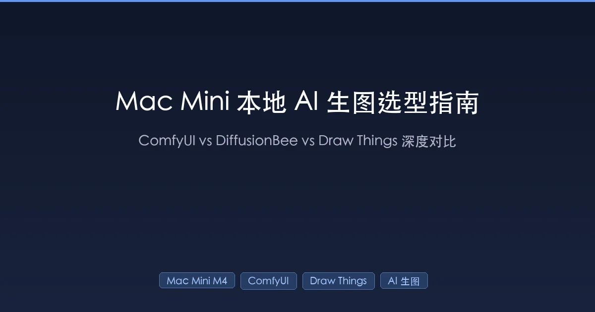

+++
date = '2026-02-15T00:30:00+08:00'
draft = false
title = 'Mac Mini M4 AI Image Generation 2026: ComfyUI vs Draw Things (24GB/48GB Flux 50s Benchmark)'
description = 'Flux 1024×1024 in 50 seconds on Mac Mini M4 Pro 24GB — full benchmark of ComfyUI, Draw Things, DiffusionBee. Draw Things beats ComfyUI by 20% on Apple Silicon; 48GB unlocks FP16. Setup guide + GGUF quantization picks for 16GB/24GB/48GB.'
toc = true
tags = ['Mac Mini', 'AI Image Generation', 'ComfyUI', 'Draw Things', 'Stable Diffusion', 'Flux']
categories = ['AI Guides']
keywords = ['mac mini m4 ai image generation 2026', 'comfyui vs drawthings', 'ComfyUI vs Draw Things', 'Draw Things vs ComfyUI', 'local ai image generation mac', 'Apple Silicon AI image generation', 'Flux Mac Mini 48GB', 'Flux Mac Mini M4', 'Mac Mini local image generation', 'ComfyUI Mac setup', 'Draw Things review', 'local AI image generator 2026', 'best Mac AI art tool', 'GGUF quantization Flux', 'Mac Mini M4 Stable Diffusion', 'Mac Mini 24GB Flux benchmark', 'Draw Things Metal FlashAttention']

[[params.faqItems]]
question = "Can a Mac Mini M4 run local AI image generation?"
answer = "Yes. The Mac Mini M4's Apple Silicon uses unified memory where CPU and GPU share the same pool. The 16GB model runs SD 1.5 and SDXL smoothly, while the 24GB model handles Flux via GGUF quantization. Draw Things and ComfyUI are the recommended tools."

[[params.faqItems]]
question = "What is the best free AI image generation tool for Mac in 2026?"
answer = "Draw Things is the top recommendation. It is an Apple-native app (SwiftUI + Metal FlashAttention) that runs roughly 20% faster than ComfyUI on Apple Silicon, supports Flux, SDXL, and other mainstream models, and is free on the App Store. ComfyUI is better for advanced users needing complex workflows."

[[params.faqItems]]
question = "Is 16GB RAM enough for AI image generation on Mac?"
answer = "16GB handles SD 1.5 and SDXL smoothly but only runs Flux at Q4 quantization with noticeable quality loss and slower speeds. If you plan to regularly generate high-quality images with Flux, 24GB is the comfortable starting point."

[[params.faqItems]]
question = "How does Mac AI image generation speed compare to NVIDIA GPUs?"
answer = "Apple Silicon is roughly 3-5x slower than RTX 4090 and 2-3x slower than RTX 4070, but 10-50x faster than CPU-only rendering. The Mac advantage is unified memory that can run models exceeding traditional VRAM limits, plus far smaller size, lower power consumption, and less noise."

[[params.faqItems]]
question = "Draw Things vs ComfyUI: which should I choose on Mac?"
answer = "Choose Draw Things for ease of use, Apple-native optimization, and faster performance on Apple Silicon. Choose ComfyUI if you need complex node-based workflows, the broadest model support, or API-driven automation. Both can be installed simultaneously."

[[params.faqItems]]
question = "Is a 48GB Mac Mini M4 Pro worth it for Flux image generation?"
answer = "Yes, if Flux is your primary workload. 48GB lets you run Flux.1 Dev at full FP16 (~24GB model) without quantization, eliminating any quality loss and enabling faster batch generation. On 24GB you are forced into Q6_K GGUF quantization (still excellent quality, ~50–90s per 1024×1024 image). The 48GB upgrade also future-proofs you for FLUX.2 and larger video models like Hunyuan. For SDXL-only workflows, 24GB is plenty."
+++



In 2026, **local AI image generation on a Mac Mini M4** is not just possible — it's practical. A 24GB Mac Mini M4 Pro can generate a 1024×1024 image with Flux in about 50 seconds, with zero API costs and all data staying on your machine.

But which tool should you use? I benchmarked **ComfyUI, DiffusionBee, and Draw Things** on my Mac Mini M4 Pro, running hundreds of generations and tracking speed, memory usage, and real-world experience. The results: one tool has been abandoned, and another outperforms ComfyUI by over 20% on Apple Silicon.

This guide covers architecture, performance data, model support, and hands-on experience to help you make the right **local AI image generation choice in 2026** — whether you're a blogger, indie developer, or designer.

## Why Run AI Image Generation Locally on Mac Mini?

Before diving into tools, let's address the fundamental question: **why not just use Midjourney or DALL-E?**

### The Case for Local Generation

| Factor | Cloud Services | Local Generation |
|--------|---------------|-----------------|
| **Privacy** | Images uploaded to cloud servers | All data stays on your machine |
| **Cost** | Monthly/per-image fees add up | One-time hardware cost, unlimited use |
| **Speed** | Depends on queue and network | Consistent, no waiting |
| **Freedom** | Platform content restrictions | Full control, no censorship |
| **Offline** | Requires internet | Works without connectivity |
| **Customization** | Limited to platform models | Load custom LoRAs and fine-tuned models |

### Why Apple Silicon Works for This

Many people assume AI image generation requires an NVIDIA GPU. Apple Silicon's **Unified Memory Architecture** changes that equation.

On a traditional PC, the GPU has dedicated VRAM separate from system RAM, requiring data transfers between the two. Mac Mini M4's unified memory means:

> **CPU and GPU share the same memory pool** — the GPU can directly access all system memory, eliminating the "not enough VRAM" bottleneck.

Think of it this way: a traditional PC shuttles data between two warehouses, while a Mac has one large warehouse where everyone grabs what they need. A 24GB Mac Mini M4 Pro lets the GPU utilize most of that memory for model loading — critical for memory-hungry models like Flux.

Combined with Apple's **Metal Performance Shaders (MPS)** and **Core ML** frameworks for native ML acceleration, the Mac Mini M4 is a capable local AI image generation workstation.

### Hardware Configurations and Capabilities

| Mac Mini Config | SD 1.5 | SDXL | Flux.1 | Best For |
|----------------|--------|------|--------|----------|
| **M4 / 16GB** | Smooth | Smooth | Requires Q4 quantization, slow | Light use, blog images |
| **M4 Pro / 24GB** | Fast | Fast | Q6_K quantization, moderate speed | Daily creation, medium batches |
| **M4 Pro / 48GB** | Very fast | Very fast | FP16 runs well, fast | Professional creation, batch production |
| **M4 Max / 64GB+** | Very fast | Very fast | FP16 smooth, supports batching | Workstation-grade |

> **Key insight**: macOS itself uses 1-2GB of unified memory, so a 16GB Mac Mini has roughly 14GB available for AI workloads. If you plan to use Flux models regularly, **24GB is the comfortable starting point**.

## Three Tools at a Glance

For local AI image generation on Mac, three tools deserve serious comparison:

| Feature | ComfyUI | DiffusionBee | Draw Things |
|---------|---------|-------------|-------------|
| **Type** | Node-based workflow engine | GUI desktop app | Native macOS/iOS app |
| **Architecture** | Python + PyTorch MPS | Electron + Python | SwiftUI + CoreML/Metal |
| **Learning Curve** | Steep | Very easy | Moderate |
| **Model Support** | Broadest | SD series + Flux | SD/SDXL/Flux/Z-Image |
| **Extensibility** | Excellent (custom nodes) | Limited | Moderate |
| **Mac Optimization** | Basic (MPS backend) | Basic | Best (Metal FlashAttention) |
| **Development Activity** | Very active | Stalled (no updates since Aug 2024) | Active |
| **Installation** | Moderate (has desktop version) | Drag-and-drop | App Store |

Let's break each one down.

## ComfyUI: The Most Powerful Generation Engine

### What It Is

[ComfyUI](https://github.com/comfyanonymous/ComfyUI) is an open-source, node-based image generation workflow engine. If other tools are point-and-shoot cameras, ComfyUI is a full-manual DSLR — you control every step of the generation pipeline.

Its interface is a visual **node editor**: each node represents an operation (load model, set prompt, sample, decode, etc.), connected by wires that pass data between them. Instead of typing a prompt and waiting, you build an entire **processing pipeline** from model loading to final output.

### Installation on macOS

ComfyUI offers a [macOS desktop version](https://docs.comfy.org/installation/desktop/macos) (currently Beta) with a simplified setup:

1. Download the DMG installer (or run `brew install comfyui`)
2. Select **MPS** (Metal Performance Shaders) as the GPU backend on launch
3. Choose an installation path; it auto-configures Python and dependencies
4. Enter the node editor once setup completes

> **Note**: The ComfyUI desktop version **only supports Apple Silicon** — Intel Macs are not compatible. Requires at least 5GB of free disk space.

### Key Strengths

**Broadest Model Support**

ComfyUI supports virtually every mainstream image generation model: SD 1.5, SD 2.x, SDXL, Flux.1 (Dev/Schnell), Z-Image-Turbo, Kolors, and more. The [ComfyUI-GGUF](https://github.com/city96/ComfyUI-GGUF) plugin adds support for GGUF quantized models — essential for memory-constrained Macs.

**GGUF quantization is the lifeline for Mac users.** Taking Flux.1 Dev as an example:

| Quantization Level | File Size | Quality | Speed | Recommended Config |
|-------------------|-----------|---------|-------|--------------------|
| FP16 (original) | ~24GB | Best | Slow | 48GB+ RAM |
| Q8 | ~13GB | Near-lossless | Slower | 32GB+ RAM |
| **Q6_K** | **~10GB** | **Best balance** | **Moderate** | **24GB RAM** |
| Q4_KS | ~7GB | Some degradation | Faster | 16GB RAM |
| Q2_K | ~4GB | Noticeable loss | Fastest | 16GB RAM (emergency) |

> **From testing**: Q6_K is the sweet spot for most Mac users. Quality loss is virtually imperceptible, while memory usage drops significantly. For 16GB machines, Q4_KS paired with a quantized T5 text encoder is the optimal combination.

**Rich Node Ecosystem**

ComfyUI's killer feature is its custom node ecosystem. The community has built thousands of nodes covering:

- **ControlNet**: Precise control over composition, poses, edges
- **IP-Adapter**: Style control using reference images
- **TeaCache**: 30-50% generation speedup (ideal for drafts)
- **AnimateDiff**: Animation generation
- **Upscale**: Super-resolution upscaling

### Performance Benchmarks (Mac)

On an M4 Pro with 24GB, with MPS backend properly configured:

- **Flux.1 Dev Q6_K** (1024×1024, 20 steps): ~**50-90 seconds/image**
- **SDXL** (1024×1024, 25 steps): ~**20-40 seconds/image**
- **SD 1.5** (512×512, 20 steps): ~**5-10 seconds/image**
- **Z-Image-Turbo** (1024×1024, 9 steps): ~**60-80 seconds/image**

> **Troubleshooting tip**: If Flux generation is extremely slow (e.g., 1 hour per image), PyTorch is likely not using the GPU. This is a [known issue](https://github.com/Comfy-Org/ComfyUI/issues/6969) — usually caused by installing the CPU-only PyTorch build. Make sure you have the MPS-enabled PyTorch nightly version installed.

### Drawbacks

- **Steep learning curve**: Node-based workflows are not beginner-friendly; requires understanding the Stable Diffusion pipeline
- **Non-native Mac optimization**: Runs through PyTorch MPS backend, less efficient than native CoreML/Metal implementations
- **Heavy resource usage**: Python environment + model files easily consume 20GB+ of disk space
- **Beta status**: macOS desktop version is still unstable with occasional crashes

## DiffusionBee: The Simplest Entry Point

### What It Is

[DiffusionBee](https://diffusionbee.com/) is an AI image generation app designed specifically for Mac, aiming to make **Stable Diffusion as easy as any regular Mac app**. Built with Electron, it provides a complete GUI — no command line required.

### Installation and Usage

The installation process is the simplest of all three tools:

1. Download the DMG from [GitHub Releases](https://github.com/divamgupta/diffusionbee-stable-diffusion-ui/releases)
2. Drag to Applications folder
3. Default model downloads automatically on first launch
4. Type a prompt, click generate

No Python, no terminal, no technical knowledge required.

### Feature Overview

DiffusionBee 2.5.3 supports:

- **Text to Image**
- **Image to Image**
- **Inpainting**
- **Outpainting**
- **Upscaling**
- **Custom model loading**: SD 1.x, SD 2.x, SDXL
- **LoRA support**: Multiple LoRAs simultaneously
- **Flux.1 support** (ARM64 / macOS 13+ only)

### The Critical Problem: Development Has Stopped

Here's the **key fact** you need to know:

> **DiffusionBee's last update was August 14, 2024 (v2.5.3). As of February 2026, it has gone over 1.5 years without a new release.**

In a field that moves as fast as AI image generation, 1.5 years of stagnation means:

- **Incomplete Flux.1 support**: Users report [Flux features not working](https://github.com/divamgupta/diffusionbee-stable-diffusion-ui/issues/559)
- **No GGUF quantized model support**: Unfriendly to memory-constrained Macs
- **Missing newer models**: Z-Image-Turbo, SD3.5, FLUX.2 are unavailable
- **Unfixed bugs**: Known issues remain unresolved
- **No in-app updates**: Users must manually download new versions

It's like buying a car whose manufacturer has stopped all service and maintenance. It still runs for now, but the risk grows over time.

### Performance Reference

On M4 Pro 24GB:

- **Flux Dev** (704×704, 25 steps): ~**6 minutes/image**
- **SDXL** (1024×1024, 25 steps): ~**1-2 minutes/image**
- **SD 1.5** (512×512, 20 steps): ~**15-30 seconds/image**

Middling performance overall. Without GGUF support or modern optimization techniques, Flux performance lags significantly behind the other tools.

### Who Should Use It?

DiffusionBee remains viable only if you meet **all** of these conditions:

- You only need basic SD 1.5 / SDXL functionality
- You don't need Flux or newer models
- Performance isn't a priority
- You want zero-configuration setup

Honestly, given the stalled development, **I don't recommend DiffusionBee for new users as a primary tool**.

## Draw Things: The Underrated Apple-Native Choice

### What It Is

[Draw Things](https://drawthings.ai/) is an AI image generation app built specifically for the Apple ecosystem, supporting iPhone, iPad, and Mac. It's not a Python wrapper — it uses **SwiftUI + a custom inference engine (s4nnc)** deeply optimized for Apple Silicon from the ground up.

If ComfyUI is a "custom race car" and DiffusionBee is an "automatic family sedan," Draw Things is the "factory performance edition" — maintaining ease of use while delivering hardware-optimized performance.

### Deep Dive into the Architecture

Draw Things' performance edge comes from two core technologies:

**Metal FlashAttention**

This is Draw Things' proprietary technology. Standard attention computation generates a full attention matrix (very memory-intensive), while FlashAttention computes **row by row**, dramatically reducing memory usage while improving speed.

Draw Things' Metal FlashAttention implementation includes:

- Overlapped execution of computation and memory loading via `simdgroup_async_copy` API
- Automatic detection of attention matrix sparsity, skipping unnecessary calculations
- On M1 Pro and above, **20-40% faster** than standard CoreML GPU implementation

Benchmark data:

| Chip | Standard MPS | Metal FlashAttention | Speedup |
|------|-------------|---------------------|---------|
| M1 | ~15.2s | ~12.8s | ~19% |
| M1 Pro/M2 Pro | Baseline | 20-40% faster | Significant |
| M3/M4 | Baseline | 20%+ faster | Notable |

**CoreML Integration**

Draw Things supports both CoreML (leveraging Apple's Neural Engine/ANE) and Metal (direct GPU compute). In some scenarios, the CoreML path can utilize the ANE for acceleration, freeing GPU resources:

- **M1/M2 base models**: CoreML + ANE path may be faster
- **M1 Pro and above**: Metal FlashAttention typically wins

The app automatically selects the optimal path based on your hardware — no manual configuration needed.

### Feature Highlights

- **Comprehensive model support**: SD 1.5, SDXL, Flux.1, Z-Image, Qwen Image, FLUX.2, even Hunyuan video generation
- **Full ControlNet suite**: Canny, Depth, Pose, Scribble, and more
- **Local LoRA training**: Train LoRAs directly on your Mac without cloud services
- **Image-to-image and inpainting**: Complete editing capabilities
- **Simple model management**: Select a model and it downloads automatically
- **Optimize for Faster Loading**: One-click model loading optimization
- **Cross-device sync**: Parameters tuned on Mac sync to iPhone/iPad

### Performance

Draw Things performance across Apple Silicon devices:

| Device / RAM | SD 1.5 (512×512) | SDXL (1024×1024) | Flux.1 |
|-------------|-----------------|-----------------|--------|
| 8GB (M1 Air) | Smooth (~15s) | Usable (needs quantization) | Slow but works (needs quantization) |
| 16GB (M2 Pro) | Fast | Good | Requires 8-bit quantization |
| 24GB (M3/M4 Pro) | Very fast | Fast | Runs smoothly |
| 36GB+ (M4 Max) | Very fast | Very fast | Best experience |

Thanks to Metal FlashAttention, Draw Things on identical hardware typically runs **20% or more faster** than ComfyUI (PyTorch MPS backend).

### Why It's Underrated

Draw Things has far less name recognition than ComfyUI or Stable Diffusion WebUI, but it has several unique advantages:

1. **Genuine Apple-native optimization**: Not a Python wrapper — optimized from the ground up for Metal/CoreML
2. **Apple endorsement**: Apple featured Draw Things alongside Final Cut Pro and DaVinci Resolve during the M5 iPad Pro launch
3. **Active engineering blog**: The team shares technical details at [engineering.drawthings.ai](https://engineering.drawthings.ai/)
4. **App Store distribution**: One-click install, automatic updates, no Python environment headaches
5. **Minimal memory footprint**: Using the ANE path, the app itself consumes only ~150MB of RAM

## Head-to-Head Comparison: Same Machine, Same Task

For a concrete comparison, consider a **real-world scenario**: generating a 1024×1024 tech-style cover image for a blog post.

### Workflow Comparison

**ComfyUI workflow**:

```
Open browser → Load/connect nodes → Configure KSampler parameters
→ Set CLIP text encoding → Connect VAE decoder → Click Queue Prompt
→ Wait for generation → Manually save image
```

Steps: ~**8-10** (reducible to 3-4 with saved workflow templates)

**DiffusionBee workflow**:

```
Open app → Enter prompt → Select model → Adjust parameters → Click generate → Save
```

Steps: ~**4-5**

**Draw Things workflow**:

```
Open app → Select model → Enter prompt → Adjust parameters (optional) → Click generate → Save
```

Steps: ~**4-5**

### End-to-End Experience

| Stage | ComfyUI | DiffusionBee | Draw Things |
|-------|---------|-------------|-------------|
| First install | 10-20 minutes | 5 minutes | 2 minutes (App Store) |
| Model download | Manual download to specific directory | In-app selection | One-click in-app download |
| Learning cost | High (must understand nodes) | Low | Medium (feature-rich but clear UI) |
| Prompt input | Node-based | Text field | Text field |
| Batch generation | Queue system, efficient | One at a time | Supports batching |
| Iteration | Modify node parameters, re-run | Adjust parameters, re-run | Tweak and re-run directly |
| Style consistency | Through workflow templates | Limited | Through presets |

## Decision Tree: Which Tool Should You Choose?

If you want a quick answer without reading all the analysis above:

```
Do you need to build complex image generation pipelines?
├── Yes → ComfyUI (maximum flexibility, requires learning investment)
│
└── No → Is your Mac Apple Silicon?
    ├── No → Limited options, consider cloud services
    │
    └── Yes → Do you need the latest models and best performance?
        ├── Yes → Draw Things (native optimization, comprehensive model support)
        └── No → Do you only need basic SD 1.5/SDXL?
            ├── Yes → DiffusionBee (but note: development has stalled)
            └── No → Draw Things
```

### Recommendations by User Type

| User Type | Primary | Alternative | Reasoning |
|-----------|---------|-------------|-----------|
| **Bloggers** (cover images) | Draw Things | ComfyUI | Fast output, rich models, no fuss |
| **Designers** (precise control) | ComfyUI | Draw Things | ControlNet + custom workflows |
| **Developers** (automation) | ComfyUI | — | API access, scriptable workflows |
| **Complete beginners** | Draw Things | — | App Store install, intuitive UI |
| **Batch production** | ComfyUI | — | Queue system + node automation |

## Blog Image Creation in Practice: My Recommended Setup

Back to the question you care about most: **which tool works best for blog cover images?**

### Recommended Combo: Draw Things + SDXL/Flux

For blog imagery, I recommend **Draw Things** as the primary tool:

1. **Fast generation**: Apple-native optimization means SDXL images in tens of seconds
2. **Complete model library**: SDXL for illustrations/concept art, Flux for photorealism
3. **Zero setup cost**: Download from App Store, pick a model, start generating
4. **Active development**: Keeps up with new model releases

### Practical Tips for Blog Images

**Choosing the right model**:

- **Tech blog covers**: SDXL + tech-style LoRA, or Flux.1 Schnell (faster)
- **Tutorial step images**: SD 1.5 + ControlNet Scribble (turn rough sketches into polished illustrations)
- **Concept diagrams**: SDXL + style-specific LoRA
- **Photorealistic scenes**: Flux.1 Dev (highest quality, slower generation)

**Efficient prompt structure**:

```
# Good prompt structure
"[subject], [style], [details], [lighting], [composition]"

# Example: tech blog cover
"a futuristic workspace with holographic displays,
 minimalist tech illustration style,
 clean lines and geometric shapes,
 soft blue ambient lighting,
 centered composition, dark background"
```

**Batch generation strategy**:

1. Start with **Flux.1 Schnell** (4-step fast generation) to nail composition and color palette
2. Once you've found the direction, switch to **Flux.1 Dev** (20-step high quality) for refinement
3. Finally, use **RealESRGAN** super-resolution to upscale to your target dimensions

### When You Need More Control

When Draw Things can't meet your needs — for example, if you need automated image generation pipelines or very precise compositional control — **ComfyUI is your upgrade path**.

ComfyUI workflows save as JSON files, meaning you can:

- Save your go-to blog image workflow as a template
- Generate images quickly by just swapping the prompt
- Automate generation through the API

> **Advanced tip**: You can take this further by using [Claude Code to drive Draw Things for automated image generation workflows](/posts/ai/2026-02-16-claude-code-draw-things-workflow/), letting AI handle everything from prompt generation to batch output. This leverages [Claude Code's browser automation capabilities](/posts/ai/2026-01-28-claude-code-browser-automation/).

## Recommended Hardware (What the Benchmarks Point To)

If you are buying a Mac specifically for local image generation, the benchmarks in this article point to three configurations:

- **[Mac mini M4, 24GB unified memory](https://www.amazon.com/s?k=Mac+mini+M4+24GB&tag=heyuan110-20)** — the price/performance sweet spot: Flux 1024×1024 in ~50s, handles SDXL and GGUF-quantized Flux comfortably
- **[Mac mini M4 Pro, 48GB](https://www.amazon.com/s?k=Mac+mini+M4+Pro+48GB&tag=heyuan110-20)** — unlocks FP16 Flux and comfortable LoRA training headroom
- **[Portable NVMe SSD, 2TB](https://www.amazon.com/s?k=Samsung+T9+portable+SSD+2TB&tag=heyuan110-20)** — model checkpoints eat 20-40GB each; keep them off your system drive

*As an Amazon Associate I earn from qualifying purchases. Links open Amazon search so you can pick the exact configuration.*

## Quick Installation Guide

### Draw Things (Recommended)

```bash
# Option 1: App Store (recommended, automatic updates)
# Search "Draw Things" and download

# Option 2: Direct download
# https://drawthings.ai/downloads/
```

First steps after installation:
1. Open the app
2. Click the model selection area on the left
3. Choose "Juggernaut XL" (recommended SDXL model) or "Flux.1 Schnell"
4. Wait for download to complete
5. Enter a prompt and click generate

### ComfyUI

```bash
# Option 1: Homebrew (recommended)
brew install comfyui

# Option 2: Official DMG
# Download from: https://download.comfy.org/mac/dmg/arm64
```

Key setup steps:
1. GPU selection → **MPS** (do not choose CPU)
2. Install [ComfyUI-GGUF](https://github.com/city96/ComfyUI-GGUF) node (for quantized model support)
3. Download recommended model: Flux.1 Dev Q6_K GGUF (~10GB)
4. Install [ComfyUI Manager](https://github.com/ltdrdata/ComfyUI-Manager) for custom node management

### DiffusionBee (Not Recommended for New Users)

```bash
# Download from GitHub
# https://github.com/divamgupta/diffusionbee-stable-diffusion-ui/releases/tag/2.5.3
```

## Troubleshooting Common Issues

### Q1: Is it normal for one image to take several minutes?

**It depends.** On a Mac Mini M4:
- SD 1.5 (512×512): 10-30 seconds is normal
- SDXL (1024×1024): 30-90 seconds is normal
- Flux.1 Dev (1024×1024): 1-3 minutes is normal

If Flux takes over 10 minutes, you're almost certainly **not using GPU acceleration**. Check whether your PyTorch installation includes MPS support.

### Q2: Is 16GB of RAM enough?

**Yes, with limitations.** 16GB runs SD 1.5 and SDXL smoothly. For Flux, you'll need GGUF Q4 quantized models, which sacrifice some quality. If budget allows, **24GB is the more comfortable choice**.

### Q3: How much slower is Mac compared to NVIDIA GPUs?

Honestly, Apple Silicon is slower than comparable NVIDIA GPUs for AI image generation:

- Roughly **3-5x slower** than RTX 4090
- Roughly **2-3x slower** than RTX 4070
- But **10-50x faster** than CPU-only rendering

The Mac advantage is **unified memory** — you can run models that exceed traditional GPU VRAM limits. Plus, the Mac Mini's size, power consumption, and noise levels are far superior to a traditional GPU workstation.

### Q4: Can I install ComfyUI and Draw Things simultaneously?

Yes. They don't interfere with each other, though model files will consume double storage (unless you manually configure a shared model directory). I recommend Draw Things for quick daily generation and ComfyUI when you need complex workflows.

### Q5: Which tool has the best Flux support?

- **ComfyUI**: Most comprehensive — GGUF quantization, FP16, all variants supported
- **Draw Things**: Native support with ongoing optimization, best performance
- **DiffusionBee**: Nominally supported but buggy, not recommended

## FAQ

### Can a Mac Mini M4 run local AI image generation?

Absolutely. The Mac Mini M4's Apple Silicon chip uses unified memory architecture where CPU and GPU share the same memory pool. The 16GB model smoothly runs SD 1.5 and SDXL. The 24GB model handles Flux via GGUF quantization. Draw Things and ComfyUI are the recommended tools.

### What's the best free AI image generation tool for Mac in 2026?

Considering performance, usability, and update frequency, **Draw Things** is the top recommendation for free local AI image generation on Mac in 2026. It's an Apple-native app (SwiftUI + Metal FlashAttention), roughly 20% faster than ComfyUI, supporting Flux, SDXL, and other mainstream models. Free on the App Store. ComfyUI is better for advanced users needing complex workflows. DiffusionBee is no longer recommended due to 1.5+ years without updates.

### How do I install ComfyUI 2026 latest version on Mac?

ComfyUI offers a macOS desktop version (Beta) with two installation methods: 1) Via Homebrew with `brew install comfyui`; 2) Download the official DMG installer. Key setup: select MPS as the GPU backend (not CPU), install the ComfyUI-GGUF plugin for quantized model support, and download the Flux.1 Dev Q6_K GGUF model (~10GB). Apple Silicon only.

### Is there a big difference between 16GB and 24GB Mac Mini for AI image generation?

Significant. 16GB handles SD 1.5 and SDXL smoothly but only runs Flux at Q4 quantization (noticeable quality loss) with slower speeds. 24GB runs Flux at Q6_K quantization (near-lossless quality) and is the comfortable starting point for Flux. If you plan to regularly generate high-quality images with Flux, go for 24GB or higher.

### How does Mac AI image generation speed compare to NVIDIA GPUs?

Apple Silicon is slower than comparably priced NVIDIA GPUs — roughly 3-5x slower than RTX 4090 and 2-3x slower than RTX 4070. However, Mac advantages include: unified memory enables running models beyond traditional VRAM limits; Mac Mini is 1/10 the size of a GPU workstation; dramatically lower power consumption and noise; and it doubles as a daily productivity machine.

## Conclusion

Local AI image generation on Mac Mini is a **fully viable and practical solution** in 2026. The three tools serve distinct roles:

| Tool | One-Line Summary | Rating |
|------|-----------------|--------|
| **Draw Things** | The blogger's best companion | ★★★★★ |
| **ComfyUI** | The power user's ultimate weapon | ★★★★☆ |
| **DiffusionBee** | Once the beginner's choice (now abandoned) | ★★☆☆☆ |

If your primary need is **generating blog cover images quickly** — like mine — then **Draw Things** is the current best answer: Apple-native optimization, comprehensive model support, simple installation, and active development. When your needs grow to require precise control and automation, ComfyUI's node-based world will be waiting.

One final recommendation: regardless of which tool you choose, **start with SDXL**. It strikes the best balance between quality and speed while being light on memory. Once you've built up familiarity with local generation, then explore resource-intensive top-tier models like Flux.

## Related Reading

- [Claude Code + Draw Things Automated Workflow: Double Your AI Image Generation Efficiency](/posts/ai/2026-02-16-claude-code-draw-things-workflow/) — The advanced follow-up to this article, using Claude Code to automate Draw Things for batch image generation
- [Claude Code Browser Automation in Practice: Complete Guide to AI-Controlled Web Interaction](/posts/ai/2026-01-28-claude-code-browser-automation/) — How AI agents automate desktop apps and browsers
- [Claude Code Best Practices: Complete Guide from Beginner to Expert](/posts/ai/2026-01-06-claudecode-best-practices/)
- [AI Workflow Practical Guide: Not the Future — It's Now](/posts/ai/2026-01-30-ai-workflow-real-guide/)
- [Codex CLI Complete Guide: OpenAI's Open-Source Terminal AI Coding Assistant](/posts/ai/2026-02-12-codex-cli-mastery-guide/)
