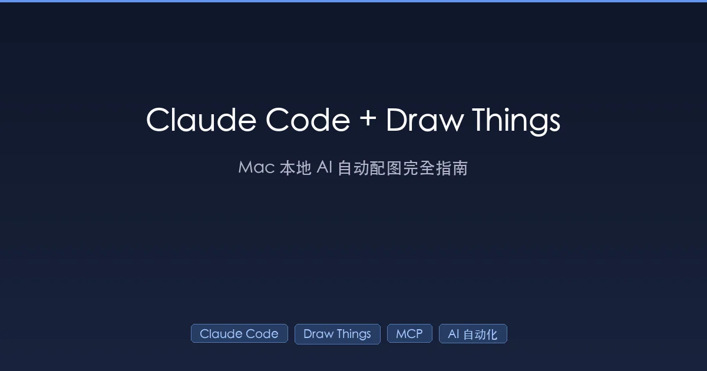

+++
date = '2026-02-16T18:00:00+08:00'
draft = false
title = 'Claude Code + Draw Things：Mac 本地 AI 自动配图完全指南（2026）'
description = '深度教程：用 Claude Code 通过 MCP 协议调用 Draw Things 实现本地 AI 自动配图。涵盖配置、4 大工具详解、自动化工作流实战，告别云端付费，Mac 一台搞定。'
toc = true
tags = ['Claude Code', 'Draw Things', 'MCP', 'AI 自动化', 'Mac']
categories = ['AI实战']
keywords = ['Claude Code Draw Things', 'MCP 自动配图', 'Mac AI 生图自动化', 'Draw Things MCP Server', 'Claude Code 自动生成图片', 'AI 博客配图']
+++



写技术博客最痛苦的事是什么？不是写代码示例，不是理清技术逻辑——而是**配图**。

每写一篇文章，你可能要花 30 分钟到 1 小时去找图、做图、调整尺寸。用 Midjourney？每月 $10 起步，还要在 Discord 里来回切换。用 DALL-E？每张图消耗 API 额度。用免费素材？千篇一律，毫无个性。

但如果我告诉你，**Claude Code 可以在写文章的同时，自动调用你 Mac 上的 Draw Things 生成配图**——一条命令，文章和配图同时产出，而且**完全免费、完全本地、无需联网**——你会不会觉得这像在开玩笑？

这不是玩笑。这是 **MCP（Model Context Protocol）** 带来的真实能力。这篇文章将手把手教你搭建这套工作流。

## 一、这套方案的核心架构

先看全局。整套系统由三层组成：

```
┌─────────────┐     MCP 协议      ┌──────────────────┐     HTTP API      ┌──────────────┐
│ Claude Code  │ ◄──────────────► │ mcp-drawthings   │ ◄──────────────► │ Draw Things  │
│ (AI 大脑)    │    stdio 通信      │ (Node.js 桥接层)  │    localhost:7860  │ (本地生图引擎) │
└─────────────┘                   └──────────────────┘                   └──────────────┘
```

- **Claude Code**：你的 AI 编程助手，负责理解需求、规划任务、调用工具
- **mcp-drawthings**：开源 MCP Server，负责把 Claude Code 的指令翻译成 Draw Things 能懂的 HTTP 请求
- **Draw Things**：macOS 原生 AI 生图引擎，利用 Apple Silicon 的 Metal FlashAttention 加速，本地完成所有计算

三者通过标准协议串联，Claude Code 不需要知道 Draw Things 的具体 API 细节，只要说"帮我生成一张图"，MCP Server 会把剩下的事处理好。

这就像你告诉助理"帮我订个餐厅"——你不需要知道助理是打电话还是用 App 订的，你只关心结果。

## 二、环境准备：3 步完成配置

### 2.1 前置条件

| 条件 | 说明 |
|------|------|
| **macOS** | Apple Silicon (M1/M2/M3/M4) 或 Intel Mac |
| **Draw Things** | 从 App Store 免费安装 |
| **Claude Code** | 已安装 CLI（`npm install -g @anthropic-ai/claude-code`） |
| **Node.js** | v18+（MCP Server 需要） |

### 2.2 第一步：启用 Draw Things API Server

Draw Things 内置了一个 HTTP API Server，但默认是关闭的。你需要手动打开它：

1. 打开 Draw Things App
2. 点击菜单栏 **Draw Things → Settings**（或按 `⌘ + ,`）
3. 找到 **"API Server"** 或 **"HTTP API"** 选项
4. 勾选 **"Enable API Server"**
5. 端口保持默认 **7860**

启用后，你可以用 curl 验证：

```bash
# 验证 API 是否正常
curl http://127.0.0.1:7860/sdapi/v1/options
```

如果返回 JSON 配置信息，说明 API 已就绪。

### 2.3 第二步：配置 MCP Server

在 Claude Code 中注册 Draw Things MCP Server。运行以下命令：

```bash
claude mcp add drawthings -- npx -y mcp-drawthings
```

这一行做了三件事：
1. 在 Claude Code 配置中注册名为 `drawthings` 的 MCP Server
2. 指定启动命令为 `npx -y mcp-drawthings`（自动下载并运行）
3. 使用 stdio 通信方式连接

执行后，`~/.claude.json` 中会出现类似这样的配置：

```json
{
  "mcpServers": {
    "drawthings": {
      "type": "stdio",
      "command": "npx",
      "args": ["-y", "mcp-drawthings"]
    }
  }
}
```

### 2.4 第三步：验证连接

重启 Claude Code，输入 `/mcp` 查看 MCP Server 状态。你应该看到 `drawthings` 显示为已连接状态，并列出 4 个可用工具。

或者直接让 Claude Code 测试：

```
帮我检查 Draw Things 是否正常运行
```

Claude Code 会调用 `check_status` 工具，返回 Draw Things 的运行状态。

## 三、4 大核心工具详解

配置完成后，Claude Code 获得了 4 个 Draw Things 工具。每个工具的用途不同，搞清楚它们的区别，才能让自动化工作流跑起来。

### 3.1 check_status —— 状态检查

**作用**：检查 Draw Things API Server 是否在运行。

**使用场景**：在生图前先确认服务可用，避免白跑一趟。

```
对话示例：
用户：帮我生成一张封面图
Claude Code：（先调用 check_status 确认 Draw Things 在线，再调用 generate_image 生图）
```

这个工具没有参数，调用后返回 Draw Things 的连接状态。简单但重要——自动化流程的第一步永远是**检查环境**。

### 3.2 get_config —— 获取当前配置

**作用**：获取 Draw Things 当前加载的模型、分辨率、采样器等配置信息。

**使用场景**：在生图前了解当前用的是什么模型，判断是否需要切换。

返回信息包括：
- 当前加载的模型名称
- 默认分辨率
- 采样器类型
- CFG Scale 等参数

**实际用途**：比如你想生成写实风格的图，但当前加载的是动漫模型，Claude Code 可以根据 `get_config` 的返回结果，在 `generate_image` 时指定正确的模型。

### 3.3 generate_image —— 文生图（核心工具）

**作用**：根据文本提示词生成图像，并保存到本地磁盘。

这是最常用的工具，参数如下：

| 参数 | 类型 | 必填 | 说明 |
|------|------|------|------|
| `prompt` | string | ✅ | 图像描述文本 |
| `negative_prompt` | string | ❌ | 不希望出现的元素 |
| `width` | int | ❌ | 图像宽度（64-2048，默认 512） |
| `height` | int | ❌ | 图像高度（64-2048，默认 512） |
| `steps` | int | ❌ | 推理步数（1-150，默认 20） |
| `cfg_scale` | float | ❌ | 提示词引导强度（1-30，默认 7.5） |
| `seed` | int | ❌ | 随机种子（-1 = 随机） |
| `model` | string | ❌ | 指定模型文件名 |
| `output_path` | string | ❌ | 自定义保存路径 |

**关键参数解释**：

- **steps（步数）**：步数越多，细节越丰富，但速度越慢。Flux.1 Schnell 只需 4 步，SD 1.5 通常需要 20-30 步
- **cfg_scale（引导强度）**：值越高，图像越"听话"，但可能过度饱和。推荐 5-10 之间
- **output_path**：可以直接指定保存到文章目录，例如 `content/posts/ai/xxx/cover.webp`

**实际调用示例**：

```
帮我生成一张技术博客封面图：
- 主题：AI 编程自动化
- 风格：科技感、深色背景、蓝紫色调
- 尺寸：1200x630
- 保存到 content/posts/ai/2026-02-16-example/cover.png
```

Claude Code 会将此请求转换为 `generate_image` 调用：

```json
{
  "prompt": "A futuristic tech illustration about AI programming automation, dark background with blue and purple gradient, neural network patterns, clean modern style, no text",
  "negative_prompt": "text, watermark, blurry, low quality",
  "width": 1200,
  "height": 630,
  "steps": 20,
  "cfg_scale": 7.5,
  "output_path": "content/posts/ai/2026-02-16-example/cover.png"
}
```

### 3.4 transform_image —— 图生图

**作用**：以现有图像为基础，根据提示词进行风格转换或修改。

| 参数 | 类型 | 必填 | 说明 |
|------|------|------|------|
| `prompt` | string | ✅ | 变换描述 |
| `image_path` | string | ❌* | 源图像文件路径 |
| `image_base64` | string | ❌* | 源图像 Base64 编码 |
| `denoising_strength` | float | ❌ | 变换强度（0-1，默认 0.75） |
| `negative_prompt` | string | ❌ | 不希望出现的元素 |
| `output_path` | string | ❌ | 保存路径 |

> `image_path` 和 `image_base64` 至少提供一个。

**denoising_strength 理解指南**：

- **0.1-0.3**：轻微调整，保留原图 90%+ 的内容，适合微调色调、风格
- **0.4-0.6**：中等变换，保留构图但改变细节，适合风格迁移
- **0.7-1.0**：大幅重绘，只保留大致轮廓，接近全新生成

**典型用途**：

```
把这张截图转换成手绘风格的插图：
- 源图：content/posts/ai/screenshot.png
- 风格：hand-drawn illustration, sketch style
- 变换强度：0.6
```

## 四、实战：自动化博客配图工作流

理论讲完，来看最让人兴奋的部分——**把这套工具串成自动化工作流**。

### 4.1 场景：一条命令，文章 + 配图同时产出

假设你要写一篇关于 "MCP 协议" 的技术博客。传统流程是：

```
写文章（30min）→ 找配图（20min）→ 调整尺寸（10min）→ 检查格式（5min）
```

有了 Claude Code + Draw Things，流程变成：

```
一条指令（1min）→ Claude Code 自动完成全部（5-10min）
```

### 4.2 完整工作流演示

在 Claude Code 中输入：

```
写一篇关于 MCP 协议的技术博客，包括：
1. 文章内容
2. 封面图（1200x630，科技风格）
3. 2-3 张正文配图
全部保存到 content/posts/ai/ 目录
```

Claude Code 的执行过程：

```
Step 1: check_status
  → 确认 Draw Things 在线 ✓

Step 2: get_config
  → 获取当前模型信息（Flux.1 Schnell）

Step 3: 撰写文章
  → 生成 index.md，包含 Front Matter、正文、内链

Step 4: generate_image × 3（并行）
  → 封面图：1200×630 科技风格
  → 配图1：架构图风格
  → 配图2：流程图风格

Step 5: 保存所有文件到文章目录
  → index.md + cover.webp + fig1.webp + fig2.webp

Step 6: 构建验证
  → hugo --minify 确认无报错
```

**全程无需切换应用**——不用打开浏览器找图，不用打开 Photoshop 调尺寸，不用手动上传到 CMS。

### 4.3 提示词工程：让 AI 生出好图的秘诀

Claude Code 调用 Draw Things 时，提示词质量决定了图像质量。以下是博客配图场景的提示词公式：

**封面图公式**：

```
[主题描述], [风格], [色调], [构图], [技术关键词]
negative: text, watermark, blurry, low quality, deformed
```

**实际示例**：

```
# 技术教程封面
"A clean modern illustration of AI workflow automation,
 interconnected nodes and data flows,
 dark blue gradient background,
 minimalist tech style,
 cinematic lighting, professional"

# 工具对比文章封面
"Split screen comparison of different AI tools,
 left side showing cloud services,
 right side showing local computing on Mac,
 tech aesthetic, blue and purple tones,
 isometric perspective"

# 概念解析封面
"Abstract visualization of Model Context Protocol,
 glowing connection lines between AI and tools,
 futuristic digital landscape,
 dark theme with neon accents"
```

**模型选择建议**：

| 图像类型 | 推荐模型 | 步数 | CFG |
|---------|---------|------|-----|
| 科技风格封面 | Flux.1 Schnell | 4 | 3.5 |
| 写实风格配图 | Juggernaut XL | 25 | 7.0 |
| 插画风格 | DreamShaper XL | 25 | 7.5 |
| 快速草图 | SD 1.5 | 15 | 7.0 |

### 4.4 进阶：用 transform_image 统一文章视觉风格

有时候文章需要多张配图，但 AI 每次生成的图风格可能不一致。这时可以用 `transform_image` 来统一风格：

```
1. 先生成一张满意的"基调图"
2. 用 transform_image 以这张图为基础，逐张调整其他配图
3. 设置 denoising_strength = 0.3-0.5，保留各图的主要内容但统一色调和风格
```

这就像给一组照片统一套滤镜——每张照片内容不同，但视觉风格一致。

## 五、对比：为什么选本地方案？

你可能会问：Midjourney、DALL-E 3 这些云端服务不是更方便吗？来看看对比：

| 维度 | Claude Code + Draw Things | Midjourney | DALL-E 3 API |
|------|---------------------------|------------|-------------|
| **费用** | 完全免费 | $10-60/月 | $0.04-0.12/张 |
| **隐私** | 本地处理，不上传 | 图片上传到云端 | 图片上传到 OpenAI |
| **速度** | M1 Pro: 5-15 秒/张 | 30-60 秒/张 | 10-20 秒/张 |
| **离线使用** | 支持 | 不支持 | 不支持 |
| **自定义模型** | 支持 LoRA/自训练 | 不支持 | 不支持 |
| **批量生成** | 无限制 | 有配额限制 | 按张计费 |
| **工作流集成** | MCP 原生集成 | 需要 API 封装 | 需要 API 封装 |
| **分辨率控制** | 完全自定义（64-2048） | 固定选项 | 固定选项 |

**核心优势总结**：

1. **零成本**：Draw Things 免费 + Apple Silicon 算力免费
2. **零延迟**：不用等网络传输，本地 GPU 直接计算
3. **零泄露**：所有数据不出你的电脑
4. **零限制**：没有配额、没有审核、没有封号风险

对于技术博客作者来说，一年下来光配图就能省 **$120-720**（按 Midjourney 标准版 $10/月计算）。

## 六、完整自动化流水线：从热点发现到文章发布

把 Claude Code + Draw Things 嵌入完整的内容生产流水线，你可以实现"一个人运营一个技术媒体"的效率。

### 6.1 流水线架构

```
┌─────────────┐    ┌──────────────┐    ┌────────────────┐    ┌─────────┐    ┌──────────┐
│  发现热点    │ →  │  深度调研     │ →  │  撰写 + 自动配图 │ →  │  质检    │ →  │  发布    │
│  WebSearch   │    │  WebFetch    │    │  Write + Draw   │    │  Hugo   │    │  Git     │
│  热搜/趋势    │    │  阅读素材    │    │  Things MCP     │    │  构建    │    │  Push    │
└─────────────┘    └──────────────┘    └────────────────┘    └─────────┘    └──────────┘
```

### 6.2 实战指令模板

下面是一条"端到端"指令，你可以直接在 Claude Code 中使用：

```markdown
请帮我完成以下自动化博客发布流程：

1. **热点调研**：搜索 "XXX 技术" 的最新动态，找到 3-5 个有价值的信息源
2. **撰写文章**：
   - 分类：AI实战
   - 风格：深度技术教程，通俗易懂
   - 要求：3000-5000 字，含代码示例
3. **自动配图**：
   - 封面图：1200×630，科技风格，深色背景
   - 正文配图：根据文章内容自动生成 2-3 张
   - 所有图片保存为 .webp 格式
4. **质量检查**：
   - Front Matter 完整性
   - 内链 ≥ 3 个
   - Hugo 构建无报错
5. **保存到**：content/posts/ai/ 目录
```

### 6.3 关键细节：图片格式转换

Draw Things 默认输出 PNG 格式，但博客需要 WebP 格式（体积更小）。Claude Code 会自动处理转换：

```bash
# Claude Code 生成图片后，自动转换为 WebP
cwebp -q 85 -resize 1200 630 cover.png -o cover.webp
```

如果系统没有 `cwebp`，也可以用 Python：

```python
from PIL import Image
img = Image.open("cover.png").resize((1200, 630), Image.LANCZOS)
img.save("cover.webp", "WEBP", quality=85)
```

## 七、常见问题与排错

### Q1: Draw Things API 连不上？

**症状**：`check_status` 返回连接失败。

**排查步骤**：
1. 确认 Draw Things App 已打开
2. 确认 API Server 已启用（Settings → API Server）
3. 确认端口是 7860：`curl http://127.0.0.1:7860/sdapi/v1/options`
4. 如果端口被占用，在 Draw Things 设置中改端口，同时更新 MCP Server 的环境变量

### Q2: 生成的图片质量不好？

**可能原因**：
- **提示词太简单**：至少包含主题 + 风格 + 色调 + 质量关键词
- **步数太少**：SD 1.5/SDXL 至少 20 步，只有 Flux.1 Schnell 可以 4 步出好图
- **模型不匹配**：写实需求别用动漫模型
- **分辨率不合理**：SD 1.5 最佳 512×512，SDXL 最佳 1024×1024

### Q3: MCP Server 报错 "command not found"？

确保 Node.js 已安装且版本 ≥ 18：

```bash
node --version  # 应该显示 v18.x 或更高
npx -y mcp-drawthings --help  # 手动测试 MCP Server
```

如果 npx 找不到，尝试用完整路径：

```bash
claude mcp add drawthings -- /usr/local/bin/npx -y mcp-drawthings
```

### Q4: 生图速度慢？

| 芯片 | 512×512 | 1024×1024 | 1200×630 |
|------|---------|-----------|----------|
| M1 | ~8s | ~25s | ~15s |
| M1 Pro/Max | ~5s | ~15s | ~10s |
| M2 Pro/Max | ~4s | ~12s | ~8s |
| M3 Pro/Max | ~3s | ~9s | ~6s |
| M4 Pro/Max | ~2s | ~7s | ~5s |

> 以上为 Flux.1 Schnell 4 步推理的近似耗时。实际速度取决于模型、步数和系统负载。

如果太慢，可以：
- 使用 Flux.1 Schnell（只需 4 步）
- 降低分辨率，后期再用 `transform_image` 放大
- 关闭其他占用 GPU 的应用

### Q5: 能同时生成多张图吗？

Draw Things 的 API 是同步的——一次只能处理一个请求。但 Claude Code 会**自动串行排队**，你只需要在指令中说明需要几张图，Claude Code 会依次生成。

如果你需要更高的并行度，可以考虑运行多个 Draw Things 实例（不同端口），配置多个 MCP Server。

## 八、进阶玩法

### 8.1 自定义 LoRA 模型生成品牌风格图

如果你想让博客配图有统一的品牌风格，可以训练自己的 LoRA 模型：

1. 用 Draw Things 内置的 [LoRA 训练功能](https://www.heyuan110.com/posts/ai/2026-02-15-draw-things-ultimate-guide/) 训练品牌风格
2. 在 `generate_image` 调用时指定 LoRA 模型
3. 所有文章的配图就有了统一的视觉 DNA

### 8.2 截图美化流水线

技术文章经常需要放截图，但原始截图通常不够美观。用 `transform_image` 可以自动美化：

```
1. 截取原始截图 → screenshot.png
2. transform_image：添加圆角、阴影、渐变背景
3. 输出美化后的图片 → screenshot_styled.webp
```

### 8.3 系列文章视觉一致性

写系列文章时，可以制定一套"视觉规范"给 Claude Code：

```markdown
# 系列文章配图规范

## 封面图
- 尺寸：1200×630
- 色调：深蓝渐变（#0f172a → #1e3a5f）
- 风格：minimalist tech illustration
- 必须包含：主题相关的抽象图形

## 正文配图
- 尺寸：800×450
- 风格：与封面图一致
- 用途：架构图、流程图、对比图
```

把这段规范放到 CLAUDE.md 或 Skills 文件中，Claude Code 每次生图都会自动遵循。

## 九、总结

Claude Code + Draw Things 的组合，本质上是让 AI 编程助手获得了"视觉创作"能力。通过 MCP 协议的桥接：

- **写文章时可以同步生成配图**——不再需要中断写作去找图
- **完全本地运行**——零成本、零隐私风险
- **高度可定制**——模型、风格、尺寸全部可控
- **可纳入自动化流水线**——从热点发现到文章发布一气呵成

如果你是 Mac 用户、技术博客作者、或者任何需要频繁配图的内容创作者，这套方案值得你花 10 分钟配置起来。一旦跑通，你会发现**写作体验质的飞跃**——因为你再也不用为配图分心了。

---

**附：快速启动清单**

```bash
# 1. 安装 Draw Things（App Store 免费）
# 2. 启用 API Server（Settings → API Server → Enable）
# 3. 配置 MCP Server
claude mcp add drawthings -- npx -y mcp-drawthings

# 4. 验证（重启 Claude Code 后）
# 输入：帮我检查 Draw Things 是否正常运行

# 5. 开始使用
# 输入：帮我生成一张 1200x630 的科技风格博客封面图
```

## 相关阅读

- [Draw Things 完全指南：Mac 本地 AI 生图从入门到精通](/posts/ai/2026-02-15-draw-things-ultimate-guide/)
- [Mac Mini 本地 AI 生图性价比方案](/posts/ai/2026-02-15-mac-mini-local-image-generation/)
- [Claude Code 浏览器自动化方案对比（2026 最新）](/posts/ai/2026-01-28-claude-code-browser-automation/)
- [我的 AI 开发工作流：从需求到上线](/posts/ai/2026-01-19-ai-dev-workflow/)
- [Claude Code 最佳实践指南](/posts/ai/2026-01-06-claudecode-best-practices/)
- [Claude Code Skills 完全指南](/posts/ai/2026-01-08-claudecode-skill-guide/)
