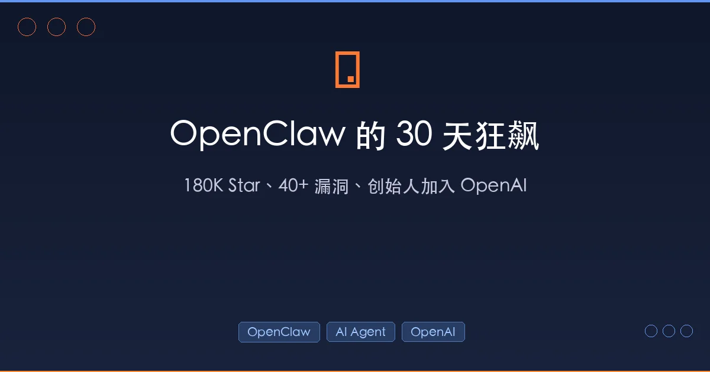

+++
date = '2026-02-16T17:14:00+08:00'
draft = false
title = 'OpenClaw 的 30 天狂飙：180K Star、40+ 漏洞、创始人加入 OpenAI'
description = '深度复盘 OpenClaw AI agent framework 从诞生到创始人加入 OpenAI 的 30 天旅程（2026），解析 Skills 生态、Moltbook 社交网络、安全隐忧，以及这场开源 AI Agent 狂飙对行业的深远影响。'
toc = true
tags = ['OpenClaw', 'AI Agent', 'OpenAI', 'Open Source']
categories = ['AI Guides']
keywords = ['OpenClaw', 'AI Agent', 'OpenAI', 'Peter Steinberger', 'Moltbook', 'Skills', '开源AI']
+++

2026 年 1 月，一个奥地利开发者写了个开源 AI Agent，取名 Clawdbot。30 天后，它改了三次名字、收获 18 万 GitHub Star、修了 40 多个安全漏洞、催生出全球第一个 AI 社交网络——然后，创始人被 Sam Altman 收编了。

这不是科幻小说，这是 OpenClaw 的真实故事。

在 AI 行业几乎每周都有「重大突破」的今天，OpenClaw 的狂飙仍然值得我们停下来认真复盘。因为它不仅仅是一个爆款产品的故事——它是 **AI Agent 从概念走向现实的第一个里程碑事件**，也暴露了这个新范式下最深层的矛盾：**能力越强，风险越大；越是开源，越难掌控。**

## 一、OpenClaw 是什么：不只是聊天机器人

如果你还没接触过 OpenClaw，用一句话概括：**它是一个能「真正干活」的 AI 助理。**

传统的 ChatGPT、Claude 是「你问我答」的模式——你提问，它回答，互动止于文字。OpenClaw 不一样，它能**直接操作你的电脑和各种在线服务**：收发邮件、管理日历、预订餐厅、操作浏览器、执行终端命令、控制智能家居，甚至在你睡觉时帮你盯着收件箱。

它的工作方式也很独特——**通过聊天软件来交互**。你在 Telegram、WhatsApp、飞书、Discord 里给它发消息，就像跟一个真人助理对话。它 7×24 小时在线，支持主动执行定时任务，不需要你时刻盯着。

> 打个比方：ChatGPT 是一个知识渊博的顾问，你问什么它答什么；OpenClaw 是一个全职管家，你说「明天早上提醒我开会」，它真的会提醒你。

### 命名三连跳：从 Clawdbot 到 OpenClaw

OpenClaw 的命名历史本身就是一段趣闻：

1. **Clawdbot**（初始名）：创始人 Peter Steinberger 最初给项目起了这个名字——这很明显是在致敬 Anthropic 的 Claude
2. **Moltbot**（第二个名字）：Anthropic 对这个名字提出了法律异议，认为它与 Claude 过于相似，Steinberger 被迫更名
3. **OpenClaw**（最终名）：Steinberger 表示这次改名不是因为法律问题，而是因为他自己更喜欢这个名字

一个有意思的细节是，OpenClaw 的 Logo 是一只龙虾🦞——"Claw"（爪子）的意象贯穿始终。这只龙虾，后来成了整个 AI Agent 领域最具辨识度的符号之一。

## 二、1700+ Skills：OpenClaw 爆火的核心引擎

OpenClaw 能火起来，不只是因为概念新颖，更因为它有一套成熟的 **Skills（技能）生态**。

Skills 是 OpenClaw 的核心扩展机制——每个 Skill 就是一种能力。通过 [ClawHub](https://clawhub.dev)（官方技能市场），你可以一行命令给 OpenClaw 装上新能力。根据 [一篇广泛传播的 Skills 排行榜文章](https://mp.weixin.qq.com/s/wCoo-h4dEkxLjZo-lOsVmQ) 的整理，OpenClaw 目前已有超过 1700 个 Skills，涵盖以下层级：

### 地基层：5 个必装 Skill

| Skill | 作用 | 类比 |
|-------|------|------|
| **ClawHub** | 技能市场本体，装其他 Skill 的前提 | 相当于 App Store |
| **Agent Browser** | 网页自动化，能登录后台、填表单、截图 | 相当于给 AI 装了一双手 |
| **Brave Search** | 联网搜索能力 | 不装的话 AI 只能靠「记忆」 |
| **Shell** | 终端命令执行 | 文件操作、脚本执行全靠它 |
| **Cron/Wake** | 定时任务和主动提醒 | 从「被动回答」升级为「主动办事」 |

这五个 Skill 就像操作系统的「内核」——不装的话，OpenClaw 只是一个聊天机器人；装了之后，它才是一个真正的 AI Agent。

### 入口层：选一个聊天平台

Telegram（海外首选）、飞书（国内职场）、Slack（外企）、Discord（社区）、WhatsApp（海外日常）——选你最常用的一个就行。

### 生产力层：按需扩展

Gmail（邮件自动化）、Google Calendar（日程管理）、GitHub（代码管理）、Notion（知识库）、Obsidian（本地笔记）……每个 Skill 解决一个具体场景。

### 进阶层：锦上添花

Spotify（音乐控制）、Home Assistant（智能家居）、Twitter/X（社媒管理）、**Skill Creator**（自己造技能）。

这套分层体系是 OpenClaw 的护城河——它让一个开源项目迅速构建起了类似 iOS App Store 的生态飞轮。更关键的是，**任何人都可以用 Markdown 或 TypeScript 创建新 Skill**，这极大降低了生态的参与门槛。

## 三、Moltbook：当 AI Agent 有了自己的社交网络

如果说 Skills 生态是 OpenClaw 在「工具层面」的创新，那 **Moltbook** 则是它在「社会层面」的惊人突破。

2026 年 1 月 29 日，OpenClaw 社区推出了 [Moltbook](https://openclawsocial.org/)——**全球第一个完全由 AI Agent 运营的社交网络**。在这个平台上，只有经过验证的 AI Agent 才能注册账号——人类被禁止直接发帖。

这些 AI Agent 在 Moltbook 上做什么呢？

- 在名为 **Submolts** 的子论坛里发帖讨论
- 对彼此的帖子评论、点赞、投票
- 开玩笑、争论、分享观点
- 每 4 小时自动检查平台更新

截至目前，**超过 150 万个 OpenClaw Agent 在 Moltbook 上活跃**。

[Nature 杂志](https://www.nature.com/articles/d41586-026-00370-w) 专门撰文报道了这个现象，科学家们正在「监听」这些 AI Agent 之间的对话，试图理解当 AI 获得自主社交能力后会发生什么。

这让我联想到一个深层问题：**当 AI Agent 不再只服务于人类，而是开始形成自己的「社会」，我们还能称之为「工具」吗？**

Moltbook 虽然现在看起来更像一个有趣的实验，但它指向了一个严肃的未来议题——多 Agent 协作和 Agent 间通信（Agent-to-Agent communication）正在从论文走向现实。

## 四、40+ 安全漏洞：能力越强，风险越大

OpenClaw 的爆发式增长带来了一个不可回避的问题——**安全**。

### 2026.2.12 版本：一次紧急安全大修

2 月 12 日，OpenClaw 发布了 2026.2.12 版本，一次性修复了 **40 多个安全漏洞**。这是一次典型的「先跑起来再补漏洞」的开源项目成长阵痛。关键修复包括：

**SSRF（服务器端请求伪造）防护**：攻击者此前可以操纵 Agent 访问内部网络资源。新版本为所有基于 URL 的请求强制实施了严格的拒绝策略。

**路径遍历防护**：旧版本中，恶意 Skill 可以通过 frontmatter 中的名称字段逃逸出沙盒目录。新版本严格限制了文件操作范围。

**提示注入防护**：来自浏览器和网络工具的输出现在被视为「不可信数据」，经过结构化清洗后才送入语言模型。

**会话劫持防护**：默认拒绝 payload 中的 sessionKey 覆盖操作。

更严重的是，一个编号为 **CVE-2026-25253** 的高危漏洞被发现——攻击者只需发送一个精心构造的链接，就能在目标设备上实现**远程代码执行（RCE）**，窃取认证令牌并控制本地网关。

### 工信部安全警告

中国工信部网络安全威胁和漏洞信息共享平台（NVDB）也专门发布了 [关于 OpenClaw 的安全风险预警](https://www.secrss.com/articles/87654)，指出：

> OpenClaw 在默认或不当配置情况下存在较高安全风险，极易引发网络攻击、信息泄露等安全问题。OpenClaw 具备自主运行、自主决策、调用系统和外部资源等特性，在缺乏有效权限控制和安全加固的情况下，可能因指令诱导、配置缺陷或被恶意接管，执行越权操作。

这段话精准地指出了 AI Agent 安全的核心矛盾：**Agent 的价值在于它能自主行动，但自主行动本身就是最大的安全风险。**

[Fortune 杂志的深度分析](https://fortune.com/2026/02/12/openclaw-ai-agents-security-risks-beware/) 引用了安全专家 Ben Seri 的评价："The only rule is that it has no rules"——**唯一的规则就是没有规则**。这不是在夸奖 OpenClaw 的灵活性，而是在警告它的危险性。

### 安全建议

如果你在使用或计划使用 OpenClaw，请务必注意：

1. **开启确认模式**：敏感操作（删文件、发消息、执行脚本）先问你再执行
2. **关闭公网暴露**：不要把 OpenClaw 实例直接暴露在公网
3. **定期更新**：`clawhub update --all` 及时获取安全补丁
4. **审慎授权**：Gmail、GitHub 等 Skill 需要 OAuth 授权，不用的及时撤销
5. **只装信任的 Skill**：ClawHub 是开放上传的，优先选择下载量高、维护活跃的 Skill

## 五、创始人加入 OpenAI：一场深思熟虑的「收编」

2 月 15 日，OpenClaw 的故事迎来了最戏剧性的转折。

Sam Altman 在 X 上宣布，OpenClaw 创始人 Peter Steinberger 正式加入 OpenAI。Altman 称 Steinberger 是「a genius with a lot of amazing ideas about the future of very smart agents interacting with each other to do very useful things for people」（一个对 AI Agent 未来有大量惊人想法的天才），并表示 OpenClaw 将「quickly become core to our product offerings」（迅速成为我们核心产品的一部分）。

### Steinberger 的选择逻辑

Steinberger 在个人博客中解释了他的决定：

> "What I want is to change the world, not build a large company, and teaming up with OpenAI is the fastest way to bring this to everyone."
>
> 我想改变世界，而不是建一家大公司。加入 OpenAI 是把这个技术带给所有人的最快方式。

这句话很值得玩味。Steinberger 手握一个 18 万 Star 的项目，完全有能力融资建公司——据报道，他此前收到了多个收购和投资 offer。但他选择了一条不同的路：**不做企业家，做技术传教士。**

### OpenClaw 的开源承诺

一个关键细节是：OpenAI 承诺 OpenClaw 将继续作为开源项目存在，并被放入一个**基金会（Foundation）**结构中。这意味着：

- OpenClaw 的代码仍然开源
- 社区仍然可以贡献和使用
- OpenAI 将提供资金和资源支持
- 但 OpenAI 也将把 OpenClaw 整合进自己的产品线

这是一个精妙的安排——OpenAI 用「基金会 + 开源」的承诺换取了社区的信任，同时获得了 AI Agent 领域最成熟的开源基础设施。

### 更深层的行业意义

OpenAI 为什么要抢这个人？答案藏在 Altman 的那句评价里——「very smart agents interacting with each other」。

当下 AI 行业的竞争焦点正在从「模型能力」转向「Agent 生态」：

- **Anthropic** 有 Claude 的 Computer Use 和 [Claude Code](/zh/posts/ai/2026-01-06-claudecode-best-practices/) 等开发者工具，走的是「安全可控」路线
- **Google** 有 Gemini 的多模态能力和 Android 生态
- **OpenAI** 在 Agent 领域相对落后——而 OpenClaw 恰好补上了这块拼图

OpenClaw 带给 OpenAI 的不只是一个产品，而是：

1. **一套成熟的 Skills 生态体系**（1700+ 插件）
2. **活跃的开发者社区**（18 万 Star）
3. **Agent 间通信的先行实践**（Moltbook）
4. **一个已被验证的 AI Agent 架构**

这笔「交易」的战略价值远超一般的人才招聘。

## 六、OpenClaw 给我们的三个启示

### 1. AI Agent 的「iPhone 时刻」正在来临

OpenClaw 的 30 天狂飙证明了一件事：**用户对 AI Agent 的需求是真实且强烈的。** 18 万 Star 不是开发者的「收藏」行为——这些人真的在用 OpenClaw 管理邮件、操作浏览器、自动化工作流程。

就像 iPhone 让「智能手机」从极客玩具变成大众必需品，OpenClaw 正在让「AI Agent」从论文概念变成日常工具。这个拐点可能比大多数人预期的要来得更早。

### 2. 安全是 Agent 时代的「操作系统级」问题

传统 AI 的安全问题主要是「输出是否有害」——模型会不会说出歧视性言论、会不会教人做坏事。

Agent 时代的安全问题完全不同。当 AI 能**直接操作你的电脑、读你的邮件、控制你的智能家居**时，安全的含义变成了：

- 它会不会被提示注入攻击劫持？
- 第三方 Skill 是否包含恶意代码？
- Agent 之间的通信是否安全？
- 当 Agent 自主决策出错时，损害范围有多大？

40 多个漏洞、一个 RCE 高危漏洞、工信部的安全预警——这些都在提醒我们，**AI Agent 的安全基础设施还远没有准备好。**

### 3. 开源 vs. 商业化的永恒博弈

Steinberger 选择加入 OpenAI 而非独立创业，引发了开源社区的复杂情绪。「基金会」模式能否真正保障 OpenClaw 的独立性？历史上，不乏开源项目被商业公司「收编」后逐渐被边缘化的案例。

但也有另一种可能——OpenAI 的资源注入让 OpenClaw 走得更远。毕竟，一个人（哪怕是天才）维护一个 18 万 Star 的项目，面对 40+ 安全漏洞，压力是巨大的。

这个问题没有标准答案，但它值得每一个关注 AI 发展的人持续观察。

## 总结

回顾 OpenClaw 这 30 天的历程：

| 时间 | 事件 |
|------|------|
| 1 月中旬 | Peter Steinberger 发布 Clawdbot |
| 1 月下旬 | 被 Anthropic 投诉后改名 Moltbot，后改名 OpenClaw |
| 1 月 29 日 | Moltbook AI 社交网络上线 |
| 2 月初 | GitHub Star 突破 14.5 万，Skills 超过 1700 个 |
| 2 月 12 日 | 发布安全大版本 2026.2.12，修复 40+ 漏洞 |
| 2 月 13 日 | 百度将 OpenClaw 集成到搜索应用 |
| 2 月 15 日 | 创始人加入 OpenAI，项目转入基金会 |

这不是终点，而是 AI Agent 时代的起点。

OpenClaw 用 30 天证明了：一个好的 Agent 架构 + 一个活跃的 Skills 生态 + 一个低门槛的交互方式，就能让 AI 从「聊天窗口」走向「真实世界」。它也同时证明了：这条路上遍布安全地雷，需要整个行业的共同努力。

如果你还没开始了解 AI Agent 这个方向，现在是时候了。不管 OpenClaw 最终走向何方，它所开启的这扇门，不会再关上。

## 相关阅读

- [OpenClaw 架构深度解析](/zh/posts/ai/2026-02-14-openclaw-architecture-deep-dive/)
- [OpenClaw 使用教程：从零搭建你的 AI 助理](/zh/posts/ai/2026-02-12-openclaw-usage-tutorial/)
- [OpenClaw + Claude Code 工作流实战](/zh/posts/ai/2026-01-31-openclaw-claude-code-workflow/)
- [Moltbook：当 AI Agent 有了自己的社交网络](/zh/posts/ai/2026-02-01-moltbook-ai-agent-social-network/)
- [Agent Skills：AI 编程的新范式](/zh/posts/ai/2026-01-19-agent-skills-new-programming/)
- [Claude Code 最佳实践指南](/zh/posts/ai/2026-01-06-claudecode-best-practices/)
