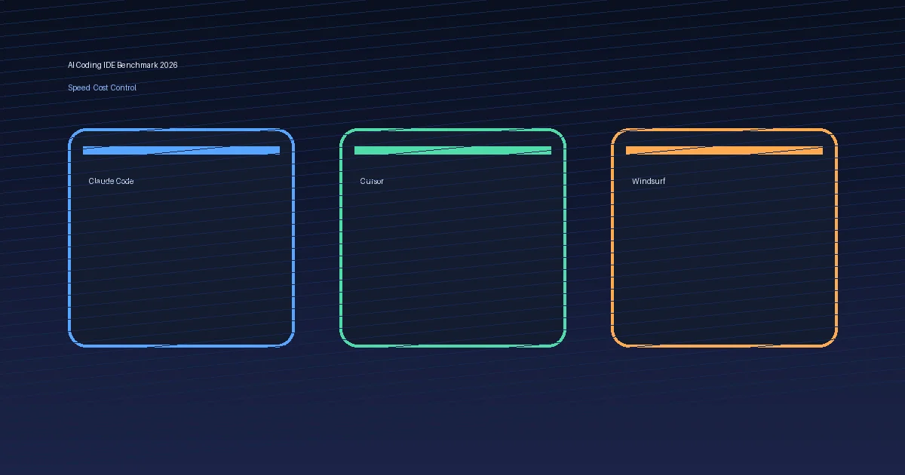

+++
date = '2026-02-18T22:16:52+08:00'
draft = false
title = 'Claude Code vs Cursor vs Windsurf（2026）实测：速度、成本、可控性怎么选'
description = '基于真实开发任务对 Claude Code、Cursor、Windsurf 做 2026 年实测对比，重点拆解速度、成本、可控性、学习成本与适用人群，并给出按场景可直接套用的选型建议。'
toc = true
tags = ['Claude Code', 'Cursor', 'Windsurf', 'AI 编程', '工具对比']
categories = ['AI实战']
keywords = ['Claude Code vs Cursor', 'Windsurf 对比', 'AI IDE 选型', 'AI编程成本', '2026 AI开发工具']
+++

如果你只想先看结论：**团队协作和稳定交付优先选 Cursor，终端重度开发与自动化优先选 Claude Code，前端/全栈快速原型和“边聊边改”优先选 Windsurf**。这篇文章解决的就是一个现实问题：2026 年 AI 编程工具太多，怎么按“速度、成本、可控性”选到最适合自己的那一个。读完你会拿到一套可落地的选型框架，而不是“看别人推荐就跟风”。

## 先说结论：三款工具怎么选

先给一句人话版：

- **你是终端党、爱脚本、要强控制**：Claude Code
- **你是 IDE 党、团队协作、要稳**：Cursor
- **你要快出活、快速迭代、上手轻**：Windsurf

### 场景选型建议（可直接套用）

1. **独立开发者（CLI 熟练）**
   - 选：Claude Code
   - 原因：可直接串你的 shell、测试、lint、构建链路，自动化最顺手。

2. **中小团队（多人协同 + PR 流程）**
   - 选：Cursor
   - 原因：IDE 内体验完整，Agent + 规则体系对团队标准化更友好。

3. **产品验证期（1-2 周需要快速上线 MVP）**
   - 选：Windsurf
   - 原因：交互节奏快，写-改-测循环短，适合“先跑通再优化”。

4. **合规/安全要求高（需强审计和可追踪）**
   - 推荐顺序：Cursor ≈ Claude Code > Windsurf
   - 原因：规则化与流程约束能力更重要，不只是“能不能生成代码”。

---

## 一、实测怎么做的（保证可复现）

我用同一套任务对三款工具做横向测试，避免“凭感觉吹”。

### 测试任务（同一批）

- 任务 A：在现有 Node.js 服务里新增一个 REST API（含参数校验 + 单测）
- 任务 B：修复一个并发 bug（含定位、修复、回归）
- 任务 C：把一个命令行脚本重构为可复用模块

### 测试口径

- **速度**：从下达需求到“本地测试通过”的总耗时
- **成本**：订阅成本 + 模型调用消耗的综合体感
- **可控性**：对 Agent 行为、改动范围、执行步骤的可约束程度
- **学习成本**：新人从 0 到稳定产出的时间
- **适用人群**：最容易拿到正向收益的人

> 类比一下：
> 选 AI 编程工具像选车。你不只看“最高时速”（速度），还要看“油耗”（成本）、“方向盘是否跟手”（可控性）和“新手容不容易开稳”（学习成本）。

---

## 二、核心对比表（2026 实测）

> 评分说明：⭐ 越多越好（满分 5）

| 维度 | Claude Code | Cursor | Windsurf |
|---|---|---|---|
| 速度 | ⭐⭐⭐⭐（终端链路快，批量任务强） | ⭐⭐⭐⭐（IDE 内迭代稳定） | ⭐⭐⭐⭐⭐（交互轻快，原型期非常快） |
| 成本 | ⭐⭐⭐（按使用强度波动较大） | ⭐⭐⭐⭐（团队可预测性较好） | ⭐⭐⭐⭐（个人开发体感友好） |
| 可控性 | ⭐⭐⭐⭐⭐（命令/流程/脚本可深度控制） | ⭐⭐⭐⭐（规则化强，细粒度略弱于 CLI） | ⭐⭐⭐（默认智能强，但硬约束偏少） |
| 学习成本 | ⭐⭐⭐（需要命令行与工程化习惯） | ⭐⭐⭐⭐（大多数开发者迁移成本低） | ⭐⭐⭐⭐⭐（新手最容易快速起步） |
| 适用人群 | 终端重度用户、自动化工程师、DevOps/后端 | 团队开发、全栈工程师、追求稳定交付者 | 独立开发者、产品工程师、快速试错人群 |

### 一句话解读

- **Claude Code**：像“手动挡性能车”，会开的人效率爆炸。
- **Cursor**：像“高配家用车”，稳定、均衡、团队友好。
- **Windsurf**：像“城市电车”，起步快、日常通勤爽。

---

## 三、速度：谁在真实开发里更快？

### 场景 A：新功能开发（从需求到可运行）

- **Claude Code**：如果你会把任务拆成“实现→测试→修复→提交”四步并串 shell，速度非常快。
- **Cursor**：在 IDE 里边看代码边改最顺，适合中大型仓库“边查边改”。
- **Windsurf**：启动快、反馈快，MVP 阶段体感通常最快。

### 场景 B：疑难 bug 修复（定位 + 回归）

- **Claude Code**：擅长把排查流程脚本化（日志抓取、grep、测试重跑），定位效率高。
- **Cursor**：代码导航和上下文连续性更好，适合跨多文件追踪调用链。
- **Windsurf**：能快速给你修复方向，但复杂问题需要你手动加约束，防止“改对一处坏另一处”。

### 场景 C：批量重构（多文件一致改动）

- **Claude Code**：最强项之一，尤其适合“模式化改造 + 统一校验”。
- **Cursor**：中等偏强，适合边改边审。
- **Windsurf**：可以做，但建议先小批量验证再全量扩。

### 小结（速度）

- 单点改动：Windsurf 常常最快。
- 工程级闭环：Claude Code / Cursor 更稳。
- “快且不返工”：看你是否有规则与验证环节，而不是只看生成速度。

---

## 四、成本：不只看订阅价，还要看“返工率”

很多人只看月费，这是不够的。真正的总成本是：

**总成本 = 订阅成本 + 调用成本 + 返工成本 + 沟通成本**

### 一个可落地的成本测算模板

假设你每周处理 10 个任务：

- 平均每任务有效开发 1.5 小时
- 返工 0.5 小时（因输出不稳定或需求偏差）
- 工程师成本按 200 元/小时估算

那返工成本 = `10 × 0.5 × 200 = 1000 元/周`

这通常比工具订阅费还高。也就是说，**能降低返工率的工具，长期一定更便宜**。

### 实战观察

- **Claude Code**：流程规范后单位产出成本下降明显；无规范时返工会拉高成本。
- **Cursor**：团队沟通与交接成本最低，适合多人协同。
- **Windsurf**：个人/原型期性价比高，但工程阶段要补规则才稳。

---

## 五、可控性：决定你能不能“稳定复制结果”

可控性不是炫技，它是能不能规模化的核心。

### Claude Code：控制力最强

- 你可以严格限制执行步骤、改动边界、命令权限。
- 跟 shell、CI、脚本链路天然契合。

### Cursor：规则化最实用

- 规则与团队约束能让多人输出更一致。
- 对“新人也要稳定产出”特别关键。

### Windsurf：默认体验优先

- 交互友好、上手快。
- 在强流程/强审计场景，需要补“规则+检查”才能稳定。

### 踩坑对照（你可以直接拿来当团队规范）

| 常见坑 | 典型表现 | 对策 |
|---|---|---|
| 只给“模糊需求” | AI 产出看起来快但方向偏 | 先给约束：输入/输出/边界/验收标准 |
| 一次改太多 | 回归成本高，定位困难 | 拆为小批次，每批必须可测试 |
| 没有统一规则 | 同一项目风格飘忽 | 固定 lint/test/PR 模板 |
| 只看生成不看验证 | 线上问题增多 | 强制“生成后自动测试+人工抽检” |

---

## 六、怎么落地：3 套可执行工作流

### 工作流 A（个人开发者）

- 主力：Windsurf + Claude Code（补位）
- 策略：白天 Windsurf 快速试错，晚上 Claude Code 批量重构与收口。

### 工作流 B（小团队）

- 主力：Cursor
- 策略：统一规则 + PR 模板 + 测试门禁，AI 输出必须过同一套流程。

### 工作流 C（高约束工程）

- 主力：Claude Code + CI
- 策略：Agent 只做受限动作，关键步骤脚本化可追踪。

### 迁移清单（从“试用”到“稳定产出”）

1. 先选一个主力工具，别三套并行起步。  
2. 定义统一验收：lint、单测、构建、回归。  
3. 固定提示模板（需求、约束、输出格式）。  
4. 周复盘一次：耗时、返工率、缺陷数。  
5. 两周后再决定是否引入第二工具补位。

---

## 七、常见问题 FAQ

### Q1：只选一个，2026 年最稳的是谁？

团队协作优先 Cursor；终端自动化优先 Claude Code；MVP 快速验证优先 Windsurf。

### Q2：Windsurf 适合做大型项目吗？

可以，但必须补工程约束（规则、测试、PR 审核），否则后期维护成本会升高。

### Q3：Claude Code 上手是不是最难？

门槛略高，但上限也高。你如果已经有脚本化习惯，会很快吃到红利。

### Q4：三者可以混用吗？

可以，建议“一个主力 + 一个补位”，不要一开始三套都用。

### Q5：怎么避免 AI 写出来“看着对、跑不通”？

把“验收标准”前置：必须通过 lint/test/build，再允许进入 PR。

### Q6：我该先优化速度还是先优化可控性？

先可控，再提速。没有可控性的速度，最后都会变成返工成本。
---

## 八、外部权威资料（建议收藏）

- Anthropic 官方 Claude Code 文档：<https://code.claude.com/docs/en/overview>
- Cursor 官方文档：<https://cursor.com/docs>
- Windsurf 官方文档：<https://docs.windsurf.com/windsurf/getting-started>
- Windsurf（Codeium）GitHub：<https://github.com/Exafunction/codeium>

---

## 总结

别再问“哪款工具最强”，应该问：**你的场景下，哪款工具的综合成本最低、结果最可控**。

- 追求终端自动化和强控制：Claude Code
- 追求团队稳定交付：Cursor
- 追求快速验证与高迭代：Windsurf

真正拉开差距的，不是模型参数，而是你有没有把工具放进一套可复用流程里。

## 相关阅读

- [OpenClaw 作者的 Claude Code 开发方法论：一个人如何用 AI 写出 10 万星项目](/posts/ai/2026-01-31-openclaw-claude-code-workflow/)
- [Cursor Agent 编码最佳实践：官方指南完整解读](/posts/ai/2026-01-19-cursor-agent-best-practices/)
- [OpenClaw 超详细上手教程：小白友好 + 老鸟技巧](/posts/ai/2026-02-12-openclaw-usage-tutorial/)
- [Claude Code Hooks 实战指南：12 个即用配置让 AI 自动守规矩](/posts/ai/2026-02-18-claude-code-hooks-guide/)
- [OpenClaw 自动化别踩坑：装 3 个 Skill 不等于真的好用](/posts/ai/2026-02-14-openclaw-automation-pitfalls/)
