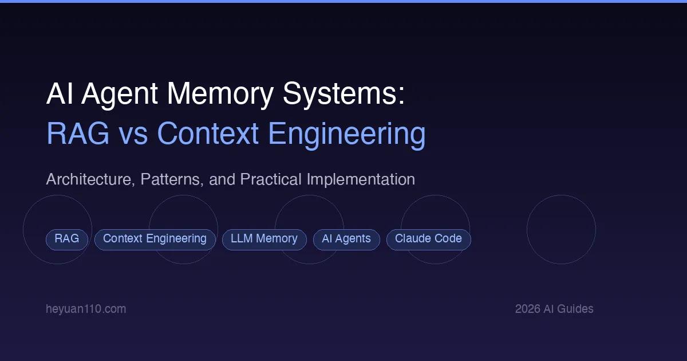

+++
date = '2026-02-21T10:00:00+08:00'
draft = false
title = 'AI Agent Memory Systems: RAG vs Context Engineering'
description = 'Compare RAG and context engineering for AI agent memory. Learn how to implement persistent memory, manage context windows, and choose the right approach for LLM agents.'
toc = true
tags = ['AI Agent', 'RAG', 'Context Engineering', 'Claude Code', 'LLM Memory']
categories = ['AI Guides']
keywords = ['ai agent memory', 'rag vs context engineering', 'ai agent context management', 'llm memory systems', 'claude code memory', 'ai agent persistent memory', 'context window management', 'vector database ai']

[params]
  faq = [
    { question = "What is the difference between RAG and context engineering for AI agents?", answer = "RAG (Retrieval-Augmented Generation) uses embedding and vector databases to dynamically retrieve relevant information at query time. Context engineering focuses on structuring and curating context files, type systems, and strategic prompt design to provide the right information upfront. RAG excels at large knowledge bases, while context engineering works better for project-specific rules and conventions." },
    { question = "Why do AI coding agents need memory systems?", answer = "AI agents like Claude Code lose all context when a session ends — every architectural decision, debugging finding, and coding convention discussed is forgotten. Memory systems solve this session amnesia by persisting important information across conversations, reducing repetitive context-setting and improving agent performance over time." },
    { question = "How does CLAUDE.md work as an AI agent memory system?", answer = "CLAUDE.md is a markdown file placed in your project root that Claude Code reads at the start of every session. It serves as persistent, human-curated memory containing project rules, tech stack details, coding conventions, and architectural decisions. Unlike RAG, it requires manual maintenance but offers full control over what the agent knows." }
  ]
+++



Every AI coding agent has a fundamental problem: **amnesia**. Start a new session with Claude Code, Cursor, or any LLM-powered tool, and it has zero memory of yesterday's work. The architecture decisions you spent two hours discussing, the bug you finally tracked down, the coding conventions you carefully established — all gone.

This is not a bug. It is how large language models work. Each session starts with a blank context window, and when that window fills up or the session ends, everything evaporates.

The question is: how do we give AI agents memory?

Two dominant approaches have emerged — **RAG (Retrieval-Augmented Generation)** and **Context Engineering** — and they solve the problem in fundamentally different ways. This guide breaks down both approaches, compares them head-to-head, and shows you practical implementation patterns for real-world AI agent workflows.

## Why AI Agents Need Memory

Before diving into solutions, let's understand the problem at a technical level.

### The Context Window Constraint

Modern LLMs operate within a fixed context window. Claude Sonnet 4 supports 200K tokens, GPT-4o handles 128K, and Gemini 1.5 Pro extends to 2M tokens. These sound enormous, but in practice, they fill up fast.

Consider a typical [Claude Code](/posts/ai/2026-02-28-claude-code-complete-guide/) session. Each tool call — reading a file, running a command, writing code — consumes 1,000 to 10,000 tokens. A moderately complex development task involves 50+ tool calls. The math is brutal: token consumption grows **quadratically** because each new tool call must include all previous context. Around 50 tool calls, a 200K context window is exhausted.

### Session Amnesia

The bigger problem is not within a session but across sessions. When you close a conversation and start a new one, the agent knows nothing about:

- Architectural decisions made yesterday
- Bugs investigated and their root causes
- Code patterns you prefer and dislike
- Project-specific conventions and constraints
- Third-party API quirks discovered through trial and error

You end up repeating yourself constantly, which is both wasteful and error-prone. Worse, the agent may make decisions that contradict earlier agreements simply because it has no memory of them.

### The Three Types of AI Agent Memory

To solve this, we need to think about memory in three layers:

| Memory Type | Analogy | Duration | Example |
|-------------|---------|----------|---------|
| **Short-term** | Working memory | Current session | Context window contents |
| **Long-term** | Reference library | Persistent | Vector databases, RAG systems |
| **Persistent config** | Rulebook | Permanent | CLAUDE.md, Cursor Rules, project docs |

Each type serves a different purpose, and the most effective AI agent setups use all three. The debate between RAG and context engineering is really about how to implement long-term and persistent memory most effectively.

## The RAG Approach: Dynamic Retrieval

RAG — Retrieval-Augmented Generation — is the industry's most established approach to giving LLMs access to external knowledge. The concept is straightforward: instead of cramming everything into the prompt, store information externally and retrieve only what is relevant at query time.

### How RAG Works

The RAG pipeline has four stages:

```
Document → Embedding → Vector Store → Retrieval → Injection
                                           ↑
                                      User Query
```

**1. Chunking and Embedding**

Source documents (code files, documentation, conversation logs) are split into chunks and converted to vector embeddings — numerical representations that capture semantic meaning. Similar concepts end up near each other in vector space.

**2. Vector Storage**

Embeddings are stored in a vector database like ChromaDB, Pinecone, Weaviate, or pgvector. These databases are optimized for similarity search — finding the vectors closest to a query vector.

**3. Retrieval**

When the agent needs information, the user's query is embedded and compared against stored vectors. The most semantically similar chunks are retrieved, typically the top 5-20 results.

**4. Context Injection**

Retrieved chunks are injected into the LLM's prompt as additional context, giving the model access to relevant information without storing everything in the context window.

### RAG for AI Agent Memory: Claude-Mem

The most sophisticated example of RAG-based agent memory is [Claude-Mem](https://github.com/thedotmack/claude-mem), a plugin that gives Claude Code persistent cross-session memory.

Claude-Mem's architecture demonstrates what production-grade RAG memory looks like:

**Five-Layer Architecture:**

```
┌─────────────────────────────────────┐
│         Claude Code Session         │
│  SessionStart → UserPrompt → Tools  │
│         (Hook System)               │
└──────────────┬──────────────────────┘
               │
               ▼
┌─────────────────────────────────────┐
│     Worker Service (Port 37777)     │
│  Context Builder │ Session Manager  │
│  Search Manager  │ SSE Broadcaster  │
└──────┬──────────────────┬───────────┘
       │                  │
       ▼                  ▼
┌──────────────┐  ┌───────────────┐
│ SQLite + FTS5│  │   ChromaDB    │
│ (Structured) │  │  (Vectors)    │
└──────────────┘  └───────────────┘
```

**How it captures memory:** Claude-Mem uses [Claude Code Hooks](/posts/ai/2026-02-28-claude-code-complete-guide/#hooks) to intercept every tool call, user prompt, and session event. A PostToolUse hook captures raw tool outputs (file reads, code changes, command results), and an AI agent compresses them into structured observations of roughly 500 tokens each — achieving 10:1 to 100:1 compression ratios.

**How it retrieves memory:** At session start, a SessionStart hook queries the database for relevant observations from recent sessions. The SearchManager runs a hybrid strategy combining:

- **Vector similarity search** (ChromaDB) — finds semantically related memories ("that authentication bug from last week")
- **Keyword search** (SQLite FTS5) — finds exact matches ("401 error", "JWT token")
- **Hybrid ranking** — merges results from both strategies

**Progressive disclosure:** Instead of dumping all retrieved memories into the context, Claude-Mem uses a three-tier approach:

1. **Index search** (~50-100 tokens per result) — returns titles, dates, types
2. **Timeline context** — shows surrounding events for cause-and-effect understanding
3. **Full details** (~500-1000 tokens per result) — complete observation only when needed

This progressive approach saves roughly 10x tokens compared to naive RAG injection.

### RAG Strengths and Weaknesses

**Strengths:**
- Scales to massive knowledge bases (thousands of documents)
- Semantic search finds conceptually related information even with different wording
- Automatic — no human curation needed once the pipeline is set up
- Dynamic — new information is automatically indexed

**Weaknesses:**
- Retrieval quality is inconsistent — sometimes retrieves irrelevant content
- Embedding models can miss nuanced technical distinctions
- Infrastructure overhead — requires vector database, embedding service, chunking logic
- Retrieved context can poison the model if outdated or incorrect information gets injected
- Token overhead from retrieved chunks reduces space for actual work

## The Context Engineering Approach: Structured Design

Context engineering takes a fundamentally different philosophy. Instead of dynamically retrieving information, it focuses on **carefully designing and curating the information that enters the context window**.

The term gained prominence through Stanford's CS146S course and Anthropic's internal practices. The core insight: the quality of an AI agent's output is determined not by the model's capabilities but by the context it receives. As one practitioner put it, "good code is a byproduct of good context."

### What Context Engineering Includes

Context engineering operates across five dimensions:

| Dimension | Description | Example |
|-----------|-------------|---------|
| **Information selection** | What to show and what to hide | Only load relevant source files, not the entire codebase |
| **Information structure** | How to organize what you show | Layered docs: design → plan → code |
| **Information quality** | Ensuring no errors or contradictions | Clean up outdated comments and docs |
| **Information timing** | When to provide what | Architecture overview first, then implementation details |
| **Tool configuration** | Extending perception through tools | Connect database schema, API docs via [MCP](/posts/ai/2026-02-28-mcp-protocol-explained/) |

### CLAUDE.md: The Foundation of Context Engineering

The simplest and most widely used context engineering tool is [CLAUDE.md](/posts/ai/2026-02-28-claude-code-claudemd-guide/) — a markdown file that Claude Code reads at the start of every session. It serves as persistent, human-curated memory.

A well-structured CLAUDE.md typically includes:

```markdown
## Project Overview
E-commerce API service built with FastAPI + SQLAlchemy

## Tech Stack
- Backend: FastAPI + SQLAlchemy
- Database: PostgreSQL 15
- Cache: Redis
- Queue: RabbitMQ

## Code Conventions
- Use pydantic v2 for data validation
- All API endpoints require type annotations
- Error handling uses custom exception classes

## Do NOT
- Use ORM lazy loading
- Write raw SQL in API handlers
- Use print for debugging — use structlog
```

This approach has clear advantages: it is version-controlled, human-readable, team-shareable, and completely deterministic. The agent sees exactly what you put in the file, every time.

But it also has significant limitations:

| Limitation | Impact |
|------------|--------|
| **Manual maintenance** | You must decide what to add and what to remove |
| **Static content** | Does not automatically capture discoveries from work sessions |
| **No search** | As the file grows, all content loads into context regardless of relevance |
| **Context budget** | Larger files consume more of the finite context window |

### Beyond CLAUDE.md: Other Context Engineering Tools

Several tools implement context engineering patterns:

**Cursor Rules** — Cursor's equivalent of CLAUDE.md, stored in `.cursor/rules/`. Supports glob-pattern matching to load different rules for different file types. A `backend.mdc` rule might apply only to Python files, while `frontend.mdc` applies to TypeScript.

**Kiro Steering Files** — Amazon's Kiro uses a `specs/` directory with structured specification files. These go beyond rules to include full product requirements, design documents, and implementation plans. The key innovation is treating specs as version-controlled artifacts that drive AI code generation.

**Agentic Docs Directories** — A pattern emerging across teams: maintaining a `docs/` hierarchy specifically designed for AI consumption:

```
docs/
├── designs/    → Product requirements, high-level goals
├── plans/      → Detailed implementation plans
├── guides/     → API tutorials, onboarding docs
schema.sql      → Data structure definitions
CLAUDE.md       → AI-specific guidance
```

Each layer has a clear audience and purpose. The entire structure serves as context that the agent can navigate, rather than a single monolithic file.

### The Four Failure Modes of Context

Context engineering is not just about what you include — it is equally about what you exclude and how you maintain quality. Research has identified four failure modes that degrade LLM performance:

**1. Context Poisoning** — Incorrect information in the context gets amplified. If your CLAUDE.md says "use React class components" but the codebase uses hooks, the agent will faithfully follow the outdated rule. Once bad information enters context, the agent references and reinforces it.

**2. Context Distraction** — As context grows beyond 32K tokens, models tend to repeat recent patterns rather than synthesize new strategies. The model is not forgetting earlier information; it is being **distracted** by more recent content, degrading decision quality.

**3. Context Confusion** — Too many tool definitions or irrelevant information impairs judgment. Berkeley's function-calling benchmarks show every model's performance drops as tool count increases. Even GPT-4-class models suffer when presented with 40+ tools.

**4. Context Conflict** — Contradictory information from multiple sources causes sharp performance drops. Microsoft and Salesforce research found that providing partial incorrect answers followed by correct information caused an average **39% performance decrease** — the early wrong information lingered and interfered with final judgments.

The practical implication: **context is not "more is better" but "more precise is better."** Every piece of information you give an AI agent has a cost — not just in tokens but in attention.

## RAG vs Context Engineering: Head-to-Head Comparison

Now that we understand both approaches, let's compare them directly.

| Dimension | RAG | Context Engineering |
|-----------|-----|-------------------|
| **Setup effort** | High (vector DB, embeddings, pipeline) | Low to medium (markdown files, directory structure) |
| **Maintenance** | Mostly automatic | Manual curation required |
| **Scalability** | Handles thousands of documents | Best for focused, project-level knowledge |
| **Precision** | Variable — depends on retrieval quality | High — you control exactly what's included |
| **Token efficiency** | Medium — retrieved chunks consume tokens | High — curated content is compact |
| **Team sharing** | Complex (shared vector DBs) | Simple (commit files to git) |
| **Dynamism** | Automatically indexes new information | Requires manual updates |
| **Determinism** | Non-deterministic (retrieval varies) | Deterministic (same file, same context) |
| **Risk of poisoning** | Higher (stale embeddings persist) | Lower (human reviews content) |

### When to Use RAG

Choose RAG when:

- You have a **large, evolving knowledge base** (hundreds of documents, API references, past conversations)
- You need **semantic search** across diverse content ("find that discussion about rate limiting from two weeks ago")
- You want **automatic memory capture** without manual intervention
- Your use case involves **cross-project knowledge** that does not fit in a single config file
- You are building a system that needs to **learn continuously** from interactions

Real-world example: Claude-Mem's approach is ideal for individual developers who work across multiple projects and want their AI agent to remember debugging sessions, architectural decisions, and patterns discovered over weeks of work.

### When to Use Context Engineering

Choose context engineering when:

- You need **deterministic, reproducible** agent behavior
- Your team needs **shared, version-controlled** agent configuration
- Context quality matters more than quantity — you want **precision over coverage**
- You are working on a **single project** with well-defined conventions
- You want **full control** over what the agent knows and does not know

Real-world example: A team maintaining a production codebase uses CLAUDE.md to enforce coding standards, architectural boundaries, and deployment procedures. Every team member's agent session starts with the same curated context.

### The Best Approach: Use Both

The most effective strategy combines both approaches in a layered architecture:

```
Layer 1: CLAUDE.md (Static Rules)
  → Tech stack, coding conventions, architectural decisions
  → Version-controlled, team-shared, always loaded

Layer 2: Structured Docs (Context Engineering)
  → Design docs, implementation plans, API guides
  → Loaded selectively based on task context

Layer 3: RAG Memory (Dynamic Knowledge)
  → Conversation history, debugging sessions, discoveries
  → Retrieved dynamically via semantic search

Layer 4: Live Context (Session-specific)
  → Current file contents, test results, error messages
  → Gathered in real-time during the session
```

Think of it as the difference between an employee handbook (CLAUDE.md), a project wiki (structured docs), a searchable work journal (RAG), and the whiteboard in front of you (live context). You need all four.

## Practical Implementation Patterns

### Pattern 1: The Minimal Setup (Context Engineering Only)

For most individual developers, start here:

**Step 1:** Create a `CLAUDE.md` in your project root with your tech stack, coding conventions, and key architectural decisions. See the [CLAUDE.md best practices guide](/posts/ai/2026-02-28-claude-code-claudemd-guide/) for detailed templates.

**Step 2:** Maintain a `docs/` directory with design documents and implementation plans. Reference these in your CLAUDE.md so the agent knows where to find detailed context.

**Step 3:** Practice context hygiene:
- Review and update CLAUDE.md weekly
- Keep one conversation focused on one task
- Start new sessions for new topics rather than extending old ones
- Only enable the [MCP servers](/posts/ai/2026-02-28-mcp-protocol-explained/) relevant to the current task

This pattern requires zero infrastructure and works immediately.

### Pattern 2: RAG-Enhanced Memory

When you need cross-session memory:

**Step 1:** Install Claude-Mem or a similar memory plugin. It hooks into your AI agent's lifecycle and automatically captures observations.

**Step 2:** Configure context injection parameters. Start conservative — inject observations from the last 10 sessions, limit to 50 observations maximum.

**Step 3:** Use progressive disclosure. Do not dump all memories into the session start. Let the agent search for specific memories when needed, using index-first retrieval to minimize token waste.

**Step 4:** Periodically audit stored memories. RAG systems accumulate stale information over time. Review and prune memories that are no longer relevant.

### Pattern 3: Team-Scale Context Engineering

For teams building production software with AI agents:

**Step 1:** Establish a layered documentation structure that serves both humans and AI agents:

```
CLAUDE.md              → Agent-specific rules and conventions
docs/designs/          → Product requirements (what to build)
docs/plans/            → Implementation plans (how to build it)
docs/guides/           → API documentation (how to use it)
schema.sql             → Database schema (source of truth)
.cursor/rules/         → File-type-specific rules (if using Cursor)
```

**Step 2:** Treat context files like code. Use pull requests to review changes to CLAUDE.md and design docs. Contradictions between context sources cause significant agent performance degradation.

**Step 3:** Implement dynamic context loading. Not every task needs every piece of context. Use file-pattern matching (Cursor Rules) or task-specific context injection to keep the context window focused.

**Step 4:** Build feedback loops. When the agent produces unexpected output, analyze whether it was a context problem — missing information, contradictory sources, or context overload. Adjust your context strategy accordingly.

### Pattern 4: Building Custom Memory with Python

For developers who want to [build their own AI agent](/posts/ai/2026-03-07-build-ai-agent-python/) with memory, here is a minimal RAG memory implementation:

```python
import chromadb
from datetime import datetime

class AgentMemory:
    def __init__(self, collection_name="agent_memory"):
        self.client = chromadb.PersistentClient(path="./memory_db")
        self.collection = self.client.get_or_create_collection(
            name=collection_name,
            metadata={"hnsw:space": "cosine"}
        )

    def store(self, content: str, metadata: dict = None):
        """Store a memory with automatic embedding."""
        doc_id = f"mem_{datetime.now().strftime('%Y%m%d_%H%M%S')}"
        self.collection.add(
            documents=[content],
            ids=[doc_id],
            metadatas=[metadata or {}]
        )

    def recall(self, query: str, n_results: int = 5) -> list:
        """Retrieve relevant memories by semantic similarity."""
        results = self.collection.query(
            query_texts=[query],
            n_results=n_results
        )
        return results["documents"][0]

    def forget(self, older_than_days: int = 30):
        """Remove stale memories to prevent context poisoning."""
        # Implementation depends on your metadata schema
        pass
```

This gives you the foundation. Production systems add compression (summarizing raw observations into compact memories), hybrid search (combining vector similarity with keyword matching), and progressive disclosure (returning summaries first, details on request).

## The Future of AI Agent Memory

The memory problem is one of the most active areas of AI tooling development. Several trends are shaping where this goes:

**Memory as a first-class feature.** Anthropic, OpenAI, and Google are all building memory capabilities directly into their models and platforms. Expect context engineering patterns like CLAUDE.md to become standardized across tools.

**Hybrid architectures.** The line between RAG and context engineering is blurring. Tools like Claude-Mem already combine vector retrieval with structured context injection. Future systems will seamlessly blend static rules, dynamic retrieval, and real-time context.

**Context compression.** As models become better at compression, we will see more systems that summarize and distill context rather than storing raw content. Claude-Mem's Endless Mode — which compresses tool outputs from O(N^2) to O(N) token growth — previews this future.

**Team memory.** Current memory solutions are individual. The next frontier is shared team memory — where one developer's debugging session automatically benefits the entire team's agent context. Anthropic's work on [Claude Code agent teams](https://docs.anthropic.com/en/docs/claude-code/agent-teams) hints at this direction.

## Key Takeaways

1. **AI agents suffer from session amnesia** — they lose all context between sessions, creating repetitive work and inconsistent behavior.

2. **RAG and context engineering solve different parts of the problem.** RAG handles large, dynamic knowledge bases with semantic search. Context engineering provides deterministic, curated, version-controlled agent configuration.

3. **The four context failure modes** — poisoning, distraction, confusion, and conflict — mean that more context is not always better. Precision matters more than volume.

4. **Use both approaches together.** Static rules in CLAUDE.md, structured docs for design context, RAG for cross-session memory, and live context for the current task.

5. **Start simple.** A well-maintained CLAUDE.md file provides 80% of the benefit with 20% of the effort. Add RAG memory only when you need cross-session knowledge retrieval.

6. **Treat context like code.** Version-control your context files, review changes, and maintain consistency across sources. Context rot is as dangerous as code rot.

## FAQ

**What is the difference between RAG and context engineering for AI agents?**

RAG uses embedding and vector databases to dynamically retrieve relevant information at query time. Context engineering focuses on structuring and curating context files, type systems, and strategic prompt design to provide the right information upfront. RAG excels at large knowledge bases, while context engineering works better for project-specific rules and conventions.

**Why do AI coding agents need memory systems?**

AI agents like Claude Code lose all context when a session ends — every architectural decision, debugging finding, and coding convention discussed is forgotten. Memory systems solve this session amnesia by persisting important information across conversations, reducing repetitive context-setting and improving agent performance over time.

**How does CLAUDE.md work as an AI agent memory system?**

CLAUDE.md is a markdown file placed in your project root that Claude Code reads at the start of every session. It serves as persistent, human-curated memory containing project rules, tech stack details, coding conventions, and architectural decisions. Unlike RAG, it requires manual maintenance but offers full control over what the agent knows.

**Can I use RAG and context engineering together?**

Yes, and this is the recommended approach. Use CLAUDE.md for static project rules and conventions (context engineering), structured documentation for design context, and a RAG system like Claude-Mem for dynamic cross-session memory. Each layer serves a different purpose and complements the others.

**What is context poisoning in AI agents?**

Context poisoning occurs when incorrect or outdated information enters an agent's context and gets amplified. For example, an outdated rule in CLAUDE.md saying "use React class components" will cause the agent to generate legacy code patterns even when the codebase has migrated to hooks. Regular auditing of context files prevents this failure mode.

## Related Reading

- [Claude Code Complete Guide 2026](/posts/ai/2026-02-28-claude-code-complete-guide/) — The hub page for all Claude Code features and workflows
- [CLAUDE.md Best Practices Guide](/posts/ai/2026-02-28-claude-code-claudemd-guide/) — Deep dive into context engineering with CLAUDE.md
- [Context Engineering Guide](/posts/ai/2026-03-10-context-engineering-guide/) — From prompt engineering to context engineering
- [MCP Protocol Explained](/posts/ai/2026-02-28-mcp-protocol-explained/) — Extending AI agent context through tool integration
- [Build an AI Agent from Scratch with Python](/posts/ai/2026-03-07-build-ai-agent-python/) — Implement your own agent with memory capabilities
- [Anthropic: Writing Effective Tools for Agents](https://www.anthropic.com/engineering/writing-tools-for-agents) — Anthropic's principles for tool design that impacts context quality
- [How Long Contexts Fail](https://www.dbreunig.com/2025/06/22/how-contexts-fail-and-how-to-fix-them.html) — Research on context failure modes and mitigation strategies
