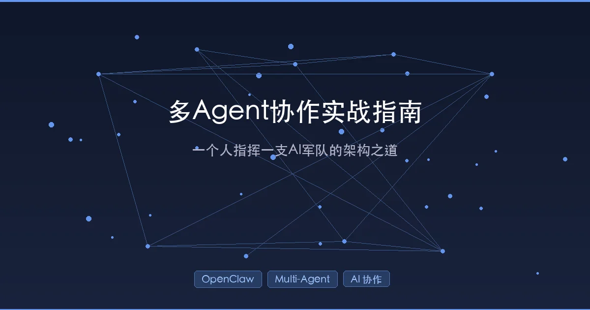

+++
date = '2026-02-23T17:00:00+08:00'
draft = false
title = 'OpenClaw Multi-Agent Guide: Architecture, Configuration, and Collaboration Patterns'
description = 'A deep dive into multi-agent design inside the OpenClaw AI agent framework (2026). From single-agent bottlenecks to building agent teams, covering routing bindings, inter-agent communication, four collaboration patterns, and production best practices.'
toc = true
tags = ['OpenClaw', 'Multi-Agent', 'AI Collaboration', 'AI Architecture']
categories = ['AI Guides']
keywords = ['OpenClaw multi-agent', 'multi-agent architecture', 'AI agent collaboration', 'agent orchestration', 'sessions_send']

[[params.faqItems]]
question = "What is OpenClaw multi-agent architecture?"
answer = "OpenClaw multi-agent architecture lets you create multiple specialized AI agents — each with its own memory, workspace, and model — that collaborate through routing bindings and inter-agent communication via sessions_send. Instead of one overloaded agent, you build a team of specialists (writer, coder, researcher) coordinated by a supervisor agent."

[[params.faqItems]]
question = "How many agents should I create in OpenClaw?"
answer = "For personal use, 3-5 agents are sufficient: one supervisor plus 2-4 specialists. For team use, divide by business line with 2-3 agents per line. If two agents handle 80%+ the same task type, consider merging them — more agents means more communication overhead."

[[params.faqItems]]
question = "Does inter-agent communication in OpenClaw consume extra tokens?"
answer = "Yes. Every sessions_send call is an API call that consumes tokens. To reduce costs, have the supervisor agent handle simple tasks directly, use token optimization strategies for context length, and assign lighter-weight models to sub-agents."

[[params.faqItems]]
question = "What are the main multi-agent collaboration patterns in OpenClaw?"
answer = "OpenClaw supports four patterns: Supervisor (central coordinator delegates to specialists sequentially), Router (parallel dispatch based on message source), Pipeline (assembly-line processing where each agent's output feeds the next), and Parallel (splitting one task across multiple agents simultaneously). Start with Supervisor and upgrade as needed."

[[params.faqItems]]
question = "Can OpenClaw agents use different AI models?"
answer = "Yes. Each agent can be configured with a different model. For example, you might use GLM-4.7 for brainstorming, DeepSeek for writing, Claude Sonnet for coding, and GPT-4o for research — choosing the best model for each agent's specialty."
+++



Have you ever had this experience: your AI assistant starts "losing its mind" mid-conversation -- you ask it to write a blog post, and it suddenly spits out code logic; you ask it to research competitors, and it starts correcting typos from last week?

The AI didn't get dumber. You're just making one "brain" do too many jobs. It's like asking the front desk receptionist to also handle accounting, HR, and engineering -- nobody ends up doing anything well.

The solution? **Build an AI team** -- let different agents each handle their own specialty, just like a real company operates.

This article takes a deep dive into building a multi-agent collaboration system with [OpenClaw](https://github.com/openclaw/openclaw). We'll go beyond "how to configure" and explain "why to configure it this way," plus how mainstream multi-agent architecture patterns work in practice.

## 1. Why a Single Agent Isn't Enough

### 1.1 Three Bottlenecks of a Single Agent

Most people use AI assistants in an "all-in-one" fashion: copywriting, coding, image generation, and research all crammed into one agent. This seems convenient, but as usage grows, three problems get progressively worse:

| Problem | Symptom | Root Cause |
|---------|---------|------------|
| **Memory Bloat** | Agent responses get slower over time | Memory files (USER.md, memory/, etc.) keep accumulating; every conversation loads massive history |
| **Context Contamination** | Answers "bleed" across domains, logic gets confused | Knowledge from different domains interferes -- writing an article triggers code associations |
| **Cost Spiral** | Token consumption far exceeds expectations | Every conversation carries all irrelevant background material, inflating input tokens |

A vivid analogy: a single agent is like a worker with 50 browser tabs open simultaneously -- it looks like everything is being done, but nothing is being done well.

### 1.2 The Core Philosophy of Multi-Agent

The core philosophy of multi-agent architecture is simple: **let specialists handle their specialties**.

This isn't a new concept. In software engineering, the Single Responsibility Principle has long told us: a module should have only one reason to change. Applied to the AI agent world:

- A **writing agent** only cares about prose -- its memory is filled with writing techniques and style templates
- A **coding agent** only cares about code logic -- its workspace is filled with project code and technical docs
- A **research agent** only cares about information gathering -- it's equipped with search tools and data organization abilities

Each agent has its own independent "brain" (memory), "office" (workspace), and "work log" (session records), without any interference.

> One person can be an army -- provided you know how to arrange the troops.

## 2. OpenClaw Multi-Agent Architecture Overview

### 2.1 Architecture Core: Three-Layer Isolation

In OpenClaw, each agent isn't just a name -- it's a **fully independent virtual employee**. Understanding this point is crucial:

```
~/.openclaw/agents/<agentId>/
├── agent/                    # Identity credentials
│   ├── auth-profiles.json    # Auth config (which API key to use)
│   └── models.json           # Model config (which model to use)
└── sessions/                 # Private journal
    ├── <session-id>.jsonl    # Independent chat history
    └── sessions.json         # Session index

~/.openclaw/workspace-<agentId>/
├── SOUL.md                   # Soul/personality definition
├── AGENTS.md                 # Agent behavior guidelines
├── USER.md                   # User information
├── PROMPT.md                 # Prompt templates
├── IDENTITY.md               # Identity definition
└── memory/                   # Memory storage
```

These three isolation layers correspond to:

| Layer | Directory | Purpose | Analogy |
|-------|-----------|---------|---------|
| **Identity Layer** | `agents/<id>/agent/` | Determines which model and credentials to use | Employee badge |
| **State Layer** | `agents/<id>/sessions/` | Independent chat history and routing state | Work journal |
| **Workspace Layer** | `workspace-<id>/` | Independent files, prompts, and memory | Personal office |

The benefit of this isolation design is **physical-level context separation**. Your writing agent will never see the coding agent's code files, and the coding agent won't be distracted by the writing agent's style guides.

### 2.2 Route Binding: The Bindings Mechanism

With independent agents in place, the next question is: when a message comes in, how does the system know which agent should handle it?

The answer is the **Bindings mechanism** -- a set of deterministic routing rules. OpenClaw matches from highest to lowest priority:

```
Priority 1: Exact peer match (DM/group ID)
Priority 2: Parent peer match (thread inheritance)
Priority 3: guildId + role (Discord-specific)
Priority 4: guildId standalone match
Priority 5: teamId (Slack-specific)
Priority 6: accountId match
Priority 7: Channel-level match
Priority 8: Default agent fallback
```

In simple terms: **the more specific the rule, the higher its priority**. If you assign a dedicated agent to a specific Feishu group, messages from that group will always route to that agent -- no exceptions.

Multi-condition bindings use **AND logic** -- all conditions must be satisfied for a match. If multiple rules match at the same priority level, the **first one in the config file wins**.

### 2.3 Two Approaches: Clone Mode vs Independent Fleet

OpenClaw supports two multi-agent deployment approaches, each suited to different scenarios:

| Dimension | Clone Mode (Single Bot Routing) | Independent Fleet (Multiple Bots) |
|-----------|------|------|
| **Implementation** | One Feishu bot, routing to different agents via Bindings | Each agent has its own independent Feishu bot |
| **User Experience** | Same bot appears in all groups, but "switches brains" | Each bot has its own avatar and name |
| **Management Cost** | Low, simple configuration | High, requires managing multiple bots |
| **Best For** | Personal use, efficiency-focused | Team collaboration, role differentiation needed |
| **Reference PR** | Supported by default | [Feishu multi-bot PR #137](https://github.com/m1heng/clawdbot-feishu/pull/137) |

For individual users, **Clone Mode is strongly recommended** -- maximum flexibility with minimal configuration. This article focuses on this approach.

## 3. Hands-On Configuration: Building a Multi-Agent Team from Scratch

### 3.1 Creating a New Agent

Creating an isolated agent via the command line is straightforward:

```bash
# Create a writing agent named "writer" using the deepseek model
openclaw agents add writer \
  --model deepseek/deepseek-chat \
  --workspace ~/.openclaw/workspace-writer

# Create a brainstorming agent using glm-4.7
openclaw agents add brainstorm \
  --model zai/glm-4.7 \
  --workspace ~/.openclaw/workspace-brainstorm

# Create a coding agent using claude
openclaw agents add coder \
  --model anthropic/claude-sonnet-4-6 \
  --workspace ~/.openclaw/workspace-coder
```

Here's a clever design detail: **different agents can use different models**. You can choose the most suitable "brain" based on task characteristics:

| Agent | Recommended Model | Reason |
|-------|------------------|--------|
| Brainstorm | glm-4.7 | Strong Chinese creative capabilities |
| Writer | deepseek | Great cost-effectiveness, stable logical output |
| Coder | claude-sonnet | Strong coding ability, deep understanding |
| Researcher | gpt-4o | Good multimodal comprehension, suited for information synthesis |

### 3.2 Giving Agents a Soul: Writing the "Onboarding Materials"

Creating an agent only gives it a "body." What truly makes it useful is its "soul files."

In each agent's workspace directory, three core files need to be configured:

**SOUL.md** -- The agent's personality definition:

```markdown
# Writer Agent

## Role
You are an experienced content writing expert, skilled at dissecting
technology topics with sharp, authentic perspectives.

## Style
- Openings must use a compelling scene or counter-intuitive insight
- Paragraphs should be short and punchy, mobile-reading friendly
- Use analogies liberally so even a beginner can understand complex concepts
- Endings must include a call-to-action (CTA)

## Prohibitions
- Never use hollow phrases like "as everyone knows" or "it goes without saying"
- Don't stack jargon; explain every technical term on first appearance
```

**AGENTS.md** -- The agent's behavior guidelines:

```markdown
# Work Guidelines

## Output Format
- All articles use Markdown format
- Heading levels should not exceed three (H2 > H3 > H4)
- Code blocks must specify the language type

## Workflow
1. Draft an outline first, then expand after confirmation
2. Keep each paragraph under 150 words
3. Self-check SEO elements after completion
```

**USER.md** -- User information:

```markdown
# User Information

## Identity
Blogger and tech content creator, focused on AI tools and productivity.

## Preferences
- Language style: Professional but not academic, with warmth
- Target readers: Tech enthusiasts and product managers interested in AI
- Publishing platforms: Blog + social media
```

> Writing "onboarding materials" for AI may sound surreal, but this is precisely what makes agent output stable and controllable. **The more carefully you define it, the more diligently it works.**

### 3.3 Setting Up Identity Markers

Give each agent a recognizable identity in chat groups:

```bash
# Set display name and emoji for each agent
openclaw agents set-identity --agent writer --name "Writer" --emoji "✍️"
openclaw agents set-identity --agent brainstorm --name "Brainstormer" --emoji "💡"
openclaw agents set-identity --agent coder --name "Code Smith" --emoji "⚡"
```

### 3.4 Binding Message Channels

After creating agents, you need to bind them to specific message channels. OpenClaw supports multiple channels -- here we'll use **Feishu** and **Telegram** as examples.

#### Feishu Binding

Create a dedicated group in Feishu for each agent and obtain the **group chat ID** (a string starting with `oc_`).

Then configure the Bindings routing in `openclaw.json`:

```json
{
  "bindings": [
    {
      "agentId": "writer",
      "match": {
        "channel": "feishu",
        "peer": {
          "kind": "group",
          "id": "oc_abc123..."
        }
      }
    },
    {
      "agentId": "brainstorm",
      "match": {
        "channel": "feishu",
        "peer": {
          "kind": "group",
          "id": "oc_def456..."
        }
      }
    },
    {
      "agentId": "coder",
      "match": {
        "channel": "feishu",
        "peer": {
          "kind": "group",
          "id": "oc_ghi789..."
        }
      }
    }
  ]
}
```

**How it works**: A single Feishu bot is added to three different groups. When messages come in from different groups, the Bindings mechanism routes them to the corresponding agent based on group ID. To the user, it looks like the same bot, but underneath it connects to completely different "brains."

#### Telegram Binding

Telegram binding follows the same logic as Feishu, except `channel` becomes `telegram` and `peer.id` uses Telegram's **Chat ID** (numeric format, typically negative for groups).

To get the Chat ID: add the bot to the group, then visit `https://api.telegram.org/bot<YOUR_TOKEN>/getUpdates` and find the `chat.id` field in the returned JSON.

Configuration example:

```json
{
  "bindings": [
    {
      "agentId": "writer",
      "match": {
        "channel": "telegram",
        "peer": {
          "kind": "group",
          "id": "-1001234567890"
        }
      }
    },
    {
      "agentId": "coder",
      "match": {
        "channel": "telegram",
        "peer": {
          "kind": "group",
          "id": "-1009876543210"
        }
      }
    }
  ]
}
```

You also need to enable the Telegram channel in the `channels` section of `openclaw.json`:

```json
{
  "channels": {
    "telegram": {
      "enabled": true,
      "botToken": "123456:ABC-DEF1234ghIkl-zyx57W2v1u123ew11"
    }
  }
}
```

**Feishu vs Telegram Comparison**:

| Dimension | Feishu | Telegram |
|-----------|--------|----------|
| **peer.id Format** | String starting with `oc_` | Numeric (negative for groups) |
| **Bot Creation** | Feishu Open Platform | @BotFather |
| **No-mention Mode** | Requires additional `requireMention` config | Set bot as group admin or use `/` commands |
| **Best For** | Enterprise internal, team collaboration | Personal use, cross-border communication |

> You can absolutely **bind both channels simultaneously** -- use Feishu groups for writing agents during daily work, and Telegram groups for coding agents to handle technical issues on the go. Multi-channel mixed usage is the true power of multi-agent architecture.

### 3.5 Enabling No-Mention Mode

By default, the bot must be @mentioned in groups to trigger a response. If you want a group to become a "private office" with an agent, you can disable this restriction:

```json
{
  "channels": {
    "feishu": {
      "enabled": true,
      "appId": "cli_a9f21xxxxx89bcd",
      "appSecret": "w6cPunaxxxxBl1HHtdF",
      "groups": {
        "oc_abc123...": { "requireMention": false },
        "oc_def456...": { "requireMention": false }
      }
    }
  }
}
```

You also need to enable the `im:message.group_msg` permission in the Feishu admin panel -- both configurations must work together.

## 4. Inter-Agent Communication: From Solo Work to Team Collaboration

Setting up multiple agents is just the first step. The real value lies in making them **collaborate** -- just like a company can't function with employees who never communicate.

### 4.1 Core Mechanism: sessions_send

Inter-agent communication relies on OpenClaw's built-in `sessions_send` tool. Think of it as an "internal phone line" between agents:

```
User sends instruction → Supervisor Agent (main) receives
                ↓
         Determines task type
        ↙    ↓     ↘
  brainstorm  writer  coder
              ↓
        Collects results
                ↓
         Supervisor Agent returns to user
```

### 4.2 Configuring Agent-to-Agent Communication

To make the "internal phone" work, you must explicitly enable permissions in the config file:

```json
{
  "tools": {
    "agentToAgent": {
      "enabled": true,
      "allow": ["main", "brainstorm", "writer", "coder"]
    }
  }
}
```

Key points:

- **Disabled by default**: Inter-agent communication must be explicitly enabled -- this is a security-by-design choice
- **Allowlist mechanism**: The `allow` list explicitly defines which agents can communicate with each other
- **Principle of least privilege**: Not all agents need to communicate with each other -- only enable it for the ones that need it

### 4.3 Designing the Supervisor Agent Role

In my experience, the most effective pattern is setting up a **Supervisor Agent** (typically called `main`) whose job isn't to do the work itself, but to receive and delegate tasks:

```markdown
# Main Agent - SOUL.md

## Role
You are the team's Chief Coordination Officer. Your core responsibilities:

1. **Receive requests**: Understand the user's original instruction
2. **Precise dispatch**: Determine task type and assign to the appropriate specialist agent
3. **Quality control**: Review specialist agent output, request revisions when needed
4. **End-to-end orchestration**: Ensure multi-step tasks don't drop the ball

## Dispatch Rules
- Brainstorming, creative divergence → @brainstorm
- Article writing, copy optimization → @writer
- Code writing, technical implementation → @coder
- Simple Q&A, casual chat → Handle yourself
```

The core significance of this design isn't just division of labor -- it's **oversight and fault tolerance**: when a specialist agent gets stuck or errors out, the supervisor agent can intervene and ensure the process doesn't break.

## 5. Four Collaboration Patterns: A Deep Dive

With the basics covered, let's zoom out to the architecture level. Based on [LangChain's multi-agent architecture research](https://blog.langchain.com/choosing-the-right-multi-agent-architecture/) and [Google's eight design patterns](https://www.infoq.com/news/2026/01/multi-agent-design-patterns/), mainstream multi-agent collaboration patterns can be grouped into four categories:

### 5.1 Supervisor Pattern

```
         ┌─────────┐
         │  User    │
         │ Request  │
         └────┬────┘
              ↓
      ┌───────────────┐
      │  Supervisor    │
      │  (Main Agent)  │
      └──┬─────┬───┬──┘
         ↓     ↓   ↓
      ┌───┐ ┌───┐ ┌───┐
      │ A │ │ B │ │ C │
      └───┘ └───┘ └───┘
         ↓     ↓   ↓
      ┌───────────────┐
      │ Aggregate &   │
      │    Output     │
      └───────────────┘
```

**How it works**: A central Supervisor receives all requests, breaks them into subtasks, assigns them to specialist agents, collects results, and produces consolidated output.

**OpenClaw implementation**: This is exactly the `main` agent pattern configured earlier. Through `agentToAgent` and `sessions_send`, the main agent can send instructions to any specialist agent and retrieve results.

**Best suited for**:
- Personal assistants needing a unified entry point
- Tasks requiring cross-domain collaboration (research first, then write, then format)
- Scenarios needing quality oversight and result review

**OpenClaw configuration example**:

```json
{
  "agents": {
    "list": [
      { "id": "main", "workspace": "~/.openclaw/workspace-main" },
      { "id": "writer", "workspace": "~/.openclaw/workspace-writer" },
      { "id": "coder", "workspace": "~/.openclaw/workspace-coder" }
    ]
  },
  "tools": {
    "agentToAgent": {
      "enabled": true,
      "allow": ["main", "writer", "coder"]
    }
  }
}
```

### 5.2 Router Pattern

```
         ┌─────────┐
         │  User    │
         │ Request  │
         └────┬────┘
              ↓
      ┌───────────────┐
      │    Router      │
      │  (Dispatcher)  │
      └──┬─────┬───┬──┘
         ↓     ↓   ↓      ← Parallel execution
      ┌───┐ ┌───┐ ┌───┐
      │ A │ │ B │ │ C │
      └───┘ └───┘ └───┘
         ↓     ↓   ↓
      ┌───────────────┐
      │ Synthesize &  │
      │    Output     │
      └───────────────┘
```

**How it works**: The Router classifies input and dispatches requests in parallel to multiple specialist agents, then synthesizes results for output. Routers are typically **stateless**.

**Difference from Supervisor**: The Supervisor does **sequential coordination** (do A, then B), while the Router does **parallel dispatch** (A and B simultaneously).

**OpenClaw implementation**: Using the deterministic routing rules of Bindings, messages are automatically dispatched to the corresponding agent based on source (group/channel/user) -- this is inherently the Router pattern.

**Best suited for**:
- Different channels needing different styles (Feishu in Chinese, Telegram in English)
- Different user groups needing different expertise levels
- Fast response needed without cross-agent collaboration

### 5.3 Pipeline Pattern

```
      ┌─────────┐
      │  User    │
      │ Request  │
      └────┬────┘
           ↓
      ┌──────────┐     ┌──────────┐     ┌──────────┐
      │Researcher│ ──→ │  Writer  │ ──→ │ Reviewer │
      └──────────┘     └──────────┘     └──────────┘
                                             ↓
                                       ┌──────────┐
                                       │  Final   │
                                       │  Output  │
                                       └──────────┘
```

**How it works**: Tasks flow through agents like an assembly line. Each agent's output becomes the next agent's input.

**OpenClaw implementation**: Through `sessions_send`, the supervisor agent can orchestrate an execution chain: first have the research agent gather materials, pass the results to the writing agent for a draft, then hand it to the review agent for polishing.

**Best suited for**:
- Content creation pipeline: research → draft → review → format
- Code development pipeline: design → code → test → deploy
- Data processing pipeline: collect → clean → analyze → visualize

**Practical example** -- A blog post production pipeline:

```
Step 1: @brainstorm "Brainstorm 5 topic ideas around AI coding productivity"
Step 2: After user picks a direction → @writer "Write an article based on: {brainstorm output}"
Step 3: After writing is done → @coder "Check if the code examples in the article are correct and runnable"
Step 4: Main agent consolidates all feedback and outputs the final version
```

### 5.4 Parallel Pattern

```
            ┌─────────┐
            │  User    │
            │ Request  │
            └────┬────┘
                 ↓
         ┌──────────────┐
         │ Task Splitter │
         └──┬────┬────┬─┘
            ↓    ↓    ↓      ← Simultaneous execution
         ┌───┐ ┌───┐ ┌───┐
         │ A │ │ B │ │ C │
         └─┬─┘ └─┬─┘ └─┬─┘
           ↓     ↓     ↓
         ┌──────────────┐
         │   Result     │
         │  Aggregator  │
         └──────────────┘
```

**How it works**: A single task is split into multiple independent subtasks, processed by multiple agents simultaneously, with results aggregated at the end.

**Best suited for**:
- Competitive analysis: multiple agents researching different competitors simultaneously
- Multi-angle review: having security, performance, and maintainability agents each review the same code
- Multi-language translation: translating the same content into multiple languages simultaneously

### 5.5 How to Choose the Right Pattern?

You don't need to design a complex architecture from the start. According to [LangChain's recommendation](https://blog.langchain.com/choosing-the-right-multi-agent-architecture/), the optimal path is **progressive upgrade**:

```
Single Agent + Tools
    ↓ (context contamination begins)
Single Agent + Skills
    ↓ (memory bloat, cost spiral)
Supervisor + 2-3 Specialist Agents
    ↓ (need more complex collaboration)
Pipeline / Parallel Hybrid Pattern
```

> **Core principle**: Adding tools is preferable to adding agents. Only upgrade to multi-agent mode when you hit clear limitations.

## 6. Production Environment Best Practices

### 6.1 Security Sandbox Configuration

Different agents should have different permissions. A writing agent doesn't need code execution capabilities, and a research agent doesn't need file write permissions:

```json
{
  "agents": {
    "list": [
      {
        "id": "writer",
        "sandbox": { "mode": "all", "scope": "agent" },
        "tools": {
          "allow": ["read", "browser"],
          "deny": ["exec", "write"]
        }
      },
      {
        "id": "coder",
        "tools": {
          "allow": ["exec", "read", "write"],
          "deny": ["browser"]
        }
      }
    ]
  }
}
```

### 6.2 Flexible Model-Channel Pairing

OpenClaw supports using different models across different channels, and even switching models for the same agent in different scenarios:

| Channel | Recommended Model | Reason |
|---------|------------------|--------|
| Feishu (daily) | deepseek | Cost-effective, fast response |
| WhatsApp | claude-sonnet | Fast, accurate, mobile-friendly |
| Telegram (deep tasks) | claude-opus | Deep thinking, suited for complex problems |

### 6.3 Skills Sharing Mechanism

Multiple agents can share common skills while retaining their own specialized skills:

```
~/.openclaw/skills/           # Globally shared skills
├── web-search/               # Search capability (shared by all agents)
├── file-tools/               # File operations (shared by all agents)
└── image-gen/                # Image generation (shared by all agents)

~/.openclaw/workspace-writer/skills/   # Writer-exclusive skills
├── seo-checker/              # SEO checking
└── article-template/         # Article templates

~/.openclaw/workspace-coder/skills/    # Coder-exclusive skills
├── code-review/              # Code review
└── test-runner/              # Test running
```

### 6.4 Monitoring and Debugging

Debugging a multi-agent system is more complex than a single agent. Recommendations:

1. **Configure HEARTBEAT.md for each agent**: Periodically check whether agents are online and responding normally
2. **Set log levels**: Enable detailed logging during development to observe inter-agent communication
3. **Establish fallback mechanisms**: When a specialist agent is unresponsive, the supervisor agent should handle the task itself or notify the user

## 7. Common Questions and Pitfall Guide

### Q1: Are more agents always better?

**No.** Each additional agent increases communication overhead and management cost. My recommendations:

- **Personal use**: 3-5 agents are sufficient (supervisor + 2-4 specialists)
- **Team use**: Divide by business line, 2-3 agents per line
- **Key metric**: If two agents' conversations are 80%+ the same task type, consider merging them

### Q2: Does inter-agent communication consume extra tokens?

**Yes.** Every `sessions_send` is an API call. Ways to reduce unnecessary communication:
- Have the supervisor agent assess task complexity first; handle simple tasks directly
- Use [token optimization strategies](/posts/ai/2026-02-14-openclaw-automation-pitfalls/) to reduce context length per communication
- Assign lighter-weight models to sub-agents

### Q3: How to handle "understanding gaps" between agents?

When Agent A's output is handed to Agent B, misinterpretation can occur. Solutions:
- **Structured communication**: Pass structured JSON data between agents instead of free-form text
- **Templated instructions**: The supervisor agent uses standardized instruction templates to dispatch sub-agents
- **Validation checkpoints**: Add review steps at critical points

### Q4: Can agents collaborate across platforms?

**Absolutely.** OpenClaw isn't limited to Feishu -- it supports Telegram, Discord, WhatsApp, and more. You can even have a Feishu group agent and a Telegram agent collaborate through `sessions_send`.

## Conclusion

Multi-agent architecture isn't some arcane technology. Its core philosophy is identical to managing a company:

1. **Hire the right people** (create appropriate agents, choose the right models)
2. **Divide responsibilities clearly** (write soul files, define role boundaries)
3. **Build communication channels** (configure routing bindings and inter-agent communication)
4. **Establish oversight** (set up a supervisor agent, build quality control)

Starting today, you no longer need an "omniscient but error-prone" AI assistant. What you need is a team of specialized, efficiently collaborating **AI agents**.

One final rule of thumb: **if you find yourself telling the AI "ignore that, focus on this," it's time to split into multiple agents**.

## Further Reading

- [OpenClaw Detailed Setup Tutorial: Beginner-Friendly with Pro Tips](/posts/ai/2026-02-12-openclaw-usage-tutorial/)
- [Deconstructing OpenClaw's Automation Architecture: The Complete Message-to-Execution Pipeline](/posts/ai/2026-02-14-openclaw-architecture-deep-dive/)
- [OpenClaw Automation Pitfalls: Installing 3 Skills Doesn't Mean They Actually Work](/posts/ai/2026-02-14-openclaw-automation-pitfalls/)
- [OpenClaw Memory Strategy Analysis: Tool-Driven RAG and "On-Demand Recall"](/posts/ai/2026-01-31-openclaw-memory-strategy/)
- [Claude Code Agent Teams Complete Guide: Multi-Agent Collaborative Development in Practice](/posts/ai/2026-02-22-claude-code-agent-teams/)
- [Agent Skills: The Era of Programming in Plain Language](/posts/ai/2026-01-19-agent-skills-new-programming/)

## Related Reading

- [OpenClaw vs CrewAI vs AutoGPT 2026: 6 AI Agent Frameworks Compared](/posts/ai/2026-03-05-openclaw-vs-ai-agents/) — How OpenClaw multi-agent compares to other frameworks
- [OpenClaw Multi-Agent Setup: Build AI Teams That Work](/posts/ai/2026-03-05-openclaw-multi-agent-setup/) — Practical setup guide for multi-agent configurations
- [Multi-Agent Orchestration: 4 Patterns That Actually Work](/posts/ai/2026-02-26-multi-agent-orchestration/) — Design patterns for coordinating multiple agents
- [OpenClaw Memory Strategy: Tool-Driven RAG and On-Demand Recall](/posts/ai/2026-01-31-openclaw-memory-strategy/) — How agents share and retrieve knowledge
- [OpenClaw 2026.3.1: WebSocket Streaming, Agent Routing, and K8s Support](/posts/ai/2026-03-03-openclaw-2026-3-1-new-features/) — Latest features that enhance multi-agent support
