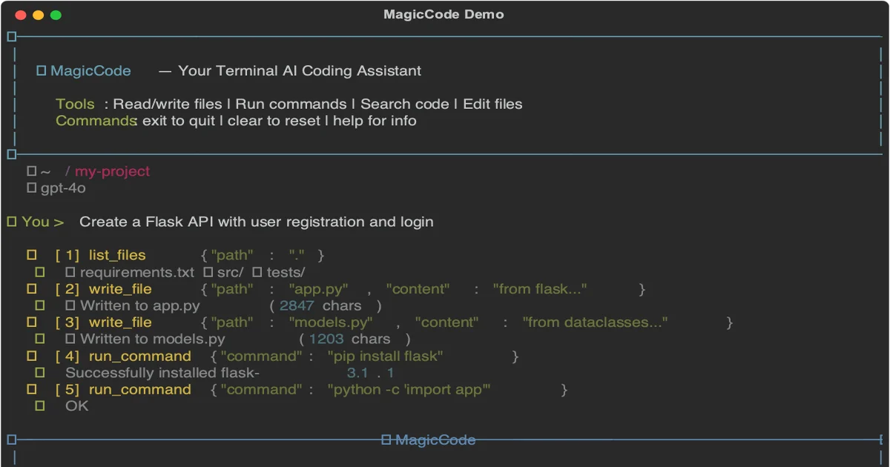
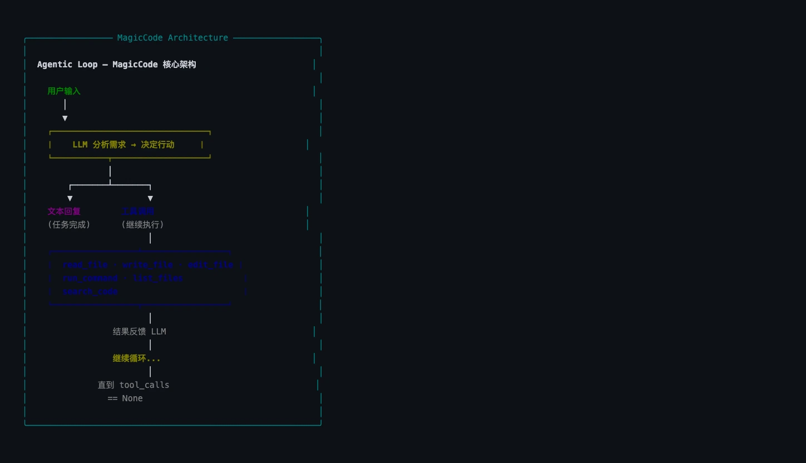
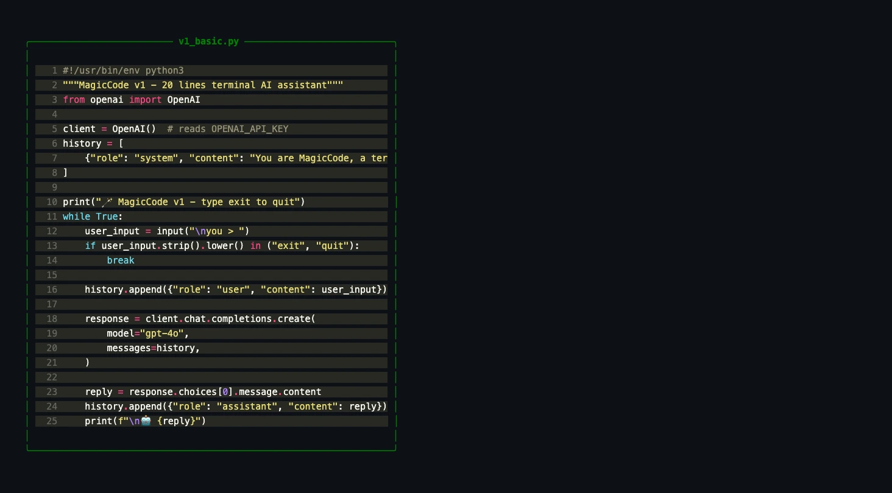
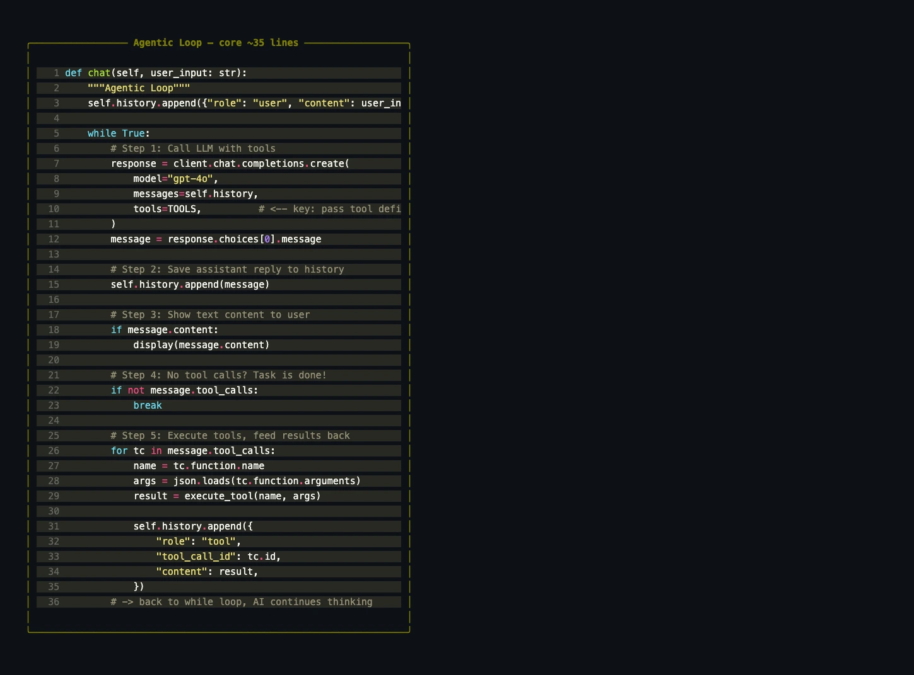
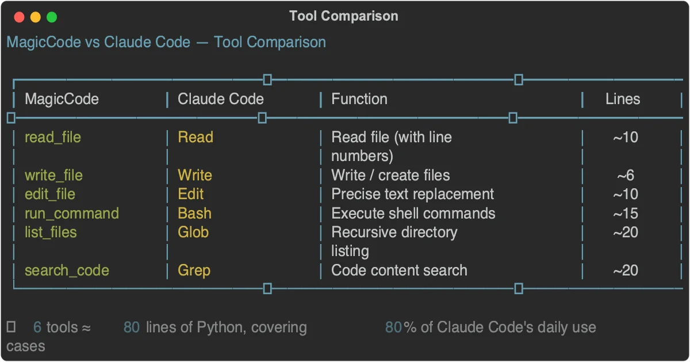

+++
date = '2026-02-24T10:00:00+08:00'
draft = false
title = 'Build Your Own Claude Code from Scratch in Python (250 Lines)'
description = 'A hands-on tutorial that demystifies Claude Code by rebuilding its core architecture — the Agentic Loop, Tool Use, and streaming — from scratch in Python. Go from 20 lines to a fully working terminal AI coding assistant.'
toc = true
tags = ['Claude Code', 'Python', 'Agentic Loop', 'Tool Use', 'AI Agent']
categories = ['AI Guides']
keywords = ['build your own Claude Code', 'agentic loop tutorial', 'AI coding assistant Python', 'function calling tutorial', 'tool use OpenAI', 'terminal AI assistant', 'MagicCode']
+++



You've probably used [Claude Code](/posts/ai/2026-01-14-claude-code-guide/) — or at least heard the hype. It reads your codebase, writes files, runs tests, and fixes bugs, all from a terminal prompt. It feels like magic.

But here's the thing: **the core architecture behind it is surprisingly simple.** Simple enough that you can rebuild it from scratch in an afternoon with Python and about 250 lines of code.

That's exactly what we'll do in this article. We'll build **MagicCode** — a terminal AI coding assistant that can read files, write code, execute shell commands, and make autonomous multi-step decisions — just like Claude Code does under the hood.

More importantly, by the end, you'll deeply understand three concepts that power every modern AI coding tool:

1. **The Agentic Loop** — the decision-making engine that lets AI act autonomously
2. **Tool Use (Function Calling)** — how LLMs interact with the real world
3. **The message protocol** — how conversations with tool calls actually work at the API level

We'll build incrementally: V1 (basic chat, 20 lines) → V2 (streaming) → V3 (rich terminal UI) → V4 (full tool system with Agentic Loop, 250 lines). Each version builds on the last. No hand-waving, no magic — just code you can run.

## Why Build This?

Using a tool is one thing. Understanding how it works is another.

When you understand the architecture behind Claude Code, you gain the ability to customize it, extend it, or build something entirely different on top of the same principles. Every AI coding tool — Claude Code, Cursor Agent, Copilot Workspace, Windsurf, Cline — runs on fundamentally the same architecture. Learn it once, understand them all.

## The Architecture: What Makes Claude Code Different

Before we write any code, let's answer a foundational question: **what separates Claude Code from a regular chatbot?**

The answer is two words: **[Tool Use](/posts/ai/2026-01-19-agent-skills-new-programming/)**.

### Regular Chatbot vs. AI Coding Agent

A regular chatbot works like this:

```
You: Write me a hello world program.
AI: Sure! Here's the code: print("hello world")
You: (manually copy-paste into editor, save, run)
```

An AI coding agent works like this:

```
You: Write me a hello world program.
AI: (creates hello.py → writes code → runs it → reports the result)
```

The difference? **The AI doesn't just talk — it acts.** It has tools (read files, write files, execute commands) and can autonomously decide when and how to use them.

### The Agentic Loop

The soul of Claude Code — and every AI coding agent — is a pattern called the **[Agentic Loop](/posts/ai/2026-02-23-agentic-coding-trends-2026/)**:



Here's how it works:

1. **User sends a message** → forwarded to the LLM
2. **LLM thinks** → decides whether to respond directly or use a tool first
3. **If it uses a tool** → your code executes the tool and sends the result back
4. **LLM thinks again** → maybe uses another tool, maybe responds
5. **Repeat steps 3–4** → until the LLM decides the task is complete

This is why Claude Code can handle complex, multi-step tasks. It doesn't give you a one-shot answer. Instead, it works like a developer would: **look at the code, think about what to do, make a change, verify it works, repeat.** The loop continues until the task is done.

### How Tool Use / Function Calling Works

Both OpenAI and Anthropic APIs natively support Tool Use (OpenAI calls it "Function Calling"). The mechanism is straightforward:

1. You define a set of tools (name, description, parameters) and pass them to the API
2. The LLM can choose to call one or more tools in its response (returns a `tool_calls` array)
3. Your code executes the tools and sends the results back (as `role: "tool"` messages)
4. The LLM uses the results to continue its reasoning

Here's the critical insight: **the AI never executes tools itself.** It only decides *which* tool to call and *what arguments* to pass. The actual execution happens in your Python code. This is what makes the architecture safe — you control the execution boundary completely.

## Setup

### Prerequisites

- Python 3.10+ (3.12+ recommended)
- An OpenAI API key ([platform.openai.com](https://platform.openai.com))
- A terminal (iTerm2, Terminal.app, Windows Terminal — anything works)

### Project Setup

```bash
mkdir magiccode && cd magiccode

python3 -m venv venv
source venv/bin/activate  # Windows: venv\Scripts\activate

pip install openai rich prompt_toolkit
```

Three dependencies, each with a clear purpose:

| Library | Purpose | Why |
|---------|---------|-----|
| `openai` | OpenAI Python SDK | API calls with native Function Calling support |
| `rich` | Terminal UI | Markdown rendering, syntax highlighting, panels |
| `prompt_toolkit` | Enhanced input | History, auto-complete (optional but nice) |

### Configure Your API Key

```bash
export OPENAI_API_KEY="sk-your-key-here"
```

> Tip: Add this to your `~/.zshrc` or `~/.bashrc` so you don't have to set it every time.

## V1: The 20-Line Foundation

The best way to build anything complex is to start embarrassingly simple. V1 is just a chat loop — no streaming, no tools, no fancy UI. Twenty lines that prove the core API call works.



```python
#!/usr/bin/env python3
"""MagicCode v1 — A 20-line terminal AI assistant."""
from openai import OpenAI

client = OpenAI()  # Reads OPENAI_API_KEY from environment
history = [{"role": "system", "content": "You are MagicCode, a terminal AI coding assistant. Be concise and helpful."}]

print("🪄 MagicCode v1 — Type 'exit' to quit")
while True:
    user_input = input("\nYou > ")
    if user_input.strip().lower() in ("exit", "quit"):
        break

    history.append({"role": "user", "content": user_input})

    response = client.chat.completions.create(
        model="gpt-4o",
        messages=history,
    )

    reply = response.choices[0].message.content
    history.append({"role": "assistant", "content": reply})
    print(f"\n🤖 {reply}")
```

Save as `v1_basic.py` and run it:

```bash
python v1_basic.py
```

It works. It's a functional AI chat assistant. But it can only *talk* — it can't *do* anything. It's a strategist who can plan battles but has no army.

### Key Concepts Worth Understanding

**The `history` list** is conversation memory. Every user message and AI response gets appended to it, and the entire list gets sent with each API call. This is how LLMs "remember" context — there's no magic persistence, just an ever-growing message array. (This is also why long conversations eventually hit token limits and get expensive.)

**The `system` message** defines the AI's persona and behavioral rules. It's the programmatic equivalent of Claude Code's [`CLAUDE.md`](/posts/ai/2026-01-12-claudemd-memory-guide/) — it tells the model who it is and how to behave. In OpenAI's API, it's the first message in the `messages` list.

## V2: Streaming — The Typewriter Effect

V1 has a UX problem: during long responses, you stare at a blank terminal while the model generates its full response, then the entire answer appears at once. This feels broken.

**Streaming** fixes this. The API sends tokens as they're generated, so the response appears character by character — like watching someone type in real time.

```python
#!/usr/bin/env python3
"""MagicCode v2 — With streaming output."""
from openai import OpenAI

client = OpenAI()
history = [{"role": "system", "content": "You are MagicCode, a terminal AI coding assistant. Be concise and professional."}]

print("🪄 MagicCode v2 (streaming) — Type 'exit' to quit")
while True:
    user_input = input("\nYou > ")
    if user_input.strip().lower() in ("exit", "quit"):
        break

    history.append({"role": "user", "content": user_input})

    print("\n🤖 ", end="", flush=True)
    full_reply = ""

    stream = client.chat.completions.create(
        model="gpt-4o",
        messages=history,
        stream=True,  # ← The key change
    )
    for chunk in stream:
        delta = chunk.choices[0].delta.content
        if delta:
            print(delta, end="", flush=True)
            full_reply += delta

    print()  # Newline after response
    history.append({"role": "assistant", "content": full_reply})
```

The changes are minimal: set `stream=True`, then iterate over chunks and print each `delta.content` as it arrives.

> `flush=True` matters more than you'd think. Without it, Python buffers the output and you get text appearing in bursts rather than smooth character-by-character streaming. It forces Python to write each character to the terminal immediately.

## V3: A Beautiful Terminal — Rich Markdown Rendering

Terminals don't have to look ugly. With the `rich` library, we can render Markdown with syntax highlighting, formatted tables, colored panels, and clean typography — all in the terminal.

```python
#!/usr/bin/env python3
"""MagicCode v3 — Rich Markdown rendering with live streaming."""
from openai import OpenAI
from rich.console import Console
from rich.markdown import Markdown
from rich.panel import Panel
from rich.live import Live

client = OpenAI()
console = Console()
history = [{"role": "system", "content": "You are MagicCode, a terminal AI coding assistant. Format responses in Markdown."}]

console.print(Panel(
    "🪄 [bold cyan]MagicCode v3[/] — Terminal AI Coding Assistant\nType 'exit' to quit",
    border_style="cyan"
))

while True:
    console.print()
    user_input = console.input("[bold green]You >[/] ")
    if user_input.strip().lower() in ("exit", "quit"):
        break

    history.append({"role": "user", "content": user_input})

    full_reply = ""
    stream = client.chat.completions.create(
        model="gpt-4o", messages=history, stream=True,
    )
    with Live(console=console, refresh_per_second=8) as live:
        for chunk in stream:
            delta = chunk.choices[0].delta.content
            if delta:
                full_reply += delta
                live.update(Panel(
                    Markdown(full_reply),
                    title="🤖 MagicCode",
                    border_style="blue",
                ))

    history.append({"role": "assistant", "content": full_reply})
```

The `Rich.Live` component continuously re-renders the panel as new content streams in. You can watch Markdown tables, code blocks, and formatted text materialize in real time — like watching a document being written before your eyes.

## V4: The Tool System — Giving AI Hands

The first three versions are chatbots with increasing polish. Now we give the AI actual capabilities — the ability to **read files, write files, and execute commands**. This is where it stops being a chatbot and becomes an agent.

This is the most important section of this article.

### Defining Tools

OpenAI's Function Calling requires tool definitions in a specific JSON schema format. Each tool needs a name, description, and parameter schema:

```python
TOOLS = [
    {
        "type": "function",
        "function": {
            "name": "read_file",
            "description": "Read the contents of a file. Returns the content with line numbers.",
            "parameters": {
                "type": "object",
                "properties": {
                    "path": {
                        "type": "string",
                        "description": "File path to read"
                    }
                },
                "required": ["path"],
            },
        },
    },
    {
        "type": "function",
        "function": {
            "name": "write_file",
            "description": "Write content to a file. Creates parent directories if needed.",
            "parameters": {
                "type": "object",
                "properties": {
                    "path": {"type": "string", "description": "File path"},
                    "content": {"type": "string", "description": "Complete file content"},
                },
                "required": ["path", "content"],
            },
        },
    },
    {
        "type": "function",
        "function": {
            "name": "run_command",
            "description": "Execute a shell command. Times out after 30 seconds.",
            "parameters": {
                "type": "object",
                "properties": {
                    "command": {"type": "string", "description": "Shell command to execute"}
                },
                "required": ["command"],
            },
        },
    },
    {
        "type": "function",
        "function": {
            "name": "list_files",
            "description": "List directory contents (ignores node_modules, .git, etc.).",
            "parameters": {
                "type": "object",
                "properties": {
                    "path": {"type": "string", "description": "Directory path", "default": "."},
                },
                "required": [],
            },
        },
    },
]
```

Tool definitions matter more than you might think. The model reads these descriptions to decide *when* and *how* to use each tool. Good descriptions lead to better tool selection. A few principles:

- **Intuitive names**: `read_file` is immediately clear; `rf` is not
- **Specific descriptions**: The model uses these to judge when a tool is appropriate
- **Precise parameter schemas**: Required vs. optional, types, and defaults all guide the model's behavior

### Implementing Tool Execution

The AI decides what tool to call and what arguments to pass. **Your code does the actual work.** This separation is the security foundation of the entire architecture — you control exactly what happens:

```python
import os
import subprocess

def execute_tool(name: str, params: dict) -> str:
    """Execute a tool call and return the result as a string."""
    try:
        if name == "read_file":
            with open(params["path"], "r", encoding="utf-8") as f:
                content = f.read()
            lines = content.split("\n")
            # Add line numbers so the AI can reference specific lines later
            numbered = "\n".join(
                f"{i+1:4d} | {line}" for i, line in enumerate(lines)
            )
            return f"📄 {params['path']} ({len(lines)} lines)\n{numbered}"

        elif name == "write_file":
            path = params["path"]
            os.makedirs(os.path.dirname(path) or ".", exist_ok=True)
            with open(path, "w", encoding="utf-8") as f:
                f.write(params["content"])
            return f"✅ Written to {path} ({len(params['content'])} chars)"

        elif name == "run_command":
            cmd = params["command"]
            # 🛡️ Safety check: block destructive commands
            dangerous = ["rm -rf /", "mkfs", "dd if=", "> /dev/sd"]
            if any(d in cmd for d in dangerous):
                return "❌ Refused to execute dangerous command"
            result = subprocess.run(
                cmd, shell=True, capture_output=True,
                text=True, timeout=30
            )
            output = result.stdout
            if result.stderr:
                output += "\n--- stderr ---\n" + result.stderr
            return output.strip() or "(Command completed with no output)"

        elif name == "list_files":
            path = params.get("path", ".")
            entries = sorted(os.listdir(path))
            result = []
            for entry in entries:
                full = os.path.join(path, entry)
                icon = "📁" if os.path.isdir(full) else "📄"
                result.append(f"{icon} {entry}")
            return "\n".join(result) or "Empty directory"

    except Exception as e:
        return f"❌ {type(e).__name__}: {e}"
```

Several design decisions here are worth calling out:

1. **`read_file` returns line-numbered content**: This lets the AI precisely reference locations when it later needs to edit a file — exactly how Claude Code's Read tool works.
2. **`write_file` auto-creates directories**: `os.makedirs(exist_ok=True)` eliminates "directory not found" errors. The AI shouldn't have to worry about creating parent directories.
3. **`run_command` has a safety blocklist**: A simple but effective guard against destructive operations. (For a deeper dive into AI coding security, see [Secure Vibe Coding](/posts/ai/2026-02-24-secure-vibe-coding/).)
4. **All tools return strings**: This is an API requirement — tool results must be serializable text.

### The Agentic Loop — The Core of Everything

This is the **soul of the entire project**. In under 40 lines, it implements the complete cycle of autonomous decision-making, multi-step tool execution, and self-directed task completion:



```python
def chat(user_input: str):
    """The Agentic Loop: autonomous AI decision-making."""
    history.append({"role": "user", "content": user_input})

    while True:
        # 1️⃣ Call the LLM with tool definitions
        response = client.chat.completions.create(
            model="gpt-4o",
            messages=history,
            tools=TOOLS,          # ← Pass the tool definitions
        )
        message = response.choices[0].message

        # 2️⃣ Store the AI's full response in history
        history.append(message)

        # 3️⃣ Display any text content
        if message.content:
            console.print(Panel(Markdown(message.content), title="🤖 MagicCode"))

        # 4️⃣ No tool calls? Task is complete — exit the loop
        if not message.tool_calls:
            break

        # 5️⃣ Execute each tool call and feed results back
        for tool_call in message.tool_calls:
            name = tool_call.function.name
            args = json.loads(tool_call.function.arguments)

            console.print(f"  🔧 {name}({args})")
            result = execute_tool(name, args)

            # Send tool results back as role="tool" messages
            history.append({
                "role": "tool",
                "tool_call_id": tool_call.id,
                "content": result,
            })
        # → Back to the top of the while loop — AI continues thinking
```

**The elegance is in the `while True` loop.** A single AI response can contain both text *and* tool calls simultaneously. Here's what a real multi-turn execution looks like:

```
AI Turn 1:
  content: "Let me look at the project structure first."
  tool_calls: [list_files("."), read_file("package.json")]

→ Execute tools, send results back to AI

AI Turn 2:
  content: "This is a Node.js project. I'll modify the entry point..."
  tool_calls: [write_file("index.js", ...)]

→ Execute tools, send results back to AI

AI Turn 3:
  content: "Done. Let me verify with tests."
  tool_calls: [run_command("npm test")]

→ Execute tools, send results back to AI

AI Turn 4:
  content: "✅ All tests pass. Here's what I changed..."
  tool_calls: null → loop exits
```

**A single user request can trigger a dozen tool calls**, each one informed by the results of the last. The AI plans, acts, observes, and adapts — autonomously. This is what "agentic" means. The model isn't just answering questions; it's *completing tasks*.

### The Message Protocol — What's Actually Happening

Understanding the message format is essential for debugging. The `history` array that gets sent to the API looks like this:

```python
[
    # System message — defines the AI's behavior
    {"role": "system", "content": "You are MagicCode..."},

    # User message
    {"role": "user", "content": "Write me a hello world program"},

    # AI response — includes tool calls
    {
        "role": "assistant",
        "content": "I'll create the file for you.",
        "tool_calls": [{
            "id": "call_abc123",
            "type": "function",
            "function": {
                "name": "write_file",
                "arguments": '{"path":"hello.py","content":"print(\'hello world\')"}'
            }
        }]
    },

    # Tool result — matched by tool_call_id
    {
        "role": "tool",
        "tool_call_id": "call_abc123",
        "content": "✅ Written to hello.py (20 chars)"
    },

    # AI continues reasoning
    {
        "role": "assistant",
        "content": "File created. Let me run it now.",
        "tool_calls": [{
            "id": "call_def456",
            "type": "function",
            "function": {"name": "run_command", "arguments": '{"command":"python hello.py"}'}
        }]
    },

    # ... the loop continues
]
```

Two details that will save you hours of debugging:

- **Tool results use `role: "tool"`**, not `role: "user"`. The model treats these differently — it knows this data came from tool execution, not from the human.
- **`tool_call_id` must match exactly.** Every tool result must reference the `id` of the corresponding `tool_call`. If there's a mismatch, the API will reject the request. This is how the model maps results to the tools that produced them.

## The Complete Source Code: MagicCode Final Version

Now let's combine everything — all four versions' capabilities — into a single, production-quality implementation. We'll add two more tools (`edit_file` for precise text replacement and `search_code` for codebase search), a safety valve to prevent infinite loops, and a clean class-based structure.

Here's the complete `magic.py` — approximately 250 lines:

```python
#!/usr/bin/env python3
"""
MagicCode — A terminal AI coding assistant built from scratch.
Features: Tool Use | Markdown rendering | Agentic Loop
"""
import os
import json
import glob
import subprocess
from openai import OpenAI
from rich.console import Console
from rich.markdown import Markdown
from rich.panel import Panel

# ========== Configuration ==========
MODEL = os.getenv("MAGIC_MODEL", "gpt-4o")
client = OpenAI()  # Reads OPENAI_API_KEY from environment

SYSTEM_PROMPT = """You are MagicCode, a powerful terminal AI coding assistant.

## Your Tools
- read_file: Read file contents (with line numbers)
- write_file: Write to files (auto-creates directories)
- edit_file: Replace specific text in a file
- run_command: Execute shell commands (30s timeout)
- list_files: List directory structure
- search_code: Search for patterns in code

## Working Principles
1. Always read a file before modifying it
2. Break complex tasks into steps; verify each step
3. Never execute destructive commands (rm -rf, format, etc.)
4. Respond in Markdown format"""

# ========== Tool Definitions ==========
def _fn(name, desc, params, required):
    return {"type": "function", "function": {
        "name": name, "description": desc,
        "parameters": {"type": "object", "properties": params, "required": required},
    }}

TOOLS = [
    _fn("read_file", "Read file contents. Returns text with line numbers.",
        {"path": {"type": "string", "description": "File path"}}, ["path"]),
    _fn("write_file", "Write content to a file. Creates directories if needed.",
        {"path": {"type": "string", "description": "File path"},
         "content": {"type": "string", "description": "Complete file content"}}, ["path", "content"]),
    _fn("edit_file", "Replace old_text with new_text in a file (first occurrence).",
        {"path": {"type": "string", "description": "File path"},
         "old_text": {"type": "string", "description": "Text to find"},
         "new_text": {"type": "string", "description": "Replacement text"}}, ["path", "old_text", "new_text"]),
    _fn("run_command", "Execute a shell command with 30-second timeout.",
        {"command": {"type": "string", "description": "Shell command"}}, ["command"]),
    _fn("list_files", "Recursively list directory structure (max 3 levels, ignores .git etc.).",
        {"path": {"type": "string", "description": "Directory path"}}, []),
    _fn("search_code", "Search for a pattern across all files in a directory.",
        {"pattern": {"type": "string", "description": "Search pattern"},
         "path": {"type": "string", "description": "Search directory"}}, ["pattern"]),
]

IGNORED_DIRS = {".git", "node_modules", "__pycache__", ".venv", "venv", "dist", "build"}

# ========== Tool Execution ==========
def execute_tool(name: str, params: dict) -> str:
    try:
        if name == "read_file":
            with open(params["path"], "r", encoding="utf-8", errors="replace") as f:
                content = f.read()
            lines = content.split("\n")
            numbered = "\n".join(f"{i+1:4d} | {line}" for i, line in enumerate(lines))
            return f"📄 {params['path']} ({len(lines)} lines)\n{numbered}"

        elif name == "write_file":
            path = params["path"]
            os.makedirs(os.path.dirname(path) or ".", exist_ok=True)
            with open(path, "w", encoding="utf-8") as f:
                f.write(params["content"])
            return f"✅ Written to {path} ({len(params['content'])} chars)"

        elif name == "edit_file":
            path = params["path"]
            with open(path, "r", encoding="utf-8") as f:
                content = f.read()
            if params["old_text"] not in content:
                return "❌ Target text not found in file"
            new_content = content.replace(params["old_text"], params["new_text"], 1)
            with open(path, "w", encoding="utf-8") as f:
                f.write(new_content)
            return f"✅ Edited {path}"

        elif name == "run_command":
            cmd = params["command"]
            dangerous = ["rm -rf /", "mkfs", "dd if=", "> /dev/sd"]
            if any(d in cmd for d in dangerous):
                return "❌ Refused to execute dangerous command"
            result = subprocess.run(
                cmd, shell=True, capture_output=True, text=True, timeout=30
            )
            output = result.stdout
            if result.stderr:
                output += "\n--- stderr ---\n" + result.stderr
            return output.strip() or "(No output)"

        elif name == "list_files":
            path = params.get("path", ".")
            lines = []
            def walk(d, prefix="", depth=0):
                if depth >= 3: return
                try: entries = sorted(os.listdir(d))
                except PermissionError: return
                for e in entries:
                    full = os.path.join(d, e)
                    if e in IGNORED_DIRS or e.startswith("."): continue
                    if os.path.isdir(full):
                        lines.append(f"{prefix}📁 {e}/")
                        walk(full, prefix + "  ", depth + 1)
                    else:
                        lines.append(f"{prefix}📄 {e}")
            walk(path)
            return "\n".join(lines[:200]) or "Empty directory"

        elif name == "search_code":
            pattern = params["pattern"]
            path = params.get("path", ".")
            matches = []
            for fp in glob.glob(os.path.join(path, "**", "*"), recursive=True):
                if any(d in fp for d in IGNORED_DIRS) or not os.path.isfile(fp):
                    continue
                try:
                    with open(fp, "r", encoding="utf-8", errors="replace") as f:
                        for i, line in enumerate(f, 1):
                            if pattern.lower() in line.lower():
                                matches.append(f"{fp}:{i}: {line.rstrip()}")
                                if len(matches) >= 50: break
                except OSError: continue
                if len(matches) >= 50: break
            return "\n".join(matches) or f"No matches for '{pattern}'"

    except Exception as e:
        return f"❌ {type(e).__name__}: {e}"

# ========== The Agentic Loop ==========
class MagicCode:
    def __init__(self):
        self.console = Console()
        self.history = [{"role": "system", "content": SYSTEM_PROMPT}]

    def chat(self, user_input: str):
        self.history.append({"role": "user", "content": user_input})
        tool_count = 0

        while True:
            response = client.chat.completions.create(
                model=MODEL, messages=self.history, tools=TOOLS,
            )
            message = response.choices[0].message
            self.history.append(message)

            # Display text response
            if message.content:
                self.console.print(Panel(
                    Markdown(message.content),
                    title="🤖 MagicCode", border_style="blue", padding=(1, 2),
                ))

            # No tool calls → task complete
            if not message.tool_calls:
                break

            # Execute each tool call
            for tc in message.tool_calls:
                tool_count += 1
                name = tc.function.name
                args = json.loads(tc.function.arguments)
                info = json.dumps(args, ensure_ascii=False)
                if len(info) > 120: info = info[:120] + "..."
                self.console.print(f"  [yellow]🔧 [{tool_count}] {name}[/] [dim]{info}[/]")

                result = execute_tool(name, args)
                preview = result[:100].replace("\n", " ")
                self.console.print(f"  [green]  ✓[/] [dim]{preview}[/]")

                self.history.append({
                    "role": "tool",
                    "tool_call_id": tc.id,
                    "content": result,
                })

            # Safety valve: prevent infinite loops
            if tool_count > 20:
                self.console.print("[red]⚠️ Tool call limit reached (20)[/]")
                break

    def run(self):
        self.console.print(Panel(
            "[bold cyan]🪄 MagicCode[/] — Your Terminal AI Coding Assistant\n\n"
            "  [green]Tools[/]: Read/write files | Run commands | Search code | Edit files\n"
            "  [green]Commands[/]: exit to quit | clear to reset history",
            border_style="cyan", padding=(1, 2),
        ))
        self.console.print(f"  [dim]📂 {os.getcwd()}[/]")
        self.console.print(f"  [dim]🧠 {MODEL}[/]\n")

        while True:
            try:
                user_input = self.console.input("[bold green]✦ You >[/] ")
                cmd = user_input.strip().lower()
                if cmd in ("exit", "quit"): break
                elif cmd == "clear":
                    self.history = [{"role": "system", "content": SYSTEM_PROMPT}]
                    self.console.print("[dim]🗑️ History cleared[/]")
                    continue
                elif not cmd: continue
                self.chat(user_input)
                self.console.print()
            except KeyboardInterrupt:
                self.console.print("\n[cyan]👋 Goodbye![/]")
                break

if __name__ == "__main__":
    MagicCode().run()
```

Save as `magic.py` and run:

```bash
python magic.py
```

Try asking it to create a file, read it back, modify it, or run a command. Watch the Agentic Loop in action — the AI autonomously chains multiple tool calls to complete your request.

## How Our 6 Tools Compare to Claude Code

You might wonder: are 6 tools enough? Let's compare with what Claude Code ships:



Claude Code has about 15 built-in tools. Our 6 tools cover roughly **80% of everyday use cases**. The remaining 20% is mostly advanced features like [MCP integration](/posts/ai/2026-02-20-mcp-protocol-guide/), multi-file diffs, and notebook editing — nice to have, but not core to the experience. If MCP integration interests you, check out the [MCP Server development tutorial](/posts/ai/2026-02-22-claude-code-mcp-server-tutorial/).

## Five Directions to Take This Further

The foundation is solid. Here are five extensions that would bring MagicCode closer to a production-grade tool:

### 1. Permission Confirmation

Claude Code asks for confirmation before writing files or executing commands (for more on Claude Code's security model, see [Claude Code Security Deep Dive](/posts/ai/2026-02-22-claude-code-security/)). Easy to implement:

```python
def execute_tool_with_confirm(name, params):
    # Read-only operations: execute immediately
    if name in ("read_file", "list_files", "search_code"):
        return execute_tool(name, params)

    # Write operations: require user approval
    console.print(f"[yellow]⚠️ {name}({params})[/]")
    confirm = console.input("[bold]Allow? (y/n) [/]")
    if confirm.lower() == "y":
        return execute_tool(name, params)
    return "User denied this operation"
```

### 2. Project Context Loading (CLAUDE.md)

[Claude Code automatically reads `CLAUDE.md` from the project root to understand context](/posts/ai/2026-01-12-claudemd-memory-guide/). We can do the same:

```python
def load_project_context():
    """Load project config files as context."""
    context = ""
    for name in ["CLAUDE.md", "AGENTS.md", "README.md"]:
        if os.path.exists(name):
            with open(name, "r") as f:
                context += f"\n\n--- {name} ---\n{f.read()}"
    return context

# Append project context to the system prompt
project_ctx = load_project_context()
if project_ctx:
    SYSTEM_PROMPT += f"\n\n## Project Context\n{project_ctx}"
```

### 3. Conversation Persistence

Currently, conversation history vanishes when you exit. Persist it to a JSON file:

```python
import json

HISTORY_FILE = ".magiccode_history.json"

def save_history(history):
    with open(HISTORY_FILE, "w") as f:
        json.dump(history, f, ensure_ascii=False, default=str)

def load_history():
    if os.path.exists(HISTORY_FILE):
        with open(HISTORY_FILE, "r") as f:
            return json.load(f)
    return []
```

### 4. Model Swapping

MagicCode isn't locked to GPT. Any model that supports Function Calling works. The OpenAI SDK's compatible interface makes switching trivial:

```python
from openai import OpenAI

# DeepSeek
client = OpenAI(api_key="your-key", base_url="https://api.deepseek.com/v1")

# Qwen
client = OpenAI(api_key="your-key", base_url="https://dashscope.aliyuncs.com/compatible-mode/v1")

# Local Ollama
client = OpenAI(api_key="ollama", base_url="http://localhost:11434/v1")
```

This is one reason we chose the OpenAI SDK — it's the de facto standard interface, and virtually every model provider offers a compatible endpoint.

### 5. Token Usage Tracking

API calls cost money. Adding usage tracking is straightforward and immediately useful:

```python
total_input_tokens = 0
total_output_tokens = 0

# After each API call:
total_input_tokens += response.usage.prompt_tokens
total_output_tokens += response.usage.completion_tokens

# On exit:
console.print(f"[dim]Session tokens — Input: {total_input_tokens} | Output: {total_output_tokens}[/]")
```

## What We Built — And What It Teaches

Starting from a 20-line chatbot, we incrementally built a fully functional terminal AI coding assistant:

| Version | Capability | Lines | Key Technology |
|---------|-----------|-------|---------------|
| V1 | Basic chat | 20 | Chat Completions API |
| V2 | Streaming output | 30 | Streaming |
| V3 | Rich terminal UI | 35 | Rich + Markdown rendering |
| V4 | Tool system + Agentic Loop | 250 | Function Calling + autonomous loop |

The entire architecture boils down to **three things**: an LLM API, tool definitions, and an Agentic Loop. That's it. Master these three concepts and you understand the core architecture of [Claude Code](/posts/ai/2026-01-14-claude-code-guide/), [Cursor Agent](/posts/ai/2026-01-19-cursor-agent-best-practices/), Copilot Workspace, and every other AI coding tool on the market.

The complete code is in this article — copy, paste, run. If you build something interesting on top of it, I'd love to hear about it in the comments.

> Understanding how the tools you use are built is what separates a user from an engineer. Don't just use Claude Code — understand it, then build something better.

## Related Reading

- [Claude Code: The Complete Guide](/posts/ai/2026-01-14-claude-code-guide/) — Deep dive into using Claude Code effectively
- [CLAUDE.md Memory: Make AI Remember Your Project](/posts/ai/2026-01-12-claudemd-memory-guide/) — How AI coding assistants understand project context
- [Context Engineering: The Most Underrated AI Skill](/posts/ai/2026-02-24-context-engineering-deep-dive/) — System prompt design and context management
- [MCP Protocol: The Universal Standard for AI Integration](/posts/ai/2026-02-20-mcp-protocol-guide/) — The future of AI tool extensibility
- [2026 Agentic Coding Trends Report](/posts/ai/2026-02-23-agentic-coding-trends-2026/) — How the Agentic Loop is reshaping software development
- [Claude Code Hooks: Automation Guide](/posts/ai/2026-02-18-claude-code-hooks-guide/) — Extending Claude Code with custom automation
- [Vibe Coding: The Complete Guide](/posts/ai/2026-02-22-vibe-coding-guide/) — Natural language-driven AI programming methodology
