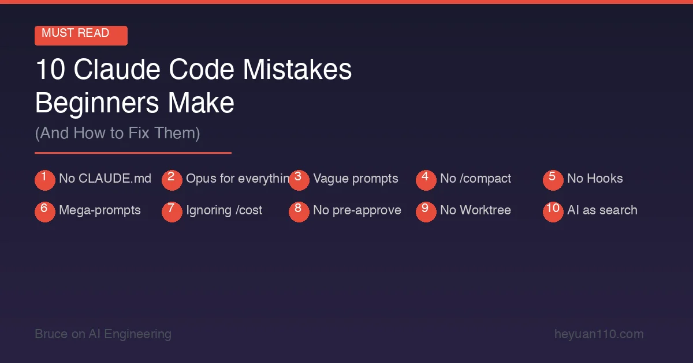

+++
date = '2026-02-25T14:00:00+08:00'
draft = false
title = 'Claude Code 新手最容易犯的 10 个错误（附解决方案）'
description = 'Claude Code 新手常犯的 10 个错误及修复方法：从没写 CLAUDE.md 到滥用 Opus 模型，帮你节省 Token 开支，大幅提升开发效率。'
toc = true
tags = ['Claude Code', 'Tips', 'Best Practices', 'Beginner']
categories = ['AI Guides']
keywords = ['Claude Code 常见错误', 'Claude Code 使用技巧', 'Claude Code 最佳实践', 'Claude Code 新手指南', 'Claude Code 省钱技巧', 'Claude Code 效率提升']
+++



[Claude Code](https://docs.anthropic.com/en/docs/claude-code) 是目前最强大的 AI 编程工具，但也是最容易被用错的工具之一。

我观察了几十位开发者使用 Claude Code 的过程——包括我自己——发现大家反复踩的坑惊人地相似。修正这些问题后，输出质量通常能提升 5–10 倍，Token 消耗能降低 50% 以上。

以下是最常见的 10 个错误，以及每一个的具体修复方法。

## 错误 #1：没有配置 CLAUDE.md

**典型表现**：直接开始用 Claude Code，指望 AI 能自动理解你的项目。

**代价**：没有项目上下文，Claude Code 每次都要重新摸索你的技术栈、编码规范和项目结构。这意味着更多的提问、更多的错误假设、更多浪费的 Token，以及更多的反复修改。

**解决方案**：在项目根目录创建 [CLAUDE.md](/posts/ai/2026-01-12-claudemd-memory-guide/)，写明技术栈、编码规范、常用命令和架构说明。不需要写太长——哪怕 20 行的上下文信息也能显著改善效果。

```markdown
# Project: E-commerce API
## Stack: Node.js 22 + Express + PostgreSQL + Prisma
## Testing: Jest (files in __tests__/ next to source)
## Style: ESLint + Prettier, functional style, no classes
## Commands: npm test | npm run lint | npm run dev
## Rules: Never use console.log in production code. Always use the logger utility.
```

**效果**：配置了好的 CLAUDE.md 文件后，修正轮次通常减少 40–60%。更少的 Token 消耗，更少的挫败感，更快的结果。

## 错误 #2：所有任务都用 Opus 模型

**典型表现**：把模型设为 Opus 4.6 后就再也没换过，所有任务都用最贵的模型。

**代价**：Opus 的每 Token 成本是 Sonnet 的 1.67 倍。一个普通会话下来，本来花 $10–15 就够的，结果花了 $15–25。每天都用的话，一个月下来差距可能有几百美元。

**解决方案**：日常使用 Sonnet 4.6 作为默认模型，只在真正需要的时候切换到 Opus：

| 任务类型 | 用 Sonnet | 用 Opus |
|---------|-----------|---------|
| Bug 修复 | ✅ | |
| 功能开发 | ✅ | |
| 代码审查 | ✅ | |
| 编写测试 | ✅ | |
| 复杂的多文件重构 | | ✅ |
| 系统架构决策 | | ✅ |
| 排查隐晦的逻辑错误 | | ✅ |
| 理解不熟悉的代码库 | | ✅ |

随时用 `/model sonnet` 或 `/model opus` 切换模型，不需要重启会话。

**效果**：成本降低 30–40%，大多数任务的质量完全不受影响。

## 错误 #3：提示词太模糊

**典型表现**："修一下这个 bug"、"优化一下这个"、"登录那块好像有问题"。

**代价**：模糊的提示词让 Claude Code 只能猜你想要什么。它会读取大量额外文件试图定位问题，做出可能错误的假设，生成你并不需要的代码——这些全都在烧 Token 和时间。

**解决方案**：写具体。包含文件名、行号、报错信息和期望行为。

**差**："修一下登录的 bug。"

**好**："在 `src/auth/login.ts` 中，第 42 行的 `refreshToken()` 函数在 Token 过期时抛出 403 错误。期望行为是静默刷新 Token。错误信息是 'Token validation failed'。请修复刷新逻辑，不要改变 API 接口。"

**更好**：把实际的报错输出、堆栈跟踪或测试失败信息直接粘贴到提示词里。Claude Code 能解析所有这些信息。

**效果**：具体的提示词通常 1–2 轮工具调用就能解决问题，而不是 5–8 轮。单个任务的 Token 消耗可以节省 3–4 倍。

## 错误 #4：从不使用 `/compact`

**典型表现**：长时间工作不压缩对话历史。

**代价**：对话中的每条消息都会随着每次请求一起发送给 API。连续使用 30 分钟以上后，你的每个提示词都会携带大量已经过时的上下文——与当前工作完全无关的信息。

**解决方案**：定期执行 `/compact`——特别是在切换不同任务时。它会压缩对话历史，同时保留 Claude 需要的关键上下文。

更好的做法是，对于完全无关的工作直接开一个新会话。没必要让一个会话从早跑到晚。

```
/compact           → 压缩当前历史
/clear             → 完全重置（核弹选项）
Ctrl+C → claude    → 开启新会话
```

**效果**：长会话中节省 20–30% 的 Token。响应速度也会更快，因为 API 需要处理的输入更少了。

## 错误 #5：不使用 Hooks 自动化重复任务

**典型表现**：每次修改后都手动告诉 Claude Code "跑一下 lint"或"跑一下测试"，更糟的情况是根本忘了验证修改。

**代价**：每次手动验证请求都是一个额外的 Agent 轮次——更多 Token，更多时间。而忘记验证的结果就是代码出了问题，后面需要花更多轮次来修复。

**解决方案**：设置 [Hooks](/posts/ai/2026-02-18-claude-code-hooks-guide/) 来自动执行修改后的验证。Hooks 在[特定生命周期节点](https://docs.anthropic.com/en/docs/claude-code/hooks)运行 Shell 命令——工具调用前/后、提交前/后等。

示例：每次文件写入后自动 lint：

```json
{
  "hooks": {
    "PostToolUse": [
      {
        "matcher": "Write|Edit",
        "command": "npm run lint --fix $FILE_PATH",
        "silent": true
      }
    ]
  }
}
```

示例：每次编辑源文件后自动运行相关测试：

```json
{
  "hooks": {
    "PostToolUse": [
      {
        "matcher": "Write|Edit",
        "command": "npm test -- --related $FILE_PATH 2>/dev/null || true",
        "silent": true
      }
    ]
  }
}
```

**效果**：消除了整类手动验证提示。一些团队反馈，配置 Hooks 后 Agent 轮次减少了 30–50%。

## 错误 #6：一个提示词塞进一个巨大任务

**典型表现**："重构整个认证系统，加上 OAuth2 支持，迁移数据库，还有更新所有测试。"

**代价**：Claude Code 很强，但它不是全知全能的。超大任务会导致：
- 实现不完整（上下文用完了还没做完）
- 修改不一致（执行到一半就丢失了计划）
- 触发工具调用安全上限（默认每轮 20 次）
- 难以审查改动内容

**解决方案**：把大任务拆分成聚焦的、有序的步骤。让 Claude Code 完成并验证每一步后再进行下一步。

**不要这样**："用 OAuth2 重构认证系统"

**要这样**：
1. "阅读当前的认证系统，解释一下架构"
2. "如果要加 OAuth2 支持，需要改哪些地方？拟一个计划"
3. "实现 OAuth2 provider 配置（只做配置，不做路由）"
4. "现在添加 OAuth2 回调路由和 Token 交换逻辑"
5. "更新现有测试并为 OAuth2 流程添加新测试"
6. "跑一下完整的测试套件，修复所有失败"

每一步都给 Claude Code 一个可以高质量完成的聚焦任务，步骤之间还能验证结果。

**效果**：更高质量的输出，更少的修正，更容易的代码审查。复杂重构从"可能能跑"变成"确定能跑"。

## 错误 #7：从不查看 `/cost`

**典型表现**：从来不检查 Token 用量，月底看到账单才吓一跳。

**代价**：看不到成本就无法优化。有的开发者在一个会话里烧掉 $50+ 都没察觉——通常是因为犯了错误 #4（从不压缩）或错误 #2（所有任务都用 Opus）。

**解决方案**：每完成一个重要任务后查看 `/cost`。建立一个成本直觉：

- 快速修 bug：约 $0.15–0.30
- 功能开发：约 $1–3
- 大型重构：约 $5–15
- 全天会话：约 $15–40

如果看到一个会话已经超过 $10 而你还在做同一个任务，说明哪里有问题了。压缩一下、重启会话，或者重新思考你的方法。

**效果**：光是有成本意识就能改变行为。关注成本的开发者通常能少花 20–30%。

## 错误 #8：不预先批准安全命令

**典型表现**：每一个 `git status`、`npm test`、`ls` 命令都要手动点"允许"。

**代价**：每次权限提示都会打断你的工作节奏，浪费几秒钟。整个会话下来，几百个明显安全的命令请求加起来就是大量的时间浪费。

**解决方案**：在[设置](/posts/ai/2026-02-25-claude-code-setup-guide/)中预先批准常用的安全命令：

```json
{
  "permissions": {
    "allow": [
      "Bash(git status)",
      "Bash(git diff *)",
      "Bash(git log *)",
      "Bash(npm test *)",
      "Bash(npm run lint *)",
      "Bash(npm run build)",
      "Bash(ls *)",
      "Bash(cat *)",
      "Bash(wc *)",
      "Bash(head *)",
      "Bash(tail *)"
    ]
  }
}
```

或者考虑使用沙箱模式，在安全边界内给 Claude Code 充分的自由。

**效果**：权限中断减少 80% 以上，工作流程明显更顺畅。

## 错误 #9：不使用 Worktree 并行处理任务

**典型表现**：所有事情都在一个 Claude Code 会话里做——来回切换任务、stash 代码、丢失上下文。

**代价**：在单个会话中切换上下文会让对话历史充斥无关信息。每个新任务都带着之前任务的包袱，让 Claude Code 注意力分散且成本更高。

**解决方案**：使用 [Worktree 模式](/posts/ai/2026-02-20-claude-code-worktree/)在独立的 [Git worktree](https://git-scm.com/docs/git-worktree) 分支中并行处理任务：

```bash
# 在新的 worktree 中启动任务
claude --worktree "Add user profile endpoint"

# 在另一个终端启动不同的任务
claude --worktree "Fix the pagination bug in /api/products"
```

每个 worktree 都有自己干净的 Git 分支和独立的对话上下文。没有上下文污染，没有 stash 的烦恼，直到你准备好了才需要处理合并。

**效果**：处理多任务的日子里，产出可以提升 2–3 倍。每个任务都能得到 Claude Code 的全部注意力。

## 错误 #10：把 Claude Code 当搜索引擎用

**典型表现**：用 Claude Code 来回答一搜就有答案的问题。

比如：
- "Python 列表推导式的语法是什么？"
- "PostgreSQL 默认端口是多少？"
- "CSS 怎么让 div 居中？"

**代价**：Claude Code 是一个 *Agent*——它的设计目的是执行操作，而不是回答常识。每个问题都会消耗你的套餐或 API 额度。不需要读取代码库、不需要做修改的简单知识性问题，用文档、Stack Overflow 或免费的聊天机器人就能解决。

**解决方案**：把 Claude Code 留给那些需要 Agent 能力的任务：

| 用 Claude Code | 用搜索引擎/文档 |
|---------------|----------------|
| "找到并修复 worker 进程中的内存泄漏" | "Node.js 的 process.memoryUsage API 是什么？" |
| "用 Repository 模式重构这个模块" | "什么是 Repository 模式？" |
| "为支付流程写集成测试" | "Jest 异步测试的语法是什么？" |
| "分析这个查询为什么慢并优化它" | "PostgreSQL EXPLAIN 的语法是什么？" |

**效果**：把 Claude Code 的预算留给高价值的 Agent 任务，每一分钱都能产出更多实际成果。

## 自检清单

下次使用 Claude Code 之前，过一遍这个清单：

- [ ] CLAUDE.md 已创建且保持更新
- [ ] 默认模型设为 Sonnet（除非确实需要 Opus）
- [ ] 常用安全命令已预先批准
- [ ] Hooks 已配置好 lint 和测试自动化
- [ ] 任务描述具体且聚焦（不是超大提示词）
- [ ] 新话题开新会话

把这些基础做好，Claude Code 就能从"好用的聊天机器人"变成"不可或缺的团队成员"。

## 延伸阅读

- [Claude Code Setup Guide: Installation to First Project](/posts/ai/2026-02-25-claude-code-setup-guide/) — 从零开始正确配置
- [Claude Code Pricing 2026: Is the Max Plan Worth It?](/posts/ai/2026-02-25-claude-code-pricing/) — 选择适合你的套餐
- [CLAUDE.md Guide: Give AI Perfect Project Context](/posts/ai/2026-01-12-claudemd-memory-guide/) — 错误 #1 的深度指南
- [Claude Code Hooks: 12 Automation Configs](/posts/ai/2026-02-18-claude-code-hooks-guide/) — 错误 #5 的深度指南
- [Claude Code Worktree: Parallel AI Tasks](/posts/ai/2026-02-20-claude-code-worktree/) — 错误 #9 的深度指南
- [Claude Code Best Practices](/posts/ai/2026-01-06-claudecode-best-practices/) — 官方推荐的工作流
- [Build Your Own Claude Code from Scratch](/posts/ai/2026-02-24-build-magic-code/) — 理解架构才能用得更好
