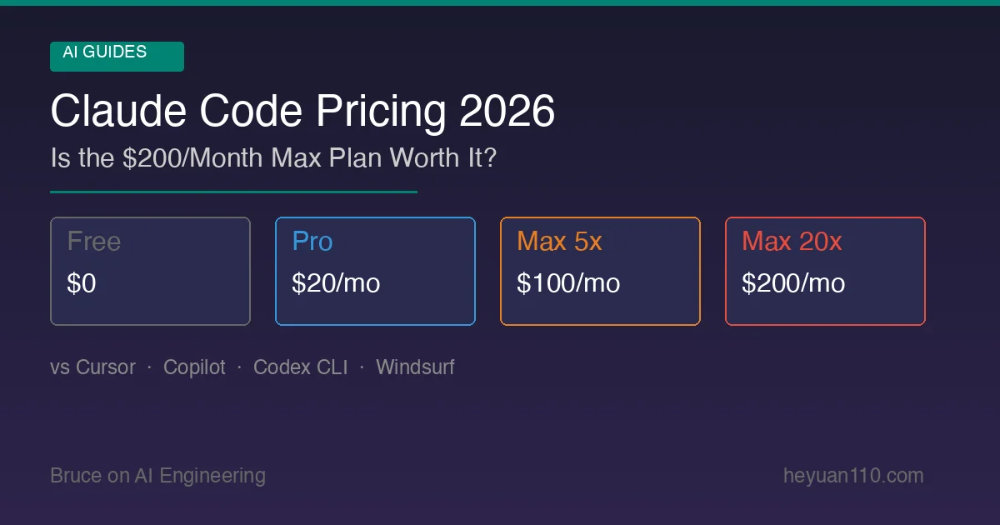

+++
date = '2026-02-25T10:00:00+08:00'
draft = false
title = 'Claude Code Pricing 2026: Is the Max Plan Worth $200?'
description = 'Complete Claude Code pricing breakdown for 2026. Pro, Max, Team, and API plans compared with real-world cost analysis and competitor benchmarks.'
toc = true
tags = ['Claude Code', 'Pricing', 'AI Coding Tools', 'Comparison']
categories = ['AI Guides']
keywords = ['Claude Code pricing', 'Claude Code cost', 'Claude Max plan', 'Claude Code vs Cursor pricing', 'AI coding tools pricing 2026', 'Anthropic pricing', 'Claude Code free']
+++

[Claude Code](https://github.com/anthropics/claude-code) is arguably the most powerful terminal-based AI coding tool available today. But power comes at a price — and Anthropic's pricing structure isn't exactly straightforward.

Should you stick with the $20 Pro plan? Is the $200/month Max plan actually worth it for heavy users? Could you save money by using the API directly? And how does it all compare to Cursor, Copilot, and Codex CLI?

This guide breaks down every Claude Code pricing option available in 2026, with real-world cost analysis to help you pick the right plan.

## Quick Summary: All Plans at a Glance

| Plan | Price | Claude Code Access | Best For |
|------|-------|-------------------|----------|
| **Free** | $0 | No | Casual Claude.ai chat only |
| **Pro** | $20/mo | Yes (limited) | Light coding tasks, small projects |
| **Max 5x** | $100/mo | Yes (full) | Daily professional use |
| **Max 20x** | $200/mo | Yes (full, priority) | Heavy all-day coding |
| **Team** | $25–150/user/mo | Yes (Premium seats) | Teams of 5–150 |
| **Enterprise** | Custom | Yes | Large organizations |
| **API** | Pay-per-token | Yes | Custom integrations, cost control |

## Plan-by-Plan Breakdown

### Free Tier ($0)

The free tier gives you access to Claude.ai for basic conversations, but **Claude Code is not included**. You'll need at least a Pro subscription — or an API key — to use Claude Code at all.

- ~15 messages per 5-hour window
- Claude Sonnet 4.5 only
- No Claude Code, no Opus access

**Verdict**: Fine for trying Claude's chat interface. Useless for coding.

### Pro Plan ($20/month)

The Pro plan is the entry point for Claude Code access. At $20/month (or $17/month billed annually at $200/year), you get:

- Access to **Claude Sonnet 4.6** and **Claude Opus 4.6**
- Claude Code included
- Standard message limits (the "1x" baseline)
- Projects, Artifacts, and App Connectors

**Who it's for**: Developers who use Claude Code for occasional tasks — quick bug fixes, small feature implementations, code reviews. If you're using it a few times a day for short sessions, Pro handles it fine.

**Where it breaks down**: If you're running multi-file refactors, lengthy agentic sessions, or using Claude Code as your primary development tool, you'll hit rate limits fast. The Opus model in particular gets throttled quickly on Pro.

### Max 5x Plan ($100/month)

The Max plan is where Claude Code gets serious. The "5x" means you get 5 times the usage of Pro — roughly 225+ messages per 5-hour window.

- **5x Pro usage** for all models
- Priority access during peak hours
- Persistent memory across conversations
- Early access to new features

**Who it's for**: Professional developers who use Claude Code daily as a core part of their workflow. If you're spending 2–4 hours a day in Claude Code, this is likely your plan.

**The math**: At $100/month, that's roughly $5/workday. If Claude Code saves you even 30 minutes of work per day (and it usually saves far more), the ROI is obvious.

### Max 20x Plan ($200/month)

The top individual tier. 20 times Pro usage, zero-wait priority, and effectively unlimited Claude Code for even the heaviest users.

- **20x Pro usage** — ~900+ messages per 5-hour window
- **Zero-latency priority** — no queuing, ever
- Same persistent memory and early access features

**Who it's for**: Power users who live in Claude Code all day. If you're an engineering lead using it for architecture decisions, code reviews, and implementation simultaneously — or if you're running a one-person startup with Claude Code as your AI co-founder — this is the plan.

**Is it worth $200/month?** Let's do the math. A senior developer's hourly rate is $75–150+. If Claude Code on Max 20x saves you 2+ hours per day compared to Max 5x (by never hitting limits, never waiting for priority), that's $150–300/day in saved time. The extra $100/month pays for itself in a single day.

The real question isn't "is $200 expensive?" — it's "will I actually hit the 5x limits?" If you're unsure, start with Max 5x and upgrade if you find yourself throttled.

### Team Plan ($25–150/user/month)

Anthropic's Team plan serves organizations of 5–150 people, with two seat types:

| Seat Type | Monthly | Annual | Includes |
|-----------|---------|--------|----------|
| **Standard** | $30/user | $25/user | Claude.ai web access only |
| **Premium** | ~$150/user | ~$125/user | Full Claude Code access |

Key team features:
- Centralized billing and admin controls
- Usage limits per user (admins can cap spending)
- Overage billed at standard API rates
- Data not used for model training

**The catch**: Premium seats for Claude Code access are significantly more expensive than individual Max plans. A team of 5 developers on Premium seats costs $625–750/month — while 5 individual Max 5x subscriptions would cost $500. For small teams, individual plans may be cheaper.

**When Team makes sense**: When you need centralized admin controls, usage monitoring, and organizational billing — typically at 10+ developers.

### Enterprise Plan (Custom Pricing)

Enterprise adds everything in Team plus:
- Advanced security and compliance controls (SSO, SCIM)
- Flexible usage-based billing
- No seat count limits
- Dedicated support
- Custom data retention policies

Contact Anthropic's sales team for pricing. Expect it to be competitive with GitHub Copilot Enterprise ($39/user/month) but with higher per-seat costs for Claude Code access.

## API Pricing: The Pay-Per-Token Alternative

You can skip subscriptions entirely and use Claude Code with an API key. This gives you maximum control over costs but requires managing your own budget.

### Current Model Pricing (per million tokens)

For the latest model specifications and capabilities, see the [official Claude model documentation](https://docs.anthropic.com/en/docs/about-claude/models).

| Model | Input | Output | Cache Read | Best For |
|-------|-------|--------|------------|----------|
| **Opus 4.6** | $5.00 | $25.00 | $0.50 | Complex reasoning, architecture decisions |
| **Sonnet 4.6** | $3.00 | $15.00 | $0.30 | Best balance of capability and cost |
| **Haiku 4.5** | $1.00 | $5.00 | $0.10 | Quick tasks, high-volume operations |

### Real-World API Cost Estimates

What does a typical Claude Code session actually cost via API?

A medium coding session (reading files, making changes, running tests) typically uses:
- **Input**: ~50K–200K tokens (includes system prompt, conversation history, file contents)
- **Output**: ~10K–50K tokens (responses, code generation)

Using Sonnet 4.6 (the default and recommended model for most coding):

| Session Type | Input Tokens | Output Tokens | Estimated Cost |
|-------------|-------------|---------------|----------------|
| Quick fix (5 min) | ~30K | ~5K | ~$0.17 |
| Feature implementation (30 min) | ~200K | ~30K | ~$1.05 |
| Major refactor (2 hrs) | ~800K | ~100K | ~$3.90 |
| Full-day heavy use (8 hrs) | ~3M | ~400K | ~$15.00 |

**Cost-saving features**:
- **Prompt Caching**: Automatically caches repeated system prompts. Cache reads cost 90% less than fresh input — this alone can cut costs 30–50% in long sessions.
- **Auto-compaction**: When conversation history approaches the context limit, Claude Code compresses it automatically, preventing runaway token costs.
- **`/cost` command**: Type `/cost` in Claude Code to see real-time token usage for your current session.

### API vs. Subscription: Which is Cheaper?

| Usage Level | Monthly API Cost (est.) | Best Subscription |
|-------------|------------------------|-------------------|
| Light (1–2 sessions/day) | $5–15 | Pro ($20) — subscription wins |
| Moderate (3–5 sessions/day) | $15–40 | Pro ($20) or Max 5x ($100) |
| Heavy (5–10 sessions/day) | $30–80 | Max 5x ($100) — close call |
| Very heavy (all day) | $60–150+ | Max 20x ($200) — subscription wins |

**Rule of thumb**: If your monthly API costs would exceed $60–80, the Max 5x plan is a better deal. If they'd exceed $150, Max 20x is the clear winner.

The subscription also gives you access to Claude.ai web interface, Projects, persistent memory, and early feature access — none of which come with API-only usage.

## Competitor Pricing Comparison

How does Claude Code stack up against the alternatives?

### Claude Code vs. GitHub Copilot

| | Claude Code (Pro) | Claude Code (Max 5x) | Copilot Pro | Copilot Pro+ |
|---|---|---|---|---|
| **Price** | $20/mo | $100/mo | $10/mo | $39/mo |
| **Approach** | Terminal agent | Terminal agent | IDE extension | IDE extension |
| **Model** | Opus 4.6 / Sonnet 4.6 | Opus 4.6 / Sonnet 4.6 | GPT-5 mini / GPT-4.1 | GPT-5 / Claude Sonnet 4 |
| **Agent mode** | Full agentic loop | Full agentic loop | Limited agent | Enhanced agent |
| **Multi-file editing** | Yes | Yes | Yes | Yes |
| **Terminal commands** | Native | Native | Via Copilot Chat | Via Copilot Chat |

**Bottom line**: Copilot is cheaper but more limited. It excels at inline code completion and IDE-integrated chat. Claude Code is a fundamentally different tool — a full autonomous agent that can plan, execute, and verify multi-step tasks. They're not really competing; many developers use both.

### Claude Code vs. Cursor

| | Claude Code (Max 5x) | Cursor Pro | Cursor Business |
|---|---|---|---|
| **Price** | $100/mo | $20/mo | $40/user/mo |
| **Environment** | Terminal | Full IDE (VS Code fork) | Full IDE |
| **Agent mode** | Full agentic | Agent mode | Agent mode |
| **Models** | Opus 4.6 / Sonnet 4.6 | Multiple (Claude, GPT, Gemini) | Same |
| **Premium requests** | 5x Pro limit | 500 fast + unlimited slow | 500 fast + unlimited slow |

**Bottom line**: Cursor gives you more for less if you want an IDE experience with multi-model flexibility. Claude Code wins if you prefer terminal workflows, need deeper autonomous capabilities, or are already invested in Anthropic's ecosystem. The ideal setup for many: Cursor for visual editing + Claude Code for complex terminal tasks.

### Claude Code vs. Codex CLI (OpenAI)

| | Claude Code (Max 5x) | Codex CLI (ChatGPT Plus) | Codex CLI (ChatGPT Pro) |
|---|---|---|---|
| **Price** | $100/mo | $20/mo | $200/mo |
| **Model** | Opus 4.6 | GPT-5.3-Codex | GPT-5.3-Codex |
| **Terminal agent** | Yes | Yes | Yes |
| **Local execution** | Yes | Yes (sandbox) | Yes (sandbox) |
| **Tasks/5hr** | ~225+ messages | 30–150 tasks | 6x Plus limits |

**Bottom line**: Codex CLI is the closest direct competitor. At $20/month (see [ChatGPT pricing](https://openai.com/chatgpt/pricing/)) it's a bargain entry point, but the task limits are tighter. Claude Code on Max 5x offers significantly more headroom for heavy use. At the $200 tier, both are premium — choose based on model preference (Opus 4.6 vs. GPT-5.3).

### Claude Code vs. Windsurf

| | Claude Code (Pro) | Windsurf Pro | Windsurf Pro Ultimate |
|---|---|---|---|
| **Price** | $20/mo | $15/mo | $60/mo |
| **Environment** | Terminal | Full IDE | Full IDE |
| **Credits/month** | Standard messages | 500 credits | Higher credits |
| **Model** | Opus / Sonnet | SWE-1 + others | SWE-1 + others |

**Bottom line**: Windsurf is the budget option with a full IDE experience. But its credit system can be unpredictable — complex tasks burn through credits fast. Claude Code's pricing is more transparent once you understand the tier system.

### All-In Comparison Table

| Tool | Cheapest Plan | "Serious User" Plan | Best Feature |
|------|-------------|-------------------|-------------|
| **Claude Code** | $20/mo (Pro) | $100/mo (Max 5x) | Most capable autonomous agent |
| **GitHub Copilot** | Free | $39/mo (Pro+) | Best inline completion |
| **Cursor** | Free | $20/mo (Pro) | Best IDE experience |
| **Codex CLI** | $20/mo (Plus) | $200/mo (Pro) | OpenAI ecosystem integration |
| **Windsurf** | $15/mo (Pro) | $60/mo (Ultimate) | Cheapest full IDE agent |

## How to Choose the Right Plan

### Start with Pro ($20/month) if:
- You're new to Claude Code and want to evaluate it
- You use it for occasional tasks (a few times per day)
- Budget is a primary concern
- You're supplementing another tool (Cursor, Copilot) rather than replacing it

### Upgrade to Max 5x ($100/month) if:
- You use Claude Code as your primary coding tool
- You're hitting Pro rate limits regularly
- You work with large codebases that need Opus-level reasoning
- The time saved easily justifies $5/workday

### Go Max 20x ($200/month) if:
- You spend 6+ hours/day in Claude Code
- Rate limits on 5x are interrupting your flow
- You're running multiple concurrent tasks or using [Agent Teams](/posts/ai/2026-02-22-claude-code-agent-teams/)
- Response latency matters to your productivity

### Use the API instead if:
- Your usage is highly variable (heavy some weeks, none others)
- You want precise cost control
- You're building custom tooling on top of Claude Code
- You need access to specific models (Haiku for cost, Opus for power)

## 7 Tips to Reduce Claude Code Costs

Regardless of your plan, these practices will help you get more value:

1. **Use Sonnet for most tasks**. Opus is powerful but costs 1.67x more. Reserve it for complex architecture decisions and multi-step reasoning. Sonnet handles 80%+ of coding tasks equally well.

2. **Write clear, specific prompts**. Vague prompts lead to more back-and-forth, which means more tokens. "Fix the login bug in auth.py line 42" costs less than "something's wrong with login."

3. **Use [CLAUDE.md](/posts/ai/2026-01-12-claudemd-memory-guide/) for project context**. A well-written CLAUDE.md file means Claude Code doesn't need to rediscover your project structure every session — saving thousands of tokens.

4. **Monitor with `/cost`**. Run `/cost` periodically to see your session's token usage. If you're burning through tokens unexpectedly, adjust your approach.

5. **Break large tasks into focused sessions**. A single marathon session accumulates context that gets expensive. Start fresh sessions for unrelated tasks.

6. **Leverage [Hooks](/posts/ai/2026-02-18-claude-code-hooks-guide/) for automation**. Hooks can automate repetitive verification steps, reducing the number of agentic turns needed.

7. **Use [Worktree mode](/posts/ai/2026-02-20-claude-code-worktree/) for parallel tasks**. Running parallel agents via worktree is more token-efficient than switching context in a single session.

## Frequently Asked Questions

### Can I use Claude Code for free?
Not with Anthropic's subscription. You need at least a Pro plan ($20/month) or an API key with credits. There's no free tier for Claude Code itself.

### Does the Max plan include API access?
No. The Max subscription covers Claude.ai and Claude Code usage. API access is billed separately at per-token rates. However, Max users who exceed their plan limits can purchase additional usage at API rates.

### Can I switch between Max 5x and 20x?
Yes, you can upgrade or downgrade anytime. Changes take effect on your next billing cycle.

### Is there a student or open-source discount?
Not currently. Anthropic doesn't offer discounted plans for students or open-source maintainers (unlike GitHub Copilot, which is free for verified students).

### How do I check my current usage?
In Claude Code, use the `/cost` command to see session token usage. For subscription limits, check your account dashboard at claude.ai.

## Final Verdict

**For most developers, Max 5x ($100/month) is the sweet spot.** It offers enough capacity for daily professional use without the premium of the 20x tier. Start here and upgrade only if you're consistently hitting limits.

If you're just exploring, Pro at $20/month is low-risk. If you're building your entire workflow around Claude Code — and many developers now are — the $200/month Max 20x is expensive but justifiable.

The real competitor isn't another tool's pricing — it's your own hourly rate. If Claude Code saves you an hour a day, any of these plans pay for themselves many times over.

---

*Pricing data current as of February 2026. Anthropic updates pricing periodically — check [anthropic.com/pricing](https://www.anthropic.com/pricing) for the latest.*

## Related Reading

- [Claude Code Complete Guide](/posts/ai/2026-01-14-claude-code-guide/) — Master Claude Code's full feature set
- [Claude Code vs Cursor vs Windsurf: Real-World Comparison](/posts/ai/2026-02-18-claude-code-vs-cursor-vs-windsurf-2026/) — Detailed head-to-head testing
- [Claude Code vs ChatGPT Codex](/posts/ai/2026-02-19-claude-code-vs-codex/) — Opus 4.6 vs GPT-5.3 deep dive
- [CLAUDE.md Guide: Give AI Perfect Project Context](/posts/ai/2026-01-12-claudemd-memory-guide/) — Save tokens with better project setup
- [Claude Code Hooks: 12 Automation Configs](/posts/ai/2026-02-18-claude-code-hooks-guide/) — Automate tasks to reduce API calls
- [Build Your Own Claude Code from Scratch](/posts/ai/2026-02-24-build-magic-code/) — Understand the architecture behind the tool
