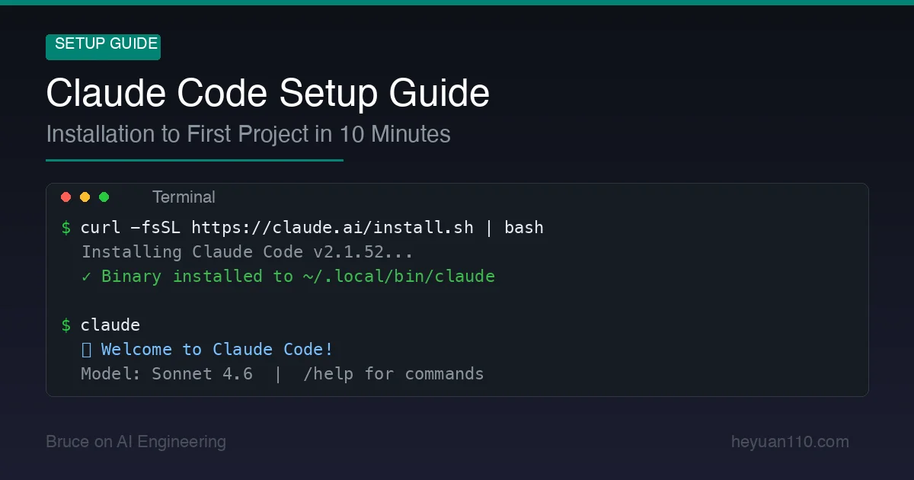

+++
date = '2026-02-25T12:00:00+08:00'
draft = false
title = 'How to Install Claude Code 2026: Terminal + VS Code Setup in 10 Minutes'
description = 'Step-by-step Claude Code installation guide for 2026: npm install, API key or Pro subscription setup, VS Code integration, permission config, and fixes for common errors.'
toc = true
tags = ['Claude Code', 'Setup', 'Tutorial', 'Getting Started']
categories = ['AI Guides']
keywords = ['Claude Code install', 'Claude Code setup', 'Claude Code setup 2026', 'Claude Code tutorial', 'how to install Claude Code', 'Claude Code getting started', 'Claude Code 2026', 'Claude Code VS Code', 'claude code installation guide', 'claude code npm install']
+++



You've heard about Claude Code. Maybe you've seen the demos. Now you want to try it yourself.

Good news: getting from zero to a working Claude Code setup takes about 10 minutes. This guide covers everything — installation, authentication, configuration, IDE integration, and running your first real task.

By the end, you'll have Claude Code working in your terminal and IDE, configured for your workflow, and ready to start coding with AI.

## Prerequisites

Before we start, make sure you have:

- **Operating system**: macOS 13+, Ubuntu 20.04+ / Debian 10+, or Windows 10+ (with Git Bash or WSL 2)
- **RAM**: 4 GB minimum
- **Internet connection**: Required (Claude Code runs against Anthropic's API)
- **An Anthropic account**: Sign up at [claude.ai](https://claude.ai) if you don't have one
- **A paid plan or API key**: Claude Code requires either a Pro/Max subscription ($20+/month) or an API key with credits. See our [Claude Code pricing guide](/posts/ai/2026-02-25-claude-code-pricing/) for plan details.

> Node.js is **no longer required**. The 2026 native installer handles everything. If you previously installed via npm, you can migrate — we'll cover that below.

## Step 1: Install Claude Code

### macOS / Linux (Recommended Method)

Open your terminal and run:

```bash
curl -fsSL https://claude.ai/install.sh | bash
```

That's it. The installer downloads the binary to `~/.local/bin/claude` and adds it to your PATH.

Want the latest bleeding-edge features instead of stable?

```bash
curl -fsSL https://claude.ai/install.sh | bash -s latest
```

### Windows

**PowerShell:**
```powershell
irm https://claude.ai/install.ps1 | iex
```

**Command Prompt:**
```cmd
curl -fsSL https://claude.ai/install.cmd -o install.cmd && install.cmd && del install.cmd
```

**WSL 2** (recommended for Windows users who want the full Linux experience):
```bash
# Inside your WSL 2 terminal
curl -fsSL https://claude.ai/install.sh | bash
```

### Verify Installation

```bash
claude --version
```

If you see a version number, you're good. If you get "command not found", add `~/.local/bin` to your PATH:

```bash
echo 'export PATH="$HOME/.local/bin:$PATH"' >> ~/.zshrc
source ~/.zshrc
```

(Replace `.zshrc` with `.bashrc` if you use Bash.)

### Migrating from npm Install

If you previously installed Claude Code via `npm install -g @anthropic-ai/claude-code`, migrate to the native installer:

```bash
claude install
```

The npm installation method is deprecated. The native installer is faster, auto-updates, and doesn't require Node.js.

### Run a Health Check

```bash
claude doctor
```

This diagnoses common issues — missing dependencies, PATH problems, authentication status, and more. Run it whenever something feels off.

## Step 2: Authenticate

Claude Code needs to know who you are. There are three authentication paths:

### Option A: Anthropic Account (Pro/Max Subscribers)

This is the simplest path if you have a Pro ($20/month) or Max ($100–200/month) subscription:

```bash
claude
```

On first launch, Claude Code opens your browser to complete OAuth authentication. Authorize the connection, and you're in. No API keys to manage.

### Option B: API Key (Pay-Per-Token)

If you prefer pay-per-token billing or don't have a subscription:

1. Get an API key from [console.anthropic.com](https://console.anthropic.com)
2. Set the environment variable:

```bash
export ANTHROPIC_API_KEY="sk-ant-your-key-here"
```

Add this to your `~/.zshrc` or `~/.bashrc` for persistence:

```bash
echo 'export ANTHROPIC_API_KEY="sk-ant-your-key-here"' >> ~/.zshrc
```

### Option C: Cloud Providers (Enterprise)

For organizations using AWS or GCP:

**Amazon Bedrock:**
```bash
export CLAUDE_CODE_USE_BEDROCK=1
# Configure AWS credentials as usual (aws configure, IAM roles, etc.)
```

**Google Vertex AI:**
```bash
export CLAUDE_CODE_USE_VERTEX=1
# Configure GCP credentials (gcloud auth, service accounts, etc.)
```

Both support LLM gateway proxies for enterprise network configurations.

## Step 3: Choose Your Model

Claude Code defaults to **Sonnet 4.6** — the best balance of speed, capability, and cost for coding tasks. But you have options.

Once inside Claude Code, switch models with the `/model` command:

| Command | Model | Best For | Relative Cost |
|---------|-------|----------|--------------|
| `/model sonnet` | Sonnet 4.6 | Daily coding (default) | 1x |
| `/model opus` | Opus 4.6 | Complex architecture, multi-step reasoning | 1.67x |
| `/model haiku` | Haiku 4.5 | Quick questions, simple tasks | 0.33x |

**My recommendation**: Stay on Sonnet for 80% of work. Switch to Opus when you're doing complex multi-file refactors, system design, or debugging particularly tricky issues. Use Haiku for quick lookups and simple questions.

## Step 4: Set Up CLAUDE.md

This is the single most impactful thing you can do for Claude Code's effectiveness. A [CLAUDE.md file](/posts/ai/2026-01-12-claudemd-memory-guide/) is a Markdown document in your project root that tells Claude Code everything it needs to know about your project.

Create one now:

```bash
touch CLAUDE.md
```

Here's a solid starter template:

````markdown
# Project Context

## Overview
[Brief description of what this project does]

## Tech Stack
- Language: [e.g., TypeScript, Python, Go]
- Framework: [e.g., Next.js 15, FastAPI, Gin]
- Database: [e.g., PostgreSQL, MongoDB]
- Testing: [e.g., Jest, pytest, go test]

## Code Conventions
- [e.g., Use functional components with hooks, no class components]
- [e.g., All functions must have type annotations]
- [e.g., Tests go in __tests__/ directories next to source files]

## Common Commands
```bash
# Run tests
npm test

# Start dev server
npm run dev

# Lint
npm run lint

# Build
npm run build
```

## Architecture Notes
- [e.g., API routes are in src/app/api/]
- [e.g., Shared types are in src/types/]
- [e.g., Database migrations are in prisma/migrations/]

## Important Rules
- [e.g., Never modify files in the vendor/ directory]
- [e.g., Always run tests before committing]
- [e.g., Use environment variables for all secrets — never hardcode]
````

Claude Code reads this file at the start of every session. A good CLAUDE.md eliminates the need to re-explain your project structure, conventions, and preferences every time — saving tokens and improving response quality.

## Step 5: Configure Permissions

By default, Claude Code operates in a cautious mode — it will ask permission before modifying files or running commands. You can customize this with `settings.json`.

### Quick Permission Setup

Create a project-level settings file:

```bash
mkdir -p .claude
```

Then create `.claude/settings.json`:

```json
{
  "permissions": {
    "allow": [
      "Bash(npm run lint)",
      "Bash(npm run test *)",
      "Bash(npm run build)",
      "Bash(git status)",
      "Bash(git diff *)",
      "Bash(git log *)"
    ],
    "deny": [
      "Bash(rm -rf *)",
      "Read(./.env)",
      "Read(./.env.*)",
      "Read(./secrets/**)"
    ]
  }
}
```

This pre-approves safe commands (linting, testing, git reads) and blocks dangerous ones (deleting files, reading secrets). Everything else will prompt you for approval.

Commit `.claude/settings.json` to your repo so the whole team shares the same permission rules.

### Permission Modes

Claude Code offers several trust levels:

| Mode | Behavior | Good For |
|------|----------|----------|
| **Default** | Asks before writes/commands | Learning Claude Code, untrusted tasks |
| **Sandbox** | Free within defined boundaries | Daily professional use |
| **Trust** | Auto-approves everything | Trusted automated pipelines |
| **Read-only** | No tool execution, analysis only | Code review, planning |

Most developers settle on Sandbox mode for daily work — it reduces permission prompts by ~84% while maintaining safety boundaries.

## Step 6: IDE Integration (Optional but Recommended)

Claude Code works great in a standalone terminal, but IDE integration adds visual editing, diff previews, and checkpoint management.

### VS Code / Cursor / Windsurf

Install the Claude Code extension:

1. Open VS Code (or Cursor/Windsurf)
2. Go to Extensions (`Cmd+Shift+X`)
3. Search for "Claude Code"
4. Install the official Anthropic extension

Features you get:
- **Inline editing**: See Claude's changes directly in your files before accepting
- **Checkpoints**: Snapshot your code state and roll back if needed
- **Multi-session**: Run multiple Claude Code sessions in separate tabs
- **File mentions**: Use `@filename` to reference specific files or line ranges

### JetBrains (IntelliJ, PyCharm, WebStorm, etc.)

JetBrains IDEs also have native Claude Code integration:

1. Go to `Settings > Plugins`
2. Search for "Claude Code"
3. Install and restart

The JetBrains integration shows inline diffs and supports the same checkpoint system as VS Code.

## Step 7: Your First Real Task

You're set up. Let's do something real.

Navigate to a project directory and start Claude Code:

```bash
cd ~/my-project
claude
```

### Useful First Commands

Before diving into tasks, try these:

| Type | What to Try |
|------|-------------|
| **Explore** | "What does this project do? Give me a high-level overview." |
| **Understand** | "Explain how authentication works in this codebase." |
| **Fix** | "There's a bug in the login flow — users get a 403 after token refresh. Find and fix it." |
| **Build** | "Add a /health endpoint that returns the app version and database connection status." |
| **Test** | "Write unit tests for the UserService class. Aim for 90% coverage." |
| **Refactor** | "The error handling in api/routes.ts is inconsistent. Standardize it." |

### Watch the Agentic Loop in Action

When you give Claude Code a complex task, watch what happens:

```
You > Add a rate limiter to the API endpoints

🔧 [1] list_files({"path": "src/api"})
  ✓ Found 8 route files

🔧 [2] read_file({"path": "src/api/routes.ts"})
  ✓ Read 245 lines

🔧 [3] read_file({"path": "package.json"})
  ✓ Read dependencies

🔧 [4] run_command({"command": "npm install express-rate-limit"})
  ✓ Installed express-rate-limit

🔧 [5] write_file({"path": "src/middleware/rateLimiter.ts"})
  ✓ Created rate limiter middleware

🔧 [6] edit_file({"path": "src/api/routes.ts"})
  ✓ Applied rate limiter to all routes

🔧 [7] run_command({"command": "npm test"})
  ✓ All 47 tests pass

✅ Rate limiting added. Each IP is limited to 100 requests per 15 minutes.
   Modified: src/middleware/rateLimiter.ts (new), src/api/routes.ts
```

That's the [Agentic Loop](/posts/ai/2026-02-24-build-magic-code/) — Claude Code autonomously plans, executes, and verifies, chaining multiple tools until the task is complete. One prompt, seven tool calls, zero manual intervention.

### Monitor Your Costs

After a few tasks, check how much you've spent:

```
/cost
```

This shows token usage and estimated cost for your current session. If you're on the API, this helps you understand your burn rate.

## Essential Slash Commands Reference

| Command | What It Does |
|---------|-------------|
| `/help` | Show all available commands |
| `/model` | Switch between Opus / Sonnet / Haiku |
| `/cost` | Show session token usage and estimated cost |
| `/compact` | Compress conversation history (saves tokens) |
| `/clear` | Reset conversation (start fresh) |
| `/doctor` | Diagnose configuration issues |
| `/rewind` | Roll back to a previous checkpoint |
| `/theme` | Change the visual theme |
| `/terminal-setup` | Configure multi-line input shortcuts |

## Keyboard Shortcuts

| Shortcut | Action |
|----------|--------|
| `Shift+Enter` | Multi-line input (iTerm2, WezTerm, Kitty, Ghostty) |
| `Ctrl+R` | Search prompt history |
| `Ctrl+T` | Toggle task list |
| `Esc Esc` (double) | Rewind to last checkpoint |
| `Shift+Tab` | Auto-accept edits in plan mode |
| `?` | Show all keyboard shortcuts |

> **Tip for macOS users**: If `Alt` key combinations don't work, go to your terminal's preferences and set `Option` as `Meta` key.

## Troubleshooting

### "command not found" after installation

Your PATH doesn't include `~/.local/bin`. Fix it:

```bash
export PATH="$HOME/.local/bin:$PATH"
# Make it permanent:
echo 'export PATH="$HOME/.local/bin:$PATH"' >> ~/.zshrc
```

### "exec: node: not found" on WSL

WSL is picking up the Windows Node.js instead of a Linux one. Install Node.js natively in WSL:

```bash
curl -o- https://raw.githubusercontent.com/nvm-sh/nvm/v0.40.0/install.sh | bash
nvm install 18
```

### Certificate errors behind corporate proxy

Your company's SSL inspection is interfering. Set the CA bundle:

```bash
export NODE_EXTRA_CA_CERTS=/path/to/corporate-ca-bundle.crt
export HTTPS_PROXY=http://proxy.company.com:8080
```

### Slow responses or timeouts

- Check your internet connection
- Try `/model sonnet` if you're on Opus (Sonnet is faster)
- Run `/compact` to reduce conversation size
- Close and restart if the session has been running for hours

### Rate limit hit

If you see rate limit warnings:
- Wait a few minutes (limits reset on a rolling window)
- Switch to a lighter model: `/model haiku`
- Consider upgrading your plan (Pro → Max 5x)
- If on API, check your [rate limits](https://docs.anthropic.com/en/api/rate-limits)

## What to Do Next

You're up and running. Here's where to go from here:

1. **[Set up CLAUDE.md properly](/posts/ai/2026-01-12-claudemd-memory-guide/)** — The single biggest productivity boost
2. **[Learn Claude Code Hooks](/posts/ai/2026-02-18-claude-code-hooks-guide/)** — Automate linting, testing, and formatting on every change
3. **[Understand the pricing](/posts/ai/2026-02-25-claude-code-pricing/)** — Pick the right plan for your usage level
4. **[Build your own Claude Code](/posts/ai/2026-02-24-build-magic-code/)** — Understand the Agentic Loop architecture under the hood
5. **[Master Claude Code tips](/posts/ai/2025-01-23-claude-code-commands/)** — 24 power-user techniques

Claude Code gets better the more context you give it. Invest time in your CLAUDE.md, configure sensible permissions, and start with small tasks before handing it complex refactors. Within a week, you'll wonder how you coded without it.

## Related Reading

- [Claude Code Pricing 2026: Is the Max Plan Worth It?](/posts/ai/2026-02-25-claude-code-pricing/) — Full cost breakdown
- [CLAUDE.md Guide: Give AI Perfect Project Context](/posts/ai/2026-01-12-claudemd-memory-guide/) — Essential for effective Claude Code usage
- [Claude Code Complete Guide](/posts/ai/2026-01-14-claude-code-guide/) — Deep dive into all features
- [Claude Code Hooks: 12 Automation Configs](/posts/ai/2026-02-18-claude-code-hooks-guide/) — Automate your workflow
- [Build Your Own Claude Code from Scratch](/posts/ai/2026-02-24-build-magic-code/) — Understand the architecture
- [Claude Code vs Cursor vs Windsurf](/posts/ai/2026-02-18-claude-code-vs-cursor-vs-windsurf-2026/) — Which tool is right for you?
