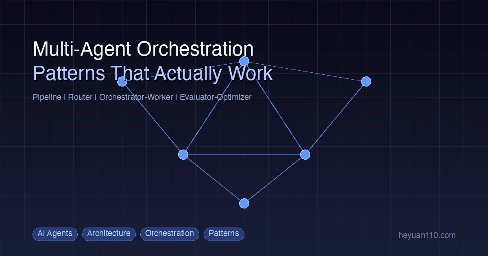

+++
date = '2026-02-26T10:00:00+08:00'
draft = false
title = 'Multi-Agent Orchestration: 4 Patterns That Actually Work'
description = 'Learn 4 proven multi-agent orchestration patterns — Pipeline, Router, Orchestrator-Worker, and Evaluator-Optimizer — with real-world examples from Claude Code, Cursor, and Antigravity.'
toc = true
tags = ['Multi-Agent', 'AI Architecture', 'Agent Orchestration', 'Claude Code', 'AI Patterns']
categories = ['AI Guides']
keywords = ['multi agent orchestration', 'ai agent patterns', 'multi agent architecture', 'agent orchestration patterns', 'ai agent collaboration']

[[params.faqItems]]
question = "What is multi-agent orchestration?"
answer = "Multi-agent orchestration is the practice of coordinating multiple specialized AI agents to accomplish complex tasks. Instead of relying on a single general-purpose agent, you decompose work across agents with distinct roles — a planner, a coder, a reviewer — and define how they communicate, hand off work, and resolve conflicts."

[[params.faqItems]]
question = "When should I use multi-agent instead of a single agent?"
answer = "Switch to multi-agent when you hit one of three bottlenecks: memory bloat (the agent slows down from accumulated context), context pollution (responses drift off-topic because unrelated knowledge interferes), or cost explosion (every request carries unnecessary tokens). If your single agent consistently struggles with these, it is time to specialize."

[[params.faqItems]]
question = "Which multi-agent pattern is best for coding tasks?"
answer = "The Orchestrator-Worker pattern works best for most coding tasks. An orchestrator agent plans the work, spawns specialized worker agents for implementation and testing, then reviews the results. Claude Code's Worktree feature and Cursor's parallel agents both use variants of this pattern in production."

[[params.faqItems]]
question = "How do agents communicate in a multi-agent system?"
answer = "Agents communicate through structured message passing — typically JSON payloads sent via internal APIs. The key principle is minimal, structured communication: agents should exchange only the information needed for the next step, using schemas rather than free-form text to avoid misinterpretation."
+++



A single AI agent can do impressive things — until it cannot. Give one agent a codebase with 200 files, a conversation history spanning 50 exchanges, and instructions that mix refactoring with testing with documentation, and you will watch it slowly fall apart. Responses drift. Costs spike. The agent starts "hallucinating" connections between unrelated parts of your project.

The fix is not a smarter model. It is **better architecture**.

Multi-agent orchestration — the practice of coordinating multiple specialized agents to tackle complex tasks — has moved from research papers to production systems in 2026. Tools like [Claude Code](/posts/ai/2026-02-28-claude-code-complete-guide/), Cursor, and [Google Antigravity](/posts/ai/2026-03-10-google-antigravity-review/) all use multi-agent patterns under the hood. Understanding these patterns is no longer optional for serious AI engineering.

This guide covers the four orchestration patterns that actually work in production, when to use each one, and how to implement them effectively.

## Why Single Agents Fail at Scale

Before jumping into solutions, let's understand the problem. Single-agent architectures hit three predictable bottlenecks as usage grows.

### Bottleneck 1: Memory Bloat

Every conversation adds to the agent's context. Memory files, project documentation, past interactions — they all accumulate. A single agent handling writing, coding, research, and debugging ends up loading megabytes of context on every request.

The result: **response latency climbs linearly with usage history.** An agent that responded in 2 seconds on day one takes 8 seconds by week three. Worse, the model's attention gets diluted across irrelevant context, reducing the quality of every response.

### Bottleneck 2: Context Pollution

This is the subtler killer. When a single agent handles multiple domains, knowledge from one domain bleeds into another. Ask your all-purpose agent to write marketing copy, and it starts inserting code-style formatting. Ask it to review a pull request, and it references a blog post outline from yesterday's conversation.

Context pollution happens because large language models do not have hard boundaries between "topics." Everything in the context window influences everything else. The more diverse the agent's responsibilities, the more cross-contamination you get.

### Bottleneck 3: Cost Explosion

This one hits the budget directly. If your agent carries 50,000 tokens of accumulated context into every request, you are paying for those tokens whether they are relevant or not. A coding agent that also remembers your writing style preferences, research notes, and meeting summaries is burning tokens on context that adds zero value to the current task.

| Bottleneck | Symptom | Root Cause |
|------------|---------|------------|
| **Memory Bloat** | Slow responses, degraded quality over time | Accumulated context from all domains |
| **Context Pollution** | Off-topic responses, "hallucinated" connections | Cross-domain knowledge interference |
| **Cost Explosion** | Token usage 3-5x higher than necessary | Irrelevant context loaded on every request |

The common thread: **a single agent doing too many things accumulates too much irrelevant state.** The solution is specialization.

## The Four Orchestration Patterns

Multi-agent orchestration is not a single technique — it is a family of architectural patterns. Each pattern fits different use cases. Based on research from [LangChain's multi-agent architecture analysis](https://blog.langchain.com/choosing-the-right-multi-agent-architecture/) and [Anthropic's agent design documentation](https://docs.anthropic.com/en/docs/agents-overview), four patterns have emerged as the workhorses of production systems.

### Pattern 1: Pipeline

The Pipeline pattern chains agents sequentially. Each agent's output becomes the next agent's input, like stations on an assembly line.

```
User Request
    ↓
┌──────────┐    ┌──────────┐    ┌──────────┐
│ Research  │ →  │  Draft   │ →  │  Review  │
│  Agent    │    │  Agent   │    │  Agent   │
└──────────┘    └──────────┘    └──────────┘
                                     ↓
                               Final Output
```

**How it works:** A research agent gathers information and produces a structured brief. A drafting agent takes that brief and produces content. A review agent checks the draft for accuracy, style, and completeness.

**When to use it:**
- Content creation workflows (research → write → edit → publish)
- Code development pipelines (design → implement → test → review)
- Data processing chains (collect → clean → analyze → visualize)

**Strengths:**
- Simple to reason about — data flows in one direction
- Each agent has a narrow, well-defined responsibility
- Easy to debug — you can inspect the output at each stage

**Weaknesses:**
- Total latency is the sum of all stages
- A failure at any stage blocks the entire pipeline
- Does not handle tasks that require iteration between stages

**Production example:** Many CI/CD-integrated coding workflows use Pipeline orchestration. A planning agent produces a spec, an implementation agent writes the code, and a testing agent validates it. If tests fail, the pipeline restarts from the implementation stage with the test results as additional context.

### Pattern 2: Router

The Router pattern uses a lightweight classifier to direct incoming requests to the right specialist agent. Unlike Pipeline, there is no sequential chain — each request goes to exactly one agent.

```
User Request
    ↓
┌──────────────┐
│    Router    │
│ (classifier) │
└──┬─────┬──┬─┘
   ↓     ↓  ↓
┌────┐ ┌────┐ ┌────┐
│Code│ │Write│ │Debug│
│Agent│ │Agent│ │Agent│
└────┘ └────┘ └────┘
   ↓     ↓     ↓
  Response to User
```

**How it works:** The router analyzes the incoming request — sometimes using a smaller, faster model — and classifies it into a category. Based on that classification, it forwards the request to the appropriate specialist agent. Each specialist has its own system prompt, tools, and memory.

**When to use it:**
- Multi-purpose assistants that handle distinct task types
- Customer support systems with specialized departments
- Development environments where coding, debugging, and documentation are separate concerns

**Strengths:**
- Low latency — only one specialist agent processes each request
- Specialists can be independently optimized (different models, different context)
- Scales horizontally — add new specialists without changing existing ones

**Weaknesses:**
- Router misclassification sends requests to the wrong agent
- Does not handle tasks that span multiple domains
- Requires good training data or rules for the classification layer

**Production example:** OpenClaw's Bindings mechanism is a deterministic Router. It matches incoming messages to agents based on channel, group ID, and user identity — no LLM classification needed, just rule-based routing. This approach eliminates misclassification entirely for known routing patterns.

### Pattern 3: Orchestrator-Worker

This is the most powerful and most common pattern in production AI coding tools. A central orchestrator agent plans the work, spawns worker agents for execution, and synthesizes their results.

```
User Request
    ↓
┌────────────────┐
│  Orchestrator  │
│  (plans work)  │
└──┬──────┬────┬─┘
   ↓      ↓    ↓     ← spawns workers
┌─────┐┌─────┐┌─────┐
│Work ││Work ││Work │
│ er1 ││ er2 ││ er3 │
└──┬──┘└──┬──┘└──┬──┘
   ↓      ↓      ↓
┌────────────────┐
│  Orchestrator  │
│ (reviews work) │
└────────────────┘
    ↓
Final Output
```

**How it works:** The orchestrator receives a complex task, decomposes it into subtasks, assigns each subtask to a worker agent, monitors progress, and assembles the final result. Workers operate independently but report back to the orchestrator.

**When to use it:**
- Complex coding tasks that touch multiple files or systems
- Any task requiring both planning and parallel execution
- Scenarios where subtasks are independent but the final result needs integration

**Strengths:**
- Handles complex, multi-step tasks naturally
- Workers can run in parallel for faster completion
- Orchestrator provides quality control and error recovery
- Maps directly to how human engineering teams work

**Weaknesses:**
- Higher total token cost (orchestrator + all workers)
- Orchestrator is a single point of failure
- Requires careful task decomposition to avoid overlapping worker scopes

**Production examples:**

[**Claude Code Worktree:**](/posts/ai/2026-02-28-claude-code-worktree-guide/) Claude Code's Worktree feature is a textbook Orchestrator-Worker implementation. The main Claude Code instance acts as the orchestrator — it analyzes a task, creates separate git worktrees for parallel work, spawns sub-agents in each worktree, and merges the results. Each worker operates in an isolated file system branch, preventing conflicts.

**Cursor Background Agents:** Cursor's multi-agent system lets you spawn parallel agents that work on different parts of a codebase simultaneously. Each agent gets its own sandbox environment, and results are merged back into the main branch.

[**Google Antigravity Manager View:**](/posts/ai/2026-03-10-google-antigravity-review/) Antigravity's Manager View provides a visual dashboard for orchestrating multiple agents. You can see each agent's progress, reassign tasks, and intervene when an agent gets stuck — essentially a GUI for the Orchestrator-Worker pattern.

### Pattern 4: Evaluator-Optimizer

The Evaluator-Optimizer pattern creates a feedback loop between two agents: one generates output, the other evaluates it, and the generator iterates based on the evaluation.

```
User Request
    ↓
┌────────────┐
│ Generator  │ ←──────────────┐
│   Agent    │                │
└─────┬──────┘                │
      ↓                       │
┌────────────┐         ┌──────┴─────┐
│ Evaluator  │ ──────→ │  Feedback  │
│   Agent    │         │   Loop     │
└─────┬──────┘         └────────────┘
      ↓
  (meets criteria?)
      ↓ Yes
  Final Output
```

**How it works:** The generator agent produces an initial output. The evaluator agent scores it against predefined criteria and provides specific feedback. If the score is below threshold, the generator receives the feedback and produces an improved version. This cycle repeats until the evaluator is satisfied or a maximum iteration count is reached.

**When to use it:**
- Code review and improvement cycles
- Content quality assurance
- Any task where iterative refinement beats one-shot generation

**Strengths:**
- Produces higher-quality output through iteration
- Evaluator catches errors the generator systematically misses
- Clear stopping criteria (evaluator approval)
- Different models can play different roles (cheap model generates, expensive model evaluates)

**Weaknesses:**
- Multiple iterations increase latency and cost
- Risk of infinite loops if stopping criteria are too strict
- Evaluator and generator can develop adversarial dynamics

**Production example:** The "ensemble method" used by teams like StockApp deploys multiple AI models in an Evaluator-Optimizer loop. One model writes code, a different model (sometimes from a different provider) reviews it. The diversity of models provides broader error coverage — each model has different blind spots, so cross-model review catches more issues than same-model self-review.

### Choosing the Right Pattern

Not every task needs multi-agent orchestration. Start simple and escalate only when you hit clear limitations.

| Pattern | Best For | Complexity | Latency |
|---------|----------|------------|---------|
| **Pipeline** | Sequential workflows with clear stages | Low | Medium (sum of stages) |
| **Router** | Multi-purpose systems with distinct task types | Low | Low (single agent) |
| **Orchestrator-Worker** | Complex tasks requiring planning + parallel execution | High | Variable (depends on parallelism) |
| **Evaluator-Optimizer** | Quality-critical output requiring iteration | Medium | High (multiple rounds) |

The recommended progression:

```
Single Agent + Tools
    ↓ (context pollution begins)
Single Agent + Skills/Plugins
    ↓ (memory bloat, cost issues)
Router (2-3 specialist agents)
    ↓ (need cross-agent collaboration)
Orchestrator-Worker or Pipeline
    ↓ (need quality assurance)
Add Evaluator-Optimizer loop
```

> **Core principle:** Add tools before adding agents. Only upgrade to multi-agent when you hit a clear bottleneck that tool-level solutions cannot fix.

## The Autonomy Spectrum

Not all tasks deserve the same level of agent independence. Stanford's CS146S course (Week 4, taught by Claude Code creator Boris Cherney) introduced the **autonomy spectrum** — a framework for deciding how much freedom to give your agents.

### Low Autonomy: Direct Execution

- **Task type:** Clear input, clear output, minimal decision-making
- **Examples:** Rename variables, add type annotations, fix lint errors, write unit tests for existing functions
- **Management style:** Give the instruction, accept the result
- **Time savings:** ~95%

At this level, the agent is essentially a very fast typist. You tell it exactly what to do, and it does it. Almost no supervision needed.

### Medium Autonomy: Guided Implementation

- **Task type:** Requires some design decisions, touches multiple files, has ambiguous edge cases
- **Examples:** Implement a new API endpoint, refactor a module, add a feature with UI changes
- **Management style:** Provide detailed context, review at checkpoints, polish the final 20%
- **Time savings:** ~80%

This is where most real development work falls. The agent handles 80% of the implementation, but you need to review architectural choices, handle edge cases, and ensure consistency with the existing codebase.

Your role shifts from "person who types code" to **"pair programming partner"** — you and the agent collaborate, with you focusing on the decisions the agent cannot make well.

### High Autonomy: Strategic Delegation

- **Task type:** Cross-system changes, architectural decisions, high uncertainty
- **Examples:** Database schema design, microservice communication patterns, performance optimization, security hardening
- **Management style:** Phase-based execution with checkpoints at every stage
- **Time savings:** 30-60%

At this level, the agent is like a junior engineer — capable of doing substantial work but needing senior oversight at every critical decision point. You plan the phases, define acceptance criteria for each phase, review after each phase, and course-correct as needed.

**The critical mindset shift:** Do not expect agents to complete complex tasks in one shot. Break complex tasks into medium-autonomy subtasks, execute them sequentially, and verify each step before proceeding.

| Dimension | Low Risk (more autonomy) | High Risk (more oversight) |
|-----------|------------------------|--------------------------|
| **Scope** | Single file change | Cross-system modification |
| **Reversibility** | Easy to rollback | Hard to undo |
| **Security** | Internal logic only | Touches auth, user data, payments |
| **Determinism** | Clear success criteria | Requires subjective judgment |
| **Precedent** | Similar successful examples exist | Novel scenario |

## The Agent Manager Role

The rise of multi-agent systems has created a new skill set: **Agent Management.** This is not about writing code — it is about directing agents that write code.

Boris Cherney's presentation at Stanford CS146S made the case that Agent Management is the highest-leverage skill in AI-assisted development. Here is what it involves.

### Task Decomposition

The most important Agent Manager skill. A complex requirement like "migrate our frontend from Vue 2 to Vue 3" needs to be broken into agent-sized pieces:

```
❌ Bad: "Migrate the entire frontend from Vue 2 to Vue 3"

✅ Good: "Migrate src/components/Button.vue to Vue 3 Composition API.
   Keep the same props interface. Run `npm test -- --grep Button`
   to verify. Do not touch any other files."
```

Each subtask should have:
- **Clear inputs:** What files/information the agent needs
- **Clear outputs:** What the agent should produce
- **Clear validation:** How to verify the subtask is complete
- **Bounded scope:** No more than what fits in a single PR review

### Checkpoint Review

Do not let agents run unsupervised for extended periods. Set checkpoints:

1. **After planning:** Review the agent's plan before it starts coding
2. **After implementation:** Review the code before running tests
3. **After testing:** Review test results and coverage before merging
4. **After integration:** Verify the change works in the broader system

Each checkpoint is an opportunity to course-correct. Catching a wrong direction at the planning stage saves hours compared to catching it after implementation.

### Context Curation

What you give the agent matters more than what you ask it to do. Follow the **minimum sufficient context** principle:

- Only provide information relevant to the current subtask
- Use layered structure: global context (project rules) → local context (current file/module) → task context (specific instructions)
- Keep context consistent — contradictory instructions in different context layers cause unpredictable behavior
- Update context after each subtask — the next task may need information from the previous task's output

This is where tools like [CLAUDE.md configuration files](/posts/ai/2026-02-28-claude-code-complete-guide/) shine. A well-written CLAUDE.md acts as persistent context that every agent session inherits, eliminating the need to repeat project conventions in every prompt.

## Communication Between Agents

In multi-agent systems, how agents talk to each other is as important as what each agent does individually.

### Structured Message Passing

Agents should communicate through structured data, not free-form text. When Agent A passes work to Agent B, the handoff should look like this:

```json
{
  "task": "implement_endpoint",
  "context": {
    "endpoint": "/api/users/:id",
    "method": "GET",
    "schema": "See schema.sql lines 45-60",
    "constraints": ["must return 404 for missing users", "response time < 200ms"]
  },
  "acceptance_criteria": [
    "All existing tests pass",
    "New endpoint has >80% test coverage",
    "Follows project REST conventions in CLAUDE.md"
  ]
}
```

Structured communication reduces misinterpretation. Free-form text like "implement the user endpoint based on what we discussed" leaves too much room for the receiving agent to fill in gaps incorrectly.

### Communication Topology

Not every agent needs to talk to every other agent. Define explicit communication channels:

- **Hub-and-spoke:** All communication goes through the orchestrator. Workers never talk to each other directly. Simple but creates a bottleneck at the orchestrator.
- **Peer-to-peer:** Agents can communicate directly. More flexible but harder to debug and can lead to circular dependencies.
- **Hierarchical:** Agents are organized in a tree. Each agent communicates only with its parent and children. Scales well for large systems.

For most practical applications, **hub-and-spoke through an orchestrator** is the right choice. It is easier to reason about, easier to debug, and the orchestrator provides a natural point for logging and monitoring.

### Whitelist-Based Permissions

Agent-to-agent communication should be explicitly enabled, not implicitly available. Follow the principle of least privilege:

```json
{
  "agentToAgent": {
    "enabled": true,
    "allow": ["orchestrator", "coder", "reviewer"]
  }
}
```

Only agents that genuinely need to communicate should be on the allow list. A documentation agent does not need to talk to a deployment agent directly — if they need to coordinate, they should do so through the orchestrator.

## Real-World Implementations

Theory is useful, but seeing these patterns in production systems makes them concrete. Here are three implementations worth studying.

### Claude Code Worktree: Orchestrator-Worker in Practice

[Claude Code's Worktree feature](/posts/ai/2026-02-28-claude-code-worktree-guide/) is the cleanest production implementation of Orchestrator-Worker for coding tasks.

**How it works:**
1. You give Claude Code a complex task (e.g., "add authentication to the API")
2. The main instance analyzes the task and creates a plan
3. It creates separate git worktrees — isolated copies of the repository
4. Sub-agents are spawned in each worktree to work on independent subtasks
5. Each sub-agent works without interfering with others (file-system isolation via git worktree)
6. The main instance reviews completed work and merges results

**Why it works well:** Git worktrees provide true file-system isolation. Agent A refactoring the auth module cannot accidentally break Agent B's work on the user endpoint, because they are literally working on different copies of the code. This eliminates the coordination overhead that plagues most multi-agent coding setups.

For a deep dive into setting up and using Worktree effectively, see the [Claude Code Worktree Guide](/posts/ai/2026-02-28-claude-code-worktree-guide/).

### Cursor Background Agents: Parallel Execution

Cursor takes a different approach to multi-agent coding. Its background agents run in cloud sandboxes, each with a full development environment.

**Key differentiator:** Cursor agents can run truly in parallel — not just concurrent file editing, but independent CI pipelines, test suites, and build processes. You can have one agent implementing a feature while another writes tests for a different feature, each in their own sandbox.

**Trade-off:** Cloud sandboxes add latency compared to local execution. But for teams working on large codebases, the parallelism gains outweigh the per-agent overhead.

For a comparison of how different tools handle multi-agent workflows, see the [AI Coding Agents Comparison](/posts/ai/2026-03-10-ai-coding-agents-comparison-2026/).

### Antigravity Manager View: Visual Orchestration

[Google Antigravity's Manager View](/posts/ai/2026-03-10-google-antigravity-review/) brings a visual interface to agent orchestration. Instead of managing agents through CLI commands or configuration files, you get a dashboard showing:

- Each agent's current task and progress
- Real-time output from each agent
- The ability to pause, redirect, or terminate individual agents
- A unified view of how subtasks connect to the overall goal

This approach lowers the barrier to Agent Management. You do not need to be comfortable with terminal-based workflows to orchestrate multiple agents effectively.

### Claude Code Agent Teams: Team-Based Orchestration

For teams that need multiple developers coordinating through AI agents, [Claude Code's Teams features](/posts/ai/2026-02-28-claude-code-teams-guide/) provide shared context, consistent coding standards, and coordinated multi-agent workflows across team members. This extends the Orchestrator-Worker pattern from a single developer to an entire engineering team.

## Production Best Practices

These lessons come from teams running multi-agent systems in production, not from toy examples.

### 1. Start with Two Agents, Not Ten

The most common mistake is over-engineering the agent topology. Start with a simple split — one orchestrator and one worker — and add agents only when you have evidence that the current setup is bottlenecked.

**Rule of thumb:** If two agents spend more than 80% of their time on similar tasks, merge them. If one agent's context is consistently polluted by unrelated responsibilities, split it.

### 2. Give Each Agent Minimal Permissions

A writing agent does not need code execution. A testing agent does not need file write access beyond the test directory. Scope each agent's tools and permissions to exactly what it needs.

```
Writer Agent:  read, browse          (no exec, no write)
Coder Agent:   read, write, exec     (no browse)
Review Agent:  read                  (no write, no exec)
```

Minimal permissions are not just a security measure — they also reduce the chance of agents taking unexpected actions that derail the workflow.

### 3. Use Different Models for Different Roles

Not every agent needs the most expensive model. Match model capability to task complexity:

| Agent Role | Recommended Model Tier | Why |
|------------|----------------------|-----|
| Router/Classifier | Small, fast model | Only needs to categorize, not reason deeply |
| Code Generator | Top-tier reasoning model | Needs deep understanding of logic and architecture |
| Code Reviewer | Top-tier reasoning model | Needs to catch subtle bugs and design issues |
| Test Writer | Mid-tier model | Follows patterns, less creative reasoning needed |
| Documentation | Mid-tier model | Good language skills, less technical depth needed |

Using a cheaper model for routing and a premium model for code generation can cut your total costs by 40-60% with no quality loss.

### 4. Build in Fallback Mechanisms

Agents fail. Networks timeout. Models return garbage. Your multi-agent system needs to handle these cases gracefully:

- **Retry with exponential backoff** for transient failures
- **Fallback to orchestrator** when a worker agent is unresponsive
- **Maximum iteration limits** on Evaluator-Optimizer loops to prevent infinite cycles
- **Human escalation** for tasks that exceed the agent's confidence threshold

### 5. Log Everything

Multi-agent debugging is fundamentally harder than single-agent debugging. You need visibility into:

- What each agent received as input
- What each agent produced as output
- How long each agent took
- Which agent-to-agent communications occurred
- Where in the pipeline a failure originated

Structured logging with correlation IDs (linking all agents working on the same user request) is essential. Without it, debugging a multi-agent system is like debugging a distributed microservice architecture without tracing — theoretically possible, but practically a nightmare.

### 6. Design for Graceful Degradation

If your review agent goes down, the system should still be able to produce code — just without the review step. If your research agent fails, the writing agent should be able to produce content with reduced quality rather than failing entirely.

Design each agent interaction as **optional enhancement** rather than **hard dependency** wherever possible.

## Building Your Own Multi-Agent System

If you want to go deeper and build multi-agent orchestration from scratch, the [Build AI Agent from Scratch](/posts/ai/2026-03-07-build-ai-agent-python/) guide walks through the fundamentals of agent architecture in Python — including tool use, memory management, and the orchestration primitives you need for multi-agent coordination.

For a practical starting point, here is a minimal Orchestrator-Worker setup:

```python
class Orchestrator:
    def __init__(self, workers: dict[str, Agent]):
        self.workers = workers

    def execute(self, task: str) -> str:
        # Step 1: Plan
        plan = self.plan(task)

        # Step 2: Assign subtasks to workers
        results = {}
        for subtask in plan.subtasks:
            worker = self.workers[subtask.agent_type]
            results[subtask.id] = worker.execute(subtask.instructions)

        # Step 3: Synthesize results
        return self.synthesize(results)

    def plan(self, task: str) -> Plan:
        """Use LLM to decompose task into subtasks."""
        ...

    def synthesize(self, results: dict) -> str:
        """Combine worker outputs into final result."""
        ...
```

The key insight: orchestration is fundamentally about **planning, delegation, and synthesis.** The orchestrator decides what to do, workers do it, and the orchestrator combines the results. Everything else — error handling, retries, parallel execution, quality checks — is built on top of this core loop.

## What Comes Next

Multi-agent orchestration is evolving rapidly. Three trends to watch:

1. **Autonomous agent teams:** Systems where agents can spawn sub-agents on their own, without human-defined topology. Claude Code's Worktree already hints at this — the main agent decides when and how to parallelize work.

2. **Cross-tool orchestration:** Using agents from different providers together. Imagine a Claude Code agent for reasoning paired with a Cursor agent for IDE integration paired with an Antigravity agent for free parallel exploration. MCP (Model Context Protocol) is making this more practical.

3. **Agent-native development workflows:** Instead of adapting existing workflows to include agents, designing workflows that are multi-agent from the start. This means rethinking everything from version control to code review to deployment pipelines.

The developers who master multi-agent orchestration now will have a significant advantage as these systems become the default way software is built.

## Related Reading

- [Claude Code Complete Guide](/posts/ai/2026-02-28-claude-code-complete-guide/) — Master the tool that pioneered Orchestrator-Worker for coding
- [Claude Code Worktree Guide](/posts/ai/2026-02-28-claude-code-worktree-guide/) — Deep dive into parallel agent execution with git worktrees
- [Claude Code Teams Guide](/posts/ai/2026-02-28-claude-code-teams-guide/) — Multi-agent coordination across engineering teams
- [AI Coding Agents Comparison 2026](/posts/ai/2026-03-10-ai-coding-agents-comparison-2026/) — How different tools implement multi-agent patterns
- [Build AI Agent from Scratch](/posts/ai/2026-03-07-build-ai-agent-python/) — Understand agent internals by building one yourself
- [Google Antigravity Review](/posts/ai/2026-03-10-google-antigravity-review/) — Visual agent orchestration with Manager View
- [LangChain: Choosing Multi-Agent Architecture](https://blog.langchain.com/choosing-the-right-multi-agent-architecture/) — Framework-level perspective on orchestration patterns
- [Anthropic: Building Effective Agents](https://docs.anthropic.com/en/docs/agents-overview) — Official guidance on agent design from the Claude team
