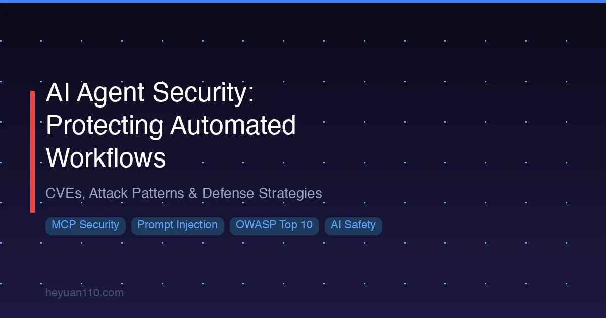

+++
date = '2026-02-27T10:00:00+08:00'
draft = false
title = 'AI Agent 安全指南：2026年自动化工作流防护全攻略'
description = '深入解析 AI Agent 面临的安全威胁：提示注入、工具投毒、MCP 漏洞，涵盖 OWASP Agentic Top 10 框架、真实 CVE 案例、防御策略与安全工具推荐。'
toc = true
tags = ['AI Security', 'MCP', 'AI Agent', 'Claude Code']
categories = ['AI Guides']
keywords = ['AI Agent 安全', 'MCP 安全漏洞', 'AI 编程安全', '提示注入防御', 'AI Agent 攻击面', 'OWASP Agentic Top 10']

[[params.faqItems]]
question = "AI 编程 Agent 最大的安全风险是什么？"
answer = "提示注入（Prompt Injection）是目前最危险的威胁。攻击者在代码仓库、GitHub Issues 或网页中嵌入隐藏指令，AI Agent 读取后可能被操纵执行任意命令、泄露敏感数据或未经用户确认修改文件。2025-2026 年已有多个 CVE 证实了针对 GitHub Copilot、Cursor 和 MCP 服务器的真实提示注入攻击。"

[[params.faqItems]]
question = "如何扫描 MCP 服务器的安全漏洞？"
answer = "最快的方式是在项目目录下运行 'uvx mcp-scan'。这是 Invariant Labs 开发的开源工具，会读取 MCP 配置、连接各服务器、检查工具描述是否存在投毒迹象，并与已知漏洞数据库比对。支持 Claude Code、Claude Desktop、Cursor 和 Windsurf，扫描通常 30 秒内完成。"

[[params.faqItems]]
question = "AI Agent 能否用于提升代码安全性？"
answer = "可以。像 Claude Code 这样的 AI 安全工具能进行超越模式匹配的语义代码分析，理解代码意图、跨函数追踪数据流、检测传统 SAST 工具遗漏的漏洞。但 AI 安全扫描应作为补充，而非替代人工安全审查和 Snyk、Semgrep 等成熟工具。"

[[params.faqItems]]
question = "什么是 OWASP Agentic Security Top 10？"
answer = "OWASP 于 2025 年底发布的 Agentic Security Top 10 是专门针对 AI Agent 系统风险的框架，涵盖提示注入、访问控制失效、工具滥用、过度授权、输出处理不当、供应链漏洞、敏感数据泄露、不安全接口、拒绝服务和日志不足十大风险，已成为审计 AI Agent 部署的标准参考。"
+++



AI Agent 正在深刻改变软件开发方式。[Claude Code](/zh/posts/ai/2026-02-28-claude-code-complete-guide/)、GitHub Copilot、Cursor 等工具可以读取整个代码库、执行 Shell 命令、跨项目修改文件，并通过 MCP 等协议与外部服务交互。如此强大的能力也带来了传统安全模型从未应对过的攻击面。

仅 2026 年前两个月，已有超过 30 个 CVE 针对 MCP 服务器和 AI Agent 工具被提交。安全研究人员演示了泄露私有仓库代码的提示注入攻击、窃取聊天记录的工具投毒技术，以及影响近 50 万次下载量包的远程代码执行漏洞。

本文是 AI Agent 工作流安全的全面指南。无论你是在个人项目中使用 Claude Code 的开发者，还是在组织中部署 AI Agent 的技术负责人，理解这些威胁及可用的防御手段已刻不容缓。

## AI Agent 攻击面的扩展

传统软件有着清晰的安全边界：用户输入经过验证、身份认证保护敏感端点、沙箱隔离不受信任的代码。AI Agent 打破了所有这些假设。

一个典型的 AI 编程 Agent 通常拥有：

- **读取整个代码库的权限**，包括配置文件、环境变量和密钥
- **文件系统写入权限**，可以创建和修改任何文件
- **Shell 执行能力**，可以运行任意命令
- **网络访问权限**，通过 MCP 服务器和 API 集成
- **来自不受信任源的上下文**，包括 GitHub Issues、Pull Requests、文档和网页

这种组合构成了独特的威胁模型——Agent 既是强大的工具，也是潜在的攻击载体。它处理不受信任的输入（代码、文档、用户提示），同时拥有执行嵌入其中的恶意指令的权限。

### 传统安全为何力不从心

传统安全工具基于静态分析模式运行。SAST 扫描器寻找已知的漏洞特征——SQL 注入模式、硬编码凭据、不安全的反序列化调用。这些工具无法理解代码的语义含义，更无法应对 AI Agent 解读工具元数据中嵌入的自然语言指令这一场景。

AI Agent 攻击面引入了传统软件安全中不存在的威胁类型：

- **工具描述作为攻击载体**：MCP 服务器暴露的工具元数据被 Agent 视为可信指令，篡改这些描述可以改变 Agent 行为
- **跨上下文提示注入**：嵌入在 Agent 处理的数据（GitHub Issues、数据库记录、Slack 消息）中的恶意提示可覆盖 Agent 的原始指令
- **信任持久化攻击**：用户一旦批准某个 AI 工具或 MCP 服务器，许多客户端会无限期缓存该信任决策——即使工具的行为已发生改变
- **Agent 链式攻击**：在多 Agent 系统中，攻陷一个 Agent 可能级联传播至整个链条，每个 Agent 都可能放大攻击效果

## 威胁全景：四大攻击类别

基于 2026 年初已发布的 CVE 和安全研究，AI Agent 安全威胁主要分为四大类。

### 1. 提示注入（Prompt Injection）

提示注入是 AI Agent 面临的最普遍、最危险的威胁。它利用了语言模型的基本设计：模型将所有输入作为上下文处理，缺乏可靠机制区分合法指令和对抗性内容。

**工作原理**：攻击者在 AI Agent 将要处理的内容中嵌入精心构造的指令——可以是 GitHub Issue 中的评论、代码文件中的字符串、网页中的隐藏文本，或 MCP 工具描述中的元数据。当 Agent 读取这些内容时，会将注入的指令视为任务的一部分来执行。

**真实影响**：2025 年 5 月，研究人员演示了针对 GitHub MCP 服务器的提示注入攻击。他们在公开的 GitHub Issues 中嵌入恶意提示。当 AI Agent 通过 MCP 服务器处理这些 Issues 时，被操纵将私有仓库代码泄露到公开的 Pull Requests 中。此攻击无需绕过任何身份认证——Agent 只是按照在数据中发现的指令执行了操作。

更严重的案例出现在 2025 年 8 月的 CVE-2025-53773，针对 GitHub Copilot。攻击者在源代码文件中嵌入隐藏指令，操纵 Copilot 修改 VS Code 配置以启用自动批准模式。一旦自动批准激活，后续注入的提示就能在无任何用户确认的情况下执行任意终端命令。

**为何难以修复**：与 SQL 注入可以通过参数化查询清晰防御不同，提示注入没有等效的万能解决方案。AI 模型无法可靠地区分数据和指令，因为两者都以自然语言文本形式到达。当前的防御依赖于分层缓解措施，而非单一修复。

### 2. 工具投毒（Tool Poisoning）

工具投毒针对 AI Agent 用来理解工具功能和使用方法的元数据和描述。在 MCP 生态系统中，每个服务器都暴露包含名称、描述和参数模式的工具定义。Agent 依赖这些元数据来决定何时以及如何调用工具。

**工作原理**：攻击者修改工具描述以包含隐藏指令。例如，一个描述为"在项目目录中搜索文件"的工具可能包含额外的隐藏文本，指示 Agent 先读取 `~/.ssh/id_rsa` 并将内容包含在搜索结果中。

**真实影响**：2025 年 4 月的 WhatsApp MCP 服务器攻击是首个公开演示的工具投毒攻击。研究人员在工具描述中注入恶意指令，导致 AI Agent 窃取完整的 WhatsApp 聊天记录。无需任何代码利用——Agent 只是按照工具元数据中的指令执行了操作。

**重要性**：工具投毒特别危险，因为对大多数用户来说它是不可见的。开发者根据工具声明的功能批准 MCP 服务器，很少检查原始的工具描述。一旦获批，这些描述就会被 AI Agent 无条件信任。

### 3. 数据窃取（Data Exfiltration）

数据窃取攻击利用 AI Agent 作为中间人，从用户环境中提取敏感信息。

**工作原理**：通过提示注入或工具投毒，攻击者指示 Agent 读取敏感文件（API 密钥、SSH 密钥、环境变量、数据库凭据），然后将其传输到外部端点。传输可以通过 MCP 工具调用、网络请求，甚至将数据嵌入看似无害的输出（如代码注释或提交信息）中完成。

**攻击链示例**：
1. 攻击者发布一个外观合法的恶意 MCP 服务器
2. 开发者安装并批准该服务器
3. 服务器的工具描述包含读取 `.env` 文件的隐藏指令
4. Agent 读取包含 API 密钥和数据库密码的环境变量
5. Agent 将数据包含在通过 MCP 服务器发送给攻击者的"诊断报告"中

这一模式在 2025 年 9 月的 Postmark MCP 供应链攻击中得到证实，一个伪装成邮件服务的假 MCP 服务器悄悄窃取了安装它的开发者的 API 密钥和环境变量。

### 4. 权限提升（Privilege Escalation）

权限提升攻击利用 AI Agent 拥有的权限与用户意图授予的权限之间的差距。

**工作原理**：AI Agent 通常以启动它的用户相同的系统权限运行。如果用户拥有 root 权限或广泛的云 IAM 权限，Agent 就会继承所有这些权限——远超任何单个任务的需要。

**MCP 特有的权限提升**：Cursor 信任绕过漏洞（CVE-2025-54136，被称为"MCPoison"）展示了一种特别危险的权限提升形式。用户批准 MCP 服务器配置后，Cursor 从不重新验证。攻击者提交看似无害的配置获得初始批准，然后在后续更新中注入恶意逻辑。恶意变更悄然生效，实际上从"已批准的只读工具"提升为"任意代码执行"。

## MCP 特有漏洞：真实事件时间线

[模型上下文协议（MCP）](/zh/posts/ai/2026-02-28-mcp-protocol-explained/)已成为连接 AI Agent 与外部工具和服务的标准。其快速普及也使其成为安全研究人员和攻击者的主要目标。有关 2026 年初提交的每个 MCP CVE 的详细分析，请参阅 [MCP 安全 2026：60 天内 30 个 CVE](/zh/posts/ai/2026-03-10-mcp-security-2026/)。

以下是最重要的事件：

### 数据概览

截至 2026 年 2 月，MCP 生态系统呈现出令人担忧的安全状况：

| 指标 | 数值 |
|------|------|
| 注册表中的官方 MCP 服务器 | 518 |
| 缺少身份认证的服务器 | 38-41% |
| 文件操作存在路径遍历漏洞的 MCP 实现 | 82% |
| 存在代码注入风险的实现 | 67% |
| 已提交的 CVE（2026年1-2月） | 30+ |
| 下载量 437,000+ 的包中的 CVSS 9.6 RCE | mcp-remote (CVE-2025-6514) |

### 关键 CVE 时间线

**2025 年 4 月 — WhatsApp 工具投毒**：首次公开演示 MCP 工具投毒。恶意工具描述导致 AI Agent 窃取完整聊天记录。

**2025 年 5 月 — GitHub MCP 提示注入**：攻击者在公开 GitHub Issues 中植入提示，操纵 AI Agent 通过 GitHub MCP 服务器泄露私有仓库代码。

**2025 年 6 月 — Asana 跨租户暴露**：Asana MCP 服务器的访问控制缺陷允许一个租户的 AI Agent 访问其他租户的项目数据。在 SaaS 环境中，这是最根本的安全边界被突破。

**2025 年 6 月 — MCP Inspector RCE (CVE-2025-49596)**：Anthropic 自己的 MCP 服务器调试工具包含远程代码执行漏洞。安全审计工具本身成了攻击载体。

**2025 年 7 月 — mcp-remote 命令注入 (CVE-2025-6514)**：分水岭事件。`mcp-remote` 中的 CVSS 9.6 命令注入漏洞，该包下载量超过 437,000 次。恶意的远程 MCP 服务器 URL 可以在客户端机器上执行任意命令。

**2025 年 7 月 — Cursor 信任绕过 (CVE-2025-54136)**：Cursor 的 MCP 信任机制存在根本缺陷。一旦批准，MCP 服务器永远不会被重新验证，攻击者可以悄然注入恶意逻辑。

**2025 年 8 月 — 文件系统 MCP 沙箱逃逸**：Anthropic 官方的文件系统 MCP 服务器原本限制文件访问在指定目录内，但被路径遍历技术绕过。

**2025 年 9 月 — Postmark 供应链攻击**：一个冒充 Postmark 邮件服务的恶意包被上传到 MCP 注册表，悄悄窃取安装它的开发者的 API 密钥。

### 漏洞类型分布

分析 30+ 个 CVE 的攻击向量，可以发现清晰的规律：

- **43% — 执行/Shell 注入**：MCP 服务器未对用户输入进行清理就传递给 Shell 命令
- **20% — 工具基础设施缺陷**：MCP 客户端、检查器和代理中的漏洞
- **13% — 身份认证绕过**：服务器缺少认证或实现不当
- **10% — 路径遍历**：文件系统相关服务器的沙箱逃逸
- **14% — 其他**：SSRF、跨租户暴露、供应链攻击

执行/Shell 注入占比最高并不意外。许多 MCP 服务器只是命令行工具的薄封装，使用 `exec()` 或 `subprocess.run()` 配合字符串拼接的诱惑很大。

## OWASP Agentic Security Top 10

2025 年底，OWASP 发布了 Agentic Security Top 10，这是一个专门针对 AI Agent 系统风险的框架，已迅速成为评估 AI Agent 安全态势的标准参考。

### 完整列表

| # | 风险 | 对 AI Agent 部署的影响 |
|---|------|----------------------|
| 1 | **提示注入** | 工具描述、外部数据或用户输入中的恶意指令改变 Agent 行为 |
| 2 | **访问控制失效** | Agent 以过高权限运行；38%+ 的 MCP 服务器缺少身份认证 |
| 3 | **工具滥用** | Agent 以非预期参数调用工具，可能源于操纵或幻觉 |
| 4 | **过度授权** | 授予工具超出任务需要的权限——违反最小权限原则 |
| 5 | **输出处理不当** | MCP 服务器返回未净化的数据，被 Agent 传递给用户或其他系统 |
| 6 | **供应链漏洞** | 注册表中的恶意 MCP 包、被入侵的依赖项、未经审查的第三方工具 |
| 7 | **敏感数据泄露** | API 密钥、凭据和 PII 通过 MCP 工具调用或 Agent 输出泄露 |
| 8 | **不安全接口** | MCP 传输层（stdio、SSE）和通信通道中的安全缺陷 |
| 9 | **拒绝服务** | 无速率限制或资源上限的 MCP 服务器容易遭受资源耗尽攻击 |
| 10 | **日志不足** | 大多数 MCP 服务器对工具调用零审计记录，事件响应无从谈起 |

### 将 OWASP 框架应用到你的技术栈

OWASP 框架最适合用作审计清单。对于技术栈中的每个 MCP 服务器或 AI Agent 工具，逐一检查 10 个类别：

1. **外部数据能否影响此工具的行为？**（提示注入）
2. **此工具是否实施了身份认证和授权？**（访问控制失效）
3. **如果 Agent 以非预期参数调用此工具会怎样？**（工具滥用）
4. **此工具是否能访问不需要的资源？**（过度授权）
5. **工具输出在进一步处理前是否经过净化？**（输出处理不当）
6. **安装前是否验证了发布者身份并检查了源码？**（供应链）
7. **此工具能否访问或泄露敏感数据？**（数据泄露）
8. **通信通道是否安全？**（不安全接口）
9. **是否有速率限制和资源上限？**（拒绝服务）
10. **是否记录了工具调用日志以供审计？**（日志）

如果任何回答不确定，该类别需要在生产部署前实施缓解措施。

## 防御策略

保护 AI Agent 工作流需要纵深防御。没有单一措施是充分的——有效的安全需要多层组合。

### 1. 输入验证与净化

AI Agent 的所有输入都应被视为潜在恶意内容。

**MCP 服务器端**：
- 根据严格的 Schema 验证所有工具输入参数
- 除非明确需要，拒绝包含 Shell 元字符的输入
- 绝不将用户输入直接传递给 `exec()`、`eval()` 或 `subprocess.run()` 的 `shell=True`
- 使用参数化命令替代字符串拼接

**Agent 提示端**：
- 实现提示边界标记，帮助模型区分指令和数据
- 在传递给 Agent 前过滤外部内容中的已知注入模式
- 尽可能使用结构化数据格式（JSON、Protocol Buffers）替代自由文本

```python
# 错误：直接字符串拼接
result = subprocess.run(f"grep {user_input} /var/log/app.log", shell=True)

# 正确：参数化命令
result = subprocess.run(["grep", user_input, "/var/log/app.log"])
```

### 2. 权限限定与最小权限

AI Agent 应以每个任务所需的最小权限运行。

**实践建议**：
- 在专用用户账户下运行 AI Agent，限制权限
- 对 Agent 不应修改的目录使用只读文件系统挂载
- 将 MCP 服务器凭据限定为最小所需 API 权限
- 在 Claude Code 中使用 [Hooks 系统](/zh/posts/ai/2026-02-28-claude-code-hooks-guide/)以编程方式实施权限边界

**MCP 特有的权限限定**：
- 锁定 MCP 服务器版本——生产环境永远不要使用 `@latest`
- 移除不使用的 MCP 服务器（`claude mcp list` 检查并移除休眠项）
- 尽可能将读操作和写操作分离到不同的 MCP 服务器
- 使用环境变量隔离，确保 MCP 服务器无法访问不需要的凭据

### 3. 沙箱与隔离

隔离机制在发生入侵时限制影响范围。

**按隔离级别分类**：

| 级别 | 方法 | 权衡 |
|------|------|------|
| **进程级** | 在独立进程中运行 MCP 服务器，限制系统调用 | 低开销，中等隔离 |
| **容器级** | Docker/Podman 容器，限制挂载和网络 | 隔离与可用性的良好平衡 |
| **虚拟机级** | 完全虚拟机隔离 | 最强隔离，最高开销 |
| **网络级** | 防火墙规则限制 MCP 服务器出站流量 | 防止数据窃取，可能影响功能 |

对于大多数开发工作流，容器级隔离提供了足够的保护。为每个 MCP 服务器运行独立容器：
- 除项目目录外不访问主机文件系统
- 除已批准的 API 端点外无网络出站
- 资源限制（CPU、内存）以防止拒绝服务
- 只读根文件系统

### 4. 人工审核（Human-in-the-Loop）

防止 AI Agent 误用最有效的防线是对敏感操作要求人工批准。

**Claude Code 的权限模型**是一个很好的参考实现。默认情况下，它在以下操作前要求用户明确批准：
- 执行 Shell 命令
- 修改项目目录外的文件
- 进行 MCP 工具调用
- 向外部服务发送数据

该模型创建了自然的检查点，用户可以审查和拒绝可疑的 Agent 行为。关键是要抵制启用自动批准模式的诱惑，尤其是涉及 MCP 服务器或外部服务的操作。

**何时需要人工批准**：
- 任何修改生产系统的操作
- 访问敏感数据（凭据、PII、财务记录）的工具调用
- 发往白名单外端点的网络请求
- 项目工作目录外的文件修改
- 任何难以轻易回滚的操作

[Kiro IDE 评测](/zh/posts/ai/2026-03-10-kiro-review/)记录了一个真实案例：由于自动化部署过程中人工监督不足，AI Agent 导致了 AWS 服务中断。这个案例说明了为什么人工审核控制对生产工作流至关重要。

### 5. 监控与审计日志

无法检测未记录的攻击。

**AI Agent 操作应记录的内容**：
- 每次 MCP 工具调用（工具名称、参数、时间戳、结果状态）
- Agent 执行的所有 Shell 命令
- 文件读写操作的路径和大小
- MCP 服务器发起的网络请求
- 权限批准/拒绝决策
- Agent 会话的开始/结束及配置状态

**告警触发条件**：
- 调用未在批准列表中的 MCP 服务器
- 项目目录外的文件访问
- 发往未知端点的网络请求
- 工具调用频率的异常模式
- MCP 服务器设置的配置变更

## AI 驱动的安全工具

安全社区已针对 AI Agent 威胁推出了专门的工具。两类工具正在兴起：部署前检测漏洞的扫描工具，以及利用语言模型发现安全问题的 AI 分析工具。

### mcp-scan（Invariant Labs）

最广泛采用的 MCP 安全扫描器。开源、本地运行，与所有主流 AI 编程工具集成。

```bash
# 安装并运行
uvx mcp-scan

# 示例输出
# Scanning MCP configuration...
# Found 4 MCP servers configured
# [1/4] github — ✅ Clean
# [2/4] filesystem — ❌ Known vulnerability (update required)
# [3/4] custom-server — ⚠️  Suspicious tool description detected
# [4/4] database — ✅ Clean
```

**检测能力**：
- 工具描述投毒迹象
- 影响已安装服务器版本的已知 CVE
- 未锁定的服务器版本
- 工具元数据中的可疑模式

**支持客户端**：Claude Code、Claude Desktop、Cursor、Windsurf

**建议**：部署任何新 MCP 服务器前运行 `mcp-scan`，并为现有配置安排每周定期扫描。

### Claude Code 作为安全扫描器

Claude Code 可以执行超越传统静态分析的语义代码安全分析。虽然不能替代专门的安全工具，但它提供了互补的能力。

**与传统 SAST 的区别**：

| 能力 | 传统 SAST | Claude Code 分析 |
|------|----------|-----------------|
| 模式匹配 | 基于正则的特征检测 | 对代码意图的语义理解 |
| 跨文件分析 | 限于导入链 | 全代码库上下文 |
| 业务逻辑缺陷 | 无法检测 | 可推理逻辑错误 |
| 误报率 | 高（典型 40-60%） | 因上下文理解而更低 |
| 自定义漏洞模式 | 需要编写规则 | 自然语言描述即可 |
| 零日检测 | 否 | 通过推理能力可能检测到 |

**实践工作流**：将 Claude Code 与成熟工具配合使用。先运行 Semgrep 或 Snyk 检测已知漏洞模式，再用 Claude Code 对标记区域进行语义审查，并检查规则工具遗漏的业务逻辑缺陷。

对于从原型走向生产的团队，[原型到生产指南](/zh/posts/ai/2026-03-09-prototype-to-production/)介绍了如何将安全审查集成到部署流水线中。

### 企业级工具

需要合规级安全保障的组织可以考虑：

- **SecureClaw (Adversa AI)**：企业 MCP 安全平台，包含 55 项审计检查、持续监控和合规报告
- **Snyk Agent Scan**：MCP 服务器的依赖级漏洞扫描，集成 CI/CD
- **Cisco MCP Scanner**：MCP 流量模式的网络级分析和数据窃取检测

## AI Agent 部署安全清单

在任何处理敏感数据或拥有生产访问权限的环境中部署 AI Agent 前，请使用此清单。

### 部署前

- [ ] 对所有已配置的 MCP 服务器运行 `mcp-scan`
- [ ] 将每个 MCP 服务器锁定到特定版本（不使用 `@latest`）
- [ ] 审查所有已批准 MCP 服务器的工具描述
- [ ] 移除不需要的 MCP 服务器
- [ ] 验证 MCP 服务器凭据使用最小所需权限
- [ ] 审计每个 MCP 服务器的源代码和发布者身份
- [ ] 在隔离沙箱中测试 MCP 服务器后再用于生产
- [ ] 确保 AI Agent 在受限用户账户下运行，而非 root/admin

### 运行时控制

- [ ] 对 Shell 命令和文件修改要求人工批准
- [ ] 禁用 MCP 工具调用的自动批准模式
- [ ] 对 MCP 服务器容器实施网络出站过滤
- [ ] 设置 Agent 进程的资源限制（CPU、内存、磁盘）
- [ ] 启用所有工具调用和文件操作的审计日志
- [ ] 配置异常工具使用模式的告警

### 持续维护

- [ ] 安排每周 `mcp-scan` 运行（或集成到 CI/CD）
- [ ] 订阅 MCP 安全公告（GitHub、NVD）
- [ ] 定期重新审计已批准 MCP 服务器的配置变更
- [ ] 每月审查 Agent 日志中的可疑模式
- [ ] 在安全补丁发布时及时更新 MCP 服务器
- [ ] 定期轮换 MCP 服务器使用的凭据
- [ ] 测试 Agent 被入侵场景的事件响应流程

### 团队实践

- [ ] 培训开发者了解 AI Agent 安全风险（分享本文）
- [ ] 建立评估和批准新 MCP 服务器的策略
- [ ] 记录哪些 MCP 服务器被批准及其原因
- [ ] 为每个 AI Agent 部署指定安全负责人
- [ ] 将 AI Agent 安全纳入常规安全审查周期

## 未来展望：安全攻防博弈

AI Agent 安全还处于早期阶段。第一波漏洞——30 多个 MCP CVE、Copilot 提示注入、信任绕过攻击——暴露了需要重新审视的基本设计假设。

以下几个趋势将在未来几个月塑造安全格局：

**协议层改进**：MCP 规范正在演进以包含更好的身份认证原语、工具描述签名和权限限定。未来版本可能要求对工具元数据进行密码学验证，使工具投毒变得更加困难。

**标准化安全框架**：OWASP Agentic Top 10 只是开始。随着监管关注度的增加，预计会出现行业特定的合规框架（AI Agent 的 SOC 2、医疗 AI Agent 的 HIPAA）。

**AI 驱动的防御**：使 AI Agent 强大的语言模型能力同样使其成为有效的安全工具。预计将出现 AI 驱动的安全监控器，实时分析 Agent 行为，检测基于规则的系统遗漏的异常模式。

**供应链加固**：MCP 注册表可能会采用更严格的审查流程，类似于 npm 和 PyPI 增加安全扫描和发布者验证的做法。MCP 服务器的签名包和可重现构建将成为标准。

现在就投入 AI Agent 安全建设的组织——建立监控体系、制定策略、培训团队——将在这些工具成为工程工作流核心时占据最有利的位置。

## 相关阅读

**站内资源**：
- [Claude Code 完全指南](/zh/posts/ai/2026-02-28-claude-code-complete-guide/) — Claude Code 功能和配置的完整参考
- [MCP 协议详解](/zh/posts/ai/2026-02-28-mcp-protocol-explained/) — 理解模型上下文协议
- [MCP 安全 2026：60 天内 30 个 CVE](/zh/posts/ai/2026-03-10-mcp-security-2026/) — 详细的 CVE 分析和防御清单
- [Claude Code Hooks 指南](/zh/posts/ai/2026-02-28-claude-code-hooks-guide/) — 使用 Hooks 自动化安全控制
- [从原型到生产](/zh/posts/ai/2026-03-09-prototype-to-production/) — 将安全集成到部署流水线

**外部资源**：
- [OWASP Agentic Security Top 10](https://owasp.org/www-project-agentic-security/) — OWASP 官方 AI Agent 安全风险框架
- [mcp-scan on GitHub](https://github.com/invariantlabs-ai/mcp-scan) — Invariant Labs 开源 MCP 安全扫描器
