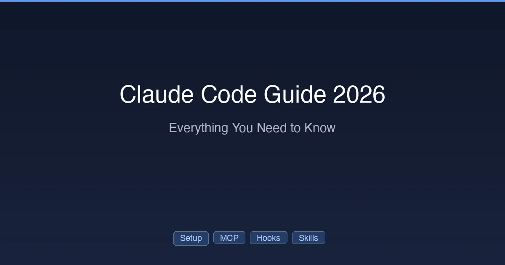

+++
date = '2026-02-28T10:00:00+08:00'
draft = false
title = 'Claude Code Guide 2026: Everything You Need to Know'
description = 'The complete Claude Code guide for 2026. Installation, CLAUDE.md, MCP servers, Hooks, Skills, Worktree, Teams, pricing, and advanced workflows — all in one place.'
toc = true
tags = ['Claude Code', 'Guide', 'Tutorial', 'AI Coding Tools']
categories = ['AI Guides']
keywords = ['Claude Code guide', 'Claude Code tutorial', 'Claude Code 2026', 'how to use Claude Code', 'Claude Code complete guide', 'Claude Code for beginners', 'Claude Code advanced', 'Claude Code features']
+++



[Claude Code](https://github.com/anthropics/claude-code) is Anthropic's terminal-based AI coding agent. Unlike IDE extensions that suggest code snippets, Claude Code operates as an **autonomous agent** — it reads your codebase, plans multi-step changes, writes code, runs tests, and iterates until the task is done.

Since its launch, Claude Code has become the go-to tool for developers who want more than autocomplete. It can refactor entire modules, set up CI/CD pipelines, debug complex issues across files, and even manage git workflows — all from your terminal.

This guide is the **hub page for everything Claude Code**. Whether you're installing it for the first time or optimizing an advanced multi-agent workflow, you'll find the right resource below.

## What Makes Claude Code Different

Before diving into features, it's worth understanding why Claude Code exists alongside tools like Cursor, Copilot, and Codex CLI.

**Traditional AI coding tools** work like smart autocomplete — they see your current file, suggest the next few lines, and wait for you to accept. They're reactive.

**Claude Code** is proactive. Give it a task like "add user authentication with JWT tokens" and it will:

1. Read your existing codebase to understand the architecture
2. Plan the implementation across multiple files
3. Write the code (routes, middleware, tests, config)
4. Run your test suite to verify nothing broke
5. Fix any failures and iterate

This agentic approach means Claude Code can handle tasks that would take you hours of context-switching between files. The tradeoff: it uses more tokens and requires trust in the agent's decisions.

### Key Capabilities

| Capability | What It Does |
|-----------|-------------|
| **Multi-file editing** | Reads and modifies multiple files in a single task |
| **Shell execution** | Runs terminal commands (build, test, lint, deploy) |
| **Agentic loops** | Plans → executes → verifies → iterates automatically |
| **Git integration** | Commits, branches, creates PRs, resolves conflicts |
| **MCP integration** | Connects to external services (databases, APIs, Slack) |
| **Hooks** | Deterministic automation rules that override AI behavior |
| **Skills** | Reusable domain knowledge packages |
| **Worktree** | Parallel task execution via git worktrees |
| **Agent Teams** | Multi-agent collaboration with shared task lists |

## Getting Started

### Installation and Setup

The fastest path from zero to productive:

**[How to Install Claude Code: Complete Setup Guide (2026)](/posts/ai/2026-02-25-claude-code-setup-guide/)**

Covers:
- Installing via the native installer (recommended) or npm
- API key setup and authentication
- VS Code and JetBrains integration
- Model selection (Sonnet vs Opus — when to use which)
- Your first real project walkthrough

> **Time to first task**: About 10 minutes from install to running your first Claude Code command.

### Project Configuration with CLAUDE.md

The single most impactful thing you can do for Claude Code productivity:

**[CLAUDE.md Guide: Give AI Perfect Project Context Every Time](/posts/ai/2026-02-28-claude-code-claudemd-guide/)**

Covers:
- What CLAUDE.md is and why it matters
- The three-layer config system (global → project → directory)
- Templates for different project types
- Common mistakes that waste tokens
- Real-world CLAUDE.md examples

> **Pro tip**: A well-written CLAUDE.md reduces token usage by 20–30% because Claude Code doesn't need to rediscover your project structure every session.

### Avoiding Common Pitfalls

Save hours of frustration by learning from others' mistakes:

**[10 Claude Code Mistakes Beginners Make (And How to Fix Them)](/posts/ai/2026-02-25-claude-code-mistakes/)**

Covers the most common errors including:
- Skipping CLAUDE.md setup
- Using Opus for everything (expensive and often unnecessary)
- Writing vague prompts that cause wasted iterations
- Not using `/cost` to monitor token spending
- Ignoring agentic loop controls

## Core Features

### MCP Servers: Connecting to External Services

MCP (Model Context Protocol) lets Claude Code interact with databases, APIs, cloud services, and more:

**[Claude Code MCP Setup: Connect AI to Any External Service](/posts/ai/2026-02-28-claude-code-mcp-setup/)**

Covers:
- What MCP is and how it works
- Installing community MCP servers (GitHub, Slack, databases)
- Building your own MCP server in TypeScript
- Debugging MCP connections
- Security considerations

### Hooks: Deterministic Automation Rules

Hooks let you enforce rules that the AI must follow — formatting, file protection, command restrictions:

**[Claude Code Hooks Guide: 12 Automation Configs (2026)](/posts/ai/2026-02-28-claude-code-hooks-guide/)**

Covers:
- All lifecycle events (PreToolUse, PostToolUse, Notification, etc.)
- 12 ready-to-use hook configurations
- Auto-formatting on file save
- Protecting sensitive files from AI modification
- Blocking dangerous shell commands

### Skills: Reusable Domain Knowledge

Skills package your expertise into SKILL.md files that Claude Code can invoke on demand:

**[Claude Code Skills: Teach AI Your Custom Workflows](/posts/ai/2026-02-28-claude-code-skills-guide/)**

Covers:
- Creating Skills with SKILL.md files
- Triggering Skills via slash commands
- Top community Skills
- Building skill libraries for your team
- Skills vs Hooks — when to use which

### Worktree: Parallel Task Execution

Run multiple Claude Code sessions simultaneously without branch conflicts:

**[Claude Code Worktree: Run Multiple AI Tasks in Parallel](/posts/ai/2026-02-28-claude-code-worktree-guide/)**

Covers:
- Git worktree basics and how Claude Code uses them
- Running parallel tasks with `claude -w`
- Auto-cleanup of temporary worktrees
- Team workflows with worktree mode
- When parallel execution is worth the overhead

### Agent Teams: Multi-Agent Collaboration

Coordinate multiple Claude Code agents working on different parts of a task:

**[Claude Code for Teams: Multi-Agent Collaboration Patterns](/posts/ai/2026-02-28-claude-code-teams-guide/)**

Covers:
- Agent Teams architecture (lead + sub-agents)
- Shared task lists for coordination
- Parallel execution patterns
- Real-world multi-agent workflows
- When to use Teams vs single-agent with Worktree

## Pricing and Rate Limits

### Choosing the Right Plan

Understanding the full pricing landscape:

**[Claude Pricing 2026: Every Plan from Free to Max $200](/posts/ai/2026-02-25-claude-code-pricing/)**

Covers:
- All plans: Free, Pro ($20), Max 5x ($100), Max 20x ($200), Team, Enterprise
- API pay-per-token pricing with real-world cost estimates
- Competitor comparison (vs Copilot, Cursor, Codex CLI, Windsurf)
- Decision framework for choosing the right plan
- 7 tips to reduce costs

### Understanding Rate Limits

The definitive guide to how much you can actually use:

**[Claude Rate Limits 2026: Messages Per Plan Explained](/posts/ai/2026-02-28-claude-rate-limits/)**

Covers:
- Messages per 5-hour window for every plan
- The dual-layer limit system (5-hour + weekly caps)
- API tier limits (RPM, TPM)
- Strategies to avoid hitting limits
- What actually happens when you hit a limit

## Quick Decision Matrix

Not sure where to start? Use this matrix:

| Your Situation | Start Here |
|---------------|-----------|
| **Never used Claude Code** | [Setup Guide](/posts/ai/2026-02-25-claude-code-setup-guide/) → [Mistakes Guide](/posts/ai/2026-02-25-claude-code-mistakes/) |
| **Using it but hitting limits** | [Rate Limits](/posts/ai/2026-02-28-claude-rate-limits/) → [Pricing](/posts/ai/2026-02-25-claude-code-pricing/) |
| **Want more automation** | [Hooks](/posts/ai/2026-02-28-claude-code-hooks-guide/) → [Skills](/posts/ai/2026-02-28-claude-code-skills-guide/) |
| **Working on large projects** | [CLAUDE.md](/posts/ai/2026-02-28-claude-code-claudemd-guide/) → [MCP](/posts/ai/2026-02-28-claude-code-mcp-setup/) |
| **Need faster throughput** | [Worktree](/posts/ai/2026-02-28-claude-code-worktree-guide/) → [Teams](/posts/ai/2026-02-28-claude-code-teams-guide/) |
| **Evaluating vs competitors** | [Pricing](/posts/ai/2026-02-25-claude-code-pricing/) (includes Copilot, Cursor, Codex comparison) |

## Advanced Workflows

Once you've mastered the basics, here are some power-user patterns:

### The Full-Stack Agent Workflow

```
1. Set up CLAUDE.md with your project architecture
2. Configure MCP servers for your database and deployment
3. Add Hooks for auto-formatting and test execution
4. Create Skills for your domain-specific tasks
5. Use Worktree for parallel feature development
```

This setup turns Claude Code from a coding assistant into an **autonomous development partner** that understands your project, connects to your infrastructure, follows your coding standards, and works on multiple tasks simultaneously.

### The Team Scaling Pattern

```
1. Shared CLAUDE.md at project root (everyone uses same context)
2. Team-level Hooks in .claude/settings.json (consistent standards)
3. Shared Skills library (domain knowledge accessible to all agents)
4. Agent Teams for complex multi-component tasks
5. Individual Worktrees for isolated parallel work
```

### Cost Optimization Stack

```
1. Use Sonnet as default model (80% of tasks, 60% less tokens)
2. Write detailed CLAUDE.md (fewer rediscovery tokens)
3. Set up Hooks for auto-formatting (fewer correction rounds)
4. Use /cost monitoring in every session
5. Start fresh sessions for unrelated tasks
```

## What's Next for Claude Code

Claude Code is evolving rapidly. Key areas to watch:

- **Background agents** — long-running tasks that continue while you do other work
- **Enhanced MCP ecosystem** — more first-party integrations
- **Improved context management** — smarter handling of large codebases
- **Better multi-model support** — using different models for different subtasks

Stay updated by checking [Anthropic's changelog](https://docs.anthropic.com/en/docs/claude-code/changelog) and the [Claude Code GitHub repository](https://github.com/anthropics/claude-code).

---

*This guide is maintained and updated regularly. Last update: February 2026.*

## All Claude Code Articles

| Article | Type | Topic |
|---------|------|-------|
| [Setup Guide](/posts/ai/2026-02-25-claude-code-setup-guide/) | Setup | Installation and first project |
| [CLAUDE.md Guide](/posts/ai/2026-02-28-claude-code-claudemd-guide/) | Guide | Project configuration |
| [MCP Setup](/posts/ai/2026-02-28-claude-code-mcp-setup/) | Guide | External service integration |
| [Hooks Guide](/posts/ai/2026-02-28-claude-code-hooks-guide/) | Guide | Automation rules |
| [Skills Guide](/posts/ai/2026-02-28-claude-code-skills-guide/) | Guide | Custom workflows |
| [Worktree Guide](/posts/ai/2026-02-28-claude-code-worktree-guide/) | Guide | Parallel execution |
| [Teams Guide](/posts/ai/2026-02-28-claude-code-teams-guide/) | Guide | Multi-agent collaboration |
| [Pricing 2026](/posts/ai/2026-02-25-claude-code-pricing/) | Pricing | Plans and cost analysis |
| [Rate Limits](/posts/ai/2026-02-28-claude-rate-limits/) | Guide | Usage limits explained |
| [10 Mistakes](/posts/ai/2026-02-25-claude-code-mistakes/) | Tips | Common pitfalls |

## Related Reading

- [Claude Code Complete Guide: From Beginner to Power User](/posts/ai/2026-01-14-claude-code-guide/) — The original comprehensive guide with detailed walkthroughs
- [How to Install Claude Code 2026: Terminal + VS Code Setup in 10 Minutes](/posts/ai/2026-02-25-claude-code-setup-guide/) — Step-by-step installation guide
- [Claude Code vs Cursor vs Windsurf 2026: Speed, Cost & Control](/posts/ai/2026-02-18-claude-code-vs-cursor-vs-windsurf-2026/) — Compare Claude Code against other AI coding tools
- [Claude Code Slash Commands, Shortcuts & CLI Reference](/posts/ai/2026-03-05-claude-code-slash-commands/) — Quick reference for all commands and shortcuts
- [Claude Code February 2026 Updates](/posts/ai/2026-02-22-claude-code-february-updates/) — Latest feature additions including Worktree and Background Agents
