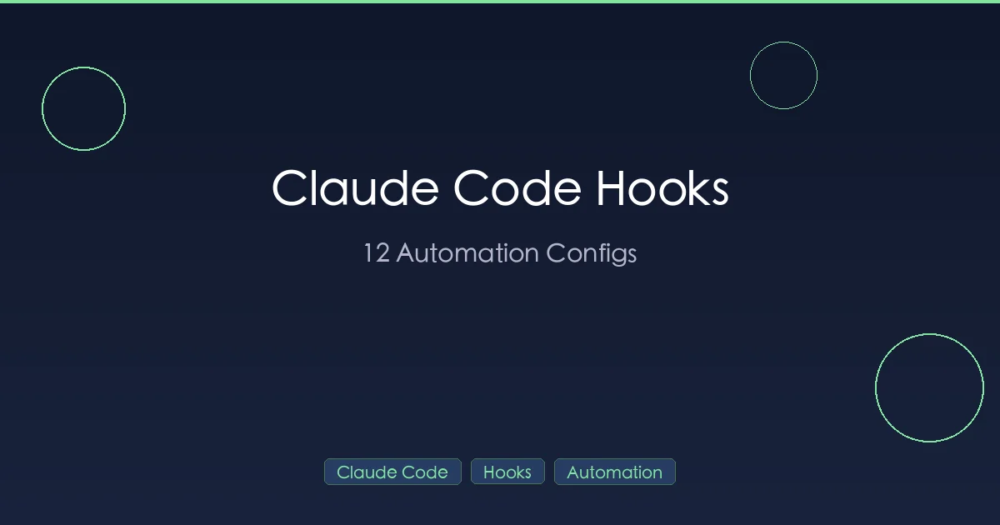

+++
date = '2026-02-26T10:00:00+08:00'
draft = false
title = 'Claude Code Hooks 2026：全部事件列表 + 12个即用配置'
description = 'Claude Code 所有 Hook 事件详解：PreToolUse、PostToolUse、PreCompact 等。附 12 个可直接复制的自动化配置，覆盖格式化、文件保护、命令拦截。'
toc = true
tags = ['Claude Code', 'Hooks', 'Automation', 'Configuration']
categories = ['AI Guides']
keywords = ['Claude Code Hooks', 'Claude Code 自动化', 'Claude Code 配置', 'PreToolUse', 'PostToolUse', 'Claude Code hooks 指南', 'Claude Code 自动格式化', 'Claude Code 钩子', 'Claude Code 生命周期事件']

[[params.faqItems]]
question = "Claude Code Hooks 是什么？"
answer = "Hooks 是 Claude Code 在特定生命周期事件触发时自动执行的 shell 命令或脚本——工具调用前、文件修改后、会话开启或结束时都可以挂钩子。它提供确定性的程序化控制，不依赖 prompt 工程，保证某些动作每次都会发生。"

[[params.faqItems]]
question = "Claude Code 支持哪些 Hook 事件？"
answer = "Claude Code 支持 9 个生命周期事件：PreToolUse、PostToolUse、Notification、Stop、SubagentStop、PreCompact、PostCompact、SessionStart、SessionEnd。日常最常用的是 PreToolUse（拦截危险操作）和 PostToolUse（自动格式化代码）。"

[[params.faqItems]]
question = "怎么用 Hooks 拦截危险命令（比如 rm -rf /）？"
answer = "用 PreToolUse hook 加 Bash matcher。脚本通过 stdin 读入 JSON 命令内容，如果匹配到危险模式（如 rm -rf /），向 stderr 打印错误信息并以 exit code 2 退出即可阻止执行。这是 Claude Code 唯一能在工具执行前阻断的机制。"

[[params.faqItems]]
question = "Hooks 配置文件放在哪里？"
answer = "Hooks 在 Claude Code 的 settings.json 中配置，支持三级作用域：项目级 `.claude/settings.json`（推荐，提交到 Git 可团队共享）、用户级 `~/.claude/settings.json`（对所有项目生效）、企业级（由组织管理）。项目级优先级最高。"

[[params.faqItems]]
question = "Hooks、Skills、MCP 有什么区别？"
answer = "Hooks 在生命周期事件自动执行，用于强制约束和自动化（如每次写文件后自动格式化）；Skills 是用户通过 slash 命令手动触发的可复用 prompt；MCP 是把外部服务和 API 接入 Claude。必须每次都发生的事情用 Hooks，可选的能力扩展用 Skills 或 MCP。"
+++



[Claude Code](https://github.com/anthropics/claude-code) 是概率性的。同样的提示词给它两次，会得到不同的结果。这对创意工作没问题——但你的工程工作流需要确定性的保障。

你需要文件在每次保存时自动格式化。你需要 `.env` 文件被锁定保护。你需要 `rm -rf /` 在到达你的终端之前就被拦截。你需要这些事情每一次都发生，而不是看 AI 心情。

这就是 Claude Code Hooks 的用途。它们是在 Claude 运行的特定节点执行的生命周期脚本——在工具运行前、在文件编辑后、在会话开始时、在 Claude 停止时。它们让你对工作流中不能靠运气的部分拥有程序化的控制。

本指南提供 12 个生产级 Hook 配置，你可以立即复制粘贴到项目中使用，同时也包含构建自定义 Hook 所需的技术细节。

## 什么是 Claude Code Hooks？

Hooks 是 Claude Code 在其生命周期特定节点执行的 shell 命令或脚本。它们定义在你的配置文件中，自动运行——无需手动干预，无需提示词，不用祈祷 AI 能记住你的偏好。

把它们想象成 Git hooks，但是给你的 AI 编码助手用的。

### 为什么用 Hooks 而不是提示词？

你可以告诉 Claude "编辑文件后总是运行 Prettier"。但是：

- Claude 可能会忘记
- Claude 可能觉得这次没必要
- Claude 无法在自己的操作执行前拦截它们
- 你无法通过自然语言强制执行安全策略

Hooks 解决了所有这些问题。它们是确定性的，每次都会运行，而且可以在操作执行前拦截它们。

## 核心概念

### 3 种 Hook 类型

每个 Hook 都有一个 `type` 字段来决定它的行为：

| 类型 | 作用 | 使用场景 |
|------|------|----------|
| `command` | 运行 shell 命令 | 自动格式化、日志记录、通知、文件操作 |
| `prompt` | 向 Claude 的对话中注入文本 | 重新注入上下文、添加提醒、引导行为 |
| `agent` | 生成子代理（一个独立的 Claude 实例） | 复杂验证、运行测试套件、多步骤检查 |

`command` 类型是最常用的。`prompt` 类型适合上下文注入。`agent` 类型功能强大但开销较高（会使用额外的 token）。

### 15 个生命周期事件

Hooks 可以绑定到以下事件：

| 事件 | 触发时机 | 常见用途 |
|------|----------|----------|
| `PreToolUse` | Claude 运行任何工具之前 | 拦截危险命令、保护文件、自动放行安全操作 |
| `PostToolUse` | Claude 运行任何工具之后 | 自动格式化代码、git 暂存、日志记录 |
| `Notification` | Claude 需要用户注意时 | 桌面通知、Slack 消息、提示音 |
| `Stop` | Claude 完成回复时 | 运行测试、验证完成状态、质量检查 |
| `SubagentStop` | 子代理完成时 | 验证子代理输出 |
| `PreCompact` | 上下文压缩前 | 保存重要上下文 |
| `PostCompact` | 上下文压缩后 | 重新注入丢失的上下文 |
| `SessionStart` | 新会话开始时 | 加载项目上下文、设置环境 |
| `SessionEnd` | 会话结束时 | 清理、保存状态 |

日常自动化最常用的事件是 `PreToolUse`、`PostToolUse`、`Notification` 和 `Stop`。

### 配置文件位置

Hooks 存放在你的 Claude Code 配置文件中。有三个作用域：

| 作用域 | 文件路径 | 适用范围 |
|--------|----------|----------|
| **项目级** | `.claude/settings.json`（在你的仓库中） | 仅限本项目——提交到 Git 可与团队共享 |
| **用户级** | `~/.claude/settings.json` | 你的所有项目 |
| **企业级** | 由你的组织管理 | 组织内所有用户 |

项目级 Hooks 是最常用的。把它们放在 `.claude/settings.json` 中，这样你的整个团队都能获得相同的自动化配置。

## 你的第一个 Hook：桌面通知

让我们从简单的开始。这个 Hook 会在 Claude 需要你注意时发送桌面通知——非常适合长时间运行的任务，你可能切换到了其他窗口。

### macOS

```json
{
  "hooks": {
    "Notification": [
      {
        "type": "command",
        "command": "osascript -e 'display notification \"Claude needs your attention\" with title \"Claude Code\"'"
      }
    ]
  }
}
```

### Linux

```json
{
  "hooks": {
    "Notification": [
      {
        "type": "command",
        "command": "notify-send 'Claude Code' 'Claude needs your attention'"
      }
    ]
  }
}
```

把这个保存到 `~/.claude/settings.json`（用户级，这样在所有项目中都能生效）。下次 Claude 暂停等待输入时，你就会收到系统通知。

## 配置结构详解

每个 Hook 条目包含以下字段：

```json
{
  "hooks": {
    "EventName": [
      {
        "type": "command",
        "command": "your-shell-command",
        "matcher": "regex-pattern",
        "timeout": 30000
      }
    ]
  }
}
```

| 字段 | 是否必填 | 默认值 | 说明 |
|------|----------|--------|------|
| `type` | 是 | — | `"command"`、`"prompt"` 或 `"agent"` |
| `command` | 是（`command` 类型） | — | 要执行的 shell 命令 |
| `matcher` | 否 | 匹配所有 | 用于过滤触发此 Hook 的工具的正则表达式 |
| `timeout` | 否 | 60000 毫秒 | 最大执行时间（毫秒），超时后 Hook 将被终止 |

### Matcher 规则

`matcher` 字段使用**正则表达式**，且**区分大小写**。这是新手最容易踩坑的地方。

| Matcher 值 | 匹配对象 | 示例工具 |
|------------|----------|----------|
| `"Bash"` | 仅 Bash 工具 | Shell 命令 |
| `"Edit"` | 仅 Edit 工具 | 文件编辑 |
| `"Write"` | 仅 Write 工具 | 文件创建 |
| `"Edit\|Write"` | Edit 或 Write | 任何文件修改 |
| `"Bash\|Edit\|Write"` | Bash、Edit 或 Write | 最常见的操作 |
| `"mcp__.*"` | 所有 MCP 工具 | 任何 MCP 服务器工具 |
| `"mcp__github__.*"` | 仅 GitHub MCP 工具 | GitHub 相关操作 |
| 未指定 | 所有工具 | 一切 |

**重要提示**：工具名称区分大小写。`"Bash"` 有效但 `"bash"` 无效。`"Edit"` 有效但 `"edit"` 无效。

### 输入/输出机制

Hooks 通过 **stdin** 接收 JSON 格式的上下文数据。具体结构取决于事件类型。对于 `PreToolUse` 和 `PostToolUse`，JSON 包含：

```json
{
  "session_id": "abc123",
  "tool_name": "Bash",
  "tool_input": {
    "command": "rm -rf /tmp/old-files"
  }
}
```

对于 `PostToolUse`，还包含 `tool_output` 字段，包含工具的执行结果。

使用 `jq` 来解析特定字段：

```bash
# 从 Edit 操作中提取文件路径
jq -r '.tool_input.file_path'

# 提取 bash 命令
jq -r '.tool_input.command'
```

### 退出码

对于 `PreToolUse` Hooks，退出码控制后续行为：

| 退出码 | 效果 |
|--------|------|
| `0` | 允许操作继续执行 |
| `2` | **拦截**操作——stderr 的内容会作为反馈发送给 Claude |
| 其他 | Hook 错误——操作继续执行，错误被记录 |

对于 `PostToolUse` Hooks，退出码不会拦截任何操作（操作已经执行完毕），但 stderr 输出仍然会发送给 Claude。

### 结构化 JSON 输出

对于 `PreToolUse` Hooks，你可以向 stdout 返回结构化 JSON 来实现更精细的控制：

```json
{
  "permissionDecision": "allow"
}
```

`permissionDecision` 的有效值：
- `"allow"` — 跳过权限提示，自动批准
- `"deny"` — 拦截操作（等同于退出码 2）
- `"ask"` — 向用户显示正常的权限提示

这在自动放行安全操作的同时对危险操作保持提示特别有用。

## 12 个即用配置

以下是 12 个经过生产环境验证的 Hook 配置。每个都是完整的、可直接复制粘贴的 JSON 片段，你可以直接放入 `.claude/settings.json`。

### #1：使用 Prettier 自动格式化（PostToolUse）

在 Claude 编辑或创建任何文件后自动运行 Prettier。不再需要"能帮我格式化一下吗？"的追问。

```json
{
  "hooks": {
    "PostToolUse": [
      {
        "type": "command",
        "matcher": "Edit|Write",
        "command": "FILE=$(cat | jq -r '.tool_input.file_path // empty') && [ -n \"$FILE\" ] && npx prettier --write \"$FILE\" 2>/dev/null || true"
      }
    ]
  }
}
```

**工作原理**：每次 `Edit` 或 `Write` 操作后，Hook 从 stdin 中提取文件路径，然后对该文件运行 Prettier。`2>/dev/null || true` 确保 Hook 不会在 Prettier 不支持的文件（如图片或二进制文件）上失败。

**前置条件**：项目中已安装 Prettier（`npm install --save-dev prettier`）。

### #2：使用 ESLint 自动格式化（PostToolUse）

如果你使用 ESLint 的自动修复功能来替代（或配合）Prettier：

```json
{
  "hooks": {
    "PostToolUse": [
      {
        "type": "command",
        "matcher": "Edit|Write",
        "command": "FILE=$(cat | jq -r '.tool_input.file_path // empty') && [ -n \"$FILE\" ] && [[ \"$FILE\" =~ \\.(js|ts|jsx|tsx)$ ]] && npx eslint --fix \"$FILE\" 2>/dev/null || true"
      }
    ]
  }
}
```

**工作原理**：与 Prettier 相同，但只对 JavaScript/TypeScript 文件（`.js`、`.ts`、`.jsx`、`.tsx`）触发。正则检查防止 ESLint 在它无法处理的文件上运行。

**前置条件**：项目中已配置 ESLint。

### #3：保护敏感文件（PreToolUse）

阻止 Claude 编辑 `.env` 文件、锁文件和其他不应被 AI 修改的文件：

```json
{
  "hooks": {
    "PreToolUse": [
      {
        "type": "command",
        "matcher": "Edit|Write",
        "command": "FILE=$(cat | jq -r '.tool_input.file_path // empty') && if echo \"$FILE\" | grep -qE '(\\.env|\\.lock|secrets\\.yaml|credentials|id_rsa|\\.pem)'; then echo \"BLOCKED: Cannot modify protected file: $FILE\" >&2; exit 2; fi"
      }
    ]
  }
}
```

**工作原理**：在任何 `Edit` 或 `Write` 操作之前，Hook 会将目标文件路径与敏感文件模式列表进行匹配。如果匹配成功，它会以退出码 2（拦截）退出，并通过 stderr 向 Claude 发送错误消息。Claude 会看到这条消息并理解操作被拦截的原因。

**保护模式**：`.env`、`.lock`、`secrets.yaml`、`credentials`、`id_rsa`、`.pem`。可根据你项目的敏感文件自定义 grep 模式。

### #4：拦截危险 Shell 命令（PreToolUse）

防止 Claude 运行破坏性命令，即使它不小心生成了这些命令：

```json
{
  "hooks": {
    "PreToolUse": [
      {
        "type": "command",
        "matcher": "Bash",
        "command": "CMD=$(cat | jq -r '.tool_input.command // empty') && if echo \"$CMD\" | grep -qEi '(rm\\s+-rf\\s+/|DROP\\s+TABLE|DROP\\s+DATABASE|mkfs\\.|:\\(\\)\\{|chmod\\s+-R\\s+777\\s+/|dd\\s+if=.*of=/dev/)'; then echo \"BLOCKED: Dangerous command detected: $CMD\" >&2; exit 2; fi"
      }
    ]
  }
}
```

**被拦截的命令**：
- `rm -rf /` — 从根目录递归删除
- `DROP TABLE` / `DROP DATABASE` — SQL 破坏性操作
- `mkfs.` — 格式化文件系统
- `:(){ :|:& };:` — fork 炸弹
- `chmod -R 777 /` — 对根目录递归修改权限
- `dd if=... of=/dev/` — 原始磁盘写入

**工作原理**：Hook 检查 Claude 想要运行的命令。如果匹配到任何危险模式（不区分大小写），操作会在到达你的 shell 之前被拦截。

### #5：Git 自动暂存（PostToolUse）

自动对 Claude 修改的任何文件执行 `git add`，让变更始终处于暂存状态，随时可以提交：

```json
{
  "hooks": {
    "PostToolUse": [
      {
        "type": "command",
        "matcher": "Edit|Write",
        "command": "FILE=$(cat | jq -r '.tool_input.file_path // empty') && [ -n \"$FILE\" ] && [ -f \"$FILE\" ] && git add \"$FILE\" 2>/dev/null || true"
      }
    ]
  }
}
```

**工作原理**：每次文件编辑或创建后，Hook 会用 `git add` 暂存该文件。`[ -f \"$FILE\" ]` 检查确保我们不会尝试暂存已删除的文件。搭配良好的 `.gitignore` 来防止暂存不需要的文件。

**使用场景**：希望每个 AI 变更都立即暂存的项目。与 `git diff --cached` 搭配使用，在提交前审查变更特别有用。

### #6：记录所有 Bash 命令（PostToolUse）

保留 Claude 运行的每个 shell 命令的日志——用于审计、调试和了解 Claude 在会话中做了什么：

```json
{
  "hooks": {
    "PostToolUse": [
      {
        "type": "command",
        "matcher": "Bash",
        "command": "cat | jq -r '\"[\" + (now | strftime(\"%Y-%m-%d %H:%M:%S\")) + \"] \" + .tool_input.command' >> \"${CLAUDE_PROJECT_DIR:-.}/.claude/command_log.txt\""
      }
    ]
  }
}
```

**工作原理**：每次 Bash 命令执行后，Hook 会将一条带时间戳的记录追加到项目目录中的 `.claude/command_log.txt`。使用 `$CLAUDE_PROJECT_DIR` 环境变量（由 Claude Code 自动设置）来定位项目根目录。

**输出示例**：
```
[2026-02-28 14:32:15] npm test
[2026-02-28 14:32:48] git status
[2026-02-28 14:33:02] cat src/index.ts
```

**提示**：将 `.claude/command_log.txt` 添加到你的 `.gitignore` 中。

### #7：压缩后重新注入上下文（PostCompact）

当 Claude 压缩其上下文窗口时，可能会丢失重要的项目细节。这个 Hook 会自动重新注入关键上下文：

```json
{
  "hooks": {
    "PostCompact": [
      {
        "type": "prompt",
        "command": "IMPORTANT CONTEXT (re-injected after compaction):\n- We are working on the payments microservice\n- Database is PostgreSQL 16 with pgvector extension\n- All API endpoints must return JSON:API format\n- Test files go in __tests__/ next to source files\n- Never use console.log — use the Winston logger"
      }
    ]
  }
}
```

**工作原理**：`prompt` 类型的 Hook 会在上下文压缩后直接将文本注入到 Claude 的对话中。这确保了关键的项目规则能在压缩过程中保留。

**替代方案——从文件加载**：

```json
{
  "hooks": {
    "PostCompact": [
      {
        "type": "command",
        "command": "cat \"${CLAUDE_PROJECT_DIR}/.claude/compaction-context.md\""
      }
    ]
  }
}
```

使用 `command` 类型时，stdout 的内容会作为上下文发送给 Claude。创建一个 `.claude/compaction-context.md` 文件，写入你的关键项目细节。

### #8：Stop Hook——验证任务完成度（Stop）

使用 `prompt` 类型的 Stop Hook 让 Claude 在结束前自检工作：

```json
{
  "hooks": {
    "Stop": [
      {
        "type": "prompt",
        "command": "Before finishing, verify:\n1. Did you run the tests? If not, run them now.\n2. Did you update the relevant documentation?\n3. Are there any TODO comments left in the code?\nIf any check fails, continue working. Only stop when all checks pass.\nIMPORTANT: If stop_hook_active is true in your context, do NOT trigger this check again — just finish."
      }
    ]
  }
}
```

**工作原理**：当 Claude 决定停止时，这个 prompt Hook 会注入一份检查清单。Claude 读取后要么继续工作（如果检查未通过），要么确认完成。`stop_hook_active` 防护措施防止无限循环——没有它，Claude 在完成检查清单后会再次触发 Stop Hook，形成无尽循环。

**注意**：这个 Hook 会让 Claude 在每个任务上做更多工作（消耗更多 token）。在彻底性比速度更重要的项目中选择性使用。

### #9：Agent Hook——自动运行测试（Stop）

使用 `agent` 类型的 Stop Hook 生成一个子代理来运行你的测试套件：

```json
{
  "hooks": {
    "Stop": [
      {
        "type": "agent",
        "command": "Run the project's test suite with 'npm test'. If any tests fail, report which tests failed and suggest fixes. Do not modify any files — only report results."
      }
    ]
  }
}
```

**工作原理**：当 Claude 完成一个任务时，一个独立的 Claude 实例（子代理）运行 `npm test` 并报告结果。子代理可以访问所有相同的工具，但独立运行。

**成本提醒**：Agent Hook 会生成一个新的 Claude 实例，这会使用额外的 token。对于典型的测试运行，预计额外消耗 2,000–5,000 个输入 token，加上子代理生成的输出。在关键工作流中使用，而非每次小修改都用。

### #10：自动放行只读操作（PreToolUse）

对安全的只读操作跳过权限提示，同时对写操作保持提示：

```json
{
  "hooks": {
    "PreToolUse": [
      {
        "type": "command",
        "matcher": "Bash",
        "command": "CMD=$(cat | jq -r '.tool_input.command // empty') && if echo \"$CMD\" | grep -qE '^(ls|cat|head|tail|wc|find|grep|rg|git\\s+(status|log|diff|show|branch)|echo|pwd|which|file|stat|du|df)\\b'; then echo '{\"permissionDecision\": \"allow\"}'; fi"
      }
    ]
  }
}
```

**工作原理**：Hook 检查命令是否以已知的安全命令开头（`ls`、`cat`、`grep`、`git status` 等）。如果是，Hook 输出一个包含 `permissionDecision: "allow"` 的 JSON 对象，告诉 Claude Code 跳过权限提示。对于其他任何命令，Hook 不产生输出并正常退出，回退到默认的权限行为。

**自动放行的命令**：`ls`、`cat`、`head`、`tail`、`wc`、`find`、`grep`、`rg`、`git status/log/diff/show/branch`、`echo`、`pwd`、`which`、`file`、`stat`、`du`、`df`。

**安全提示**：这是一个便利性 Hook。请审查列表并移除你认为在你的环境中可能存在风险的命令。

### #11：替换低效命令（PreToolUse）

Claude 有时会使用缓慢或低效的命令。这个 Hook 会建议更好的替代方案：

```json
{
  "hooks": {
    "PreToolUse": [
      {
        "type": "command",
        "matcher": "Bash",
        "command": "CMD=$(cat | jq -r '.tool_input.command // empty') && if echo \"$CMD\" | grep -qE 'find .* -name.*\\|.*grep'; then echo 'SUGGESTION: Use fd or find with -path instead of piping to grep. Example: fd --type f \"pattern\" or find . -path \"*pattern*\"' >&2; exit 2; elif echo \"$CMD\" | grep -qE 'cat .* \\| head'; then echo 'SUGGESTION: Use head -n N file directly instead of cat | head. This avoids an unnecessary pipe.' >&2; exit 2; fi"
      }
    ]
  }
}
```

**工作原理**：Hook 检测常见的反模式，如 `find ... | grep` 和 `cat file | head`，拦截它们，并通过 stderr 向 Claude 发送更高效替代方案的建议。Claude 随后会用更好的命令重试。

**捕获的模式**：
- `find ... | grep` → 建议使用 `fd` 或 `find -path`
- `cat file | head` → 建议直接使用 `head file`

你可以根据自己的工作流扩展更多模式。

### #12：Slack 通知（Notification）

当 Claude 需要你注意时发送 Slack 消息。非常适合长时间运行的任务：

```json
{
  "hooks": {
    "Notification": [
      {
        "type": "command",
        "command": "TITLE=$(cat | jq -r '.title // \"Claude Code\"') && MSG=$(cat | jq -r '.message // \"Needs attention\"') && curl -s -X POST \"$SLACK_WEBHOOK_URL\" -H 'Content-Type: application/json' -d \"{\\\"text\\\": \\\"*${TITLE}*: ${MSG}\\\"}\""
      }
    ]
  }
}
```

**前置条件**：
1. 在 [api.slack.com/messaging/webhooks](https://api.slack.com/messaging/webhooks) 创建一个 Slack Incoming Webhook
2. 设置环境变量：`export SLACK_WEBHOOK_URL="https://hooks.slack.com/services/YOUR/WEBHOOK/URL"`

**工作原理**：当 Claude 触发通知事件时，Hook 从 stdin 提取标题和消息，然后通过 webhook 发送到你的 Slack 频道。你会看到类似这样的消息：**Claude Code**: 任务完成，等待审查。

**替代方案——直接管道传递 stdin**：

```json
{
  "hooks": {
    "Notification": [
      {
        "type": "command",
        "command": "MSG=$(cat | jq -r '.message // \"Needs attention\"') && curl -s -X POST \"$SLACK_WEBHOOK_URL\" -H 'Content-Type: application/json' -d \"{\\\"text\\\": \\\"Claude Code: ${MSG}\\\"}\""
      }
    ]
  }
}
```

## 组合配置：完整的项目设置

这是一个真实的 `.claude/settings.json`，将多个 Hook 组合成一个生产级配置：

```json
{
  "hooks": {
    "PreToolUse": [
      {
        "type": "command",
        "matcher": "Edit|Write",
        "command": "FILE=$(cat | jq -r '.tool_input.file_path // empty') && if echo \"$FILE\" | grep -qE '(\\.env|\\.lock|secrets\\.yaml|credentials)'; then echo \"BLOCKED: Cannot modify protected file: $FILE\" >&2; exit 2; fi"
      },
      {
        "type": "command",
        "matcher": "Bash",
        "command": "CMD=$(cat | jq -r '.tool_input.command // empty') && if echo \"$CMD\" | grep -qEi '(rm\\s+-rf\\s+/|DROP\\s+TABLE|DROP\\s+DATABASE)'; then echo \"BLOCKED: Dangerous command detected\" >&2; exit 2; fi"
      },
      {
        "type": "command",
        "matcher": "Bash",
        "command": "CMD=$(cat | jq -r '.tool_input.command // empty') && if echo \"$CMD\" | grep -qE '^(ls|cat|head|tail|wc|grep|rg|git\\s+(status|log|diff|show)|pwd|which)\\b'; then echo '{\"permissionDecision\": \"allow\"}'; fi"
      }
    ],
    "PostToolUse": [
      {
        "type": "command",
        "matcher": "Edit|Write",
        "command": "FILE=$(cat | jq -r '.tool_input.file_path // empty') && [ -n \"$FILE\" ] && npx prettier --write \"$FILE\" 2>/dev/null; git add \"$FILE\" 2>/dev/null || true"
      },
      {
        "type": "command",
        "matcher": "Bash",
        "command": "cat | jq -r '\"[\" + (now | strftime(\"%Y-%m-%d %H:%M:%S\")) + \"] \" + .tool_input.command' >> \"${CLAUDE_PROJECT_DIR:-.}/.claude/command_log.txt\""
      }
    ],
    "Notification": [
      {
        "type": "command",
        "command": "osascript -e 'display notification \"Claude needs your attention\" with title \"Claude Code\"'"
      }
    ],
    "PostCompact": [
      {
        "type": "command",
        "command": "cat \"${CLAUDE_PROJECT_DIR}/.claude/compaction-context.md\" 2>/dev/null || true"
      }
    ]
  }
}
```

这个配置实现了：
1. **拦截**对敏感文件的修改（`.env`、锁文件、密钥文件）
2. **拦截**危险的 shell 命令（`rm -rf /`、`DROP TABLE`）
3. **自动放行**安全的只读命令，无需权限提示
4. **自动格式化**编辑过的文件（使用 Prettier）
5. **自动暂存**编辑过的文件（使用 `git add`）
6. **记录**所有 Bash 命令及时间戳
7. **发送**macOS 桌面通知
8. **重新注入**压缩后的上下文

**顺序很重要**：`PreToolUse` Hooks 按数组顺序运行。文件保护 Hook 在自动放行 Hook 之前运行，确保受保护的文件始终被拦截，即使命令本身会被自动放行。

## 进阶技巧

### 复杂逻辑使用脚本文件

内联命令很快就会变得难以阅读。对于超出一行的逻辑，使用脚本文件：

```json
{
  "hooks": {
    "PreToolUse": [
      {
        "type": "command",
        "matcher": "Bash",
        "command": "bash ${CLAUDE_PROJECT_DIR}/.claude/hooks/check-command.sh"
      }
    ]
  }
}
```

然后创建 `.claude/hooks/check-command.sh`：

```bash
#!/bin/bash
# 读取 stdin 并存储
INPUT=$(cat)

# 提取命令
CMD=$(echo "$INPUT" | jq -r '.tool_input.command // empty')

# 检查危险模式
DANGEROUS_PATTERNS=(
  'rm\s+-rf\s+/'
  'DROP\s+TABLE'
  'DROP\s+DATABASE'
  'mkfs\.'
  'chmod\s+-R\s+777\s+/'
)

for pattern in "${DANGEROUS_PATTERNS[@]}"; do
  if echo "$CMD" | grep -qEi "$pattern"; then
    echo "BLOCKED: Dangerous command matched pattern: $pattern" >&2
    echo "Command was: $CMD" >&2
    exit 2
  fi
done

# 如果没有匹配，放行
exit 0
```

别忘了添加执行权限：`chmod +x .claude/hooks/check-command.sh`

### 匹配 MCP 工具

如果你使用 MCP 服务器，可以用 matcher 来针对它们的工具：

```json
{
  "matcher": "mcp__github__create_issue"
}
```

命名模式是 `mcp__<服务器名>__<工具名>`。使用 `mcp__.*` 匹配所有 MCP 工具，或 `mcp__github__.*` 匹配特定服务器的所有工具。

这对于为 MCP 操作添加日志或审批工作流特别有用。更多 MCP 配置信息请参阅我们的 [Claude Code MCP 设置指南](/posts/ai/2026-02-28-claude-code-mcp-setup/)。

### 常见坑点

**1. Shell 配置文件污染**

Hooks 在非交互式 shell 中运行。如果你的 `~/.bashrc` 或 `~/.zshrc` 会输出内容（比如欢迎消息或 `echo` 语句），这些输出会混入 Hook 的 stdout，可能破坏 JSON 解析。保持你的 shell 配置文件干净，或在脚本文件中使用 `#!/bin/bash --norc`。

**2. Stop Hook 的无限循环**

一个告诉 Claude "继续工作"的 Stop Hook 会在 Claude 完成时触发另一个 Stop 事件，然后又触发 Hook，形成无限循环。务必在 Stop Hook 中检查 `stop_hook_active`：

```
If stop_hook_active is true in your context, do NOT trigger this check again.
```

**3. Matcher 的大小写敏感性**

`"Bash"` 有效。`"bash"` 无效。`"Edit"` 有效。`"edit"` 无效。Claude Code 中的工具名称是 PascalCase 格式。仔细检查你的 matcher。

**4. 忘记读取 stdin**

Hook 命令通过 stdin 接收 JSON。如果你的命令没有读取 stdin（通过 `cat` 或类似方式），数据就丢失了。始终将 stdin 管道传入你的处理流程：

```bash
# 错误——stdin 从未被读取
jq -r '.tool_input.command'

# 正确——cat 读取 stdin 并管道传给 jq
cat | jq -r '.tool_input.command'
```

**5. 超时终止**

Hooks 默认有 60 秒超时。如果你的 Hook 调用了可能较慢的外部 API（如 Slack），请增加超时时间：

```json
{
  "type": "command",
  "command": "your-slow-command",
  "timeout": 120000
}
```

**6. 缺少 jq**

所有解析 stdin 的 command Hook 都需要安装 `jq`。macOS 上：`brew install jq`。Ubuntu/Debian 上：`sudo apt install jq`。

## Hooks vs Skills vs MCP：何时用哪个

Claude Code 有三种扩展机制，它们服务于不同的目的：

| 特性 | Hooks | Skills（斜杠命令） | MCP 服务器 |
|------|-------|---------------------|-----------|
| **作用** | 在生命周期事件时运行代码 | 按需注入提示词/工作流 | 连接外部服务/API |
| **运行时机** | 自动，每次都运行 | 手动，用户调用 `/command` 时 | Claude 决定使用工具时 |
| **控制流** | 可以拦截操作（exit 2） | 不能拦截——仅起建议作用 | 不能拦截 Claude 的决策 |
| **Token 成本** | 零（command 类型）或低 | 取决于提示词长度 | 取决于 API 响应 |
| **最适合** | 强制执行、自动化、日志记录 | 可复用的工作流、模板 | 外部数据、API、数据库 |
| **示例** | 保存时自动格式化 | `/deploy` 斜杠命令 | GitHub Issue 创建 |
| **设置方式** | settings.json 中的 JSON | `.claude/skills/` 中的 Markdown 文件 | settings.json 中的服务器配置 |

**经验法则**：
- 当某事必须自动且可靠地发生时使用 **Hooks**（格式化、保护、日志记录）
- 当你想要人工按需触发的可复用提示词时使用 **Skills**。详见我们的 [Claude Code Skills 指南](/posts/ai/2026-02-28-claude-code-skills-guide/)。
- 当 Claude 需要与外部服务交互时使用 **MCP**。详见我们的 [MCP 设置指南](/posts/ai/2026-02-28-claude-code-mcp-setup/)。

## 开始使用

如果你是 Hook 新手，从这三个开始：

1. **桌面通知**（#12 或上面的 macOS/Linux 示例）——立即提升生活质量
2. **保护敏感文件**（#3）——你会庆幸自己设了这个安全网
3. **使用 Prettier 自动格式化**（#1）——消除最常见的追问请求

将它们添加到项目中的 `.claude/settings.json`，它们会立即对你的整个团队生效。

之后，根据工作流需要逐步添加更多 Hook。上面的组合配置示例是一个值得努力的目标。

## 相关阅读

- [Claude Code 安装指南](/posts/ai/2026-02-25-claude-code-setup-guide/) — 安装和初始配置
- [CLAUDE.md 指南](/posts/ai/2026-02-28-claude-code-claudemd-guide/) — 项目上下文和记忆配置
- [Claude Code Skills 指南](/posts/ai/2026-02-28-claude-code-skills-guide/) — 斜杠命令和可复用工作流
- [Claude Code MCP 设置](/posts/ai/2026-02-28-claude-code-mcp-setup/) — 外部服务集成
- [官方 Claude Code Hooks 文档](https://docs.anthropic.com/en/docs/claude-code/hooks) — Anthropic 的参考文档
