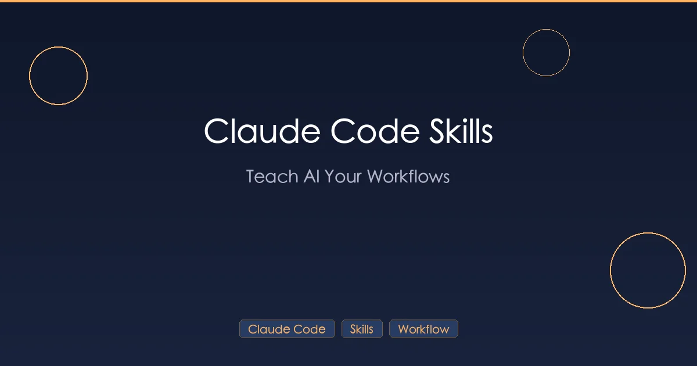

+++
date = '2026-02-28T10:00:00+08:00'
draft = false
title = 'Claude Code Skills 完全指南：用 SKILL.md 打造自定义工作流（附实战模板）'
description = '手把手教你创建 Claude Code Skills，包含 SKILL.md 编写方法、3 个即用模板、社区热门 Skills 推荐，以及 Skills 与 CLAUDE.md、Hooks 的协同使用技巧。'
toc = true
tags = ['Claude Code', 'Skills', 'Automation', 'Workflow']
categories = ['AI Guides']
keywords = ['Claude Code Skills', 'SKILL.md 教程', 'Claude Code 自定义技能', 'Claude Code 自动化', 'Claude Code 插件', 'AI 编程工作流', 'Claude Code 工作流']

[[params.faqItems]]
question = "Claude Code Skills 是什么？"
answer = "Skills 是以 SKILL.md 文件封装的可复用指令集，教会 Claude 按照你的方式执行特定任务。包含 YAML 前置数据（定义触发条件）和 Markdown 内容（具体执行指令）。创建后 Claude 会自动检测何时需要使用，无需手动触发。"

[[params.faqItems]]
question = "SKILL.md 文件怎么写？"
answer = "SKILL.md 由两部分组成：YAML 前置数据（在 --- 标记之间，定义 name、trigger 等元信息）和 Markdown 正文（Claude 执行时遵循的具体指令）。放到项目的 .claude/skills/ 目录下即可生效。"

[[params.faqItems]]
question = "Skills 和 CLAUDE.md 有什么区别？"
answer = "CLAUDE.md 提供全局项目上下文（编码规范、目录结构、工作流规则），每次会话都会加载。Skills 是按需触发的专项技能，只在特定场景下激活。两者互补——CLAUDE.md 定义'是什么'，Skills 定义'怎么做'。"

[[params.faqItems]]
question = "Skills 和 Hooks 怎么配合使用？"
answer = "Skills 处理 Claude 会话中的智能决策（如代码审查清单、写作规范），Hooks 处理会话外的自动化触发（如提交前检查、保存后格式化）。Skills 靠 AI 理解触发，Hooks 靠事件匹配触发，组合使用覆盖完整工作流。"

[[params.faqItems]]
question = "有哪些值得安装的社区 Skills？"
answer = "热门社区 Skills 包括：Superpowers（4 万星的工程方法论框架）、官方文档处理技能（docx/pdf/pptx/xlsx）、代码审查和提交自动化技能、前端设计和浏览器自动化技能。在 GitHub 搜索 'claude code skills' 可以发现更多。"
+++



Claude Code 是目前最强大的 AI 编程工具之一。但开箱即用时，它是通用的——不了解你团队的代码审查清单，不清楚你的 API 文档格式，也不知道你的 commit 信息规范。

每次从头解释同样的工作流，都是在浪费 token 和时间。

Claude Code Skills 就是为此而生的。Skill 是一组可复用的指令——以简单的 Markdown 文件封装——教会 Claude 如何按照你的方式执行特定任务。创建完成后，Claude 会自动检测何时需要使用某个 Skill，无需你手动干预。

本指南涵盖所有内容：什么是 Skills、如何创建、三个可直接复制使用的实战模板、不断壮大的 Skills 生态，以及 Skills 如何与 CLAUDE.md 和 Hooks 协同工作。

## 什么是 Claude Code Skills？

一个 Skill 就是一个包含 `SKILL.md` 文件的文件夹，由两部分组成：

1. **YAML 前置数据**（在 `---` 标记之间）——告诉 Claude 何时使用该 Skill
2. **Markdown 内容**——Claude 在触发 Skill 时遵循的具体指令

最简单的 Skill 长这样：

```yaml
---
name: daily-standup
description: Generate a daily standup summary from git activity
---

Summarize today's git commits into a standup format:
1. What I did yesterday
2. What I'm doing today
3. Any blockers
```

就这么简单。不需要写代码，不需要配置文件，不需要构建步骤。一个 Markdown 文件就能教会 Claude 一项新能力。

Skills 遵循 [Agent Skills](https://agentskills.io) 开放标准，这意味着它们可以跨多个 AI 工具使用——不仅限于 Claude Code。不过 Claude Code 扩展了该标准，增加了调用控制、子代理执行和动态上下文注入等功能。

### Skills 是如何被触发的

Claude Code 采用渐进式加载模式来管理 Skills：

1. **启动时**：仅加载前置数据（名称 + 描述）——每个 Skill 大约消耗 100 token
2. **对话过程中**：Claude 读取描述来判断哪些 Skills 与当前内容相关
3. **激活时**：当 Claude 判断需要某个 Skill 时，才加载其完整内容

这意味着你可以安装几十个 Skills 而不会撑爆上下文窗口。Claude 只在需要时才加载所需内容。

你也可以使用 Skill 名称作为斜杠命令来手动触发：

```
/daily-standup
```

两种方式都有效。Claude 可以从对话中自动判断相关性，你也可以在明确知道需求时直接调用。

## Skills 与 Slash Commands 的区别

如果你一直在用 Claude Code，可能已经熟悉自定义斜杠命令（`.claude/commands/` 中的文件）。以下是二者的对比：

| 特性 | Slash Commands（旧版） | Skills |
|------|----------------------|--------|
| 位置 | `.claude/commands/review.md` | `.claude/skills/review/SKILL.md` |
| 调用方式 | 手动（`/review`） | 自动触发 + 手动（`/review`） |
| 支持附属文件 | 否 | 是（模板、脚本、示例） |
| 前置数据 | 可选 | 支持（调用控制、工具、模型） |
| 状态 | 仍然可用 | 推荐使用 |

**核心区别**：Slash Commands 每次都需要你手动输入 `/command-name`。而 Skills 在 Claude 检测到相关对话上下文时可以自动触发——无需手动操作。

自定义斜杠命令仍然有效。`.claude/commands/review.md` 和 `.claude/skills/review/SKILL.md` 都会创建 `/review` 命令且行为一致。但 Skills 增加了可选功能：附属文件目录、调用控制的前置数据，以及自动触发。如果 Skill 和命令同名，Skill 优先。

> 如果从零开始，请使用 Skills。如果已有旧命令，它们会继续工作——方便时再迁移。

## 什么时候该用 Skills

Skills 在特定场景下效果最好。以下是使用它们的判断标准：

**适合用 Skills 的场景：**

- **重复性工作流** —— 代码审查、PR 创建、文档生成、部署清单。任何你每次都用同一方式完成的任务。
- **领域专业知识** —— 行业特定知识、公司规范、框架特定模式。Claude 默认不知道的内容。
- **固定输出格式** —— 站会报告、变更日志、API 文档、测试计划。输出结构很重要的任务。
- **团队规范** —— 编码约定、架构模式、命名规则。需要每个团队成员一致遵循的内容。

**不适合用 Skills 的场景：**

- **静态项目上下文** —— 使用 [CLAUDE.md](/posts/ai/2026-02-28-claude-code-claudemd-guide/) 代替。技术栈、项目结构和通用约定应放在 CLAUDE.md 中，而非 Skill 里。
- **必须执行的操作** —— 使用 [Hooks](/posts/ai/2026-02-28-claude-code-hooks-guide/) 代替。如果某个步骤必须始终运行（如编辑文件后自动 lint），Hook 可以保证执行。Skills 是建议性的——Claude 自行决定是否使用。
- **一次性任务** —— 直接在提示中描述即可。Skills 是为你会反复使用的模式设计的。

## 创建你的第一个 Skill

我们来一步步构建一个 Skill。创建一个执行团队代码审查清单的代码审查 Skill。

### 第 1 步：创建 Skill 目录

Skills 可以放在两个位置：

| 级别 | 路径 | 作用范围 |
|------|------|---------|
| 个人 | `~/.claude/skills/<skill-name>/SKILL.md` | 你的所有项目 |
| 项目 | `.claude/skills/<skill-name>/SKILL.md` | 仅限当前项目 |

创建适用于所有项目的代码审查 Skill：

```bash
mkdir -p ~/.claude/skills/code-review
```

创建项目专属 Skill：

```bash
mkdir -p .claude/skills/code-review
```

### 第 2 步：编写 SKILL.md

创建 `~/.claude/skills/code-review/SKILL.md`：

```yaml
---
name: code-review
description: Perform a thorough code review following the team checklist. Use when reviewing code changes, pull requests, or when the user asks for a code review.
---

# Code Review Checklist

When reviewing code, evaluate every item in this checklist and provide a structured report.

## Review Process

1. **Read the diff** — Understand what changed and why
2. **Check each category** — Go through every section below
3. **Rate severity** — Flag issues as Critical, Warning, or Suggestion
4. **Summarize** — Provide an overall assessment

## Checklist Categories

### Correctness
- Does the logic handle edge cases?
- Are error paths handled properly?
- Could any input cause unexpected behavior?

### Security
- Is user input validated and sanitized?
- Are there any SQL injection, XSS, or CSRF risks?
- Are secrets hardcoded anywhere?

### Performance
- Are there unnecessary database queries or API calls?
- Could any loop cause O(n^2) or worse performance?
- Are large datasets paginated?

### Maintainability
- Are functions and variables named clearly?
- Is the code DRY (Don't Repeat Yourself)?
- Would a new team member understand this code?

### Testing
- Are there tests for the new code?
- Do tests cover edge cases and error paths?
- Are tests deterministic (no flaky tests)?

## Output Format

Structure your review as:

### Summary
[One-paragraph overall assessment]

### Critical Issues
[Must fix before merging]

### Warnings
[Should fix, but not blocking]

### Suggestions
[Nice to have improvements]

### Approved?
[YES / NO / YES WITH CONDITIONS]
```

### 第 3 步：测试 Skill

打开 Claude Code，用两种方式测试：

**自动触发** —— 提出匹配描述的问题：

```
Review the changes in src/auth/login.ts
```

Claude 应该识别这是代码审查请求，并自动应用 Skill 中的清单。

**手动调用** —— 使用斜杠命令：

```
/code-review src/auth/login.ts
```

两种方式都应该生成遵循你清单格式的结构化审查。

### 第 4 步：持续迭代

第一个版本不会完美。观察 Claude 如何使用该 Skill，然后优化：

- 如果 Claude 遗漏了清单项目，让它们更明确
- 如果输出格式不太对，添加一个示例
- 如果 Skill 不该触发时触发了，缩小描述范围
- 如果该触发时没触发，扩大描述范围

## SKILL.md 详细解析

每个 `SKILL.md` 文件都有相同的结构：YAML 前置数据用于元信息，后接 Markdown 内容用于指令。

### 前置数据字段参考

```yaml
---
name: my-skill
description: What this skill does and when to use it
disable-model-invocation: true
user-invocable: true
allowed-tools: Read, Grep, Glob
argument-hint: [filename] [format]
model: opus
context: fork
agent: Explore
---
```

各字段说明：

| 字段 | 必需 | 说明 |
|------|------|------|
| `name` | 否 | 显示名称和斜杠命令。默认为目录名。小写、连字符、最多 64 字符。 |
| `description` | 推荐 | Skill 的功能描述。Claude 根据它判断何时加载。 |
| `disable-model-invocation` | 否 | 设为 `true` 可禁止自动触发。用户必须手动输入 `/name`。 |
| `user-invocable` | 否 | 设为 `false` 可从 `/` 菜单中隐藏。仅作为后台知识。 |
| `allowed-tools` | 否 | Skill 激活时 Claude 可无需确认使用的工具。 |
| `argument-hint` | 否 | 自动补全提示（如 `[issue-number]`）。 |
| `model` | 否 | Skill 激活时覆盖使用的模型。 |
| `context` | 否 | 设为 `fork` 可在子代理中运行。 |
| `agent` | 否 | 当 `context: fork` 时指定子代理类型。 |

### 内容结构

前置数据之后的 Markdown 内容完全自由，但高效的 Skills 通常包含这些部分：

1. **概述** —— Skill 的功能（1-2 句话）
2. **输入要求** —— Claude 需要用户提供什么
3. **分步指令** —— 实际的工作流
4. **输出格式** —— 如何组织结果
5. **约束条件** —— 需要避免的、边界情况、护栏

### 变量替换

Skills 支持内容中的动态变量：

| 变量 | 说明 |
|------|------|
| `$ARGUMENTS` | 调用时传递的所有参数 |
| `$ARGUMENTS[0]`、`$0` | 第一个参数 |
| `$ARGUMENTS[1]`、`$1` | 第二个参数 |
| `${CLAUDE_SESSION_ID}` | 当前会话 ID |

使用参数的示例：

```yaml
---
name: fix-issue
description: Fix a GitHub issue by number
disable-model-invocation: true
---

Fix GitHub issue #$ARGUMENTS following our coding standards:

1. Read the issue description with `gh issue view $0`
2. Understand the requirements
3. Implement the fix
4. Write tests
5. Create a commit referencing the issue
```

执行 `/fix-issue 423` 时，`$ARGUMENTS` 被替换为 `423`，`$0` 也替换为 `423`。

### 动态上下文注入

`` !`command` `` 语法可在 Skill 内容发送给 Claude 之前执行 shell 命令。命令输出会替换占位符：

```yaml
---
name: pr-summary
description: Summarize the current pull request
context: fork
agent: Explore
---

## Current PR Context
- PR diff: !`gh pr diff`
- PR comments: !`gh pr view --comments`
- Changed files: !`gh pr diff --name-only`

## Task
Provide a concise summary of this pull request highlighting:
1. What changed and why
2. Potential risks
3. Suggested reviewers
```

运行此 Skill 时，每个 `` !`command` `` 会立即执行。Claude 只看到包含实际 PR 数据的最终渲染内容。

## 三个实战 Skills（可直接复制使用）

以下三个生产级 Skills 可以立即投入使用。

### Skill 1：带清单的代码审查

已在上面的教程中详细介绍。快速参考文件路径：

```
~/.claude/skills/code-review/SKILL.md
```

### Skill 2：API 文档生成器

这个 Skill 从源代码生成统一格式的 API 文档。它读取 endpoint handler 并生成标准化文档。

创建 `~/.claude/skills/api-docs/SKILL.md`：

```yaml
---
name: api-docs
description: Generate API documentation from source code. Use when the user asks to document an API endpoint, route handler, or controller. Also triggers when creating or updating API reference documentation.
allowed-tools: Read, Grep, Glob
---

# API Documentation Generator

Generate comprehensive API documentation for the specified endpoint(s).

## Process

1. **Find the endpoint** — Locate the route handler, controller, or API function
2. **Analyze the code** — Read the implementation to understand:
   - HTTP method and path
   - Request parameters (path, query, body)
   - Authentication requirements
   - Response format and status codes
   - Error handling
3. **Check for existing docs** — Look for JSDoc, docstrings, or OpenAPI annotations
4. **Generate documentation** — Follow the output format below

## Output Format

For each endpoint, generate:

### `METHOD /path/to/endpoint`

**Description**: One-sentence description of what this endpoint does.

**Authentication**: Required / Optional / None

**Parameters**:

| Name | In | Type | Required | Description |
|------|-----|------|----------|-------------|
| id | path | string | Yes | Resource identifier |
| limit | query | integer | No | Max results (default: 20) |

**Request Body** (if applicable):

```json
{
  "field": "type — description"
}
```

**Response** `200 OK`:

```json
{
  "data": "example response"
}
```

**Error Responses**:

| Status | Description |
|--------|-------------|
| 400 | Invalid request parameters |
| 401 | Authentication required |
| 404 | Resource not found |

**Example**:

```bash
curl -X METHOD https://api.example.com/path \
  -H "Authorization: Bearer TOKEN" \
  -d '{"field": "value"}'
```

## Constraints

- Always include real field names and types from the source code
- Document all possible error responses, not just the happy path
- If authentication middleware is present, always note it
- Use the project's actual base URL if found in configuration
- Flag any undocumented endpoints as needing attention
```

### Skill 3：Git Commit 信息标准化工具

这个 Skill 根据你团队的规则强制执行 [Conventional Commits](https://www.conventionalcommits.org/) 格式。

创建 `~/.claude/skills/commit-msg/SKILL.md`：

```yaml
---
name: commit-msg
description: Generate a standardized git commit message following Conventional Commits format. Use when the user asks to commit, create a commit message, or after completing a task that should be committed.
disable-model-invocation: true
---

# Commit Message Generator

Generate a git commit message following our team's Conventional Commits standard.

## Process

1. Run `git diff --staged` to see what's being committed
2. If nothing is staged, run `git diff` and ask the user what to stage
3. Analyze the changes to determine the commit type and scope
4. Generate the commit message following the format below

## Commit Format

```
<type>(<scope>): <subject>

<body>

<footer>
```

### Type (required)

| Type | When to use |
|------|------------|
| `feat` | New feature for the user |
| `fix` | Bug fix |
| `docs` | Documentation only |
| `style` | Formatting, missing semicolons, no code change |
| `refactor` | Code change that neither fixes a bug nor adds a feature |
| `perf` | Performance improvement |
| `test` | Adding or correcting tests |
| `chore` | Build process, dependencies, CI changes |

### Scope (optional)

The module or component affected. Use the directory name or feature name:
- `auth`, `api`, `ui`, `db`, `config`, `ci`

### Subject (required)

- Imperative mood: "add feature" not "added feature"
- No period at the end
- Max 50 characters
- Lowercase first letter

### Body (optional, but recommended for non-trivial changes)

- Explain **what** and **why**, not how
- Wrap at 72 characters
- Separate from subject with a blank line

### Footer (when applicable)

- Breaking changes: `BREAKING CHANGE: description`
- Issue references: `Closes #123` or `Fixes #456`

## Examples

**Simple bug fix:**
```
fix(auth): prevent token refresh race condition
```

**Feature with body:**
```
feat(api): add pagination to user search endpoint

The /users/search endpoint now supports cursor-based pagination
with configurable page sizes. This replaces the previous offset-based
approach which had performance issues with large datasets.

Closes #234
```

**Breaking change:**
```
refactor(db): migrate from MongoDB to PostgreSQL

BREAKING CHANGE: All database queries now use SQL syntax.
The MongoDB query builders have been removed. See migration
guide in docs/migration-v3.md.
```

## Constraints

- Never generate a message without reading the actual diff first
- If the diff contains multiple unrelated changes, suggest splitting into separate commits
- Always ask the user before committing — show the proposed message first
- Include Co-Authored-By if pair programming or AI-assisted
```

## Skills 生态系统

Claude Code Skills 不仅是个人效率工具。一个蓬勃发展的社区 Skills 生态已经形成，成千上万的开发者在分享自己的工作流。

### 官方仓库

Anthropic 维护着 [anthropics/skills](https://github.com/anthropics/skills) 仓库，拥有 **78.9k+ stars**。包含生产级 Skills：

- **docx** —— Word 文档创建、编辑和修改追踪
- **pdf** —— PDF 提取（文本、表格、元数据、合并）
- **pptx** —— PowerPoint 生成与调整
- **xlsx** —— Excel 操作（公式、图表、数据转换）
- **web-artifacts-builder** —— 构建复杂的交互式 Web 组件
- **skill-creator** —— 交互式 Skill 创建向导（Claude 询问你的工作流，生成文件夹结构和 SKILL.md）

### 热门社区 Skills

社区 Skills 生态增长迅速。以下是最受欢迎的几个：

| Skill | Stars/热度 | 功能 |
|-------|-----------|------|
| **create-pr** | 170k+ | 自动创建 GitHub PR，包含格式化标题、描述和 CI 验证 |
| **skill-lookup** | 143k+ | 查找和安装 Skills——问"有哪些关于 X 的 Skills？" |
| **frontend-code-review** | 126k+ | 前端专用代码审查（tsx/ts/js 清单） |
| **component-refactoring** | 126k+ | React 组件重构，带安全检查 |
| **github-code-review** | 48k+ | 多代理协作代码审查 |

### Superpowers 框架

[Superpowers](https://github.com/obra/superpowers) 项目（**42k+ stars**，已进入 Anthropic 官方插件市场）是一个全面的 Skills 框架，实现了完整的软件开发方法论：

- **TDD Skill** —— 强制执行红-绿-重构循环，测试必须先失败再实现
- **Debugging Skill** —— 四阶段调试方法论，要求在修复前先找到根本原因
- **Brainstorming Skill** —— 苏格拉底式对话，在编码前细化需求
- **Code Review Skill** —— 结构化审查，子代理驱动的分析
- **Execute Plan Skill** —— 分批实现，带审查检查点

Superpowers 将 Claude Code 从代码生成器转变为更接近遵循规范实践的高级开发者。

### Awesome 合集

社区 Skills 精选目录：

- [travisvn/awesome-claude-skills](https://github.com/travisvn/awesome-claude-skills) —— 分类 Skills 列表和资源
- [hesreallyhim/awesome-claude-code](https://github.com/hesreallyhim/awesome-claude-code) —— Skills、Hooks、插件和 Agent 编排器

## 安装 Skills

有几种方式可以将 Skills 添加到你的 Claude Code 环境中。

### 插件市场（推荐）

安装精选 Skill 包的最简单方式：

```bash
# 浏览市场
/plugin marketplace add anthropics/skills

# 安装特定插件包
/plugin install document-skills@anthropic-agent-skills
/plugin install example-skills@anthropic-agent-skills
```

安装 Superpowers 框架：

```bash
/plugin marketplace add obra/superpowers
```

### 手动安装

从 GitHub 或其他来源安装单个 Skills，复制 Skill 文件夹到你的 skills 目录：

**个人级别**（所有项目可用）：

```bash
# 创建 skill 目录
mkdir -p ~/.claude/skills/my-new-skill

# 复制或创建 SKILL.md
cp downloaded-skill/SKILL.md ~/.claude/skills/my-new-skill/SKILL.md
```

**项目级别**（提交到版本控制，与团队共享）：

```bash
# 在项目中创建
mkdir -p .claude/skills/my-new-skill

# 复制 SKILL.md
cp downloaded-skill/SKILL.md .claude/skills/my-new-skill/SKILL.md

# 提交以与团队共享
git add .claude/skills/
git commit -m "feat: add code review skill for team"
```

### 项目级 vs 个人级：如何选择

| 场景 | 用项目级 | 用个人级 |
|------|---------|---------|
| 团队编码规范 | 是 | 否 |
| 个人效率快捷方式 | 否 | 是 |
| 项目专属文档格式 | 是 | 否 |
| 你偏好的 commit 信息风格 | 否 | 是 |
| 公司级 API 规范 | 是（或企业级） | 否 |
| 通用工具类 | 否 | 是 |

**经验法则**：如果队友需要这个 Skill，放到项目里。如果是你的个人偏好，放到 `~/.claude/skills/`。

### 优先级顺序

当不同级别的 Skills 同名时，优先级高的位置生效：

```
企业级 > 个人级 > 项目级
```

插件 Skills 使用 `plugin-name:skill-name` 命名空间，所以不会与其他级别冲突。

### Monorepo 支持

Claude Code 会自动发现嵌套目录中的 Skills。如果你正在编辑 `packages/frontend/` 中的文件，Claude 也会查找 `packages/frontend/.claude/skills/` 中的 Skills。这让 monorepo 中不同包可以拥有各自专属的 Skills。

## Skills + CLAUDE.md + Hooks：完整的配置体系

Claude Code 有三个相互补充的配置系统。理解它们如何协同工作，是获得最大价值的关键。

### CLAUDE.md：定义"你是谁"

[CLAUDE.md](/posts/ai/2026-02-28-claude-code-claudemd-guide/) 定义你项目的身份和规范。它在每次会话开始时都会被加载。

**适合存放**：
- 技术栈和架构
- 编码约定和风格规则
- 常用命令（`npm test`、`npm run lint`）
- 项目结构概览
- 通用规则（"生产环境禁止使用 console.log"）

### Skills：定义"怎么做"

Skills 为特定任务定义分步工作流。按需加载。

**适合用于**：
- 代码审查清单
- 文档生成
- Commit 信息格式化
- 部署流程
- 任何可复用的结构化工作流

### Hooks：保证"一定执行"

[Hooks](/posts/ai/2026-02-28-claude-code-hooks-guide/) 在特定生命周期节点运行 shell 命令。始终执行——不涉及 AI 判断。

**适合用于**：
- 编辑文件后自动 lint
- 修改后运行测试
- 保存时格式化代码
- 创建 commit 前验证
- 任何每次都必须发生的操作

### 三者如何协同工作

一个展示三个系统协同的实际例子：

**CLAUDE.md**（项目上下文）：
```markdown
## Project: E-commerce API
- Stack: Node.js 22 + Express + PostgreSQL
- Testing: Jest, files in __tests__/
- Style: ESLint + Prettier, functional style
- Never use console.log — use the logger utility
```

**Skill**（代码审查工作流）：
```yaml
---
name: review
description: Review code changes using our team checklist
---
Follow the team review checklist: correctness, security,
performance, maintainability, testing...
```

**Hook**（保证 lint 执行）：
```json
{
  "hooks": {
    "PostToolUse": [{
      "matcher": "Write|Edit",
      "command": "npx eslint --fix $FILE_PATH",
      "silent": true
    }]
  }
}
```

效果：CLAUDE.md 确保 Claude 理解你的项目。Skill 确保代码审查遵循你的清单。Hook 确保每次文件编辑都自动 lint——即使 Claude 忘记了。

| 系统 | 何时加载 | AI 决定？ | 保证执行？ |
|------|---------|----------|----------|
| CLAUDE.md | 每次会话 | 否（始终加载） | 是 |
| Skills | 按需 / 自动检测 | 是（可覆盖） | 否 |
| Hooks | 匹配工具事件时 | 否（始终运行） | 是 |

**核心洞察**：不要在 CLAUDE.md 中放工作流指令，也不要在 Skills 中放项目上下文。让每个系统专注于自己最擅长的事。

## 编写 Skills 的最佳实践

研究了数百个社区 Skills 并亲手构建了几十个之后，以下是有效的模式。

### 1. 保持 Skills 聚焦

**好的做法**：一个 Skill 只做代码审查。
**不好的做法**：一个 Skill 同时做代码审查、生成文档和格式化 commit 信息。

每个 Skill 做好一件事。如果需要多个工作流，创建多个 Skills。

### 2. 最佳长度：500-2000 词

不到 500 词的 Skills 往往太模糊——Claude 要猜太多。超过 2000 词的 Skills 浪费上下文 token，且通常包含冗余信息。

最佳范围：足够详细以消除歧义，但不至于在写小说。

如果 Skill 需要大量参考资料（API 规格、大型清单），使用**附属文件**：

```
my-skill/
├── SKILL.md           # 核心指令（500-1500 词）
├── reference.md       # 详细 API 文档（按需加载）
├── examples/
│   └── sample.md      # 示例输出
└── scripts/
    └── validate.sh    # 辅助脚本
```

在 SKILL.md 中引用：

```markdown
For complete API reference, see [reference.md](reference.md).
For example outputs, see [examples/sample.md](examples/sample.md).
```

Claude 仅在需要时加载附属文件，保持初始上下文精简。

### 3. 写好描述

`description` 字段是 Skill 中最重要的部分。Claude 根据它决定何时激活 Skill。像对同事解释何时使用这个工作流一样来写。

**差的描述**：
```yaml
description: Review code
```

**好的描述**：
```yaml
description: Perform a thorough code review following the team checklist. Use when reviewing code changes, pull requests, diffs, or when the user asks for a code review, feedback on code, or quality assessment.
```

包含用户自然会说的关键词。如果他们会说"review my PR"，确保描述中出现"PR"和"review"。

### 4. 明确定义输出格式

AI 生成内容的头号问题是不一致。Skills 通过精确定义输出格式来解决这个问题。

始终包含"输出格式"部分：
- 结构（标题、章节、列表）
- 必填字段
- 预期输出示例

### 5. 不要重复 CLAUDE.md 内容

CLAUDE.md 始终在上下文中。Skills 按需加载。如果在两者中放相同信息，Skill 激活时信息会加载两次，浪费 token。

**错误做法**：在每个 Skill 中重复你的技术栈。
**正确做法**：引用即可——"Follow the coding conventions defined in CLAUDE.md."

### 6. 对危险操作使用 `disable-model-invocation`

任何有副作用的 Skill——部署、发送消息、删除资源——应该设为仅手动触发：

```yaml
---
name: deploy
description: Deploy to production
disable-model-invocation: true
---
```

你不会希望 Claude 因为代码"看起来准备好了"就自动决定部署。

### 7. 用两种方式测试

始终用两种方式测试你的 Skill：
1. **自动触发**：提出应该匹配描述的问题
2. **手动调用**：直接输入 `/skill-name`

如果自动触发有效但手动不行（或反过来），说明有配置问题需要修复。

### 8. 复杂 Skills 使用附属文件

保持 `SKILL.md` 在 500 行以内。将详细参考资料、大型清单和示例集移到单独文件。这能保持主 Skill 聚焦并减少上下文消耗。

## 常见问题排查

### Skill 无法自动触发

1. **检查描述** —— 是否包含你提示中的关键词？
2. **验证发现** —— 问 Claude："What skills are available?"
3. **检查预算** —— 如果 Skills 太多，可能超出描述预算。运行 `/context` 检查警告。
4. **尝试手动调用** —— 输入 `/skill-name` 确认 Skill 能正确加载。

### Skill 触发过于频繁

1. **缩小描述范围** —— 更具体地说明何时使用
2. **添加 `disable-model-invocation: true`** —— 切换为仅手动触发

### Skill 描述显示为 ">-" 而非文本

Claude Code 的 Skill 索引器无法正确解析 YAML 多行指示符（`>-`、`|`、`|-`）。将描述写在一行内：

```yaml
# 错误 — 可能无法正确解析
description: >-
  This is a multi-line
  description

# 正确 — 始终有效
description: This is a single-line description that works correctly
```

### Skills 过多超出上下文预算

描述预算按上下文窗口的 2% 缩放（备用值：16,000 字符）。如果看到关于被排除 Skills 的警告：

- 删除不用的 Skills
- 缩短描述（保留关键词，去掉填充词）
- 设置 `SLASH_COMMAND_TOOL_CHAR_BUDGET` 环境变量覆盖限制

## 延伸阅读

- [Claude Code Setup Guide: Installation to First Project](/posts/ai/2026-02-25-claude-code-setup-guide/) — Claude Code 安装与配置
- [CLAUDE.md Guide: Give AI Perfect Project Context](/posts/ai/2026-02-28-claude-code-claudemd-guide/) — 掌握与 Skills 互补的项目上下文系统
- [Claude Code Hooks Guide](/posts/ai/2026-02-28-claude-code-hooks-guide/) — 用保证执行的 Hooks 自动化工作流
- [Claude Code MCP Setup](/posts/ai/2026-02-28-claude-code-mcp-setup/) — 用外部工具集成扩展 Claude
- [10 Claude Code Mistakes Beginners Make](/posts/ai/2026-02-25-claude-code-mistakes/) — 避免常见陷阱
- [Official Skills Documentation](https://code.claude.com/docs/en/skills) — Anthropic 官方参考文档
- [anthropics/skills Repository](https://github.com/anthropics/skills) — 官方 Skills 合集（78k+ stars）
- [Superpowers Framework](https://github.com/obra/superpowers) — 全面的开发方法论 Skills 框架（42k+ stars）
- [The Complete Guide to Building Skills for Claude (PDF)](https://resources.anthropic.com/hubfs/The-Complete-Guide-to-Building-Skill-for-Claude.pdf) — Anthropic 的 32 页深度指南
