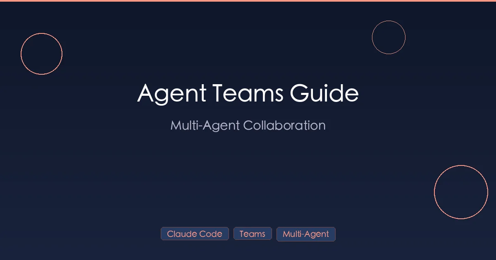

+++
date = '2026-02-27T10:00:00+08:00'
draft = false
title = 'Claude Code --teammate-mode 详解：让多个 Agent 真正协作起来'
description = 'Claude Code teammate-mode（tmux + in-process）多 Agent 协作实战：配置方法、worktree 隔离、共享任务、成本控制，附真实协作案例。'
toc = true
tags = ['Claude Code', 'Agent Teams', 'Multi-Agent', 'Collaboration']
categories = ['AI Guides']
keywords = ['Claude Code Agent Teams', '多智能体协作', 'Claude Code 团队模式', 'AI 多 Agent 并行', 'Claude Code 多 Agent 教程', 'Agent Teams 使用指南']

[[params.faqItems]]
question = "怎么启用 Claude Code Agent Teams？"
answer = "在启动 Claude Code 前设置环境变量 `CLAUDE_CODE_EXPERIMENTAL_AGENT_TEAMS=1`，或者在 `~/.claude/settings.json` 的 `env` 字段中加入。截至 2026 年 2 月，Agent Teams 仍是实验性功能，需要显式开启。"

[[params.faqItems]]
question = "Agent Teams 和 Subagents 有什么区别？"
answer = "Subagents 是单向的层级通信——父 agent 把独立任务委派给子 agent，彼此隔离。Agent Teams 支持 Team Lead 与 Teammate 之间的多向消息传递，可以横向协调。任务可以清晰拆分用 Subagents；任务有依赖、需要实时协调用 Agent Teams。"

[[params.faqItems]]
question = "Agent Teams 支持哪些显示模式？"
answer = "两种：in-process 模式（默认，任何终端都能用），所有 agent 共用一个窗口；split-pane 模式（需要 tmux 或 iTerm2），每个 Teammate 独占一个面板可以同时观察。开发体验上 split-pane 更直观，但 in-process 兼容性最好。"

[[params.faqItems]]
question = "Agent Teams 用起来成本高吗？"
answer = "比单 agent 贵。多个 Claude agent 同时运行，每个都独立消耗 token。成本和 teammate 数量、任务复杂度成正比，Opus 实例并行会特别烧钱。建议先用 Sonnet 或 Haiku 做 teammate，Opus 只做 Team Lead，并设 `max_turns` 限制防止失控。"

[[params.faqItems]]
question = "Teammate 之间可以直接通信吗？"
answer = "可以，通过 mailbox 消息机制横向通信。例如一个 agent 修改了 API 接口，可以直接发消息给正在写前端的 agent 通知变更，而不是等两边都做完才发现冲突。这是 Agent Teams 相比 Subagents 最核心的增强。"
+++



一个 Agent 很好用，一组协作的 Agent 才是质变。

自 Anthropic 在 2026 年 2 月 5 日随 Opus 4.6 模型一起发布 Agent Teams 以来，[Claude Code](https://docs.anthropic.com/en/docs/claude-code) 已跨越了一个根本性的门槛：你不再局限于让单个 Agent 依次处理代码库。现在你可以启动多个 Claude Agent，让它们相互通信、分工协作、并行执行——就像一个运转速度极快的小型工程团队。

本指南全面覆盖 Claude Code Agent Teams 的方方面面：架构原理、配置方法、实战协作模式、成本管理，以及与旧版 Subagent 和 Worktree 方案的对比。

## 什么是 Agent Teams？

Agent Teams 让你在单个会话中同时运行多个 Claude Code Agent。但这不是简单的"同时跑五个 Agent"，而是围绕结构化协调构建的架构。

### 架构：Team Lead + Teammates

创建 Agent Team 时，一个 Agent 充当 **Team Lead**（团队负责人），其他 Agent 是 **Teammates**（团队成员）。各部分配合方式如下：

- **Team Lead**：你直接交互的 Agent。它将你的需求拆解为任务、分配给 Teammates，并将他们的工作成果整合为最终结果。
- **Teammates**：独立的 Claude Code Agent，各自拥有独立的上下文窗口、工具访问权限和工作状态。它们可以读写文件、执行命令，能做普通 Claude Code 会话能做的任何事。
- **Shared Task List（共享任务列表）**：Team Lead 创建的结构化可视任务列表，Teammates 从中领取任务。你可以随时按 `Ctrl+T` 查看和修改。
- **Mailbox Messaging（邮箱消息系统）**：Teammates 通过内部消息传递系统互相通信，也可以与 Team Lead 通信。这是核心架构创新——Agent 不再孤立工作，而是协调配合。

[Claude Code GitHub 仓库](https://github.com/anthropics/claude-code) 会持续更新包括 Agent Teams 在内的最新功能。

可以这样理解：Team Lead 就像技术负责人，把功能需求拆成工单，分配给开发人员并审查产出。Teammates 就像实际写代码的开发者，当任务有交叉时可以互相提问。

### 通信机制

消息系统是 Agent Teams 区别于"在多个终端各开一个 Claude"的关键。通信流程如下：

1. **Team Lead → Teammates**：带有上下文和需求的任务分配
2. **Teammates → Team Lead**：状态更新、完成的工作、提出的问题
3. **Teammate → Teammate**：横向沟通——"我改了 API 接口，新签名是这样的" 或 "你用的哪个数据库表来存用户偏好？"

横向沟通至关重要。当 Teammate A 修改了一个 API 端点，而 Teammate B 正在构建消费该端点的前端时，它们可以实时协调，而不是等两边都完成后才发现冲突。

## Agent Teams vs. Subagents：有什么区别？

如果你用过 Claude Code 的 Subagent 功能（2025 年初推出），你可能会问：Agent Teams 有什么不同？

本质区别在于——这是**委托**与**协作**的区别。

| 特性 | Subagents | Agent Teams |
|------|-----------|-------------|
| **通信** | 单向（父 → 子 → 父） | 多向（任意 Agent → 任意 Agent） |
| **协调** | 层级式——子 Agent 向父 Agent 汇报 | 横向式——Teammates 互相交流 |
| **任务可见性** | 父 Agent 只看到结果 | 共享任务列表所有人可见 |
| **上下文共享** | 子 Agent 获得有限上下文 | 每个 Teammate 有完整上下文 + 消息系统 |
| **并行性** | 默认串行 | 天然并行 |
| **适用场景** | 独立、定义明确的子任务 | 有相互依赖的复杂任务 |
| **Token 成本** | 较低（一次一个子 Agent） | 较高（多个 Agent 同时运行） |

**Subagents** 就像派实习生去查个资料带回结果。他们接到明确任务，执行完毕，返回结果。父 Agent 始终掌控全局，子 Agent 无需与其他人交流。

**Agent Teams** 则像组建项目团队。每个成员负责自己的部分，但保持沟通。当后端开发者改了数据模型，前端开发者会立即得知，而不是等集成测试失败时才发现。

### 何时用哪种

- **用 Subagents**：当任务可以干净地拆分——"搜索所有使用这个废弃函数的地方" 或 "为这个模块写单元测试"。不需要协调。
- **用 Agent Teams**：当任务有依赖关系且涉及系统多个部分——"跨前端、后端、数据库构建完整功能" 或 "从多个角度调查这个生产 Bug"。

关于 Subagents 的更多内容，参见 [Claude Code Skills 指南](/posts/ai/2026-02-28-claude-code-skills-guide/)。

## 快速上手：配置 Agent Teams

截至 2026 年 2 月，Agent Teams 仍是实验性功能，需要手动启用。

### 第 1 步：启用 Agent Teams

**方式 A：环境变量（快速临时）**

```bash
export CLAUDE_CODE_EXPERIMENTAL_AGENT_TEAMS=1
claude
```

**方式 B：配置文件（持久化）**

在 `~/.claude/settings.json` 中添加：

```json
{
  "env": {
    "CLAUDE_CODE_EXPERIMENTAL_AGENT_TEAMS": "1"
  }
}
```

也可以添加到项目级的 `.claude/settings.json` 中。

如果你还没有安装 Claude Code，请先阅读 [Claude Code 安装配置指南](/posts/ai/2026-02-25-claude-code-setup-guide/)。

### 第 2 步：用自然语言创建团队

启用后，直接用自然语言描述你的需求即可创建团队，无需特殊语法：

```
> 我需要给这个应用添加用户认证功能。创建一个团队：
  一个 Agent 负责后端 API 路由，
  一个构建前端登录/注册表单，
  一个编写集成测试。
```

Claude Code 的 Team Lead 会：

1. 分析你的需求
2. 创建带有明确分配的任务列表
3. 生成相应数量的 Teammates
4. 开始并行执行

你也可以更明确地指定：

```
> 创建一个 3 Agent 团队：
  - Agent 1: 在 /src/api/auth.ts 中实现 JWT 认证
  - Agent 2: 在 /src/components/Login.tsx 中构建 React 登录组件
  - Agent 3: 在 /tests/auth.spec.ts 中编写 Playwright E2E 测试
```

### 第 3 步：选择显示模式

Agent Teams 支持两种显示模式：

**In-Process 模式（默认）**

适用于任何终端。所有 Agent 共享同一终端窗口，一次查看一个 Agent 的输出。用 `Shift+Down` 切换不同 Teammate。

```bash
claude --teammate-mode in-process
```

**Split Pane 分屏模式（tmux / iTerm2）**

使用 tmux 或 iTerm2 时，每个 Teammate 有自己的窗格。你可以同时观看所有 Agent 并行编码——看三个 Agent 同时在屏幕上写代码确实很震撼。

```bash
claude --teammate-mode split-panes
```

> **提示**：分屏模式需要 tmux 或 iTerm2。如果使用普通终端，建议使用 in-process 模式。

### 第 4 步：与团队交互

团队工作期间，你有以下交互选项：

| 快捷键 | 操作 |
|--------|------|
| `Shift+Down` | 切换到下一个 Teammate 的视图 |
| `Shift+Up` | 切换到上一个 Teammate 的视图 |
| `Ctrl+T` | 查看共享任务列表 |
| 直接输入 | 向当前显示的 Agent 发送消息 |

你可以随时重新引导任何 Agent。如果发现 Teammate 2 方向走偏了，切换过去说"停——用现有的 auth 中间件，不要新建一个。"也可以让 Team Lead 重新分配任务。

## 实战协作模式

理论说完了，来看 Agent Teams 的实际使用模式。

### 模式 1：前端 + 后端 + 测试（三路并行）

这是功能开发中最自然的模式。三个 Agent 同时在不同层面工作。

**提示词：**

```
构建 SaaS 应用的"团队设置"页面。

Agent 1（后端）：在 /api/teams/:id/settings 创建团队设置的 CRUD API 端点。
  使用现有 Prisma schema，按需添加字段。

Agent 2（前端）：在 /src/pages/TeamSettings.tsx 构建 React 设置表单组件，
  使用 /src/components/ui/ 中的现有 UI 组件库。

Agent 3（测试）：编写全面测试——API handler 的单元测试、
  表单的组件测试、一个完整流程的 E2E 测试。
```

**执行过程：**

1. Agent 1 开始实现 API，定义请求/响应类型
2. Agent 2 开始构建 UI 结构和布局
3. Agent 3 搭建测试脚手架
4. 当 Agent 1 定义好 API 契约，它会通知 Agent 2："设置端点接受 `{ teamName, billingEmail, notificationPrefs }` ——这是 TypeScript 接口定义"
5. Agent 2 更新表单以匹配实际 API 结构
6. Agent 3 从两个 Agent 获取接口信息，针对真实契约编写测试

**时间节省：** 串行需要约 45 分钟（每层 15 分钟），三个 Agent 并行通常 18-20 分钟完成。协调消息带来一些额外开销，但在结构良好的任务上仍能获得约 2 倍加速。

### 模式 2：多假设并行调试

这是 Agent Teams 真正大放异彩的地方。面对复杂的生产 Bug，你通常不知道该从哪里查起。与其逐个验证假设，不如启动多个 Agent 同时检查不同方向。

**提示词：**

```
用户反馈 /api/checkout 端点间歇性返回 500 错误，
大约 5% 的概率，没有明显规律。

创建 5 个调查 Agent：
1. 检查支付网关集成的超时/重试问题
2. 检查数据库连接池——是否有耗尽或死锁
3. 审查近期部署对 checkout 流程的改动
4. 分析错误日志和堆栈跟踪的规律
5. 检查库存预留逻辑中的竞态条件
```

**为什么有效：** 传统调试中，你会尝试假设 1，排除后再试假设 2，依此类推。五个 Agent 并行时，你几乎同时拿到全部五份报告。一个 Agent 常常找到根因，其他的则发现了你不知道的潜在问题或贡献因素。

**实际结果：** 在类似场景中，Agent 3 可能发现近期部署改了超时配置，Agent 5 可能找到一个被旧超时掩盖的真实竞态条件，Agent 2 可能发现当前流量下连接池配置不足——这些都在同一个调查窗口内完成。

### 模式 3：多角度代码审查

不再由一个 Agent 审查代码，而是让不同 Agent 从不同审查角度入手。

**提示词：**

```
从三个角度审查 /tmp/pr-diff.patch 中的 PR：

Agent 1（安全）：聚焦认证、授权、输入校验、
  SQL 注入、XSS、密钥暴露。

Agent 2（性能）：分析查询效率、N+1 问题、
  不必要的重渲染、内存泄漏、缓存机会。

Agent 3（测试覆盖率）：识别未测试的代码路径、
  缺失的边界情况，建议具体的测试场景。
```

每个 Agent 带来专业视角。安全审查者不会被性能问题分散注意力，性能审查者可以深入分析查询计划而不必操心测试覆盖率。你得到的是三份专注的审查，而非一份蜻蜓点水的审查。

### 模式 4：迁移与重构

大规模迁移——TypeScript 转换、框架升级、API 版本管理——非常适合 Agent Teams，因为工作可并行化且边界清晰。

**提示词：**

```
将 Express.js 路由迁移到 Hono 框架。

Agent 1: 迁移 /src/routes/auth/*（4 个文件）
Agent 2: 迁移 /src/routes/users/*（6 个文件）
Agent 3: 迁移 /src/routes/billing/*（5 个文件）
Agent 4: 将 /src/middleware/ 中所有中间件更新为 Hono 格式
Agent 5: 更新集成测试以使用 Hono 的测试客户端
```

**关键原则：** 每个 Agent 负责不同的目录或文件集。文件隔离防止合并冲突，实现真正的并行工作。

## 高级功能

### 实施前审批计划

默认情况下，Team Lead 创建任务计划后立即开始执行。如果你想先审查再批准：

```
创建一个团队来重构数据库层。
重要：先给我看任务拆解方案，等我批准后再让任何 Agent 开始工作。
```

Team Lead 会展示任务列表并等待你的确认。这对大型或敏感变更至关重要——在多个 Agent 开始修改文件前确认方案是否合理。

### 用 Hooks 设置质量门禁

Claude Code [Hooks](/posts/ai/2026-02-28-claude-code-hooks-guide/) 通过两个团队专属事件与 Agent Teams 集成：

- **`TeammateIdle`**：当 Teammate 完成所有分配任务时触发
- **`TaskCompleted`**：当任何单个任务被标记为完成时触发

你可以用它们来强制质量检查：

```json
{
  "hooks": {
    "TaskCompleted": [
      {
        "command": "npm run lint -- --quiet",
        "description": "Run linter after each task completes"
      }
    ],
    "TeammateIdle": [
      {
        "command": "npm test -- --bail",
        "description": "Run test suite when a teammate finishes"
      }
    ]
  }
}
```

这确保每个 Agent 的工作在被视为完成前通过基本质量检查。如果 lint 或测试失败，Agent 可以在继续之前修复问题。

### 为不同 Teammate 指定模型

并非每个任务都需要最强大（也最贵）的模型。你可以为不同 Teammate 分配不同模型：

```
为这个功能创建团队：
- Agent 1（用 Opus）：设计数据库 schema 和 API 架构
- Agent 2（用 Sonnet）：按照 Agent 1 的设计实现 CRUD 端点
- Agent 3（用 Sonnet）：编写模板化的测试文件
```

Opus 处理需要深度推理和架构决策的任务，Sonnet 处理更机械的实现工作。在只有一两个任务需要顶级推理能力的团队中，这可以降低 40-60% 的 Token 成本。

### Worktree 集成

Agent Teams 可以与 Claude Code 的 [Worktree](/posts/ai/2026-02-28-claude-code-worktree-guide/) 功能配合使用。每个 Teammate 可以在自己的 git worktree 中操作，获得完全隔离的文件系统：

```
创建带 Worktree 隔离的团队：
- 每个 Agent 使用独立的 git worktree
- Agent 1: feature/auth-backend
- Agent 2: feature/auth-frontend
- Agent 3: feature/auth-tests
```

这完全消除了文件冲突的可能性。每个 Agent 提交到自己的分支，全部工作完成后再合并。这是处理大型多文件变更最安全的方式。

## 最佳实践

### 何时使用 Agent Teams

**适合的场景：**
- 跨不同层的 3+ 文件功能开发
- 多种可能原因的 Bug 调查
- 多专业角度的代码审查
- 可并行化的大规模迁移或重构
- 同时原型化多种方案

**不适合的场景：**
- 简单的单文件修改（用一个 Agent 就行）
- 本质上是串行的任务（"先做 A，然后根据 A 的结果做 B"）
- 非常小的代码库，多个 Agent 会互相妨碍
- Token 预算紧张时

### 任务拆分原则

Agent Team 的输出质量很大程度上取决于你如何拆分任务。遵循以下原则：

1. **适度粒度**：每个任务应该让单个 Agent 花 5-15 分钟。太小则协调开销占主导，太大则失去并行优势。

2. **文件隔离**：尽量将不同文件或目录分配给不同 Agent。两个 Agent 编辑同一文件会产生冲突和混乱。

3. **明确交付物**：每个任务应有具体产出——"创建返回 JSON 的 API 路由"比"处理后端"好得多。

4. **先定义接口**：当 Agent 之间需要交互时（前端调用后端），让 Team Lead 或某个 Agent 先定义接口/契约，再分发实现工作。

5. **每个 Teammate 5-6 个任务**：这是最佳区间。少于 3 个任务没有充分利用 Agent，超过 8 个则 Agent 容易失焦，上下文质量下降。

### 沟通准则

- **明确声明共享资源**：如果两个 Agent 需要同一个配置文件，告知两者并指定谁"拥有"它。
- **按角色命名 Agent**："后端 Agent"和"前端 Agent"比"Agent 1"和"Agent 2"更易于指挥。
- **定期检查任务列表**：用 `Ctrl+T` 监控进度。如果 Agent 卡住或方向偏了，尽早干预。

## Token 成本分析

直说：Agent Teams 的成本明显高于单 Agent 会话。

### 成本计算

一个典型的 3 Teammate Agent Team 会话，成本大约是单 Agent 会话完成同等工作量的 **3-4 倍**。原因如下：

- 每个 Teammate 有独立的上下文窗口，跨 Agent 共享的代码会被多次加载
- Agent 之间的协调消息增加 Token 开销
- Team Lead 需要维护所有任务的元视图，消耗 Token 来追踪状态

**中等功能的成本示例（3 个 Agent，约 30 分钟）：**

| 组成部分 | Token 数 | 预估成本（API） |
|---------|---------|---------------|
| Team Lead 上下文 + 协调 | ~50K | ~$1.50 |
| Teammate 1（后端） | ~80K | ~$2.40 |
| Teammate 2（前端） | ~70K | ~$2.10 |
| Teammate 3（测试） | ~60K | ~$1.80 |
| Agent 间消息 | ~20K | ~$0.60 |
| **总计** | **~280K** | **~$8.40** |

单个 Agent 完成同样的工作可能用约 120K Token（约 $3.60）。所以团队模式成本约为 2.3 倍——但用时 18 分钟而非 40 分钟。

### 成本优化策略

1. **机械任务用 Sonnet**：只在设计和架构任务上使用 Opus。Sonnet 每 Token 便宜约 5 倍（参见 [Claude 模型定价](https://docs.anthropic.com/en/docs/about-claude/models)），处理常规实现完全胜任。

2. **简单任务不用团队**：如果单个 Agent 能在 10 分钟内搞定，协调开销不值得。

3. **控制团队规模**：3 个 Agent 是多数任务的最佳配置。超过 5 个很少能提升速度，反而因协调开销大幅增加成本。

4. **复用上下文**：如果多个 Agent 需要理解相同代码库，考虑让 Team Lead 提供摘要上下文，而非让每个 Agent 独立阅读相同文件。

5. **Max 计划用户**：如果你用的是 Max 20x 计划（$200/月），Agent Teams 包含在使用额度内。固定费率下单次会话成本不那么重要。参见 [Claude Code 定价指南](/posts/ai/2026-02-25-claude-code-pricing/) 了解各计划对比。

## 对比表：Agent Teams vs. Subagent vs. Worktree

| 特性 | Agent Teams | Subagent | Worktree |
|------|-------------|----------|----------|
| **通信** | 多向消息系统 | 单向（父 ↔ 子） | 无（隔离会话） |
| **协调** | 共享任务列表 + 邮箱 | 父 Agent 统筹 | 手动（你来协调） |
| **并行性** | 内置并行执行 | 默认串行 | 手动并行（多终端） |
| **文件安全** | 共享文件系统（有冲突风险） | 共享文件系统 | 隔离的 git worktree |
| **上下文共享** | 通过消息系统 | 父 Agent 传递有限上下文 | 无共享 |
| **Token 成本** | 单次会话的 3-4 倍 | 单次会话的 1.3-1.5 倍 | 每个会话 1 倍（但有多个会话） |
| **最适合** | 有相互依赖的复杂任务 | 简单、独立的子任务 | 需要 git 隔离的大型并行变更 |
| **配置复杂度** | 低（自然语言） | 自动（Claude 决定） | 中（需管理 worktree） |
| **嵌套** | 不支持（Teammate 不能创建子团队） | 支持（子 Agent 可生成子 Agent） | 不支持 |

**选择 Agent Teams**：当任务有相互依赖，Agent 在执行期间需要通信。

**选择 Subagents**：当每个子任务自成一体，不需要了解其他子任务。

**选择 Worktrees**：当你需要完整的 git 隔离——每项工作在独立分支上，完全无文件冲突可能。详见 [Worktree 指南](/posts/ai/2026-02-28-claude-code-worktree-guide/)。

## 命令参考

### 启用 Agent Teams

```bash
# 环境变量（仅当次会话）
export CLAUDE_CODE_EXPERIMENTAL_AGENT_TEAMS=1

# 配置文件（持久化）— 添加到 ~/.claude/settings.json
{
  "env": {
    "CLAUDE_CODE_EXPERIMENTAL_AGENT_TEAMS": "1"
  }
}
```

### 显示模式

```bash
# 强制 in-process 模式（默认，适用于任何终端）
claude --teammate-mode in-process

# 强制分屏模式（需要 tmux 或 iTerm2）
claude --teammate-mode split-panes
```

### 键盘快捷键

| 快捷键 | 操作 |
|--------|------|
| `Shift+Down` | 切换到下一个 Teammate |
| `Shift+Up` | 切换到上一个 Teammate |
| `Ctrl+T` | 查看/编辑共享任务列表 |
| `Ctrl+C` | 中断当前 Agent（不影响其他） |

### 常用提示词

```bash
# 检查团队状态
"显示当前任务列表和每个 Agent 的状态"

# 重新引导特定 Agent
"告诉后端 Agent 使用现有的 auth 中间件"

# 添加新任务
"添加一个任务：为新的设置表编写数据库迁移"

# 重新分配工作
"把缓存任务从 Agent 2 转给 Agent 3"
```

## 常见问题

### Agent Teams 能在 VS Code 中使用吗？

可以。如果你使用 VS Code 的 Claude Code 扩展，Agent Teams 在集成终端中正常工作。In-process 显示模式开箱即用。分屏模式需要使用 VS Code 内置的终端分屏功能，或在外部 tmux 会话中运行 Claude Code。

### Teammates 能创建自己的子团队吗？

不能。不支持嵌套。Teammate 不能创建额外的团队或子团队。这是有意为之——嵌套团队会导致指数级的 Token 成本和协调复杂度。如果 Teammate 需要子任务的帮助，它可以使用标准的 Subagent 功能。

### 如何排查卡住的 Teammate？

如果某个 Teammate 看起来卡住了：

1. 用 `Shift+Down/Up` 切换到它
2. 检查它在做什么——可能在等待用户确认
3. 给它发消息："你当前状态是什么？有什么被阻塞了吗？"
4. 如果确实卡住了，可以告诉 Team Lead："把 Agent 3 剩余的任务重新分配给 Agent 2"

### Agent Teams 稳定到可以用于生产工作吗？

截至 2026 年 2 月，Agent Teams 仍标记为实验性功能。大多数场景下工作可靠，但你可能遇到：

- Agent 之间偶尔的协调延迟
- 极少数情况下两个 Agent 同时编辑同一文件
- 某些终端模拟器中分屏模式的显示异常

对于关键的生产工作，建议配合 Worktree 模式使用以获得文件隔离。对于日常开发任务，稳定性已足够实用。

### 如何评估更高的 Token 成本是否值得？

成本效益取决于你的时间价值：

- **3 Agent 团队成本约为 2.5 倍**，但**完成速度快约 2 倍**
- 如果你的时薪在 $100 以上，每次会话多花的 $5-10 靠节省的时间就能回本
- 真正的价值在于**并行调查**——同时验证 5 个假设而非逐个排查
- Max 计划用户使用固定费率，Token 成本已包含在内

### 能把 Agent Teams 和其他 Claude Code 功能结合使用吗？

完全可以。Agent Teams 兼容：

- **[Hooks](/posts/ai/2026-02-28-claude-code-hooks-guide/)**：任务完成时的质量门禁
- **[Skills](/posts/ai/2026-02-28-claude-code-skills-guide/)**：每个 Teammate 都能使用斜杠命令和自定义 Skills
- **[Worktrees](/posts/ai/2026-02-28-claude-code-worktree-guide/)**：每个 Teammate 独立的 git 隔离
- **[MCP Servers](/posts/ai/2026-02-28-claude-code-mcp-setup/)**：每个 Teammate 都能访问已配置的 MCP 工具
- **CLAUDE.md**：所有 Teammates 继承 [CLAUDE.md 配置](/posts/ai/2026-02-28-claude-code-claudemd-guide/) 中的项目指令

## 立即开始

Agent Teams 改变了你对 AI 辅助开发的思维方式。从"如何让一个 Agent 更快完成" 转变为 "如何将任务拆解让多个 Agent 并行工作"。

实际的入门建议：

1. **启用功能**——通过环境变量或配置文件
2. **从小处开始**——下次做功能时试试 2 Agent 团队（一个构建，一个测试）
3. **升级到 3 Agent**——前端 + 后端 + 测试模式
4. **用多假设调试**——下次遇到棘手 Bug 时尝试
5. **监控 Token 成本**——第一周关注用量以了解消费模式

AI 编程的未来不是单个全能 Agent，而是协调有序的专业 Agent 团队，各自聚焦擅长领域，像人类工程师一样沟通协作——只是更快。

## 延伸阅读

- [Claude Code 安装配置指南 2026](/posts/ai/2026-02-25-claude-code-setup-guide/) — 从安装到配置的完整教程
- [Claude Code 定价指南 2026](/posts/ai/2026-02-25-claude-code-pricing/) — 选择适合你的订阅方案
- [Claude Code Hooks 指南](/posts/ai/2026-02-28-claude-code-hooks-guide/) — 用生命周期钩子自动化工作流
- [Claude Code Worktree 指南](/posts/ai/2026-02-28-claude-code-worktree-guide/) — 用 Git Worktree 隔离并行 AI 任务
- [Claude Code Skills 指南](/posts/ai/2026-02-28-claude-code-skills-guide/) — 构建可复用的斜杠命令和工作流
- [CLAUDE.md 指南](/posts/ai/2026-02-28-claude-code-claudemd-guide/) — 让 AI 每次会话都获得完美的项目上下文
