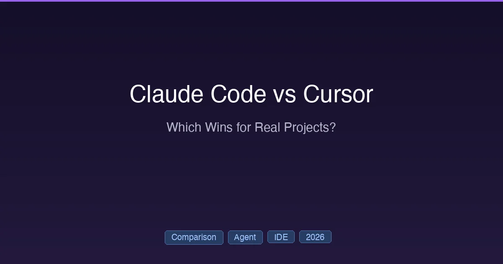

+++
date = '2026-03-01T14:00:00+08:00'
draft = false
title = 'Claude Code vs Cursor 2026：哪个 AI 编程工具更强？'
description = 'Claude Code 与 Cursor 2026 年深度对比：从 Agent 能力、代码质量、开发体验、定价到最佳场景，五个维度全面测评，帮你选出最适合的 AI 编程工具。'
toc = true
tags = ['Claude Code', 'Cursor', 'Comparison', 'AI Coding Tools']
categories = ['Comparisons']
keywords = ['Claude Code vs Cursor', 'Claude Code 对比 Cursor', '最好的AI编程工具', 'AI编程工具对比', 'Cursor和Claude Code哪个好', 'AI编程助手推荐']

[[params.faqItems]]
question = "Claude Code 比 Cursor 好用吗？"
answer = "取决于你的工作流。Claude Code 擅长终端自主任务、大规模重构和多文件操作，且 token 消耗更低。Cursor 擅长 IDE 集成开发、行内代码补全和可视化编辑。很多开发者两个都用。"

[[params.faqItems]]
question = "Claude Code 和 Cursor 可以一起用吗？"
answer = "可以，很多开发者都是这样做的。常见搭配：日常编辑用 Cursor 的行内补全和可视化调试，遇到复杂的多文件重构、架构设计和自动化任务时切换到 Claude Code。"

[[params.faqItems]]
question = "Claude Code 和 Cursor 哪个更划算？"
answer = "两者的 Pro 版都是 $20/月起。重度使用的话，Claude Code Max 5x（$100/月）的 token 效率比 Cursor Ultra（$200/月）高约 5.5 倍，性价比更好。"
+++



2026 年开发者圈最火的两款 AI 编程工具：**Claude Code** 和 **Cursor**。两者都很强大，都能处理复杂的多文件任务。但它们的设计理念截然不同。

**Claude Code** 是终端优先的自主 Agent。你给它一个任务，它自己规划、执行、验证，覆盖整个代码库。

**Cursor** 是 AI 原生 IDE。它在 VS Code 基础上深度集成了 AI 能力——行内补全、Agent 模式、可视化编辑，一体化体验。

本文从五个关键维度全面测评，帮你判断哪个更适合你的工作流——或者，你是否两个都需要。

## 快速对比

| 维度 | Claude Code | Cursor |
|------|:-----------:|:------:|
| **架构** | 终端 Agent | AI 原生 IDE（VS Code 分支） |
| **最强模型** | Opus 4.6 / Sonnet 4.6 | 多模型（Claude、GPT、Gemini） |
| **入门价格** | $20/月（Pro） | $20/月（Pro） |
| **高阶价格** | $100/月（Max 5x） | $200/月（Ultra） |
| **代码补全** | 无行内补全 | 优秀的行内补全 |
| **Agent 模式** | 原生终端 Agent | Composer + Background Agents |
| **多文件编辑** | 优秀 | 优秀 |
| **上下文窗口** | 200K–1M tokens | 70K–120K（实际有效） |
| **Token 效率** | 基准（1x） | 约 5.5 倍消耗 |
| **学习曲线** | 较陡 | 低（VS Code 用户） |

## 1. Agent 能力

### Claude Code：Agent 优先设计

Claude Code 从第一天起就作为自主 Agent 来构建。它的 Agent 循环：

1. **读取** 代码库中的相关文件
2. **规划** 实现策略
3. **编写** 跨多个文件的代码
4. **执行** Shell 命令（构建、测试、lint）
5. **验证** 结果，测试失败则迭代修复

核心 Agent 特性：
- **[Agent Teams](/posts/ai/2026-02-28-claude-code-teams-guide/)**：多个 Agent 并行协作，共享任务列表
- **[Worktree 隔离](/posts/ai/2026-02-28-claude-code-worktree-guide/)**：每个会话独立 git worktree
- **[Hooks](/posts/ai/2026-02-28-claude-code-hooks-guide/)**：确定性自动化规则，Agent 必须遵守
- **[Skills](/posts/ai/2026-02-28-claude-code-skills-guide/)**：可复用的领域知识包
- **[MCP 集成](/posts/ai/2026-02-28-claude-code-mcp-setup/)**：连接任意外部服务

### Cursor：IDE 集成 Agent

Cursor 的 Agent 能力在 2026 年有了显著进化：

- **Composer**：Cursor 自研模型，针对软件工程优化，代码生成速度提升 4 倍
- **Background Agents**：异步执行任务，不阻塞编辑器
- **Cloud Agents**：在隔离 VM 中运行，生成可合并的 PR 并附带视频/截图
- **Subagents**：并行执行，支持嵌套子 Agent 树
- **最多 8 个 Agent 同时并行运行**

### 结论：Agent 模式

**Claude Code 在自主多步骤任务中胜出**。它的 Agent 循环更成熟，在复杂操作中有更好的规划和自我修正能力。Hooks、Skills 和 MCP 的组合提供了无与伦比的自动化灵活性。

**Cursor 在交互式 Agent 工作中胜出**。Background 和 Cloud Agents 让你在 Agent 工作时继续编辑，可视化反馈也更直观。

## 2. 代码质量与上下文

### 上下文窗口

这是 Claude Code 具有决定性优势的地方：

| 工具 | 标称容量 | 实际有效 | 影响 |
|------|:--------:|:--------:|------|
| **Claude Code** | 200K–1M | 200K–1M | 大型代码库可靠处理 |
| **Cursor** | 200K | 70K–120K | 内部截断以保证性能 |

Claude Code 的上下文窗口是货真价实的——它能将整个代码库放入上下文中，跨数百个文件进行推理。配合 beta 版 1M token 模式（Tier 4 API），超大型 monorepo 也能处理。

Cursor 的实际上下文比宣传的要小。内部截断保护了性能，但也意味着复杂的跨文件推理可能遗漏重要关联。

### Token 效率

独立测试表明，Claude Code 完成同等任务消耗的 token 大约少 **5.5 倍**。这直接意味着：
- 按量计费时成本更低
- 达到速率限制前能完成更多工作
- 等待响应的时间更短

### 代码输出质量

Claude Code 生成的代码更接近"生产就绪"——据报告，返工率比 Cursor 低约 30%。对于专业开发场景，不可能逐行审查和修复每一行生成的代码，这一点非常重要。

## 3. 开发体验

### Claude Code：终端的力量

Claude Code 生活在终端里。如果你主要用 CLI 工具、命令行 git 和 SSH 会话，Claude Code 会让你如鱼得水。

**优势**：
- 原生 Shell 集成——直接执行任何命令
- 支持 SSH（远程开发）
- 与现有终端工作流集成（tmux、zsh 等）
- 不绑定任何 IDE

**劣势**：
- 没有行内代码补全
- 没有可视化 diff（仅文本 diff）
- 对习惯 IDE 的开发者学习曲线较陡
- 需要单独的编辑器浏览代码

### Cursor：IDE 的舒适感

Cursor 是 VS Code 的分支，如果你用过 VS Code，你已经会用 Cursor 了。

**优势**：
- 优秀的行内代码补全（Tab）
- Composer 可视化多文件编辑
- 完整的 VS Code 扩展生态
- VS Code 用户零学习成本
- 更适合前端/UI 开发（可视化预览）

**劣势**：
- 绑定 VS Code（不支持 JetBrains、Vim）
- 终端集成是次要的
- 多模型灵活性增加了复杂性
- 资源占用较大

### 结论：开发体验

**日常编码 Cursor 胜出**——IDE 体验、行内补全和可视化编辑为日常开发创造了更流畅的工作流。

**高级用户 Claude Code 胜出**——如果你在终端工作、需要 SSH 访问，或偏好自动化而非可视化编辑，Claude Code 更强大。

## 4. 定价对比

| 层级 | Claude Code | Cursor |
|------|:-----------:|:------:|
| **免费** | 无 Claude Code 权限 | 有限功能 |
| **Pro** | $20/月 | $20/月 |
| **进阶** | $100/月（Max 5x） | $60/月（Pro+） |
| **旗舰** | $200/月（Max 20x） | $200/月（Ultra） |
| **团队** | $25–150/用户/月 | $40/用户/月 |

$20 档位两者差不多。差异出现在更高档位：

- **Claude Code Max 5x（$100）** 提供 5 倍 Pro 容量和高优先级
- **Cursor Pro+（$60）** 所有模型提供商 3 倍容量
- **Claude Code Max 20x（$200）** = 个人使用基本无限量
- **Cursor Ultra（$200）** = 20 倍容量 + 抢先体验

**性价比**：考虑到 Claude Code 5.5 倍的 token 效率优势，$100/月的 Max 5x 方案实际产出可能比 $200/月的 Cursor Ultra 更多。

详细定价分析见 [Claude 定价 2026](/posts/ai/2026-02-25-claude-code-pricing/)。

## 5. 最佳使用场景

### 选 Claude Code 的情况：

| 场景 | Claude Code 为何胜出 |
|------|---------------------|
| **大规模重构** | 200K–1M 上下文处理跨文件改动 |
| **CI/CD 自动化** | 原生 Shell 执行，Hooks 自动化 |
| **架构决策** | Opus 4.6 在复杂推理上表现优异 |
| **DevOps 工作流** | 终端原生，支持 SSH |
| **成本敏感的重度使用** | 5.5 倍 token 效率优势 |
| **自定义自动化** | MCP + Hooks + Skills = 无与伦比的灵活性 |

### 选 Cursor 的情况：

| 场景 | Cursor 为何胜出 |
|------|-----------------|
| **日常功能开发** | IDE 体验 + 行内补全 |
| **前端/UI 开发** | 可视化编辑，预览集成 |
| **快速原型开发** | 更快的反馈循环 |
| **多模型实验** | 在 Claude、GPT、Gemini 间切换 |
| **团队入职** | 零学习成本（VS Code） |
| **后台任务执行** | Cloud Agents 边工作边运行 |

### 组合策略

2026 年很多开发者**两个工具一起用**：

```
Cursor → 日常编辑、行内补全、可视化调试
Claude Code → 复杂重构、自动化、架构规划
```

这种组合每月花费 $40–120（取决于档位），但通过在各自擅长的领域发挥优势，最大化了生产力。

## 最终结论

**没有绝对的赢家**——这两个工具解决的是不同的问题：

- **Claude Code** 是更好的**自主 Agent**。如果你希望 AI 能独立规划和执行复杂的多步骤任务、覆盖整个代码库，Claude Code 更胜一筹。

- **Cursor** 是更好的**编码伙伴**。如果你希望 AI 深度集成到编辑体验中，提供行内建议、可视化 diff 和熟悉的 IDE 界面，Cursor 更出色。

**我们的建议**：先选与你主要工作流匹配的那个（终端 vs IDE）。遇到瓶颈时再加上另一个。$40/月的组合（Claude Code Pro + Cursor Pro）是想要双重能力的开发者的最佳性价比选择。

---

*对比数据截至 2026 年 2 月。两个工具都在快速迭代中。*

## 延伸阅读

- [Claude Code Guide 2026: Everything You Need to Know](/posts/ai/2026-02-28-claude-code-complete-guide/) — Claude Code 完整功能概览
- [Claude Pricing 2026: Every Plan from Free to Max $200](/posts/ai/2026-02-25-claude-code-pricing/) — 详细定价分析
- [Claude Rate Limits 2026](/posts/ai/2026-02-28-claude-rate-limits/) — 用量限制说明
- [GitHub Copilot vs Claude Code vs Cursor](/posts/ai/2026-02-28-copilot-vs-claude-vs-cursor/) — 三方对比
