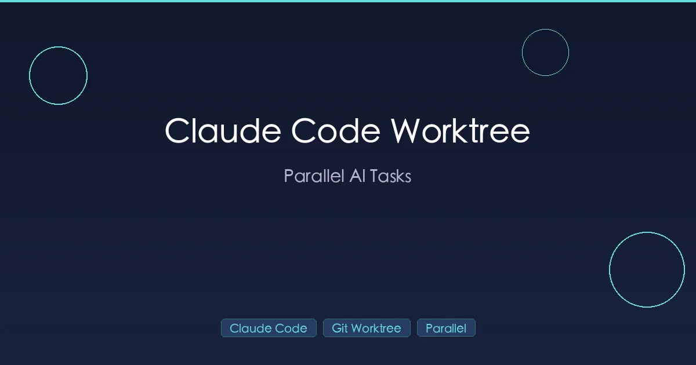

+++
date = '2026-02-28T10:00:00+08:00'
draft = false
title = 'Claude Code Worktree：多任务并行开发完全指南'
description = '使用 Git worktree 模式同时运行多个 Claude Code 会话，实现并行开发、自动清理和团队协作工作流，大幅提升 AI 编程效率。'
toc = true
tags = ['Claude Code', 'Git Worktree', 'Productivity', 'Parallel Development']
categories = ['AI Guides']
keywords = ['Claude Code worktree', 'Claude Code 并行开发', 'git worktree 教程', 'Claude Code -w', '多个 Claude 会话', 'Claude Code 效率提升']
+++



你打开终端，Claude Code 正在帮你构建一个新的认证模块，进度过半。这时 Slack 弹出消息：线上有个紧急 bug 需要立刻修复。

怎么办？把改了一半的代码 stash 起来，祈祷自己以后还记得 pop 回来？强行 commit 一个残缺的状态来切换分支？还是告诉团队再等等？

这就是单目录开发的根本限制：**一个工作目录同一时间只能承载一个任务**。切换分支会改变文件内容，但无法提供真正的隔离。如果两个 Claude Code 会话在同一个目录中运行，它们必然会互相干扰。

[Claude Code](https://docs.anthropic.com/en/docs/claude-code) 的 `--worktree` 参数（简写：`-w`）彻底解决了这个问题。它将 Git worktree 的隔离能力与 Claude Code 的 AI 工作流相结合，让你可以在几秒钟内启动独立的编码会话——每个会话拥有自己的目录、自己的分支，与其他工作完全互不干扰。

本指南涵盖全部内容：Git worktree 基础、Claude Code 的 worktree 模式、自动清理机制、实战场景、最佳实践，以及一个真实的团队案例。

## Git Worktree 基础：一个仓库，多个目录

在深入 Claude Code 的 worktree 模式之前，先确保你理解它所依赖的 Git 功能。如果你已经熟悉 Git worktree，可以直接跳到下一节。

### 分支切换的痛点

在标准的 Git 工作流中，一个仓库意味着一个工作目录。当你需要切换上下文时：

```bash
# 你在 feature-a 分支上，但需要修复一个线上 bug
git stash                    # 保存当前工作
git checkout hotfix-branch   # 切换到 hotfix 分支
# ... 修复 bug ...
git checkout feature-a       # 切回来
git stash pop                # 恢复之前的工作
```

这虽然能用，但代价不小：

- **Stash 事故**：忘记 `git stash pop` 太常见了。被 stash 的改动可能在那里躺上好几周，逐渐过时。
- **依赖重装**：切换分支可能导致 `package.json` 或 `requirements.txt` 发生变化，触发缓慢的 `node_modules` 或虚拟环境重新安装。
- **无法并行**：你只能同时做一件事。另一个任务在你切回来之前完全冻结。
- **上下文污染**：如果你在一个目录中运行 Claude Code，中途切换分支，AI 对代码库的理解立刻就错了。

### Git Worktree 如何解决这些问题

[Git worktree](https://git-scm.com/docs/git-worktree) 允许你将同一个仓库的多个分支检出到不同的目录中。每个目录都有独立的文件状态，但它们共享底层的 `.git` 数据：

```bash
# 为 hotfix 创建一个新的工作目录
git worktree add ../project-hotfix -b hotfix-branch

# 现在你有两个目录，分别在不同的分支上
# /project/           -> feature-a 分支（你原来的目录）
# /project-hotfix/    -> hotfix-branch（新的 worktree）
```

两个目录都是完全可用的。你可以在任意一个中编辑文件、运行测试、构建和提交——如果需要的话，可以同时进行。一个目录中的改动不会影响另一个。

### 核心 Git Worktree 命令

| 命令 | 作用 |
|------|------|
| `git worktree add <path> -b <branch>` | 创建新分支并建立 worktree |
| `git worktree add <path> <existing-branch>` | 基于已有分支创建 worktree |
| `git worktree list` | 列出当前仓库所有的 worktree |
| `git worktree remove <path>` | 删除 worktree 及其目录 |

**关键限制**：Git 不允许两个 worktree 同时检出同一个分支。每个 worktree 必须使用不同的分支。

有了这个基础，Claude Code 的 worktree 模式就很好理解了——它自动化了上述所有操作，并在此之上增加了会话管理。

## Claude Code --worktree 模式

### 基本用法

启动 worktree 会话最简单的方式是给它一个名字：

```bash
# 创建名为 "feature-auth" 的 worktree 并在其中启动 Claude Code
claude -w feature-auth
```

这一条命令做了三件事：

1. 在 `<仓库根目录>/.claude/worktrees/feature-auth/` 创建新的工作目录
2. 基于默认远程分支（通常是 `main`）创建名为 `worktree-feature-auth` 的新分支
3. 在这个隔离目录中启动 Claude Code

如果你懒得想名字，可以让 Claude 自动生成：

```bash
# 自动生成随机名称，如 "bright-running-fox"
claude -w
```

### 在会话中创建 Worktree

你也可以在对话过程中用自然语言让 Claude 创建 worktree：

```
> Start a worktree for this refactoring task
> Work on this in a new worktree called "fix-api-routes"
```

Claude Code 会自动处理 worktree 的创建并切换到隔离环境。

### 目录结构

所有通过 `claude -w` 创建的 worktree 都在统一的位置：

```
my-project/
├── .claude/
│   └── worktrees/
│       ├── feature-auth/        # Worktree: feature-auth
│       │   ├── src/
│       │   ├── package.json
│       │   └── ...              # 项目文件的完整副本
│       └── bugfix-memory-leak/  # Worktree: bugfix-memory-leak
│           ├── src/
│           ├── package.json
│           └── ...
├── src/                         # 主工作目录
├── package.json
└── ...
```

**重要**：将 `.claude/worktrees/` 加入 `.gitignore`，避免 worktree 文件出现在 `git status` 中：

```gitignore
# Claude Code worktrees
.claude/worktrees/
```

### 分支命名规则

Claude Code 遵循可预测的 worktree 分支命名模式：

- Worktree 名称：`feature-auth`
- 分支名称：`worktree-feature-auth`

这让你在 `git branch` 输出或 CI/CD 系统中很容易识别 worktree 分支。`worktree-` 前缀表明该分支是自动创建的，与某个隔离会话关联。

## 自动清理：干干净净，了无痕迹

Claude Code worktree 模式最好的设计之一就是它的清理机制。当你退出 worktree 会话时，Claude Code 会检查你是否做了任何更改：

### 没有改动

如果 worktree 没有未提交的修改也没有新的 commit，Claude Code 会**自动删除** worktree 目录及其分支。干净退出，零清理工作。

这非常适合探索性的会话："让我在隔离环境中检查一下"——如果你没改任何东西，就没有需要保存的。

### 有改动

如果 worktree 中有未提交的改动或新的 commit，Claude Code 会**提示你**做出选择：

- **保留**：worktree 目录和分支保持不变。之后可以通过 `--resume` 继续。
- **删除**：所有内容都会被移除——未提交的改动、commit、worktree 目录和分支。

这种两层机制意味着：没有成果的实验自动清理，有价值的改动默认保留。

### 手动清理

对于之前选择保留但已经不再需要的 worktree：

```bash
# 列出所有 worktree
git worktree list

# 删除指定的 worktree
git worktree remove .claude/worktrees/old-feature

# 同时删除关联的分支
git branch -d worktree-old-feature
```

## 实战场景

### 场景一：并行功能开发

最常见的用法。你有两个独立的任务，想让 Claude 同时处理：

**终端 1：**

```bash
claude -w feature-auth
```

```
> Implement OAuth2 login with Google and GitHub providers.
> Follow the existing auth module patterns in src/auth/.
```

**终端 2：**

```bash
claude -w optimize-queries
```

```
> Analyze the N+1 query problems in src/db/queries.ts
> and refactor them to use batch loading.
```

每个 Claude 会话在自己的目录和分支中运行，它们看不到对方的改动。没有冲突，没有干扰，无需等待。

两个任务完成后，通过正常的工作流（Pull Request、代码审查、CI 检查）将各自的 worktree 分支合并回 `main`。

### 场景二：实验性重构

你想尝试一个大胆的架构变更，但不确定是否可行：

```bash
claude -w experiment-event-driven
```

```
> Refactor the order processing module from synchronous MVC
> to an event-driven architecture. Start with the order
> creation flow and see if it simplifies the error handling.
```

如果实验成功：合并分支。如果失败：退出会话，选择"删除"，一切痕迹消失。你的主工作目录从未被触碰。

这消除了"万一搞坏了怎么办"的顾虑，而正是这种顾虑阻止了开发者尝试有价值的重构。Worktree 就是你的沙盒。

### 场景三：不切换上下文的代码审查

你正深入开发一个功能，这时一个 Pull Request 需要你审查。不用 stash 你的工作：

```bash
claude -w review-pr-456
```

```
> Review PR #456. Check for security vulnerabilities,
> performance issues, and adherence to our coding standards.
> Suggest specific improvements with code examples.
```

Claude 在隔离目录中工作。你在主目录中的功能开发完全不受影响。审查结束后退出 worktree 会话——如果你没有做代码改动，它会自动清理。

### 场景四：规划者 + 实现者双 Claude 模式

一些团队对复杂任务采用双 Claude 工作流：

- **Claude A**（主目录）：分析代码库、设计方案、分解任务
- **Claude B**（worktree）：执行方案、编写实际代码

```bash
# 终端 1：规划者在主目录中
claude
```

```
> Analyze the payment processing system. I need to add
> support for recurring subscriptions. Design a plan
> with specific files to modify and code changes needed.
```

```bash
# 终端 2：实现者在 worktree 中
claude -w implement-subscriptions
```

```
> Implement the recurring subscription feature based on
> the plan in this project. Start with the database schema
> changes, then the API endpoints, then the webhook handlers.
```

规划者拥有完整代码库的只读上下文。实现者在隔离环境中编写代码。两个会话的上下文互不污染。更多关于多 Agent 协作模式的内容，请参阅我们的 [Claude Code 团队协作指南](/posts/ai/2026-02-28-claude-code-teams-guide/)。

### 场景五：功能开发中途修复 Bug

经典的中断场景：

```bash
# 你正在主目录中开发功能
# 一个 P0 级别的 bug 报告来了

# 不要 stash。不要慌。只需：
claude -w hotfix-payment-timeout
```

```
> There's a production bug: payment webhooks are timing out
> after 30 seconds. Investigate the webhook handler in
> src/payments/webhooks.ts and fix the timeout issue.
```

修复、测试、提交、推送、创建 PR——全程不碰你的功能分支。当 hotfix 合并部署后，退出 worktree 会话，零上下文损失地回到你的功能开发。

## 技巧与最佳实践

### 命名规范

使用描述性的名称，让你一眼就能看出每个 worktree 在做什么。当你有多个会话需要通过 `--resume` 找到正确的那个时，这一点很重要：

```bash
# 好的命名：一目了然
claude -w feat-oauth-login
claude -w fix-memory-leak
claude -w refactor-db-layer
claude -w spike-graphql-migration

# 差的命名：毫无意义
claude -w test1
claude -w tmp
claude -w stuff
```

推荐前缀：

| 前缀 | 用途 |
|------|------|
| `feat-` | 新功能开发 |
| `fix-` | Bug 修复 |
| `refactor-` | 代码重构 |
| `spike-` | 探索性调查 |
| `review-` | 代码审查会话 |
| `test-` | 编写或修复测试 |

### 在新 Worktree 中安装依赖

新创建的 worktree 包含所有 Git 追踪的文件，但不包含被忽略的目录，如 `node_modules/`、`venv/` 或 `vendor/`。你需要在代码运行之前安装依赖：

```bash
# 启动 worktree 会话后，先让 Claude 安装依赖
> Run npm install before starting any development work.
```

或者在你的 [CLAUDE.md](/posts/ai/2026-02-28-claude-code-claudemd-guide/) 中添加规则，让 Claude 始终记住：

```markdown
## Worktree Rules
- Always run `npm install` (or `pip install -r requirements.txt`)
  before starting work in a new worktree.
```

你还可以使用 [Claude Code hooks](/posts/ai/2026-02-28-claude-code-hooks-guide/) 来自动化这一过程——设置一个 post-session hook，检测到新的 worktree 时自动运行安装命令。

### 处理 .env 文件

环境变量文件（`.env`、`.env.local`）通常在 `.gitignore` 中，所以在新的 worktree 中不会存在。有三种方案：

**方案 A：手动复制**

```bash
cp .env .claude/worktrees/feature-auth/.env
```

**方案 B：让 Claude 复制**

```
> Copy the .env file from the project root to this worktree directory,
> then start working on the feature.
```

**方案 C：符号链接**（一次性设置）

```bash
# 在 worktree 目录中
ln -s ../../.env .env
```

对于团队来说，建议在版本控制中保留一个 `.env.example` 文件，包含占位值。Claude 可以在每个新 worktree 中复制并填充它。

### 定期清理

如果退出时总是选择"保留"，worktree 会随时间累积。养成定期清理的习惯：

```bash
# 查看所有 worktree
git worktree list

# 删除不再需要的
git worktree remove .claude/worktrees/old-experiment

# 清理过时引用（目录已被手动删除的 worktree）
git worktree prune
```

一个好的经验法则：如果一个 worktree 超过一周没有被使用，要么合并它的改动，要么删除它。

### 与 --resume 配合使用

Worktree 会话与 Claude Code 的会话恢复功能无缝配合。如果你保留了一个 worktree 并想从上次中断的地方继续：

```bash
claude --resume
```

会话选择器会显示同一仓库中所有 worktree 的会话，并清楚地标注 worktree 名称。选择你想要的那个，Claude Code 就会在正确的 worktree 目录中恢复，保留完整的对话历史。

这对于跨越多天的任务非常强大：周一在 worktree 中启动一个功能，周二带着完整上下文继续，周三合并。

## Worktree vs 分支切换：对比

什么时候应该用 worktree，什么时候直接切换分支就够了？对比如下：

| 维度 | Worktree 模式 | 分支切换 |
|------|--------------|---------|
| **文件隔离** | 每个任务有自己的目录 | 所有任务共享一个目录 |
| **并行会话** | 可同时运行多个 Claude 实例 | 一次只能做一个任务 |
| **依赖安装** | 每个 worktree 需要单独安装 | 如果分支间依赖不同也可能需要 |
| **磁盘占用** | 每个 worktree 复制源文件（不含 `.git`） | 只有一份文件副本 |
| **上下文隔离** | Claude 会话完全独立 | 会话可能读到其他任务的改动 |
| **清理工作** | 退出时自动清理或一条命令搞定 | 需要手动管理 stash/commit |
| **最适合** | 多任务并行、实验、AI 工作流 | 简单的顺序开发 |
| **学习曲线** | 需要理解 worktree 概念 | 基础 Git 知识即可 |

**决策很简单**：如果你一次只做一件事，分支切换就够了。如果你想让多个 Claude 会话并行运行，或者你想要一个零风险的实验沙盒，就用 worktree 模式。

## 真实团队案例：incident.io

incident.io 团队分享了他们使用 Claude Code 配合 Git worktree 的经验，结果展示了并行 AI 开发在实践中的样子。

### 配置方式

团队成员日常同时运行 **4-5 个并行的 Claude Code 实例**，每个在自己的 worktree 中。工作流如下：

1. 确定本次会话的任务（功能开发、bug 修复、重构）
2. 为每个任务启动一个 worktree
3. 给每个 Claude 实例明确的指令
4. 跨终端监控进度
5. 审查和合并结果

### 成果

一个具体的例子：一个 JavaScript 编辑器增强功能，手动开发预估需要 **2 小时**，使用并行 worktree 在 **10 分钟**内完成。任务被分解为独立的子任务，每个分配给一个单独的 Claude 实例，全部同时运行。

### 团队的工作流封装

为了减少创建 worktree 和启动 Claude 的摩擦，团队构建了一个简单的 bash 封装函数：

```bash
# 用法：w <project> <task-name> <command>
w myproject new-feature claude
```

一条命令就能创建 worktree、切换目录并启动 Claude Code——将整个流程压缩到一行。

### 他们经验的关键要点

- **先用 Plan 模式**：每次并行会话之前，他们先用 Claude 的 plan 模式审查方案。这可以防止 Claude 方向跑偏导致的浪费。
- **渐进式采用**：团队花了大约四个月时间，从实验性使用发展到全面采用。先小规模尝试——在主工作旁边开一个 worktree 会话——然后再发展到 4-5 个并行实例。
- **任务分解是关键**：并行 worktree 只在任务真正独立时才有帮助。如果两个任务修改同一批文件，无论如何都会遇到合并冲突。
- **代码审查必不可少**：更多并行输出意味着更多代码需要审查。即使代码是 AI 生成的，团队也保持严格的审查标准。

## 常见问题

### Worktree 和 `git clone` 有什么区别？

Worktree 与主目录共享同一个 `.git` 仓库数据。创建几乎是瞬间完成的，因为它不需要下载任何东西——只是检出文件。而 clone 创建一个完全独立的仓库副本，需要更长时间且不共享分支和提交数据。

日常并行开发用 worktree。只有当你需要完全独立的仓库配置（不同的 remote、不同的 hook）时才用 clone。

### 可以在 worktree 中提交和推送吗？

可以。在 worktree 中的提交属于同一个仓库。你可以像在主目录中一样进行 commit、push、创建 Pull Request 等所有操作。提交记录在任何 worktree 的 `git log` 中都能看到。

### 两个 worktree 可以在同一个分支上吗？

不可以。Git 强制规定每个分支同一时间只能在一个 worktree 中被检出。这是为了防止不同目录对同一分支产生冲突的编辑。Claude Code 通过为每个 worktree 自动创建唯一的 `worktree-<name>` 分支来处理这一点。

### 如何将 worktree 的改动合并回去？

和合并任何分支一样：

```bash
# 方式 1：在主目录中直接合并
git merge worktree-feature-auth

# 方式 2：创建 Pull Request（团队工作流推荐）
cd .claude/worktrees/feature-auth
git push -u origin worktree-feature-auth
# 然后通过 GitHub/GitLab 创建 PR
```

大多数团队倾向于使用 Pull Request，因为可以获得 CI 检查和代码审查的保障。

### Worktree 占用多少磁盘空间？

Worktree 复制你的源文件，但**不复制** `.git` 目录（这是所有 worktree 共享的）。因此磁盘开销大约等于你的源代码大小。

真正占空间的是依赖。如果每个 worktree 都运行 `npm install`，你会在每个中都有一个独立的 `node_modules`。对于典型的 Node.js 项目，这意味着每个 worktree 200-500 MB。如果你运行多个并行会话，请注意这一点。

**技巧**：[pnpm](https://pnpm.io/) 等工具使用内容寻址存储来跨项目去重包，当你有多个 worktree 时可以显著减少磁盘使用。

### Git hooks 在 worktree 中能用吗？

能用。Git hooks（pre-commit、pre-push 等）在 worktree 中的工作方式完全相同，因为它们定义在共享的 `.git/hooks` 目录中。如果你使用 [Claude Code hooks](/posts/ai/2026-02-28-claude-code-hooks-guide/) 进行自动化（格式化、lint、文件保护），这些在 worktree 会话中同样生效——`.claude/` 配置从仓库根目录读取。

### 如果手动删除了 worktree 目录会怎样？

Git 会注意到目录消失了。运行 `git worktree prune` 来清理过时的引用。与 worktree 关联的分支仍然存在，可以通过 `git branch -d <branch-name>` 单独删除。

### Worktree 能用于 monorepo 吗？

可以，而且效果很好。每个 worktree 获得整个 monorepo 的副本，所以你可以同时在不同的包上工作。代价是磁盘空间——大型 monorepo 意味着更大的 worktree。如果你在一个 worktree 中只需要特定的包，可以考虑使用 sparse checkout。

## 总结

Claude Code 的 `--worktree` 模式将 Git 的 worktree 功能变成了一个无缝的并行开发工具。核心价值很简单：**在同一个仓库中同时运行多个 AI 编码会话，互不冲突**。

需要记住的要点：

1. **`claude -w <name>`** 一条命令创建隔离 worktree 并启动 Claude Code
2. Worktree 位于 `.claude/worktrees/`——将此路径加入 `.gitignore`
3. 分支自动命名为 `worktree-<name>`，便于识别
4. 自动清理机制移除空 worktree；有改动的 worktree 会提示你选择保留或删除
5. 每个 worktree 需要单独安装依赖（`node_modules`、`venv` 等）
6. 配合 `--resume` 使用，支持跨越多天的任务
7. 与 Git hooks 和 Claude Code hooks 开箱即用

如果你还在单个目录中运行单个 Claude 会话，一次只做一个任务，试试这个：打开两个终端，创建两个 worktree，分配两个独立任务。当你看到两个会话同时推进时，你就会明白为什么像 incident.io 这样的团队把同时运行 4-5 个并行实例作为默认工作流。

AI 辅助开发的瓶颈不再是模型思考的速度，而是你能同时给它多少任务。Worktree 消除了这个瓶颈。

## 相关阅读

- [Claude Code Setup Guide 2026](/posts/ai/2026-02-25-claude-code-setup-guide/) -- 从零开始安装和配置 Claude Code
- [Claude Code for Teams: Multi-Agent Collaboration](/posts/ai/2026-02-28-claude-code-teams-guide/) -- 运行多个 Claude 实例的高级模式
- [Claude Code Hooks Guide](/posts/ai/2026-02-28-claude-code-hooks-guide/) -- 自动化格式化、lint 和安全检查
- [10 Claude Code Mistakes Beginners Make](/posts/ai/2026-02-25-claude-code-mistakes/) -- 常见陷阱及避免方法
