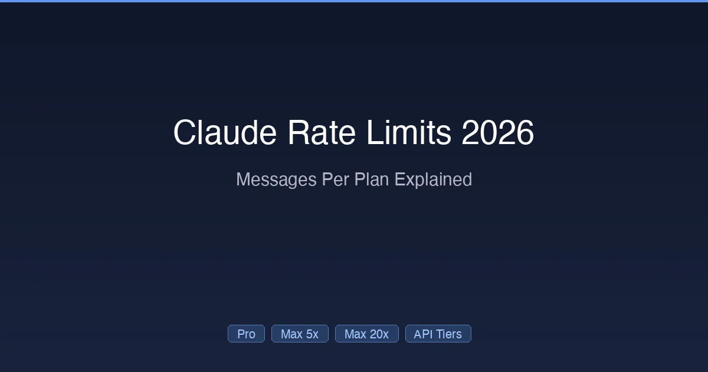

+++
date = '2026-02-28T10:00:00+08:00'
draft = false
title = 'Claude Rate Limits 2026: Free, Pro & Max Message Caps Per 5 Hours'
description = 'Exact Claude rate limits for 2026: Free gets ~15 messages, Pro ~45, Max 5x ~225 per 5-hour window. See per-plan caps, weekly limits, API tiers, and what happens when you hit the limit.'
toc = true
tags = ['Claude Code', 'Rate Limits', 'Pricing', 'AI Coding Tools']
categories = ['AI Guides']
keywords = ['Claude rate limits', 'Claude Pro rate limits', 'Claude Pro rate limits 2026', 'Claude messages per 5 hours', 'Claude Max rate limits', 'Claude Pro usage limits', 'Claude Pro usage limits 2026', 'Claude weekly limits', 'Claude API rate limits', 'Claude Code limits', 'Claude pro message limits 2026', 'Claude ai free tier limits 2026', 'Claude free tier message limits 2026', 'Claude pro subscription price 2026']

[[params.faqItems]]
question = "How many messages do I get with Claude Pro?"
answer = "Approximately 10-45 messages per 5-hour rolling window with Sonnet, fewer with Opus. The exact number depends on message length, context size, and server load. Longer conversations consume more tokens per message."

[[params.faqItems]]
question = "What happens when I hit the Claude rate limit?"
answer = "Claude slows down rather than stopping completely. You'll see longer wait times between responses. Opus requests may temporarily fall back to Sonnet. The 5-hour window is rolling, so capacity gradually restores as older messages age out."

[[params.faqItems]]
question = "Does Claude Code share limits with Claude.ai?"
answer = "Yes. Claude Code and Claude.ai share the same message quota on Pro and Max plans. Using Claude.ai chat reduces your available Claude Code messages and vice versa."

[[params.faqItems]]
question = "Can I buy extra messages on the Pro plan?"
answer = "No. The Pro plan does not support purchasing additional usage. You must upgrade to a Max plan (5x at $100/month or 20x at $200/month) to get more capacity. Max plans do allow purchasing extra usage at API rates when limits are exceeded."

[[params.faqItems]]
question = "Are Claude API rate limits the same as subscription limits?"
answer = "No. API rate limits are measured in requests per minute (RPM) and tokens per minute (TPM), not messages per 5 hours. API limits depend on your spending tier (Tier 1-4), not your subscription plan."

[[params.faqItems]]
question = "Why did my Claude limits suddenly decrease?"
answer = "Most likely you were benefiting from a temporary promotion. Anthropic doubled all limits during the December 2025 holidays. When they reverted in January 2026, many users mistakenly thought limits had been cut. The standard limits have been unchanged since August 2025."
+++



If you've used [Claude Code](https://github.com/anthropics/claude-code) for more than a day, you've probably hit a rate limit. That frustrating "you've reached your usage limit" message mid-debugging session.

The problem isn't that limits exist — it's that **nobody explains them clearly**. Anthropic's official documentation is vague ("usage may vary"), community posts are outdated, and your actual experience depends on factors you can't see.

This guide cuts through the confusion. Every Claude rate limit, across every plan and API tier, with the real numbers and practical strategies to work around them.

## Quick Reference: All Plans at a Glance

| Plan | Price | Messages / 5 Hours | Weekly Limit | Opus Access |
|------|-------|--------------------:|:-------------|:-----------:|
| **Free** | $0 | ~2–5 | None | No |
| **Pro** | $20/mo | ~10–45 | ~40–80 hrs | Limited |
| **Max 5x** | $100/mo | ~50–200 | ~140–280 hrs | Full |
| **Max 20x** | $200/mo | ~200–800 | ~240–480 hrs | Full |
| **Team Standard** | $25/user/mo | ~1.25× Pro | 7-day reset | Limited |
| **Team Premium** | $150/user/mo | ~6.25× Pro | 7-day reset | Full |

> **Why ranges?** Message counts depend on conversation length, model choice, context size, and current server load. Short questions with Sonnet hit the high end; long Opus conversations with file context hit the low end.

## How Claude Rate Limits Actually Work

Before diving into specific plans, you need to understand the mechanics — because Claude's rate limiting is more nuanced than "X messages per hour."

### The Two-Layer System

Since August 2025, Claude uses a **dual-layer rate limit structure**:

**Layer 1 — 5-Hour Rolling Window**
- Tracks message count over a continuous 5-hour sliding window
- No fixed reset time — as your oldest messages age past 5 hours, capacity gradually restores
- This is the limit you hit during intense coding sessions

**Layer 2 — 7-Day Weekly Cap**
- Introduced in August 2025 to address power users running Claude Code 24/7
- Measures total compute hours per rolling 7-day period
- You can use your entire weekly budget in 2 days if you want, but then you'll be limited for the remaining 5

**Why two layers?** The 5-hour window prevents short bursts from overwhelming servers. The weekly cap ensures fair resource distribution across all subscribers. Anthropic [stated](https://www.anthropic.com/news) this affects fewer than 5% of users.

### What Counts as a "Message"?

This is where most confusion comes from. A "message" isn't one chat bubble — it's measured in **tokens consumed**:

- A short question ("fix this typo") = ~200 tokens → barely touches your limit
- A medium request with code context = ~5,000 tokens → moderate consumption
- Claude Code reading 10 files + generating changes = ~50,000+ tokens → significant consumption

**This means**: 45 short Claude.ai chats ≠ 45 Claude Code agentic turns. Heavy Claude Code usage consumes limits **5–10× faster** than casual chat.

### Shared Pool Warning

Claude Code and Claude.ai **share the same quota**. If you use 30 messages on Claude.ai, your Claude Code allowance drops by 30 messages worth of tokens. Plan accordingly.

## Plan-by-Plan Rate Limits

### Free Tier Rate Limits

- **~2–5 messages per 5-hour window** (Sonnet only)
- No Opus, no Claude Code
- Further restricted during peak hours
- No weekly cap (already too limited to need one)

The free tier exists for evaluation only. You cannot meaningfully code with it.

### Claude Pro Rate Limits ($20/month) {#claude-pro-rate-limits}

The Pro plan is the most common — and the most complained about:

| Metric | Sonnet 4.6 | Opus 4.6 |
|--------|:----------:|:--------:|
| **Messages / 5 hours** | ~35–45 | ~10–20 |
| **Weekly cap** | ~40–80 hrs | Shared with Sonnet |
| **Peak-hour reduction** | Yes (~30%) | Yes (~50%) |
| **Extra usage purchasable** | No | No |

**Real-world Pro experience**:

| Task Type | Duration Before Limit | Verdict |
|-----------|:---------------------:|---------|
| Quick bug fixes | All day | Works fine |
| Feature implementation | 2–3 hours | Manageable |
| Multi-file refactoring | 30–60 minutes | Frustrating |
| Agentic loop (auto-test-fix) | 15–30 minutes | Unusable |

**The Pro trap**: Claude Code's agentic mode is incredibly powerful — it reads files, writes code, runs tests, and iterates. But each agentic turn costs multiple "messages" worth of tokens. A single complex task can burn through your 5-hour allocation in 20 minutes.

**Pro tip**: Use `sonnet` as your default model. Reserve Opus for genuinely complex architectural decisions. Sonnet handles 80%+ of coding tasks equally well and costs far fewer tokens against your limit.

### Claude Max 5x Rate Limits ($100/month) {#claude-max-5x-rate-limits}

The sweet spot for professional developers:

| Metric | Sonnet 4.6 | Opus 4.6 |
|--------|:----------:|:--------:|
| **Messages / 5 hours** | ~175–225 | ~50–100 |
| **Weekly Sonnet** | ~140–280 hrs | — |
| **Weekly Opus** | — | ~15–35 hrs |
| **Priority** | High | High |
| **Extra usage** | Yes (API rates) | Yes (API rates) |

**Real-world Max 5x experience**: Most developers can code all day without hitting the 5-hour limit. The weekly cap is the one to watch — if you're doing 6+ hours of heavy Claude Code daily, you might hit the weekly Opus limit by Thursday or Friday.

**Key advantage over Pro**: When you do hit limits, you can **purchase extra usage at standard API rates** rather than simply waiting. This makes Max much more predictable for professional work.

### Claude Max 20x Rate Limits ($200/month) {#claude-max-20x-rate-limits}

The "effectively unlimited" tier:

| Metric | Sonnet 4.6 | Opus 4.6 |
|--------|:----------:|:--------:|
| **Messages / 5 hours** | ~700–900 | ~200–350 |
| **Weekly Sonnet** | ~240–480 hrs | — |
| **Weekly Opus** | — | ~24–40 hrs |
| **Priority** | Highest (zero wait) | Highest |
| **Extra usage** | Yes (API rates) | Yes (API rates) |

At 20x, the 5-hour limit is essentially unreachable for a single user. The weekly Opus limit is still possible to hit if you run multiple concurrent Claude Code sessions via [worktree mode](/posts/ai/2026-02-28-claude-code-worktree-guide/) all week.

### Team Plan Rate Limits

Team plans have unique mechanics:

| Seat Type | Base Multiplier | Weekly Reset | Extra Usage |
|-----------|:---------------:|:------------:|:-----------:|
| **Standard** ($25/user) | 1.25× Pro | 7 days | Admin-controlled |
| **Premium** ($150/user) | 6.25× Pro | 7 days | Admin-controlled |

**Important**: Limits are **per member**, not pooled. One team member hitting their limit doesn't affect others. Admins can enable or disable "extra usage" (paid overage) per user.

## API Rate Limits: A Completely Different System

If you use Claude Code with an API key instead of a subscription, you're subject to a **completely separate** rate limiting system based on spending tiers.

### API Tier System

| Tier | Qualification | RPM | Input TPM | Output TPM |
|------|:-------------|:---:|:---------:|:----------:|
| **Tier 1** | $5 deposit | 50 | 30K | 8K |
| **Tier 2** | $40 cumulative | 1,000 | 450K | 90K |
| **Tier 3** | $200 cumulative | 2,000 | 800K | 160K |
| **Tier 4** | $400 cumulative | 4,000 | 2M | 400K |

> RPM = Requests Per Minute, TPM = Tokens Per Minute. These apply to Sonnet 4.x and Opus 4.x models. Haiku has higher limits.

### Key API Differences

- **No 5-hour window** — limits reset every minute
- **No weekly cap** — use as much as you can pay for
- **Cached tokens don't count** — `cache_read_input_tokens` are excluded from input TPM limits, effectively multiplying your throughput 5–10×
- **Per-model limits** — Sonnet 4, 4.5, and 4.6 share a combined pool; same for Opus variants

### When API Is Better Than Subscription

The API makes more sense when:
- Your usage is **highly variable** (heavy some weeks, idle others)
- You need **precise cost control** with per-token billing
- You need **higher throughput** for automated workflows (Tier 3-4 RPM >> subscription)
- You're building custom tooling that needs [Claude Code's agent capabilities](/posts/ai/2026-02-28-claude-code-skills-guide/)

For a detailed cost comparison, see our [Claude Pricing 2026 guide](/posts/ai/2026-02-25-claude-code-pricing/).

## 7 Strategies to Avoid Hitting Rate Limits

### 1. Default to Sonnet, Reserve Opus

Opus consumes roughly **3× more tokens** against your limit than Sonnet for the same request. Use Sonnet for 80% of tasks and switch to Opus only for complex multi-step reasoning or architectural decisions.

```bash
# Set Sonnet as default in Claude Code
claude config set model sonnet
```

### 2. Write Better Prompts

Vague prompts cause more back-and-forth, burning messages:

```
# Bad — vague, triggers multiple clarification rounds
"fix the login bug"

# Good — specific, one-shot
"In src/auth/login.ts, the JWT token expiry check on line 42
compares timestamps in different formats. Fix it to use
Unix timestamps consistently."
```

### 3. Use CLAUDE.md for Project Context

A well-structured [CLAUDE.md file](/posts/ai/2026-02-28-claude-code-claudemd-guide/) means Claude Code doesn't waste tokens rediscovering your project structure every session. This alone can reduce token consumption by 20–30%.

### 4. Start Fresh Sessions for Unrelated Tasks

Long conversations accumulate context that makes every subsequent message more expensive. If you're switching from backend work to frontend, start a new session.

### 5. Leverage Prompt Caching (API Users)

If using the API, prompt caching reduces input token costs by **90%** and doesn't count against TPM limits. Structure your system prompts to maximize cache hits.

### 6. Monitor with /cost

Run `/cost` periodically in Claude Code to see real-time token consumption. If you're burning through tokens faster than expected, adjust your approach before hitting the wall.

### 7. Use Hooks for Repetitive Tasks

[Claude Code Hooks](/posts/ai/2026-02-28-claude-code-hooks-guide/) can automate formatting, linting, and testing — reducing the number of agentic turns Claude needs to complete a task.

## The Rate Limit Timeline: What Changed and When

Understanding the history helps make sense of the current state:

| Date | Change |
|------|--------|
| **2025 Aug 28** | Weekly caps introduced (Layer 2). Affects < 5% of users. |
| **2025 Dec 25** | Holiday promotion — all limits doubled using idle capacity. |
| **2026 Jan 1** | Holiday promotion ends. Users mistake this for a limit cut. |
| **2026 Jan 5** | [The Register reports](https://www.theregister.com/2026/01/05/claude_devs_usage_limits/) user complaints. Anthropic clarifies limits are unchanged. |
| **2026 Feb** | Current state — same structure as Aug 2025. Tier 4 gets 1M context beta. |

## Pro vs Max: Which Plan for Your Usage?

| If you... | Recommended Plan |
|-----------|:----------------:|
| Use Claude Code < 1 hr/day | **Pro** ($20) |
| Use Claude Code 1–3 hrs/day | **Pro** or **Max 5x** |
| Hit Pro limits weekly | **Max 5x** ($100) |
| Use Claude Code 4+ hrs/day | **Max 5x** ($100) |
| Run concurrent Claude sessions | **Max 20x** ($200) |
| Hit Max 5x weekly limits | **Max 20x** ($200) |
| Need zero-wait priority | **Max 20x** ($200) |
| Usage varies wildly week to week | **API** (pay-per-token) |

For complete pricing details and competitor comparisons, see [Claude Pricing 2026: Every Plan from Free to Max $200](/posts/ai/2026-02-25-claude-code-pricing/).

## Frequently Asked Questions

### How many messages do I get with Claude Pro?

Approximately **10–45 messages per 5-hour rolling window** with Sonnet, fewer with Opus. The exact number depends on message length, context size, and server load. Longer conversations consume more tokens per message.

### What happens when I hit the Claude rate limit?

Claude slows down rather than stopping completely. You'll see longer wait times between responses. Opus requests may temporarily fall back to Sonnet. The 5-hour window is rolling, so capacity gradually restores as older messages age out.

### Does Claude Code share limits with Claude.ai?

Yes. Claude Code and Claude.ai share the same message quota on Pro and Max plans. Using Claude.ai chat reduces your available Claude Code messages and vice versa.

### Can I buy extra messages on the Pro plan?

No. The Pro plan does not support purchasing additional usage. You must upgrade to a Max plan (5x at $100/month or 20x at $200/month) to get more capacity. Max plans do allow purchasing extra usage at API rates when limits are exceeded.

### Are Claude API rate limits the same as subscription limits?

No. API rate limits are measured in requests per minute (RPM) and tokens per minute (TPM), not messages per 5 hours. API limits depend on your spending tier (Tier 1–4), not your subscription plan.

### Why did my Claude limits suddenly decrease?

Most likely you were benefiting from a temporary promotion. Anthropic doubled all limits during the December 2025 holidays. When they reverted in January 2026, many users mistakenly thought limits had been cut. The standard limits have been unchanged since August 2025.

---

*Rate limit data current as of February 2026. Anthropic adjusts limits periodically — check [anthropic.com/pricing](https://www.anthropic.com/pricing) and the [API rate limits documentation](https://docs.anthropic.com/en/docs/about-claude/rate-limits) for the latest.*

## Related Reading

- [Claude Pricing 2026: Every Plan from Free to Max $200](/posts/ai/2026-02-25-claude-code-pricing/) — Full pricing comparison with competitor benchmarks
- [How to Install Claude Code: Complete Setup Guide](/posts/ai/2026-02-25-claude-code-setup-guide/) — Get started with Claude Code
- [CLAUDE.md Guide: Give AI Perfect Project Context](/posts/ai/2026-02-28-claude-code-claudemd-guide/) — Reduce token waste with better project setup
- [Claude Code Hooks Guide: 12 Automation Configs](/posts/ai/2026-02-28-claude-code-hooks-guide/) — Automate tasks to reduce agentic turns
- [Claude Code Worktree Guide](/posts/ai/2026-02-28-claude-code-worktree-guide/) — Run parallel sessions efficiently
