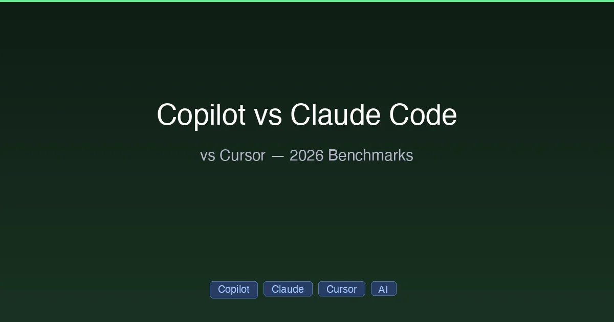

+++
date = '2026-03-02T10:00:00+08:00'
draft = false
title = 'GitHub Copilot vs Claude Code vs Cursor：2026 全面对比'
description = '深度对比 GitHub Copilot、Claude Code 和 Cursor 三大 AI 编程工具，从定价、Agent 能力、代码补全到 IDE 支持全面分析，帮你找到 2026 年最适合的 AI 编程助手。'
toc = true
tags = ['GitHub Copilot', 'Claude Code', 'Cursor', 'AI Coding Tools']
categories = ['Comparisons']
keywords = ['GitHub Copilot vs Claude Code', 'Copilot vs Cursor', 'Claude Code vs Cursor', 'best AI coding tool 2026', 'AI code assistant comparison', 'Copilot vs Claude Code vs Cursor']

[[params.faqItems]]
question = "2026 年哪个 AI 编程工具最好？"
answer = "没有绝对最好的工具。GitHub Copilot 擅长行内代码补全和多 IDE 支持；Claude Code 是处理复杂任务最强的自主 Agent；Cursor 提供最佳的集成 IDE 体验。很多开发者会同时使用两个甚至三个工具。"

[[params.faqItems]]
question = "GitHub Copilot 有免费版吗？"
answer = "有。GitHub Copilot Free 提供每月 2,000 次代码补全和 50 次聊天请求。如需更多额度，Copilot Pro 月费 $10，提供更高限额和更多模型选择。"

[[params.faqItems]]
question = "GitHub Copilot 能用 Claude 模型吗？"
answer = "可以。GitHub Copilot Pro 和 Pro+ 支持 Claude Sonnet 4 作为可选模型之一。这意味着你可以在 Copilot 界面中使用 Claude 的能力，但受 Copilot 自身的速率限制。"
+++



2026 年，三款 AI 编程工具占据主导地位：**GitHub Copilot**、**Claude Code** 和 **Cursor**。它们各自采用了根本不同的 AI 辅助开发方式——在它们之间做出选择（或组合使用）会显著影响你的开发效率。

本指南从真正重要的维度对三者进行全面对比：定价、Agent 能力、代码补全、IDE 支持以及实际使用场景。

## 30 秒快速概览

| | GitHub Copilot | Claude Code | Cursor |
|---|:---:|:---:|:---:|
| **定位** | IDE 扩展 | 终端 Agent | AI 原生 IDE |
| **最擅长** | 行内补全 | 自主任务 | 全方位 IDE 体验 |
| **最低价** | 免费 / $10/月 | $20/月 | 免费 / $20/月 |
| **高级版** | $39/月 (Pro+) | $100/月 (Max 5x) | $200/月 (Ultra) |
| **模型** | GPT-4.1, Claude Sonnet | Opus 4.6, Sonnet 4.6 | Claude, GPT, Gemini |
| **IDE 支持** | 6+ 个 IDE | 终端 + IDE 插件 | VS Code 分支 |
| **用户数** | 2000万+ | 快速增长中 | 快速增长中 |

## 定价详解

### 个人版

| 档位 | Copilot | Claude Code | Cursor |
|------|:-------:|:-----------:|:------:|
| **免费** | $0 (2K 补全/月) | 无 Code 权限 | 功能受限 |
| **入门** | $10/月 (Pro) | $20/月 (Pro) | $20/月 (Pro) |
| **进阶** | $39/月 (Pro+) | $100/月 (Max 5x) | $60/月 (Pro+) |
| **旗舰** | — | $200/月 (Max 20x) | $200/月 (Ultra) |

### 团队/企业版

| | Copilot | Claude Code | Cursor |
|---|:---:|:---:|:---:|
| **团队** | $39/用户/月 | $25–150/用户/月 | $40/用户/月 |
| **企业** | $39/用户/月 | 定制 | 定制 |
| **SOC2/SSO** | 支持 | 支持 (企业版) | 支持 (团队版) |

**性价比之王**：Copilot Pro 月费 $10 是最便宜的付费选项。其免费版每月 2,000 次补全对轻度用户来说完全够用。

**算力之王**：Claude Code Max 5x 月费 $100，得益于 5.5 倍的 Token 效率优势，每一分钱都能换来更多计算量。

Claude 详细定价请参考 [Claude 定价 2026](/posts/ai/2026-02-25-claude-code-pricing/)。

## 代码补全

日常开发中最核心的差异化因素。

### GitHub Copilot：补全之王

Copilot 开创了 AI 代码补全，至今仍是业界标杆：
- **幽灵文本**在你输入时实时出现，预测接下来的代码行
- 支持 6+ 个 IDE（VS Code、JetBrains、Xcode、Eclipse、Sublime、Visual Studio）
- 免费版每月 2,000 次补全——足够你充分评估
- 支持多行和函数级别建议

### Claude Code：没有行内补全

Claude Code 不做行内补全。它是基于对话的 Agent——你描述需求，它生成完整实现。如果你需要输入时的实时补全，需要搭配其他工具。

### Cursor：紧随其后

Cursor 的 Tab 补全非常出色——专门针对编程场景优化，具备上下文感知能力。在 Cursor IDE 内的补全质量可以媲美 Copilot，但仅限于 Cursor 内使用（不支持其他编辑器）。

### 结论

**Copilot** > **Cursor** > **Claude Code**（行内补全方面）。Copilot 全平台通用；Cursor 仅限自家 IDE；Claude Code 完全不提供此功能。

## Agent 能力

三款工具差异最大的领域。

### GitHub Copilot Agent 模式

Copilot 的 Agent 模式（2025+）在 IDE 内运行：
- 读取文件，建议多文件修改
- 运行终端命令
- 测试失败时自动修正
- GitHub 原生集成：可从 Issue 启动，创建 PR 草稿
- **Mission Control**：用于跟踪多任务 Agent 进度的仪表板

**局限性**：Agent 模式依赖 IDE，无法独立运行，也无法像 Claude Code 那样连接外部服务。

### Claude Code：自主 Agent

Claude Code 从设计之初就是一个 Agent：
- 完整的终端访问权限——可运行任何命令
- 规划跨数十个文件的多步骤实现
- [Hooks](/posts/ai/2026-02-28-claude-code-hooks-guide/) 用于确定性自动化规则
- [Skills](/posts/ai/2026-02-28-claude-code-skills-guide/) 用于可复用的领域知识
- [MCP](/posts/ai/2026-02-28-claude-code-mcp-setup/) 用于连接数据库、API 和服务
- [Agent Teams](/posts/ai/2026-02-28-claude-code-teams-guide/) 用于多 Agent 并行执行
- [Worktree](/posts/ai/2026-02-28-claude-code-worktree-guide/) 用于隔离的并行任务

### Cursor：IDE 集成 Agent

Cursor 将 Agent 能力与 IDE 便利性相结合：
- **Composer**：通过自然语言协调多文件编辑
- **Background Agents**：在后台异步运行，不影响你继续编辑
- **Cloud Agents**：在隔离 VM 中执行，生成可合并的 PR
- 最多 8 个并行 Agent
- 子 Agent 树结构处理复杂任务

### 结论

**Claude Code** > **Cursor** > **Copilot**（自主 Agent 能力方面）。Claude Code 的 Agent 生态（Hooks + Skills + MCP + Teams）是最完整的。Cursor 的 Background/Cloud Agents 令人印象深刻但更受限。Copilot 的 Agent 模式成熟度最低。

## 多文件编辑

### Copilot
在 Agent 模式下支持多文件编辑，但依赖 IDE 集成。最适合单个项目目录内的变更。

### Claude Code
大规模跨文件操作是其强项。200K–1M Token 的上下文窗口意味着它能真正理解数百个文件间的关系。框架迁移、全域重命名和架构重构是它的主场。

### Cursor
Composer 提供出色的多文件编辑体验，并有可视化反馈。语义化项目索引帮助它理解代码库结构。团队索引（2026）让新开发者可以共享已索引的项目知识。

### 结论

**Claude Code** > **Cursor** > **Copilot**（多文件操作方面，尤其是大规模场景）。Claude Code 的上下文窗口优势在大型代码库中非常显著。

## IDE 和平台支持

| 功能 | Copilot | Claude Code | Cursor |
|---------|:-------:|:-----------:|:------:|
| **VS Code** | 插件 | 插件 | 原生 (分支) |
| **JetBrains** | 插件 | 插件 | 不支持 |
| **Xcode** | 插件 | 不支持 | 不支持 |
| **Eclipse** | 插件 | 不支持 | 不支持 |
| **Sublime** | 插件 | 不支持 | 不支持 |
| **终端** | 有限支持 | 原生 | 有限支持 |
| **SSH/远程** | 通过 IDE | 原生 | 通过 IDE |
| **Web** | GitHub.dev | 不支持 | 不支持 |

**Copilot 在平台覆盖面上完胜**。它几乎支持所有主流 IDE。Claude Code 以终端为原生环境并提供 IDE 插件。Cursor 仅在自家 IDE 中运行。

## GitHub 集成

| 功能 | Copilot | Claude Code | Cursor |
|---------|:-------:|:-----------:|:------:|
| Issue → Agent → PR | 原生支持 | 手动 | 不支持 |
| PR 审查 | 内置 | 通过 CLI | 不支持 |
| Copilot Workspace | 支持 | 不支持 | 不支持 |
| 仓库上下文 | 自动 | 通过 CLAUDE.md | 通过索引 |

**Copilot 胜出**（GitHub 中心化工作流）。如果你的团队以 GitHub Issues 和 PR 为核心，Copilot 的原生集成无可匹敌。

## 选择指南

| 如果你... | 最佳选择 |
|-----------|:----------:|
| 需要行内代码补全 | **Copilot** ($10) |
| 跨多个 IDE 工作 | **Copilot** |
| 想要最便宜的方案 | **Copilot Free** ($0) |
| 需要自主多文件重构 | **Claude Code** ($100) |
| 偏好终端优先的自动化 | **Claude Code** |
| 需要 MCP/外部服务集成 | **Claude Code** |
| 想要最佳 IDE 体验 | **Cursor** ($20) |
| 大量前端/UI 开发工作 | **Cursor** |
| 想要多模型灵活切换 | **Cursor** |
| 在 GitHub 中心化团队工作 | **Copilot** ($39/用户) |
| 需要灵活的预算控制 | **Claude Code API** |

## 最佳组合方案

2026 年效率最高的开发者不会只用一款工具。以下是经过验证的组合方案：

### 经济组合：$30/月
```
Copilot Pro ($10) + Claude Code Pro ($20)
├── Copilot：在任意 IDE 中使用行内补全
└── Claude Code：处理复杂任务和架构决策
```

### 强力组合：$120/月
```
Cursor Pro ($20) + Claude Code Max 5x ($100)
├── Cursor：日常编辑、可视化调试、快速迭代
└── Claude Code：大型重构、自动化、Agent 团队协作
```

### 全栈组合：$130/月
```
Copilot Pro ($10) + Cursor Pro ($20) + Claude Code Max 5x ($100)
├── Copilot：JetBrains/Xcode 代码补全
├── Cursor：主力 VS Code 编辑环境
└── Claude Code：自主处理重型任务
```

## 最终结论

每款工具都有明确的核心优势：

- **GitHub Copilot**：最佳**代码补全**和**多 IDE 支持**。如果你想在不改变工作流的前提下获得 AI 辅助，从这里开始。
- **Claude Code**：最强**自主 Agent**，擅长**复杂任务**。适合架构决策、大规模重构和自动化场景。
- **Cursor**：最佳**集成 IDE 体验**。适合追求深度 AI 增强编辑环境的开发者。

**市场正走向专业化，而非大一统。** 与其寻找一个万能工具，不如根据各工具的优势进行组合，这才是制胜策略。

---

*对比数据截至 2026 年 2 月。*

## 相关阅读

- [Claude Code vs Cursor 2026: Which AI Coding Tool Wins?](/posts/ai/2026-02-28-claude-code-vs-cursor/) — 深度双向对比
- [Claude Code Guide 2026](/posts/ai/2026-02-28-claude-code-complete-guide/) — Claude Code 完整指南
- [Claude Pricing 2026](/posts/ai/2026-02-25-claude-code-pricing/) — 完整定价分析及竞品基准对比
- [Claude Rate Limits 2026](/posts/ai/2026-02-28-claude-rate-limits/) — 各方案用量限制详解
