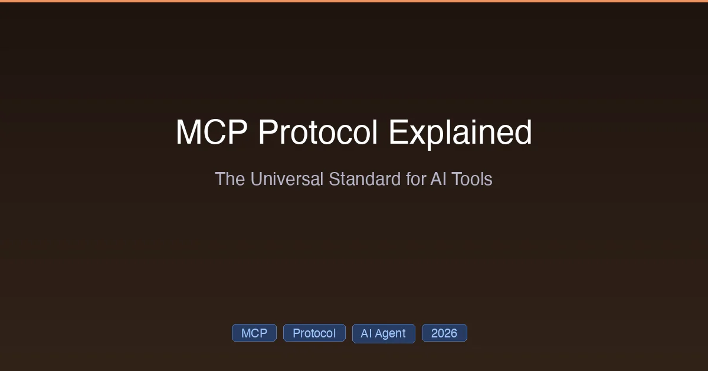

+++
date = '2026-03-02T14:00:00+08:00'
draft = false
title = 'MCP Protocol Explained: The Universal Standard for AI Tools'
description = 'What is Model Context Protocol (MCP) and why it matters in 2026. Architecture, tools vs resources vs prompts, building servers, and MCP vs function calling.'
toc = true
tags = ['MCP', 'AI Agent', 'Protocol', 'Claude Code']
categories = ['AI Guides']
keywords = ['MCP protocol', 'Model Context Protocol', 'MCP explained', 'MCP vs function calling', 'MCP server', 'MCP architecture', 'what is MCP', 'MCP 2026']

[[params.faqItems]]
question = "What is MCP (Model Context Protocol)?"
answer = "MCP is an open standard created by Anthropic that lets AI applications connect to external tools and data sources through a universal protocol. Think of it as USB-C for AI — one standard interface that works with any AI tool and any external service."

[[params.faqItems]]
question = "Is MCP only for Claude?"
answer = "No. While Anthropic created MCP, it has been adopted by OpenAI, Google DeepMind, and many other AI providers. Tools supporting MCP include Claude Code, Cursor, VS Code, ChatGPT, and Windsurf. MCP was donated to the Linux Foundation in December 2025."

[[params.faqItems]]
question = "What is the difference between MCP and function calling?"
answer = "Function calling lets an LLM output structured calls to predefined functions. MCP is a full interaction protocol covering discovery, invocation, and response handling. MCP servers are reusable across any MCP-compatible AI tool, while function calling is typically tied to a specific provider."
+++



Every AI coding tool needs to connect to external services — databases, APIs, cloud platforms, project management tools. Before MCP, each connection required custom integration code. Build it for Claude Code? Rebuild it for Cursor. Rebuild it again for Copilot.

**Model Context Protocol (MCP)** solves this with a universal standard: build one integration, and it works with every AI tool that supports MCP.

Think of MCP as **USB-C for AI**. Before USB-C, every device had its own charger. MCP does the same thing for AI tool integrations — one protocol that connects any AI to any external service.

This guide explains what MCP is, how it works, and why it's becoming the default standard for AI development in 2026.

## Why MCP Matters

Before MCP, connecting an AI tool to a service like Slack required:
1. Writing custom API integration code
2. Handling authentication, error handling, rate limiting
3. Building the interface between the AI's capabilities and the API
4. **Repeating all of this for every AI tool you use**

With MCP:
1. Someone builds an MCP server for Slack **once**
2. Every MCP-compatible tool (Claude Code, Cursor, VS Code, ChatGPT) can use it immediately
3. No custom integration code needed

**The result**: Organizations report **40–60% faster** AI agent deployment after adopting MCP.

## How MCP Works

### The Architecture

MCP uses a client-server architecture with four key roles:

```
┌─────────────┐     ┌──────────────┐     ┌──────────────┐
│  Host App    │     │  MCP Client  │     │  MCP Server  │
│  (Claude     │────▶│  (built into │────▶│  (Slack,      │
│   Code)      │     │   the host)  │     │   GitHub,     │
│              │     │              │     │   database)   │
└─────────────┘     └──────────────┘     └──────────────┘
```

- **Host Application**: The AI tool you're using (Claude Code, Cursor, etc.)
- **MCP Client**: Built into the host, handles communication with servers
- **MCP Server**: Provides access to a specific external service
- **Transport Layer**: How messages travel between client and server

### The Three Primitives

Every MCP server can expose three types of capabilities:

#### 1. Tools — Executable Actions

Tools are functions the AI can call to perform actions:

```json
{
  "name": "send_slack_message",
  "description": "Send a message to a Slack channel",
  "parameters": {
    "channel": "string",
    "message": "string"
  }
}
```

When an AI needs to **do something** — send a message, query a database, create a file — it calls a tool.

#### 2. Resources — Data Access

Resources provide read access to data:

```json
{
  "uri": "file:///project/README.md",
  "name": "Project README",
  "mimeType": "text/markdown"
}
```

When an AI needs to **know something** — read a file, fetch a database record, access documentation — it reads a resource.

#### 3. Prompts — Reusable Instructions

Prompts are templates that guide how the AI should use tools and resources:

```json
{
  "name": "code_review",
  "description": "Review code for security issues",
  "arguments": ["file_path"]
}
```

When an AI needs to **follow a specific workflow** — code review, deployment checklist, bug triage — it uses a prompt.

**How they work together**: A Prompt structures the intent → a Tool executes the action → a Resource provides or captures the data.

### Transport Mechanisms

MCP supports multiple ways for clients and servers to communicate:

| Transport | How It Works | Best For |
|-----------|-------------|----------|
| **stdio** | Server runs as subprocess, communicates via stdin/stdout | Local development |
| **HTTP + SSE** | Client sends POST requests, server streams responses via Server-Sent Events | Network deployments |
| **Streamable HTTP** | Enhanced HTTP with streaming support | Real-time applications |

The transport layer is **abstracted** — you can switch from local stdio to remote HTTP without changing your server logic.

## The MCP Ecosystem in 2026

### Which Tools Support MCP

| Tool | MCP Support | Notes |
|------|:-----------:|-------|
| **Claude Code** | Native | Best integration — per-agent config, tool search, plugin servers |
| **Cursor** | Native | One-click setup, 40-tool limit per project |
| **VS Code** | Extension | Via MCP extension |
| **ChatGPT** | Supported | MCP Apps integration |
| **Windsurf** | Supported | Basic integration |
| **Goose** | Supported | AI agent with MCP |

### Popular MCP Servers

The [official MCP servers repository](https://github.com/modelcontextprotocol/servers) hosts community-maintained servers for common services:

**Development**:
- GitHub — repository operations, issues, PRs
- Git — local repository management
- Filesystem — file read/write operations
- Docker — container management

**Communication**:
- Slack — channel messaging, search
- Email — send and read emails

**Data**:
- PostgreSQL, MySQL — database queries
- Google Sheets — spreadsheet operations
- Notion — workspace access

**Cloud**:
- AWS — service management
- Cloudflare — edge computing

### MCP Apps: Interactive UI (January 2026)

The first official MCP extension, **MCP Apps**, allows servers to render interactive UI within AI conversations:

- Dashboards, forms, visualizations
- Multi-step workflows with user input
- Launch partners: Amplitude, Asana, Box, Canva, Clay, Figma, Hex, monday.com, Slack

This means an MCP server can not only execute actions but also **show you results** with rich visualizations — directly inside your Claude or ChatGPT conversation.

### GitHub MCP Registry

GitHub launched an official MCP Registry as the central hub for discovering and publishing MCP servers. This makes finding and installing the right MCP server as easy as finding an npm package.

## Building Your Own MCP Server

### Available SDKs

| Language | SDK | Maturity |
|----------|-----|:--------:|
| **Python** | `mcp` (FastMCP) | Most mature |
| **TypeScript** | `@modelcontextprotocol/sdk` | Production-ready |
| **C# / .NET** | Official SDK | Growing |

### Quick Example: Weather Server (TypeScript)

A minimal MCP server that provides weather data:

```typescript
import { McpServer } from "@modelcontextprotocol/sdk/server/mcp.js";
import { StdioServerTransport } from "@modelcontextprotocol/sdk/server/stdio.js";

const server = new McpServer({ name: "weather", version: "1.0.0" });

// Define a tool
server.tool("get_forecast", { city: "string" }, async ({ city }) => {
  const data = await fetch(`https://api.weather.com/forecast?city=${city}`);
  const forecast = await data.json();
  return { content: [{ type: "text", text: JSON.stringify(forecast) }] };
});

// Start the server
const transport = new StdioServerTransport();
await server.connect(transport);
```

For a complete tutorial on building and deploying MCP servers, see [Claude Code MCP Setup](/posts/ai/2026-02-28-claude-code-mcp-setup/).

## MCP vs Alternatives

### MCP vs Function Calling

| | Function Calling | MCP |
|---|---|---|
| **What it is** | LLM outputs structured function calls | Full interaction protocol |
| **Scope** | Single function invocation | Discovery + invocation + responses |
| **Portability** | Provider-specific (OpenAI, Anthropic) | Universal standard |
| **Ecosystem** | Per-application | Shared servers across all tools |
| **Complexity** | Simple | More comprehensive |

**When to use function calling**: Quick, provider-specific integrations where you only need one AI tool.

**When to use MCP**: Any integration you want to reuse across multiple AI tools or share with the community.

### MCP vs LangChain Tools

| | LangChain | MCP |
|---|---|---|
| **What it is** | Development framework | Communication protocol |
| **Focus** | Rapid development, chaining | Standardization, reusability |
| **Integration** | Framework-specific | Universal standard |
| **Interop** | LangChain has MCP adapters | Works with any MCP client |

**They're complementary**: LangChain can call MCP servers through its adapter, giving you framework convenience with MCP's ecosystem.

### MCP vs Custom API Integrations

The "before and after":

**Without MCP** (custom integration):
- Build API wrapper for Slack → for Claude Code
- Build API wrapper for Slack → for Cursor
- Build API wrapper for Slack → for your custom tool
- Maintain 3 separate integrations

**With MCP**:
- Install one MCP server for Slack
- Works with Claude Code, Cursor, and your custom tool
- Maintain one integration

## Security Considerations

MCP's openness brings security challenges:

### Key Risks

1. **Authentication gaps**: A 2025 audit found most public MCP servers lacked proper authentication
2. **Token aggregation**: MCP servers often store tokens for multiple services — compromising one server exposes all connected services
3. **Session hijacking**: Servers must validate all inbound requests independently

### Best Practices

- Always use authentication for production MCP servers
- Implement the principle of least privilege for tool permissions
- Monitor server access logs
- Keep MCP server dependencies updated
- Use the official [security best practices](https://modelcontextprotocol.io/specification/draft/basic/security_best_practices)

For more on MCP security, see [Claude Code MCP Setup: Security section](/posts/ai/2026-02-28-claude-code-mcp-setup/).

## What's Next for MCP

MCP is transitioning from early adoption to enterprise standard:

| Timeline | Milestone |
|----------|-----------|
| Nov 2024 | Anthropic launches MCP |
| Early 2025 | OpenAI and Google adopt MCP |
| Dec 2025 | MCP donated to Linux Foundation (Agentic AI Foundation) |
| Jan 2026 | MCP Apps launched (interactive UI) |
| 2026 | Enterprise-ready adoption at scale |

The trajectory is clear: MCP is becoming the **default way AI tools connect to external services**. Learning it now puts you ahead of the curve.

---

*MCP specification current as of February 2026. See [modelcontextprotocol.io](https://modelcontextprotocol.io/) for the latest.*

## Related Reading

- [Claude Code MCP Setup: Connect AI to Any External Service](/posts/ai/2026-02-28-claude-code-mcp-setup/) — Hands-on MCP server installation and creation
- [Claude Code Guide 2026](/posts/ai/2026-02-28-claude-code-complete-guide/) — Complete Claude Code overview
- [Claude Code Hooks Guide](/posts/ai/2026-02-28-claude-code-hooks-guide/) — Automation rules that complement MCP
- [Claude Code vs Cursor 2026](/posts/ai/2026-02-28-claude-code-vs-cursor/) — Tool comparison including MCP support
