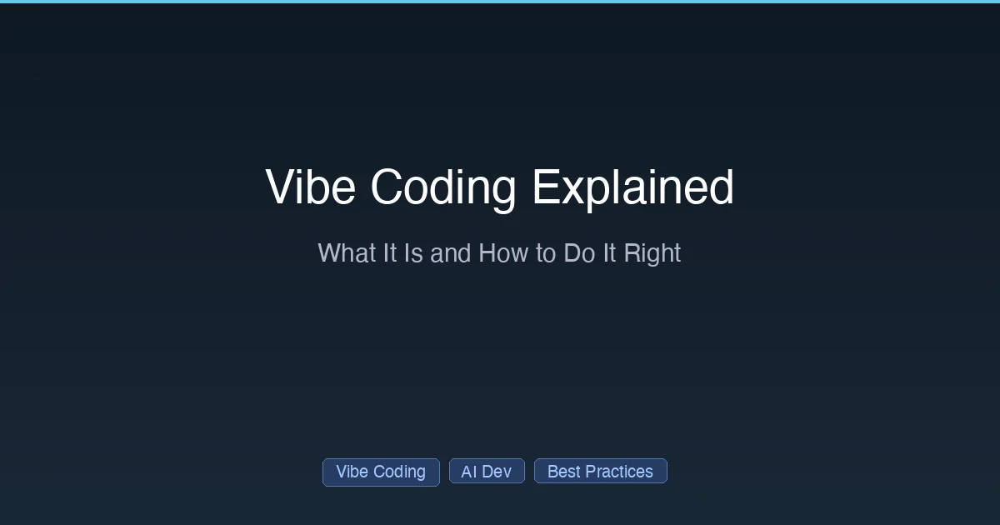

+++
date = '2026-03-03T10:00:00+08:00'
draft = false
title = 'Vibe Coding 详解：它是什么，怎样才能用好？'
description = '什么是 Vibe Coding？由 Andrej Karpathy 提出的 AI 开发方式。了解其工作流程、最佳工具、安全风险以及 2026 年的最佳实践。'
toc = true
tags = ['Vibe Coding', 'AI Development', 'Best Practices', 'Claude Code']
categories = ['AI Guides']
keywords = ['vibe coding', '什么是 vibe coding', 'vibe coding 详解', 'vibe coding 最佳实践', 'vibe coding 工具', 'Andrej Karpathy vibe coding', 'vibe coding 安全', 'vibe coding 2026']

[[params.faqItems]]
question = "什么是 Vibe Coding？"
answer = "Vibe Coding 是一种开发方式：你用自然语言描述需求，让 AI 生成代码。这个概念由 Andrej Karpathy 在 2025 年 2 月提出，意思是「完全沉浸在氛围中」——你负责把控方向，而不是逐行编写代码。"

[[params.faqItems]]
question = "Vibe Coding 安全吗？"
answer = "如果不加防范，并不安全。研究表明 45% 的 AI 生成代码包含 OWASP Top-10 漏洞。Vibe Coding 适合原型和内部工具，但生产代码必须经过安全审查、测试和人工把关。"

[[params.faqItems]]
question = "Vibe Coding 的最佳工具有哪些？"
answer = "Claude Code 用于终端自主开发，Cursor 用于 IDE 集成 Agent 模式，Replit Agent 用于云端快速原型，v0/Lovable/Bolt 用于快速生成 Web 应用。大多数开发者在正式项目中使用 Claude Code 或 Cursor。"

[[params.faqItems]]
question = "Vibe Coding 会取代传统编程吗？"
answer = "不会。Vibe Coding 将开发者的角色从代码编写者转变为代码导演——你仍然需要理解架构、安全、测试和系统设计。编程知识变得更加重要，因为你需要评估和引导 AI 的输出。"
+++



2025 年 2 月，OpenAI 联合创始人、前 Tesla AI 总监 Andrej Karpathy 在 X 上发了这样一段话：

> "有一种新的编程方式我称之为'vibe coding'，你完全沉浸在氛围中，拥抱指数级增长，忘记代码的存在。"

这条帖子定义了一场运动。"Vibe coding"成为 [Collins 词典 2025 年度词汇](https://www.collinsdictionary.com/word-of-the-year)，被收入 [Merriam-Webster](https://www.merriam-webster.com/)，并引发了软件工程领域自"Tab 还是空格"以来最激烈的争论。

到 2026 年，Vibe Coding 不再只是一个梗——它已经成为被初创公司、企业团队和独立开发者广泛使用的正式开发方法。但它也常被误解、误用，有时甚至带来危险。

本文将详细解释 Vibe Coding 到底是什么，什么时候该用，什么时候该避免，以及如何负责任地使用它。

## Vibe Coding 到底意味着什么

### 核心理念

传统编程：**你亲手编写每一行代码。**
AI 辅助编程：**你编写代码，AI 提供补全建议。**
Vibe Coding：**你描述需求，AI 编写代码，你把控方向，不必逐行阅读每行代码。**

关键区别在于最后一点。在 Vibe Coding 中，你有意**不去**审查每一行生成的代码。你通过行为来评估输出——应用能跑吗？看起来对吗？测试通过了吗？——而不是阅读源码。

### 工作流程

```
1. 用自然语言描述你的需求
2. AI 生成代码
3. 测试结果（运行、点击查看）
4. 如果出错：把错误信息粘贴给 AI
5. 如果正常：进入下一个功能
6. 重复
```

注意缺少了什么：阅读生成的代码、理解具体实现、或手动修复问题。这是有意为之——你将实现工作委托给 AI，自己专注于方向和验证。

### 开发者角色的变化

| 传统编程 | Vibe Coding |
|---------|-------------|
| 编写代码 | 描述意图 |
| 逐行调试 | 把错误信息粘贴给 AI |
| 了解每个实现细节 | 了解架构和需求 |
| 重度依赖键盘 | 重度依赖对话（有些人用语音） |
| 关注"怎么做" | 关注"做什么"和"为什么" |

## Vibe Coding 适用场景

Vibe Coding 并非万能。以下是它表现出色的场景：

### 非常适合

- **原型和 MVP**：几小时而非几天就能拿到可用 Demo
- **内部工具**：管理后台、数据脚本、自动化任务
- **个人项目**：不需要做到完美的副业项目
- **学习探索**：快速熟悉新框架或新语言
- **模板代码**：标准 CRUD 操作、API 端点、表单处理
- **前端布局**：UI 组件、样式、响应式设计

### 有风险

- **安全关键代码**：认证、支付处理、加密
- **性能关键系统**：数据库查询、实时处理
- **长期生产代码**：团队要维护多年的代码
- **受监管行业**：医疗、金融、法律合规

### 危险

- **你完全不理解的代码**：如果你无法评估 AI 的方案在架构上是否合理，Vibe Coding 就是在埋定时炸弹
- **处理敏感数据的系统**：AI 生成的代码经常暴露 API 密钥、跳过输入验证或使用不安全的默认配置

## 安全问题

这是房间里的大象。研究一致表明：

- **45%** 的 AI 生成代码包含 [OWASP Top-10](https://owasp.org/www-project-top-ten/) 漏洞
- **20%** 的 Vibe Coding 应用存在严重安全缺陷（Wiz 研究）
- 使用 AI 辅助的开发者对代码安全**更自信**——但实际上产生了**更多漏洞**

### Vibe Coding 应用中的常见漏洞

| 漏洞类型 | 后果 | 出现频率 |
|---------|------|:-------:|
| 缺少输入验证 | XSS、SQL 注入 | 非常常见 |
| 硬编码 API 密钥 | 凭证泄露 | 常见 |
| 不安全的反序列化 | 远程代码执行 | 中等 |
| 缺少权限检查 | 未授权访问 | 常见 |
| 对用户输入使用 `eval()` | 任意代码执行 | 中等 |

### 虚假自信问题

研究揭示了一个悖论：使用 AI 的开发者对自己代码的安全性**更加自信**，但实际上产生的**漏洞比手动编写代码的开发者更多**。这种"虚假自信"是 Vibe Coding 最大的风险。

## Vibe Coding 工具

### 终端 Agent（适合正式项目）

**[Claude Code](/posts/ai/2026-02-28-claude-code-complete-guide/)** — 最强大的自主编码 Agent。给它一个任务，它会自动规划、实现、测试和迭代。最适合后端开发、CLI 工具和复杂的多文件项目。

**Codex CLI** — OpenAI 的终端 Agent，类似概念，使用 GPT 模型。

### IDE Agent

**[Cursor](/posts/ai/2026-02-28-claude-code-vs-cursor/)** — AI 原生 IDE，Composer 模式非常适合 Vibe Coding。最适合有视觉反馈需求的全栈开发。

**Windsurf** — 按额度计费的经济型选择。

### Web 应用构建器

**v0 (Vercel)** — 通过描述生成 React/Next.js 组件。Web 项目中代码质量最高。

**Lovable** — 全 Web 应用生成，自带部署。

**Bolt** — 轻量级，快速原型。

**Replit Agent** — 云端开发，即时部署。

### 工具选择指南

| 场景 | 最佳工具 |
|-----|---------|
| 后端 / CLI / 脚本 | Claude Code |
| IDE 中的全栈开发 | Cursor |
| React/Next.js UI | v0 |
| 快速 Web 应用 | Lovable 或 Bolt |
| 学习 / 实验 | Replit Agent |

## 如何负责任地使用 Vibe Coding

### 1. 先想架构，再写代码

在打开任何 AI 工具之前，先明确：
- 这个系统需要做什么？
- 安全需求是什么？
- 数据模型是什么样的？
- API 应该怎么设计？

Vibe Coding 在你清楚**做什么**、让 AI 处理**怎么做**的时候效果最好。

### 2. 使用 CLAUDE.md 或 Cursor Rules

在 AI 生成任何代码之前，先给它项目上下文。一个结构良好的 [CLAUDE.md 文件](/posts/ai/2026-02-28-claude-code-claudemd-guide/)能防止 AI 做出让你后悔的架构决策。

### 3. 测试一切

既然你不会逐行阅读代码，测试就是你的安全网：

```
# 每次 AI 生成后都运行应用
# 点击每个功能验证
# 检查 AI 可能遗漏的边界情况
# 对关键路径使用自动化测试
```

### 4. 审查安全关键代码

即使在完全 Vibe 模式下，也**务必手动审查**：
- 认证和授权逻辑
- 支付处理
- 数据加密
- API 密钥处理
- 用户输入处理

### 5. 从一开始就使用版本控制

每个可用状态都 commit。当 AI 在三次迭代之后引入了一个隐蔽的 bug，你需要能回滚。

### 6. 知道何时停止 Vibe

Vibe Coding 在从 0 到 80% 的阶段非常出色。最后的 20%——优化、安全加固、边界情况——通常需要传统的开发技能。

## 斯坦福 CS146S 的视角

斯坦福的 CS146S 课程"现代软件开发者"教授了一整套课程，学生在其中**不用手动编写代码**就能完成项目。但这门课的理念是细致入微的：

**核心原则**：
1. **"LLM 的水平取决于你的水平"** — AI 输出的质量取决于你引导它的能力
2. **"不写代码"意味着"不写模板代码"** — 学生仍需理解架构、安全和测试
3. **第 6 周专门讲安全** — 因为 Vibe Coding 会放大安全风险

斯坦福的方法表明，Vibe Coding 不是放弃编程知识——而是将编程知识从编写代码**重新导向**到评估、指导和保障 AI 生成代码的安全。

## 争论：Vibe Coding 是好还是坏？

### 乐观派认为

- 让软件开发更加民主化
- 让有经验的开发者效率提升 10 倍
- 让开发者专注于设计和架构
- 消除了繁琐的模板代码工作

### 批评派认为

- 产出难以维护的代码
- 导致开发者技能退化
- 隐藏安全漏洞
- "能用但没人知道为什么"是一种隐患

### 务实的观点

Vibe Coding 是一种**工具，而非信仰**。和所有工具一样，正确使用时威力巨大，盲目使用时危险重重。

在 2026 年真正用好 Vibe Coding 的开发者：
- 基本功扎实（架构、安全、测试）
- 知道什么时候该 Vibe，什么时候该看代码
- 把 AI 输出当草稿，而非成品
- 安全关键代码绝不跳过审查

## 开始使用 Vibe Coding

如果你想负责任地尝试 Vibe Coding：

1. **安装 [Claude Code](/posts/ai/2026-02-25-claude-code-setup-guide/)** 或 **Cursor** — 目前最强的两个工具
2. **从低风险项目开始** — 内部工具、个人项目、原型
3. **配置 [CLAUDE.md](/posts/ai/2026-02-28-claude-code-claudemd-guide/)** — 给 AI 你的项目上下文
4. **用自然语言描述功能** — 对需求描述要具体
5. **测试每个输出** — 运行它、点击它、尝试打破它
6. **提交可用状态** — 版本控制是你的安全网
7. **手动审查安全代码** — 认证/支付/加密相关永远不要盲信 AI

---

*Vibe Coding 正在快速演进。本指南反映了 2026 年 2 月的实践现状。*

## 延伸阅读

- [Claude Code 完全指南 2026](/posts/ai/2026-02-28-claude-code-complete-guide/) — 最强 Vibe Coding 工具的完整指南
- [Claude Code 安装教程](/posts/ai/2026-02-25-claude-code-setup-guide/) — 10 分钟上手
- [Claude Code 新手常犯的 10 个错误](/posts/ai/2026-02-25-claude-code-mistakes/) — 避免常见陷阱
- [Claude Code vs Cursor 2026](/posts/ai/2026-02-28-claude-code-vs-cursor/) — 两大 Vibe Coding 工具对比
- [CLAUDE.md 指南](/posts/ai/2026-02-28-claude-code-claudemd-guide/) — 提升 AI 输出质量的项目上下文配置
