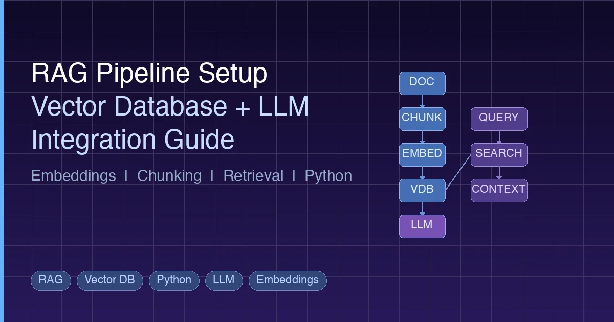

+++
date = '2026-03-01T10:00:00+08:00'
draft = false
title = 'RAG 管道搭建指南：向量数据库 + LLM 集成实战'
description = '完整的 RAG 管道搭建教程，涵盖向量数据库选型、Embedding 策略、文本分块方法，以及基于 OpenAI、Chroma 和 Qdrant 的 Python 代码实战。'
toc = true
tags = ['RAG', 'Vector Database', 'Python', 'LLM', 'Embeddings']
categories = ['AI Guides']
keywords = ['rag pipeline tutorial', 'vector database guide', 'rag setup python', 'retrieval augmented generation', 'embedding database tutorial', 'vector database comparison', 'chunking strategies RAG', 'HNSW indexing', 'chroma vector database', 'qdrant tutorial']

[[params.faqItems]]
question = "什么是 RAG 管道？为什么需要它？"
answer = "RAG（检索增强生成）管道通过将文档转换为向量嵌入、存储到向量数据库中，并在查询时检索相关上下文来将私有数据连接到 LLM。它解决了 LLM 知识截止日期的问题，让你无需昂贵的微调即可基于自有数据生成回答。"

[[params.faqItems]]
question = "2026 年做 RAG 应该选哪个向量数据库？"
answer = "原型开发和小数据集建议使用 Chroma 或 pgvector。中等规模的生产环境推荐 Qdrant 和 Weaviate。大规模分布式部署首选 Milvus。如果需要全托管服务且预算充足，可以选择 Pinecone。"

[[params.faqItems]]
question = "RAG 最佳的文本分块策略是什么？"
answer = "没有万能的最佳策略。固定大小分块（300-500 token，50-100 token 重叠）是不错的起点。递归字符分割更适合结构化文档。语义分块质量最高但速度较慢。务必针对你的具体数据和场景测试不同策略。"

[[params.faqItems]]
question = "什么时候用 RAG，什么时候用微调或长上下文窗口？"
answer = "当你需要查询大型、频繁更新的知识库并需要来源归因时使用 RAG。当需要模型学习特定风格、格式或领域行为时使用微调。当文档集较小且固定、可以全部放入 prompt 时使用长上下文窗口。许多生产系统会组合使用这三种方式。"
+++



大语言模型（LLM）非常强大，但有两个根本性的局限：知识截止于训练数据的日期，而且对你的私有数据一无所知。检索增强生成（RAG）通过在查询时将 LLM 连接到外部知识库来解决这两个问题。

本指南将带你从零搭建一套完整的 RAG 管道。你将了解 Embedding 的工作原理、如何选择向量数据库、如何实施有效的分块策略，以及如何用 Python 把所有组件串联起来。无论你是在构建客服机器人、文档助手，还是[带记忆的 AI Agent](/posts/ai/2026-02-21-ai-agent-memory-systems/)，RAG 管道都是基础设施。

## 什么是 RAG？为什么重要？

RAG 全称是检索增强生成（Retrieval-Augmented Generation）。概念很简单：在让 LLM 生成回答之前，先从你的知识库中检索相关信息，然后将其注入到 prompt 中。

RAG 解决了这样的问题：

```
没有 RAG：
  用户："我们公司的退款政策是什么？"
  LLM："我没有你公司的具体政策信息……"

使用 RAG：
  用户："我们公司的退款政策是什么？"
  系统：[检索 refund-policy.pdf 片段] → 注入到 prompt
  LLM："根据你的政策文档，30天内可以退款……"
```

### 为什么不直接用更长的上下文窗口？

现代 LLM 支持 100K+ token 的上下文窗口。为什么不把所有文档都塞进 prompt？

三个原因：

1. **成本** —— 每次查询发送 100K token 非常烧钱。RAG 通常只发送 1-3K token 的相关上下文。
2. **准确率** —— LLM 在处理长上下文时表现会下降。埋在大段 prompt 中间的关键信息往往会被忽略（"迷失在中间"问题）。
3. **规模** —— 你的知识库可能包含数百万文档。再大的上下文窗口也放不下。

RAG 让你两全其美：利用 LLM 的推理能力，同时结合你数据中精确且最新的信息。

## Embedding 简明解释

RAG 背后的核心技术是 Embedding —— 一种将文本转换为能捕捉语义的数字表示的方法。

### 文本转向量

Embedding 模型接收一段文本，输出一个向量 —— 一组浮点数列表，通常包含 768 到 3072 个维度：

```python
from openai import OpenAI
client = OpenAI()

response = client.embeddings.create(
    model="text-embedding-3-small",
    input="How do I reset my password?"
)

vector = response.data[0].embedding
print(f"Dimensions: {len(vector)}")  # 1536
print(f"First 5 values: {vector[:5]}")
# [0.0123, -0.0456, 0.0789, -0.0234, 0.0567]
```

关键洞察：**语义相似的文本会产生相似的向量**。"How do I reset my password?" 和 "I forgot my login credentials" 的向量在嵌入空间中非常接近，即使它们几乎没有共同的词。

### 相似度度量

如何衡量向量之间的"接近程度"？三种常用方法：

| 度量方式 | 衡量内容 | 最适用场景 |
|---------|---------|----------|
| **余弦相似度** | 向量之间的夹角（0 到 1） | 大多数文本检索任务 |
| **欧氏距离** | 直线距离 | 需要考虑向量大小时 |
| **点积** | 夹角与大小的综合 | 归一化向量 |

余弦相似度是文本搜索的默认选择。它只关注方向而不关注大小，这使其在比较不同长度的文本时更加稳健。

### 2026 年主流 Embedding 模型

| 模型 | 维度 | 提供商 | 备注 |
|------|-----|--------|------|
| `text-embedding-3-large` | 3072 | OpenAI | 质量最好，成本较高 |
| `text-embedding-3-small` | 1536 | OpenAI | 质量与成本的平衡之选 |
| `voyage-3` | 1024 | Voyage AI | 代码和技术内容表现突出 |
| `BGE-M3` | 1024 | BAAI（开源） | 多语言，可自托管 |
| `GTE-Qwen2` | 1024 | 阿里巴巴（开源） | 可与商业模型媲美 |
| `nomic-embed-text` | 768 | Nomic（开源） | 轻量级，可在 CPU 上运行 |

大多数项目建议从 `text-embedding-3-small` 起步，性能强、成本低。如果需要自托管，BGE-M3 或 Nomic 是不错的开源选择。

## 2026 年向量数据库格局

有了 Embedding 之后，你需要一个地方来高效存储和搜索它们。这就是向量数据库的用武之地。

### 为什么不能用普通数据库？

传统数据库使用 B-tree 索引进行精确匹配和范围查询。向量搜索本质上不同 —— 你需要在可能数百万个高维向量中，以毫秒级速度找到"与这个向量最相似的 10 个"。

这需要普通数据库不具备的专用索引算法（下文详述）。如果在 PostgreSQL 中存储 100 万个 1536 维向量并逐一计算余弦相似度，每次查询需要几秒而非几毫秒。

### 对比表

| 数据库 | 类型 | 语言 | 最适用场景 | 部署方式 |
|-------|------|------|----------|---------|
| **Chroma** | 嵌入式 | Python | 原型开发、小型项目 | 本地 |
| **pgvector** | PG 扩展 | C | 已使用 PostgreSQL 的团队 | 自托管/云 PG |
| **Qdrant** | 专用 | Rust | 生产环境，丰富的过滤功能 | 自托管/云 |
| **Weaviate** | 专用 | Go | 多模态，内置向量化器 | 自托管/云 |
| **Milvus** | 专用 | Go/C++ | 大规模分布式部署 | 自托管/Zilliz Cloud |
| **Pinecone** | 托管 SaaS | -- | 零运维，托管基础设施 | 仅云端 |

### 快速选型指南

- **只是实验？** 用 Chroma。进程内运行，无需服务器。
- **已经在用 PostgreSQL？** 添加 pgvector。无需新增基础设施。
- **生产环境 < 1000 万向量？** Qdrant 或 Weaviate。两者都性能出色且易于部署。
- **超大规模生产？** Milvus。专为分布式负载而生。
- **没有运维团队？** Pinecone。全托管但更贵。

## 索引算法解析

向量数据库通过近似最近邻（ANN）算法实现快速搜索。"近似"是关键词 —— 为了速度，用少量精度换取巨大的性能提升。

### HNSW（层次化可导航小世界图）

2026 年最流行的算法。HNSW 构建多层图结构：

- **顶层**：稀疏图，包含远距离连接（用于快速缩小搜索区域）
- **中间层**：逐渐变密的图
- **底层**：密集图，包含近距离连接（用于精确的局部搜索）

查询时，算法从顶层开始逐层向下"跳跃"，每一跳都更接近目标。

```
Layer 3:  A -------- D                    (稀疏，远距离跳跃)
Layer 2:  A --- B -- D --- F              (中等密度)
Layer 1:  A - B - C - D - E - F - G      (密集，短距离跳跃)
Layer 0:  A B C D E F G H I J K L M      (所有节点)
```

**优点**：查询速度快，召回率高（通常 95%+）
**缺点**：内存消耗大（图结构本身占用 RAM），索引构建慢

HNSW 是 Qdrant、Weaviate 和 pgvector 的默认算法。

### IVF（倒排文件索引）

IVF 使用 K-means 预先将向量聚类，查询时只搜索最近的若干聚类：

1. **索引时**：使用 K-means 将所有向量划分为 K 个聚类
2. **查询时**：找到最近的 `nprobe` 个聚类，在这些聚类内穷举搜索

**优点**：内存占用比 HNSW 低，索引构建快
**缺点**：召回率低于 HNSW，需要调优 `nprobe`

### PQ（乘积量化）

PQ 通过将向量分割为子向量并分别量化来压缩向量：

1. 将 1536 维向量分割为 192 个 8 维子向量
2. 对每个子向量位置，学习 256 个代表性质心
3. 用最近质心的 ID（1 字节）替换每个子向量

结果：一个 1536 维 float32 向量（6144 字节）变成 192 字节的压缩编码。

**优点**：大幅减少内存（通常 10-30 倍压缩）
**缺点**：量化损失导致精度降低

实际中，PQ 通常与 IVF 组合使用（IVF-PQ），适用于内存受限的大规模系统。

### 如何选择算法？

| 场景 | 算法 | 原因 |
|------|------|------|
| < 100 万向量，质量优先 | HNSW | 最佳召回率，查询快 |
| 100-1000 万向量，内存受限 | IVF-PQ | 内存和速度的平衡 |
| > 1000 万向量，分布式 | IVF-PQ 或 HNSW + 分片 | 水平扩展 |
| 原型开发 | Flat（暴力搜索） | 完美召回率，简单 |

## 分步构建 RAG 管道

现在来构建一套完整的 RAG 管道。架构分为六个阶段：

```
文档加载 → 分块 → Embedding → 存储 → 检索 → 生成
```

### 第一步：文档加载

加载源文档。在生产环境中，可能是 PDF、Markdown 文件、网页或数据库记录。

```python
from pathlib import Path

def load_documents(directory: str) -> list[dict]:
    """从目录加载文本文档。"""
    documents = []
    for path in Path(directory).glob("**/*.md"):
        text = path.read_text(encoding="utf-8")
        documents.append({
            "text": text,
            "source": str(path),
            "filename": path.name,
        })
    return documents

docs = load_documents("./knowledge_base")
print(f"Loaded {len(docs)} documents")
```

### 第二步：文本分块

这是大多数 RAG 管道成败的关键。目标是将文档切分成语义上聚焦但又保留足够上下文的片段。

#### 固定大小分块

最简单的方式。将文本按 N 个 token 切分并带重叠：

```python
def fixed_size_chunk(text: str, chunk_size: int = 500, overlap: int = 100) -> list[str]:
    """将文本切分为固定大小的重叠块。"""
    words = text.split()
    chunks = []
    start = 0
    while start < len(words):
        end = start + chunk_size
        chunk = " ".join(words[start:end])
        chunks.append(chunk)
        start += chunk_size - overlap  # 带重叠步进
    return chunks
```

**优点**：简单，块大小可预测
**缺点**：可能在句子或段落中间断开

#### 递归字符分割

按自然边界（段落、句子、单词）依次尝试分割：

```python
def recursive_split(text: str, max_size: int = 500, separators: list[str] = None) -> list[str]:
    """在自然边界处递归分割文本。"""
    if separators is None:
        separators = ["\n\n", "\n", ". ", " "]

    if len(text.split()) <= max_size:
        return [text]

    for sep in separators:
        parts = text.split(sep)
        if len(parts) > 1:
            chunks = []
            current = ""
            for part in parts:
                candidate = current + sep + part if current else part
                if len(candidate.split()) > max_size and current:
                    chunks.append(current.strip())
                    current = part
                else:
                    current = candidate
            if current.strip():
                chunks.append(current.strip())
            # 递归分割仍然过大的块
            result = []
            for chunk in chunks:
                result.extend(recursive_split(chunk, max_size, separators))
            return result

    # 兜底：按词强制分割
    return fixed_size_chunk(text, max_size)
```

**优点**：尊重文档结构，产生更连贯的块
**缺点**：块大小不一，稍微复杂些

#### 语义分块

根据语义相似度对句子进行分组。相邻且语义相似的句子保持在一起；当话题转换时开始新块：

```python
import numpy as np
from openai import OpenAI

client = OpenAI()

def get_embeddings(texts: list[str]) -> list[list[float]]:
    """批量获取文本的 Embedding。"""
    response = client.embeddings.create(
        model="text-embedding-3-small",
        input=texts
    )
    return [item.embedding for item in response.data]

def semantic_chunk(text: str, threshold: float = 0.8) -> list[str]:
    """基于句子间语义相似度进行分块。"""
    import re
    sentences = re.split(r'(?<=[.!?])\s+', text)
    if len(sentences) <= 1:
        return [text]

    embeddings = get_embeddings(sentences)

    chunks = []
    current_chunk = [sentences[0]]

    for i in range(1, len(sentences)):
        # 当前句和前一句的余弦相似度
        sim = np.dot(embeddings[i], embeddings[i-1]) / (
            np.linalg.norm(embeddings[i]) * np.linalg.norm(embeddings[i-1])
        )
        if sim < threshold:
            # 检测到话题转换，开始新块
            chunks.append(" ".join(current_chunk))
            current_chunk = [sentences[i]]
        else:
            current_chunk.append(sentences[i])

    if current_chunk:
        chunks.append(" ".join(current_chunk))

    return chunks
```

**优点**：边界质量最高，能感知话题
**缺点**：分块阶段需要调用 Embedding API（更慢、有成本）

#### 该选哪种策略？

| 策略 | 适用场景 |
|------|---------|
| 固定大小 | 原型开发、内容格式统一（日志、记录） |
| 递归分割 | 结构化文档（Markdown、HTML、代码） |
| 语义分块 | 高质量要求、知识密集型内容 |

起步建议：递归分割，300-500 token，50-100 token 重叠。这对 80% 的场景都适用。

### 第三步：Embedding 与存储

将分块后的文本进行 Embedding 并存入向量数据库。以下是 Chroma 和 Qdrant 的完整示例。

#### Chroma 示例

```python
import chromadb
from openai import OpenAI

client = OpenAI()
chroma = chromadb.PersistentClient(path="./chroma_db")

# 创建或获取集合
collection = chroma.get_or_create_collection(
    name="knowledge_base",
    metadata={"hnsw:space": "cosine"}  # 使用余弦相似度
)

def embed_and_store(chunks: list[dict]):
    """将分块进行 Embedding 并存入 Chroma。"""
    texts = [c["text"] for c in chunks]

    # 批量 Embedding（OpenAI 每次调用最多支持 2048 个输入）
    batch_size = 2000
    all_embeddings = []
    for i in range(0, len(texts), batch_size):
        batch = texts[i:i + batch_size]
        response = client.embeddings.create(
            model="text-embedding-3-small",
            input=batch
        )
        all_embeddings.extend([item.embedding for item in response.data])

    # 存入 Chroma
    collection.add(
        ids=[f"chunk_{i}" for i in range(len(chunks))],
        embeddings=all_embeddings,
        documents=texts,
        metadatas=[{"source": c["source"]} for c in chunks]
    )
    print(f"Stored {len(chunks)} chunks in Chroma")

# 准备带元数据的分块
chunks = []
for doc in docs:
    doc_chunks = recursive_split(doc["text"], max_size=400)
    for chunk_text in doc_chunks:
        chunks.append({"text": chunk_text, "source": doc["source"]})

embed_and_store(chunks)
```

#### Qdrant 示例

```python
from qdrant_client import QdrantClient
from qdrant_client.models import Distance, VectorParams, PointStruct
from openai import OpenAI

client = OpenAI()
qdrant = QdrantClient(url="http://localhost:6333")

# 创建集合
qdrant.create_collection(
    collection_name="knowledge_base",
    vectors_config=VectorParams(
        size=1536,  # text-embedding-3-small 的维度
        distance=Distance.COSINE,
    ),
)

def embed_and_store_qdrant(chunks: list[dict]):
    """将分块进行 Embedding 并存入 Qdrant。"""
    texts = [c["text"] for c in chunks]

    # 获取 Embedding
    response = client.embeddings.create(
        model="text-embedding-3-small",
        input=texts
    )
    embeddings = [item.embedding for item in response.data]

    # 创建数据点
    points = [
        PointStruct(
            id=i,
            vector=embeddings[i],
            payload={
                "text": texts[i],
                "source": chunks[i]["source"],
            }
        )
        for i in range(len(chunks))
    ]

    # 批量写入
    batch_size = 100
    for i in range(0, len(points), batch_size):
        qdrant.upsert(
            collection_name="knowledge_base",
            points=points[i:i + batch_size]
        )

    print(f"Stored {len(chunks)} chunks in Qdrant")
```

### 第四步：检索

用户提问时，对查询进行 Embedding 并搜索相似的分块：

```python
def retrieve(query: str, top_k: int = 5) -> list[dict]:
    """从 Chroma 中检索与查询相关的分块。"""
    # 对查询进行 Embedding
    response = client.embeddings.create(
        model="text-embedding-3-small",
        input=query
    )
    query_embedding = response.data[0].embedding

    # 搜索 Chroma
    results = collection.query(
        query_embeddings=[query_embedding],
        n_results=top_k,
        include=["documents", "metadatas", "distances"]
    )

    # 格式化结果
    retrieved = []
    for i in range(len(results["documents"][0])):
        retrieved.append({
            "text": results["documents"][0][i],
            "source": results["metadatas"][0][i]["source"],
            "score": 1 - results["distances"][0][i],  # 将距离转换为相似度
        })

    return retrieved
```

### 第五步：生成

将检索到的上下文与用户问题组合，发送给 LLM：

```python
def generate_answer(query: str, context_chunks: list[dict]) -> str:
    """使用检索到的上下文生成回答。"""
    # 构建上下文字符串
    context = "\n\n---\n\n".join([
        f"[Source: {c['source']}]\n{c['text']}"
        for c in context_chunks
    ])

    response = client.chat.completions.create(
        model="gpt-4o",
        messages=[
            {
                "role": "system",
                "content": (
                    "You are a helpful assistant. Answer the user's question "
                    "based on the provided context. If the context does not "
                    "contain relevant information, say so. Always cite your "
                    "sources."
                )
            },
            {
                "role": "user",
                "content": f"Context:\n{context}\n\nQuestion: {query}"
            }
        ],
        temperature=0.1,  # 低温度以获得更准确的回答
    )

    return response.choices[0].message.content
```

### 完整流程串联

```python
def rag_query(question: str) -> str:
    """完整的 RAG 管道：检索上下文并生成回答。"""
    # 第一步：检索相关分块
    chunks = retrieve(question, top_k=5)

    # 第二步：过滤低相关性结果
    relevant_chunks = [c for c in chunks if c["score"] > 0.7]

    if not relevant_chunks:
        return "I could not find relevant information to answer your question."

    # 第三步：生成回答
    answer = generate_answer(question, relevant_chunks)

    # 第四步：附加来源
    sources = set(c["source"] for c in relevant_chunks)
    answer += f"\n\nSources: {', '.join(sources)}"

    return answer

# 使用示例
result = rag_query("What is our company's vacation policy?")
print(result)
```

## 常见陷阱与优化建议

搭建一个在 demo 中能跑通的 RAG 管道很容易，但要在生产环境中表现良好就是另一回事了。以下是最常见的错误及其解决方法。

### 陷阱 1：选错 Embedding 模型

Embedding 模型决定了整个管道的质量上限。糟糕的 Embedding 模型意味着糟糕的检索，再多的 prompt 工程也无法弥补。

**解决方案**：在你的实际数据上评估模型。可以参考 [MTEB 排行榜](https://huggingface.co/spaces/mteb/leaderboard)作为起点，但一定要用你自己的查询和文档来测试。通用基准上排名第一的模型在你的特定领域可能表现不佳。

### 陷阱 2：忽略分块重叠

没有重叠的分块可能将关键信息切割在边界两侧。如果一个重要事实跨越两个块，那两个块都不包含完整信息。

**解决方案**：使用 10-20% 的分块重叠。对于 500 token 的块，使用 50-100 token 的重叠。

### 陷阱 3：没有使用元数据过滤

全局检索"最相似"的分块可能不会给出最佳结果。如果用户询问某个特定产品版本，你应该先按版本过滤，再进行搜索。

**解决方案**：为每个分块存储丰富的元数据（日期、类别、版本、作者）。在相似度搜索之前使用预过滤缩小搜索范围。Qdrant 在这方面提供了强大的过滤支持。

### 陷阱 4：塞入太多上下文

检索 20 个分块然后全部塞进 prompt 会稀释信号。LLM 不得不从大量文本中挑选相关信息。

**解决方案**：多检索一些，然后重排序。使用交叉编码器或基于 LLM 的重排序器来评分相关性，只保留最相关的 3-5 个分块。

```python
def rerank(query: str, chunks: list[dict], top_k: int = 3) -> list[dict]:
    """使用 LLM 作为评判者对分块重排序。"""
    scored = []
    for chunk in chunks:
        response = client.chat.completions.create(
            model="gpt-4o-mini",
            messages=[{
                "role": "user",
                "content": (
                    f"Rate how relevant this text is to the question "
                    f"on a scale of 0-10.\n\n"
                    f"Question: {query}\n\n"
                    f"Text: {chunk['text']}\n\n"
                    f"Score (just the number):"
                )
            }],
            max_tokens=3,
            temperature=0,
        )
        try:
            score = float(response.choices[0].message.content.strip())
            scored.append({**chunk, "rerank_score": score})
        except ValueError:
            scored.append({**chunk, "rerank_score": 0})

    scored.sort(key=lambda x: x["rerank_score"], reverse=True)
    return scored[:top_k]
```

### 陷阱 5：忽视混合搜索

纯向量搜索会遗漏精确的关键词匹配。如果用户搜索"错误代码 E-4021"，语义搜索可能找不到对应文档，因为错误代码是标识符而非语义概念。

**解决方案**：将关键词搜索（BM25）与向量搜索结合。许多向量数据库原生支持混合搜索。Qdrant 和 Weaviate 都提供此功能。

### 陷阱 6：不评估检索质量

很多团队只评估最终的 LLM 输出，而不检查检索步骤是否返回了正确的文档。

**解决方案**：构建一个包含"问题-答案-来源"三元组的测试集。将检索的精确率和召回率与生成质量分开衡量。如果检索很差，再好的生成模型也救不了你。

## RAG vs 微调 vs 长上下文

一个常见问题：什么时候该用 RAG、微调还是直接用长上下文窗口？每种方式都有其独特优势。

| 方式 | 最适用场景 | 局限性 |
|------|----------|--------|
| **RAG** | 大型、动态知识库；需要来源归因；大规模下注重成本 | 检索可能遗漏相关信息；增加延迟；需要基础设施 |
| **微调** | 教模型学习特定风格、格式或领域行为；保持输出模式一致 | 训练成本高；不能可靠地增加事实知识；难以更新 |
| **长上下文** | 小型、静态文档集；一次性分析任务 | 每次查询成本高；"迷失在中间"问题；上下文窗口限制 |

实际中，生产系统通常会组合使用多种方式。你可能微调模型来遵循输出格式，使用 RAG 注入相关知识，并在检索结果集内使用长上下文进行复杂的多文档推理。

对于大多数刚起步的团队，RAG 是正确的第一步。它是将 LLM 连接到你数据的最具性价比的方式，不需要训练基础设施，而且天然支持在不重新训练的情况下更新知识库。

如果你在构建 AI Agent，RAG 管道就更加重要了。[AI Agent](/posts/ai/2026-03-07-build-ai-agent-python/) 可以将 RAG 作为工具使用 —— 在 Agent 循环中调用检索函数作为可用操作之一。这种模式在生产系统中广泛使用，包括 [Claude Code](/posts/ai/2026-02-28-claude-code-complete-guide/) 等工具，它们使用 [MCP 协议](/posts/ai/2026-02-28-mcp-protocol-explained/)连接外部数据源。

## 生产清单

部署 RAG 管道前，请确认以下事项：

- [ ] **Embedding 模型已评估** —— 基于你的实际数据，而非仅看基准测试
- [ ] **分块大小已测试** —— 至少测试 3 种不同大小（如 256、512、1024 token）
- [ ] **重叠已配置** —— 为分块大小的 10-20%
- [ ] **元数据已存储** —— 每个分块都有来源、日期、类别等信息
- [ ] **检索质量已衡量** —— 至少 50 个查询的测试集
- [ ] **重排序已实现** —— 如果 top-5 检索精确率低于 80%
- [ ] **混合搜索已启用** —— 如果数据包含标识符、代码或精确术语
- [ ] **速率限制和错误处理** —— 针对 Embedding API 调用
- [ ] **索引已备份** —— 恢复已测试
- [ ] **监控已就位** —— 跟踪检索延迟和相关性评分

## 进阶模式

基础管道运行正常后，可以考虑以下增强：

### 多索引 RAG

为不同文档类型（政策、技术文档、FAQ）维护独立的向量集合，根据意图分类将查询路由到合适的索引。

### 父子分块

存储小块用于精确检索，但返回父块（或完整文档章节）作为上下文。这样既有小块的检索精度，又有大块的上下文完整性。

### 查询扩展

将用户查询改写为多个变体，对所有变体进行检索。这能提高模糊查询的召回率。

```python
def expand_query(query: str) -> list[str]:
    """生成查询变体以提高召回率。"""
    response = client.chat.completions.create(
        model="gpt-4o-mini",
        messages=[{
            "role": "user",
            "content": (
                f"Generate 3 different ways to ask this question. "
                f"Return only the questions, one per line.\n\n"
                f"Question: {query}"
            )
        }],
        temperature=0.7,
    )
    variations = response.choices[0].message.content.strip().split("\n")
    return [query] + [v.strip() for v in variations if v.strip()]
```

### 缓存

缓存高频查询的 Embedding 结果。一个简单的基于哈希的缓存就能消除冗余 API 调用，显著降低延迟。

## 总结

RAG 管道不是一项单一技术，而是由多个环环相扣的组件构成的系统：文档加载、分块、Embedding、向量存储、检索和生成。每个组件都有影响最终输出质量的权衡取舍。

你需要做的关键决策：

1. **Embedding 模型**：从 `text-embedding-3-small` 起步，基于你的数据进行评估
2. **分块策略**：从递归分割起步，400 token，80 token 重叠
3. **向量数据库**：原型开发用 Chroma，生产环境用 Qdrant 或 Weaviate
4. **索引算法**：大多数情况用 HNSW，内存受限时用 IVF-PQ
5. **检索深度**：检索 10-20 个候选，重排序后取 top 3-5

先搭建简单版本。衡量检索质量。然后优化最弱的环节。大多数 RAG 失败是检索失败，而大多数检索失败是分块或 Embedding 模型的问题 —— 而非向量数据库的问题。

关于 RAG 如何融入更广泛的 AI 系统，可以参阅[上下文工程指南](/posts/ai/2026-03-10-context-engineering-guide/)，了解如何设计 AI 系统接收的信息流。

## 延伸阅读

- [从零用 Python 构建 AI Agent](/posts/ai/2026-03-07-build-ai-agent-python/) —— 学习如何构建可将 RAG 作为工具使用的 Agent 循环
- [AI Agent 记忆系统](/posts/ai/2026-02-21-ai-agent-memory-systems/) —— Agent 如何使用向量数据库实现长期记忆
- [MCP 协议详解](/posts/ai/2026-02-28-mcp-protocol-explained/) —— 将 AI 工具连接到外部数据源的协议
- [上下文工程指南](/posts/ai/2026-03-10-context-engineering-guide/) —— 为 AI 系统设计信息流
- [MTEB 排行榜](https://huggingface.co/spaces/mteb/leaderboard) —— 比较 Embedding 模型性能（外部链接）
- [Qdrant 文档](https://qdrant.tech/documentation/) —— Qdrant 向量数据库官方文档（外部链接）
