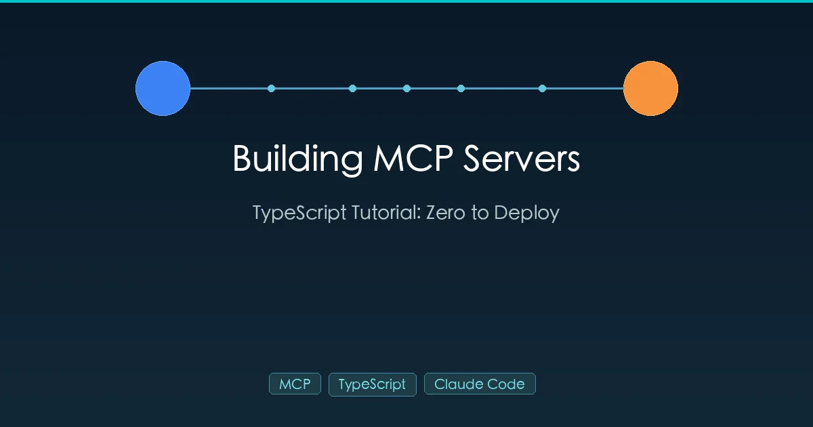

+++
date = '2026-03-02T10:00:00+08:00'
draft = false
title = '用 TypeScript 构建 MCP Server：从零到发布完整教程'
description = '手把手教你用 TypeScript 构建 MCP Server。学习如何使用 MCP SDK v2 创建工具、资源和提示模板，用 Claude Code 测试调试，最终发布到 npm。'
toc = true
tags = ['MCP', 'TypeScript', 'Claude Code', 'AI Agent', 'Tutorial']
categories = ['AI Guides']
keywords = ['构建 MCP Server', 'MCP TypeScript 教程', 'Model Context Protocol 服务器', 'MCP SDK v2', 'Claude Code MCP', '创建 MCP 工具', 'MCP Server 开发']

[[params.faqItems]]
question = "构建 MCP Server 可以使用哪些编程语言？"
answer = "MCP 协议有 TypeScript、Python 和 C# 的官方 SDK。TypeScript 最为成熟，文档也最完善。Python 是很好的替代选择。你也可以用任何支持 JSON-RPC 2.0 over STDIO 或 HTTP 的语言来构建。"

[[params.faqItems]]
question = "MCP Server 和 REST API 有什么区别？"
answer = "MCP Server 使用 JSON-RPC 2.0 而非 HTTP REST。核心区别在于标准化的工具发现机制——AI 客户端可以自动列出所有可用工具及其参数，无需阅读文档。MCP 还支持 STDIO 传输，作为本地进程运行，无需 HTTP 服务器。"

[[params.faqItems]]
question = "MCP Server 能和 Claude Code 以外的客户端配合使用吗？"
answer = "可以。任何兼容 MCP 的客户端都能使用你的 Server，包括 Cursor、VS Code Copilot 扩展、Continue 等 AI 工具。这正是基于开放协议构建的核心优势——一次构建，到处使用。"

[[params.faqItems]]
question = "MCP SDK v1 和 v2 有什么区别？"
answer = "SDK v2 将包拆分为 @modelcontextprotocol/server 和 @modelcontextprotocol/client。工具注册从 server.tool() 改为 server.registerTool()。输入验证现在需要用 z.object() 包裹。如果教程中使用的是 server.tool()，那就是 v1 语法。"
+++



MCP（Model Context Protocol，模型上下文协议）是 2026 年让 AI 模型访问外部工具、数据和服务的标准方式。如果你用过 [Claude Code](/zh/posts/ai/2026-02-28-claude-code-complete-guide/) 或 Cursor，你已经在使用 MCP Server 了——从数据库查询到 API 集成，都是它在背后驱动。

本教程将带你从零开始用 TypeScript 构建自己的 MCP Server，从项目初始化到发布到 npm。完成后，你将拥有一个任何 MCP 兼容客户端都能使用的可运行服务器。

## 什么是 MCP？30 秒版本

**MCP 就是 AI 的 USB-C。** 就像 USB-C 让你的笔记本通过一个标准接口连接显示器、硬盘和键盘，MCP 让 AI 模型通过一个标准协议连接数据库、API 和文件系统。[MCP 官方规范](https://spec.modelcontextprotocol.io/) 定义了完整的协议细节。

```
┌─────────────────────────────────────────────┐
│           MCP 客户端 (Host)                  │
│   Claude Code / Cursor / VS Code Copilot    │
├─────────────────────────────────────────────┤
│           MCP 协议层                         │
│         JSON-RPC 2.0 + STDIO/HTTP           │
├─────────────────────────────────────────────┤
│           MCP Server (你的代码)              │
│   工具 / 资源 / 提示模板                      │
└─────────────────────────────────────────────┘
```

MCP Server 暴露三种能力：

| 能力 | 作用 | 示例 |
|------|------|------|
| **工具 (Tools)** | 让 AI 执行操作 | 查询数据库、发送消息、调用 API |
| **资源 (Resources)** | 让 AI 读取数据 | 配置文件、用户资料、日志 |
| **提示 (Prompts)** | 预构建的交互模板 | 代码审查模板、摘要模板 |

**工具** 是最常用的——也是本教程的重点。

关于 MCP 协议的更全面概述，请参阅我的 [MCP 协议详解](/zh/posts/ai/2026-02-28-mcp-protocol-explained/) 指南。

## 为什么用 Claude Code 构建 MCP Server

你可以用任何编辑器构建 MCP Server，但 [Claude Code](/zh/posts/ai/2026-02-25-claude-code-setup-guide/) 在这方面有独特优势：

1. **Claude Code 本身就是 MCP 客户端。** 运行 `claude mcp add` 就能即时测试你的服务器——无需额外搭建客户端。
2. **实时测试循环。** 写好一个工具，注册它，让 Claude 调用它。实时调试。
3. **AI 构建 AI 工具。** 用 Claude Code 编写 MCP Server 代码，就是 AI 在开发自己的插件。效率惊人。

## 前置要求

| 依赖 | 最低版本 | 检查命令 |
|------|---------|---------|
| Node.js | >= 18 | `node -v` |
| npm | >= 9 | `npm -v` |
| TypeScript | >= 5.0 | `npx tsc --version` |
| Claude Code | 最新版 | `claude --version` |

## 教程：构建天气 MCP Server

我们从一个经典示例开始——天气查询工具。它涵盖了 MCP Server 开发的完整流程：项目初始化、工具注册、测试和调试。

### 第一步：初始化项目

```bash
mkdir weather-mcp-server
cd weather-mcp-server
npm init -y
```

安装依赖：

```bash
npm install @modelcontextprotocol/server zod
npm install -D typescript @types/node
```

两个核心包：
- **[@modelcontextprotocol/server](https://github.com/modelcontextprotocol/typescript-sdk)** — MCP Server SDK，提供 `McpServer`、`StdioServerTransport` 等类
- **[zod](https://zod.dev/)** — Schema 验证库，SDK v2 用它来定义工具的输入输出格式

创建 `tsconfig.json`：

```json
{
  "compilerOptions": {
    "target": "ES2022",
    "module": "Node16",
    "moduleResolution": "Node16",
    "outDir": "./dist",
    "rootDir": "./src",
    "strict": true,
    "esModuleInterop": true,
    "skipLibCheck": true,
    "declaration": true
  },
  "include": ["src/**/*"]
}
```

更新 `package.json` 的必要字段：

```json
{
  "name": "weather-mcp-server",
  "version": "1.0.0",
  "type": "module",
  "bin": {
    "weather-mcp-server": "./dist/index.js"
  },
  "scripts": {
    "build": "tsc",
    "start": "node dist/index.js"
  }
}
```

**关键点**：`"type": "module"` 是必须的。MCP SDK 使用 ESM 模块。

### 第二步：编写 MCP Server

创建 `src/index.ts`——服务器的入口文件：

```typescript
#!/usr/bin/env node

import { McpServer } from "@modelcontextprotocol/server";
import { StdioServerTransport } from "@modelcontextprotocol/server";
import * as z from "zod";

// 1. 创建服务器实例
const server = new McpServer({
  name: "weather-server",
  version: "1.0.0",
});

// 2. 模拟天气数据（生产环境请替换为真实 API）
function getWeatherData(city: string) {
  const weatherMap: Record<
    string,
    { temperature: number; condition: string; humidity: number }
  > = {
    "New York": { temperature: 2, condition: "Cloudy", humidity: 65 },
    "San Francisco": { temperature: 14, condition: "Sunny", humidity: 70 },
    London: { temperature: 8, condition: "Rainy", humidity: 85 },
    Tokyo: { temperature: 10, condition: "Clear", humidity: 55 },
    Sydney: { temperature: 25, condition: "Sunny", humidity: 60 },
  };

  const data = weatherMap[city];
  if (!data) {
    return { city, temperature: 15, condition: "Unknown", humidity: 50 };
  }
  return { city, ...data };
}

// 3. 注册工具：获取天气
server.registerTool(
  "get_weather",
  {
    title: "Get Weather",
    description:
      "Get current weather for a city including temperature, condition, and humidity",
    inputSchema: z.object({
      city: z
        .string()
        .describe("City name, e.g. New York, London, Tokyo"),
    }),
  },
  async ({ city }) => {
    const weather = getWeatherData(city);
    const text = `Weather in ${weather.city}: ${weather.condition}, ${weather.temperature}°C, humidity ${weather.humidity}%`;
    return {
      content: [{ type: "text", text }],
    };
  }
);

// 4. 注册工具：对比两个城市的天气
server.registerTool(
  "compare_weather",
  {
    title: "Compare Weather",
    description: "Compare weather between two cities",
    inputSchema: z.object({
      city1: z.string().describe("First city"),
      city2: z.string().describe("Second city"),
    }),
  },
  async ({ city1, city2 }) => {
    const w1 = getWeatherData(city1);
    const w2 = getWeatherData(city2);
    const diff = w1.temperature - w2.temperature;

    const text = [
      `Weather Comparison: ${w1.city} vs ${w2.city}`,
      `---`,
      `${w1.city}: ${w1.condition}, ${w1.temperature}°C, humidity ${w1.humidity}%`,
      `${w2.city}: ${w2.condition}, ${w2.temperature}°C, humidity ${w2.humidity}%`,
      `---`,
      `Temperature difference: ${Math.abs(diff)}°C (${diff > 0 ? w1.city + " is warmer" : w2.city + " is warmer"})`,
    ].join("\n");

    return {
      content: [{ type: "text", text }],
    };
  }
);

// 5. 启动 STDIO 传输
async function main() {
  const transport = new StdioServerTransport();
  await server.connect(transport);
  console.error("Weather MCP Server started"); // 用 stderr 而不是 stdout！
}

main().catch(console.error);
```

代码中的关键概念：

- **`McpServer`** — 核心类，所有工具、资源和提示都在这里注册
- **`registerTool`** — SDK v2 的方法，接受三个参数：工具名称、配置对象、处理函数
- **`inputSchema`** — Zod Schema，定义参数类型和描述。AI 客户端用这个 Schema 来构造正确的工具调用
- **`StdioServerTransport`** — 通过 stdin/stdout 通信，本地 MCP Server 的标准传输方式
- **用 `console.error` 而不是 `console.log`** — 这个关键细节在下面的调试章节详细解释

### 第三步：编译和测试

编译 TypeScript：

```bash
npx tsc
chmod +x dist/index.js
```

注册到 Claude Code：

```bash
claude mcp add weather-server node /absolute/path/to/dist/index.js
```

现在打开 Claude Code 测试：

```
> What's the weather in Tokyo?

> Compare the weather in New York and London
```

Claude Code 会自动发现你的 `get_weather` 和 `compare_weather` 工具并调用它们。

验证服务器是否已加载：

```bash
claude mcp list
```

关于 Claude Code 的 MCP 集成详情，请参阅我的 [Claude Code MCP 配置指南](/zh/posts/ai/2026-02-28-claude-code-mcp-setup/)。

## 添加资源和提示

除了工具，MCP Server 还可以暴露数据和交互模板。

### 注册资源

资源让 AI 客户端读取你的数据。下面是一个暴露支持城市列表的资源：

```typescript
server.registerResource(
  "supported-cities",
  "weather://cities",
  {
    title: "Supported Cities",
    description: "Returns all cities with weather data available",
    mimeType: "application/json",
  },
  async (uri) => ({
    contents: [
      {
        uri: uri.href,
        text: JSON.stringify([
          "New York",
          "San Francisco",
          "London",
          "Tokyo",
          "Sydney",
        ]),
      },
    ],
  })
);
```

### 注册提示模板

提示是预构建的交互模板：

```typescript
server.registerPrompt(
  "travel-advice",
  {
    title: "Travel Advice",
    description: "Get outfit and travel tips based on destination weather",
    argsSchema: z.object({
      destination: z.string().describe("Destination city"),
    }),
  },
  ({ destination }) => ({
    messages: [
      {
        role: "user" as const,
        content: {
          type: "text" as const,
          text: `Based on the current weather in ${destination}, suggest appropriate clothing and travel tips.`,
        },
      },
    ],
  })
);
```

## 构建实战 MCP Server：GitHub Issues

接下来构建一个更实用的服务器——读取 GitHub Issues。这演示了真实的 API 集成。

```typescript
#!/usr/bin/env node

import { McpServer } from "@modelcontextprotocol/server";
import { StdioServerTransport } from "@modelcontextprotocol/server";
import * as z from "zod";

const server = new McpServer({
  name: "github-issues-server",
  version: "1.0.0",
});

// 工具：列出最近的 Issues
server.registerTool(
  "list_issues",
  {
    title: "List GitHub Issues",
    description: "List recent issues from a GitHub repository",
    inputSchema: z.object({
      owner: z.string().describe("Repository owner (e.g. 'anthropics')"),
      repo: z.string().describe("Repository name (e.g. 'claude-code')"),
      state: z
        .enum(["open", "closed", "all"])
        .default("open")
        .describe("Issue state filter"),
      limit: z
        .number()
        .min(1)
        .max(30)
        .default(10)
        .describe("Number of issues to return"),
    }),
  },
  async ({ owner, repo, state, limit }) => {
    const url = `https://api.github.com/repos/${owner}/${repo}/issues?state=${state}&per_page=${limit}`;

    const response = await fetch(url, {
      headers: {
        Accept: "application/vnd.github.v3+json",
        "User-Agent": "mcp-github-issues",
      },
    });

    if (!response.ok) {
      return {
        content: [
          {
            type: "text",
            text: `Error fetching issues: ${response.status} ${response.statusText}`,
          },
        ],
        isError: true,
      };
    }

    const issues = await response.json();
    const formatted = issues
      .map(
        (issue: any) =>
          `#${issue.number} [${issue.state}] ${issue.title}\n  Labels: ${issue.labels.map((l: any) => l.name).join(", ") || "none"}\n  Created: ${issue.created_at}\n  URL: ${issue.html_url}`
      )
      .join("\n\n");

    return {
      content: [
        {
          type: "text",
          text: `Issues for ${owner}/${repo} (${state}):\n\n${formatted}`,
        },
      ],
    };
  }
);

// 工具：获取 Issue 详情
server.registerTool(
  "get_issue",
  {
    title: "Get Issue Details",
    description: "Get detailed information about a specific GitHub issue",
    inputSchema: z.object({
      owner: z.string().describe("Repository owner"),
      repo: z.string().describe("Repository name"),
      issue_number: z.number().describe("Issue number"),
    }),
  },
  async ({ owner, repo, issue_number }) => {
    const url = `https://api.github.com/repos/${owner}/${repo}/issues/${issue_number}`;

    const response = await fetch(url, {
      headers: {
        Accept: "application/vnd.github.v3+json",
        "User-Agent": "mcp-github-issues",
      },
    });

    if (!response.ok) {
      return {
        content: [
          {
            type: "text",
            text: `Error: ${response.status} ${response.statusText}`,
          },
        ],
        isError: true,
      };
    }

    const issue = await response.json();
    const text = [
      `# #${issue.number}: ${issue.title}`,
      `State: ${issue.state}`,
      `Author: ${issue.user.login}`,
      `Created: ${issue.created_at}`,
      `Labels: ${issue.labels.map((l: any) => l.name).join(", ") || "none"}`,
      `Comments: ${issue.comments}`,
      `---`,
      issue.body || "(no description)",
    ].join("\n");

    return {
      content: [{ type: "text", text }],
    };
  }
);

async function main() {
  const transport = new StdioServerTransport();
  await server.connect(transport);
  console.error("GitHub Issues MCP Server started");
}

main().catch(console.error);
```

构建并注册这个服务器后，你可以在 Claude Code 中这样问：

```
> List open issues in anthropics/claude-code
> Show me the details of issue #42 in that repo
```

## 调试 MCP Server

调试是 MCP Server 开发中最棘手的部分。以下是必备技巧。

### 用 console.error，不要用 console.log

这是新手 MCP 开发者最常犯的错误，[MCP 调试指南](https://modelcontextprotocol.io/docs/tools/debugging) 中也提到了这一点。MCP 使用 **STDIO 协议** 通信——`stdout` 是数据通道。任何 `console.log` 输出都会被当作协议消息解析，导致通信中断。

```typescript
// 错误——会破坏 STDIO 协议
console.log("Debug info");

// 正确——使用 stderr，不会干扰
console.error("Debug info");
```

### 使用 SDK 内置日志

MCP SDK v2 提供了结构化日志功能，可以将消息发送给客户端：

```typescript
server.registerTool(
  "fetch-data",
  {
    description: "Fetch data from URL",
    inputSchema: z.object({ url: z.string() }),
  },
  async ({ url }, ctx) => {
    await ctx.mcpReq.log("info", `Fetching ${url}`);
    const res = await fetch(url);
    await ctx.mcpReq.log("debug", `Response status: ${res.status}`);
    const text = await res.text();
    return { content: [{ type: "text", text }] };
  }
);
```

创建服务器时启用日志：

```typescript
const server = new McpServer(
  { name: "my-server", version: "1.0.0" },
  { capabilities: { logging: {} } }
);
```

### 常见错误及修复

| 症状 | 原因 | 修复方法 |
|------|------|---------|
| 服务器无法启动 | package.json 缺少 `"type": "module"` | 添加 `"type": "module"` |
| 工具未被识别 | `inputSchema` 格式无效 | 用 `z.object()` 包裹 |
| 通信错误 | 使用了 `console.log` | 改用 `console.error` |
| 类型错误 | SDK 版本不匹配 | 确认使用 `@modelcontextprotocol/server` v2 |
| 工具调用无返回 | 响应中缺少 content | 确保处理函数返回 `{ content: [...] }` |
| 服务器启动即崩溃 | 未处理的异步错误 | 在 main() 后加 `.catch(console.error)` |
| 参数未验证 | 使用了原始对象而非 Zod | 始终使用 `z.object()` 并加 `.describe()` |

### 重启和验证

```bash
# 检查已注册的服务器
claude mcp list

# 移除并重新添加（重启服务器）
claude mcp remove weather-server
claude mcp add weather-server node /path/to/dist/index.js
```

## 发布你的 MCP Server

当服务器准备就绪，发布到 npm 让其他人使用。

### 准备 package.json

```json
{
  "name": "@your-scope/weather-mcp-server",
  "version": "1.0.0",
  "description": "MCP server for weather data queries",
  "type": "module",
  "bin": {
    "weather-mcp-server": "./dist/index.js"
  },
  "files": ["dist"],
  "keywords": ["mcp", "mcp-server", "weather"],
  "license": "MIT"
}
```

### 编译和发布

```bash
npm run build
npm publish --access public
```

发布后，任何人都可以用一条命令使用你的服务器：

```bash
claude mcp add weather-server npx @your-scope/weather-mcp-server
```

### 分享到社区

将你的项目提交到 [awesome-mcp-servers](https://github.com/punkpeye/awesome-mcp-servers) 仓库以提高曝光度。你还可以在 [MCP 官方服务器注册表](https://modelcontextprotocol.io/examples) 中列出它。

## 项目结构最佳实践

对于较大的 MCP Server 项目，建议这样组织代码：

```
my-mcp-server/
├── src/
│   ├── index.ts          # 入口文件，服务器配置
│   ├── tools/            # 工具处理函数
│   │   ├── query.ts
│   │   └── mutate.ts
│   ├── resources/        # 资源处理函数
│   │   └── config.ts
│   └── utils/            # 共享工具函数
│       └── api-client.ts
├── dist/                 # 编译输出
├── package.json
├── tsconfig.json
└── README.md
```

核心原则：
- **一个服务器一个领域** — 不要构建拥有 50 个工具的巨型服务器。创建专注的服务器（每个 3-10 个工具）
- **分离工具处理函数** — 每个工具的逻辑放在独立文件中，便于测试
- **为响应定义类型** — 使用 TypeScript 接口定义 API 响应，在编译时捕获错误
- **优雅处理错误** — 在 content 中返回 `isError: true`，而不是抛出异常

## 常见问题

### 构建 MCP Server 可以使用哪些编程语言？

MCP 协议有 TypeScript、Python 和 C# 的官方 SDK。TypeScript 最为成熟，文档也最完善。Python 是很好的替代选择。你也可以用任何支持 JSON-RPC 2.0 over STDIO 或 HTTP 的语言来构建。

### MCP Server 和 REST API 有什么区别？

MCP Server 使用 JSON-RPC 2.0 而非 HTTP REST。核心区别在于标准化的工具发现机制——AI 客户端可以自动列出所有可用工具及其参数，无需阅读文档。MCP 还支持 STDIO 传输，作为本地进程运行，无需 HTTP 服务器。

### MCP Server 能和 Claude Code 以外的客户端配合使用吗？

可以。任何兼容 MCP 的客户端都能使用你的 Server，包括 Cursor、VS Code Copilot 扩展、Continue 等 AI 工具。这正是基于开放协议构建的核心优势——一次构建，到处使用。

### MCP SDK v1 和 v2 有什么区别？

SDK v2 将包拆分为 `@modelcontextprotocol/server` 和 `@modelcontextprotocol/client`。工具注册从 `server.tool()` 改为 `server.registerTool()`。输入验证现在需要用 `z.object()` 包裹。如果教程中使用的是 `server.tool()`，那就是 v1 语法。

### 一个 MCP Server 应该有多少个工具？

协议本身没有限制，但实际上每个服务器 3-10 个工具效果最好。工具太多会降低 AI 选择正确工具的准确率。将相关工具放在同一个服务器中，不同领域的工具放在不同服务器中。

### MCP Server 可以访问互联网吗？

可以。你的服务器作为 Node.js 进程运行，拥有完整的网络访问权限。你可以调用外部 API、查询数据库、读取文件——Node.js 能做的它都能做。只需注意延迟问题，因为 AI 客户端会等待你的工具响应。

## 总结

构建 MCP Server 遵循一个简单的工作流：

1. **初始化** — 用 `@modelcontextprotocol/server` 和 `zod` 搭建 TypeScript 项目
2. **注册工具** — 使用 `server.registerTool()` 配合 Zod Schema 进行输入验证
3. **本地测试** — `claude mcp add` 即时在 Claude Code 中测试
4. **调试** — 使用 `console.error`（绝不用 `console.log`），参考常见错误表
5. **发布** — `npm publish` 然后通过 `npx` 分享

MCP 生态正在快速增长。你构建的每一个 MCP Server 都能立刻被 Claude Code、Cursor、Copilot 以及未来任何兼容 MCP 的工具使用。现在就开始构建吧。

## 相关阅读

- [MCP 协议详解：AI 工具的通用标准](/zh/posts/ai/2026-02-28-mcp-protocol-explained/)
- [Claude Code MCP 配置：连接 AI 到任何外部服务](/zh/posts/ai/2026-02-28-claude-code-mcp-setup/)
- [Claude Code 2026 完全指南](/zh/posts/ai/2026-02-28-claude-code-complete-guide/)
- [Claude Code Hooks：自动化配置](/zh/posts/ai/2026-02-28-claude-code-hooks-guide/)
