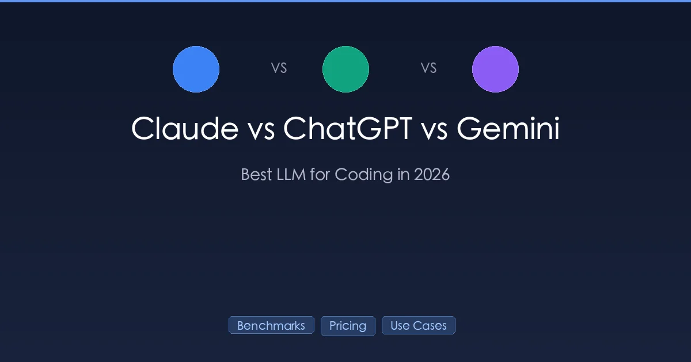

+++
date = '2026-03-02T10:00:00+08:00'
draft = false
title = 'Claude vs ChatGPT vs Gemini：2026年最佳编程LLM对比'
description = '深度对比 Claude Opus 4.6、GPT-5.2 和 Gemini 2.5 Pro 的编程能力。真实基准测试、定价、上下文窗口和使用场景推荐，帮你选出最适合项目的 LLM。'
toc = true
tags = ['Claude', 'ChatGPT', 'Gemini', 'LLM Comparison', 'AI Coding Tools']
categories = ['Comparisons']
keywords = ['Claude vs ChatGPT vs Gemini', 'best LLM for coding 2026', 'Claude vs GPT coding', 'Gemini vs Claude', 'AI model comparison', 'Claude Opus 4.6 vs GPT-5.2', 'best AI for programming']

[[params.faqItems]]
question = "2026年哪个LLM最适合编程？"
answer = "Claude Opus 4.6 在 SWE-bench Verified 上以 80.8% 的得分领先，是复杂编程任务的首选。GPT-5.2 以 80.0% 紧随其后，而 Gemini 2.5 Pro 在 Web 开发方面表现出色（WebDev Arena 排名第一）。最佳选择取决于你的具体使用场景。"

[[params.faqItems]]
question = "编程选 Claude 还是 ChatGPT 更好？"
answer = "Claude Opus 4.6 首次生成的代码质量更高，架构理解能力更强。GPT-5.2 迭代速度更快，API 成本更低。对于复杂重构和大型代码库，Claude 领先；对于快速原型开发和预算敏感的项目，GPT-5.2 很有竞争力。"

[[params.faqItems]]
question = "Claude API 与 GPT 和 Gemini 相比价格如何？"
answer = "Claude Opus 4.6 每百万 token 输入/输出价格为 $5/$25。GPT-5.2 为 $1.75/$14。Gemini 2.5 Pro 最便宜，为 $1.25/$10。三者均提供 50% 的批量 API 折扣和提示缓存以进一步降低成本。"

[[params.faqItems]]
question = "哪个 AI 的编程上下文窗口最大？"
answer = "Gemini 2.5 Pro 以原生 100 万 token 上下文窗口领先。Claude Opus 4.6 提供 20 万标准（100 万 beta 版）。GPT-5.2 支持约 20 万 token。对于大型代码库分析，Gemini 和 Claude 都能处理企业级项目。"
+++

2026 年选择合适的编程 LLM 比以往任何时候都难。Claude Opus 4.6、GPT-5.2 和 Gemini 2.5 Pro 都声称自己是最擅长写代码的模型——但现实情况远比宣传复杂。

我花了数月时间用这三个模型构建真实项目。这篇对比将跳过营销话术，基于基准测试、定价和实战经验，告诉你哪个模型在不同编程任务中真正表现最好。

## 模型概览

在深入对比之前，先看看我们比较的对象：

| 模型 | 公司 | 发布时间 | 上下文窗口 | 最大输出 |
|------|------|---------|-----------|---------|
| **Claude Opus 4.6** | Anthropic | 2026年2月 | 20万（100万 beta） | 12.8万 token |
| **GPT-5.2** | OpenAI | 2026年2月 | ~20万 | 10万 token |
| **Gemini 2.5 Pro** | Google | 2025年2月 | **100万（原生）** | ~6.5万 token |

三者都是多模态模型（文本+图像输入），支持工具调用，并提供 API 访问。差异主要体现在编程性能、定价和专项能力上。

> **注意**：GPT-4o 仍然可用但已是遗留模型。GPT-5.2 是 OpenAI 当前的旗舰。同样，Gemini 3 Pro 已经存在，但 Gemini 2.5 Pro 仍然是 Google 最广泛使用的编程模型。

## 编程基准测试：谁写的代码更好？

### SWE-bench Verified（真实世界 Bug 修复）

SWE-bench Verified 在真实的 GitHub issue 上测试模型——这是最接近实际软件工程工作的基准测试。你可以在 [SWE-bench 官方排行榜](https://www.swebench.com/) 查看最新得分。

| 模型 | 得分 | 备注 |
|------|------|------|
| **Claude Opus 4.5** | **80.9%** | 最高分 |
| **Claude Opus 4.6** | 80.8% | 与 4.5 几乎持平 |
| **GPT-5.2** | 80.0% | 强劲竞争者 |
| Claude Sonnet 4.6 | 79.6% | 性价比之选 |
| Claude Sonnet 4.5 | 77.2% | - |
| **Gemini 3 Pro** | 76.2% | 快速追赶中 |
| **Gemini 2.5 Pro** | 63.8% | 差距明显 |

**关键结论**：Claude 和 GPT-5.2 在顶端不相上下（~80%）。Gemini 2.5 Pro 以 63.8% 落后，但 Gemini 3 Pro 已将差距缩小至 76.2%。

### Terminal-Bench 2.0（命令行编程任务）

| 模型 | 得分 |
|------|------|
| **Claude Opus 4.6** | **65.4%**（史上最高） |
| GPT-5.2 | 64.7% |

Claude Opus 4.6 在这项测试中略胜 GPT-5.2，特别是在多步骤终端操作和文件处理任务方面。

### WebDev Arena（构建 Web 应用）

| 模型 | 排名 |
|------|------|
| **Gemini 2.5 Pro** | **第1名** |
| Claude Opus 4.6 | 第2名 |
| GPT-5.2 | 第3名 |

根据 [WebDev Arena 排名](https://web.lmarena.ai/)，Gemini 2.5 Pro 在 Web 开发任务中占据主导地位。如果你在构建前端应用、React 组件或全栈 Web 应用，Gemini 始终产出更好的结果。

### HumanEval（代码生成）

| 模型 | 得分 |
|------|------|
| Claude Opus 4.5 | 95.0% |
| GPT-5.2 | 95.0% |

HumanEval 在 2026 年基本饱和——多个模型得分 95% 以上。它已不再是有意义的区分指标。

### 基准测试总结

| 强项 | 最佳模型 |
|------|---------|
| 复杂 Bug 修复（SWE-bench） | **Claude Opus 4.6** |
| 终端/CLI 任务 | **Claude Opus 4.6** |
| Web 开发 | **Gemini 2.5 Pro** |
| 通用代码生成 | 持平（Claude ≈ GPT-5.2） |

## 定价：每百万 Token 的 API 成本

在进行数千次 API 调用时，定价至关重要。价格来源于官方定价页面：[Anthropic](https://docs.anthropic.com/en/docs/about-claude/pricing)、[OpenAI](https://openai.com/api/pricing/) 和 [Google Gemini](https://ai.google.dev/gemini-api/docs/pricing)。以下是完整对比：

### 旗舰模型

| 模型 | 输入（$/百万 token） | 输出（$/百万 token） | 成本指数 |
|------|---------------------|---------------------|---------|
| **Claude Opus 4.6** | $5.00 | $25.00 | 最高 |
| Claude Opus 4.6 Fast | $30.00 | $150.00 | 6倍速度溢价 |
| **GPT-5.2** | $1.75 | $14.00 | 中等 |
| GPT-5.2 Pro | $21.00 | $168.00 | 高级版 |
| **Gemini 2.5 Pro** | $1.25 | $10.00 | **最低** |
| Gemini 2.5 Pro（>20万） | $2.50 | $10.00 | 长上下文附加费 |

### 经济型选项

| 模型 | 输入（$/百万 token） | 输出（$/百万 token） | 适用场景 |
|------|---------------------|---------------------|---------|
| Claude Sonnet 4.5 | $3.00 | $15.00 | 日常编程任务 |
| Claude Haiku 4.5 | $1.00 | $5.00 | 简单任务、大批量 |
| GPT-4o | $2.50 | $10.00 | 旧版但可靠 |
| GPT-4o-mini | $0.15 | $0.60 | 超低预算任务 |
| Gemini 2.5 Flash-Lite | $0.10 | $0.40 | **最便宜** |

### 省钱功能

| 功能 | Claude | OpenAI | Gemini |
|------|--------|--------|--------|
| 批量 API 折扣 | 5折 | 5折 | 5折 |
| 提示缓存 | $0.50/百万（Opus 4.6） | $1.25/百万（GPT-4o） | 基础价格的 10% |

**定价结论**：Gemini 2.5 Pro 以 $1.25/$10 提供最佳性价比。GPT-5.2 是中等选项，$1.75/$14。Claude Opus 4.6 成本最高，$5/$25，但代码质量也最高。三者价格都大幅下降——仅 Claude Opus 就从最初的 $15/$75 降价了 67%。

想深入了解 Claude 的定价层级，请看我的 [Claude 2026 定价指南](/zh/posts/ai/2026-02-25-claude-code-pricing/)。

## 上下文窗口和输出限制

上下文窗口大小决定了 AI 一次能读取多少代码，这对大型代码库至关重要。

| 模型 | 上下文窗口 | 最大输出 | 备注 |
|------|-----------|---------|------|
| **Gemini 2.5 Pro** | **100万 token** | ~6.5万 token | 原生 100 万，无需 beta 标记 |
| **Claude Opus 4.6** | 20万（100万 beta） | **12.8万 token** | 最大输出窗口 |
| **GPT-5.2** | ~20万 | 10万 token | 中间水平 |

**关键洞察**：
- **Gemini 赢在输入端**：原生 100 万上下文意味着你可以整个代码仓库喂进去而无需分块
- **Claude 赢在输出端**：12.8 万最大输出（~10 万字）意味着它可以在单次回复中生成完整文件、整个测试套件或完整文档
- **GPT-5.2 比较均衡**：两个维度都有竞争力，但都不领先

对于大型代码库分析（读取数千文件），Gemini 的 100 万上下文窗口是显著优势。对于需要长输出的代码生成任务，Claude 的 12.8 万输出限制让它占据优势。

## 功能对比

### Agent 能力

自主规划、执行多步骤任务和使用工具的能力越来越重要。

| 功能 | Claude Opus 4.6 | GPT-5.2 | Gemini 2.5 Pro |
|------|-----------------|---------|----------------|
| 多步推理 | 优秀 | 优秀 | 良好 |
| 工具编排 | **最佳** — 并行子任务 | 良好 — 函数调用 | 基础函数调用 |
| 自主规划 | 强 | 强 | 中等 |
| 自我纠错 | 优秀 | 良好 | 良好 |

Claude Opus 4.6 是最强的 Agent 模型，正如 [Anthropic 的 Opus 4.6 公告](https://www.anthropic.com/news/claude-opus-4-6) 所强调的。它的 [Claude Code](/zh/posts/ai/2026-02-28-claude-code-complete-guide/) CLI 工具展示了这一点——它可以自主导航代码库、创建文件、运行测试，并在多步骤工作流中修复错误。

### 代码理解

| 能力 | Claude | GPT-5.2 | Gemini |
|------|--------|---------|--------|
| 架构分析 | **最佳** | 良好 | 良好 |
| 跨文件依赖 | **最佳**（100万 beta） | 良好 | **最佳**（100万原生） |
| 遗留代码理解 | 优秀 | 良好 | 良好 |
| 代码解释质量 | **最佳** — 直觉类比 | 技术性、直接 | 一般 |

### 多模态编程

| 能力 | Claude | GPT-5.2 | Gemini |
|------|--------|---------|--------|
| 图像转代码 | 良好 | 良好 | **最佳** |
| 截图转 UI 代码 | 良好 | 良好 | **最佳** |
| 视频分析 | 不支持 | 支持 | **最佳**（原生） |
| 图表理解 | 良好 | 良好 | **最佳** |

Gemini 2.5 Pro 拥有最强的多模态能力，原生支持音频和视频以及图像和文本。这使其非常适合将设计稿、原型或视频教程转换为代码。

## 按使用场景选择最佳模型

基于数月的实际使用，以下是我的推荐矩阵：

| 使用场景 | 最佳选择 | 原因 |
|---------|---------|------|
| **复杂重构** | Claude Opus 4.6 | SWE-bench 最高分，深度架构理解 |
| **前端/Web 开发** | Gemini 2.5 Pro | WebDev Arena 第一名，强视觉转代码能力 |
| **日常编程辅助** | Claude Sonnet 4.5 / GPT-4o | 速度、质量和成本的良好平衡 |
| **预算敏感项目** | Gemini 2.5 Flash-Lite | 每百万 token $0.10/$0.40 |
| **大型代码库分析** | Gemini 2.5 Pro | 原生 100 万上下文窗口 |
| **AI Agent 开发** | Claude Opus 4.6 | 最强 Agent 能力 |
| **快速原型** | GPT-5.2 | 迭代快，token 效率高 |
| **多模态（设计转代码）** | Gemini 2.5 Pro | 原生视频/音频/图像支持 |
| **最高代码质量** | Claude Opus 4.6 | SWE-bench 80.8%，首次生成准确率最高 |

## 基于这些模型的编程工具

每个 LLM 驱动不同的编程工具，对应关系如下：

| 工具 | 底层模型 | 类型 |
|------|---------|------|
| [Claude Code](/zh/posts/ai/2026-02-28-claude-code-complete-guide/) | Claude Opus 4.6 / Sonnet 4.5 | CLI Agent |
| ChatGPT Codex | GPT-5.2 / GPT-5.3-Codex | 应用 + CLI + IDE |
| [Cursor](/zh/posts/ai/2026-02-28-copilot-vs-claude-vs-cursor/) | Claude + GPT（可配置） | IDE |
| GitHub Copilot | GPT-4o / Claude（可配置） | IDE 扩展 |
| Gemini Code Assist | Gemini 2.5 Pro | IDE 扩展 |

如果你选的是编程工具而非原始 API，请查看我的 [GitHub Copilot vs Claude Code vs Cursor 对比](/zh/posts/ai/2026-02-28-copilot-vs-claude-vs-cursor/)。

## 实战体验：我的真实感受

在数月的日常使用后，以下是我对三个模型的真实观察：

### Claude Opus 4.6

**我注意到的优势**：
- 首次尝试就能生成更完整、更接近生产级别的代码
- 更擅长理解复杂架构并建议适当的设计模式
- 用直觉类比解释代码，让复杂逻辑变得通俗易懂
- [Claude Code 的 Agent 模式](/zh/posts/ai/2026-02-25-claude-code-setup-guide/) 在自主开发方面无与伦比

**劣势**：
- API 价格最贵
- Max 计划（$200/月）的速率限制在高强度开发期间可能会受限
- 偶尔在简单方案就足够的情况下过度设计解决方案

### GPT-5.2

**我注意到的优势**：
- 迭代速度更快——能快速生成更小、更聚焦的代码变更
- 同等任务消耗的 token 更少（比 Claude Opus 高效 2-3 倍）
- Codex App 在 CLI 之外提供了精致的 GUI 体验
- 内置的计划任务自动化更好

**劣势**：
- 每次生成的代码质量略低——需要更多轮迭代
- 代码解释不如 Claude 直观
- SWE-bench Pro 表现暗示在复杂的多文件场景中存在差距

### Gemini 2.5 Pro

**我注意到的优势**：
- 最擅长将设计稿/原型转换为前端代码
- 100 万上下文窗口在分析大型 monorepo 时确实有用
- 以有竞争力的 Web 开发性能提供最低价格
- 批量 API 价格 $0.625/$5 极具性价比

**劣势**：
- SWE-bench Verified 得分（63.8%）暴露了在复杂 Bug 修复方面的真实差距
- 在多步骤 Agent 任务中不太可靠
- 代码生成有时缺乏防御性编程模式

## 你应该选哪个？

### 个人开发者

- **预算 < $20/月**：使用 Gemini 2.5 Pro API 配合批量折扣，或用 GPT-4o-mini 处理简单任务
- **预算 $20-100/月**：追求质量选 Claude Pro（$20），或混用 Claude Sonnet 和 Gemini 来增加用量
- **预算 $100-200/月**：Claude Max 获取无限高质量编程，辅以 Gemini 做 Web 开发

### 团队

2026 年大多数团队采用**多模型策略**：
- 用 Claude Opus 做架构决策和代码评审
- 用 GPT-5.2 或 Claude Sonnet 做日常开发
- 用 Gemini 做前端工作和大型代码库分析

这不是非此即彼的选择。这些模型是互补的。

### 按技术栈选择

| 技术栈 | 推荐模型 | 原因 |
|--------|---------|------|
| React/Next.js/Vue | Gemini 2.5 Pro | WebDev Arena 第一名 |
| Python/后端 | Claude Opus 4.6 | 最佳代码质量 |
| DevOps/基础设施 | Claude Opus 4.6 | 强 CLI/终端任务能力 |
| 移动端（React Native/Flutter） | GPT-5.2 | 良好的跨平台支持 |
| 数据科学 | Gemini 2.5 Pro | 大上下文适合 notebook |

## 常见问题

### 2026年哪个LLM最适合编程？

Claude Opus 4.6 在 SWE-bench Verified 上以 80.8% 的得分领先，是复杂编程任务的首选。GPT-5.2 以 80.0% 紧随其后，而 Gemini 2.5 Pro 在 Web 开发方面表现出色（WebDev Arena 排名第一）。最佳选择取决于你的具体使用场景。

### 编程选 Claude 还是 ChatGPT 更好？

Claude Opus 4.6 首次生成的代码质量更高，架构理解能力更强。GPT-5.2 迭代速度更快，API 成本更低。对于复杂重构和大型代码库，Claude 领先；对于快速原型开发和预算敏感的项目，GPT-5.2 很有竞争力。

### Claude API 与 GPT 和 Gemini 相比价格如何？

Claude Opus 4.6 每百万 token 输入/输出价格为 $5/$25。GPT-5.2 为 $1.75/$14。Gemini 2.5 Pro 最便宜，为 $1.25/$10。三者均提供 50% 的批量 API 折扣和提示缓存以进一步降低成本。

### 哪个 AI 的编程上下文窗口最大？

Gemini 2.5 Pro 以原生 100 万 token 上下文窗口领先。Claude Opus 4.6 提供 20 万标准（100 万 beta 版）。GPT-5.2 支持约 20 万 token。对于大型代码库分析，Gemini 和 Claude 都能处理企业级项目。

### 可以同时使用多个 LLM 吗？

可以，而且大多数专业开发者都这样做。常见模式包括用 Claude 做代码评审和架构设计，用 GPT 做日常编码，用 Gemini 做前端工作。像 Cursor 这样的工具可以在同一个 IDE 中切换模型。

### 这些基准测试可靠吗？

SWE-bench Verified 被认为是真实世界编程评估的金标准。它在真实的 GitHub issue 上进行测试，并有验证过的解决方案。不过，没有任何单一基准测试能覆盖编程能力的方方面面。把基准测试作为方向性参考，而非绝对真理。

## 总结

2026 年编程 LLM 格局可以归结为三个清晰的画像：

- **Claude Opus 4.6**：最佳代码质量，最强 Agent 能力，价格最高。当质量至上时选它。
- **GPT-5.2**：迭代快，质量有竞争力，定价适中。日常开发的均衡之选。
- **Gemini 2.5 Pro**：最高性价比，最大上下文窗口，Web 开发领先者。前端工作和预算效率之选。

实际建议？**不要把自己锁定在一个模型上。** 过去一年 API 价格下降了 80%。使用多个模型的成本比以往更低，而为每个任务选择合适工具的收益是实实在在的。

## 相关阅读

- [Claude Pricing 2026: Complete Plan Comparison](/zh/posts/ai/2026-02-25-claude-code-pricing/)
- [GitHub Copilot vs Claude Code vs Cursor: Real-World Benchmarks](/zh/posts/ai/2026-02-28-copilot-vs-claude-vs-cursor/)
- [Claude Code vs Cursor: Which Wins for Real Projects?](/zh/posts/ai/2026-02-28-claude-code-vs-cursor/)
- [Claude Code Complete Guide 2026](/zh/posts/ai/2026-02-28-claude-code-complete-guide/)
