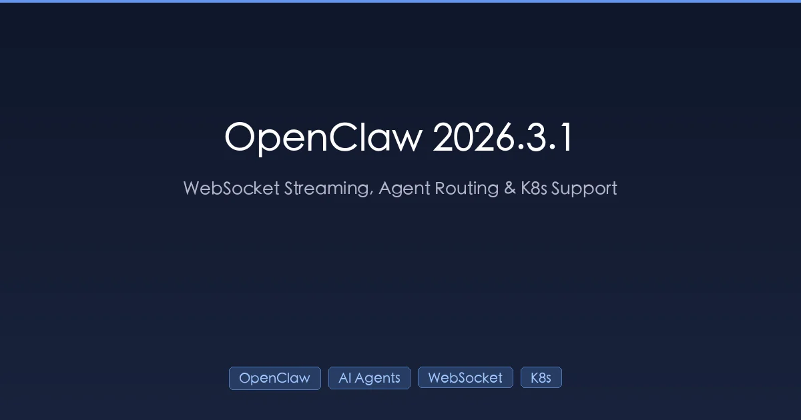

+++
date = '2026-03-03T10:00:00+08:00'
draft = false
title = 'OpenClaw 2026.3.1 新功能详解：WebSocket 流式传输、Agent 路由与 K8s 支持'
description = 'OpenClaw 2026.3.1 新版本完整指南，涵盖 WebSocket 传输、Agent 路由 CLI、外部密钥管理、Kubernetes 健康检查端点以及 Claude 4.6 自适应思考等全部新功能。'
toc = true
tags = ['OpenClaw', 'AI Agents', 'WebSocket', 'Kubernetes', 'Self-Hosted AI']
categories = ['AI Guides']
keywords = ['OpenClaw 2026.3.1', 'OpenClaw 新功能', 'OpenClaw WebSocket 流式传输', 'OpenClaw Agent 路由', 'OpenClaw Kubernetes', 'OpenClaw 外部密钥', 'OpenClaw 2026年3月更新', 'OpenClaw Claude 4.6']

[[params.faqItems]]
question = "OpenClaw 2026.3.1 有哪些新功能？"
answer = "OpenClaw 2026.3.1 引入了面向 OpenAI 模型的 WebSocket 优先传输、Claude 4.6 默认自适应思考、原生 Kubernetes 健康检查端点、Agent 路由 CLI、增强的 Android 设备集成以及改进的 Discord/Telegram 会话管理。"

[[params.faqItems]]
question = "如何升级到 OpenClaw 2026.3.1？"
answer = "在 macOS/Linux 上运行 'curl -fsSL https://openclaw.ai/install.sh | bash'，Windows 上运行 'iwr -useb https://openclaw.ai/install.ps1 | iex'。Docker 用户请拉取最新镜像 'docker pull openclaw/openclaw:latest'。"

[[params.faqItems]]
question = "OpenClaw 2026.3.1 支持 Kubernetes 吗？"
answer = "支持。OpenClaw 2026.3.1 新增了原生 HTTP 健康检查端点（/health、/healthz、/ready、/readyz），专为 Kubernetes 存活探针和就绪探针设计，让生产环境部署变得更加简单。"

[[params.faqItems]]
question = "什么是 OpenClaw Agent 路由？"
answer = "Agent 路由是一项新的 CLI 功能，允许你将特定 AI Agent 绑定到特定的消息账号。通过 'openclaw agents bind' 和 'openclaw agents unbind' 等命令，你可以实现按账号维度的路由管理，并支持角色感知的身份处理。"

[[params.faqItems]]
question = "OpenClaw 免费吗？"
answer = "是的，OpenClaw 完全开源，在 GitHub 上拥有超过 247,000 星标。你只需自备云端模型的 API 密钥，或在自有基础设施上运行本地模型，无需任何订阅费用。"
+++



[OpenClaw](https://github.com/openclaw/openclaw) 刚刚发布了 2026.3.1 版本——这次更新值得关注。面向 OpenAI 模型的 WebSocket 优先流式传输、原生 Kubernetes 健康检查、完善的 Agent 路由 CLI，以及默认启用的 Claude 4.6 自适应思考。

如果你正在生产环境中运行 OpenClaw，或者正在考虑将其纳入你的 AI Agent 工作流，本指南将详细介绍此次版本的每一个重要变更、对你的环境意味着什么，以及如何配置新功能。

## 变更概览

OpenClaw 2026.3.1 是一个**面向生产就绪的版本**。之前的版本侧重于扩展平台集成和 Agent 能力，而这次更新的重点是让 OpenClaw 更快、更易管理、更方便大规模部署。

核心变更一览：

| 功能 | 说明 | 影响 |
|------|------|------|
| **WebSocket 传输** | OpenAI 模型的默认传输方式 | 更低延迟，更快的流式传输 |
| **Claude 4.6 自适应思考** | 根据任务智能调整推理深度 | 更高质量，更低成本 |
| **K8s 健康检查端点** | `/health`、`/healthz`、`/ready`、`/readyz` | 生产级部署 |
| **Agent 路由 CLI** | 通过 CLI 将 Agent 绑定到账号 | 多 Agent 管理 |
| **外部密钥管理** | 集中式凭证管理 | 更好的安全态势 |
| **Android 能力** | 相机、联系人、日历、运动传感器 | 移动端自动化 |
| **Discord/Telegram 会话** | 基于不活跃状态的生命周期 | 更智能的资源管理 |

下面逐一详解。

## OpenAI 的 WebSocket 优先传输

这可以说是 2026.3.1 中最大的性能变更。OpenClaw 现在对 OpenAI Responses API 默认使用 **WebSocket 传输**，SSE（Server-Sent Events）作为备选方案。

### 为什么重要

旧的 SSE 传输方式每次响应流都会建立新的 HTTP 连接。WebSocket 维持一个持久连接，这意味着：

- **更低延迟**：无需每次请求都进行连接建立
- **更快的 Token 传输**：Token 通过持久连接实时到达
- **更好的 Agent 交接**：多步推理链执行更快
- **降低服务器负载**：更少的连接需要管理

打个比方，这就像发送单独的信件（SSE）和保持电话线畅通（WebSocket）的区别。电话线随时就绪——不需要拨号，不需要等待。

### 配置方法

WebSocket 默认通过 `transport: "auto"` 启用。如需显式控制：

```toml
# 在你的 openclaw 配置中
[response]
# "auto" = WebSocket 优先，SSE 备选（默认）
# "websocket" = 仅 WebSocket
# "sse" = 仅 SSE（传统行为）
transport = "auto"

# 可选：为特定模型启用预热
[response.openaiWsWarmup]
"gpt-5" = true
"gpt-4.1" = false
```

预热功能（`response.create` 配合 `generate:false`）会在你需要之前就建立好 WebSocket 连接，消除初始连接延迟。

### 何时使用 SSE 备选

以下情况建议使用 SSE：
- 你的网络/防火墙阻止 WebSocket 连接
- 你使用了不支持 WebSocket 升级的代理服务器
- 你需要与旧基础设施保持最大兼容性

## Claude 4.6 自适应思考

OpenClaw 2026.3.1 为所有 Anthropic Claude 4.6 模型默认启用了**自适应思考**。其他支持推理的模型保持 `"low"` 设置，除非另行配置。

### 什么是自适应思考？

自适应思考不再对每个请求使用相同的推理深度，而是让 Claude 根据任务复杂度动态调整"思考"程度：

- **简单问题** → 快速直接回答（更少 Token）
- **复杂多步推理** → 深度分析与扩展思考（更多 Token，更高质量）
- **工具调用链** → 针对连续工具调用优化的平衡方式

这就像有一位开发者，他知道什么时候快速修复一个拼写错误，什么时候需要仔细设计系统架构。

### 配置方法

```toml
[agents.default.model]
provider = "anthropic"
name = "claude-4.6-sonnet"

[agents.default.model.thinking]
# "adaptive" = 模型自行决定深度（Claude 4.6 默认）
# "low" = 最少推理（更快，更便宜）
# "high" = 最大推理（更慢，更贵）
mode = "adaptive"
```

对于处理常规任务的 Agent（通知、简单查询），你可能希望强制使用 `"low"` 来节省 Token：

```toml
[agents.notification-bot.model.thinking]
mode = "low"
```

对于处理复杂多步工作流的 Agent，`"adaptive"`（默认值）通常会自动做出正确选择。

## Kubernetes 健康检查端点

如果你之前尝试在 Kubernetes 上部署 OpenClaw，你一定深有体会。没有原生健康检查意味着你要么编写自定义探针脚本，要么依赖 TCP 检查。现在不用了。

### 新增端点

OpenClaw 2026.3.1 新增四个 HTTP 健康检查端点：

| 端点 | 用途 | K8s 探针类型 |
|------|------|-------------|
| `/health` | 基本网关存活检查 | `livenessProbe` |
| `/healthz` | 详细健康状态 | `livenessProbe` |
| `/ready` | 是否准备好接受请求 | `readinessProbe` |
| `/readyz` | 详细就绪状态 | `readinessProbe` |

### Kubernetes 部署示例

以下是一个生产就绪的部署清单：

```yaml
apiVersion: apps/v1
kind: Deployment
metadata:
  name: openclaw-gateway
spec:
  replicas: 2
  selector:
    matchLabels:
      app: openclaw
  template:
    metadata:
      labels:
        app: openclaw
    spec:
      containers:
      - name: openclaw
        image: openclaw/openclaw:2026.3.1
        ports:
        - containerPort: 18789
        env:
        - name: OPENCLAW_HOME
          value: "/data/openclaw"
        livenessProbe:
          httpGet:
            path: /healthz
            port: 18789
          initialDelaySeconds: 15
          periodSeconds: 20
          failureThreshold: 3
        readinessProbe:
          httpGet:
            path: /readyz
            port: 18789
          initialDelaySeconds: 5
          periodSeconds: 10
        resources:
          requests:
            memory: "512Mi"
            cpu: "250m"
          limits:
            memory: "2Gi"
            cpu: "1000m"
        volumeMounts:
        - name: openclaw-data
          mountPath: /data/openclaw
      volumes:
      - name: openclaw-data
        persistentVolumeClaim:
          claimName: openclaw-pvc
```

### Docker Compose 健康检查

Docker Compose 部署方式：

```yaml
services:
  openclaw:
    image: openclaw/openclaw:2026.3.1
    ports:
      - "18789:18789"
    healthcheck:
      test: ["CMD", "curl", "-f", "http://localhost:18789/healthz"]
      interval: 30s
      timeout: 10s
      retries: 3
      start_period: 15s
    volumes:
      - openclaw-data:/data/openclaw
```

## Agent 路由 CLI

管理哪个 Agent 处理哪个消息账号以前需要手动编辑配置文件。新的 Agent 路由 CLI 让这变成了一个一等公民操作。

### 新增命令

```bash
# 列出所有 Agent 到账号的绑定关系
openclaw agents bindings

# 将 Agent 绑定到特定账号
openclaw agents bind --agent research-bot --account whatsapp-main

# 解除 Agent 与账号的绑定
openclaw agents unbind --agent research-bot --account whatsapp-main

# 添加新频道，可选绑定 Agent
openclaw channels add --type telegram --bind-agent my-agent
```

### 路由工作原理

Agent 路由让你可以在同一个 OpenClaw 实例上运行**多个专业化 Agent**，每个处理不同的消息账号或频道：

```
┌─────────────────────────────────────────┐
│              OpenClaw 网关               │
│                                         │
│  ┌─────────┐  ┌──────────┐  ┌────────┐ │
│  │研究     │  │助手      │  │DevOps  │ │
│  │Agent    │  │Agent     │  │Agent   │ │
│  └────┬─────┘  └────┬─────┘  └───┬────┘ │
│       │             │            │      │
│  ┌────▼─────┐  ┌────▼─────┐ ┌───▼────┐ │
│  │WhatsApp  │  │Telegram  │ │Discord │ │
│  │个人      │  │团队聊天  │ │DevOps  │ │
│  └──────────┘  └──────────┘ └────────┘ │
└─────────────────────────────────────────┘
```

每个 Agent 可以拥有自己的模型、系统提示词、工具和安全配置。路由确保消息自动发送到正确的 Agent。

### 实际示例

假设你想在 WhatsApp 上使用研究 Agent，在 Discord 上使用 DevOps Agent：

```bash
# 创建具有不同配置的 Agent
openclaw agents bind --agent research-bot --account whatsapp-personal
openclaw agents bind --agent devops-bot --account discord-engineering

# 验证绑定关系
openclaw agents bindings
# 输出：
# research-bot  → whatsapp-personal (active)
# devops-bot    → discord-engineering (active)
```

更多多 Agent 模式相关内容，请参阅 [OpenClaw 多 Agent 指南](/posts/ai/2026-02-23-openclaw-multi-agent-guide/)。

## 外部密钥管理

OpenClaw 2026.3.1 引入了完整的密钥管理工作流——这对于不能在配置文件中明文存放 API 密钥的生产环境部署至关重要。

### `openclaw secrets` CLI

```bash
# 审计当前密钥配置
openclaw secrets audit

# 配置新的密钥提供方
openclaw secrets configure --provider vault --endpoint https://vault.example.com

# 从提供方应用密钥
openclaw secrets apply --target agents/research-bot/auth-profiles.json

# 无需重启网关即可重新加载密钥
openclaw secrets reload
```

### 支持的提供方

外部密钥系统支持以下集成：

- **AWS Secrets Manager** — 适用于 AWS 原生部署
- **HashiCorp Vault** — 适用于多云或本地部署
- **文件密钥** (`~/.openclaw/secrets.json`) — 适用于简单场景
- **环境变量** — 适用于容器化部署

### 为什么重要

在此版本之前，跨多个 Agent、模型和频道管理凭证非常混乱。OpenAI、Anthropic、各消息平台的 API 密钥散落在不同格式的配置文件中。

外部密钥管理为你提供：

- **集中轮换**：只需更改一次密钥，所有 Agent 自动生效
- **最小权限访问**：每个 Agent 只能看到它需要的凭证
- **审计追踪**：追踪哪个 Agent 在何时访问了哪个密钥
- **无明文密钥**：凭证保存在密钥库中，而非配置文件中

安全加固详情请参阅 [OpenClaw 自动化常见陷阱指南](/posts/ai/2026-02-14-openclaw-automation-pitfalls/)——其中描述的许多凭证管理问题现已被此功能解决。

## Discord 和 Telegram 会话改进

### Discord：基于不活跃状态的线程生命周期

线程会话现在使用**不活跃计时器**而非固定 TTL（生存时间）。这是一个微妙但重要的变化。

**旧行为**：线程会话在 X 小时后过期，无论是否活跃。
**新行为**：线程会话在 X 小时*不活跃*后过期，可选配置硬性 `maxAgeHours` 上限。

```toml
[channels.discord.threads]
idleHours = 24        # 不活跃 24 小时后过期（默认）
maxAgeHours = 168     # 无论活跃与否，硬性上限为 7 天
```

新的 `/session` 命令让用户可以直接在 Discord 中管理线程会话：

- `/session status` — 查看当前会话状态
- `/session reset` — 清除会话上下文
- `/session extend` — 延长会话生命周期

### Telegram：私聊话题

Telegram 私聊话题获得一等公民支持，支持按私聊配置：

```toml
[channels.telegram.dm]
requireTopic = true        # 强制基于话题的对话
dmPolicy = "allowlist"     # 仅允许已批准的发送者

[channels.telegram.dm.topics.research]
skills = ["web_search", "web_fetch"]
systemPrompt = "你是一个研究助手。"

[channels.telegram.dm.topics.coding]
skills = ["exec", "browser"]
systemPrompt = "你是一个编程助手。"
```

每个话题拥有独立的会话、技能和系统提示词——本质上是在单个 Telegram 私聊中创建了多个迷你 Agent。

## Android 设备集成

OpenClaw 2026.3.1 大幅增强了 Android 能力，让你的手机成为一个一等公民的 Agent 端点：

| 命令 | 功能 |
|------|------|
| `camera.list` | 列出可用摄像头 |
| `device.permissions` | 检查/请求权限 |
| `device.health` | 电池、存储、网络连接状态 |
| `notifications.actions` | 与通知操作交互 |
| `photos.latest` | 访问最近的照片 |
| `contacts.search` / `contacts.add` | 联系人管理 |
| `calendar.events` / `calendar.add` | 日历集成 |
| `motion.activity` | 体力活动检测 |
| `motion.pedometer` | 步数统计 |

这些不只是只读查询——你可以构建主动管理 Android 设备的 Agent。想象一个 Agent 能够：

1. 检查你的日历空闲时段
2. 读取你的步数
3. 建议一次步行会议并添加到日历
4. 通过 WhatsApp 给参会者发送消息

所有这些都通过一条 OpenClaw 指令自动完成。

## 可视化 Diff 插件

新的 `diffs` 插件提供只读 diff 渲染，支持 canvas/PNG 输出。这专为代码审查工作流设计，AI Agent 可以：

1. 检测 PR 中的代码变更
2. 使用语法高亮渲染可视化 diff
3. 叠加分析和建议
4. 将标注后的 diff 分享到消息频道

这与 CI/CD 流水线和团队聊天工作流自然集成。

## 如何升级

### macOS / Linux

```bash
curl -fsSL https://openclaw.ai/install.sh | bash
```

### Windows (PowerShell)

```powershell
iwr -useb https://openclaw.ai/install.ps1 | iex
```

### Docker

```bash
docker pull openclaw/openclaw:2026.3.1
# 或使用 'latest' 获取最新稳定版
docker pull openclaw/openclaw:latest
```

### 验证升级

```bash
openclaw --version
# 预期输出：openclaw 2026.3.1

# 检查网关健康状态
openclaw gateway status
```

### 升级后检查清单

升级完成后，请验证以下事项：

- [ ] 网关正常启动：`openclaw gateway status`
- [ ] 现有 Agent 绑定关系保留：`openclaw agents bindings`
- [ ] 消息频道已连接：`openclaw channels list`
- [ ] 健康检查端点响应正常：`curl http://127.0.0.1:18789/healthz`
- [ ] 外部密钥（如已配置）：`openclaw secrets audit`

## 破坏性变更与迁移说明

### WebSocket 传输默认行为

如果你的基础设施不支持 WebSocket 连接，需要显式设置 SSE：

```toml
[response]
transport = "sse"
```

这是唯一可能导致现有配置不兼容的变更。其他所有内容都向后兼容。

### Claude 4.6 自适应思考

如果你依赖 Claude 4.6 模型的稳定 Token 用量，自适应思考可能导致用量波动。对于需要可预测成本的 Agent，设置 `mode = "low"`：

```toml
[agents.budget-conscious.model.thinking]
mode = "low"
```

### 线程会话生命周期

Discord 线程会话现在会持续更长时间（直到不活跃超时），而非在固定时间过期。如果你依赖会话在可预测时间过期，请设置 `maxAgeHours` 值。

## 常见问题

### OpenClaw 2026.3.1 有哪些新功能？

主要功能包括面向 OpenAI 模型的 WebSocket 优先传输（更低延迟）、Claude 4.6 自适应思考（更智能的推理）、原生 Kubernetes 健康检查端点（生产部署）、Agent 路由 CLI（多 Agent 管理）以及外部密钥管理（更好的安全性）。此外还新增了 Android 设备能力和改进的 Discord/Telegram 会话处理。

### 如何升级到 OpenClaw 2026.3.1？

在 macOS/Linux 上运行 `curl -fsSL https://openclaw.ai/install.sh | bash`，Windows 上运行 `iwr -useb https://openclaw.ai/install.ps1 | iex`。Docker 用户请拉取 `openclaw/openclaw:2026.3.1`。升级后使用 `openclaw --version` 和 `openclaw gateway status` 验证。

### 这次更新会导致兼容性问题吗？

主要的潜在破坏性变更是 WebSocket 成为默认传输方式。如果你的网络阻止 WebSocket 连接，请在配置中设置 `transport = "sse"`。其他所有内容都向后兼容。

### 应该立即升级吗？

如果你在生产环境运行，建议升级——仅 Kubernetes 健康检查端点和外部密钥管理就值得升级。WebSocket 传输也带来了明显的延迟改善。特别是使用反向代理的环境，建议先在预发环境测试。

### 自适应思考对成本有什么影响？

自适应思考可能会增加复杂查询的 Token 用量（更深入的推理），但会减少简单查询的用量（更短的响应）。平均而言，大多数用户的成本相似或略有降低，因为简单查询——占大多数——使用更少的 Token。

## 相关阅读

- [OpenClaw 多 Agent 指南](/posts/ai/2026-02-23-openclaw-multi-agent-guide/) — 在一个实例上设置多个专业化 Agent
- [OpenClaw 自动化常见陷阱](/posts/ai/2026-02-14-openclaw-automation-pitfalls/) — 避免 OpenClaw 自动化中的常见错误
- [OpenClaw 架构深度解析](/posts/ai/2026-02-14-openclaw-architecture-deep-dive/) — 理解网关、Agent 和插件系统
- [OpenClaw 使用教程](/posts/ai/2026-02-12-openclaw-usage-tutorial/) — 从零开始上手
- [MCP 安全指南](/posts/ai/2026-02-23-mcp-security-guide/) — 保护你的 AI Agent 集成
- [Claude Code 2026 定价](/posts/ai/2026-02-25-claude-code-pricing/) — 比较你的 OpenClaw Agent 的 Claude API 成本

---

*基于 [OpenClaw 2026.3.1 发布说明](https://github.com/openclaw/openclaw/releases/tag/v2026.3.1)（2026年3月2日）。完整变更日志请参阅[官方 GitHub Releases 页面](https://github.com/openclaw/openclaw/releases)。*
