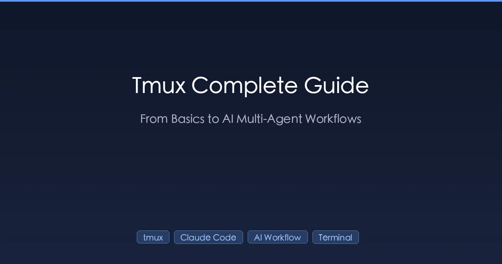

+++
date = '2026-03-03T10:00:00+08:00'
draft = false
title = 'Tmux Complete Guide: From Basics to AI-Powered Multi-Agent Workflows'
description = 'Master tmux from zero to advanced AI development workflows. Learn session management, pane splitting, configuration, and how to run parallel Claude Code agents with tmux for 10x productivity.'
toc = true
tags = ['tmux', 'Claude Code', 'AI Workflow', 'Terminal', 'Developer Tools']
categories = ['AI Guides']
keywords = ['tmux tutorial', 'tmux guide 2026', 'tmux Claude Code', 'tmux AI development', 'tmux multi-agent workflow', 'tmux parallel coding agents', 'tmux configuration', 'terminal multiplexer guide']

[[params.faqItems]]
question = "What is tmux and why should I use it?"
answer = "Tmux (terminal multiplexer) lets you create persistent terminal sessions that survive disconnections. You can split your screen into multiple panes, manage multiple windows, and detach/reattach sessions. For AI developers, tmux is essential for running multiple Claude Code instances in parallel and maintaining long-running AI coding sessions."

[[params.faqItems]]
question = "How do I use tmux with Claude Code?"
answer = "Start a tmux session, split panes for different tasks (Claude Code, logs, tests), and use session persistence to keep AI conversations running. For parallel agents, create separate tmux windows or use Claude Code's built-in agent teams feature with split-pane display mode. This setup lets you run 4-8 coding agents simultaneously."

[[params.faqItems]]
question = "What are the most important tmux shortcuts?"
answer = "The prefix key is Ctrl+b by default. Essential shortcuts: Ctrl+b d (detach), Ctrl+b % (vertical split), Ctrl+b \" (horizontal split), Ctrl+b arrow keys (navigate panes), Ctrl+b c (new window), Ctrl+b n/p (next/previous window), Ctrl+b z (toggle pane zoom), and Ctrl+b [ (copy mode)."

[[params.faqItems]]
question = "Can I run multiple AI coding agents in parallel with tmux?"
answer = "Yes. Combine tmux with git worktrees to run 4-8 parallel Claude Code agents, each in its own tmux window with an isolated code copy. Tools like dmux and ntm automate this workflow. Claude Code's experimental agent teams feature also uses tmux split panes natively for multi-agent coordination."
+++



If you work in the terminal, you've probably lost an SSH session during a long-running task. Or struggled to juggle multiple terminal windows while debugging. Or watched helplessly as Claude Code's conversation vanished when your laptop went to sleep.

**Tmux solves all of these problems** — and in the age of AI-powered development, it has become arguably the most important terminal tool you can learn.

This guide takes you from zero tmux knowledge to running parallel AI coding agents like a pro. Whether you're a complete beginner or an experienced developer looking to supercharge your AI workflow, there's something here for you.

## What Is Tmux?

Tmux stands for **terminal multiplexer**. At its core, it does three things:

1. **Session persistence** — your terminal sessions survive disconnections, SSH drops, and laptop sleep
2. **Window management** — multiple terminal windows within a single connection
3. **Pane splitting** — divide a single window into multiple sections

Think of it as a window manager for your terminal. Just like your desktop OS lets you have multiple application windows, tmux lets you have multiple terminal sessions — all managed from a single connection.

### Why Tmux Matters for AI Development

Traditional tmux benefits (session persistence, multi-tasking) become **superpowers** when combined with AI coding tools:

| Traditional Use | AI-Powered Use |
|----------------|----------------|
| Keep SSH sessions alive | Keep Claude Code conversations alive across disconnections |
| Split screen for code + logs | Claude Code in one pane, tests in another, logs in a third |
| Run background processes | Run multiple AI agents in parallel |
| Remote development | Access your entire AI dev environment from anywhere (even your phone) |

The combination of tmux + Claude Code has become the standard setup for serious AI-assisted development. Let's start from the basics.

## Installation

**macOS** (recommended: use Homebrew):

```bash
brew install tmux
```

**Ubuntu / Debian**:

```bash
sudo apt-get install tmux
```

**CentOS / Fedora**:

```bash
sudo yum install tmux
```

**Verify installation**:

```bash
tmux -V
# tmux 3.5a
```

## Core Concepts: Sessions, Windows, and Panes

Before diving into commands, understand the three-level hierarchy:

```
tmux server
└── Session (a named workspace)
    ├── Window 0 (like a browser tab)
    │   ├── Pane 0 (top half)
    │   └── Pane 1 (bottom half)
    ├── Window 1
    │   └── Pane 0 (full window)
    └── Window 2
        ├── Pane 0 (left)
        ├── Pane 1 (top-right)
        └── Pane 2 (bottom-right)
```

- **Session**: A collection of windows. You can detach from a session and reattach later — everything keeps running.
- **Window**: A full-screen terminal within a session. Like browser tabs.
- **Pane**: A subdivision of a window. Like split views in an IDE.

### The Prefix Key

All tmux shortcuts start with a **prefix key** — by default `Ctrl+b`. The workflow is:

1. Press `Ctrl+b`
2. Release both keys
3. Press the command key

For example, to detach: press `Ctrl+b`, release, then press `d`.

> Many users remap the prefix to `Ctrl+a` (closer to the home row). We'll cover this in the configuration section.

## Session Management

Sessions are the foundation of tmux. Master these first.

### Create and Name Sessions

```bash
# Start a new unnamed session
tmux

# Start a named session (recommended)
tmux new -s dev

# Start a named session in a specific directory
tmux new -s myproject -c ~/projects/myproject
```

Always name your sessions. When you have 5+ sessions running, `tmux ls` showing `0:`, `1:`, `2:` is useless. Named sessions like `dev`, `claude`, `deploy` make life much easier.

### Detach and Reattach

This is tmux's killer feature. Detach from a session, and **everything keeps running**.

```bash
# Detach from current session
# Shortcut: Ctrl+b d
tmux detach

# List all sessions
tmux ls

# Reattach to a named session
tmux attach -t dev

# Reattach to the last session
tmux attach
```

**Real-world scenario**: You start a Claude Code session, have a deep conversation about refactoring your authentication system, then need to close your laptop for a meeting. Just `Ctrl+b d` to detach. After the meeting, `tmux attach -t claude` and you're exactly where you left off — conversation history, running processes, everything intact.

### Session Shortcuts

| Shortcut | Action |
|----------|--------|
| `Ctrl+b d` | Detach from session |
| `Ctrl+b s` | List and switch sessions |
| `Ctrl+b $` | Rename current session |
| `Ctrl+b (` | Switch to previous session |
| `Ctrl+b )` | Switch to next session |

### Other Session Commands

```bash
# Kill a specific session
tmux kill-session -t dev

# Kill all sessions except current
tmux kill-session -a

# Rename a session
tmux rename-session -t old-name new-name

# Switch to another session (from within tmux)
tmux switch -t other-session
```

## Window Management

Windows are like tabs within a session.

### Create and Navigate Windows

```bash
# Create a new window
# Shortcut: Ctrl+b c
tmux new-window

# Create a named window
tmux new-window -n tests

# Rename current window
# Shortcut: Ctrl+b ,
tmux rename-window editor
```

### Window Shortcuts

| Shortcut | Action |
|----------|--------|
| `Ctrl+b c` | Create new window |
| `Ctrl+b ,` | Rename current window |
| `Ctrl+b n` | Next window |
| `Ctrl+b p` | Previous window |
| `Ctrl+b 0-9` | Switch to window by number |
| `Ctrl+b w` | List all windows (interactive picker) |
| `Ctrl+b &` | Close current window (with confirmation) |

The status bar at the bottom shows all windows. The active window is marked with `*`.

## Pane Management

Panes let you see multiple terminals simultaneously — this is where tmux really shines.

### Splitting Panes

```bash
# Split vertically (left | right)
# Shortcut: Ctrl+b %
tmux split-window -h

# Split horizontally (top / bottom)
# Shortcut: Ctrl+b "
tmux split-window -v
```

### Navigating Panes

| Shortcut | Action |
|----------|--------|
| `Ctrl+b ←↑↓→` | Move to pane in that direction |
| `Ctrl+b o` | Cycle through panes |
| `Ctrl+b q` | Show pane numbers (press number to switch) |
| `Ctrl+b z` | Toggle zoom (fullscreen current pane) |
| `Ctrl+b x` | Close current pane |
| `Ctrl+b {` | Swap pane with previous |
| `Ctrl+b }` | Swap pane with next |
| `Ctrl+b Space` | Cycle through pane layouts |

### Resizing Panes

Hold `Ctrl+b`, then press arrow keys while holding `Ctrl`:

```
Ctrl+b Ctrl+←  # Shrink left
Ctrl+b Ctrl+→  # Grow right
Ctrl+b Ctrl+↑  # Shrink up
Ctrl+b Ctrl+↓  # Grow down
```

Or use the command line for precise control:

```bash
# Resize current pane (units in cells)
tmux resize-pane -D 10  # down 10 rows
tmux resize-pane -U 5   # up 5 rows
tmux resize-pane -L 20  # left 20 columns
tmux resize-pane -R 20  # right 20 columns
```

## Copy Mode and Scrolling

By default, you can't scroll up in tmux. Enter **copy mode**:

| Shortcut | Action |
|----------|--------|
| `Ctrl+b [` | Enter copy mode |
| `q` | Exit copy mode |
| `↑↓` or `PgUp/PgDn` | Scroll |
| `Space` | Start selection (in copy mode) |
| `Enter` | Copy selection and exit (in copy mode) |
| `Ctrl+b ]` | Paste copied text |

In copy mode, you can use vim-style navigation (`h`, `j`, `k`, `l`, `Ctrl+u`, `Ctrl+d`) if you set `setw -g mode-keys vi`.

## Configuration: The ~/.tmux.conf File

The default tmux settings are functional but not optimal. Create `~/.tmux.conf` to customize your experience.

### Starter Configuration

```bash
# ~/.tmux.conf — Optimized for AI Development

# ============================================
# General Settings
# ============================================

# Remap prefix from Ctrl+b to Ctrl+a (easier to reach)
unbind C-b
set-option -g prefix C-a
bind-key C-a send-prefix

# Start window numbering at 1 (not 0)
set -g base-index 1
setw -g pane-base-index 1

# Renumber windows when one is closed
set -g renumber-windows on

# Increase scrollback buffer (important for Claude Code output)
set -g history-limit 50000

# Enable mouse support
set -g mouse on

# Reduce escape time (faster key response)
set -sg escape-time 10

# Enable focus events (for vim/neovim integration)
set -g focus-events on

# ============================================
# Display
# ============================================

# Enable 256-color and true color support
set -g default-terminal "screen-256color"
set-option -ga terminal-overrides ",xterm-256color:Tc"

# Set status bar update interval
set -g status-interval 5

# ============================================
# Key Bindings
# ============================================

# Intuitive split shortcuts
bind | split-window -h -c "#{pane_current_path}"
bind - split-window -v -c "#{pane_current_path}"
unbind '"'
unbind %

# New window inherits current path
bind c new-window -c "#{pane_current_path}"

# Vim-style pane navigation
bind h select-pane -L
bind j select-pane -D
bind k select-pane -U
bind l select-pane -R

# Pane resizing with Shift+arrow
bind -r H resize-pane -L 5
bind -r J resize-pane -D 5
bind -r K resize-pane -U 5
bind -r L resize-pane -R 5

# Quick reload config
bind r source-file ~/.tmux.conf \; display "Config reloaded!"

# Enable vi mode for copy
setw -g mode-keys vi

# Vi-style copy bindings
bind-key -T copy-mode-vi v send-keys -X begin-selection
bind-key -T copy-mode-vi y send-keys -X copy-selection-and-cancel
```

After saving, reload with:

```bash
tmux source-file ~/.tmux.conf
```

Or from within tmux: `Ctrl+a r` (with the config above).

### Key Bindings Explained

With the configuration above, your workflow becomes:

| Action | Default | Custom |
|--------|---------|--------|
| Prefix | `Ctrl+b` | `Ctrl+a` |
| Vertical split | `Ctrl+b %` | `Ctrl+a |` |
| Horizontal split | `Ctrl+b "` | `Ctrl+a -` |
| Navigate panes | `Ctrl+b arrows` | `Ctrl+a h/j/k/l` |
| Resize panes | `Ctrl+b Ctrl+arrows` | `Ctrl+a H/J/K/L` |

## Essential Plugins

[TPM (Tmux Plugin Manager)](https://github.com/tmux-plugins/tpm) makes plugin management easy.

### Install TPM

```bash
git clone https://github.com/tmux-plugins/tpm ~/.tmux/plugins/tpm
```

Add to your `~/.tmux.conf`:

```bash
# Plugin manager
set -g @plugin 'tmux-plugins/tpm'

# Recommended plugins
set -g @plugin 'tmux-plugins/tmux-sensible'      # sensible defaults
set -g @plugin 'tmux-plugins/tmux-resurrect'      # save/restore sessions
set -g @plugin 'tmux-plugins/tmux-continuum'      # auto-save sessions
set -g @plugin 'tmux-plugins/tmux-yank'           # system clipboard integration

# Auto-save every 15 minutes
set -g @continuum-save-interval '15'

# Auto-restore on tmux start
set -g @continuum-restore 'on'

# Initialize TPM (keep this at the bottom)
run '~/.tmux/plugins/tpm/tpm'
```

Install plugins: press `Ctrl+a I` (capital I) inside tmux.

### Key Plugins for AI Development

| Plugin | Purpose |
|--------|---------|
| **tmux-resurrect** | Save and restore complete tmux environment (sessions, windows, panes, even running programs) |
| **tmux-continuum** | Automatic saving. Your AI sessions survive system restarts |
| **tmux-yank** | Copy to system clipboard. Essential for copying Claude Code output |
| **tmux-sensible** | Universal defaults that every tmux user should have |

## Tmux + Claude Code: The AI Developer's Setup

Now for the real game-changer. Here's how tmux transforms AI-powered development.

### Basic Workflow: Persistent Claude Code Sessions

The simplest and most impactful use case:

```bash
# Create a dedicated Claude Code session
tmux new -s claude

# Start Claude Code
claude

# ... have a long conversation about your project ...
# Need to leave? Ctrl+a d to detach

# Come back anytime
tmux attach -t claude
# Your entire conversation is preserved
```

This alone is worth learning tmux. Your Claude Code sessions become **persistent workspaces** that survive:

- Laptop sleep/wake
- SSH disconnections
- Terminal crashes
- Network interruptions

### Development Dashboard Layout

Set up a multi-pane layout for maximum visibility:

```bash
#!/bin/bash
# save as ~/scripts/ai-dev.sh

SESSION="ai-dev"

# Create session with first window for Claude Code
tmux new-session -d -s $SESSION -n claude

# Split right pane for tests
tmux split-window -h -t $SESSION:claude

# Split bottom-right for logs
tmux split-window -v -t $SESSION:claude.1

# Set pane sizes (Claude gets 60% width)
tmux resize-pane -t $SESSION:claude.0 -x '60%'

# Create second window for git operations
tmux new-window -t $SESSION -n git

# Select Claude pane and attach
tmux select-window -t $SESSION:claude
tmux select-pane -t 0

tmux attach -t $SESSION
```

This creates:

```
┌──────────────────────┬───────────────┐
│                      │               │
│    Claude Code       │    Tests      │
│    (main workspace)  │  (npm test)   │
│                      │               │
│                      ├───────────────┤
│                      │               │
│                      │    Logs       │
│                      │ (tail -f ...) │
└──────────────────────┴───────────────┘
```

### Claude Code Popup Window (Advanced)

If you want Claude Code available as a **popup overlay** without leaving your current work, use this tmux binding:

```bash
# Add to ~/.tmux.conf
bind -r y run-shell '\
  SESSION="claude-$(echo #{pane_current_path} | md5 | cut -c1-8)"; \
  tmux has-session -t "$SESSION" 2>/dev/null || \
  tmux new-session -d -s "$SESSION" -c "#{pane_current_path}" "claude"; \
  tmux display-popup -w80% -h80% -E "tmux attach-session -t $SESSION"'
```

How this works:

1. Generates a unique session name based on your current directory (via MD5 hash)
2. Creates a new detached tmux session running Claude Code if one doesn't exist
3. Opens an 80% size popup window attached to that session

Press `Ctrl+a y` to toggle the popup. Close it, and Claude Code keeps running in the background. Open it again — conversation intact.

> This technique comes from [Takuya Matsuyama's workflow](https://www.devas.life/how-to-run-claude-code-in-a-tmux-popup-window-with-persistent-sessions/). It's essentially a nested tmux session displayed as a popup.

## Running Parallel AI Agents with Tmux

This is where tmux becomes truly transformative. Instead of waiting for one AI agent to finish, run **4-8 agents in parallel**, each working on different tasks.

### Why Parallel Agents?

The math is compelling. If a single AI agent has a ~25% chance of producing a perfect solution on the first try, running four agents gives you:

```
P(at least one success) = 1 - (0.75)^4 ≈ 68%
```

The cost? Roughly 4x the tokens. But the time savings are massive — instead of sequential trial-and-error, you get parallel exploration.

### Method 1: Manual Tmux + Git Worktrees

Git worktrees give each agent an **isolated copy** of your repository, preventing file conflicts:

```bash
# Create worktrees for parallel agents
git worktree add -b feature-auth ../project-auth
git worktree add -b feature-api ../project-api
git worktree add -b feature-ui ../project-ui

# Create a tmux session with one window per agent
tmux new-session -d -s agents -n auth -c ../project-auth
tmux new-window -t agents -n api -c ../project-api
tmux new-window -t agents -n ui -c ../project-ui

# Start Claude Code in each window
tmux send-keys -t agents:auth "claude" Enter
tmux send-keys -t agents:api "claude" Enter
tmux send-keys -t agents:ui "claude" Enter

# Attach and monitor
tmux attach -t agents
```

Now switch between agents with `Ctrl+a n` (next window) or `Ctrl+a 1/2/3`.

### Method 2: Claude Code Agent Teams (Built-in)

Claude Code has experimental native support for multi-agent teams that uses tmux for display:

**Enable agent teams**:

```json
// ~/.claude/settings.json
{
  "env": {
    "CLAUDE_CODE_EXPERIMENTAL_AGENT_TEAMS": "1"
  }
}
```

**Start a team**:

```
Create an agent team to work on this feature:
- One teammate for backend API implementation
- One teammate for frontend components
- One teammate for writing tests
```

Claude automatically:
- Creates tmux split panes (one per teammate)
- Assigns tasks via a shared task list
- Coordinates work between agents
- Synthesizes results

Each teammate is a full, independent Claude Code instance with its own context window. You can click any pane to interact directly with that agent.

> Agent teams work best in tmux on macOS. For iTerm2, use `tmux -CC` for the best experience.

### Method 3: The Feature Design (FD) System

For larger projects, [Manuel Schipper's approach](https://schipper.ai/posts/parallel-coding-agents/) provides a structured framework:

**Role assignment**:
- **Planner agents** — explore the problem and write specs
- **Worker agents** — implement from completed specs
- **PM agents** — manage backlog and capture ideas

**Workflow**:

```bash
# Terminal 1: Planner agent
tmux new-session -s planner -c ~/project
# "Explore the authentication redesign, write a Feature Design spec"

# Terminal 2-4: Worker agents (each with a worktree)
tmux new-session -s worker1 -c ~/project-wt1
# "Implement FD-042 following the spec in docs/fd/042-auth-redesign.md"

tmux new-session -s worker2 -c ~/project-wt2
# "Implement FD-043 following the spec in docs/fd/043-api-routes.md"

tmux new-session -s worker3 -c ~/project-wt3
# "Write tests for FD-042 and FD-043"
```

**Practical limit**: Cognitive load peaks at **8 agents**. Beyond that, you lose situational awareness. Start with 3-5 and scale up as needed.

### Method 4: Automated Tools

Several tools automate the tmux + AI agent workflow:

| Tool | Description |
|------|-------------|
| [**dmux**](https://dmux.ai/) | Tmux pane manager for AI agents with automatic git worktree isolation |
| [**ntm**](https://github.com/Dicklesworthstone/ntm) | Named Tmux Manager: spawn, tile, and coordinate multiple AI agents |
| [**Codeman**](https://github.com/Ark0N/Codeman) | Manage 20+ parallel Claude Code sessions via web UI |

Example with dmux:

```bash
# Start 3 parallel agents with isolated worktrees
dmux start --agents 3 --prompt "Implement the user dashboard feature"

# Monitor all agents
dmux status

# Merge results
dmux merge
```

## Remote AI Development with Tmux

One of the most powerful patterns: run Claude Code on a remote server, access from anywhere.

### Setup

```bash
# On your server
tmux new -s remote-claude
claude

# From any device (laptop, phone, tablet)
ssh user@your-server
tmux attach -t remote-claude
```

This means you can:
- Start a complex refactoring on your desktop
- Continue from your laptop on the couch
- Check progress from your phone during commute
- Never lose context, ever

### SSH Configuration Tips

Add to `~/.ssh/config` for smoother remote tmux:

```
Host devserver
    HostName your-server.com
    User your-username
    ServerAliveInterval 60
    ServerAliveCountMax 3
    TCPKeepAlive yes
```

The `ServerAliveInterval` prevents SSH timeouts during long Claude Code sessions.

## Advanced Tmux Techniques

### Synchronized Panes

Send the same command to all panes simultaneously:

```bash
# Toggle synchronized input
Ctrl+a :setw synchronize-panes on

# Now every keystroke goes to ALL panes
# Useful for running the same setup command across multiple worktrees

# Turn off when done
Ctrl+a :setw synchronize-panes off
```

### Send Keys Programmatically

Automate agent interactions from scripts:

```bash
# Send a command to a specific pane
tmux send-keys -t agents:auth.0 "npm test" Enter

# Send to all windows in a session
for window in $(tmux list-windows -t agents -F '#W'); do
  tmux send-keys -t "agents:$window" "git pull" Enter
done
```

### Session Grouping

Share a session between multiple terminals (pair programming with AI):

```bash
# Terminal 1
tmux new -s shared

# Terminal 2 (joins the same session, independent window selection)
tmux new -t shared -s paired
```

Both terminals share the same session, but can view different windows independently. Perfect for one person watching Claude Code while another monitors tests.

### Hooks and Notifications

Get notified when an AI agent finishes:

```bash
# Add to ~/.tmux.conf
# Bell notification when a pane produces output after going silent
set -g visual-activity on
setw -g monitor-activity on

# Or use the bell character in agent scripts
# When Claude Code finishes a task:
echo -e '\a'  # triggers tmux bell notification
```

## Complete Cheat Sheet

### Sessions

| Command | Description |
|---------|-------------|
| `tmux new -s name` | New named session |
| `tmux ls` | List sessions |
| `tmux attach -t name` | Attach to session |
| `tmux kill-session -t name` | Kill session |
| `Ctrl+a d` | Detach |
| `Ctrl+a s` | Switch session |
| `Ctrl+a $` | Rename session |

### Windows

| Command | Description |
|---------|-------------|
| `Ctrl+a c` | New window |
| `Ctrl+a ,` | Rename window |
| `Ctrl+a n / p` | Next / previous window |
| `Ctrl+a 0-9` | Go to window N |
| `Ctrl+a w` | Window picker |
| `Ctrl+a &` | Kill window |

### Panes

| Command | Description |
|---------|-------------|
| `Ctrl+a |` | Vertical split |
| `Ctrl+a -` | Horizontal split |
| `Ctrl+a h/j/k/l` | Navigate (vim-style) |
| `Ctrl+a z` | Toggle zoom |
| `Ctrl+a x` | Kill pane |
| `Ctrl+a Space` | Cycle layouts |
| `Ctrl+a q` | Show pane numbers |

### Other

| Command | Description |
|---------|-------------|
| `Ctrl+a [` | Copy mode (scroll) |
| `Ctrl+a ]` | Paste |
| `Ctrl+a :` | Command prompt |
| `Ctrl+a r` | Reload config |
| `Ctrl+a ?` | List all shortcuts |
| `Ctrl+a t` | Show clock |

> Note: These shortcuts assume the custom `~/.tmux.conf` from this guide (prefix = `Ctrl+a`, vim bindings).

## Best Practices

### For General Use

1. **Always name your sessions** — `tmux new -s projectname`, not just `tmux`
2. **Use the mouse** — `set -g mouse on` makes tmux much more approachable
3. **Increase scrollback** — 50,000 lines minimum for AI output
4. **Install tmux-resurrect** — your sessions survive system restarts
5. **Learn copy mode** — `Ctrl+a [` is essential for reviewing long outputs

### For AI Development

1. **One session per project** — keep AI conversations organized by project
2. **Dedicated Claude pane** — give Claude Code the largest pane (60%+ width)
3. **Keep tests visible** — watch tests pass/fail in real-time as Claude codes
4. **Use worktrees for parallel agents** — prevent file conflicts between agents
5. **Start small** — begin with 2-3 agents, scale to 4-8 as you get comfortable
6. **Set notification bells** — know when agents finish without constant monitoring
7. **Checkpoint often** — AI agents can lose context in long sessions; save progress

### What to Avoid

- Don't run more than 8 parallel agents (cognitive overload)
- Don't have multiple agents edit the same file (merge conflicts)
- Don't forget to kill unused sessions (`tmux ls` and clean up regularly)
- Don't skip naming sessions (you will regret it)

## Conclusion

Tmux is one of those tools that pays exponential dividends the more you use it. On its own, it's already a powerful terminal manager. Combined with AI coding tools like Claude Code, it becomes the backbone of a modern development workflow that's:

- **Persistent** — never lose a conversation or running process
- **Parallel** — run multiple AI agents simultaneously
- **Portable** — access your full development environment from anywhere
- **Productive** — see everything at once without switching windows

Start with the basics: install tmux, create a named session, learn to detach and reattach. Then gradually add pane splitting, custom configuration, and eventually parallel AI agents. Within a week, you'll wonder how you ever developed without it.

The terminal is not dead. With tmux and AI, it's more alive than ever.
