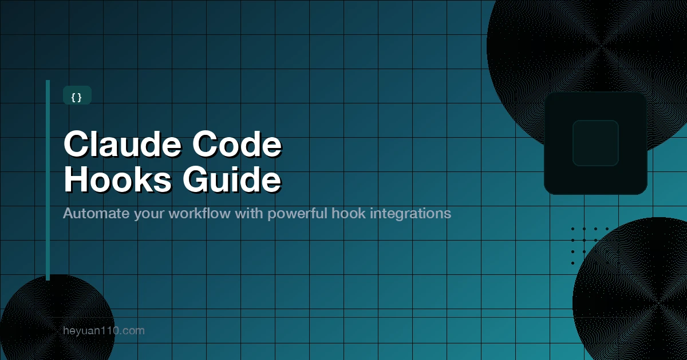

+++
date = '2026-03-04T09:00:00+08:00'
draft = false
title = 'Claude Code Hooks 完全指南：自动化你的 AI 工作流（2026）'
description = '详解 Claude Code Hooks 配置与实战案例。学习如何自动格式化代码、拦截危险命令、自动化工作流——覆盖全部 17 个生命周期事件。'
toc = true
tags = ['Claude Code', 'Hooks', 'Automation', 'Developer Tools']
categories = ['AI Guides']
keywords = ['claude code hooks', 'claude code hooks 教程', 'claude code 自动化', 'PreToolUse hooks', 'PostToolUse hooks', 'claude code 生命周期事件', 'claude code settings.json hooks']

[[params.faqItems]]
question = "什么是 Claude Code Hooks？它们如何工作？"
answer = "Claude Code Hooks 是用户定义的 Shell 命令、HTTP 端点或 LLM 提示，会在 Claude Code 生命周期的特定节点自动执行。它们在 settings.json 中配置，可以在工具调用前后、会话开始/结束时或 Claude 完成响应时运行。Hooks 通过 stdin 接收 JSON 上下文，并通过退出码或 JSON 输出来控制行为。"

[[params.faqItems]]
question = "在哪里配置 Claude Code Hooks？"
answer = "Hooks 在三个作用域的 JSON 配置文件中定义：项目级别 .claude/settings.json（通过 Git 与团队共享）、用户级别 ~/.claude/settings.json（适用于你所有的项目）、或 .claude/settings.local.json（项目专属但被 gitignore）。企业组织还可以设置托管策略 hooks。"

[[params.faqItems]]
question = "Claude Code Hooks 可以拦截危险命令吗？"
answer = "可以。PreToolUse hooks 在工具执行前运行，可以阻止操作。你的 hook 脚本通过 stdin JSON 检查命令内容，如果匹配危险模式（如 rm -rf / 或 DROP TABLE），hook 返回退出码 2 或 JSON deny 决策来阻止执行。被拦截的命令永远不会到达你的 shell。"

[[params.faqItems]]
question = "Claude Code Hooks、CLAUDE.md 和 Skills 有什么区别？"
answer = "Hooks 是自动的生命周期脚本，用于强制执行、格式化和日志记录，每次都会自动运行无需提示。CLAUDE.md 提供持久的项目上下文和指令，在会话启动时加载。Skills 是可复用的提示工作流，由用户通过斜杠命令手动触发。Hooks 用于确定性自动化，CLAUDE.md 用于项目知识，Skills 用于按需工作流。"

[[params.faqItems]]
question = "如何调试不工作的 Claude Code Hooks？"
answer = "检查以下常见问题：matcher 值区分大小写（用 Bash 而非 bash），hooks 必须用 cat 或 jq 读取 stdin（未读的 stdin 会丢失），shell 配置文件的输出可能破坏 JSON 解析，hooks 有默认超时时间（命令类型 600 秒）。使用详细模式（Ctrl+O）查看 hook 输出。手动向脚本传入示例 JSON 来测试你的 hook。"
+++



Claude Code 本质上是概率性的。让它格式化代码，它可能会做。告诉它永远不要碰 `.env` 文件，它通常会遵守——直到某次它不遵守。

Claude Code Hooks 解决了这个问题。它们是在 Claude 运行过程中特定节点自动执行的 Shell 命令、HTTP 端点或 LLM 提示。在文件编辑之前、命令执行之后、会话开始时、Claude 完成任务时——Hooks 让你对工作流中不能靠运气的部分拥有确定性控制。

本指南涵盖你需要的一切：什么是 Hooks、全部 17 个生命周期事件、配置格式、8 个可直接复制使用的实战案例、matcher 规则，以及何时选择 Hooks 而非 [CLAUDE.md](/zh/posts/ai/2026-02-28-claude-code-claudemd-guide/) 或 [Skills](/zh/posts/ai/2026-02-28-claude-code-skills-guide/)。

## 什么是 Claude Code Hooks？

Hooks 是用户定义的自动化操作，Claude Code 会在特定生命周期节点执行。可以把它们想象成 [Git hooks](https://git-scm.com/docs/githooks)，只不过是给你的 AI 编程助手用的，而不是版本控制系统。

关键区别在于：当你告诉 Claude「每次编辑文件后都运行 Prettier」，Claude *可能*会忘记、*可能*觉得没必要、或者*可能*在不同会话中有不同的理解。而一个 `PostToolUse` hook 配置了 Prettier，则会在每次文件编辑时触发，毫无例外。

### 四种 Hook 类型

每个 hook handler 都有一个 `type` 字段，决定了它的运行方式：

| 类型 | 功能 | 适用场景 |
|------|------|----------|
| `command` | 运行 Shell 命令 | 格式化、日志、文件保护、通知 |
| `http` | 向 URL 发送 POST 请求 | 远程验证服务、webhook 集成 |
| `prompt` | 向 Claude 模型发送单轮评估提示 | 上下文重注入、是/否验证 |
| `agent` | 启动一个有工具访问权限的子代理 | 复杂的多步骤验证、测试套件分析 |

`command` 类型能处理 90% 的场景，从它开始就对了。

### 17 个生命周期事件

Hooks 绑定到 Claude 运行过程中的特定事件。以下是全部 17 个事件，按触发时机分组：

**会话生命周期：**

| 事件 | 触发时机 | 可以阻止？ |
|------|----------|------------|
| `SessionStart` | 会话开始或恢复 | 否 |
| `InstructionsLoaded` | CLAUDE.md 或规则文件加载到上下文 | 否 |
| `SessionEnd` | 会话终止 | 否 |

**用户输入：**

| 事件 | 触发时机 | 可以阻止？ |
|------|----------|------------|
| `UserPromptSubmit` | 用户提交提示，在 Claude 处理之前 | 是 |

**工具生命周期（代理循环）：**

| 事件 | 触发时机 | 可以阻止？ |
|------|----------|------------|
| `PreToolUse` | 工具调用执行之前 | 是 |
| `PermissionRequest` | 权限对话框出现时 | 是 |
| `PostToolUse` | 工具调用成功之后 | 否 |
| `PostToolUseFailure` | 工具调用失败之后 | 否 |

**完成阶段：**

| 事件 | 触发时机 | 可以阻止？ |
|------|----------|------------|
| `Stop` | Claude 完成响应 | 是 |
| `SubagentStart` | 子代理被启动 | 否 |
| `SubagentStop` | 子代理完成 | 是 |
| `Notification` | Claude 发送通知 | 否 |
| `TeammateIdle` | 代理团队中的队友即将空闲 | 是 |
| `TaskCompleted` | 任务被标记为已完成 | 是 |

**上下文和配置：**

| 事件 | 触发时机 | 可以阻止？ |
|------|----------|------------|
| `PreCompact` | 上下文压缩之前 | 否 |
| `ConfigChange` | 会话期间配置文件发生变化 | 是 |
| `WorktreeCreate` | 工作树正在被创建 | 是 |

日常自动化重点关注这五个：`PreToolUse`、`PostToolUse`、`Notification`、`Stop` 和 `SessionStart`。

## 配置格式

### Hooks 配置文件位置

Hooks 在 JSON 配置文件中定义。放置位置决定了作用范围：

| 作用域 | 文件路径 | 影响范围 |
|--------|----------|----------|
| **项目** | `.claude/settings.json` | 团队所有人（提交到 Git） |
| **用户** | `~/.claude/settings.json` | 你的所有项目，仅自己 |
| **本地** | `.claude/settings.local.json` | 当前项目，仅自己（被 gitignore） |
| **插件** | 插件中的 `hooks/hooks.json` | 插件启用时生效 |
| **托管** | 组织策略配置 | 组织内所有用户 |

**建议**：将共享自动化放在 `.claude/settings.json` 中让整个团队受益。将个人偏好（如桌面通知）放在 `~/.claude/settings.json` 中。

### 配置结构

配置有三层嵌套：事件、matcher 组和 hook 处理器。

```json
{
  "hooks": {
    "PostToolUse": [
      {
        "matcher": "Edit|Write",
        "hooks": [
          {
            "type": "command",
            "command": "your-shell-command-here",
            "timeout": 30
          }
        ]
      }
    ]
  }
}
```

逐层解析：

1. **事件**（`PostToolUse`）：选择触发 hook 的生命周期事件
2. **Matcher 组**（`"matcher": "Edit|Write"`）：过滤哪些工具调用会触发
3. **Hook 处理器**（`hooks` 数组）：匹配时运行的一个或多个命令

| 字段 | 必填 | 默认值 | 说明 |
|------|------|--------|------|
| `type` | 是 | -- | `"command"`、`"http"`、`"prompt"` 或 `"agent"` |
| `command` | 是（command 类型） | -- | 要执行的 Shell 命令 |
| `matcher` | 否 | 匹配所有 | 用正则过滤哪些工具触发此 hook |
| `timeout` | 否 | 600秒（command）、30秒（prompt） | 最大执行时间（秒） |
| `async` | 否 | false | 在后台运行，不阻塞（仅 command 类型） |
| `statusMessage` | 否 | -- | hook 运行时的自定义加载提示 |

### Matcher 规则

`matcher` 字段使用正则表达式且**区分大小写**。这是最常见的 bug 来源。

| Matcher 值 | 匹配内容 |
|------------|----------|
| `"Bash"` | 仅 Bash 工具 |
| `"Edit"` | 仅 Edit 工具 |
| `"Write"` | 仅 Write 工具 |
| `"Edit\|Write"` | Edit 或 Write |
| `"mcp__.*"` | 所有 MCP 工具 |
| `"mcp__github__.*"` | GitHub MCP 服务器的所有工具 |
| `"mcp__memory__create_entities"` | 某个特定的 MCP 工具 |
| 未指定或 `"*"` | 该事件的每次触发 |

**重要提醒**：`"Bash"` 能匹配，`"bash"` 不行。工具名称是 PascalCase。务必仔细检查你的 matcher。

不同事件匹配不同字段。对于 `PreToolUse`/`PostToolUse`，matcher 检查工具名称。对于 `SessionStart`，检查会话来源（`startup`、`resume`、`clear`、`compact`）。对于 `Notification`，检查通知类型。某些事件如 `Stop` 和 `UserPromptSubmit` 根本不支持 matcher，每次触发都会执行。

### 输入/输出机制

Hook 命令通过 **stdin** 接收 JSON 上下文。具体字段取决于事件类型，但所有事件都包含这些通用字段：

```json
{
  "session_id": "abc123",
  "transcript_path": "/path/to/transcript.jsonl",
  "cwd": "/path/to/project",
  "permission_mode": "default",
  "hook_event_name": "PreToolUse"
}
```

对于 `PreToolUse` 和 `PostToolUse`，还会额外获得 `tool_name` 和 `tool_input`：

```json
{
  "session_id": "abc123",
  "hook_event_name": "PreToolUse",
  "tool_name": "Bash",
  "tool_input": {
    "command": "npm test"
  }
}
```

使用 `jq` 提取特定字段：

```bash
# 提取 bash 命令
jq -r '.tool_input.command'

# 从 Edit 操作中提取文件路径
jq -r '.tool_input.file_path'
```

### 退出码与决策控制

对于 `PreToolUse` hooks，退出码控制后续行为：

| 退出码 | 效果 |
|--------|------|
| `0` | 允许操作（检查 stdout 中的 JSON 决策） |
| `2` | **阻止**操作——stderr 内容会反馈给 Claude |
| 其他 | 非阻塞错误——操作继续，错误被记录 |

要在退出码 0 时实现更精细的控制，可以向 stdout 返回结构化 JSON：

```json
{
  "hookSpecificOutput": {
    "hookEventName": "PreToolUse",
    "permissionDecision": "allow",
    "permissionDecisionReason": "Safe read-only command"
  }
}
```

`permissionDecision` 的有效值：
- `"allow"` -- 跳过权限提示，自动批准
- `"deny"` -- 阻止操作（等同于退出码 2）
- `"ask"` -- 向用户显示正常的权限提示

对于 `Stop` 和 `PostToolUse` hooks，使用顶层的 `decision` 字段：

```json
{
  "decision": "block",
  "reason": "Tests must pass before stopping"
}
```

## 8 个实战 Hook 案例

以下是 8 个可直接用于生产的配置。每个都是完整的 JSON 片段，可直接放入你的 `.claude/settings.json`。

### 1. 文件编辑后自动格式化代码

每次 Claude 编辑或创建文件后自动运行 Prettier。不再需要「帮我格式化一下」的追加请求。

```json
{
  "hooks": {
    "PostToolUse": [
      {
        "matcher": "Edit|Write",
        "hooks": [
          {
            "type": "command",
            "command": "FILE=$(jq -r '.tool_input.file_path // empty') && [ -n \"$FILE\" ] && npx prettier --write \"$FILE\" 2>/dev/null || true"
          }
        ]
      }
    ]
  }
}
```

**工作原理**：每次 `Edit` 或 `Write` 操作后，hook 用 `jq` 从 stdin 读取 JSON，提取文件路径，然后运行 Prettier。`2>/dev/null || true` 确保 Prettier 无法处理的文件不会导致 hook 失败。

**前提条件**：项目中已安装 `npm install --save-dev prettier`。

### 2. 拦截危险的 Shell 命令

无论 Claude 生成什么，阻止破坏性命令到达你的 shell：

```json
{
  "hooks": {
    "PreToolUse": [
      {
        "matcher": "Bash",
        "hooks": [
          {
            "type": "command",
            "command": "CMD=$(jq -r '.tool_input.command // empty') && if echo \"$CMD\" | grep -qEi '(rm\\s+-rf\\s+/|DROP\\s+TABLE|DROP\\s+DATABASE|mkfs\\.|chmod\\s+-R\\s+777\\s+/)'; then jq -n '{hookSpecificOutput: {hookEventName: \"PreToolUse\", permissionDecision: \"deny\", permissionDecisionReason: \"Dangerous command blocked by hook\"}}'; fi"
          }
        ]
      }
    ]
  }
}
```

**被拦截的模式**：`rm -rf /`、`DROP TABLE`、`DROP DATABASE`、`mkfs.`（格式化文件系统）、`chmod -R 777 /`。

**工作原理**：hook 检查 Claude 要运行的命令。如果匹配危险模式，输出一个 JSON deny 决策。命令永远不会执行。你可以自定义 grep 模式来添加项目特定的危险命令。

### 3. 保护敏感文件不被修改

阻止 Claude 编辑 `.env` 文件、lockfile、凭证等不应被 AI 修改的文件：

```json
{
  "hooks": {
    "PreToolUse": [
      {
        "matcher": "Edit|Write",
        "hooks": [
          {
            "type": "command",
            "command": "FILE=$(jq -r '.tool_input.file_path // empty') && if echo \"$FILE\" | grep -qE '(\\.env|\\.lock$|secrets\\.yaml|credentials|id_rsa|\\.pem$)'; then echo \"BLOCKED: Cannot modify protected file: $FILE\" >&2; exit 2; fi"
          }
        ]
      }
    ]
  }
}
```

**工作原理**：在任何 `Edit` 或 `Write` 操作之前，hook 将目标文件与保护列表进行匹配。如果命中，以退出码 2 退出并通过 stderr 发送错误消息。Claude 会看到这条消息并理解操作被阻止的原因。

### 4. 编辑后自动 Lint 检查

每次编辑后对 JavaScript/TypeScript 文件运行 ESLint 自动修复，在提交前捕获问题：

```json
{
  "hooks": {
    "PostToolUse": [
      {
        "matcher": "Edit|Write",
        "hooks": [
          {
            "type": "command",
            "command": "FILE=$(jq -r '.tool_input.file_path // empty') && [ -n \"$FILE\" ] && [[ \"$FILE\" =~ \\.(js|ts|jsx|tsx)$ ]] && npx eslint --fix \"$FILE\" 2>/dev/null || true"
          }
        ]
      }
    ]
  }
}
```

**工作原理**：与 Prettier hook 类似，但增加了文件扩展名检查，确保 ESLint 只对 JavaScript/TypeScript 文件运行。可以与 Prettier hook 配合使用，实现完整的代码质量自动化。

### 5. 任务完成时桌面通知

当 Claude 需要你关注时获得系统通知。对于切换到其他窗口处理长时间任务来说必不可少。

**macOS：**

```json
{
  "hooks": {
    "Notification": [
      {
        "hooks": [
          {
            "type": "command",
            "command": "MSG=$(jq -r '.message // \"Needs attention\"') && osascript -e \"display notification \\\"$MSG\\\" with title \\\"Claude Code\\\"\""
          }
        ]
      }
    ]
  }
}
```

**Linux：**

```json
{
  "hooks": {
    "Notification": [
      {
        "hooks": [
          {
            "type": "command",
            "command": "MSG=$(jq -r '.message // \"Needs attention\"') && notify-send 'Claude Code' \"$MSG\""
          }
        ]
      }
    ]
  }
}
```

**提示**：将此配置放在 `~/.claude/settings.json`（用户级别），这样所有项目都能使用。

### 6. Claude 停止时自动运行测试

使用 `Stop` hook 在接受结果之前运行测试套件来验证 Claude 的工作：

```json
{
  "hooks": {
    "Stop": [
      {
        "hooks": [
          {
            "type": "command",
            "command": "cd \"$CLAUDE_PROJECT_DIR\" && npm test 2>&1 | tail -20; if [ ${PIPESTATUS[0]} -ne 0 ]; then echo '{\"decision\": \"block\", \"reason\": \"Tests failed. Please fix the failing tests before finishing.\"}'; fi"
          }
        ]
      }
    ]
  }
}
```

**工作原理**：当 Claude 试图停止时，hook 运行 `npm test`。如果测试失败，输出 `decision: "block"` 的 JSON，阻止 Claude 停止并将失败原因反馈给 Claude。Claude 会继续工作来修复失败的测试。

**注意**：此 hook 会让 Claude 在每个任务上做更多工作（消耗更多 token）。在正确性比速度更重要的项目上选择性使用。

### 7. 记录所有命令用于审计

保存 Claude 运行的每条 Shell 命令的时间戳日志。适用于调试、安全审计和了解 Claude 在会话中做了什么：

```json
{
  "hooks": {
    "PostToolUse": [
      {
        "matcher": "Bash",
        "hooks": [
          {
            "type": "command",
            "command": "jq -r '\"[\" + (now | strftime(\"%Y-%m-%d %H:%M:%S\")) + \"] \" + .tool_input.command' >> \"${CLAUDE_PROJECT_DIR:-.}/.claude/command_log.txt\"",
            "async": true
          }
        ]
      }
    ]
  }
}
```

**输出示例：**

```
[2026-03-05 14:32:15] npm test
[2026-03-05 14:32:48] git status
[2026-03-05 14:33:02] cat src/index.ts
```

`"async": true` 标志让日志在后台运行，不会拖慢 Claude 的工作流。记得将 `.claude/command_log.txt` 加入 `.gitignore`。

### 8. 自动放行安全的只读命令

对只读数据的命令跳过权限提示，对写入操作仍然提示：

```json
{
  "hooks": {
    "PreToolUse": [
      {
        "matcher": "Bash",
        "hooks": [
          {
            "type": "command",
            "command": "CMD=$(jq -r '.tool_input.command // empty') && if echo \"$CMD\" | grep -qE '^(ls|cat|head|tail|wc|find|grep|rg|git\\s+(status|log|diff|show|branch)|echo|pwd|which|file|stat)\\b'; then echo '{\"hookSpecificOutput\": {\"hookEventName\": \"PreToolUse\", \"permissionDecision\": \"allow\", \"permissionDecisionReason\": \"Safe read-only command\"}}'; fi"
          }
        ]
      }
    ]
  }
}
```

**工作原理**：hook 检查命令是否以已知安全命令开头。如果是，返回 `permissionDecision: "allow"` 跳过权限提示。对于其他命令，hook 不产生输出，回退到默认权限行为。

**安全提示**：根据你的环境审查白名单命令。移除你认为可能有风险的命令。

## 完整项目配置

以下是一个真实的 `.claude/settings.json`，将多个 hooks 组合成一套生产级配置：

```json
{
  "hooks": {
    "PreToolUse": [
      {
        "matcher": "Edit|Write",
        "hooks": [
          {
            "type": "command",
            "command": "FILE=$(jq -r '.tool_input.file_path // empty') && if echo \"$FILE\" | grep -qE '(\\.env|\\.lock$|secrets\\.yaml|credentials)'; then echo \"BLOCKED: Protected file: $FILE\" >&2; exit 2; fi"
          }
        ]
      },
      {
        "matcher": "Bash",
        "hooks": [
          {
            "type": "command",
            "command": "CMD=$(jq -r '.tool_input.command // empty') && if echo \"$CMD\" | grep -qEi '(rm\\s+-rf\\s+/|DROP\\s+TABLE)'; then echo \"BLOCKED: Dangerous command\" >&2; exit 2; fi"
          }
        ]
      },
      {
        "matcher": "Bash",
        "hooks": [
          {
            "type": "command",
            "command": "CMD=$(jq -r '.tool_input.command // empty') && if echo \"$CMD\" | grep -qE '^(ls|cat|head|tail|grep|rg|git\\s+(status|log|diff)|pwd|which)\\b'; then echo '{\"hookSpecificOutput\":{\"hookEventName\":\"PreToolUse\",\"permissionDecision\":\"allow\"}}'; fi"
          }
        ]
      }
    ],
    "PostToolUse": [
      {
        "matcher": "Edit|Write",
        "hooks": [
          {
            "type": "command",
            "command": "FILE=$(jq -r '.tool_input.file_path // empty') && [ -n \"$FILE\" ] && npx prettier --write \"$FILE\" 2>/dev/null; git add \"$FILE\" 2>/dev/null || true"
          }
        ]
      },
      {
        "matcher": "Bash",
        "hooks": [
          {
            "type": "command",
            "command": "jq -r '\"[\" + (now | strftime(\"%Y-%m-%d %H:%M:%S\")) + \"] \" + .tool_input.command' >> \"${CLAUDE_PROJECT_DIR:-.}/.claude/command_log.txt\"",
            "async": true
          }
        ]
      }
    ],
    "Notification": [
      {
        "hooks": [
          {
            "type": "command",
            "command": "osascript -e 'display notification \"Claude needs your attention\" with title \"Claude Code\"'"
          }
        ]
      }
    ]
  }
}
```

这个配置实现了：

1. **拦截**对 `.env`、lockfile 和秘钥文件的修改
2. **拦截**破坏性 Shell 命令如 `rm -rf /`
3. **自动放行**安全的只读命令，无需权限提示
4. **自动格式化**编辑后的文件（Prettier）
5. **自动暂存**编辑后的文件（`git add`）
6. **记录**所有 Bash 命令及时间戳（异步，不阻塞）
7. **发送** macOS 桌面通知

**Matcher 组顺序很重要**：`PreToolUse` matcher 组按数组顺序执行。文件保护组在自动放行组之前运行，因此即使命令本身会被自动放行，受保护的文件也始终会被拦截。

## 高级技巧

### 复杂逻辑使用脚本文件

内联命令很快就会变得难以阅读。超过一行的逻辑都应该用脚本文件：

```json
{
  "hooks": {
    "PreToolUse": [
      {
        "matcher": "Bash",
        "hooks": [
          {
            "type": "command",
            "command": "\"$CLAUDE_PROJECT_DIR\"/.claude/hooks/validate-command.sh"
          }
        ]
      }
    ]
  }
}
```

然后创建 `.claude/hooks/validate-command.sh`：

```bash
#!/bin/bash
# .claude/hooks/validate-command.sh
# 在执行前验证 Bash 命令

# 从 stdin 读取完整的 JSON 输入
INPUT=$(cat)
CMD=$(echo "$INPUT" | jq -r '.tool_input.command // empty')

# 定义被拦截的模式
DANGEROUS_PATTERNS=(
  'rm\s+-rf\s+/'
  'DROP\s+TABLE'
  'DROP\s+DATABASE'
  'mkfs\.'
  'chmod\s+-R\s+777\s+/'
  'dd\s+if=.*of=/dev/'
)

# 检查每个模式
for pattern in "${DANGEROUS_PATTERNS[@]}"; do
  if echo "$CMD" | grep -qEi "$pattern"; then
    # 输出结构化的 deny 决策
    jq -n --arg reason "Blocked pattern: $pattern" '{
      hookSpecificOutput: {
        hookEventName: "PreToolUse",
        permissionDecision: "deny",
        permissionDecisionReason: $reason
      }
    }'
    exit 0
  fi
done

# 没有匹配到危险模式，允许执行
exit 0
```

别忘了设为可执行：`chmod +x .claude/hooks/validate-command.sh`

### 上下文压缩后重注入

当 Claude 压缩上下文窗口时，可能会丢失重要的项目细节。可以用 `PostToolUse` hook 在压缩时重注入关键上下文，或用 `SessionStart` hook 在 compact 时触发。最简单的方式是使用 `prompt` 类型的 hook：

```json
{
  "hooks": {
    "SessionStart": [
      {
        "matcher": "compact",
        "hooks": [
          {
            "type": "command",
            "command": "cat \"${CLAUDE_PROJECT_DIR}/.claude/compaction-context.md\" 2>/dev/null || true"
          }
        ]
      }
    ]
  }
}
```

创建 `.claude/compaction-context.md`，写入你的关键项目规则。文件内容通过 stdout 输出，`SessionStart` 会将其作为上下文添加给 Claude。

### 用 SessionStart 持久化环境变量

`SessionStart` hooks 可以访问 `CLAUDE_ENV_FILE`，允许你为会话中所有后续 Bash 命令持久化环境变量：

```json
{
  "hooks": {
    "SessionStart": [
      {
        "hooks": [
          {
            "type": "command",
            "command": "[ -n \"$CLAUDE_ENV_FILE\" ] && echo 'export NODE_ENV=development' >> \"$CLAUDE_ENV_FILE\" && echo 'export DEBUG=true' >> \"$CLAUDE_ENV_FILE\""
          }
        ]
      }
    ]
  }
}
```

这对于设置项目特定的环境变量很有用，无需修改 shell 配置文件。

### HTTP Hooks 用于远程验证

对于拥有集中验证服务的团队，HTTP hooks 将事件 JSON 作为 POST 请求发送：

```json
{
  "hooks": {
    "PreToolUse": [
      {
        "matcher": "Bash",
        "hooks": [
          {
            "type": "http",
            "url": "http://localhost:8080/hooks/validate-command",
            "timeout": 10,
            "headers": {
              "Authorization": "Bearer $API_TOKEN"
            },
            "allowedEnvVars": ["API_TOKEN"]
          }
        ]
      }
    ]
  }
}
```

端点接收的 JSON 与 command hooks 通过 stdin 获取的相同，但作为 POST 请求体。在响应体中返回相同格式的 JSON 输出。

## 常见陷阱

**1. Matcher 区分大小写**

`"Bash"` 能匹配。`"bash"` 不行。`"Edit"` 能匹配。`"edit"` 不行。Claude Code 中的工具名称是 PascalCase。

**2. 没有读取 stdin**

你的 hook 通过 stdin 接收 JSON。如果命令没有读取，数据就丢失了：

```bash
# 错误 -- stdin 从未被消费
echo "hook ran"

# 正确 -- 先读 stdin，再处理
INPUT=$(cat)
CMD=$(echo "$INPUT" | jq -r '.tool_input.command')
```

**3. Shell 配置文件污染**

Hooks 在可能加载你配置文件的 shell 中运行。如果 `~/.bashrc` 或 `~/.zshrc` 有打印输出（欢迎信息、echo 语句），这些输出会与 hook 的 stdout 混合，破坏 JSON 解析。保持你的 shell 配置文件干净。

**4. Stop hooks 的无限循环**

一个告诉 Claude「继续工作」的 Stop hook 会在 Claude 完成后触发另一个 Stop 事件，然后再次触发 hook。务必包含守卫条件。对于 `command` 类型的 Stop hooks，仔细检查你的 JSON 决策。对于 `prompt` 类型的 Stop hooks，包含这样的指令：「如果上下文中 stop_hook_active 已经为 true，不要再次触发此检查。」

**5. 超时终止**

Hooks 对命令有 600 秒的默认超时。如果你的 hook 调用了慢速外部 API，请设置自定义超时。超时到达时 hook 会被终止。

**6. 缺少 jq**

所有解析 stdin 的 command hooks 都需要安装 `jq`。macOS：`brew install jq`。Ubuntu/Debian：`sudo apt install jq`。这是大多数 hook 脚本的硬依赖。

**7. Hooks 在启动时快照**

直接编辑 settings 文件中的 hooks 不会立即生效。Claude Code 在启动时捕获 hooks 的快照，并在整个会话中使用该快照。如果你在会话中途修改 hooks，Claude Code 会发出警告，需要在 `/hooks` 菜单中审查后才能应用更改。

## Hooks vs CLAUDE.md vs Skills：何时使用哪个

Claude Code 有三种扩展机制。它们服务于不同目的：

| 特性 | [Hooks](https://code.claude.com/docs/en/hooks) | [CLAUDE.md](/zh/posts/ai/2026-02-28-claude-code-claudemd-guide/) | [Skills](/zh/posts/ai/2026-02-28-claude-code-skills-guide/) |
|------|-------|-----------|--------|
| **功能** | 在生命周期事件运行代码 | 提供持久的项目上下文 | 定义可复用的提示工作流 |
| **运行时机** | 自动，每次事件触发 | 会话启动时加载，始终在上下文中 | 手动，用户调用斜杠命令时 |
| **可以阻止操作？** | 是（PreToolUse 退出码 2 或 deny） | 否——仅供参考 | 否——仅供参考 |
| **Token 成本** | command 类型为零 | 与文件大小成正比 | 取决于提示长度 |
| **最适合** | 强制执行、自动化、格式化、日志、安全 | 技术栈、编码规范、项目结构 | 可复用工作流、部署脚本、模板 |
| **定义位置** | `settings.json` | `CLAUDE.md` 文件 | `.claude/skills/` Markdown 文件 |

**决策框架：**

- 某件事必须**自动且可靠地**每次都发生？用 **Hooks**（格式化、保护、日志、通知）。
- Claude 需要**了解**你项目的某些信息？用 **[CLAUDE.md](/zh/posts/ai/2026-02-28-claude-code-claudemd-guide/)**（技术栈、规范、命令、架构）。
- 你想要一个**按需触发的可复用工作流**？用 **[Skills](/zh/posts/ai/2026-02-28-claude-code-skills-guide/)**（部署、代码审查、脚手架）。

## 开始使用

如果你是 hooks 新手，先从这三个开始，然后逐步扩展：

1. **桌面通知**（案例 #5）——立竿见影的体验提升。放在 `~/.claude/settings.json` 中。
2. **保护敏感文件**（案例 #3）——一张你会庆幸拥有的安全网。放在 `.claude/settings.json` 中。
3. **Prettier 自动格式化**（案例 #1）——消除最常见的追加请求。放在 `.claude/settings.json` 中。

你也可以在 Claude Code 中使用交互式 `/hooks` 菜单来添加、查看和管理 hooks，无需手动编辑 JSON 文件。在任何会话中输入 `/hooks` 即可打开。

在此基础上，根据工作流需要逐步添加更多 hooks。上面的完整配置是一个值得逐步构建的目标。

## 相关阅读

- [Claude Code 完全指南](/zh/posts/ai/2026-02-28-claude-code-complete-guide/) -- Claude Code 功能和设置全面概览
- [Claude Code 安装指南](/zh/posts/ai/2026-02-25-claude-code-setup-guide/) -- 安装和初始配置
- [CLAUDE.md 指南](/zh/posts/ai/2026-02-28-claude-code-claudemd-guide/) -- 项目上下文和记忆配置
- [Claude Code Skills 指南](/zh/posts/ai/2026-02-28-claude-code-skills-guide/) -- 斜杠命令和可复用工作流
- [Claude Code MCP 配置](/zh/posts/ai/2026-02-28-claude-code-mcp-setup/) -- 通过 MCP 集成外部服务
- [官方 Claude Code Hooks 参考文档](https://code.claude.com/docs/en/hooks) -- Anthropic 的完整参考文档
