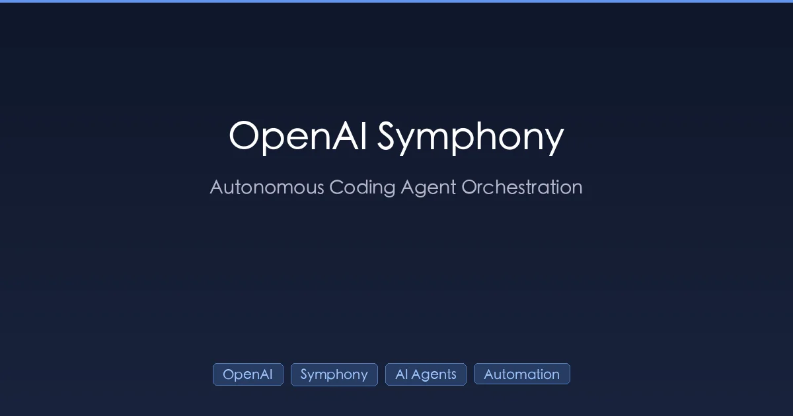

+++
date = '2026-03-06T22:00:00+08:00'
draft = false
title = 'OpenAI Symphony 深度解析：自主编码的编排框架'
description = 'OpenAI Symphony 如何将工单自动转化为经过验证的 Pull Request。架构解析、状态机、WORKFLOW.md 配置与搭建指南。'
toc = true
tags = ['OpenAI', 'Symphony', 'AI Agents', 'Autonomous Coding', 'Codex']
categories = ['AI Guides']
keywords = ['OpenAI Symphony', 'Symphony AI 编码', '自主编码代理', 'Symphony 框架', 'harness engineering', 'Codex 编排']
+++



如果你的工单系统能自己修 Bug，会怎样？

OpenAI 刚刚开源了 **Symphony**，一个自动化编排服务。它会持续监控你的项目工单系统（如 Linear），为每个任务自动生成独立的编码代理（如 Codex），然后交付经过验证的 Pull Request——包括 CI 状态、代码审查和演示视频——甚至不需要人类介入。

这不是另一个等你输入提示词的 AI 编码助手。Symphony 代表了软件构建方式的根本性转变：从**开发者驱动的编码**转向**项目驱动的编排**。本文将深入拆解 Symphony 的架构、底层工作原理，并手把手教你如何搭建。

---

## 为什么 Symphony 很重要：范式转变

当前大多数 AI 编码工具都遵循相同的模式：

```
开发者 → 向 AI 提问 → 审查输出 → 修正错误 → 重复
```

你仍然是驾驶员，AI 只是副驾驶——有帮助，但本质上是被动的。由你决定做什么、何时开始、如何迭代。

Symphony 彻底翻转了这个模型：

```
项目任务 → Symphony 运行 → 代理实现 → 生成证据 → 人类审查 → 合并
```

差异是深刻的。Symphony 不再需要开发者手动认领工单并求助 AI，而是：

1. **持续监控**你的工单系统
2. **自动认领**符合条件的任务
3. **为每个任务生成**独立的编码代理
4. **监控**代理进度，支持超时和重试
5. **交付**工作证明（CI 通过、PR 差异、复杂度分析）
6. **释放**失败任务回队列，等待重试或人工处理

可以把它想象成一条**代码生产线**——工单从一端进入，验证过的 Pull Request 从另一端产出。

这个概念就是 OpenAI 内部所说的 **"harness engineering"（约束工程）**——设计基础设施、约束条件和反馈回路，让 AI 代理可靠地产出成果的工程学科。Symphony 是这一理念的参考实现，现已在 [GitHub](https://github.com/openai/symphony) 上以 Apache 2.0 许可证开源。

---

## 架构：8 大核心组件

Symphony 不是一个单体工具，而是一个模块化系统，包含 8 个职责明确的组件。

### 1. Workflow Loader（工作流加载器）

Workflow Loader 读取你的 `WORKFLOW.md` 文件——一个仓库内的配置文件，定义了 Symphony 在你项目中运行的一切。

`WORKFLOW.md` 分为两部分：
- **YAML 前置数据**：跟踪器、轮询、工作区、钩子和代理的配置
- **Liquid 兼容模板正文**：为每个工单渲染的提示词模板

```markdown
---
tracker:
  type: linear
  team_key: ENG
  candidate_label: "symphony"
polling:
  interval_ms: 30000
workspace:
  base_dir: /tmp/symphony-workspaces
agent:
  type: codex
  model: o4-mini
  timeout_ms: 600000
codex:
  approval_mode: auto-edit
---

You are working on issue {{ issue.identifier }}: {{ issue.title }}

{{ issue.description }}

## Requirements
- Write clean, well-tested code
- Follow existing code conventions
- Ensure all CI checks pass
```

关键洞察：**WORKFLOW.md 存储在你的仓库中**，与代码共存。这意味着编排规则受版本控制、可审查、且项目特定。不同的仓库可以有完全不同的 Symphony 配置。

更妙的是，Symphony 支持**动态重载**——更新 `WORKFLOW.md` 后，下一个轮询周期即生效，无需重启服务。

### 2. Config Layer（配置层）

配置层提供带有合理默认值和环境变量解析的类型化 getter。配置优先级：

```
WORKFLOW.md 值 → 环境变量 → 默认值
```

例如，`SYMPHONY_MAX_CONCURRENT_AGENTS=5` 会覆盖默认的 10 个并发代理上限。这使得开发环境和生产环境可以轻松使用不同配置。

### 3. Issue Tracker Client（工单跟踪器客户端）

目前 Symphony 内置了 **Linear** 集成，使用 GraphQL 获取候选工单。客户端功能：

- 查询匹配可配置标签（如 `symphony`）的工单
- 提取工单元数据（标识符、标题、描述、标签、指派人）
- 支持按团队、项目或自定义字段过滤

设计是可插拔的——添加 GitHub Issues、Jira 或其他工单系统的支持只需实现标准接口。社区已经在开发 GitHub Issues 适配器。

### 4. Orchestrator（编排器）

编排器是 Symphony 的大脑。它负责轮询节拍、运行时状态、调度逻辑和重试队列。

每个轮询间隔（默认 30 秒），编排器会：

1. 从工单系统获取候选工单
2. 评估哪些符合条件（未被认领、未受限流）
3. 将符合条件的工单分发给 Agent Runner
4. 监控运行中的代理是否超时或失败
5. 使用指数退避管理重试队列

编排器强制执行并发限制——默认最多同时运行 10 个代理，并跟踪每个状态的限制以防止资源耗尽。

### 5. Workspace Manager（工作区管理器）

每个工单都有自己的**隔离工作区**——包含独立 git 克隆、依赖和环境的专用目录。工作区管理器负责：

- **创建**：克隆仓库、切换分支、安装依赖
- **生命周期钩子**：`after_create`、`before_run`、`after_run`、`before_remove`
- **清理**：完成或失败后移除工作区
- **安全**：路径清理、前缀验证和代理工作目录限制

钩子功能特别强大。例如，可以用 `after_create` 安装项目专用工具，或用 `after_run` 上传测试覆盖率报告。

```yaml
workspace:
  base_dir: /tmp/symphony-workspaces
  hooks:
    after_create: "npm install && npm run build"
    before_run: "git checkout -b symphony/{{ issue.identifier }}"
    after_run: "npm test && npm run lint"
```

### 6. Agent Runner（代理运行器）

Agent Runner 是真正执行编码的地方。对于每个被分发的工单，它会：

1. 创建隔离工作区
2. 用工单上下文渲染提示词模板
3. 通过 **App-Server Protocol** 启动 Codex 子进程
4. 监控子进程直到完成或超时

App-Server Protocol 是一种**基于 stdout 的行分隔 JSON 协议**，握手过程简洁：

```
→ initialize（客户端发送配置）
← initialized（服务端确认）
← thread/start（代理开始工作）
← turn/start（新推理轮次）
← turn/completed | turn/failed（轮次结果）
```

这个协议有意设计得很简单——它可以被任何代理运行时实现，不限于 Codex。理论上可以接入 Claude Code、Cursor 或任何支持此协议的代理。

### 7. Status Surface（状态面板）

Symphony 包含一个可选的**人类可读仪表板**，使用 Phoenix LiveView 构建。面板展示：

- 活跃运行及其当前状态
- 历史运行结果（成功/失败/超时）
- 代理日志和输出
- 系统指标（队列深度、并发使用量）

面板在 `/api/v1/*` 暴露 HTTP API，支持编程访问——方便集成到现有监控体系或构建自定义告警。

### 8. Logging（日志系统）

结构化日志流向可配置的接收端（stdout、文件或外部服务）。每条日志包含：

- 时间戳
- 运行 ID 和工单标识符
- 组件名称
- 严重级别
- 结构化元数据（代理模型、工作区路径、耗时）

这使得将 Symphony 日志接入现有可观测性体系（Datadog、Grafana、ELK 等）变得简单直接。

---

## 状态机：任务在 Symphony 中的流转

每个工单在 Symphony 中遵循 5 状态生命周期：

```
┌───────────┐     ┌─────────┐     ┌─────────┐
│ Unclaimed │────→│ Claimed │────→│ Running │
└───────────┘     └─────────┘     └─────────┘
                                    │     │
                              ┌─────┘     └─────┐
                              ▼                   ▼
                    ┌──────────────┐      终态：
                    │ RetryQueued  │      - Succeeded
                    └──────────────┘      - Failed
                           │              - TimedOut
                           │              - Stalled
                           └──→ Released   - CanceledByReconciliation
```

### 状态转换

| 起始状态 | 目标状态 | 触发条件 |
|------|----|---------|
| **Unclaimed** | Claimed | 编排器拾取工单 |
| **Claimed** | Running | 工作区就绪，代理启动 |
| **Running** | Succeeded | 代理成功完成，CI 通过 |
| **Running** | Failed | 代理报错或 CI 失败 |
| **Running** | TimedOut | 代理超过 `timeout_ms` |
| **Running** | Stalled | 在可配置时间内未检测到进展 |
| **Running** | CanceledByReconciliation | 工单在跟踪器中被修改/删除 |
| **Failed/TimedOut** | RetryQueued | 重试策略允许再次尝试 |
| **RetryQueued** | Claimed | 退避时间结束 |
| **RetryQueued** | Released | 超过最大重试次数 |

### 运行阶段

在 "Running" 状态内，每个代理经历 5 个阶段：

1. **工作区准备** — 克隆仓库、安装依赖、执行 `after_create` 钩子
2. **提示词渲染** — 用工单上下文填充 Liquid 模板
3. **代理启动** — 通过 App-Server Protocol 启动 Codex 子进程
4. **监控** — 跟踪进度、强制超时、处理信号
5. **终态** — 评估结果、触发 `after_run` 钩子、清理资源

### 重试逻辑

当代理失败时，Symphony 不会直接放弃，而是使用**指数退避**：

```
delay = min(10000 × 2^(attempt-1), max_backoff_ms)
```

默认 `max_backoff_ms` 为 300,000（5 分钟），重试时间表如下：

| 尝试次数 | 延迟 |
|---------|-------|
| 1 | 10 秒 |
| 2 | 20 秒 |
| 3 | 40 秒 |
| 4 | 80 秒 |
| 5 | 160 秒 |
| 6+ | 300 秒（上限） |

用尽所有重试后，工单会被**释放**回跟踪器等待人工处理。

---

## WORKFLOW.md：唯一的配置来源

`WORKFLOW.md` 是 Symphony 的杀手级功能。它不再将配置分散在环境变量、YAML 文件和面板设置中，而是将一切集中在一个地方。

完整示例：

```yaml
---
# 工单跟踪器配置
tracker:
  type: linear
  team_key: ENG
  candidate_label: "symphony-ready"
  api_key_env: LINEAR_API_KEY

# 轮询设置
polling:
  interval_ms: 30000
  max_concurrent_agents: 10

# 工作区设置
workspace:
  base_dir: /tmp/symphony
  hooks:
    after_create: |
      npm install
      npm run build
    before_run: |
      git checkout -b symphony/{{ issue.identifier }}
    after_run: |
      npm test
      npm run lint
      gh pr create --title "{{ issue.identifier }}: {{ issue.title }}" --body "Automated by Symphony"

# 代理设置
agent:
  type: codex
  model: o4-mini
  timeout_ms: 600000
  max_retries: 3

# Codex 专用设置
codex:
  approval_mode: auto-edit
  sandbox: network-none
---

You are an expert software engineer working on issue {{ issue.identifier }}.

## Task
{{ issue.title }}

## Description
{{ issue.description }}

## Guidelines
- Follow existing code patterns and conventions
- Write comprehensive tests for all new functionality
- Ensure all existing tests still pass
- Keep changes minimal and focused on the issue
- Add comments for complex logic

## Context
This is a {{ issue.labels | join: ", " }} issue in the {{ issue.team }} team.
```

要点：

- **Liquid 模板**：提示词正文支持完整的 Liquid 语法——变量、过滤器、条件、循环
- **钩子脚本**：在每个生命周期阶段执行多行 shell 脚本
- **环境变量引用**：API 密钥等敏感信息可引用环境变量
- **代理无关**：虽然 Codex 是默认选项，但 `agent.type` 字段天然支持扩展

---

## Harness Engineering：Symphony 背后的哲学

Symphony 不仅是一个工具——它体现了 OpenAI 提出的一种新工程学科：**"harness engineering"（约束工程）**。

传统软件工程关注编写代码。提示词工程关注为 AI 编写指令。而约束工程关注的是另一件事：**设计基础设施、约束条件和反馈回路，使 AI 代理可靠地产出成果。**

Symphony 展示的约束工程三大支柱：

### 1. 上下文工程

Symphony 不是把整个代码库一股脑塞进 AI 的上下文窗口，而是精心为每个任务构建恰当的上下文：

- 来自工单系统的标题和描述
- 带有项目特定指南的渲染后提示词模板
- 仅包含相关仓库的隔离工作区
- 通过生命周期钩子设置精确的运行环境

### 2. 架构约束

Symphony 限制代理可做的事情，防止混乱：

- **隔离工作区**：每个代理在自己的目录中运行——无交叉污染
- **沙盒执行**：Codex 默认使用 `network-none`——代理无法访问互联网
- **路径清理**：代理被限制在其工作区目录内
- **并发限制**：最多同时运行 N 个代理
- **超时控制**：硬性时间限制防止失控进程

### 3. 熵管理

任何自治系统都会出问题。Symphony 通过以下方式管理熵：

- **重试队列**：失败任务通过指数退避获得再次尝试的机会
- **状态协调**：如果工单在跟踪器中发生变化，对应的运行会被取消
- **工作证明**：代理必须通过 CI 来证明成功，而不仅仅是声称成功
- **优雅降级**：超过最大重试次数后，任务释放回队列等待人工处理

这种 **"约束代理，而非约束野心"** 的哲学，正是 Symphony 区别于简单地让 AI 面对代码库碰运气的关键所在。

---

## 参考实现：为什么选择 Elixir/OTP？

Symphony 的参考实现基于 **Elixir** 和 **OTP**（Open Telecom Platform）框架。这个选择看似非主流，但实际上完美契合问题域：

| 需求 | OTP 特性 |
|-------------|-------------|
| 并发代理管理 | 轻量级进程（单节点可承载百万级） |
| 容错能力 | Supervisor 树自动重启崩溃的进程 |
| 状态管理 | GenServer 提供可预测的状态机 |
| 热代码重载 | 内置热替换支持 `WORKFLOW.md` 变更 |
| 实时仪表板 | Phoenix LiveView 零 JS 实时更新 |
| 结构化日志 | Elixir Logger 支持元数据传播 |

Elixir 代码库采用 umbrella 项目结构：

```
symphony/
├── elixir/
│   ├── apps/
│   │   ├── symphony_core/      # 业务逻辑、状态机、编排器
│   │   ├── symphony_linear/    # Linear 工单系统集成
│   │   ├── symphony_codex/     # Codex 代理运行器
│   │   └── symphony_web/       # Phoenix LiveView 仪表板
│   ├── config/                 # 环境特定配置
│   └── mix.exs                 # Umbrella 项目定义
├── SPEC.md                     # 详细规范
├── WORKFLOW.md                 # 工作流配置示例
└── LICENSE                     # Apache 2.0
```

你不一定要用 Elixir 实现。SPEC.md（3,500+ 字）提供了足够的细节让你用任何语言实现 Symphony。状态机、协议和配置格式都是语言无关的。

---

## 如何开始

### 前置条件

- Elixir 1.15+ 和 Erlang/OTP 26+
- 一个具有 API 访问权限的 Linear 账户
- OpenAI API 密钥（用于 Codex）
- 一个包含你项目的 git 仓库

### 快速搭建

```bash
# 克隆 Symphony
git clone https://github.com/openai/symphony.git
cd symphony/elixir

# 安装依赖
mix deps.get

# 设置环境变量
export LINEAR_API_KEY="lin_api_xxxxx"
export OPENAI_API_KEY="sk-xxxxx"

# 在你的项目仓库中创建 WORKFLOW.md
# （参见上面的示例）

# 启动 Symphony
mix phx.server
```

### 创建你的第一个 WORKFLOW.md

1. **从简单开始**：使用默认设置的最小配置
2. **标记你的工单**：给想要自动化的工单添加 `symphony` 标签
3. **观察仪表板**：打开 `http://localhost:4000` 查看 Symphony 运行情况
4. **迭代优化**：根据代理运行结果优化你的提示词模板

### 成功秘诀

- **从小而明确的工单开始**："修复 README 中的拼写错误" 比 "重构认证系统" 好得多
- **写详细的工单描述**：工单中的上下文越丰富，代理表现越好
- **善用生命周期钩子**：`after_run` 钩子中的 CI/Lint 检查能在你看到结果前就拦截很多问题
- **监控并调优**：观察仪表板，根据项目需要调整超时和重试限制
- **持续更新 WORKFLOW.md**：随着经验积累，不断优化你的提示词模板

---

## Symphony 与其他 AI 编码工具对比

Symphony 与主流方案相比如何？

| 特性 | Symphony | GitHub Copilot Coding Agent | Devin | Claude Code Agent Teams |
|---------|----------|---------------------------|-------|------------------------|
| **定位** | 项目级编排 | 工单 → PR 自动化 | 全自主代理 | 会话级多代理 |
| **开源** | 是（Apache 2.0） | 否 | 否 | 否（CLI 开源） |
| **自托管** | 是 | 否（GitHub 托管） | 否（云端） | 本地执行 |
| **工单系统** | Linear（可扩展） | 仅 GitHub Issues | 自定义 | 无 |
| **代理运行时** | Codex（可扩展） | Copilot | 专有 | Claude |
| **可定制性** | 高（WORKFLOW.md） | 有限 | 有限 | CLAUDE.md + skills |
| **并发能力** | 最多 N 个并行代理 | 每仓库 1 个 | 1 个会话 | 可配置子代理 |
| **重试逻辑** | 内置指数退避 | 基础 | 未知 | 手动 |
| **仪表板** | Phoenix LiveView | GitHub UI | Web UI | 终端输出 |

### 核心差异

**vs. GitHub Copilot Coding Agent**：两者都将工单转化为 PR，但 Symphony 是开源、自托管的，且支持任意工单系统。Copilot 的代理被锁定在 GitHub 生态系统中。

**vs. Devin**：Devin 是闭源商业产品。Symphony 是一个可定制、可扩展、可自托管的开放框架。Devin 更"开箱即用"但灵活性更低。

**vs. Claude Code Agent Teams**：[Claude Code 的多代理系统](/posts/ai/2026-02-28-claude-code-teams-guide/)在会话级别运行——你需要手动为特定任务启动代理团队。Symphony 在项目级别运行——持续监控和处理工单，无需人工启动。

**vs. CrewAI / LangGraph**：这些是通用代理框架。Symphony 专为代码任务编排而生，具备工作区隔离、工单系统集成和 CI 验证等专用功能。

---

## 局限性与注意事项

Symphony 很强大，但不是万能的。以下是当前的局限：

### 技术局限

- **仅支持 Linear**：工单系统集成目前仅支持 Linear。GitHub Issues 和 Jira 适配器正在开发中
- **仅支持 Codex**：代理运行时目前仅支持 OpenAI Codex。接入其他代理需要实现 App-Server Protocol
- **Elixir 依赖**：参考实现需要 Elixir/OTP，这可能不在你团队的技术栈中
- **早期阶段**：作为刚开源的项目，预期会有粗糙之处和破坏性变更

### 实际考量

- **工单质量至关重要**：Symphony 的表现取决于你的工单描述质量。模糊的工单产生模糊的代码
- **不适合复杂重构**：Symphony 擅长范围明确、定义清晰的任务。多文件架构变更仍需人类指导
- **成本意识**：每次代理运行都消耗 API Token。规模化后费用会累积
- **安全考虑**：运行自主修改代码库的代理需要仔细考虑安全性。使用沙盒、限制网络访问，并在合并前审查所有 PR

---

## 自主编码的未来

Symphony 代表了 AI 辅助开发演进中的一个重要里程碑。我们正在经历：

1. **代码补全**（2021-2023）：AI 建议下一行 → GitHub Copilot
2. **代码对话**（2023-2025）：AI 讨论和修改代码 → [Claude Code](/posts/ai/2026-02-28-claude-code-complete-guide/)、Cursor
3. **代码编排**（2025+）：AI 自主处理项目工作 → Symphony

Symphony 体现的"约束工程"范式——为 AI 代理设计约束和反馈回路——很可能成为一个独立的工程学科。正如 DevOps 连接了开发和运维，约束工程连接了人类项目管理和 AI 执行。

目前 Symphony 最适合：
- 有明确复现步骤的 **Bug 修复**
- 有详细规格说明的 **功能添加**
- 为现有代码 **编写测试**
- **文档更新** 和维护任务
- **依赖更新** 和例行维护

随着代理能力的提升，可自动化任务的范围将迅速扩大。

---

## 常见问题

**Symphony 免费吗？**
是的，Symphony 本身在 Apache 2.0 许可证下免费开源。但你需要 OpenAI（Codex）和 Linear 的 API 密钥，这些有各自的定价。

**能用 GitHub Issues 代替 Linear 吗？**
目前开箱即用不支持，但架构是可插拔的。社区正在开发 GitHub Issues 适配器。

**Symphony 支持 Codex 以外的模型吗？**
代理运行时天然可扩展。任何实现了 App-Server Protocol（基于 stdout 的行分隔 JSON）的代理都可以接入。社区正在开发对其他模型的支持。

**如何防止 Symphony 做出危险的修改？**
使用沙盒执行（`network-none`）、限制代理工作区路径、要求 CI 通过后才能合并，并且始终在合并前手动审查 PR。

**代理失败时会怎样？**
失败的任务进入指数退避的重试队列。超过最大重试次数后，任务释放回工单系统等待人工处理。

---

## 延伸阅读

- [Claude Code Agent Teams: How to Run Multiple AI Agents in Parallel](/posts/ai/2026-02-28-claude-code-teams-guide/) — 对比 Symphony 的项目级编排与 Claude Code 的会话级多代理方案
- [Claude Code Complete Guide](/posts/ai/2026-02-28-claude-code-complete-guide/) — 如果你更倾向于手动操作而非全自动化
- [Claude Code vs GitHub Copilot 2026](/posts/ai/2026-03-05-claude-code-vs-copilot/) — Copilot 的编码代理与 Symphony 的对比
- [Building MCP Servers with Python](/posts/ai/2026-03-05-build-mcp-server-python/) — 了解驱动 AI 工具集成的协议层
- [Best MCP Servers for Claude Code 2026](/posts/ai/2026-03-05-best-mcp-servers-claude-code/) — 探索自主代理依赖的工具生态
- [OpenClaw vs Other AI Agents 2026](/posts/ai/2026-03-05-openclaw-vs-ai-agents/) — Symphony 在更广泛的 AI 代理版图中的位置

---

*Symphony 现已在 [GitHub](https://github.com/openai/symphony) 上以 Apache 2.0 许可证开源。Star 这个仓库，在小项目上试试它，加入关于自主编码未来的讨论吧。*
