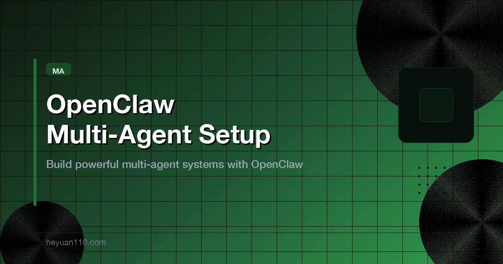

+++
date = '2026-03-04T19:00:00+08:00'
draft = false
title = 'OpenClaw 多 Agent 搭建指南：让 AI 团队协作起来'
description = 'OpenClaw 多 Agent 搭建完整教程。涵盖 Agent 团队配置、消息路由绑定、Tavily 搜索集成、Agent 间通信，以及 4 种协作模式的实战讲解。'
toc = true
tags = ['OpenClaw', 'Multi-Agent', 'AI Agents', 'Tavily', 'Agent Architecture']
categories = ['AI Guides']
keywords = ['OpenClaw 多 Agent', 'OpenClaw 多智能体搭建', 'OpenClaw Agent 配置', 'OpenClaw Tavily', 'OpenClaw 多 Agent 架构', 'proactive-agent', 'proactive-agent-1-2-4', 'OpenClaw Agent 团队', 'sessions_send', 'OpenClaw bindings']

[[params.faqItems]]
question = "OpenClaw 怎么设置多个 Agent？"
answer = "使用 'openclaw agents add <名称>' 为每个 Agent 创建独立的模型、工作区和身份。每个 Agent 在 ~/.openclaw/agents/<agentId>/ 下拥有独立的记忆、会话和配置。然后在 openclaw.json 中配置 bindings，将特定频道或群组的消息路由到对应的 Agent。"

[[params.faqItems]]
question = "OpenClaw 多 Agent 协作最佳模式是什么？"
answer = "建议从 Supervisor 模式起步：一个主 Agent 接收所有请求，分派给专业 Agent（写作、编码、研究），最后汇总结果。这能覆盖 80% 的场景。只有当你需要顺序处理链或同时执行独立任务时，才升级到 Pipeline 或 Parallel 模式。"

[[params.faqItems]]
question = "OpenClaw 的 Agent 之间怎么通信？"
answer = "Agent 之间通过内置的 sessions_send 工具通信，类似一个内部消息总线。你需要在 openclaw.json 的 tools.agentToAgent 中显式开启，并设置允许通信的 Agent 白名单。出于安全考虑，Agent 间通信默认是关闭的。"

[[params.faqItems]]
question = "proactive-agent-1-2-4 怎么找不到了？"
answer = "proactive-agent-1-2-4 已更名为 proactive-agent，可通过 'clawdhub install proactive-agent'（当前版本 v3.1.0）安装。旧名称会返回 'Skill not found' 错误。另外注意 CLI 命令是 'clawdhub'（带 d），不是 'clawhub'。"

[[params.faqItems]]
question = "不同的 OpenClaw Agent 能用不同的 AI 模型吗？"
answer = "可以。每个 Agent 都能配置不同的模型。比如用 Claude 做编码、DeepSeek 做写作、GPT-4o 做联网研究、GLM 做中文创意头脑风暴。在各 Agent 的 auth-profiles.json 和 models.json 中分别配置即可。"
+++



你搭了一个 OpenClaw 私人助手，它帮你处理 Telegram 消息、搜索网页、写草稿、审代码，一切都很顺。

直到问题来了——你让它调研一个竞品，它却把昨天写代码时的上下文混了进来。你让它写篇文章，它又从一个完全不相干的项目里拉出调试记录。单个 Agent 被不断膨胀的记忆淹没了，响应越来越慢，结果越来越离谱。

**解决办法不是写更好的提示词，而是组建团队。**

这篇指南将带你完成 OpenClaw 多 Agent 团队的搭建。你会了解架构设计、配置方法、通信机制，以及让多 Agent 系统真正跑起来的协作模式——不是纸上谈兵，而是可以直接落地的实操。

如果你还没用过 OpenClaw，建议先看[入门教程](/posts/ai/2026-02-12-openclaw-usage-tutorial/)。如果你已经在跑单个 Agent，这篇正好是下一步。

## 为什么单个 Agent 不够用

### 你一定会撞上的三面墙

大多数人一开始都只用一个 Agent 干所有事。第一周没问题，之后三个问题就冒出来了：

| 问题 | 表现 | 根本原因 |
|------|------|----------|
| **记忆膨胀** | 响应越来越慢 | 记忆文件（USER.md、memory/）无限增长，每次对话都加载全部历史 |
| **上下文污染** | 回答跨领域"串味" | 写作建议混进代码审查，调研数据污染创意输出 |
| **成本爆炸** | Token 用量远超预期 | 每次 API 调用都带着大量无关的背景上下文，输入 Token 虚高 |

这就像浏览器开了 50 个标签页——每多一个都拖慢机器，还老是点错。解决方案不是换更快的电脑，而是关掉不需要的标签。

### 多 Agent 的核心理念

道理很简单：**专人做专事**。

- **写作 Agent**：只关注写作技巧、风格规范、内容模板
- **编码 Agent**：只关注项目代码、技术文档、调试流程
- **研究 Agent**：只关注搜索工具、数据来源、信息整合

每个 Agent 有自己的大脑（记忆）、自己的办公室（工作区）、自己的日志（会话历史），互不干扰。

> 一个人可以顶一支队伍——前提是你把角色分好。

## OpenClaw 多 Agent 架构总览

### 三层隔离

在 OpenClaw 里，每个 Agent 不只是一个名字，而是一个**物理隔离的独立虚拟工作者**，隔离分三层：

```
~/.openclaw/agents/<agentId>/
├── agent/                    # 身份层
│   ├── auth-profiles.json    # API 密钥配置
│   └── models.json           # 模型选择
└── sessions/                 # 状态层
    ├── <session-id>.jsonl    # 独立聊天记录
    └── sessions.json         # 会话索引

~/.openclaw/workspace-<agentId>/
├── SOUL.md                   # 人格定义
├── AGENTS.md                 # 行为规则
├── USER.md                   # 用户画像
├── PROMPT.md                 # 提示词模板
├── IDENTITY.md               # 身份定义
└── memory/                   # 记忆存储
```

| 层级 | 目录 | 用途 | 类比 |
|------|------|------|------|
| **身份层** | `agents/<id>/agent/` | 用哪个模型、哪把 API Key | 工牌 |
| **状态层** | `agents/<id>/sessions/` | 独立的聊天记录和路由状态 | 工作日志 |
| **工作区** | `workspace-<id>/` | 独立的文件、提示词、记忆 | 独立办公室 |

这种隔离是物理级别的，不是逻辑上的。你的写作 Agent 真的看不到编码 Agent 的文件，编码 Agent 也不会碰到写作 Agent 的风格规范。不需要靠提示词工程来维持隔离——文件系统天然保证了这一点。

### 绑定系统：消息路由

消息进来了，OpenClaw 怎么知道该交给哪个 Agent？靠的是 **Bindings**——一套确定性路由系统，有明确的优先级链：

```
优先级 1: 精确 peer 匹配（私聊/群组 ID）
优先级 2: 父级 peer 匹配（话题继承）
优先级 3: guildId + 角色（Discord 专用）
优先级 4: guildId 匹配
优先级 5: teamId（Slack 专用）
优先级 6: accountId 匹配
优先级 7: 频道级别匹配
优先级 8: 默认 Agent 兜底
```

规则很直接：**越具体的规则优先级越高**。如果你把一个 Telegram 群绑定到特定 Agent，该群的消息就一定交给那个 Agent，没有歧义。

同一条绑定规则中的多个条件是 AND 逻辑——全部满足才匹配。如果同一优先级有多条规则都匹配，配置文件中排在前面的生效。

## 手把手搭建你的第一个多 Agent 团队

### 第 1 步：创建 Agent

用 CLI 创建隔离的 Agent：

```bash
# 创建写作 Agent，使用 DeepSeek（性价比高）
openclaw agents add writer \
  --model deepseek/deepseek-chat \
  --workspace ~/.openclaw/workspace-writer

# 创建研究 Agent，使用 GPT-4o（擅长联网搜索和信息综合）
openclaw agents add researcher \
  --model openai/gpt-4o \
  --workspace ~/.openclaw/workspace-researcher

# 创建编码 Agent，使用 Claude（代码理解最强）
openclaw agents add coder \
  --model anthropic/claude-sonnet-4-6 \
  --workspace ~/.openclaw/workspace-coder
```

一个关键的设计优势：**每个 Agent 可以用不同的模型**。按任务匹配最合适的模型：

| Agent | 推荐模型 | 原因 |
|-------|----------|------|
| 研究 | gpt-4o | 多模态理解强，擅长信息综合 |
| 写作 | deepseek-chat | 性价比高，逻辑输出稳定 |
| 编码 | claude-sonnet | 代码生成和理解一流 |
| 头脑风暴 | glm-4.7 | 创意能力强，中文尤其出色 |

### 第 2 步：定义每个 Agent 的灵魂

创建 Agent 给了它躯体，灵魂来自工作区文件。

**SOUL.md**——人格与专长：

```markdown
# Writer Agent

## 角色
你是一名资深技术内容写手。你的专长是把复杂的技术话题
变成清晰、有吸引力的文章。

## 风格
- 每篇文章用一个贴近生活的场景或反直觉的观点开头
- 段落要短——适合手机阅读
- 用类比解释复杂概念
- 结尾有明确的行动号召

## 边界
- 不用"不言而喻""众所周知"之类的废话
- 每个技术术语首次出现时解释清楚
- 守好自己的领地——不写代码，不做调研
```

**AGENTS.md**——行为规则：

```markdown
# 工作标准

## 输出格式
- 所有文章用 Markdown
- 标题层级：H2 > H3 > H4，最多三级
- 代码块必须标明语言

## 工作流程
1. 先写大纲，获得确认后再写正文
2. 每段不超过 150 字
3. 提交前自查 SEO 要素
```

**USER.md**——用户画像：

```markdown
# 用户画像

## 身份
专注 AI 工具和开发者效率的技术博主。

## 偏好
- 语气：专业但不死板
- 受众：对 AI 感兴趣的开发者和产品经理
- 发布平台：个人博客 + 社交媒体
```

这些文件定义得越精确，Agent 的输出就越稳定。把它想成写 JD——岗位描述越模糊，交上来的活儿就越随意。

### 第 3 步：设置身份标签

给每个 Agent 在消息平台上设一个容易辨认的身份：

```bash
openclaw agents set-identity --agent writer --name "Writer" --emoji "pen"
openclaw agents set-identity --agent researcher --name "Researcher" --emoji "mag"
openclaw agents set-identity --agent coder --name "Coder" --emoji "zap"
```

### 第 4 步：绑定 Agent 到消息频道

将 Agent 连接到特定的群组或聊天。OpenClaw 支持 Telegram、飞书/Lark、Discord、WhatsApp 等平台。

#### Telegram 绑定

为每个 Agent 创建一个 Telegram 群，获取 Chat ID。把机器人拉进群，然后访问 `https://api.telegram.org/bot<YOUR_TOKEN>/getUpdates`，找到 `chat.id` 字段（群组 ID 是负数）。

在 `openclaw.json` 中配置绑定：

```json
{
  "bindings": [
    {
      "agentId": "writer",
      "match": {
        "channel": "telegram",
        "peer": {
          "kind": "group",
          "id": "-1001234567890"
        }
      }
    },
    {
      "agentId": "researcher",
      "match": {
        "channel": "telegram",
        "peer": {
          "kind": "group",
          "id": "-1009876543210"
        }
      }
    },
    {
      "agentId": "coder",
      "match": {
        "channel": "telegram",
        "peer": {
          "kind": "group",
          "id": "-1005551234567"
        }
      }
    }
  ]
}
```

启用 Telegram 频道：

```json
{
  "channels": {
    "telegram": {
      "enabled": true,
      "botToken": "123456:ABC-DEF1234ghIkl-zyx57W2v1u123ew11"
    }
  }
}
```

#### 飞书/Lark 绑定

飞书的配置方式基本一样，区别在于 channel 是 `feishu`，peer ID 使用飞书的 `oc_` 格式：

```json
{
  "bindings": [
    {
      "agentId": "writer",
      "match": {
        "channel": "feishu",
        "peer": {
          "kind": "group",
          "id": "oc_abc123def456"
        }
      }
    }
  ],
  "channels": {
    "feishu": {
      "enabled": true,
      "appId": "cli_a9f21xxxxx89bcd",
      "appSecret": "w6cPunaxxxxBl1HHtdF",
      "groups": {
        "oc_abc123def456": { "requireMention": false }
      }
    }
  }
}
```

设置 `requireMention: false` 相当于把群变成专属办公室——Agent 会回复群里的每条消息，不需要 @。记得在飞书开发者后台启用 `im:message.group_msg` 权限。

| 特性 | Telegram | 飞书/Lark |
|------|----------|-----------|
| **Peer ID 格式** | 负数 | `oc_` 字符串 |
| **创建机器人** | @BotFather | 飞书开放平台 |
| **免 @ 模式** | 设为群管理员 | `requireMention: false` + 权限 |
| **适合场景** | 个人使用，全球可用 | 企业团队，内部工作流 |

你完全可以**同时绑定两个平台**——飞书处理工作任务，Telegram 处理个人事务。跨平台运作正是多 Agent 架构的闪光点。

## Agent 间通信模式

把 Agent 隔离开只是第一步，让它们协作才是真正出价值的地方。

### sessions_send 机制

Agent 之间通过 OpenClaw 内置的 `sessions_send` 工具通信——一个 Agent 间的内部消息总线：

```
用户发送请求 → 主 Agent 接收
                  ↓
            分析任务类型
            ↙     ↓      ↘
     researcher  writer   coder
            ↘     ↓      ↙
            汇总结果
                  ↓
            主 Agent 回复用户
```

### 开启 Agent 间通信

Agent 间通信**默认关闭**——这是安全优先的设计。需要显式开启：

```json
{
  "tools": {
    "agentToAgent": {
      "enabled": true,
      "allow": ["main", "researcher", "writer", "coder"]
    }
  }
}
```

要点：

- **白名单机制**：只有在 `allow` 数组中的 Agent 才能相互通信
- **最小权限原则**：不是每个 Agent 都需要和其他所有 Agent 通话。写作 Agent 可能永远不需要直接联系编码 Agent
- **审计追踪**：所有跨 Agent 消息都记录在会话文件中，方便调试

### 设计 Supervisor Agent

最有效的模式是设一个 **Supervisor Agent**（通常叫 `main`），它的职责不是干活，而是接收请求并分发：

```markdown
# Main Agent - SOUL.md

## 角色
你是团队协调人。你的职责：

1. **接收**：理解用户的请求
2. **路由**：识别任务类型，分配给合适的专家
3. **审核**：检查专家的输出质量
4. **汇报**：汇总结果，回复用户

## 路由规则
- 调研、事实核查、数据收集 → @researcher
- 写文章、内容编辑 → @writer
- 写代码、调试、技术实现 → @coder
- 简单问题、日常闲聊 → 自己处理

## 通信格式
分派任务时，始终包含：
- 清晰的任务描述
- 期望的输出格式
- 用户请求中的相关上下文
```

这个设计不仅做到了分工，还实现了**监督和容错**。当专家 Agent 卡住或输出质量不行时，Supervisor 可以介入、要求修改，或者自己接手。

## 为 Agent 配置 Tavily 搜索集成

研究 Agent 需要能上网的"眼睛"。[Tavily](https://tavily.com/) 是 OpenClaw 生态中最流行的搜索集成，专为 AI Agent 设计。

### 安装 Tavily

```bash
# 通过 ClawHub 安装（注意：命令是 clawdhub，带 d）
clawdhub install tavily-search
```

在 [tavily.com](https://tavily.com/) 获取 API Key，添加到环境变量：

```bash
# 添加到 shell 配置文件或 .env
export TAVILY_API_KEY="tvly-xxxxxxxxxxxxxxxx"
```

### 按 Agent 配置搜索权限

不是每个 Agent 都需要搜索。按需分配 Tavily：

```json
{
  "agents": {
    "list": [
      {
        "id": "researcher",
        "tools": {
          "allow": ["tavily-search", "browser", "read"],
          "deny": ["exec", "write"]
        }
      },
      {
        "id": "writer",
        "tools": {
          "allow": ["read"],
          "deny": ["tavily-search", "exec"]
        }
      },
      {
        "id": "coder",
        "tools": {
          "allow": ["exec", "read", "write"],
          "deny": ["tavily-search", "browser"]
        }
      }
    ]
  }
}
```

研究 Agent 能搜索和浏览网页，写作 Agent 只有只读权限，编码 Agent 能执行代码但没有联网权限。每个 Agent 刚好拥有它需要的工具——不多不少。

### 搭配 proactive-agent 使用

[proactive-agent](https://clawhub.ai/halthelobster/proactive-agent) 技能（前身是 **proactive-agent-1-2-4**）赋予 Agent 主动性——它们能汇报进度、提出澄清问题、在多步骤任务中自主推进，不需要你每步都盯着。

```bash
# 安装 proactive-agent（已从 proactive-agent-1-2-4 更名）
clawdhub install proactive-agent
```

> **重要提醒**：很多教程还在引用 `proactive-agent-1-2-4`，但作者已将其更名为 `proactive-agent`（当前版本 v3.1.0）。另外 CLI 命令是 `clawdhub`（带 d），不是 `clawhub`。详细说明见 [OpenClaw 自动化踩坑指南](/posts/ai/2026-02-14-openclaw-automation-pitfalls/)。

配合 Tavily，你的研究 Agent 就能自主搜索信息、整合发现，并主动向 Supervisor 汇报结果——不需要你隔一会儿就去看一眼。

## 四种协作模式

参考 [LangChain](https://blog.langchain.com/choosing-the-right-multi-agent-architecture/) 和 [Google 的设计模式](https://www.infoq.com/news/2026/01/multi-agent-design-patterns/) 的多 Agent 研究成果，OpenClaw 场景下有四种主要协作模式：

### 1. Pipeline 模式（流水线）

```
用户请求
    ↓
┌──────────┐    ┌──────────┐    ┌──────────┐
│ Researcher│ →  │  Writer  │ →  │ Reviewer │
└──────────┘    └──────────┘    └──────────┘
                                      ↓
                                 最终输出
```

**原理**：任务按顺序流转，每个 Agent 的输出作为下一个 Agent 的输入，像工厂流水线。

**OpenClaw 实现**：Supervisor 通过 `sessions_send` 编排链路：

```
第 1 步: @researcher "查找 Claude 4.6 vs GPT-4o 最新基准测试"
第 2 步: @writer "根据这些调研写一篇对比文章: {researcher_output}"
第 3 步: @reviewer "检查这篇草稿的准确性和可读性: {writer_output}"
第 4 步: Supervisor 汇总并交付最终结果
```

**适合场景**：
- 内容生产：调研 → 写作 → 审核
- 代码开发：设计 → 实现 → 测试
- 数据流水线：采集 → 清洗 → 分析

### 2. Parallel 模式（并行）

```
         用户请求
              ↓
       ┌──────────────┐
       │  Task Splitter │
       └──┬────┬────┬──┘
          ↓    ↓    ↓      ← 同时执行
       ┌───┐ ┌───┐ ┌───┐
       │ A │ │ B │ │ C │
       └─┬─┘ └─┬─┘ └─┬─┘
         ↓     ↓     ↓
       ┌──────────────┐
       │  Aggregator   │
       └──────────────┘
```

**原理**：一个任务拆分为互不依赖的子任务，多个 Agent 同时执行，最后汇总结果。

**适合场景**：
- 竞品分析：每个 Agent 调研一个竞争对手
- 多视角审查：安全 Agent、性能 Agent、可维护性 Agent 同时审查同一段代码
- 多语言翻译：同一内容同时翻译成多种语言

### 3. Supervisor 模式（主管）

```
         用户请求
              ↓
      ┌───────────────┐
      │  Supervisor    │
      │  (main agent)  │
      └──┬─────┬───┬──┘
         ↓     ↓   ↓
      ┌───┐ ┌───┐ ┌───┐
      │ A │ │ B │ │ C │
      └───┘ └───┘ └───┘
         ↓     ↓   ↓
      ┌───────────────┐
      │  审核 & 输出    │
      └───────────────┘
```

**原理**：一个中央 Supervisor 接收所有请求，拆分子任务，分配给专家，审核结果，交付汇总输出。

**OpenClaw 实现**——完整配置：

```json
{
  "agents": {
    "list": [
      {
        "id": "main",
        "workspace": "~/.openclaw/workspace-main",
        "model": "anthropic/claude-sonnet-4-6"
      },
      {
        "id": "writer",
        "workspace": "~/.openclaw/workspace-writer",
        "model": "deepseek/deepseek-chat"
      },
      {
        "id": "researcher",
        "workspace": "~/.openclaw/workspace-researcher",
        "model": "openai/gpt-4o"
      },
      {
        "id": "coder",
        "workspace": "~/.openclaw/workspace-coder",
        "model": "anthropic/claude-sonnet-4-6"
      }
    ]
  },
  "tools": {
    "agentToAgent": {
      "enabled": true,
      "allow": ["main", "writer", "researcher", "coder"]
    }
  },
  "bindings": [
    {
      "agentId": "main",
      "match": {
        "channel": "telegram",
        "peer": { "kind": "group", "id": "-1001234567890" }
      }
    }
  ]
}
```

**适合场景**：
- 单入口的个人助手
- 需要跨领域协作的任务
- 需要质量把控和输出审核的场景

### 4. Swarm 模式（蜂群）

```
      ┌───┐  ←→  ┌───┐
      │ A │       │ B │
      └─┬─┘      └─┬─┘
        ↕    ←→    ↕
      ┌───┐  ←→  ┌───┐
      │ C │       │ D │
      └───┘       └───┘
```

**原理**：没有中央协调者。Agent 之间点对点通信，自组织，根据自身判断进行任务交接。灵感来自 [OpenAI 的 Swarm 框架](https://github.com/openai/swarm)。

**OpenClaw 实现**：开启完全的 Agent 间通信，不指定 Supervisor。每个 Agent 的 SOUL.md 中包含路由逻辑，自行判断何时将任务移交给其他 Agent。

**适合场景**：
- 复杂、不可预测的工作流，刚性编排行不通的情况
- 处理多样化、持续变化任务的自治团队
- 在你掌握了前三种模式之后的高级玩法

**提醒**：Swarm 是最难调试的。先从 Supervisor 开始，过渡到 Pipeline 或 Parallel，只有当你有明确需求时才考虑 Swarm。

### 怎么选模式

第一天不需要复杂架构。按这个路径演进：

```
单 Agent + 工具
    ↓ (上下文开始污染)
单 Agent + 技能
    ↓ (记忆膨胀、成本爆炸)
Supervisor + 2-3 个专家 Agent
    ↓ (需要更复杂的协作)
Pipeline / Parallel 混合
    ↓ (需要自主协调)
Swarm（高级）
```

> **核心原则**：加工具优先于加 Agent。只有当你在当前架构上明确撞墙了，才升级到多 Agent。

## 实战案例

### 案例 1：代码审查 + 部署流水线

```
开发者推送代码 → main Agent 收到通知
    ↓
@coder: "审查这个 PR，找 bug、安全问题和风格违规"
    ↓
@researcher: "检查是否有依赖包存在已知漏洞"
    ↓
main Agent 汇总审查结果 → 发送摘要到 Telegram 群
    ↓
如果通过 → 通过 coder Agent 触发部署脚本
```

### 案例 2：调研 + 写作内容流水线

```
用户: "写一篇关于最新 MCP 协议更新的文章"
    ↓
@researcher: 用 Tavily 搜索最新 MCP 新闻，阅读官方文档
    ↓
@writer: "根据这些调研写一篇文章: {research_output}"
    ↓
main Agent 审核草稿 → 需要修改就打回 → 交付最终版本
```

### 案例 3：监控 + 预警系统

```
定时任务每 30 分钟触发:
    ↓
@researcher: "检查 OpenClaw、Claude Code、Cursor 的 GitHub 发布"
    ↓
如果发现新版本 → @writer: "整理变更日志摘要"
    ↓
main Agent 将预警和摘要发送到 Telegram
```

这利用了 OpenClaw 内置的 Heartbeat 和 Cron 功能。底层原理详见我们的[架构深度解析](/posts/ai/2026-02-14-openclaw-architecture-deep-dive/)。

## 性能优化与成本管理

### 按任务选模型

控制成本最大的杠杆就是按任务匹配模型：

| 任务类型 | 推荐模型 | 大致成本 | 理由 |
|----------|----------|----------|------|
| 简单路由/分发 | 任意小模型 | 最低 | Supervisor 只需要分类和转发 |
| 调研 + 综合 | gpt-4o | 中等 | 擅长浏览和信息融合 |
| 长文写作 | deepseek-chat | 低 | 性价比一流 |
| 代码生成 | claude-sonnet | 中高 | 代码理解和生成最强 |
| 复杂推理 | claude-opus | 最高 | 留给真正困难的问题 |

### 减少 Agent 间 Token 浪费

每次 `sessions_send` 调用都是一次 API 请求。尽量减少不必要的通信：

1. **Supervisor 预过滤**：简单问题让 main Agent 自己处理，不要什么都分派
2. **结构化交接**：Agent 之间传 JSON 结构化数据，不要传自由文本。结构化数据更小、歧义更少
3. **上下文裁剪**：流水线中每个 Agent 传给下一个之前先总结输出，不要转发完整对话

```json
{
  "agentToAgent": {
    "maxContextTokens": 4000,
    "summaryMode": "auto"
  }
}
```

### 子 Agent 用轻量模型

你的 Supervisor Agent 需要聪明（Claude Sonnet 或 GPT-4o），但做窄领域、明确定义任务的专家 Agent 通常可以用更便宜的模型：

```json
{
  "agents": {
    "list": [
      { "id": "main", "model": "anthropic/claude-sonnet-4-6" },
      { "id": "formatter", "model": "deepseek/deepseek-chat" },
      { "id": "translator", "model": "deepseek/deepseek-chat" }
    ]
  }
}
```

## 常见坑点与避免方法

### 坑 1：Agent 太多

**问题**：一上来就建 10 个 Agent"以备不时之需"，结果通信开销大、管理复杂、资源闲置。

**经验法则**：
- **个人使用**：3-5 个 Agent（Supervisor + 2-4 个专家）
- **团队使用**：每条业务线 2-3 个 Agent
- **合并信号**：如果两个 Agent 80% 的时间在处理同类任务，就合并它们

### 坑 2：会话隔离失效

**问题**：Agent A 的调研结果出现在 Agent B 的对话里。通常是绑定配置错误或 `dmScope` 没设对。

**解决**：确认每个 Agent 的绑定指向正确的 peer ID。测试方法：在每个群发条消息，看是哪个 Agent 回复的。同时把 `dmScope` 设为 `agent` 来隔离私聊上下文：

```json
{
  "agents": {
    "list": [
      {
        "id": "writer",
        "dmScope": "agent"
      }
    ]
  }
}
```

### 坑 3：循环分派

**问题**：Agent A 分派给 Agent B，Agent B 又分派回 Agent A。无限循环，疯狂烧 Token。

**解决**：在 SOUL.md 中建立清晰的层级关系。只有 Supervisor 才能分派任务，专家 Agent 不应该分派给其他专家——它们应该把结果返回给 Supervisor，由 Supervisor 决定下一步。

### 坑 4：忽略 proactive-agent 技能

**问题**：Agent 在执行长任务时突然静默，你不知道它是在干活、卡住了、还是失败了。

**解决**：安装 [proactive-agent](https://clawhub.ai/halthelobster/proactive-agent)（`clawdhub install proactive-agent`）。这个技能支持进度汇报，Agent 会在多步骤任务中主动发送状态更新。配合 Supervisor 模式，main Agent 可以追踪所有子 Agent 的进度，有问题及时提醒你。

### 坑 5：Agent 间通信没有格式规范

**问题**：Agent A 给 Agent B 发了一大段口语化的回复，Agent B 理解偏了，输出不对。

**解决**：在每个 Agent 的 AGENTS.md 中定义通信模板：

```markdown
## Agent 间通信格式

收到其他 Agent 的任务时，期望以下结构：
- **task**: 做什么（一句话）
- **context**: 相关背景（要点列表）
- **format**: 期望的输出格式
- **deadline**: 优先级（立即/正常/低）

返回结果时，使用：
- **status**: 完成/部分完成/失败
- **result**: 实际输出
- **notes**: 注意事项或后续跟进
```

## 快速上手：你的第一份多 Agent 配置

以下是一份完整的最小配置，用于在 Telegram 上运行一个三 Agent 团队：

```json
{
  "channels": {
    "telegram": {
      "enabled": true,
      "botToken": "YOUR_BOT_TOKEN"
    }
  },
  "agents": {
    "defaultAgent": "main",
    "list": [
      {
        "id": "main",
        "workspace": "~/.openclaw/workspace-main",
        "model": "anthropic/claude-sonnet-4-6"
      },
      {
        "id": "writer",
        "workspace": "~/.openclaw/workspace-writer",
        "model": "deepseek/deepseek-chat",
        "dmScope": "agent"
      },
      {
        "id": "coder",
        "workspace": "~/.openclaw/workspace-coder",
        "model": "anthropic/claude-sonnet-4-6",
        "dmScope": "agent"
      }
    ]
  },
  "tools": {
    "agentToAgent": {
      "enabled": true,
      "allow": ["main", "writer", "coder"]
    }
  },
  "bindings": [
    {
      "agentId": "main",
      "match": {
        "channel": "telegram",
        "peer": { "kind": "group", "id": "YOUR_MAIN_GROUP_ID" }
      }
    },
    {
      "agentId": "writer",
      "match": {
        "channel": "telegram",
        "peer": { "kind": "group", "id": "YOUR_WRITER_GROUP_ID" }
      }
    },
    {
      "agentId": "coder",
      "match": {
        "channel": "telegram",
        "peer": { "kind": "group", "id": "YOUR_CODER_GROUP_ID" }
      }
    }
  ]
}
```

部署步骤：

1. 将 `YOUR_BOT_TOKEN` 替换为你从 @BotFather 获取的 Telegram 机器人 Token
2. 创建三个 Telegram 群并替换对应的群组 ID
3. 创建工作区目录，在每个目录下添加 SOUL.md、AGENTS.md、USER.md
4. 安装关键技能：`clawdhub install tavily-search && clawdhub install proactive-agent`
5. 启动 OpenClaw，在每个群里发消息测试

## 总结

多 Agent 架构和管理真实团队的原则一样：

1. **招对人**——用合适的模型创建合适的 Agent
2. **定好岗**——用 SOUL.md 和 AGENTS.md 明确边界
3. **通好渠**——配置绑定并开启 Agent 间通信
4. **管好队**——设一个 main Agent 做质量把控和协调

从一个 Supervisor 加两个专家 Agent 开始，遇到具体瓶颈再加。目标不是 Agent 越多越好，而是让对的 Agent 做对的事。

如果你发现自己不断对 AI 助手说"忽略那个，专注这个"——是时候拆分成多个 Agent 了。

## 延伸阅读

- [OpenClaw 2026.3.1: WebSocket Streaming, Agent Routing, and K8s Support](/posts/ai/2026-03-03-openclaw-2026-3-1-new-features/) —— 最新功能，包括新的 Agent 路由 CLI
- [OpenClaw Automation Pitfalls: Installing 3 Skills Does Not Mean It Works](/posts/ai/2026-02-14-openclaw-automation-pitfalls/) —— 会话隔离、proactive-agent 配置及真实踩坑案例
- [OpenClaw Architecture Deep Dive](/posts/ai/2026-02-14-openclaw-architecture-deep-dive/) —— 消息从 Gateway 到 Agent 再到执行的完整流转
- [OpenClaw Memory Strategy: Tool-Driven RAG and On-Demand Recall](/posts/ai/2026-01-31-openclaw-memory-strategy/) —— 隔离 Agent 下的记忆工作机制
- [Claude Code Agent Teams: Multi-Agent Collaborative Development](/posts/ai/2026-02-22-claude-code-agent-teams/) —— 编码工作流中的多 Agent 协作方案
- [Agentic Coding Trends in 2026](/posts/ai/2026-02-23-agentic-coding-trends-2026/) —— 多 Agent 开发的未来趋势
