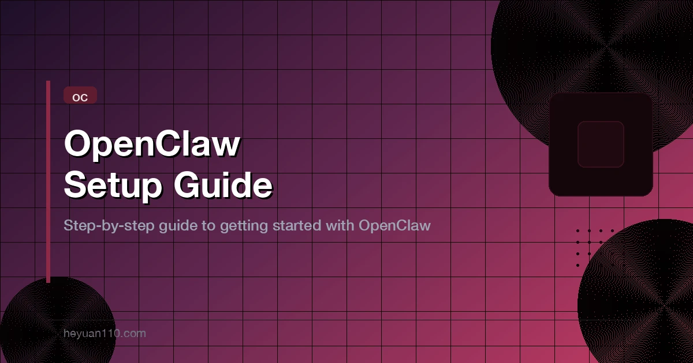

+++
date = '2026-03-05T10:00:00+08:00'
draft = false
title = 'OpenClaw Setup Guide: Install and Configure Your AI Agent'
description = 'Complete OpenClaw setup guide. Step-by-step installation, Telegram/WhatsApp config, AI model setup, Skills, multi-agent basics, and security best practices.'
toc = true
tags = ['OpenClaw', 'AI Agents', 'Self-Hosted AI', 'Telegram Bot', 'Automation']
categories = ['AI Guides']
keywords = ['OpenClaw setup guide', 'OpenClaw install', 'how to use OpenClaw', 'Moltbot setup', 'OpenClaw configuration', 'OpenClaw Telegram', 'OpenClaw WhatsApp', 'personal AI agent setup']

[[params.faqItems]]
question = "What are the system requirements for OpenClaw?"
answer = "OpenClaw requires Node.js 20+, 16GB RAM minimum (32GB recommended for multi-agent setups), and runs on macOS, Linux, or Windows (WSL2). An Apple Mac Mini M4 or similar ARM-based machine is recommended for 24/7 operation due to low power consumption and strong AI inference performance."

[[params.faqItems]]
question = "Is OpenClaw the same as Moltbot and Clawdbot?"
answer = "Yes. OpenClaw, Moltbot, and Clawdbot are all the same project at different stages. It started as Clawdbot, was renamed to Moltbot due to Anthropic trademark concerns, and finally became OpenClaw as the official name. Always use 'OpenClaw' for current documentation and commands."

[[params.faqItems]]
question = "How much does it cost to run OpenClaw?"
answer = "OpenClaw itself is free and open-source. You pay only for the AI model API calls you make. Typical costs range from $5-30/month depending on usage. Using Claude Sonnet or GPT-4.1 for routine tasks keeps costs low. You can also run free local models via Ollama."

[[params.faqItems]]
question = "Can OpenClaw control my browser and automate tasks?"
answer = "Yes. OpenClaw can control browsers via its built-in browser automation skill, execute shell commands, read/write files, send emails, manage calendars, and automate complex multi-step workflows — all triggered through Telegram, WhatsApp, or other messaging platforms."

[[params.faqItems]]
question = "Is it safe to run OpenClaw on my computer?"
answer = "OpenClaw includes multiple security layers: sandbox mode restricts file system access, pairing mode requires device authorization, permission controls limit which tools each agent can use, and all data stays on your local machine. Always enable sandbox mode and use pairing for any internet-facing deployment."
+++



Want a personal AI agent that runs 24/7 on your computer, responds through Telegram or WhatsApp, and actually executes tasks — not just chats? That is exactly what [OpenClaw](https://github.com/openclaw/openclaw) does. It is an open-source AI agent gateway that turns your machine into a command center for AI-powered automation.

This guide walks you through the complete OpenClaw setup process: from installation to connecting messaging platforms, configuring AI models, installing Skills, and locking down security. By the end, you will have a working personal AI agent you can message from anywhere.

## What Is OpenClaw (and Why Three Names?)

OpenClaw is an open-source personal AI agent created by Austrian developer **Peter Steinberger** ([@steipete](https://github.com/steipete)). It gained 80,000+ GitHub stars in its first week and has since grown to 247,000+ stars, making it one of the fastest-growing open-source projects in history.

But if you have been researching it, you have probably seen three names floating around. Here is the short version:

| Name | Period | Why |
|------|--------|-----|
| **Clawdbot** | Early 2026 | Original name when the project went viral |
| **Moltbot** | Jan-Feb 2026 | Renamed due to Anthropic trademark concerns (too close to "Claude") |
| **OpenClaw** | Feb 2026 - present | Final official name, used across all docs and repos |

**They are all the same project.** If you see old tutorials referencing Moltbot or Clawdbot, the concepts still apply — just swap the name. For current docs and CLI commands, always use `openclaw`.

For a deeper dive into the naming history and core architecture, see [MoltBot (OpenClaw) Explained: Architecture and Full History](/posts/ai/2026-02-18-what-is-moltbot/).

### What Makes OpenClaw Different

Unlike ChatGPT or Claude web interfaces that can only generate text, OpenClaw is an **execution engine**. It can:

- Run shell commands on your machine
- Control browsers and interact with web apps
- Read and write files on your local filesystem
- Send messages across platforms (Telegram, WhatsApp, Discord, iMessage)
- Schedule and execute recurring tasks
- Manage emails, calendars, and notifications
- Chain multiple actions into complex workflows

Think of it as the difference between asking a colleague for advice versus having them sit at your desk and do the work.

## System Requirements

Before you start, make sure your machine meets these requirements:

### Hardware

| Component | Minimum | Recommended |
|-----------|---------|-------------|
| **RAM** | 16 GB | 32 GB (for multi-agent) |
| **CPU** | Any modern x86/ARM | Apple Silicon M-series |
| **Storage** | 10 GB free | 50 GB+ (for local models) |
| **Network** | Stable internet | Wired Ethernet preferred |

**The ideal setup is an Apple Mac Mini M4** — low power consumption (keeps your electricity bill negligible), excellent performance for AI workloads, and small enough to tuck behind a monitor. Many OpenClaw power users run it this way as a headless server.

If you plan to run local AI models alongside OpenClaw, bump the RAM to 32 GB or more. If you are only using cloud APIs (Claude, GPT), 16 GB is plenty.

### Software

| Dependency | Version | How to Install |
|------------|---------|---------------|
| **Node.js** | 20+ | `brew install node` or [nodejs.org](https://nodejs.org/) |
| **npm/pnpm** | Latest | Comes with Node.js / `npm i -g pnpm` |
| **Git** | Any | `brew install git` or pre-installed on most systems |
| **OS** | macOS / Linux / WSL2 | Native Windows is not supported — use WSL2 |

Verify your environment:

```bash
# Check Node.js version (must be 20+)
node --version

# Check npm
npm --version

# Check git
git --version
```

## Step-by-Step Installation

### Option 1: Quick Install (Recommended)

The fastest path — one command:

```bash
# macOS / Linux
curl -fsSL https://openclaw.ai/install.sh | bash

# Windows (WSL2 / PowerShell)
iwr -useb https://openclaw.ai/install.ps1 | iex
```

This script installs the OpenClaw CLI globally and sets up the required directory structure at `~/.openclaw/`.

### Option 2: Install via npm

If you prefer managing it through npm:

```bash
# Install globally
npm install -g openclaw@latest

# Or with pnpm
pnpm add -g openclaw@latest
```

### Option 3: Docker

For containerized deployments (great for servers):

```bash
# Pull the official image
docker pull openclaw/openclaw:latest

# Run with persistent storage
docker run -d \
  --name openclaw \
  -p 18789:18789 \
  -v ~/.openclaw:/data/openclaw \
  openclaw/openclaw:latest
```

### Verify Installation

After installing, confirm everything works:

```bash
# Check version
openclaw --version

# View available commands
openclaw help
```

You should see the current version number and a list of commands. If you get a "command not found" error, make sure your npm global bin directory is in your PATH.

## Initial Configuration: The Onboarding Wizard

OpenClaw includes a guided setup wizard that handles the most important configuration steps. This is the single best way to get started:

```bash
openclaw onboard --install-daemon
```

The `--install-daemon` flag also sets up OpenClaw as a background service so it starts automatically on boot (uses `launchd` on macOS, `systemd` on Linux).

The wizard walks you through:

1. **Model authentication** — Connect your AI model provider (Claude API, OpenAI API, or local models)
2. **Gateway configuration** — Set the port, security token, and basic settings
3. **Channel setup** — Connect Telegram, WhatsApp, Discord, or other messaging platforms
4. **Pairing and allowlisting** — Control who can send commands to your agent
5. **Daemon installation** — Optional background service setup

If you have previously used the Moltbot Wizard, this is the improved version of the same flow. See [Moltbot Wizard Guide](/posts/ai/2026-01-28-moltbot-wizard-guide/) for additional context.

### Manual Configuration (Alternative)

If you prefer to configure everything by hand, the main config file lives at:

```
~/.openclaw/openclaw.json
```

This is a **JSON5** file (supports comments and trailing commas). Here is a minimal working configuration:

```json5
{
  // Gateway settings
  "gateway": {
    "port": 18789,
    "token": "your-secure-token-here"  // Used for TUI and API access
  },

  // Default agent configuration
  "agents": {
    "main": {
      "model": {
        "provider": "anthropic",
        "name": "claude-sonnet-4-20250514"
      }
    }
  }
}
```

**Important**: OpenClaw uses strict schema validation. A typo in a field name will prevent the gateway from starting. If something goes wrong, run `openclaw doctor` to diagnose the issue.

## Connecting Messaging Platforms

The power of OpenClaw is that you interact with it through the messaging apps you already use. Here is how to set up the most popular ones.

### Telegram (Most Popular)

Telegram is the easiest platform to connect and the one most OpenClaw users prefer. Here is the process:

**1. Create a Telegram Bot**

Open Telegram, search for [@BotFather](https://t.me/BotFather), and send:

```
/newbot
```

Follow the prompts to name your bot. BotFather will give you a **bot token** — copy it.

**2. Add the Token to OpenClaw**

You can add it through the wizard or manually in `openclaw.json`:

```json5
{
  "channels": {
    "telegram": {
      "enabled": true,
      "botToken": "YOUR_TELEGRAM_BOT_TOKEN",
      // Optional: restrict to specific chat IDs
      "allowedChatIds": [123456789]
    }
  }
}
```

**3. Start Chatting**

Once the gateway is running, open your bot in Telegram and send a message. OpenClaw will respond through the bot.

**Security tip**: Always set `allowedChatIds` to restrict your bot to your personal Telegram account. Without this, anyone who finds your bot can send it commands.

### WhatsApp

WhatsApp integration uses the WhatsApp Web protocol:

```json5
{
  "channels": {
    "whatsapp": {
      "enabled": true,
      "pairing": true  // Requires QR code pairing
    }
  }
}
```

After starting the gateway, OpenClaw will display a QR code in the terminal. Scan it with WhatsApp on your phone (Settings > Linked Devices > Link a Device).

**Note**: WhatsApp connections can be less stable than Telegram due to the unofficial API nature. For the most reliable experience, Telegram is recommended.

### Discord

For Discord, you need to create a bot application:

1. Go to [Discord Developer Portal](https://discord.com/developers/applications)
2. Create a new application and add a bot
3. Copy the bot token
4. Invite the bot to your server with appropriate permissions

```json5
{
  "channels": {
    "discord": {
      "enabled": true,
      "botToken": "YOUR_DISCORD_BOT_TOKEN",
      "allowedGuildIds": ["your-server-id"]
    }
  }
}
```

### Web Dashboard

Even without any messaging platform, you can interact with OpenClaw through its built-in web interface:

```bash
# Start the gateway
openclaw gateway --port 18789

# Open the dashboard (or visit http://127.0.0.1:18789/)
openclaw dashboard
```

The web dashboard is useful for testing, monitoring agent status, and managing sessions without needing a phone nearby.

## Configuring AI Models

OpenClaw is model-agnostic. You can use cloud APIs, local models, or mix them. Here is how to set up the most common options.

### Claude API (Anthropic)

Claude is the most popular model choice for OpenClaw. To configure it:

**1. Get your API key**

Sign up at [console.anthropic.com](https://console.anthropic.com/) and create an API key.

**2. Add to OpenClaw**

```json5
{
  "agents": {
    "main": {
      "model": {
        "provider": "anthropic",
        "name": "claude-sonnet-4-20250514"
      },
      "auth": {
        "anthropic": {
          "apiKey": "sk-ant-api03-YOUR-KEY-HERE"
        }
      }
    }
  }
}
```

**Model options for Anthropic**:

| Model | Best For | Cost |
|-------|---------|------|
| `claude-opus-4-20250514` | Complex reasoning, multi-step tasks | $$$ |
| `claude-sonnet-4-20250514` | General-purpose (recommended default) | $$ |
| `claude-haiku-3-20250307` | Quick responses, simple tasks | $ |

For most use cases, **Claude Sonnet** hits the sweet spot between quality and cost.

### OpenAI API

```json5
{
  "agents": {
    "main": {
      "model": {
        "provider": "openai",
        "name": "gpt-4.1"
      },
      "auth": {
        "openai": {
          "apiKey": "sk-YOUR-OPENAI-KEY"
        }
      }
    }
  }
}
```

With [OpenClaw 2026.3.1](/posts/ai/2026-03-03-openclaw-2026-3-1-new-features/), OpenAI models now use WebSocket transport by default for faster streaming.

### Local Models (Ollama)

If you want to run everything locally with zero API costs:

**1. Install Ollama**

```bash
curl -fsSL https://ollama.ai/install.sh | sh
```

**2. Pull a model**

```bash
# Good general-purpose model
ollama pull llama3.1:70b

# Lighter model for testing
ollama pull llama3.1:8b
```

**3. Configure OpenClaw**

```json5
{
  "agents": {
    "main": {
      "model": {
        "provider": "ollama",
        "name": "llama3.1:70b",
        "endpoint": "http://localhost:11434"
      }
    }
  }
}
```

**Reality check**: Local models are significantly less capable than Claude or GPT-4.1 for agent tasks. They work fine for simple questions but struggle with multi-step tool use. For serious automation, cloud APIs are worth the cost.

### Mixed Model Strategy

A practical approach is to use different models for different tasks:

```json5
{
  "agents": {
    // Primary agent: capable model for complex tasks
    "main": {
      "model": {
        "provider": "anthropic",
        "name": "claude-sonnet-4-20250514"
      }
    },
    // Quick agent: fast/cheap model for simple lookups
    "quick": {
      "model": {
        "provider": "anthropic",
        "name": "claude-haiku-3-20250307"
      }
    },
    // Local agent: zero cost for basic tasks
    "local": {
      "model": {
        "provider": "ollama",
        "name": "llama3.1:8b"
      }
    }
  }
}
```

This keeps costs under control while ensuring complex tasks get the model quality they need.

## Starting the Gateway

The gateway is the core process that runs in the background, connects to messaging platforms, maintains sessions, and routes messages to agents.

### Start in Foreground (For Testing)

```bash
openclaw gateway --port 18789
```

You will see logs in your terminal. This is great for initial setup and debugging.

### Start as a Background Service

If you used `--install-daemon` during onboarding, OpenClaw is already set up as a service. Otherwise:

```bash
# macOS (launchd)
openclaw daemon install
openclaw daemon start

# Linux (systemd)
openclaw daemon install
sudo systemctl start openclaw
```

### Verify the Gateway Is Running

```bash
# Quick status check
openclaw status

# Detailed health check
openclaw health

# Deep diagnostic
openclaw status --deep
```

### View Logs

```bash
# Follow logs in real-time
openclaw logs --follow

# View last 100 lines
openclaw logs --tail 100
```

## The Terminal UI (TUI)

Besides messaging platforms, OpenClaw has a powerful terminal interface for direct interaction:

```bash
openclaw tui
```

### Essential TUI Shortcuts

| Key | Action |
|-----|--------|
| `Enter` | Send message |
| `Esc` | Abort current response |
| `Ctrl+C` | Clear input (press twice to exit) |
| `Ctrl+D` | Exit TUI |
| `Ctrl+L` | Model selector |
| `Ctrl+G` | Agent selector |
| `Ctrl+P` | Session selector |
| `Ctrl+O` | Toggle tool output visibility |

### Delivering Messages to Platforms

By default, the TUI does **not** forward responses to your messaging platforms. This is a safety feature — you do not want test messages accidentally showing up in your Telegram chats.

To enable delivery:

```bash
# Enable during session
# Type in TUI: /deliver on

# Or start with delivery enabled
openclaw tui --deliver
```

## Setting Up Skills

Skills are the plugins that give OpenClaw its superpowers. The official marketplace is [ClawHub](https://clawhub.ai/), with 5,700+ community-contributed Skills.

### Install the ClawHub CLI

```bash
# Install the package manager
npm i -g clawdhub

# Verify
clawdhub --version
```

**Watch out**: The command is `clawdhub` (with a "d"), not `clawhub`. Many older tutorials have this wrong.

### Essential Skills to Start With

Here are three Skills that most users install first:

```bash
# Web search capability
clawdhub install tavily-search

# Skill discovery (finds Skills for you)
clawdhub install find-skills

# Proactive behavior (agent initiates actions)
clawdhub install proactive-agent
```

**Important**: `proactive-agent` was previously called `proactive-agent-1-2-4`. The old name no longer works on ClawHub. Use `proactive-agent` instead.

### Useful ClawHub Commands

| Command | Description |
|---------|-------------|
| `clawdhub search "keyword"` | Search for Skills |
| `clawdhub install <slug>` | Install a Skill |
| `clawdhub list` | List installed Skills |
| `clawdhub update --all` | Update all Skills |
| `clawdhub info <slug>` | View Skill details |

### The Skills Trap

A common mistake is installing dozens of Skills and expecting everything to "just work." In practice, more Skills means more context for the agent to manage, which can lead to confused behavior and higher token costs.

Start with 3-5 essential Skills. Add more only when you have a specific use case. For a detailed breakdown of this problem, read [OpenClaw Automation Pitfalls: 3 Skills Is Not Enough](/posts/ai/2026-02-14-openclaw-automation-pitfalls/).

## Multi-Agent Configuration Basics

One of OpenClaw's most powerful features is running multiple specialized agents on a single instance. Instead of one agent trying to do everything, you create focused agents for different domains.

### Why Multiple Agents?

A single agent handling research, coding, writing, and personal tasks will eventually hit three walls:

1. **Memory bloat** — The agent slows down as it accumulates context from every domain
2. **Context contamination** — Coding knowledge bleeds into writing tasks and vice versa
3. **Cost explosion** — Every request carries irrelevant context, inflating token counts

Multiple agents solve this by keeping each agent's scope tight.

### Basic Multi-Agent Setup

Here is a practical two-agent configuration:

```json5
{
  "agents": {
    // Personal assistant: handles daily tasks, Telegram
    "assistant": {
      "model": {
        "provider": "anthropic",
        "name": "claude-sonnet-4-20250514"
      },
      "workspace": "~/.openclaw/workspace-assistant",
      "routes": ["telegram-personal"]
    },

    // Research agent: handles research tasks, WhatsApp
    "research": {
      "model": {
        "provider": "anthropic",
        "name": "claude-sonnet-4-20250514"
      },
      "workspace": "~/.openclaw/workspace-research",
      "routes": ["whatsapp-main"]
    }
  }
}
```

Each agent gets its own:

- **Workspace** — Separate memory, prompts, and files
- **Routes** — Bound to specific messaging channels
- **Model configuration** — Can use different models or API keys

### Agent Routing with CLI

With [OpenClaw 2026.3.1](/posts/ai/2026-03-03-openclaw-2026-3-1-new-features/), you can manage agent routing from the command line:

```bash
# Bind an agent to a messaging account
openclaw agents bind --agent assistant --account telegram-personal

# List all bindings
openclaw agents bindings

# Unbind if needed
openclaw agents unbind --agent research --account whatsapp-main
```

For a comprehensive guide on multi-agent patterns — including hierarchical, pipeline, and collaborative architectures — read [OpenClaw Multi-Agent Deep Guide](/posts/ai/2026-02-23-openclaw-multi-agent-guide/).

### Workspace Structure

Each agent workspace follows this layout:

```
~/.openclaw/workspace-<agentId>/
├── SOUL.md         # Agent personality and role definition
├── AGENTS.md       # Behavior rules and constraints
├── USER.md         # Information about you (shared preferences)
├── PROMPT.md       # Custom prompt templates
├── IDENTITY.md     # Agent identity definition
└── memory/         # Persistent memory storage
    └── 2026-03-05.md
```

The `SOUL.md` file is where you define what makes each agent unique. For your assistant agent, it might say "You are a personal assistant focused on productivity and daily planning." For a research agent: "You are a research analyst who provides thorough, cited analysis."

For a detailed look at how OpenClaw manages memory across agents, see [OpenClaw Memory Strategy Analysis](/posts/ai/2026-01-31-openclaw-memory-strategy/).

## Security Best Practices

OpenClaw runs on your personal machine and can execute commands. Security is not optional. Here are the configurations you must set up.

### 1. Enable Sandbox Mode

Sandbox mode restricts what the agent can access on your filesystem:

```json5
{
  "security": {
    "sandbox": {
      "enabled": true,
      "allowedPaths": [
        "~/.openclaw/workspace",
        "~/Documents/openclaw-work"
      ],
      "blockedPaths": [
        "~/.ssh",
        "~/.aws",
        "~/.gnupg"
      ]
    }
  }
}
```

Without sandbox mode, the agent can read and write anywhere your user account can. That includes SSH keys, cloud credentials, and browser cookies. **Always enable sandbox mode.**

### 2. Enable Pairing Mode

Pairing requires device authorization before anyone can send commands:

```json5
{
  "security": {
    "pairing": {
      "enabled": true,
      "requireApproval": true
    }
  }
}
```

When pairing is enabled, new devices must be approved before they can interact with your agent. This prevents random people from messaging your Telegram bot and running commands on your machine.

### 3. Restrict Tool Permissions

Control which tools each agent can use:

```json5
{
  "agents": {
    "assistant": {
      "tools": {
        "allowed": ["web-search", "calendar", "email"],
        "blocked": ["shell-exec", "file-write"]
      }
    },
    "devops": {
      "tools": {
        "allowed": ["shell-exec", "file-read", "file-write"],
        "blocked": ["email", "browser"]
      }
    }
  }
}
```

The principle: each agent should only have access to the tools it actually needs. A calendar assistant does not need shell access.

### 4. Use a Gateway Token

Always set a strong gateway token for TUI and API access:

```json5
{
  "gateway": {
    "token": "a-long-random-string-at-least-32-characters"
  }
}
```

Generate one with:

```bash
openssl rand -hex 32
```

### 5. Set Up Allowed Chat IDs

For every messaging platform, restrict access to known accounts:

```json5
{
  "channels": {
    "telegram": {
      "allowedChatIds": [123456789],   // Your Telegram user ID
      "allowedGroupIds": [-100123456]  // Specific groups only
    }
  }
}
```

To find your Telegram user ID, message [@userinfobot](https://t.me/userinfobot) on Telegram.

### Security Checklist

Before exposing OpenClaw to any network:

- [ ] Sandbox mode enabled with explicit path allowlists
- [ ] Pairing mode enabled for all channels
- [ ] Gateway token set (32+ characters)
- [ ] Allowed chat/user IDs configured for every channel
- [ ] Sensitive directories blocked (`~/.ssh`, `~/.aws`, etc.)
- [ ] Tool permissions scoped per agent

## Common Issues and Troubleshooting

### Gateway Won't Start

**Symptom**: `openclaw gateway` exits immediately or shows schema validation errors.

**Fix**: Run the doctor command:

```bash
openclaw doctor --fix
```

This checks your config file for schema errors, missing fields, and permission issues. The `--fix` flag attempts automatic repairs.

Common causes:
- Typo in `openclaw.json` (strict schema validation)
- Port 18789 already in use — change the port or kill the other process
- Node.js version too old (need 20+)

### Telegram Bot Not Responding

**Symptom**: You send a message to your Telegram bot, but get no response.

**Checklist**:

1. Is the gateway running? Check with `openclaw status`
2. Is the bot token correct? Double-check in BotFather
3. Is your chat ID in the allowlist? Remove `allowedChatIds` temporarily to test
4. Check logs for errors: `openclaw logs --follow`

### High Token Usage / Costs

**Symptom**: API bills higher than expected.

**Solutions**:

- Use cheaper models for simple tasks (Haiku for notifications, Sonnet for real work)
- Reduce the number of installed Skills (each Skill adds to the system prompt)
- Enable session isolation — do not let unrelated conversations share context
- Set token limits in your model configuration

```json5
{
  "agents": {
    "main": {
      "model": {
        "maxTokens": 4096,  // Cap output length
        "maxInputTokens": 32000  // Cap input context
      }
    }
  }
}
```

### Agent Seems Confused or "Forgets" Context

**Symptom**: Agent gives contradictory answers or loses track of tasks.

**Causes and fixes**:

- **Too many Skills**: Trim to essentials. Each Skill adds system prompt noise
- **Session contamination**: Use separate sessions for unrelated tasks (`/session new` in TUI)
- **Memory overload**: Clear old memories periodically or split into multiple agents
- **Wrong model**: Local models and smaller models struggle with complex multi-step tasks

### WhatsApp Connection Drops

WhatsApp uses an unofficial protocol, so disconnections happen. Mitigation:

```bash
# Check connection status
openclaw status --deep

# Reconnect
openclaw channels reconnect whatsapp
```

If disconnections are frequent, consider using Telegram as your primary channel.

### Need More Help?

```bash
# Full diagnostic report
openclaw doctor

# Auto-fix common issues
openclaw doctor --fix

# Community support
# GitHub: https://github.com/openclaw/openclaw/issues
# Discord: https://discord.gg/openclaw
```

## Your First Automation Workflow

Now that everything is set up, here is a simple automation to test that things work end-to-end.

### Daily News Briefing

Send this message to your agent via Telegram:

```
Every morning at 8:00 AM, search for the top 5 AI news stories,
summarize each in 2-3 sentences, and send me the summary here.
```

With `tavily-search` and `proactive-agent` installed, the agent will:

1. Schedule a daily task at 8:00 AM
2. Use the search Skill to find current news
3. Summarize the results
4. Send you the briefing through Telegram

### Quick Task Delegation

Try these practical commands via your messaging platform:

```
Search for the cheapest flights from Vienna to Tokyo in April
and give me the top 3 options with prices.
```

```
Read the PDF at ~/Documents/contract.pdf and give me
a bullet-point summary of the key terms.
```

```
Monitor https://example.com every hour and alert me
if the site goes down.
```

These examples show the real value of OpenClaw — you fire off a message from your phone and the agent handles the rest on your machine.

## What to Learn Next

You now have a working OpenClaw installation with messaging integration, AI models configured, and security locked down. Here is where to go from here based on what you want to do:

**Go deeper on architecture:**
- [OpenClaw Architecture Deep Dive](/posts/ai/2026-02-14-openclaw-architecture-deep-dive/) — Understand the internal design and extension points

**Master multi-agent patterns:**
- [OpenClaw Multi-Agent Deep Guide](/posts/ai/2026-02-23-openclaw-multi-agent-guide/) — Hierarchical agents, pipeline workflows, collaborative patterns

**Avoid common mistakes:**
- [OpenClaw Automation Pitfalls](/posts/ai/2026-02-14-openclaw-automation-pitfalls/) — What breaks when you scale up, and how to fix it

**Learn the development workflow:**
- [How OpenClaw's Creator Uses Claude Code](/posts/ai/2026-01-31-openclaw-claude-code-workflow/) — The development methodology behind a 200K+ star project

**Stay current:**
- [OpenClaw 2026.3.1 New Features](/posts/ai/2026-03-03-openclaw-2026-3-1-new-features/) — WebSocket transport, K8s support, agent routing CLI

## Related Reading

- [MoltBot (OpenClaw) Explained: Architecture and Full History](/posts/ai/2026-02-18-what-is-moltbot/) — Complete explainer on what OpenClaw is and how it evolved
- [OpenClaw Memory Strategy Analysis](/posts/ai/2026-01-31-openclaw-memory-strategy/) — How OpenClaw handles persistent memory across sessions
- [OpenClaw Architecture Deep Dive](/posts/ai/2026-02-14-openclaw-architecture-deep-dive/) — Internal architecture and system design
- [OpenClaw Multi-Agent Deep Guide](/posts/ai/2026-02-23-openclaw-multi-agent-guide/) — Advanced multi-agent coordination patterns
- [OpenClaw Automation Pitfalls](/posts/ai/2026-02-14-openclaw-automation-pitfalls/) — Lessons learned from real-world automation failures
