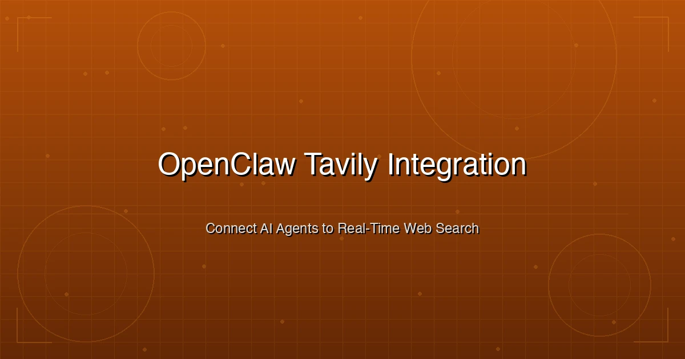

+++
date = '2026-03-06T14:00:00+08:00'
draft = false
title = 'OpenClaw 集成 Tavily：为你的 AI Agent 接入网络搜索能力'
description = '手把手教你在 OpenClaw 中集成 Tavily 搜索，涵盖 API 申请、tavily-search/extract/crawl 三种工具详解、按 Agent 配置权限以及费用控制技巧。'
toc = true
tags = ['OpenClaw', 'Tavily', 'AI Agents', 'Web Search', 'ClawHub']
categories = ['AI Guides']
keywords = ['openclaw tavily', 'openclaw tavily 搜索', 'tavily 集成 openclaw', 'tavily api openclaw', 'openclaw 网络搜索', 'tavily-search 技能', 'openclaw tavily 配置', 'tavily-extract', 'tavily-crawl']

[[params.faqItems]]
question = "如何在 OpenClaw 中添加 Tavily 搜索？"
answer = "使用 'clawdhub install tavily-search' 安装搜索技能，在 tavily.com 获取免费 API Key，然后设置 TAVILY_API_KEY 环境变量。重启 OpenClaw 网关后，Agent 就能立即使用网络搜索了。"

[[params.faqItems]]
question = "Tavily 搭配 OpenClaw 使用是否免费？"
answer = "Tavily 提供免费的 Researcher 套餐，每月 1,000 个 API 额度，无需绑定信用卡。基础搜索消耗 1 个额度，高级搜索消耗 2 个额度。付费方案起步价为每月 30 美元，可获得 4,000 个额度。"

[[params.faqItems]]
question = "tavily-search、tavily-extract 和 tavily-crawl 有什么区别？"
answer = "tavily-search 执行 AI 优化的网络搜索，返回结构化的摘要片段。tavily-extract 从指定 URL 提取完整的纯文本内容。tavily-crawl 系统性地爬取网站上的多个页面并提取内容。大多数 OpenClaw 用户只需要 tavily-search 就足够了。"

[[params.faqItems]]
question = "能否只给特定的 OpenClaw Agent 分配 Tavily 权限？"
answer = "可以。在 openclaw.json 配置中，通过每个 Agent 的 tools.allow 和 tools.deny 数组来控制哪些 Agent 可以使用 tavily-search。比如只让研究型 Agent 拥有搜索权限，而编码型 Agent 则无需访问。"

[[params.faqItems]]
question = "为什么我的 OpenClaw Agent 不搜索而是直接编造信息？"
answer = "最常见的原因是 Tavily API Key 过期或未设置。当搜索工具调用失败时，OpenClaw Agent 会静默回退到基于训练数据生成回答。请检查 TAVILY_API_KEY 是否正确配置、免费额度是否已耗尽，并在 Agent 的系统提示中加入规则，要求它在搜索失败时主动报告。"
+++



你的 OpenClaw Agent 虽然聪明，但它是"瞎子"——没有网络搜索能力，它只能凭训练数据回答问题。这意味着它给出的答案听起来信心满满，实际上可能已经过时甚至是编造的。你问它昨天的新闻，它要么坦白不知道，要么更糟——一本正经地胡说八道。

[Tavily](https://tavily.com/) 解决的正是这个问题。它是一个专为 AI Agent 优化的搜索 API，返回的是干净、结构化的结果，而不是人类浏览器里那种充满噪音的 HTML 页面。把 Tavily 集成到 [OpenClaw](https://github.com/openclaw/openclaw) 之后，你的 Agent 就能实时访问互联网，从一个知识受限的聊天机器人升级为具备研究能力的智能助手。

本文将完整介绍 OpenClaw 与 Tavily 的集成过程：获取 API Key、安装技能、按 Agent 配置权限、选择合适的 Tavily 工具，以及控制使用成本。

## 为什么你的 OpenClaw Agent 需要网络搜索

想象一下：一个没有网络搜索的 AI Agent，就像一个被锁在密闭房间里的天才员工。他掌握了训练时学到的一切知识，但对当下正在发生的事情一无所知。具体来说：

- **无法获取时事**：不知道今天科技圈、金融界发生了什么
- **无法核实信息**：无法用当前来源验证某个说法是否准确
- **无法查询价格**：无法查看产品定价、股票行情或竞品报价
- **无法查阅文档**：无法阅读最新的 API 文档、版本说明或更新日志

接入 Tavily 后，你的 OpenClaw Agent 能在几秒内完成网络搜索、内容提取和结果整合。这不是渐进式的提升——这是"猜测"和"确知"之间的本质区别。

### 为什么选择 Tavily 而非其他搜索 API

你当然可以用 Google Custom Search、Bing API、Brave Search 或 SerpAPI。但 Tavily 在 OpenClaw 生态中占据主导地位是有原因的：

| 特性 | Tavily | Google/Bing API | Brave Search |
|------|--------|-----------------|--------------|
| **针对 AI Agent 优化** | 是——返回结构化摘要 | 否——返回原始 HTML/链接 | 部分支持 |
| **AI 生成摘要** | 包含在响应中 | 不支持 | 不支持 |
| **相关性评分** | 每条结果 0-1 分 | 不支持 | 不支持 |
| **免费额度** | 每月 1,000 次 | 有限或收费 | 每月 2,000 次 |
| **OpenClaw 集成** | 官方 ClawHub 技能 | 需要手动配置 | 社区技能 |
| **域名过滤** | 内置包含/排除 | 需自行实现 | 有限支持 |

Tavily 从设计之初就是为 LLM 服务的。它不会把原始网页丢给你的 Agent，而是提供经过预处理的、相关的文本片段和元数据。Agent 解析结果时消耗更少的 Token，产出的回答质量也更高。

## 获取 Tavily API Key

在安装任何东西之前，你需要先拿到 Tavily 的 API Key。免费套餐每月提供 1,000 个额度，个人使用完全够用。

**第 1 步**：访问 [tavily.com](https://tavily.com/)，点击 "Get Started" 或 "Sign Up"

**第 2 步**：注册账号（支持邮箱或 GitHub 登录）

**第 3 步**：进入控制台，复制你的 API Key。它以 `tvly-` 开头

**第 4 步**：妥善保存这个 Key，下一步配置时会用到

### Tavily 定价一览

了解额度计费体系有助于规划用量：

| 套餐 | 月额度 | 费用 | 单次成本 |
|------|--------|------|----------|
| **Researcher**（免费） | 1,000 | $0 | 免费 |
| **Project** | 4,000 | $30/月 | $0.0075 |
| **Bootstrap** | 15,000 | $100/月 | $0.0067 |
| **Startup** | 38,000 | $220/月 | $0.0058 |
| **Growth** | 100,000 | $500/月 | $0.005 |
| **按量计费** | 按使用量 | $0.008/次 | $0.008 |

**各操作的额度消耗**：
- 基础搜索：**1 个额度**
- 高级/深度搜索：**2 个额度**
- Extract（每 5 个 URL）：**1 个额度**（基础）或 **2 个额度**（高级）
- Map（每 10 个页面）：**1 个额度**

注意：未使用的额度**不会**结转到下月。如果你这个月只用了 300 个额度，剩下的 700 个会在月底清零。

## 在 OpenClaw 中安装 Tavily 搜索

### 前提条件

确保你已准备好以下环境：

1. **OpenClaw 已安装并运行** —— 如果还没有，请先参考 [OpenClaw 安装配置指南](/posts/ai/2026-03-05-openclaw-setup-guide/)
2. **ClawdHub CLI 已安装** —— OpenClaw 技能的包管理器
3. **Node.js 20+** —— tavily-search 技能的运行依赖

如果还没安装 ClawdHub CLI：

```bash
# 全局安装 ClawdHub（注意：是带 'd' 的 clawdhub）
npm i -g clawdhub

# 验证安装
clawdhub --version
```

> 常见错误：很多教程把命令写成 `clawhub`（少了个 'd'）。正确的命令是 **`clawdhub`**。关于这个命名混淆的更多细节，参见 [OpenClaw 自动化常见坑](/posts/ai/2026-02-14-openclaw-automation-pitfalls/)。

### 第 1 步：安装技能

```bash
# 从 ClawHub 安装 tavily-search
clawdhub install tavily-search
```

安装完成后，技能会被下载到工作区的 `skills/` 目录（通常在 `~/.openclaw/workspace/skills/tavily-search/`）。OpenClaw 在下次启动会话时会自动加载新技能。

### 第 2 步：配置 API Key

有两种方式提供 API Key。

**方式 A：环境变量（推荐）**

在你的 Shell 配置文件（`~/.zshrc`、`~/.bashrc` 等）中添加：

```bash
# 添加 Tavily API Key
export TAVILY_API_KEY="tvly-xxxxxxxxxxxxxxxx"
```

然后重新加载 Shell：

```bash
source ~/.zshrc  # 或 ~/.bashrc
```

如果你以后台守护进程方式运行 OpenClaw（通过 `launchd` 或 `systemd`），需要确保环境变量对守护进程可见。在 macOS 上使用 `launchd` 时：

```bash
# 为 launchd 设置环境变量
launchctl setenv TAVILY_API_KEY "tvly-xxxxxxxxxxxxxxxx"
```

**方式 B：OpenClaw 配置文件**

直接在 `~/.openclaw/openclaw.json` 中添加 API Key：

```json5
{
  "skills": {
    "entries": {
      "tavily-search": {
        "enabled": true,
        "env": {
          "TAVILY_API_KEY": "tvly-xxxxxxxxxxxxxxxx"
        }
      }
    }
  }
}
```

方式 A 更安全，因为 Key 不会出现在可能被意外分享的配置文件中。方式 B 更方便，适合所有配置都通过 OpenClaw 统一管理的场景。

### 第 3 步：验证安装

重启 OpenClaw 网关：

```bash
# 如果以守护进程运行
openclaw restart

# 如果手动运行
# 先停止当前网关（Ctrl+C），然后重新启动
openclaw gateway
```

然后通过 Telegram、WhatsApp 或终端界面给 Agent 发一条测试消息：

```
搜索一下今天关于 AI Agent 的最新新闻
```

如果 Agent 返回了带有具体日期和来源 URL 的最新结果，说明 Tavily 已经正常工作。如果它只给出没有来源的泛泛信息，请参阅下方的故障排除部分。

## 按 Agent 配置 Tavily 权限

并非每个 Agent 都需要网络搜索。一个专门重构 Python 代码的编码 Agent 用不上 Tavily；而一个监控竞品动态的研究 Agent 离了搜索就没法干活。

OpenClaw 允许你通过 `openclaw.json` 中的 `tools.allow` 和 `tools.deny` 数组，按 Agent 精细控制工具访问权限。

### 示例：研究 Agent 有搜索权限，编码 Agent 没有

```json5
{
  "agents": {
    "list": [
      {
        "id": "researcher",
        "tools": {
          // 只给这个 Agent 搜索和读取权限
          "allow": ["tavily-search", "browser", "read"],
          "deny": ["exec", "write"]
        }
      },
      {
        "id": "coder",
        "tools": {
          // 编码 Agent 有执行权限但没有搜索权限
          "allow": ["exec", "read", "write"],
          "deny": ["tavily-search", "browser"]
        }
      },
      {
        "id": "writer",
        "tools": {
          // 写作 Agent 有搜索权限用于核实信息，但不能执行命令
          "allow": ["tavily-search", "read"],
          "deny": ["exec", "write"]
        }
      }
    ]
  }
}
```

这种配置遵循**最小权限原则**：每个 Agent 只能访问它真正需要的工具。研究 Agent 可以搜索网络但不能执行 Shell 命令，编码 Agent 可以运行代码但不会浪费 Tavily 额度去做无意义的搜索。

关于 Agent 专属配置的更多细节，参见 [OpenClaw 多 Agent 配置指南](/posts/ai/2026-03-05-openclaw-multi-agent-setup/)。

### 让所有 Agent 都拥有搜索权限

如果你只运行一个 Agent，或者希望所有 Agent 都能使用 Tavily，那就不需要单独配置工具权限。只要安装了技能并设置了 API Key，搜索功能默认对所有 Agent 可用。

只有当你想**限制**某些 Agent 使用搜索时，才需要显式配置工具权限。

## 使用 Tavily 搜索：命令和选项

安装完成后，你的 Agent 可以通过自然语言使用 Tavily，不需要输入特定命令——Agent 会在内部自动调用搜索工具。但了解可用选项有助于你给出更精准的指令。

### 基础搜索

直接让 Agent 搜索即可：

```
搜索一下在 Mac Mini 上运行 OpenClaw 的最佳实践
```

Agent 会使用默认设置调用 Tavily：5 条结果、基础搜索深度、通用主题。

### 深度研究模式

对于需要全面覆盖的复杂主题，可以让 Agent 进行深度搜索：

```
深入搜索 2026 年 3 月 MCP 协议的最新变化
```

这背后使用的是 `--deep` 标志，启用 Tavily 的高级搜索模式。耗时更长（5-10 秒 vs 1-2 秒），但返回更广泛、更全面的结果。每次深度搜索消耗 **2 个额度**。

### 新闻专项搜索

查询时事时，可以指定新闻主题：

```
搜索过去 3 天的 AI 新闻
```

这会触发 `--topic news` 和 `--days 3`，将结果限定为近期新闻文章。特别适合每日简报——如果你安装了 [proactive-agent](https://clawhub.ai/halthelobster/proactive-agent)，还能设置自动化定时执行。

### 控制返回数量

默认情况下 Tavily 返回 5 条结果，你可以要求更多：

```
搜索 "OpenClaw 安全最佳实践"，给我 15 条结果
```

Agent 会使用 `-n 15` 标志。每次查询最多返回 20 条结果。更多结果意味着更丰富的上下文，但也会消耗更多 Token。

### 域名过滤

你可以让 Agent 只搜索特定域名或排除某些域名：

```
搜索 Python 异步编程教程，只从 python.org 和 realpython.com 获取结果
```

或者排除低质量来源：

```
搜索 AI Agent 框架，排除 Pinterest 和 Medium
```

域名过滤在需要权威来源的研究任务中非常有用。**包含域名**适用于：
- 学术研究（`.edu` 域名）
- 官方文档站点
- 知名行业权威

**排除域名**适用于：
- 内容农场和 SEO 垃圾站
- 有付费墙的网站
- 不相关的平台（比如非图片类查询排除 Pinterest）

### Tavily 搜索参数汇总

| 参数 | 功能 | 额度消耗 | 适用场景 |
|------|------|----------|----------|
| （默认） | 基础搜索，5 条结果 | 1 个额度 | 快速查询、简单检索 |
| `--deep` | 高级搜索，更全面 | 2 个额度 | 深度研究、综合分析 |
| `--topic news` | 仅返回新闻结果 | 1 个额度 | 时事热点、突发新闻 |
| `--days <n>` | 限制新闻时间范围 | 1 个额度 | 筛选近期新闻 |
| `-n <count>` | 返回结果数量（最多 20） | 1 个额度 | 需要更多来源时 |

## Tavily-Search vs Tavily-Extract vs Tavily-Crawl

Tavily 提供三种不同的工具。ClawHub 上的 `tavily-search` 技能包含搜索和提取功能。弄清楚什么时候该用哪个，能帮你节省额度并获得更好的结果。

### Tavily-Search：查找信息

**功能**：向 Tavily 搜索 API 发送查询，返回包含标题、URL、内容片段和相关性评分的结构化结果。

**适用场景**：回答问题、核实信息、市场调研、获取最新动态。

```
"2026 年 3 月排名前列的 AI Agent 框架有哪些？"
→ 返回 5 条结构化结果，包含摘要和来源 URL
```

**消耗**：1 个额度（基础）或 2 个额度（高级）

### Tavily-Extract：读取指定页面

**功能**：输入一个 URL，返回该页面的完整纯文本内容。没有 HTML 噪音——只有可读的文本。

**适用场景**：阅读特定文章、从已知页面提取数据、获取文档内容。

```
"提取 https://docs.tavily.com/documentation/api-credits 的内容"
→ 返回页面完整文本，已清除 HTML/CSS/JS
```

**消耗**：每 5 个 URL 消耗 1 个额度（基础）或 2 个额度（高级）

### Tavily-Crawl：爬取整个网站

**功能**：结合 Tavily 的 Map API（发现网站上的页面）和 Extract（提取每个页面的内容），系统性地采集整个网站或特定板块的内容。

**适用场景**：从文档站点构建知识库、对竞品网站进行分析、采集某个博客的所有文章。

```
"爬取 OpenClaw 文档站点并总结其核心功能"
→ 先映射站点结构，再提取各页面内容，返回汇总结果
```

**消耗**：Map（每 10 个页面 1 个额度）+ Extract（每 5 个 URL 1 个额度）的总和

### 到底该用哪个？

90% 的 OpenClaw 使用场景中，**tavily-search 就够了**。以下是决策参考：

| 我想要... | 使用 | 举例 |
|-----------|------|------|
| 查询某个问题的答案 | `tavily-search` | "最新的 Claude API 定价是多少？" |
| 读取某个特定网页 | `tavily-extract` | "帮我读取这篇博文：[URL]" |
| 采集整个网站的数据 | `tavily-crawl` | "爬取 competitor.com 的所有定价页面" |
| 关注某个主题的新闻 | `tavily-search --topic news` | "本周的 AI 融资新闻" |
| 对复杂主题做深度研究 | `tavily-search --deep` | "对比所有 MCP Server 实现方案" |

## 实际应用场景

### 1. 每日新闻简报

将 Tavily 与 [proactive-agent](https://clawhub.ai/halthelobster/proactive-agent) 结合，实现自动化每日简报：

```
每天早上 8:00，搜索排名前 5 的 AI 新闻，
每条用 2-3 句话做摘要，然后把摘要发给我。
```

OpenClaw 会将其设置为定时任务。每天早上 Agent 自动执行 Tavily 搜索、处理结果，然后通过 Telegram 或 WhatsApp 给你发送摘要。每日消耗大约 1-2 个额度。

### 2. 竞品监控

```
每周一搜索过去 7 天科技新闻中提到 [竞品名称] 的内容，
总结其产品发布、定价变动和合作伙伴关系。
```

不费吹灰之力就能获得一份每周竞品情报报告。

### 3. 写作前的资料调研

如果你用 OpenClaw 来辅助写作（参见 [OpenClaw + Claude Code 工作流](/posts/ai/2026-01-31-openclaw-claude-code-workflow/)），Tavily 能确保 Agent 基于最新事实而非过时的训练数据来写作：

```
调研 2026 年 AI Agent 框架的现状，
包括市场领导者、开源方案和最新进展，
然后基于调研结果写一篇 1000 字的文章。
```

### 4. 价格和库存查询

```
搜索 Mac Mini M4 32GB 版本在 Apple 官网、
Amazon 和 Best Buy 上的当前价格
```

对购买决策、产品对比或电商价格监控都很实用。

### 5. 文档查阅

```
搜索 Anthropic 文档中关于 Claude API 最新的
速率限制和定价变动
```

让你的 Agent 时刻掌握它所使用工具的最新动态，免去你手动阅读更新日志的麻烦。

## 进阶配置

### 搜索深度选项

Tavily 提供多种搜索深度级别，在延迟和质量之间有不同的权衡：

| 深度 | 响应时间 | 质量 | 适用场景 |
|------|----------|------|----------|
| **ultra-fast** | < 1 秒 | 基础摘要 | 快速事实查询、自动补全 |
| **fast** | 1-2 秒 | 优质摘要，每个 URL 多条 | 日常大部分查询 |
| **basic**（默认） | 1-2 秒 | 标准质量 | 通用搜索 |
| **advanced**（`--deep`） | 5-10 秒 | 全面覆盖，范围更广 | 深度研究、复杂问题 |

对于延迟敏感的场景（如实时对话），建议把 Agent 默认设为 `fast`。对于重度研究型 Agent，`advanced` 虽然多等几秒、多花几个额度，但绝对物有所值。

### 在 Agent 系统提示中添加搜索规则

为了获得最佳效果，建议在 Agent 的系统提示中加入搜索使用规范。编辑 Agent 工作区中的 `SOUL.md` 或 `AGENTS.md` 文件：

```markdown
## 网络搜索使用规范

- 当用户询问时事、价格或近期动态时，务必使用 Tavily 搜索
- 默认使用基础搜索，只有复杂研究主题才使用 --deep
- 如果搜索返回 0 条结果或失败，必须明确告知用户。
  绝不能用编造的信息代替搜索结果
- 引用搜索结果时附上来源 URL
- 新闻查询使用 --topic news 并限定合理时间范围
- 当用户指定可信来源时，严格遵守域名过滤要求
```

最后一条规则——关于失败时必须主动报告——至关重要。如果没有这条规则，当 Tavily 调用失败时，Agent 会静默回退到基于训练数据生成回答。你会得到一个看起来很自信的回复，但内容完全是编造的。关于这种失败模式的深入分析，参见 [OpenClaw 自动化常见坑](/posts/ai/2026-02-14-openclaw-automation-pitfalls/)。

### 为多个 Agent 配置不同的环境

如果不同的 Agent 需要不同的 Tavily 配置，可以在 `openclaw.json` 中独立设置：

```json5
{
  "agents": {
    "list": [
      {
        "id": "researcher",
        "skills": {
          "tavily-search": {
            "enabled": true,
            "env": {
              // 研究 Agent 使用独立的 Key，额度更高
              "TAVILY_API_KEY": "tvly-research-key-here"
            }
          }
        }
      },
      {
        "id": "main",
        "skills": {
          "tavily-search": {
            "enabled": true,
            "env": {
              // 主 Agent 使用免费套餐的 Key
              "TAVILY_API_KEY": "tvly-free-tier-key-here"
            }
          }
        }
      }
    ]
  }
}
```

这样研究 Agent 可以使用付费 Tavily 方案进行大量研究，而主 Agent 继续用免费套餐处理日常查询。

## 常见问题排查

### 问题：Agent 无视 Tavily，直接用训练数据生成回答

**症状**：你询问近期事件，Agent 给出的回答没有来源 URL，或者信息明显过时。

**排查与修复**：

1. **API Key 未设置**：运行 `echo $TAVILY_API_KEY` 检查变量是否可用。如果为空，在 Shell 配置文件中设置并重启网关
2. **API Key 过期或无效**：登录 [tavily.com](https://tavily.com/) 查看控制台。必要时生成新 Key
3. **免费额度耗尽**：在 Tavily 控制台查看用量，免费额度每月重置
4. **守护进程获取不到环境变量**：如果 OpenClaw 以守护进程运行，Shell 配置文件中的环境变量可能无法传递到守护进程。使用 `launchctl setenv`（macOS）或在 systemd 服务文件中添加（Linux）

### 问题：安装时提示 "Skill Not Found"

**症状**：`clawdhub install tavily-search` 返回错误。

**修复**：

1. 确认使用的是 **`clawdhub`**（带 'd'），而不是 `clawhub`
2. 更新 ClawdHub：`npm update -g clawdhub`
3. 检查网络连接

### 问题：搜索结果质量差或不相关

**修复**：

1. 让搜索词更具体。"AI 新闻"太笼统，"OpenClaw 2026 年 3 月新功能"更好
2. 使用域名过滤，指向权威来源
3. 对复杂主题尝试 `--deep` 模式
4. 用 `-n 10` 或 `-n 15` 增加返回数量以扩大覆盖面

### 问题：修改配置后网关启动失败

**症状**：OpenClaw 拒绝启动，报告 JSON Schema 错误。

**修复**：OpenClaw 使用严格的 JSON5 Schema 校验。多一个逗号、字段名拼写错误或嵌套层级不对都会导致启动失败。运行：

```bash
# 诊断配置问题
openclaw doctor
```

仔细查看错误信息。最常见的错误是把技能配置放在了 JSON 层级结构中错误的位置。

## 费用控制技巧

Tavily 的免费额度很慷慨（每月 1,000 次），但一个搜索欲旺盛的 Agent 几天就能用完。以下是控制预算的几个方法。

### 1. 设定每月额度预算

在 [Tavily 控制台](https://tavily.com/) 跟踪用量。如果你的套餐支持，设置用量提醒。个人使用的大致预算参考：

| 使用模式 | 月消耗额度 | 所需套餐 |
|----------|-----------|----------|
| 偶尔手动查询 | 100-300 | 免费 |
| 每日新闻简报 + 临时搜索 | 300-600 | 免费 |
| 研究型 Agent 日常使用 | 600-1,500 | 免费至 Project |
| 多 Agent 团队重度研究 | 2,000-5,000 | Project 至 Bootstrap |

### 2. 默认使用基础搜索

高级搜索（`--deep`）消耗 2 倍额度。只在真正需要深度研究时才使用。快速查询用基础搜索更快也更省。

### 3. 限制 Agent 访问权限

如前文配置部分所述，只给真正需要搜索的 Agent 开通 Tavily 权限。一个编码 Agent 每次代码审查都跑一遍 `tavily-search`，纯属浪费。

### 4. 使用隔离的定时任务

设置周期性搜索（每日简报、每周报告）时，使用 OpenClaw 的隔离定时任务。这可以防止搜索结果渗透到其他会话中，引发不必要的后续搜索：

```json5
{
  "id": "daily-news",
  "schedule": { "cron": "0 8 * * *", "tz": "Asia/Shanghai" },
  "isolated": true,  // 在独立会话中运行
  "message": "搜索排名前 5 的 AI 新闻并做摘要"
}
```

### 5. 尽量利用缓存

如果你的 Agent 在短时间内反复搜索相同内容，可以在系统提示中指示它复用之前的搜索结果，而不是重复调用 Tavily：

```markdown
如果在过去一小时内搜索过相同主题，
复用上次的搜索结果，不要重新搜索。
```

## 延伸阅读

- [OpenClaw 安装配置指南](/posts/ai/2026-03-05-openclaw-setup-guide/) —— 如果你还没有搭建 OpenClaw，从这里开始
- [OpenClaw 多 Agent 配置：打造协同工作的 AI 团队](/posts/ai/2026-03-05-openclaw-multi-agent-setup/) —— 按角色分配 Tavily 权限的 Agent 团队配置
- [OpenClaw 自动化常见坑](/posts/ai/2026-02-14-openclaw-automation-pitfalls/) —— 安装 Tavily 等技能后最容易踩的坑
- [OpenClaw 记忆策略](/posts/ai/2026-01-31-openclaw-memory-strategy/) —— 记忆系统如何与 Tavily 等工具协同工作
- [OpenClaw 2026.3.1 新功能](/posts/ai/2026-03-03-openclaw-2026-3-1-new-features/) —— 最新版本的 Agent 路由和 WebSocket 流式传输功能
