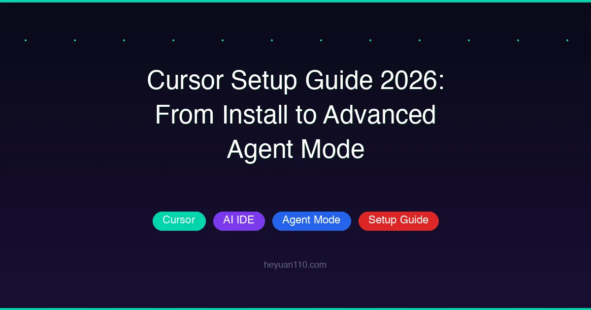

+++
date = '2026-03-08T18:00:00+08:00'
draft = false
title = 'Cursor 完全指南 2026：从安装到高级 Agent 模式实战'
description = '2026 Cursor IDE 从零上手实测教程：10 分钟装好、Agent 模式/Rules 配置/TDD 工作流/Git Worktrees 并行执行全流程讲透。新手老手都能照做，直接上生产。'
toc = true
tags = ['Cursor', 'AI Coding Tools', 'AI IDE', 'Setup Guide']
categories = ['AI Guides']
keywords = ['cursor 新手教程 2026', 'cursor 下载安装', 'cursor agent 怎么用', 'cursor ide 配置教程', 'cursor 和 claude code 对比', 'cursor 使用教程', 'cursor ide 配置', 'cursor agent 模式', 'cursor 最佳实践 2026', 'cursor 规则配置', 'ai ide 设置', 'cursor 入门指南', 'cursor rules 配置', 'cursor 安装教程 2026']

[[params.faqItems]]
question = "Cursor Agent 模式是什么？怎么用？"
answer = "Cursor Agent 模式是内置在 Cursor IDE 中的 AI 编程助手。它通过指令系统、工具集（文件编辑、代码搜索、终端）和用户消息来自主编写、修改和调试代码。按 Shift+Tab 可以启用规划模式，让 Agent 先分析代码库并提出方案，再动手写代码。"

[[params.faqItems]]
question = "Cursor 和 VS Code 有什么区别？"
answer = "Cursor 基于 VS Code 构建，但增加了深度 AI 集成，包括 Agent 模式、规划模式、自定义 Rules、通过 Git Worktrees 实现并行执行，以及后台运行的 Cloud Agents。相比 VS Code 的 Copilot，Cursor 提供了更全面的 AI 原生开发体验。"

[[params.faqItems]]
question = "Cursor Rules 是什么？怎么配置？"
answer = "Cursor Rules 是存放在 .cursor/rules/ 目录下的 Markdown 文件，为 AI Agent 提供项目级的持久化指令。可以包含构建命令、编码规范和工作流指引。最佳实践是按需添加——只在发现 Agent 反复犯同样的错误时才加规则。"

[[params.faqItems]]
question = "Cursor 能同时运行多个 AI Agent 吗？"
answer = "可以。Cursor 支持通过 Git Worktrees 实现并行执行，每个 Agent 在独立的工作空间中运行，文件修改互不冲突。适用于对比不同实现方案、测试多个模型、或将复杂任务拆分成独立子任务并行处理。"
+++



Cursor 已经成为 2026 年最强大的 AI 原生 IDE 之一，但大多数开发者只用到了它的皮毛。这篇指南将带你从全新安装一路走到高级 Agent 模式工作流，帮你真正释放 Cursor 的生产力。

## Cursor 是什么？为什么值得关注？

Cursor 是 Visual Studio Code 的一个分支，在开发体验的各个层面都深度集成了 AI。和后期加装的 AI 插件不同，Cursor 的 Agent 模式是从编辑器核心层构建的——它能读取文件、搜索代码库、执行终端命令，还能自主编辑代码。

如果你在对比各种 AI 编程工具，可以看看我们的 [AI 编程工具对比](/posts/ai/2026-03-10-ai-coding-agents-comparison-2026/)，了解 2026 年的全景。想看和另一款热门工具的正面对决，请看 [Claude Code vs Cursor](/posts/ai/2026-02-28-claude-code-vs-cursor/)。

Cursor 和普通 VS Code + Copilot 的根本区别在于：Cursor 把 AI 当作一等公民。它不只是自动补全——而是一个能规划、执行和迭代的 Agent。

## 安装 Cursor

上手非常简单：

1. **下载**：从 [cursor.com](https://cursor.com) 下载 Cursor
2. **安装**：支持 macOS、Windows 和 Linux
3. **登录**：用你的账号登录以激活 AI 功能
4. **导入设置**：如果从 VS Code 迁移，可以直接导入配置（Cursor 兼容 VS Code 插件、快捷键和主题）

因为 Cursor 基于 VS Code 构建，你现有的插件开箱即用，迁移几乎无缝。

### 首次配置

安装完成后，配置这几个关键项：

- **模型选择**：在 Settings > Models 中选择首选模型。Cursor 支持多个前沿模型，并对每个模型做了优化。
- **隐私设置**：检查哪些数据发送到云端，哪些在本地处理。
- **快捷键**：最重要的快捷键是 `Cmd/Ctrl + I` 打开 AI 对话面板，`Shift + Tab` 进入规划模式。

## 理解 Agent 架构

在深入工作流之前，先了解 Cursor 的 Agent 是怎么运作的。系统由三个核心组件构成：

| 组件 | 作用 |
|------|------|
| **系统指令** | 引导 Agent 行为和能力的提示词 |
| **工具集** | 文件编辑、代码搜索、终端执行等 |
| **用户消息** | 你的指令、问题和反馈 |

Cursor 团队针对每个支持的模型调优了这些组件，所以不管你选哪个模型，Agent 都知道如何高效使用它的工具。

这种架构在概念上和其他 AI 编程工具类似。比如 Claude Code 用 CLAUDE.md 配置实现了类似的方案——可以看看我们的 [CLAUDE.md 指南](/posts/ai/2026-02-28-claude-code-claudemd-guide/) 对比不同工具处理项目上下文的方式。

## 规划模式：先想清楚再动手

这可能是 Cursor 最重要的功能，但大多数人直接跳过了。

> 你能做的最有价值的事，就是在写代码之前先做规划。

### 如何使用规划模式

按 `Shift + Tab` 激活规划模式。Agent 不会立即生成代码，而是会：

1. **分析代码库**——自动了解项目结构和现有模式
2. **提出澄清问题**——确保真正理解你的意图
3. **制定详细计划**——以分步骤方式提出实现方案
4. **等待确认**——你确认后才开始写代码

### 计划文件

计划以 Markdown 文件保存在 `.cursor/plans/` 目录：

```
.cursor/
└── plans/
    ├── feature-auth-refactor.md
    ├── bug-fix-payment.md
    └── api-redesign.md
```

这些文件有多重用途：

- **团队文档**——成为技术决策的记录
- **可恢复**——精确地从中断处继续
- **可编辑**——在 Agent 执行之前手动调整计划

### 何时重新规划

如果 Agent 的输出偏离了预期，**回头优化计划**，而不是试图通过多轮迭代修补代码。一个更好的计划几乎总是比反复修正更快产出好结果。

## 上下文管理：少即是多

上下文管理的好坏直接决定了 Agent 的表现。这一点至关重要。

### 让 Agent 自己找上下文

最常见的错误是手动标记太多文件。Cursor 的 Agent 本身就有强大的搜索能力：

- **语义搜索**——理解代码含义，不只是文本匹配
- **Grep 搜索**——精确的关键词匹配
- **文件遍历**——探索项目结构、追踪导入关系

**推荐做法：**

```
"重构用户认证逻辑，支持 OAuth 登录"
```

**不推荐：**

```
@file1.ts @file2.ts @file3.ts @file4.ts "重构认证逻辑"
```

只有当你确切知道涉及哪些文件、而且 Agent 自己找不到时，才手动指定。

### 对话管理

判断什么时候开新对话、什么时候继续现有对话，是一项需要培养的技能：

**开新对话：**
- 切换到不同任务时
- Agent 看起来困惑或陷入循环时
- 完成了一个逻辑单元的工作时

**继续当前对话：**
- 在同一功能上迭代时
- 调试 Agent 刚写的代码时
- 下一步需要之前的上下文时

**核心原则：** 冗长的对话会积累"上下文噪音"，降低 Agent 的效率。带着清晰提示的新对话，效果远好于漫长而松散的旧对话。

### 引用历史对话

用 `@Past Chats` 可以选择性地将之前对话的上下文导入新对话。这样既能获取相关历史，又不带入累积的噪音，两全其美。

上下文管理是 AI 辅助开发中的通用原则。想深入了解，可以看我们的 [上下文工程指南](/posts/ai/2026-03-10-context-engineering-guide/)。

## 配置 Rules 和 Skills

Cursor 提供两种自定义 Agent 行为的机制：**Rules**（静态上下文）和 **Skills**（动态能力）。

### Rules：项目的 AI 配置文件

在 `.cursor/rules/` 中创建 Markdown 文件，为 Agent 提供持久化的项目指令：

````markdown
<!-- .cursor/rules/project-conventions.md -->

# 项目规范

## 构建和测试
- 构建：`npm run build`
- 测试：`npm run test`
- 类型检查：`npm run typecheck`

## 代码风格
- 使用 ES Modules
- 优先使用解构
- 异步操作使用 async/await

## 工作流
- 每次修改后运行类型检查
- 提交前确保所有测试通过
````

### 该写什么，不该写什么

| 该写 | 不该写 |
|------|--------|
| 常用的构建/测试命令 | 完整的代码风格指南 |
| 关键架构模式 | 每个命令的详细文档 |
| 文件结构约定 | 通用编程知识 |

### 响应式规则原则

**不要一开始就堆满规则。** 从最小配置开始，只在发现 Agent 反复犯同样错误时才添加规则。这样能保持规则精炼且有效。

推荐的演进路径：

```
第 1 周：使用默认配置
    ↓
观察 Agent 的行为模式
    ↓
发现重复出现的问题
    ↓
添加针对性规则
    ↓
持续观察和迭代
```

### Skills：动态能力

Skills 在 `SKILL.md` 文件中定义，提供动态加载的能力：

- **自定义命令**——在对话中通过 `/` 前缀触发
- **Hook 函数**——在 Agent 动作前后执行
- **领域知识**——在相关时自动加载

### 用 Hooks 实现持续迭代

一个强大的模式是配置 Hooks 让 Agent 持续迭代直到测试通过。在 `.cursor/hooks.json` 中：

```json
{
  "version": 1,
  "hooks": {
    "stop": [
      { "command": "bun run .cursor/hooks/grind.ts" }
    ]
  }
}
```

Hook 脚本接收 Agent 行为的 JSON 输入，可以返回 `followup_message` 触发新一轮迭代。这样就创建了一个自动化的"修复 → 测试 → 再修复"循环，直到代码正确为止。

## 用 Cursor Agent 做测试驱动开发

TDD 和 Agent 模式天然契合。测试给了 Agent 一个明确的、可验证的成功标准——测试通过，任务完成。

### TDD 工作流

```
1. 让 Agent 根据输入/输出预期编写测试
   ↓
2. 确认没有实现代码时测试失败（红灯阶段）
   ↓
3. 提交测试文件
   ↓
4. 让 Agent 编写代码使测试通过
   （明确告诉它不要修改测试）
   ↓
5. 迭代直到所有测试通过
```

### 为什么 TDD 和 AI Agent 特别搭

- **明确的成功标准**——测试通过 = 任务完成
- **自动验证**——Agent 可以自己运行测试并检查结果
- **防止过度设计**——只需满足测试要求即可
- **快速反馈**——代码对不对，立刻就能知道

### 实战示例

一个高效的 TDD 提示词：

```
为用户登录函数编写单元测试，覆盖以下场景：
1. 正确的用户名和密码应该返回 token
2. 错误的密码应该返回 401
3. 不存在的用户应该返回 404

遵循 __tests__/auth.test.ts 中的现有测试模式。
先不要写实现代码——我要先确认测试会失败。
```

确认测试失败后，再跟进：

```
现在实现登录函数，让所有测试通过。
不要修改任何测试文件。
```

这种工作流和 [Vibe Coding](/posts/ai/2026-02-28-vibe-coding-explained/) 的理念相通——开发者通过高层意图引导 AI，而不是纠结于底层指令。

## 代码审查：信任但要验证

AI 生成的代码可能看起来很专业、测试也能通过，但仍然可能存在微妙的问题。代码审查依然不可或缺。

### 生成过程中

- **实时查看 diff**——关注每一行变化
- **及早中断**——如果发现 Agent 走偏了，按 `Escape` 打断。重新引导比事后修补快得多

### 生成之后

- **查找问题**——点击 Review > Find Issues 进行专门的代码分析
- **要求解释**——让 Agent 解释关键决策和权衡取舍

### Pull Request 审查

- **Bugbot**——Cursor 的自动化 PR 分析工具，在人工审查之前就能捕获问题
- **架构图**——对于重大变更，让 Agent 生成 Mermaid 图表：

```
为这次认证系统重构生成一个 Mermaid 架构图，
展示各模块之间的调用关系。
```

架构图能比逐行审查更快地暴露结构性问题。

## 并行执行多个 Agent

Cursor 最被低估的功能之一，就是能同时运行多个 Agent，每个都在独立的工作空间中。

### 工作原理

Cursor 使用 [Git Worktrees](https://git-scm.com/docs/git-worktree) 来管理并行 Agent：

```
project/
├── .git/
├── main-workspace/        ← Agent 1 的工作空间
├── .worktrees/
│   ├── agent-2/           ← Agent 2 的工作空间
│   └── agent-3/           ← Agent 3 的工作空间
```

每个 Agent 操作自己的代码副本，文件修改在 Agent 之间完全隔离。

### 什么时候用并行 Agent

- **同一任务，不同模型**——让 Claude 和 GPT-4 解决同一个问题，对比输出
- **同一任务，不同方案**——同时探索多种实现策略
- **复杂任务分解**——将大任务拆分成独立子任务，并行处理

### 并行执行工作流

```
1. 用相同（或相关）的提示词启动多个 Agent
2. 让每个 Agent 独立完成工作
3. 并排对比结果
4. 将最佳方案合并到主分支
```

这种方法在复杂重构任务中特别有用——当"正确"方案不明显时，同时尝试多条路径。

## 编写高效的提示词

提示词的质量直接决定 Agent 输出的质量。以下是经过验证的有效模式。

### 具体，不模糊

```
# 模糊（不好）
"给 auth.ts 加测试"

# 具体（好）
"为 auth.ts 中的 logout 函数编写边界用例测试。
遵循 __tests__/ 中的现有模式。
不要用 mock——测试真实的 session 清理逻辑。"
```

具体性能显著提高一次成功率。

### 提供可验证的目标

给 Agent 客观的自查方式：

- **使用强类型语言**——比如 TypeScript 而不是 JavaScript
- **配置 linter**——ESLint、Prettier 等工具
- **编写测试**——包括单元测试和集成测试

这些工具提供了 Agent 可以自主使用的客观验证标准。

### 把 Agent 当作协作者

不要只是下命令。进行协作式对话：

```
"我想重构认证模块以支持多种登录方式。
你能先分析现有的代码结构，
然后提出几种方案吗？
对每种方案说明优缺点。"
```

协作式的对话比指令式的提示更能产出深思熟虑的实现。

## Git 工作流自动化

Cursor 支持在 `.cursor/commands/` 中定义自定义命令，实现可复用的工作流：

````markdown
<!-- .cursor/commands/pr.md -->
# /pr - 创建 Pull Request

1. 用描述性消息提交当前更改
2. 推送到远程
3. 创建带自动生成描述的 PR
````

其他好用的自定义命令：

- `/fix-issue [number]`——从 GitHub 获取 issue 详情，实现修复
- `/review`——审查当前更改中的问题
- `/update-deps`——安全地更新项目依赖

这些命令文件把复杂的多步工作流变成一条斜杠命令。

## Cloud Agents：后台任务执行

对于不需要实时交互的任务，Cursor 的 Cloud Agents 可以在后台运行——即使你离线也没问题。

适合 Cloud Agents 的任务：

- 定义明确的 **Bug 修复**
- 范围清晰的 **代码重构**
- 现有代码的 **测试生成**
- 未文档化模块的 **文档编写**

从 Cursor 网页界面或移动端创建后台任务，回到电脑前再查看结果。

## 快速参考：Cursor 快捷键

| 快捷键 | 功能 |
|--------|------|
| `Cmd/Ctrl + I` | 打开 AI 对话面板 |
| `Shift + Tab` | 激活规划模式 |
| `Escape` | 停止 Agent 生成 |
| `Cmd/Ctrl + .` | 快速修复建议 |
| `/` + 命令名 | 运行自定义命令 |

## 总结：高效使用 Cursor 的七个原则

1. **先规划**——每个重要任务前用规划模式（`Shift+Tab`）
2. **智能管理上下文**——让 Agent 自己搜索，避免上下文过载
3. **响应式添加规则**——从最小配置开始，看到重复错误再加规则
4. **用测试驱动**——TDD 给 Agent 明确的、可验证的成功标准
5. **认真审查**——AI 生成的代码仍然需要人的判断
6. **并行探索**——运行多个 Agent 对比不同方案
7. **协作，而非命令**——把 Agent 当作有能力的团队成员

Cursor 不只是一个装了 AI 的编辑器。配置得当、用对方法，它能真正成为你开发效率的倍增器。

## 相关阅读

- [Claude Code vs Cursor：哪个 AI 编程工具更适合你？](/posts/ai/2026-02-28-claude-code-vs-cursor/)
- [Claude Code 完全指南](/posts/ai/2026-02-28-claude-code-complete-guide/)
- [2026 年 AI 编程工具对比](/posts/ai/2026-03-10-ai-coding-agents-comparison-2026/)
- [AI 开发的上下文工程指南](/posts/ai/2026-03-10-context-engineering-guide/)
- [Cursor 官方文档](https://cursor.com/docs)
- [Cursor Agent 最佳实践博客](https://cursor.com/blog/agent-best-practices)
