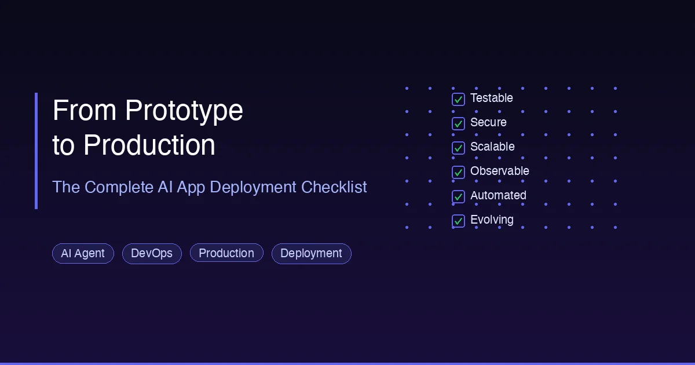

+++
date = '2026-03-09T18:00:00+08:00'
draft = false
title = '从原型到生产：AI 应用上线完整检查清单'
description = '一份完整的 AI 应用从原型到生产部署的检查清单，涵盖测试、安全、可扩展性、可观测性和自动化运维六大关卡。'
toc = true
tags = ['AI Agent', 'DevOps', 'Production', 'Deployment']
categories = ['AI Guides']
keywords = ['原型到生产', 'AI应用部署', '生产环境检查清单', 'AI应用上线', '部署AI应用', 'AI部署指南']

[[params.faqItems]]
question = "构建 AI 原型在整个工作量中占多大比例？"
answer = "构建 AI 原型通常只占生产级应用总工作量的约 10%。剩余 90% 包括：功能完善（25%）、测试（15%）、安全加固（10%）、性能优化（10%）、部署配置（10%）以及持续运维和监控（20%）。"

[[params.faqItems]]
question = "从 AI 原型到生产需要经过哪六道关卡？"
answer = "六道关卡分别是：(1) 从能用到可测试——添加单元测试、集成测试和端到端测试；(2) 从能用到安全——实施 OWASP 标准、输入验证和身份认证；(3) 从能用到可扩展——修复 N+1 查询、添加缓存和限流；(4) 从能用到可观测——建立日志、指标和链路追踪；(5) 从能用到自动化运维——部署 AI-SRE 和自动化事件响应；(6) 从能用到持续演进——建立 CI/CD 流水线和反馈闭环。"

[[params.faqItems]]
question = "Google 四大黄金信号是什么？"
answer = "Google SRE 手册中的四大黄金信号分别是：延迟（P50、P95、P99 响应时间）、流量（每秒请求数）、错误（5xx 错误率）和饱和度（CPU、内存、磁盘利用率）。这四个指标是所有生产环境应用（包括 AI 应用）监控的基础。"

[[params.faqItems]]
question = "v0 或 Claude Code 等 AI 工具能构建生产级应用吗？"
answer = "AI 工具擅长快速生成原型（在原型阶段自动化率可达 80% 以上），但生产就绪需要人工把关。AI 在后续阶段的效能显著下降：测试阶段 40-60%，安全加固 20-30%，性能优化 20-40%。关键是将 AI 作为加速器使用，同时以工程纪律来保证生产质量。"
+++



你用 20 分钟就让 AI 生成了一个应用。Demo 看起来很棒，利益相关者也印象深刻。

然后现实给了你一巴掌。

应用在 50 个并发用户下就崩了。安全扫描发现了 12 个漏洞。零测试、零日志、零告警。凌晨 2 点宕机，直到用户在 Twitter 上投诉才有人知道。

**构建原型只占整个工作量的 10%。剩下的 90% 才是区分 Demo 和产品的关键。**

本文为你提供一份结构化、可执行的检查清单来跨越这道鸿沟。基于斯坦福 CS146S 课程（第 8-9 周）关于现代软件开发与实际部署模式的内容，我们将逐一介绍每个 AI 生成应用上线前必须通过的六道关卡。

无论你使用的是 [Claude Code](/posts/ai/2026-02-28-claude-code-complete-guide/)、Cursor、v0 还是其他 AI 编程工具，这些关卡都普遍适用。

## 现实差距：原型 vs. 生产

### AI 原型工具能做什么，不能做什么

Vercel 的 v0、Bolt 以及各种 AI 编程助手都能在几分钟内生成令人印象深刻的原型。以下是它们擅长处理的部分：

- 生成响应式 UI 布局
- 基本的 CRUD 功能
- 标准的导航和路由
- 常见的前端交互模式

但以下方面它们普遍力不从心：

- 复杂的多步业务逻辑
- 性能优化（懒加载、代码拆分、缓存）
- 无障碍访问（a11y 合规）
- 与现有认证系统和遗留 API 的集成
- 生产级错误处理

### 没人提到的工作量分布

大多数开发者严重低估了原型阶段之后所需的工作量。以下是实际分布：

| 阶段 | 占总工作量 % | AI 自动化率 |
|------|-------------|------------|
| 原型 / Demo | 10% | 80%+ |
| 功能完善 | 25% | 50-70% |
| 测试覆盖 | 15% | 40-60% |
| 安全加固 | 10% | 20-30% |
| 性能优化 | 10% | 20-40% |
| 部署配置 | 10% | 30-50% |
| 运维与监控 | 20% | 30-50% |

规律很明显：**AI 在工作量最小的阶段最有效。** 越接近生产，AI 的贡献越低，而复杂度越高。

这不是对 AI 工具的批评，而是一次现实检验。理解这个分布能让你准确规划项目时间线，而不是以为 Demo 跑通了就"快完成了"。

## 从原型到生产的六道关卡

每个 AI 生成的应用都必须通过这六道关卡。跳过任何一道，你的生产部署就是一颗定时炸弹。

### 关卡一：从"能用"到可测试

AI 生成的代码几乎从不包含有意义的测试。即使有，通常也很表面——只检查函数是否存在，而不验证它在边界情况下的行为。

#### 你需要什么

**核心业务逻辑的单元测试**：

```python
# 差：AI 生成的测试，没有验证任何有意义的东西
def test_calculate_price():
    result = calculate_price(100)
    assert result is not None  # 这什么都没告诉我们

# 好：验证实际业务规则的测试
def test_calculate_price_with_discount():
    # 订单超过 $50 打八折
    assert calculate_price(100, discount_tier="gold") == 80.0

def test_calculate_price_rejects_negative():
    with pytest.raises(ValueError, match="Price cannot be negative"):
        calculate_price(-10)

def test_calculate_price_applies_tax():
    # 税费应在折扣后计算
    result = calculate_price(100, discount_tier="gold", tax_rate=0.1)
    assert result == 88.0  # (100 * 0.8) * 1.1
```

**模块交互的集成测试**：

```python
# 测试 API 层与服务层的正确交互
async def test_create_order_integration():
    # 准备：初始化测试数据库
    user = await create_test_user()
    product = await create_test_product(price=50.0)

    # 执行：调用实际的 API 端点
    response = await client.post("/api/orders", json={
        "user_id": user.id,
        "product_id": product.id,
        "quantity": 2
    })

    # 断言：检查整个链路是否正常工作
    assert response.status_code == 201
    order = response.json()
    assert order["total"] == 100.0
    assert order["status"] == "pending"

    # 验证副作用
    db_order = await get_order(order["id"])
    assert db_order is not None
    assert db_order.user_id == user.id
```

**使用 Playwright 等工具的端到端测试**：

```typescript
// 测试完整的用户流程
test('user can complete checkout', async ({ page }) => {
  await page.goto('/products');
  await page.click('[data-testid="add-to-cart-btn"]');
  await page.click('[data-testid="checkout-btn"]');
  await page.fill('#email', 'test@example.com');
  await page.fill('#card-number', '4242424242424242');
  await page.click('[data-testid="pay-btn"]');
  await expect(page.locator('.order-confirmation')).toBeVisible();
});
```

**CI 流水线强制执行测试门禁**：

```yaml
# .github/workflows/test.yml
name: Test Suite
on: [push, pull_request]
jobs:
  test:
    runs-on: ubuntu-latest
    steps:
      - uses: actions/checkout@v4
      - name: Run unit tests
        run: pytest tests/unit/ --cov=src --cov-fail-under=80
      - name: Run integration tests
        run: pytest tests/integration/
      - name: Run E2E tests
        run: npx playwright test
```

#### AI 能帮什么忙

AI 擅长从现有代码生成测试骨架。但**测试意图**——测什么、为什么测、边界条件是什么——必须由你来定义。用 AI 搭测试框架，然后逐一审查每个断言，确保它验证的是真实行为。

### 关卡二：从"能用"到安全

安全是 AI 生成代码最危险的地方。AI 工具的优化目标是"让它跑起来"，而不是"让它安全"。关于 AI 安全实践的深入探讨，请参阅 [2026 年 MCP 安全指南](/posts/ai/2026-03-10-mcp-security-2026/)。

#### AI 应用的 OWASP 检查清单

系统性地检查以下各项：

**输入验证与净化**

```python
# AI 经常生成这样的代码——非常危险
@app.post("/api/query")
async def query(request: Request):
    body = await request.json()
    result = db.execute(f"SELECT * FROM users WHERE name = '{body['name']}'")
    return result

# 带有正确验证的生产版本
from pydantic import BaseModel, validator

class QueryRequest(BaseModel):
    name: str

    @validator('name')
    def validate_name(cls, v):
        if len(v) > 100:
            raise ValueError('Name too long')
        # 过滤 SQL 注入尝试
        if any(char in v for char in [';', '--', "'", '"']):
            raise ValueError('Invalid characters in name')
        return v.strip()

@app.post("/api/query")
async def query(request: QueryRequest):
    result = db.execute(
        "SELECT * FROM users WHERE name = :name",
        {"name": request.name}
    )
    return result
```

**身份认证与授权**

- 验证每个 API 端点都有认证检查
- 实施基于角色的访问控制（RBAC）
- 使用安全的会话管理（HttpOnly Cookie、短期令牌）
- 对登录端点添加限流

**敏感数据保护**

- 对静态数据和传输中的数据加密
- 绝不在日志中记录敏感信息（密码、令牌、PII）
- 使用环境变量存储密钥，绝不硬编码
- 实施密钥轮换机制

**依赖项安全**

```bash
# 扫描依赖项中的已知漏洞
npm audit
pip-audit
snyk test

# 保持依赖项更新
npm update
pip install --upgrade -r requirements.txt
```

#### 安全检查清单

| 检查项 | 工具 | 频率 |
|-------|------|------|
| SAST（静态分析） | Semgrep, SonarQube | 每个 PR |
| DAST（动态分析） | OWASP ZAP, Burp Suite | 每周 |
| 依赖扫描 | Snyk, npm audit | 每次构建 |
| 密钥检测 | TruffleHog, GitLeaks | 每次提交 |
| 容器扫描 | Trivy, Grype | 每次构建 |

### 关卡三：从"能用"到可扩展

原型代码通常一次只服务一个用户。生产环境意味着数百甚至数千个并发用户。以下是需要解决的关键问题。

#### 修复 N+1 查询问题

这是 AI 生成代码中最常见的性能问题：

```python
# N+1 问题：1 次查询获取订单 + N 次查询获取用户
orders = db.query(Order).all()
for order in orders:
    user = db.query(User).filter(User.id == order.user_id).first()
    order.user_name = user.name  # 每个订单触发一次查询

# 修复：预加载，只需 2 次查询
orders = db.query(Order).options(joinedload(Order.user)).all()
for order in orders:
    order.user_name = order.user.name  # 不再有额外查询
```

#### 实现缓存

```python
import redis
from functools import wraps

cache = redis.Redis(host='localhost', port=6379)

def cached(ttl=300):
    """将函数结果缓存到 Redis，有效期 `ttl` 秒。"""
    def decorator(func):
        @wraps(func)
        async def wrapper(*args, **kwargs):
            cache_key = f"{func.__name__}:{hash(str(args) + str(kwargs))}"
            cached_result = cache.get(cache_key)
            if cached_result:
                return json.loads(cached_result)
            result = await func(*args, **kwargs)
            cache.setex(cache_key, ttl, json.dumps(result))
            return result
        return wrapper
    return decorator

@cached(ttl=600)
async def get_product_catalog():
    """缓存 10 分钟，因为商品目录很少变化。"""
    return await db.query(Product).filter(Product.active == True).all()
```

#### 将耗时操作移入后台队列

```python
from celery import Celery

celery_app = Celery('tasks', broker='redis://localhost:6379')

# 不再在请求中同步发邮件
@app.post("/api/orders")
async def create_order(order: OrderCreate):
    db_order = await save_order(order)

    # 将邮件发送交给后台 Worker
    send_order_confirmation.delay(db_order.id, order.email)

    return {"order_id": db_order.id, "status": "created"}

@celery_app.task
def send_order_confirmation(order_id: str, email: str):
    """在后台 Worker 中运行，不阻塞 API。"""
    order = get_order(order_id)
    send_email(to=email, subject="Order Confirmed", body=render_template(order))
```

#### 添加限流

```python
from slowapi import Limiter
from slowapi.util import get_remote_address

limiter = Limiter(key_func=get_remote_address)

@app.post("/api/login")
@limiter.limit("5/minute")  # 防止暴力破解
async def login(request: Request, credentials: LoginRequest):
    return await authenticate(credentials)

@app.get("/api/data")
@limiter.limit("100/minute")  # 防止 API 滥用
async def get_data(request: Request):
    return await fetch_data()
```

#### 可扩展性检查清单

| 项目 | 关键问题 | 行动 |
|------|---------|------|
| 数据库 | 是否存在 N+1 查询？ | 用查询日志分析，添加预加载 |
| 缓存 | 热点数据是否缓存了？ | 添加 Redis/Memcached 层 |
| 异步 | 慢任务是否阻塞了请求？ | 移入 Celery/SQS/Bull 队列 |
| 限流 | 单个用户能否压垮系统？ | 添加用户级和全局限流 |
| 水平扩展 | 能否运行多个实例？ | 去除本地状态，使用共享会话 |
| 连接池 | 数据库连接是否受管理？ | 使用有上限的连接池 |

### 关卡四：从"能用"到可观测

应用一旦上线，你需要随时掌握它的运行状况。可观测性有三大支柱：日志、指标和链路追踪。它们与 [Google SRE 四大黄金信号](https://sre.google/sre-book/introduction/)一脉相承。

#### 结构化日志

```python
import structlog

logger = structlog.get_logger()

@app.post("/api/orders")
async def create_order(order: OrderCreate, user: User = Depends(get_current_user)):
    logger.info(
        "order_created",
        user_id=user.id,
        order_total=order.total,
        product_count=len(order.items),
        payment_method=order.payment_method
    )

    try:
        result = await process_order(order)
        logger.info("order_processed", order_id=result.id, duration_ms=result.processing_time)
        return result
    except PaymentError as e:
        logger.error(
            "payment_failed",
            user_id=user.id,
            error_code=e.code,
            error_message=str(e)
        )
        raise HTTPException(status_code=402, detail="Payment failed")
```

使用 JSON 格式输出日志，便于在 ELK Stack、Loki 或 CloudWatch 中检索：

```json
{
  "event": "order_created",
  "user_id": "usr_123",
  "order_total": 99.50,
  "product_count": 3,
  "timestamp": "2026-03-13T10:30:00Z",
  "level": "info"
}
```

#### 四大黄金信号

这是每个生产系统都必须追踪的指标：

| 信号 | 衡量什么 | 关键指标 | 告警阈值 |
|------|---------|---------|---------|
| **延迟** | 响应时间 | P50、P95、P99 响应时间 | P95 > 500ms |
| **流量** | 请求量 | 每秒请求数（RPS） | 突然 3 倍激增或 50% 骤降 |
| **错误** | 失败率 | 5xx 错误百分比 | > 1% 的请求 |
| **饱和度** | 资源使用率 | CPU、内存、磁盘、连接数 | > 80% 利用率 |

#### 分布式链路追踪

当应用跨越多个服务时，链路追踪能展示一个请求的完整路径：

```python
from opentelemetry import trace
from opentelemetry.sdk.trace import TracerProvider
from opentelemetry.exporter.otlp.proto.grpc.trace_exporter import OTLPSpanExporter

# 初始化追踪
provider = TracerProvider()
provider.add_span_processor(BatchSpanProcessor(OTLPSpanExporter()))
trace.set_tracer_provider(provider)
tracer = trace.get_tracer(__name__)

@app.post("/api/orders")
async def create_order(order: OrderCreate):
    with tracer.start_as_current_span("create_order") as span:
        span.set_attribute("order.total", order.total)

        with tracer.start_as_current_span("validate_inventory"):
            await check_inventory(order.items)

        with tracer.start_as_current_span("process_payment"):
            payment = await charge_card(order.payment)

        with tracer.start_as_current_span("save_order"):
            result = await save_to_database(order, payment)

        return result
```

有了链路追踪，当一个请求耗时 3 秒时，你能清楚看到时间花在了哪里——是数据库？支付 API？还是库存检查？

#### 可观测性技术栈推荐

| 组件 | 开源方案 | 托管服务 |
|------|---------|---------|
| 日志 | Loki + Grafana | Datadog, CloudWatch |
| 指标 | Prometheus + Grafana | Datadog, New Relic |
| 追踪 | Jaeger, Zipkin | Datadog, Honeycomb |
| 一体化 | OpenTelemetry | Datadog, Dynatrace |

### 关卡五：从"能用"到自动化运维

传统的事件响应是手动且缓慢的。AI 驱动的运维（AI-SRE）可以大幅缩短平均恢复时间（MTTR）。

#### 传统 vs. AI 增强的事件响应

**传统流程：**

```
告警触发 → 值班工程师被叫醒 → 手动排查
→ 根因分析 → 手动修复 → 编写事后复盘
```

**AI 增强流程：**

```
告警触发 → AI Agent 自动收集上下文
         → AI 分析可能的根因
         → AI 推荐修复方案并给出置信度
         → 人工审批（或 AI 自动执行低风险修复）
         → AI 生成复盘报告草稿
```

#### AI 运维的优势场景

| 场景 | AI 做什么 |
|------|----------|
| Kubernetes Pod 反复崩溃 | 自动检查日志、资源配额、镜像状态、近期部署 |
| 数据库连接池耗尽 | 分析连接来源，识别泄漏模式 |
| API 延迟飙升 | 关联部署历史、流量模式、依赖服务状态 |
| 磁盘空间不足 | 识别大文件，建议清理策略 |
| 证书即将过期 | 提前预警，自动续期 |
| 内存泄漏检测 | 趋势分析，定位问题服务 |

#### 从 SRE 到 AI-SRE

运维角色的演进：

- **手动调试**变为**引导 AI 调查**——你指方向，AI 收集数据
- **编写 Runbook**变为**训练 AI Agent**——将运维知识编码到 Agent 上下文中（最佳实践请参阅[上下文工程指南](/posts/ai/2026-03-10-context-engineering-guide/)）
- **被动救火**变为**主动预防**——AI 持续分析指标，在影响用户之前预测问题

[Resolve AI](https://resolve.ai/)、PagerDuty AIOps 和 Datadog Watchdog 等工具正在引领这一变革。关键是从低风险的自动化操作开始（重启 Pod、扩容副本），随着信任的建立逐步扩大 AI 的权限。

### 关卡六：从"能用"到持续演进

生产系统永远不会"完工"。它需要持续迭代：新功能、Bug 修复、性能改进、安全补丁。

#### CI/CD 流水线要求

```yaml
# 完整的 CI/CD 流水线
name: Deploy
on:
  push:
    branches: [main]

jobs:
  test:
    runs-on: ubuntu-latest
    steps:
      - uses: actions/checkout@v4
      - run: npm ci
      - run: npm test -- --coverage
      - run: npm run lint
      - run: npx playwright test

  security:
    runs-on: ubuntu-latest
    steps:
      - uses: actions/checkout@v4
      - run: npm audit --audit-level=high
      - run: npx semgrep --config=auto

  deploy:
    needs: [test, security]
    runs-on: ubuntu-latest
    steps:
      - name: Deploy to staging
        run: deploy --env staging
      - name: Run smoke tests
        run: npm run test:smoke -- --target=staging
      - name: Deploy to production (canary)
        run: deploy --env production --canary 10%
      - name: Monitor canary metrics
        run: check-metrics --duration 15m --threshold error_rate<0.01
      - name: Full rollout
        run: deploy --env production --canary 100%
```

#### 反馈闭环架构

生产数据应该回馈到你的开发流程中：

1. **错误追踪**（Sentry、Bugsnag）捕获真实用户的错误
2. **使用分析**揭示哪些功能被真正使用
3. **性能监控**识别真实负载下的瓶颈
4. **用户反馈**通过应用内调查和工单收集
5. **AI Agent 报告**每周汇总运维模式

这个反馈闭环正是 [Vibe Coding](/posts/ai/2026-02-28-vibe-coding-explained/) 与工程纪律的交汇点。你可以用 AI 快速原型化修复和新功能，但方向来自生产数据，而非臆测。

## AI 应用开发完整生命周期

将六道关卡串联起来，以下是从想法到生产再到持续运营的完整生命周期：

```
1. 需求分析
   ├── 编写清晰的规格说明 / PRD
   ├── 定义验收标准
   └── 明确安全和性能需求

2. 架构设计
   ├── 选择技术栈（考虑 AI 工具支持度）
   ├── 设计系统架构
   ├── 建立项目上下文（CLAUDE.md、设计文档）
   └── 配置工具集成（MCP 服务器、API）

3. 快速原型 [AI：80%+ 自动化]
   ├── 用 AI 生成原型
   ├── 验证核心功能
   └── 收集反馈，完善规格

4. 功能开发 [AI：50-70% 自动化]
   ├── 将需求拆分为子任务
   ├── 分配给 AI Agent 执行
   ├── 检查点审查 + 人工完善
   └── 代码评审

5. 质量保证 [AI：40-60% 自动化]
   ├── 单元 + 集成 + 端到端测试覆盖
   ├── 安全扫描（SAST + DAST）
   ├── 性能基准测试
   └── 无障碍审计

6. 部署 [主要靠工具链自动化]
   ├── CI/CD 流水线搭建
   ├── 金丝雀 / 蓝绿部署
   ├── 监控与告警配置
   └── 回滚方案

7. 运维 [AI：30-50% 自动化]
   ├── 可观测性（日志 + 指标 + 追踪）
   ├── 自动化事件响应
   ├── 定期安全审计
   └── 持续优化

8. 迭代 [回到第 1 步]
   ├── 从生产反馈中提取新需求
   └── 更新上下文和文档
```

## 生产就绪检查清单

每次生产部署前都用这份清单检查一遍。打印出来贴在显示器旁边，或添加为 PR 模板。

### 测试

- [ ] 核心业务逻辑的单元测试覆盖率超过 80%
- [ ] 所有关键 API 端点都有集成测试
- [ ] 主要用户流程都有端到端测试
- [ ] 测试在 CI 中自动运行，每次推送都执行
- [ ] 负载测试验证系统能处理预期流量

### 安全

- [ ] 所有输入都经过验证和净化
- [ ] 每个受保护端点都有身份认证
- [ ] 授权检查（RBAC）已实施
- [ ] 密钥存储在环境变量或 Vault 中
- [ ] 依赖项已扫描漏洞
- [ ] OWASP Top 10 检查清单已审查
- [ ] 全站强制 HTTPS

### 可扩展性

- [ ] 无 N+1 数据库查询问题
- [ ] 热点数据有缓存层
- [ ] 耗时操作异步执行
- [ ] 所有公开端点都有限流
- [ ] 应用支持水平扩展
- [ ] 数据库连接池已配置

### 可观测性

- [ ] 结构化日志，日志级别适当
- [ ] 四大黄金信号已监控（延迟、流量、错误、饱和度）
- [ ] 多服务流程有分布式链路追踪
- [ ] 告警规则配置了合适的阈值
- [ ] 有实时系统健康仪表板

### 部署

- [ ] CI/CD 流水线包含自动测试和安全扫描
- [ ] 金丝雀或蓝绿部署策略
- [ ] 回滚流程已文档化并经过测试
- [ ] 健康检查端点已实现
- [ ] 优雅停机处理

### 运维

- [ ] 事件响应 Runbook 已创建
- [ ] 值班轮换制度已建立
- [ ] 备份和灾难恢复方案已测试
- [ ] AI-SRE 工具已配置用于自动分类
- [ ] 事后复盘流程已定义

## 核心要点

1. **原型只占 10% 的工作量。** 据此规划你的时间线。如果原型花了 1 天，那就准备好再花 9 天进行工程化工作。

2. **AI 的效能随复杂度增加而递减。** 在原型和测试生成阶段大量使用 AI，但在安全、架构和运维决策上依靠人工判断。

3. **六道关卡是顺序的，但不是一次性的。** 每个新功能上线前都应该通过全部六道关卡。

4. **可观测性不是可选项。** 如果你看不到应用在生产环境中的运行状态，出问题时你也修不了。

5. **尽一切可能实现自动化。** 从 CI/CD 流水线到事件响应，自动化能减少人为错误和响应时间。

"在我机器上能跑"和"稳定服务数千用户"之间的差距，正是工程纪律最重要的地方。AI 工具是强大的加速器，但它们无法替代对测试、安全、可扩展性和运维的深思熟虑。

用好这份检查清单。通过全部六道关卡。自信上线。

## 相关阅读

- [Claude Code 完整指南](/posts/ai/2026-02-28-claude-code-complete-guide/) — 搭建面向生产工作流的 AI 开发环境
- [2026 年 MCP 安全指南](/posts/ai/2026-03-10-mcp-security-2026/) — 深入了解 AI 工具集成的安全实践
- [Vibe Coding 详解](/posts/ai/2026-02-28-vibe-coding-explained/) — 理解 AI 辅助开发的方法论
- [AI 开发环境搭建](/posts/ai/2026-03-10-ai-dev-environment-setup/) — 配置面向生产级 AI 开发的工具
- [上下文工程指南](/posts/ai/2026-03-10-context-engineering-guide/) — 掌握为 AI Agent 提供上下文的技巧
- [Google SRE Book](https://sre.google/sre-book/introduction/) — 站点可靠性工程的奠基之作
- [OWASP Top 10](https://owasp.org/www-project-top-ten/) — Web 应用安全风险的行业标准
