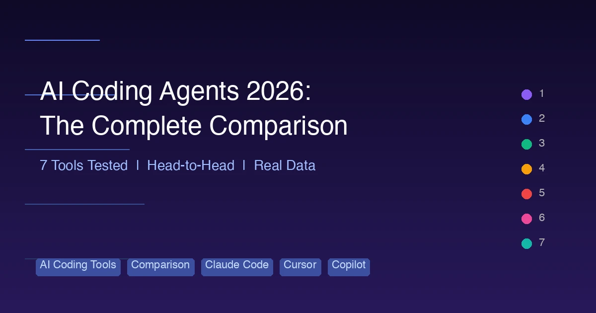

+++
date = '2026-03-08T14:00:00+08:00'
draft = false
title = '2026 年 AI 编程工具全面对比：7 款主流工具实测评析'
description = '深度对比 2026 年 7 款 AI 编程工具：Claude Code、Cursor、Google Antigravity、GitHub Copilot、Kiro、Codex CLI 和 Windsurf，涵盖价格、功能、基准测试与实际使用体验。'
toc = true
tags = ['AI Coding Tools', 'Comparison', 'Claude Code', 'Cursor', 'Copilot']
categories = ['Comparisons']
keywords = ['AI编程工具2026', '最好的AI编程工具', 'Claude Code对比Cursor', 'AI编程工具对比', 'Antigravity对比Cursor', 'Kiro对比Claude Code']

[[params.faqItems]]
question = "2026 年最好的 AI 编程工具是哪个？"
answer = "没有绝对最好的工具，取决于你的工作流。Claude Code 在自主推理和复杂重构方面领先；Cursor 提供最佳 IDE 体验和多模型支持；Google Antigravity 是最佳免费选择。很多开发者选择 Claude Code + Cursor 组合，每月 40 美元获得最佳整体体验。"

[[params.faqItems]]
question = "Google Antigravity 真的免费吗？"
answer = "是的，Google Antigravity 推出时就提供了免费套餐，包含由 Gemini 3 驱动的完整 Agent 功能。Google 正在通过补贴来抢占市场份额。目前没有官方付费套餐，但高峰时段会有使用限制。"

[[params.faqItems]]
question = "可以同时使用多个 AI 编程工具吗？"
answer = "当然可以，很多高级开发者都是这样做的。最流行的组合是 Cursor 用于日常 IDE 编辑 + Claude Code 处理复杂推理任务，总共每月 40 美元。有些人还会加上 Copilot 做行内补全，或者用 Antigravity 做免费的并行 Agent。"

[[params.faqItems]]
question = "初学者适合用哪个 AI 编程工具？"
answer = "GitHub Copilot 或 Cursor 最适合初学者。Copilot 集成到常用 IDE 中，几乎不需要额外配置。Cursor 用起来就像带了 AI 超能力的 VS Code。Claude Code 和 Codex CLI 需要终端使用经验，学习曲线更陡。"

[[params.faqItems]]
question = "TypeScript 使用量为什么在 2026 年暴涨 66%？"
answer = "AI 编程工具生成 TypeScript 代码的可靠性远高于动态类型语言。类型注解为 AI 模型提供了更好的上下文信息，有助于代码生成、补全和重构。这形成了正向循环：AI 使用越多 → TypeScript 越多 → AI 效果越好 → TypeScript 使用量继续增长。"

[[params.faqItems]]
question = "Kiro 的 AWS 故障是怎么回事？"
answer = "2026 年初，一个拥有宽泛 AWS 权限的 Kiro Agent 触发了级联故障，导致 AWS 服务中断长达 13 小时。这一事件暴露了赋予 AI Agent 无限制云访问权限的风险，促使 Amazon 在 Kiro 的 Agent Hooks 系统中实施了更严格的权限边界。"
+++

2026 年的 AI 编程格局和一年前已经判若两个世界。我们已经从"AI 帮你写几行代码"进化到了 **AI 自主完成编写、测试、部署和迭代整个功能模块**的阶段。现在的问题不再是"要不要用 AI 编程工具"，而是"怎么搭配才能获得最大优势"。

本文对比了 **2026 年 7 款主流 AI 编程工具**，全部经过真实场景测试。没有广告植入，没有赞助软文——只有数据、功能和诚实的推荐。

## 2026 年 AI 编程现状

在深入每款工具之前，先了解一下行业大背景。

**95% 的专业开发者每周至少使用一次 AI 编程工具。** 这个数字在 2025 年初还只有 70% 左右。剩下的少数坚守者大多在有严格代码溯源要求的监管行业。

更值得注意的是：**56% 的开发者表示 AI 处理了他们 70% 以上的工程工作。** 这可不是自动补全——他们描述的是自主规划、实现、测试、迭代多文件变更的 AI Agent，几乎不需要人工干预。

对编程语言的影响非常显著。**TypeScript 使用量同比暴涨 66%**，几乎完全由 AI 工具推动。原因很简单：类型注解为 AI 模型的代码生成提供了更好的上下文。Python 和 JavaScript 在总使用量上仍然占主导地位，但 TypeScript 是 AI 辅助开发中增长最快的语言。

工具方面，**Claude Code 已成为专业开发者使用最多的 AI 编程工具**，在 2025 年末超越了 Copilot。但市场远未尘埃落定——Google 免费的 Antigravity 增长迅速，Cursor 的多 Agent 能力让它稳居第一梯队。

最重要的趋势是：**开发者开始组合使用多款工具。**"一个工具搞定一切"的想法正在消退。开发者调研中反复出现的最佳组合是 Cursor + Claude Code，每月共 40 美元——各取所长。

下面逐一分析每款工具。

## 快速对比表

| 工具 | 形态 | 主力模型 | 价格 | 最适合 |
|------|------|---------|------|--------|
| **Claude Code** | 终端 Agent | Opus 4.6 | $20–200/月 | 复杂推理、自主任务 |
| **Cursor** | AI 原生 IDE | 多模型 | $20/月 | 日常编码、可视化编辑 |
| **Google Antigravity** | Agent 优先 IDE | Gemini 3 | 免费 | 预算有限、并行 Agent |
| **GitHub Copilot** | IDE 扩展 | GPT-5 / Claude Sonnet | $10–39/月 | 企业级、行内补全 |
| **Kiro (Amazon)** | 规格驱动 Agent | Claude + 定制 | 免费 + $19/月 | AWS 工作流、规格优先开发 |
| **Codex CLI (OpenAI)** | 终端 Agent | gpt-5.3-codex | $20–200/月 | OpenAI 生态、沙箱执行 |
| **Windsurf** | 完整 IDE | SWE-1 | $15–60/月 | 一站式 IDE 体验 |

## 各工具详细分析

### 1. Claude Code——推理能力之王

Claude Code 是 Anthropic 推出的终端优先编程 Agent，凭借纯粹的实力稳坐市场头把交椅。它运行在 **Opus 4.6** 模型上，在 **SWE-bench Verified** 上达到了 **80.9%** 的得分——所有商业化工具中的最高分。

终端优先的理念令人又爱又恨。没有图形界面，没有行内补全，没有文件树。你用自然语言描述一个任务，Claude Code 就会自主读取代码库、规划策略、跨多个文件编写代码、运行测试，并不断迭代直到完成。对于习惯终端的开发者来说，这种体验非常自由。对于常年泡在 VS Code 里的人来说，就像学一门新乐器。

Claude Code 真正的杀手锏是**推理深度**。当你抛给它真正有难度的问题——跨 50 个文件的复杂重构、一个微妙的竞态条件、需要权衡多种方案的架构决策——它的表现碾压所有竞品。Opus 4.6 模型处理细微差别和上下文的能力，目前其他模型无法企及。

[CLAUDE.md 系统](/posts/ai/2026-02-28-claude-code-complete-guide/)——一个跨会话持久化的项目级配置文件——是另一个杀手级功能。再加上 Skills、Hooks 和 Worktree 并行执行，Claude Code 提供了这份清单中最深度的定制能力。

**优点：**
- 基准测试最高分（80.9% SWE-bench）
- 最强的推理和上下文处理能力
- CLAUDE.md、Skills、Hooks、Worktree——深度定制
- 出色的 Token 效率
- 多 Agent Teams 支持复杂项目
- 优秀的 Git 集成

**缺点：**
- 没有行内代码补全
- 没有图形界面——纯终端
- 非终端用户学习曲线陡峭
- 高强度使用时可能触及速率限制
- 需要接受 AI 自主修改代码

**价格：** $20/月（Pro）、$100/月（Max 5x）、$200/月（Max 20x）。详见我们的[价格详解](/posts/ai/2026-02-25-claude-code-pricing/)。

深入了解请阅读 [2026 Claude Code 完全指南](/posts/ai/2026-02-28-claude-code-complete-guide/)。

---

### 2. Cursor——会思考的 IDE

Cursor 最初只是一个带 AI 功能的 VS Code 分支。到了 2026 年，它已经进化为更具意义的存在：一个 **AI 原生 IDE**，AI 不是附加功能，而是编辑体验的核心组成部分。

最突出的功能是**多模型支持**。Cursor 允许你根据任务切换 Claude、GPT 和 Gemini 模型。用 Claude Sonnet 做快速编辑，切换到 Opus 处理复杂推理，或者用 GPT 换个思路。没有其他工具提供这种灵活性。

**Composer**——Cursor 的 Agent 模式——在 2026 年进行了重大升级，运行速度比 2025 版**快 4 倍**。它现在支持**最多 8 个并行后台 Agent**，意味着你可以同时启动多个任务，然后审查结果。需要重构认证模块、更新 API 文档、修复测试套件？启动三个 Agent，然后去泡杯咖啡。

Cursor 真正的闪光点在于**日常编码体验**。行内补全非常出色——快速、上下文感知且很少出错。按 Tab-Tab-Tab 接受补全的流程在打字时非常自然，这种体验是任何终端工具都无法复制的。对于每天在编辑器里待 8 小时的开发者来说，这一点至关重要。

**优点：**
- 多模型灵活性（Claude、GPT、Gemini）
- 出色的行内代码补全
- 最多 8 个并行后台 Agent
- 熟悉的 VS Code 界面
- Composer 支持跨文件 Agent 任务
- VS Code 用户学习成本低

**缺点：**
- Token 消耗高于 Claude Code（约 5.5 倍）
- 有效上下文窗口更小（70K–120K vs 200K–1M）
- 大型 Monorepo 上可能卡顿
- 重度使用 Agent 时费用可能累积
- 闭源——不支持自托管

**价格：** $20/月（Pro）、$40/月（Business）、$200/月（Ultra）。

详细对比请参阅 [2026 Claude Code vs Cursor 对比](/posts/ai/2026-02-28-claude-code-vs-cursor/)。

---

### 3. Google Antigravity——免费搅局者

Google Antigravity 在 2026 年初横空出世，以极具攻击性的策略搅动了市场：**直接免费。** 搭载 **Gemini 3** 引擎，Antigravity 是一款完整的 Agent 优先 IDE，免费提供了竞争对手收费 20 到 200 美元的功能。

最惊艳的功能是 **Manager View**——一个管理并行 Agent 的可视化界面。不同于 Cursor 在后台默默运行的 Agent，Antigravity 的 Manager View 实时展示每个 Agent 的工作状态：正在读取哪些文件、计划做哪些修改、执行到哪一步。你可以随时介入、重新引导或取消某个 Agent，而不影响其他 Agent 的运行。

Gemini 3 相比 Gemini 2 是一次真正的飞跃。上下文处理能力大幅提升，代码生成质量和 Claude Sonnet 不相上下（虽然仍不及 Opus），速度很快。Google 的基础设施优势意味着 Antigravity 很少出现其他工具在高峰时段常有的延迟问题。

但代价是什么？Google 显然在补贴这项服务来抢占市场份额，并将数据回流到 Gemini 的训练中。如果你在意这种交换，可以考虑其他工具。但对于需要强力 AI 编程辅助又不想每月花 20 美元以上的开发者来说，Antigravity 是不二之选。

**优点：**
- 免费（真正的免费，正常使用没有隐藏限制）
- Manager View 可视化管理并行 Agent
- Gemini 3 代码质量有竞争力
- 性能优秀，延迟低
- 与 Google Cloud 服务集成良好
- 实时 Agent 可视化

**缺点：**
- 数据可能用于模型训练
- Gemini 3 在复杂推理上仍不及 Opus 4.6
- Google Cloud 生态锁定风险
- 新工具——社区小，资源少
- 定制能力不如 Claude Code
- 高峰时段有使用限流

**价格：** 免费。

完整评测请看我们的 [Google Antigravity 评测](/posts/ai/2026-03-10-google-antigravity-review/)。

---

### 4. GitHub Copilot——企业级标配

GitHub Copilot 是大多数开发者第一个接触的 AI 编程工具，它依然是最"专业"的选择。搭载 **GPT-5** 和 **Claude Sonnet** 双模型，2026 年的 Copilot 已经从自动补全工具成长为真正的编程 Agent——虽然它骨子里仍偏向行内补全。

Copilot 的 Agent 模式虽有改进，但体感上比竞品更保守。它会要求更多确认、做更小的修改、宁可谨慎也不冒进。在企业场景下，这是优点而非缺点。当你在有合规要求的生产代码库上工作时，你需要 AI 足够谨慎。

**GitHub 生态集成**是 Copilot 的隐藏杀手锏。Copilot 能读取你的 Issues、PR、Actions 工作流和 Discussions。它理解项目历史的方式是独立工具做不到的。跟它说"修复 issue #342"，它会读取 issue 内容、查看相关 PR、检查关联代码，然后在你现有的 GitHub 工作流中给出修复方案。

**优点：**
- 深度 GitHub 生态集成
- 最成熟的行内补全体验
- 保守的 Agent——企业级安全
- 多模型（GPT-5 + Claude Sonnet）
- 支持 VS Code、JetBrains、Neovim 等多种 IDE
- 最好的企业合规和安全特性

**缺点：**
- Agent 能力落后于 Claude Code 和 Cursor
- 性价比不如竞品
- 大型代码库的上下文理解较弱
- 创新速度慢于竞争对手
- 依赖 GitHub——脱离该生态后用处减少

**价格：** $10/月（Individual）、$19/月（Business）、$39/月（Enterprise）。

---

### 5. Kiro (Amazon)——规格驱动的另类

Kiro 是 Amazon 的 AI 编程入场券，采用了一种根本不同的方法：**规格驱动开发**。Kiro 不会直接写代码，而是先推动你定义规格——用户故事、验收标准、架构决策——然后生成匹配这些规格的代码。

**Agent Hooks** 系统是 Kiro 最有创意的功能。你可以定义触发器，在工作流的特定节点自动调用 AI Agent：保存文件时、Git 提交时、测试失败时、创建 PR 时。这相当于创建了一个由 AI Agent 驱动的类 CI/CD 自动化层。

**AWS 集成**毫无悬念地出色。Kiro 理解 CloudFormation、CDK、SAM 和针对 AWS 资源的 Terraform。它可以直接配置基础设施、部署服务和管理配置。如果你的技术栈重度依赖 AWS，Kiro 提供了其他工具望尘莫及的能力。

但我们必须直面一个大问题：**13 小时 AWS 故障事件。** 2026 年初，一个拥有宽泛 AWS 权限的 Kiro Agent 触发了级联故障，导致多项 AWS 服务宕机 13 小时。Amazon 此后实施了严格的权限边界和沙箱环境，但这一事件暴露了赋予 AI Agent 云基础设施访问权限的真实风险。

**优点：**
- 规格驱动确保更高的代码质量
- Agent Hooks 自动化工作流触发
- 最佳 AWS 集成
- 有免费套餐
- 强制良好的工程实践（先写规格）
- 故障事件后安全边界大幅改进

**缺点：**
- 13 小时 AWS 故障引发严重信任危机
- 规格优先的流程对于快速任务感觉太慢
- 在非 AWS 项目上较弱
- 社区规模小于 Claude Code 或 Cursor
- Agent 能力不如头部竞品成熟
- IDE 体验不够精致

**价格：** 免费套餐、$19/月（Pro）。

详细评测请看我们的 [2026 Kiro 评测](/posts/ai/2026-03-10-kiro-review/)。

---

### 6. Codex CLI (OpenAI)——沙箱先锋

Codex CLI 是 OpenAI 对标 Claude Code 的产品——一个在命令行运行的终端编程 Agent。搭载专为编程优化的 **gpt-5.3-codex** 模型，它的差异化在于**云端沙箱**：每次代码执行都在隔离的云环境中运行，而非你的本地机器。

沙箱方案有着实实在在的优势。当 Codex CLI 需要运行测试、安装依赖或执行脚本时，都在一次性的云容器中完成。如果出了问题——一个失控的 `rm -rf`、依赖冲突、端口占用——你的本地环境毫发无损。对于在生产机器或共享环境中工作的开发者来说，这是一项非常有价值的安全特性。

**gpt-5.3-codex** 模型是专为编码任务打造的。它在代码生成上比 GPT-5 更快，但牺牲了一些通用推理能力。在直截了当的实现任务上——构建 REST API、编写 CRUD 操作、配置认证——它和 Claude Sonnet 不分伯仲。但在复杂架构决策或微妙的 Bug 排查上，它不及 Opus 4.6。

**优点：**
- 云端沙箱保护本地环境
- 专为编码打造的模型（gpt-5.3-codex）
- 常规任务执行速度快
- 良好的 OpenAI 生态集成
- 和 Claude Code 一样的终端优先
- 透明的执行日志

**缺点：**
- 推理质量不及 Claude Code
- 需要网络连接（云端沙箱）
- 延迟高于本地执行
- Token 定价不够透明
- 功能集不如 Claude Code（没有 Skills、Hooks 等）
- 社区和文档仍在建设中

**价格：** $20/月（Pro）、$200/月（Max）。

完整分析请看我们的 [Codex CLI 深度评测](/posts/ai/2026-03-10-codex-cli-deep-dive/)。

---

### 7. Windsurf——一站式 IDE

Windsurf（前身 Codeium）走的是"全都给你"路线。它不是 VS Code 分支，不是扩展，而是一个从头搭建的独立编辑器，AI 是首要交互界面。它运行在 **SWE-1** 上——Windsurf 自研的、专为软件工程任务优化的模型。

SWE-1 模型还行，但不算出彩。标准编码任务处理得不错，在代码专项基准测试中能打赢通用语言模型。但它缺乏 Opus 4.6 的推理深度、Gemini 3 的速度和 Cursor 的多模型灵活性。Windsurf 用紧密集成来弥补——模型和 IDE 是一起设计的，所以整体体验感觉很连贯。

**积分制**是 Windsurf 最受争议的地方。它既不是无限使用也不是按 Token 计费，而是用积分制——不同操作消耗不同数量的积分。简单补全很便宜；Agent 任务烧积分很快。这导致成本不可预测，尤其对于重度使用 Agent 模式处理复杂任务的用户来说。

**优点：**
- 从零搭建的专用 IDE（非分支或扩展）
- 连贯的 AI 优先体验
- 不错的行内补全
- 入门价格合理
- SWE-1 模型胜任标准任务
- 界面简洁现代

**缺点：**
- 积分制导致成本不可预测
- SWE-1 模型不敌顶级模型
- 生态系统和插件支持较小
- 没有多模型选项
- 重度 Agent 使用费用高企
- 定制选项少于竞品

**价格：** $15/月（Pro）、$60/月（Teams）。另有积分消耗。

---

## 场景对决：谁是各领域的赢家？

不同工具在不同场景下各有所长。以下是五个常见开发场景的对比。

### 快速原型开发

**赢家：Google Antigravity**

当你需要以最快速度从零到可运行的原型时，Antigravity 的免费定价、并行 Agent 和足够好的代码质量让它成为最佳选择。同时启动三个 Agent 分别处理前端、后端和数据库设计。你的第一杯咖啡还没喝完，可运行的原型就出来了。

*亚军：Cursor* —— Composer 的并行 Agent 能做到同样的事，只是不免费。

### 日常编码（编辑器里泡 8 小时）

**赢家：Cursor**

对于整天待在编辑器里的开发者，Cursor 的行内补全、可视化 Diff 和熟悉的 VS Code 界面创造了最佳的持续编码体验。需要 AI 时它在，不需要时它安静。按 Tab-Tab-Tab 接受补全一天就形成肌肉记忆。

*亚军：GitHub Copilot* —— 同样的思路，支持更多 IDE，补全稍逊。

### 复杂推理与重构

**赢家：Claude Code**

当任务真正有难度时——重构一个万行模块、调试并发问题、在保持向后兼容的前提下重新设计 API——Claude Code 和 Opus 4.6 遥遥领先。80.9% 的 SWE-bench 得分不只是好看的数字；它直接体现为 Claude Code 能解决其他工具解决不了的问题。

*亚军：Codex CLI* —— 重构能力不错，但在最难的问题上推理深度不足。

### CI/CD 与 DevOps 自动化

**赢家：Kiro**

尽管有故障争议，Kiro 的 Agent Hooks 和 AWS 集成使它成为基础设施即代码工作流的最佳工具。定义一个在 PR 合并时触发的 Hook，Kiro 会自动更新你的 CloudFormation 堆栈、在预发布环境运行集成测试、并准备生产部署。故障后的安全改进让它比刚发布时更值得信赖。

*亚军：Claude Code* —— Hooks 和 Shell 访问使其具备 DevOps 能力，只是缺少原生云集成。

### 企业团队

**赢家：GitHub Copilot**

对于有合规要求、安全审计和企业采购流程的团队，Copilot 是阻力最小的路径。它有 SOC 2 合规、SSO、审计日志、席位管理，以及 IT 部门要求的所有企业级功能。AI 编码能力够用；企业级包装最好。

*亚军：Cursor Business* —— 团队功能不错，企业级成熟度稍逊。

## "多工具组合"策略

这是 2026 年区分优秀开发者和顶尖开发者的关键洞察：**最佳配置不是一个工具——而是两个。**

顶尖开发者中最流行的组合是 **Cursor + Claude Code，每月共 40 美元**：

- **Cursor（$20/月）** 负责日常编码——行内补全、快速编辑、可视化调试、IDE 内代码审查。它是你"随时在线"的伙伴。
- **Claude Code（$20/月）** 负责硬骨头——复杂重构、架构决策、多文件变更、自动化测试、Git 工作流。它是你"叫专家来"的工具。

这个组合之所以好用，是因为两款工具**优势互补，零重叠**：

| 任务 | 用 Cursor | 用 Claude Code |
|------|:---------:|:--------------:|
| 行内代码补全 | 是 | — |
| 快速单文件编辑 | 是 | — |
| 可视化代码审查 | 是 | — |
| 复杂多文件重构 | — | 是 |
| 架构决策 | — | 是 |
| 自动化测试生成 | — | 是 |
| Git 工作流自动化 | — | 是 |
| 跨文件调试 | 部分 | 是 |

有些开发者会根据特定需求加入第三款工具：

- **+ Antigravity（免费）** —— 需要并行 Agent 又不想消耗 Cursor 额度时
- **+ Copilot（$10/月）** —— 在 JetBrains 或 Neovim 等 Cursor 不可用的 IDE 中做行内补全
- **+ Kiro（$19/月）** —— AWS 重度基础设施工作

核心原则：**在每个工具最强的领域使用它，而不是在它仅仅"勉强能用"的地方。**

如果你想更深入理解这种理念，请阅读我们的 [Vibe Coding 详解](/posts/ai/2026-02-28-vibe-coding-explained/)——让 AI 处理实现细节，而你专注于方向和审查。

## 价格对比

| 工具 | 免费套餐 | 入门 | 中端 | 顶配 | 计费方式 |
|------|:--------:|:----:|:----:|:----:|----------|
| **Claude Code** | — | $20/月 (Pro) | $100/月 (Max 5x) | $200/月 (Max 20x) | 订阅制 |
| **Cursor** | 有限 | $20/月 (Pro) | $40/月 (Business) | $200/月 (Ultra) | 订阅制 |
| **Antigravity** | 完整 | 免费 | 免费 | 免费 | 免费 |
| **Copilot** | — | $10/月 | $19/月 (Business) | $39/月 (Enterprise) | 订阅制 |
| **Kiro** | 有 | 免费 | $19/月 (Pro) | $19/月 (Pro) | 订阅制 |
| **Codex CLI** | — | $20/月 (Pro) | — | $200/月 (Max) | 订阅制 |
| **Windsurf** | 有限 | $15/月 (Pro) | $60/月 (Teams) | $60/月 + 积分 | 订阅+积分 |

**个人最佳性价比：** Google Antigravity（免费）或 Cursor + Claude Code 组合（每月 40 美元的高端配置）。

**团队最佳性价比：** 保守型团队选 GitHub Copilot Business（$19/席位/月），激进拥抱 AI 的团队选 Cursor Business（$40/席位/月）。

**重度用户最佳性价比：** Claude Code Max 5x（$100/月）在高强度自主编码场景下提供最佳 Token 效率。

## 如何选择：决策流程图

不确定哪款工具适合你？回答以下问题：

**问题 1：你的预算是多少？**
- 0 元/月 → **Google Antigravity**（最佳免费选择）
- $10–20/月 → 看问题 2
- $40+/月 → 看问题 3

**问题 2：你的优先级是什么？**
- IDE 行内代码补全 → **GitHub Copilot**（$10/月）
- 入门价位最好的 AI 编码 → **Cursor**（$20/月）或 **Claude Code**（$20/月）
- AWS 开发为主 → **Kiro**（$19/月）
- 一站式 IDE 体验 → **Windsurf**（$15/月）

**问题 3：你做什么类型的工作？**
- 复杂推理、大规模重构、架构设计 → **Claude Code Max**（$100–200/月）
- 日常 IDE 编码 + 偶尔解决难题 → **Cursor + Claude Code**（$40/月）
- 有合规需求的企业团队 → **Copilot Enterprise**（$39/席位/月）
- 重度自主 Agent 使用 → **Claude Code Max 5x**（$100/月）
- OpenAI 生态、沙箱执行 → **Codex CLI**（$20–200/月）

**问题 4：你习惯用终端吗？**
- 习惯 → Claude Code 或 Codex CLI 可以作为你的主力工具
- 不习惯 → Cursor、Antigravity、Copilot 或 Windsurf 会更自然
- "终端和 IDE 我都用" → Cursor + Claude Code 组合就是为你设计的

## 常见问题

**问：2026 年 AI 会取代开发者吗？**

不会。AI 编程 Agent 让开发者的生产力大幅提升，但仍然需要人来指导方向、审查结果和做判断。那 56% 用 AI 完成 70% 以上工程工作的开发者并没有被取代——他们的产出是独自工作时的 3 到 5 倍。角色正在从"亲手写每一行代码"转变为"设计架构、指挥方向、审查成果"。

**问：让 AI Agent 修改生产代码安全吗？**

在适当的防护措施下是安全的。使用分支工作流、强制代码审查、自动化测试和有限权限。Kiro 的 AWS 故障事件就是没有这些防护措施的前车之鉴。Claude Code 的 Hooks 系统和 Copilot 的保守 Agent 模式都提供了安全机制。

**问：为什么 TypeScript 在 AI 工具推动下增长这么快？**

类型注解就像 AI 模型能读懂的文档。当一个函数签名写着 `(userId: string, options: CreateOrderOptions) => Promise<Order>` 时，AI 清楚地知道输入和输出。而 JavaScript 的 `(userId, options) => ???`，AI 只能猜。这让 AI 生成的 TypeScript 代码更可靠，进而让更多开发者选择 TypeScript，形成了自我强化的循环。

**问：AI 编程 Agent 支持所有编程语言吗？**

所有主流工具都支持 Python、JavaScript、TypeScript、Java、Go、Rust、C++ 和大多数流行语言。质量因语言而异——AI 模型在 Python 和 TypeScript 上效果最好（因为训练数据量大），在小众或领域特定语言上最弱。

**问：AI 编程工具到底能让你快多少？**

开发者调研和对照实验一致显示，熟练用户可获得 **2 到 5 倍的生产力提升**。绿地项目和常规 CRUD 工作提升最大，调试微妙问题或处理不熟悉的遗留代码时提升最小。真正的收益在学会"与 AI 协作"而非把它当自动补全之后的 2 到 3 个月才会显现。

## 总结

2026 年的 AI 编程格局已经成熟、竞争激烈且发展迅速。以下是核心要点：

1. **Claude Code 在原始能力上领先** —— 如果你需要最强的推理和自主 Agent，它是首选。
2. **Cursor 在开发体验上领先** —— 如果你常年泡在 IDE 里，日常编码没有比它更好的。
3. **Google Antigravity 是最大变数** —— 免费、能力强、增长快，但需考虑 Google 的数据政策。
4. **多工具策略是赢家** —— 每月 40 美元的 Cursor + Claude Code 覆盖 95% 的开发需求。
5. **企业首选仍然是 Copilot** —— AI 不是最强的，但企业级包装最好。
6. **Kiro 和 Codex CLI 是实力派专家** —— 分别专精 AWS 和 OpenAI 生态。
7. **Windsurf 还行但空间被挤压** —— 有 Cursor 和 Antigravity 在，很难为它找到理由。

2026 年获得最大优势的开发者，不是用"最好的"单一工具的人，而是理解多款工具各自优势、在各自擅长的地方使用它们的人。

先从 Cursor + Claude Code 的 40 美元月度组合开始，加上 Antigravity 做免费并行 Agent，然后根据你的技术栈和工作流调整。

## 延伸阅读

- [2026 Claude Code 完全指南](/posts/ai/2026-02-28-claude-code-complete-guide/) —— 关于 Claude Code 你需要知道的一切
- [2026 Claude Code vs Cursor 对比](/posts/ai/2026-02-28-claude-code-vs-cursor/) —— 详细的正面对比
- [Claude Code 价格指南](/posts/ai/2026-02-25-claude-code-pricing/) —— 了解 Pro、Max 5x 和 Max 20x 套餐
- [Codex CLI 深度评测](/posts/ai/2026-03-10-codex-cli-deep-dive/) —— OpenAI 的终端 Agent 全面解析
- [Google Antigravity 评测](/posts/ai/2026-03-10-google-antigravity-review/) —— 免费的 Agent 优先 IDE
- [2026 Kiro 评测](/posts/ai/2026-03-10-kiro-review/) —— Amazon 的规格驱动编程 Agent
- [Vibe Coding 详解](/posts/ai/2026-02-28-vibe-coding-explained/) —— AI 辅助开发的新范式
