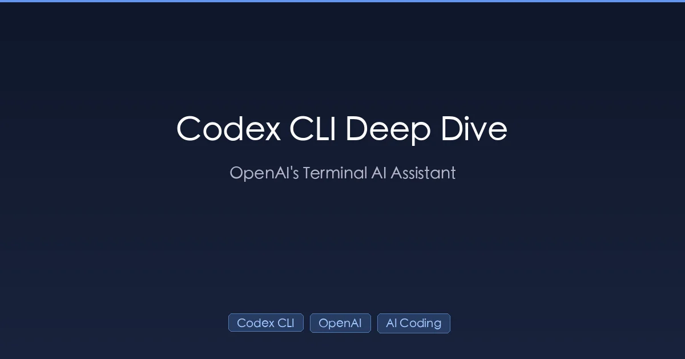

+++
date = '2026-03-07T14:00:00+08:00'
draft = false
title = 'Codex CLI 深度指南：安装配置、安全模型与 20+ 高手技巧'
description = 'Codex CLI 深度指南：默认模型 gpt-5.3-codex，需要 ChatGPT Plus/Pro（$20-200/月）或 API Key。详解 Auto/Read Only/Full Access 三种沙箱权限模式、MCP 集成与会话恢复，附 20+ 高手技巧和 Claude Code 对比。'
toc = true
tags = ['Codex CLI', 'OpenAI', 'AI Coding Tools', 'Terminal']
categories = ['AI Guides']
keywords = ['codex cli', 'codex cli 教程', 'openai codex cli', 'codex cli 配置', 'codex cli vs claude code', 'codex cli 指南 2026', 'codex cli 技巧', 'codex cli mcp', 'codex cli 价格', 'ai 终端编程工具']

[[params.faqItems]]
question = "Codex CLI 免费吗？"
answer = "Codex CLI 本身免费安装，但使用时需要 ChatGPT Plus/Pro 订阅（$20-$200/月）或者有余额的 OpenAI API Key。目前没有免费使用额度。"

[[params.faqItems]]
question = "Codex CLI 使用什么模型？"
answer = "Codex CLI 默认使用 gpt-5.3-codex，这是一个专门针对编程任务优化的模型。你也可以切换到 gpt-5 处理复杂推理任务，或者用 o4-mini 来节省成本。"

[[params.faqItems]]
question = "Codex CLI 能在我的电脑上执行命令吗？"
answer = "可以，但有安全机制保护。默认的 Auto 模式在操作系统级别的沙箱中运行命令，包含文件系统隔离和网络限制。你可以通过 Auto、Read Only 和 Full Access 三种权限模式来控制 Codex 的操作范围。"

[[params.faqItems]]
question = "Codex CLI 和 Claude Code 相比怎么样？"
answer = "两者都是终端里的 AI 编程代理。Codex CLI 在沙箱执行、会话恢复和 CI/CD 集成方面更强；Claude Code 在深度推理、复杂多步骤任务和交互式开发方面更出色。很多开发者两个都用。"

[[params.faqItems]]
question = "Codex CLI 支持 MCP 服务器吗？"
answer = "支持。Codex CLI 同时支持 STDIO 和 HTTP 协议的 MCP 服务器。可以通过 codex mcp add 命令或编辑 ~/.codex/config.toml 来添加。常用的集成包括 Context7、Playwright、PostgreSQL 和 Sentry。"
+++



市面上大多数 Codex CLI 教程只是把官方文档翻译一遍就完事了。这篇文章不一样——我们要深入聊聊**配置体系的设计哲学**、**安全模型的底层逻辑**、**真实开发场景的工作流**，以及**和 Claude Code 的客观对比**，这些才是你在其他文章里找不到的干货。

读完这篇文章，你会收获：
- 一份**可以直接拿去用的 Codex CLI 生产级配置**
- 对**沙箱安全模型和权限系统**的深入理解
- **20 多个实战验证过的高手技巧**
- 一份**客观的 Claude Code 对比分析**，帮你选对工具

## Codex CLI 到底是什么？

Codex CLI 不是"终端里的 ChatGPT"，而是 OpenAI 推出的**本地 AI 编程代理**，它能：

- **读取你的整个代码库**，理解项目结构
- **直接修改文件**——不是给建议，是真刀真枪地改
- **执行 Shell 命令**——跑测试、装依赖、管理 Git
- **通过 MCP 连接外部工具**——Figma、Sentry、数据库等
- **所有操作在操作系统级沙箱中运行**——你的系统安全无忧

你可以把它想象成一个坐在你旁边的资深开发者：你说需求，它写代码、跑测试、改 Bug。

### 架构概览

```
┌─────────────────────────────────────────┐
│           Codex CLI (TUI)               │
│  ┌─────────────┐  ┌──────────────────┐  │
│  │  Composer    │  │  Approval Engine │  │
│  │  (输入界面)   │  │  (权限审批)       │  │
│  └─────────────┘  └──────────────────┘  │
│  ┌─────────────────────────────────────┐ │
│  │         Sandbox (操作系统级)         │ │
│  │  - 文件系统隔离                      │ │
│  │  - 网络访问控制                      │ │
│  │  - 进程执行限制                      │ │
│  └─────────────────────────────────────┘ │
│  ┌─────────────┐  ┌──────────────────┐  │
│  │  MCP 客户端  │  │  Web 搜索        │  │
│  │  (工具扩展)   │  │  (实时/缓存)      │  │
│  └─────────────┘  └──────────────────┘  │
└─────────────────────────────────────────┘
              │
              ▼
     OpenAI API (gpt-5.3-codex)
```

核心设计理念：Codex CLI 采用**本地执行 + 云端推理**的混合架构。代码始终留在你的机器上，只有必要的上下文会发送到 OpenAI 的 API。这和 ChatGPT 里基于云端沙箱运行的 Codex Agent 完全不同。

## 安装与设置

### 安装 Codex CLI

```bash
# macOS / Linux
npm install -g @openai/codex

# 或通过 Homebrew 安装（macOS）
brew install openai-codex

# 验证安装
codex --version
```

### 认证方式：两种选择

大部分教程跳过了这一点，但选择哪种认证方式其实很重要：

**方式一：ChatGPT 订阅（默认）**

```bash
codex login
# 浏览器会打开进行 OAuth 认证
```

适合 ChatGPT Plus/Pro/Enterprise 用户——使用量包含在订阅里。

**方式二：API Key**

```bash
# 编辑 ~/.codex/config.toml
preferred_auth_method = "apikey"

# 或临时切换
codex --config preferred_auth_method="apikey"
```

适合需要精确控制成本的场景、CI/CD 流水线，或者没有 ChatGPT 订阅的用户。

**实用技巧**：两种方式可以随时切换。一个聪明的策略是：日常开发用 ChatGPT 订阅，额度用完了切到 API Key：

```bash
# 切换回 ChatGPT 认证
codex --config preferred_auth_method="chatgpt"
```

### API 定价

如果用 API 认证，了解一下成本：

| 模型 | 适用场景 | 说明 |
|------|---------|------|
| gpt-5.3-codex | 代码生成（默认） | 专门为编程优化 |
| gpt-5 | 复杂推理、代码审查 | 通用旗舰模型 |
| o4-mini | 简单任务、控制成本 | 轻量推理模型 |

> 最新价格请查看 [OpenAI API Pricing](https://openai.com/api/pricing/)。

## 配置体系深度解析

### 五层配置优先级

这是大多数教程完全忽略的——Codex CLI 不是只有一个配置文件，而是有一套**五层优先级体系**：

```
CLI 参数 & --config 覆盖           ← 最高优先级
       │
Profile 配置 (--profile)
       │
项目配置 (.codex/config.toml)
       │
用户配置 (~/.codex/config.toml)
       │
系统配置 (/etc/codex/config.toml)
       │
内置默认值                         ← 最低优先级
```

### 完整的用户配置

这是一份可以直接用的 `~/.codex/config.toml`，拿去作为起点：

```toml
# ~/.codex/config.toml

# 默认模型
model = "gpt-5.3-codex"

# 审批策略
approval_policy = "on-request"

# 沙箱模式
sandbox_mode = "workspace-write"

# Web 搜索
web_search = "live"    # "cached" | "live" | "disabled"

# 推理强度
model_reasoning_effort = "high"

# 交互风格
personality = "pragmatic"    # "friendly" | "pragmatic" | "none"

# 功能开关
[features]
shell_snapshot = true
undo = true
web_search = true

# 信任的项目（跳过信任确认）
[projects."/Users/me/work/my-project"]
trust_level = "trusted"
```

### Profile：比 Shell 别名更好的方案

与其维护一堆 Shell 别名，不如用 Codex 内置的 Profile 系统：

```toml
# ~/.codex/config.toml

# 默认配置（始终生效）
model = "gpt-5.3-codex"
model_reasoning_effort = "high"
web_search = "live"

# 代码审查 Profile
[profiles.review]
sandbox_mode = "read-only"
approval_policy = "never"

# 快速问答 Profile
[profiles.quick]
model = "o4-mini"
model_reasoning_effort = "medium"
web_search = "disabled"

# 全自动 Profile（谨慎使用）
[profiles.auto]
approval_policy = "on-request"
sandbox_mode = "workspace-write"
```

随时切换 Profile：

```bash
codex --profile review   # 只读模式做代码审查
codex --profile quick    # 快速省钱模式
codex                    # 默认高性能配置
```

Profile 比别名好在哪？**集中管理**。改一个文件就行，不用到处改 `.zshrc`。

### Shell 别名（如果你还是想用）

```bash
# 添加到 ~/.zshrc 或 ~/.bashrc

# 日常开发：高推理 + Web 搜索
alias cx='codex -m gpt-5.3-codex -c model_reasoning_effort="high" --search'

# 代码审查：只读，无需审批
alias cxr='codex -m gpt-5.3-codex --sandbox read-only --ask-for-approval never'

# 快速问答：轻量模型，省钱
alias cxq='codex -m o4-mini -c model_reasoning_effort="medium"'

# CI/CD 脚本模式：非交互
alias cxci='codex exec'
```

### 排查配置问题

当配置似乎没生效时，用 `/debug-config` 查看完整的加载链：

```
Config Layer 1: /etc/codex/config.toml (not found)
Config Layer 2: ~/.codex/config.toml (loaded)
Config Layer 3: /project/.codex/config.toml (loaded)
Config Layer 4: Profile "review" (active)
Config Layer 5: CLI overrides: model_reasoning_effort=high
```

## 安全模型：沙箱与权限

### 三种权限模式

| 权限 | Auto（默认） | Read Only | Full Access |
|------|------------|-----------|-------------|
| 读取文件 | 是 | 是 | 是 |
| 编辑文件 | 是 | 否 | 是 |
| 在工作区执行命令 | 是 | 否 | 是 |
| 访问工作区外的文件 | 需要审批 | 否 | 是 |
| 网络访问 | 需要审批 | 否 | 是 |

### 精细化权限控制

除了三种预设，还可以组合参数实现精确控制：

```bash
# 自动编辑，但不受信任的命令需审批
codex --sandbox workspace-write --ask-for-approval untrusted

# 只读，永不询问（纯分析模式）
codex --sandbox read-only --ask-for-approval never

# 全自动 + 沙箱保护（减少摩擦）
codex --full-auto

# 完全绕过一切保护（危险！仅限隔离环境）
codex --dangerously-bypass-approvals-and-sandbox
# 别名：--yolo（没错，OpenAI 真的这么命名的）
```

### --full-auto 和 --yolo 的区别

很多人搞混了这两个选项，区别其实很关键：

| 维度 | `--full-auto` | `--yolo` |
|------|--------------|----------|
| 沙箱 | **保留** | **完全关闭** |
| 审批 | 减少提示 | **全部关闭** |
| 网络 | 仍受沙箱限制 | **完全开放** |
| 使用场景 | 日常开发（少摩擦） | CI/CD 隔离容器 |
| 安全性 | 相对安全 | **危险** |

**结论**：`--full-auto` 适合日常开发减少打断。`--yolo` 是给 Docker 容器和 CI/CD 流水线用的。永远不要在你的主力机器上用 `--yolo`。

### 审批策略级别

```bash
# untrusted：只有不受信任的命令需要审批（默认）
codex -a untrusted

# on-failure：仅在命令执行失败时审批
codex -a on-failure

# on-request：仅在 Codex 主动请求时审批
codex -a on-request

# never：永不审批
codex -a never
```

## 全部 24 个斜杠命令详解

Codex CLI 有 24 个斜杠命令——比大多数教程介绍的多得多。这里按功能分组全部列出：

### 会话控制

| 命令 | 功能 | 使用时机 |
|------|------|---------|
| `/new` | 开始新会话 | 当前任务做完，开始新任务 |
| `/resume` | 恢复历史会话 | 回到之前未完成的工作 |
| `/fork` | 克隆当前会话 | 想尝试另一种方案但不丢失当前进度 |
| `/quit` / `/exit` | 退出 CLI | 收工了 |
| `/compact` | 压缩上下文 | 上下文窗口快用完了 |

**`/fork` 是最被低估的命令。** 想象你在用方案 A 实现一个功能，做到一半想试试方案 B。没有 `/fork`，你要么丢掉方案 A 的进度，要么重新开始。有了 `/fork`，直接分支出去——两种方案都保留。

### 模型与风格

| 命令 | 功能 | 使用时机 |
|------|------|---------|
| `/model` | 切换模型和推理级别 | 当前任务需要不同的算力或成本 |
| `/personality` | 改变交互风格 | 想要更友好或更直接的回复 |
| `/plan` | 进入规划模式 | 复杂任务，需要先制定策略再执行 |

**`/plan` 最佳实践**：对于像"重构整个认证模块"这样的大任务，一定先用 `/plan`。让 Codex 列出步骤，你审核后再执行。比直接让它冲上去安全得多。

### 权限与状态

| 命令 | 功能 |
|------|------|
| `/permissions` | 运行时切换 Auto/Read Only/Full Access |
| `/status` | 查看会话信息、Token 用量、账户详情 |
| `/statusline` | 自定义底部状态栏 |
| `/debug-config` | 输出完整的配置加载链 |

### 文件与工具

| 命令 | 功能 |
|------|------|
| `/mention` | 模糊搜索添加文件/目录到上下文 |
| `/diff` | 查看 Git 变更（包括未跟踪文件） |
| `/review` | 代码审查，支持分支比较 |
| `/mcp` | 列出已配置的 MCP 工具 |
| `/apps` | 浏览 ChatGPT 应用连接器 |
| `/ps` | 检查后台任务状态 |

### 其他

| 命令 | 功能 |
|------|------|
| `/init` | 为项目生成 AGENTS.md |
| `/feedback` | 向 OpenAI 发送诊断日志 |
| `/logout` | 清除本地凭证 |

## 会话恢复：再也不丢进度

光这一个功能就值得用 Codex CLI。关闭会话后可以随时回来，完整恢复上下文：

### 四种恢复方式

```bash
# 交互式选择器（推荐）
codex resume
# 显示最近的会话，选择后回车

# 恢复最近的会话
codex resume --last

# 恢复指定会话
codex resume <SESSION_ID>

# 显示所有目录的会话
codex resume --all
```

### 恢复后保留了什么

恢复会话时，所有内容都会回来：
- **完整对话历史**——你说了什么，Codex 回复了什么
- **执行计划**——Codex 制定的策略
- **审批记录**——之前批准过的操作
- **文件上下文**——对话中引用过的文件

你可以说"从上次中断的地方继续，但把第 3 步改一下"，Codex 完全理解上下文。

### 实际使用场景

**场景一：下班前保存进度**

```
你：重构认证模块，先分析一下现有结构
Codex：[分析文件，列出方案]
你：我得走了，明天继续
# 第二天：
$ codex resume --last
你：从第 2 步继续重构
```

**场景二：多任务并行**

```bash
# 任务 A：认证模块重构
codex    # 开始任务 A，做一会儿...
# Ctrl+C 退出

# 任务 B：修个 Bug
codex    # 开始任务 B，修完搞定

# 回到任务 A
codex resume   # 选择任务 A 的会话
```

这是 [Claude Code](/posts/ai/2026-01-14-claude-code-guide/) 原生不支持的——关闭 Claude Code 会话意味着丢失上下文。

## 模型切换与推理级别

### 默认模型

Codex CLI 默认使用 `gpt-5.3-codex`——OpenAI 专门为编程任务优化的模型，在代码基准测试上表现优于通用的 GPT-5。

### 运行时切换

```bash
# 启动时指定
codex -m gpt-5.3-codex
codex --model gpt-5

# 会话中切换
/model    # 交互式模型/推理选择器
```

### 推理强度策略

| 级别 | 适用场景 | Token 消耗 |
|------|---------|-----------|
| `high` | 架构设计、复杂重构、Bug 排查、代码审查 | 高 |
| `medium` | 日常编码、写测试、小改动 | 中 |
| `low` | 简单问答、格式化、重命名 | 低 |

```toml
# 在 config.toml 中设置
model_reasoning_effort = "high"    # 或 "medium" / "low"
```

**省钱技巧**：不要什么都用 `high`。重命名变量、格式化代码这种简单任务用 `low` 就够了，长期下来能省不少 Token。

## AGENTS.md：AI 的入职手册

如果 Codex CLI 是你的"AI 同事"，AGENTS.md 就是它的"入职手册"。这不仅仅是文档——而是一套**专门为 AI 代理设计的指令系统**。

### 文件发现顺序

Codex 在启动时（每个会话一次）按以下顺序读取指令文件：

```
1. ~/.codex/AGENTS.override.md   ← 全局覆盖（最高优先级）
2. ~/.codex/AGENTS.md            ← 全局默认
3. <项目根目录>/AGENTS.override.md   ← 项目覆盖
4. <项目根目录>/AGENTS.md            ← 项目默认
5. <子目录>/AGENTS.override.md       ← 子目录覆盖
6. <子目录>/AGENTS.md                ← 子目录默认
   ... 一直到当前工作目录
```

文件从全局到局部合并，越近的文件优先级越高。

### 一个真实的 AGENTS.md 示例

```markdown
# 项目规范

## 代码标准
- 使用 TypeScript 严格模式
- 所有函数必须有 JSDoc 注释
- 测试覆盖率不低于 80%
- 使用 pnpm 作为包管理器（不用 npm 或 yarn）

## 架构
- 遵循 Clean Architecture 分层
- 数据库操作只能在 Repository 层
- API 路由使用 RESTful 命名规范

## 测试
- 单元测试：Vitest
- E2E 测试：Playwright
- 运行命令：pnpm test

## 禁止事项
- 不要修改 .github/workflows/ 下的文件
- 不要直接操作数据库——用 ORM
- 不要在源码里硬编码密钥
```

### 验证指令是否加载

```bash
codex --sandbox read-only --ask-for-approval never "总结一下你加载的指令内容"
```

如果指令没生效，检查以下几点：
- 文件是不是空的？（空文件会被忽略）
- 是不是有 `AGENTS.override.md` 覆盖了你的文件？
- 合并后的内容是否超过了 `project_doc_max_bytes`（默认 32KB）？

## MCP 集成指南

MCP（Model Context Protocol）把 Codex CLI 从一个"代码编辑器"变成了**能操作你整个开发工具链的代理**。

### 两种添加 MCP 服务器的方式

**方式一：CLI 命令（快速）**

```bash
# 添加 Context7 文档搜索
codex mcp add context7 -- npx -y @upstash/context7-mcp

# 带环境变量添加
codex mcp add my-db --env DATABASE_URL=postgresql://... \
  -- npx -y @modelcontextprotocol/server-postgres

# 列出所有 MCP 服务器
codex mcp list

# 移除服务器
codex mcp remove context7
```

**方式二：配置文件（完全控制）**

```toml
# ~/.codex/config.toml

# 基于 STDIO 的 MCP 服务器
[mcp_servers.context7]
command = "npx"
args = ["-y", "@upstash/context7-mcp"]

# 基于 HTTP 的 MCP 服务器
[mcp_servers.figma]
url = "https://mcp.figma.com/mcp"
bearer_token_env_var = "FIGMA_OAUTH_TOKEN"
```

### 高级 MCP 配置

```toml
[mcp_servers.my-server]
command = "node"
args = ["my-server.js"]
cwd = "/path/to/server"
enabled = true                     # 开关，不用删除配置
required = true                    # 启动失败则中止 Codex
startup_timeout_sec = 15           # 默认 10 秒
tool_timeout_sec = 120             # 默认 60 秒
enabled_tools = ["tool_a", "tool_b"]   # 白名单
disabled_tools = ["dangerous_tool"]     # 黑名单
```

### 推荐的 MCP 服务器

| MCP 服务器 | 用途 | 安装命令 |
|-----------|------|---------|
| Context7 | 开发文档搜索 | `codex mcp add context7 -- npx -y @upstash/context7-mcp` |
| Playwright | 浏览器自动化 | `codex mcp add playwright -- npx -y @anthropic/mcp-playwright` |
| PostgreSQL | 数据库操作 | `codex mcp add db -- npx -y @modelcontextprotocol/server-postgres` |
| Sentry | 错误日志查询 | `codex mcp add sentry -- npx -y @sentry/mcp-server` |

想了解更多 MCP 服务器，请看 [Best MCP Servers for Claude Code](/posts/ai/2026-03-05-best-mcp-servers-claude-code/)——大部分服务器同样适用于 Codex CLI。

## Web 搜索：三种模式

```toml
# 缓存搜索（默认）：使用 OpenAI 的索引缓存
web_search = "cached"

# 实时搜索：获取最新网络数据
web_search = "live"

# 关闭
web_search = "disabled"
```

启动时开启：

```bash
codex --search    # 启用实时搜索
```

**重要的安全区别**：`--search` 只允许 Codex 通过 OpenAI 的搜索 API 查询——它无法访问任意 URL。而 Full Access 模式允许 `curl`、`wget` 和直接网络访问。大多数情况下，`--search` 就够用了，也更安全。

## 快捷键与交互技巧

### 核心快捷键

| 快捷键 | 功能 |
|--------|------|
| `Option + Enter` 或 `Ctrl + J` | 换行（不发送） |
| `Enter` | 发送消息 |
| `Esc` 或 `Ctrl + C` | 中断当前请求 |
| 双击 `Ctrl + C` | 退出 Codex CLI |
| `Ctrl + G` | 打开外部编辑器写长提示词 |
| 上/下箭头 | 浏览草稿历史 |

### Ctrl+G：被低估的长文本编辑器

需要写详细的提示词时，终端那个小输入框实在太痛苦了。按 `Ctrl+G` 会打开你配置的编辑器（默认是 `$EDITOR`）——在 Vim、VS Code 或任何编辑器里写完提示词，保存关闭，自动发送。

### --add-dir：跨目录工作

```bash
# 给 Codex 额外目录的写入权限
codex --add-dir /path/to/shared-library
```

对于 Monorepo 或依赖本地共享库的项目来说，这个功能必不可少。

## Codex CLI vs Claude Code：客观对比

作为两个工具的日常用户，这是我的客观对比：

### 功能对比

| 维度 | Codex CLI | Claude Code |
|------|-----------|-------------|
| **模型** | GPT-5.3-Codex（代码专用） | Claude Opus 4.6（通用） |
| **沙箱** | 操作系统级沙箱，文件 + 网络隔离 | 权限提示系统 |
| **会话恢复** | 完整支持，跨目录恢复 | 原生不支持 |
| **MCP 支持** | STDIO 和 HTTP | STDIO 和 SSE |
| **Web 搜索** | 内置（缓存/实时） | 内置 |
| **代码审查** | `/review` + GitHub App | 通过对话进行 |
| **IDE 集成** | VS Code 扩展 | VS Code + JetBrains |
| **指令系统** | AGENTS.md（多级） | [CLAUDE.md](/posts/ai/2026-02-28-claude-code-claudemd-guide/)（多级） |
| **定价** | ChatGPT 订阅或 API | Anthropic 订阅或 API |

### 什么时候用哪个

**Codex CLI 更强的场景：**
- 严格的沙箱隔离（企业安全需求）
- 长任务的会话恢复
- CI/CD 自动化（`codex exec` + JSON 输出）
- 精确的 Token 成本控制

**[Claude Code](/posts/ai/2026-02-28-claude-code-complete-guide/) 更强的场景：**
- 深度推理和复杂多步骤任务
- UI 开发和前端工作
- 交互式开发，实时反馈
- 更丰富的 [MCP 生态](/posts/ai/2026-02-28-claude-code-mcp-setup/)
- [多代理协作](/posts/ai/2026-02-22-claude-code-agent-teams/)

### 务实的做法

你不需要二选一。实际工作中这样搭配效果最好：
- **日常编码、修 Bug** → Codex CLI（快速、省钱）
- **复杂架构设计、大规模重构** → Claude Code（更深的推理能力）
- **自动化代码审查** → Codex CLI 的 GitHub App
- **前端开发** → Claude Code（更好的 UI 理解）
- **CI/CD 集成** → Codex CLI 的 `codex exec`

## 脚本化与 CI/CD 集成

### exec 命令

`exec` 是 Codex CLI 的非交互模式，专为脚本和流水线设计：

```bash
# 基本用法
codex exec "Fix all ESLint errors"

# JSON 输出（方便脚本解析）
codex exec --json "Analyze this repo for security vulnerabilities"

# 与其他工具配合
codex exec "List all TODO comments" | grep "FIXME"
```

### GitHub Actions 示例

```yaml
# .github/workflows/codex-review.yml
name: Codex Code Review
on: [pull_request]

jobs:
  review:
    runs-on: ubuntu-latest
    steps:
      - uses: actions/checkout@v4
      - name: Install Codex CLI
        run: npm install -g @openai/codex
      - name: Run Code Review
        env:
          OPENAI_API_KEY: ${{ secrets.OPENAI_API_KEY }}
        run: |
          codex exec --json \
            --config preferred_auth_method="apikey" \
            "Review code changes in this PR for security and performance issues"
```

### Git Hook 集成

```bash
# .git/hooks/pre-commit
#!/bin/bash
codex exec "Check staged code for obvious security issues or bugs"
if [ $? -ne 0 ]; then
    echo "Codex found potential issues. Please review before committing."
    exit 1
fi
```

## 性能与成本优化

### Token 优化

1. **推理级别匹配任务复杂度**——简单任务用 `low`，只在需要时用 `high`
2. **主动使用 `/compact`**——在触及上限之前压缩上下文
3. **用 `@` 引用文件**——减少不必要的文件搜索
4. **不需要时关闭搜索**——离线工作时设置 `web_search = "disabled"`

### 响应速度优化

1. **使用 `--no-alt-screen`**——关闭全屏模式，某些终端渲染更快
2. **精简 MCP 服务器**——每个服务器都会增加启动时间，只配置真正用的
3. **设置合理的超时**——不要把 `startup_timeout_sec` 设太高

## 常见问题排查

### 启动时一直"Re-connecting"

通常是网络或认证问题：

```bash
# 重新认证
codex logout
codex login

# 如果使用代理
export HTTPS_PROXY=http://127.0.0.1:7890

# 检查 API Key
codex --config preferred_auth_method="apikey"
```

### MCP 服务器连不上

```bash
# 手动测试命令
npx -y @upstash/context7-mcp

# 检查环境变量
echo $MY_ENV_VAR

# 在 config.toml 中增加启动超时
[mcp_servers.my-server]
startup_timeout_sec = 30
```

### 上下文耗尽（Codex 开始胡说八道）

```
# 方案 1：压缩上下文
/compact

# 方案 2：用简短总结开启新会话
/new

# 方案 3：拆分任务
# 不要把太多任务塞进一个会话
```

## 通知与 Hook

为长时间运行的任务设置桌面通知：

```toml
# ~/.codex/config.toml

# macOS 通知
[notification_hook]
command = "osascript"
args = ["-e", "display notification \"Task complete\" with title \"Codex CLI\""]
```

如果想要更炫的通知，macOS 上可以用 `terminal-notifier`：

```toml
[notification_hook]
command = "terminal-notifier"
args = ["-title", "Codex CLI", "-message", "Task complete", "-sound", "default"]
```

对比 Claude Code 的 [Hooks 系统](/posts/ai/2026-02-28-claude-code-hooks-guide/)，后者提供更细粒度的事件触发，但设置也更复杂。

## 核心要点

1. **Profile 优于别名**——集中管理配置比到处散落的 Shell 别名好维护得多
2. **理解安全模型**——用合适的沙箱 + 审批组合平衡便利和安全
3. **善用会话恢复**——这是防止上下文丢失的杀手级功能
4. **MCP 是战斗力倍增器**——它把 Codex 从"代码编辑器"变成"全栈开发代理"
5. **写好 AGENTS.md**——它直接决定 Codex 理解你项目的程度
6. **不必在 Codex CLI 和 Claude Code 之间二选一**——各取所长

## 相关阅读

- [Claude Code Complete Guide 2026](/posts/ai/2026-02-28-claude-code-complete-guide/) — 全面掌握 Claude Code 的功能
- [Claude Code vs ChatGPT Codex: Detailed Comparison](/posts/ai/2026-02-19-claude-code-vs-codex/) — Opus 4.6 与 GPT-5.3 深度对比
- [MCP Protocol Explained](/posts/ai/2026-02-28-mcp-protocol-explained/) — 两个工具都用的通用标准
- [Claude Code vs Cursor: Which Wins?](/posts/ai/2026-02-28-claude-code-vs-cursor/) — 另一个关键工具对比
- [CLAUDE.md Guide](/posts/ai/2026-02-28-claude-code-claudemd-guide/) — Claude Code 版的 AGENTS.md
- [Best MCP Servers for Claude Code](/posts/ai/2026-03-05-best-mcp-servers-claude-code/) — 两个工具都能用的 MCP 服务器
