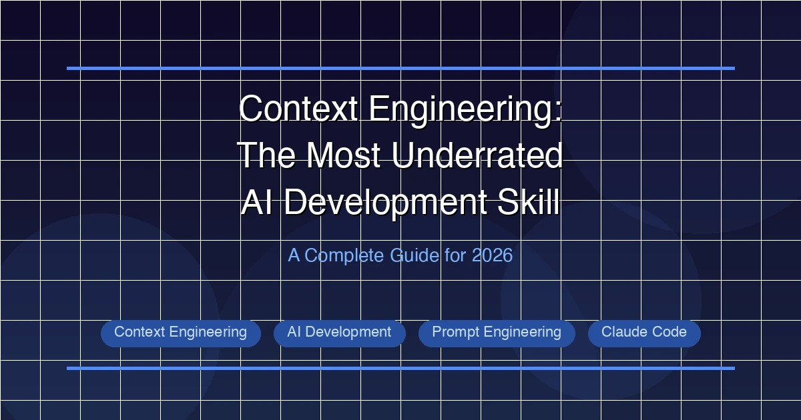

+++
date = '2026-03-10T10:00:00+08:00'
draft = false
title = '上下文工程：2026年最被低估的AI开发技能'
description = '掌握上下文工程，构建更好的AI系统。深入解析五大维度、四种失效模式和实战框架，帮你从业余提示词玩家进阶为生产级AI开发者。'
toc = true
tags = ['Context Engineering', 'AI Development', 'Prompt Engineering', 'Claude Code']
categories = ['AI Guides']
keywords = ['上下文工程', '上下文工程 vs 提示词工程', '上下文工程指南 2026', 'AI上下文管理', '上下文工程最佳实践', 'Claude Code 上下文', 'LLM上下文优化']

[[params.faqItems]]
question = "什么是上下文工程？"
answer = "上下文工程是一门设计和管理AI模型所接收的完整信息环境的学科。与提示词工程专注于写好问题不同，上下文工程构建的是系统化的信息管道——包括项目规格、工具配置、对话历史和动态检索——将上下文视为一个工程问题而非艺术创作。"

[[params.faqItems]]
question = "上下文工程和提示词工程有什么区别？"
answer = "提示词工程关注的是写好单条消息，上下文工程关注的是构建信息系统。好的提示词是加法效应——改善一次交互；好的上下文工程是乘法效应——改善整个工作流中的每一次交互。可以把它理解为写好一封邮件和设计一套邮件系统的区别。"

[[params.faqItems]]
question = "上下文有哪些主要的失效模式？"
answer = "主要有四种失效模式：上下文污染（错误信息导致输出偏差）、上下文干扰（过多无关信息分散注意力）、上下文混淆（模糊或不清晰的信息导致误解）、上下文冲突（不同来源的指令相互矛盾）。每种都需要不同的应对策略。"

[[params.faqItems]]
question = "上下文应该放多少token？"
answer = "研究表明，当上下文超过约3000个token时，LLM的推理质量会显著下降。指令和规格说明的最佳长度通常在150-300个单词。上下文并非越多越好——经过精心筛选的相关上下文远胜于大量堆砌的信息。"

[[params.faqItems]]
question = "有哪些工具可以辅助上下文工程？"
answer = "主要工具包括：CLAUDE.md文件用于项目级上下文配置，MCP（模型上下文协议）服务器用于工具集成，Promptfoo用于上下文配置的CI/CD测试，以及对话管理实践如超过30轮或50K token后开启新会话。"
+++



所有人都在谈提示词工程。市面上几百美元的课程教你如何写出更好的提示词。但到了2026年，那些构建出最令人惊叹的AI系统的开发者，并没有花时间去打磨提示词——他们在**工程化地设计上下文**。

正是这项技能，拉开了"偶尔从ChatGPT获得不错结果"和"构建可靠的、生产级别的AI工作流并在数千次交互中稳定输出"之间的差距。

上下文工程不是一个流行术语，而是我们与大语言模型协作方式的一次根本性转变。如果你还没有投入精力去掌握它，你正在错过巨大的生产力提升。

## 为什么上下文工程比提示词工程更重要

先说一个让人不太舒服的事实：**提示词工程存在天花板**。你可以花几个小时打磨一条提示词，确实能在那一次交互中获得更好的结果。但如果你需要在几百个不同任务中获得一致的结果呢？如果你的五人开发团队都需要AI保持同样的行为呢？

这就是上下文工程登场的时刻。

**提示词工程是加法效应**——每条好的提示词改善一次交互。**上下文工程是乘法效应**——一套设计良好的上下文系统能改善整个工作流中的每一次交互。

换个角度理解：

| 方法 | 作用范围 | 影响力 | 投入方式 |
|------|---------|--------|---------|
| 提示词工程 | 单次交互 | 线性提升 | 每个任务单独投入 |
| 上下文工程 | 整个工作流 | 指数级提升 | 一次性搭建，持续维护 |

从提示词工程到上下文工程的演进，映射了软件开发中一个熟悉的模式。写个一次性脚本解决问题，这是提示词工程；构建一个带测试、文档和CI/CD的可复用库，这是上下文工程。

Anthropic 很早就意识到了这一转变，发布了[官方上下文工程指南](https://docs.anthropic.com/en/docs/build-with-claude/prompt-engineering/overview)，将上下文管理定义为核心工程学科。LangChain 也发布了自己的框架，提出了[四大核心策略](https://blog.langchain.dev/context-engineering/)：写入（Write）、选择（Select）、压缩（Compress）和隔离（Isolate）。

2026年的行业共识已经很明确：**随手写提示词谁都会，生产级上下文工程才是真正的工程技能**。

## 上下文工程的五大维度

上下文工程不是单一技术，它横跨五个不同维度，每个维度需要不同的策略和工具。

### 1. 信息选择

这是最关键的维度。不是所有信息都同等有价值，而且**上下文并非越多越好**。

研究一致表明，当上下文超过约3000个token时，LLM的推理质量会显著下降。指令和规格说明的最佳长度通常在**150-300个单词**。这意味着你的工作不是把所有东西都塞进去——而是精确地放入真正重要的内容。

糟糕的上下文选择：
```
这是我们全部的代码库文档（15000字），所有API规格，
完整的git历史记录，以及关于这个功能的所有Slack对话。
请修复这个bug。
```

优秀的上下文选择：
```
Bug: 用户重置密码后认证失败。
相关代码: auth/password_reset.py (第45-62行)
预期行为: 密码修改后刷新token。
当前行为: 旧token未失效，导致401错误。
相关测试: test_password_reset_flow（当前失败中）。
```

第二个例子更短，但包含了更高密度的相关信息。模型可以有效推理，而不会被噪音淹没。

### 2. 信息组织

上下文的**组织方式**和**包含什么**同样重要。研究得出了一个出人意料的发现：**结构化的上下文有时反而比随机排列的上下文表现更差**——当结构创建了虚假的层级关系，或者把关键信息埋在看似"该出现但不被关注"的位置时。

核心原则：

- **把最重要的信息放在最前面。** 模型对上下文窗口的开头和结尾关注度更高。
- **使用清晰的章节标题。** 这不是为了美观，而是为了检索——模型将标题作为语义锚点。
- **分离指令和数据。** 把"要做什么"和"用什么来做"混在一起会造成困惑。
- **聚合相关信息。** 让API规格靠近API相关指令，让测试预期靠近测试代码。

### 3. 信息质量

大多数人在这里栽跟头。他们关注的是数量（"给模型更多信息"），而真正该关注的是质量（"给模型更好的信息"）。

质量维度包括：

- **准确性**：信息是否最新且正确？过时的API文档比没有文档更糟糕。
- **具体性**："写好代码"是低质量指令。"遵循 src/errors.py 中的现有错误处理模式，使用自定义异常类"才是高质量指令。
- **一致性**：你的上下文来源之间是否一致？矛盾是主要的失效模式之一（下文详述）。

### 4. 时机

信息**何时**进入上下文非常重要。有三种时机策略：

**静态上下文**在每次交互开始时加载，包括项目规格、编码规范和工具配置。在 Claude Code 中，你的 [CLAUDE.md 文件](/posts/ai/2026-02-28-claude-code-claudemd-guide/)就承担这个角色。

**动态上下文**在交互过程中根据模型需要进行检索。[MCP（模型上下文协议）](/posts/ai/2026-02-28-mcp-protocol-explained/)服务器是主要机制——它让模型按需拉取数据库结构、API响应或文档。

**对话上下文**在交互过程中逐步积累。这是最脆弱的维度，因为它的增长不受控制，很快就会超出有效范围。

### 5. 工具配置

工具就是上下文。你给AI模型的每一个工具都会增加上下文窗口的内容并影响其行为。这就是为什么 Anthropic 的工具设计原则（下文详述）强调**精选胜于全部包含**。

给模型50个工具但它只需要3个，这不只是浪费——还会主动降低性能，因为模型不得不把推理能力花在工具选择上，而非解决实际问题。

## 四种上下文失效模式

理解上下文如何失效，和理解如何构建上下文同样重要。有四种主要的失效模式，每种都有不同的症状和解决方案。

### 1. 上下文污染

**定义**：上下文中的错误、过时或误导性信息，使模型的输出受到"污染"。

**示例**：你的 CLAUDE.md 写着"我们使用 PostgreSQL 14"，但三个月前已经迁移到了 PostgreSQL 16。模型生成的迁移脚本会针对 PG14 的特性和语法。

**症状**：输出看起来很自信但实际上是错的。模型产出看似合理的代码或答案，但包含可追溯到错误上下文的细微错误。

**解决方案**：定期进行上下文审计。像对待代码一样对待上下文来源——它们需要审查、更新和版本控制。安排每周对 CLAUDE.md 和其他静态上下文文件的审查。

### 2. 上下文干扰

**定义**：过多无关信息稀释了模型的注意力和推理能力。

**示例**：你粘贴了一整个500行的文件，但模型其实只需要理解其中一个20行的函数。模型把推理能力花在解析无关代码上，甚至可能去修改不该碰的东西。

**症状**：输出正确但不够聚焦。模型可能会处理边缘问题、过度设计方案或引入不必要的修改。

**解决方案**：激进地精选信息。遵循原则：**包含完成任务所需的最少上下文，而非所有可用的上下文**。使用精确的文件引用、行号范围和摘要来替代完整文档。

### 3. 上下文混淆

**定义**：模糊或不清晰的信息，导致模型的理解与你的意图不一致。

**示例**：你的规格说"系统应该优雅地处理错误"。这是要重试？记录日志后继续？抛给用户？返回默认值？模型会猜，而且可能猜错。

**症状**：输出合理但不是你想要的。模型对模糊指令做出了看似合理的解读，但偏离了你的实际意图。

**解决方案**：做到不留歧义。用具体示例替代模糊指令。不要说"优雅地处理错误"，而是说"捕获 DatabaseError 异常，使用结构化日志以 ERROR 级别记录，并返回503状态码，消息为 'Service temporarily unavailable'"。

### 4. 上下文冲突

**定义**：不同上下文来源提供了相互矛盾的指令或信息。

**示例**：你的 CLAUDE.md 说"始终使用函数式编程模式"，但对话中包含了使用类的代码片段。MCP服务器返回的API文档展示的是面向对象的接口。模型同时收到了三个相互矛盾的信号。

**症状**：输出不一致。模型在不同方法之间摇摆，或者产出混合方案，哪个冲突需求都没有完全满足。

**解决方案**：建立清晰的优先级层次。在 Claude Code 中，优先级顺序是：直接对话指令 > CLAUDE.md 项目配置 > 工具提供的上下文 > 模型默认行为。记录这个层次关系，在矛盾到达模型之前就解决它们。

一个值得注意的行为差异：**Claude 在面对不确定或矛盾的上下文时倾向于拒绝执行或要求澄清，而 GPT 系列模型倾向于"虚构"**——产出自信满满的答案来掩盖矛盾。两种行为各有利弊，但了解你所用模型的失效模式有助于设计更好的上下文。

## 构建你的上下文系统：实战框架

理论固然有用，但你需要一套具体的系统。以下是一个四层上下文架构，适用于真实的AI开发工作流。

### 第一层：项目级静态上下文（CLAUDE.md）

[CLAUDE.md 文件](/posts/ai/2026-02-28-claude-code-claudemd-guide/)是基础。它在每次 Claude Code 会话开始时加载，影响后续所有交互。

**CLAUDE.md 中应该包含的：**

```toml
# 项目身份
- 项目名称、目的和当前状态
- 技术栈及具体版本号
- 架构概览（2-3句话，不要写成小说）

# 开发规范
- 编码约定（附示例，不只是规则）
- 错误处理模式
- 测试要求

# 当前优先事项
- 当前迭代/里程碑目标
- 已知的要规避的问题
- 最近完成的工作（防止重复劳动）
```

**CLAUDE.md 中不应该包含的：**

- 完整的API文档（用 MCP 动态检索）
- 历史决策及其原因（移到单独的 ADR 文件中）
- 每天都在变的信息（用对话上下文代替）

核心原则是：**"规格说明就是新的源代码。"** 你的 CLAUDE.md 不是 README——它是驱动AI行为的核心产物。要用对待生产代码的严谨态度来对待它。

关于 CLAUDE.md 最佳实践的详细指南，请参阅我们的 [CLAUDE.md 完全指南](/posts/ai/2026-02-28-claude-code-claudemd-guide/)。

### 第二层：会话级动态上下文

每次对话会话都是一个有有限生命周期的上下文容器。需要刻意管理。

**正确地开始一次对话：**

不要一上来就扎进任务，先前置关键上下文：

```
我在开发支付处理模块。
相关文件：
- src/payments/processor.py（核心逻辑）
- src/payments/validators.py（输入验证）
- tests/test_payments.py（当前测试集）

当前状态：所有测试通过，除了 test_refund_partial。
目标：修复部分退款计算的bug。
约束：必须保持对 v2 API 的向后兼容。
```

这8行上下文设置能避免几十次来回的澄清对话。

**知道什么时候该重新开始：**

上下文会随时间退化。随着对话增长，早期消息的影响力减弱，矛盾积累，模型的推理质量下降。

**最佳实践：超过30轮对话或50K token后开启新会话**，以先到者为准。这不是失败——而是一种工程卫生习惯。总结当前状态，重新开始，把总结作为新会话的前置上下文。

如果你使用 [Claude Code](/posts/ai/2026-02-28-claude-code-complete-guide/)，可以在状态栏看到token用量。当它超过50K时，就该开启新会话了。

### 第三层：工具提供的上下文（MCP）

[MCP（模型上下文协议）](/posts/ai/2026-02-28-mcp-protocol-explained/)服务器提供动态上下文，模型可以按需拉取。这才是上下文工程真正强大的地方——你不需要预先加载所有东西，而是给模型**信息源的访问权限**，让它自行检索所需内容。

常见的 MCP 上下文源：

| MCP 服务器 | 提供的上下文 |
|-----------|------------|
| 数据库 MCP | 实时结构、示例数据、查询结果 |
| Git MCP | 提交历史、diff、分支状态 |
| 文档 MCP | API文档、内部wiki、运维手册 |
| 监控 MCP | 错误日志、性能指标、告警 |
| Context7 | 按需获取库文档 |

关键洞察：MCP 将上下文从**推送模式**（你提前决定包含什么）转变为**拉取模式**（AI在执行过程中决定需要什么）。这大幅减少了上下文干扰，同时保持了对全面信息的访问能力。

关于 MCP 与 Claude Code 的集成设置，请参阅我们的 [MCP 协议指南](/posts/ai/2026-02-28-mcp-protocol-explained/)。

### 第四层：动态检索与 RAG

对于大型代码库和文档集，检索增强生成（RAG）提供了可扩展的上下文策略。不需要把所有东西塞进上下文窗口，而是索引你的内容并按需检索相关片段。

这一层在以下场景尤为重要：

- 代码库超过10万行，无法全部包含
- 文档集超出上下文窗口限制
- 偶尔需要的历史数据（过往对话、已解决的问题）

LangChain 的框架用四个策略很好地概括了这一点：

1. **写入（Write）**：创建高质量的上下文文档（规格说明、CLAUDE.md）
2. **选择（Select）**：为每个任务选择激活哪些上下文源
3. **压缩（Compress）**：在保持信息密度的同时缩减上下文体量
4. **隔离（Isolate）**：将不同的上下文关注点分开，防止冲突

## Anthropic 的五条工具设计原则

Anthropic 发布了五条设计工具作为AI模型上下文的原则。这些原则不仅适用于 MCP 工具，也广泛适用于你提供的任何上下文。

### 1. 精选胜于全部包含

不要把你拥有的所有工具都给模型。**只选择与当前任务最相关的3-5个工具。** 每增加一个工具都会向上下文添加token，并迫使模型在工具选择上花费推理能力。

糟糕的做法：
```json
// 47个工具可用，大多数与当前任务无关
tools: [file_read, file_write, git_commit, git_push, git_pull,
        git_branch, git_merge, docker_build, docker_run,
        docker_stop, k8s_deploy, k8s_scale, ...]
```

正确的做法：
```json
// 只提供当前工作流需要的工具
tools: [file_read, file_write, run_tests]
```

### 2. 使用一致的命名空间

用一致的命名约定来组织相关工具。这有助于模型理解工具之间的关系并做出正确选择。

```
// 好：清晰的命名空间层次
database_query
database_schema
database_migrate

// 差：命名不一致
run_sql
getDBSchema
db-migrate
```

### 3. 提供语义化数据

工具响应应该包含语义上下文，而非裸数据。不要只返回一个JSON对象，而是附上类型信息、关联关系和可读的描述。

### 4. 优化Token效率

工具描述、参数和响应中的每一个token都会占用上下文窗口。要简洁，在不产生歧义的地方使用缩写，避免冗余字段。

"This tool allows you to read the contents of a file from the filesystem by providing a file path" 可以缩短为 "Read file contents at the given path"，信息量完全一样。

### 5. 把工具描述当作性能杠杆

这是最被低估的原则。**工具描述的质量直接影响模型使用工具的效果。** 描述模糊会导致误用，描述精确并附带示例会导致正确使用。

```yaml
# 弱描述
name: search_code
description: "Search code in the project"

# 强描述
name: search_code
description: "Search project source files using regex patterns.
  Searches .py, .js, .ts files by default. Use glob parameter
  to filter file types. Returns max 50 results sorted by relevance.
  Example: search_code('def process_', glob='*.py')"
```

强描述精确地告诉模型可以期待什么，减少了试错，提高了首次成功率。

## 上下文卫生：维护最佳实践

上下文系统不维护就会退化。以下是保持上下文健康的实践方法。

### 每周 CLAUDE.md 审查

每周安排15分钟审查你的 CLAUDE.md，检查：

- **过时信息**：技术栈变了吗？版本号还对吗？
- **已完成的工作**：移除对已完成任务的引用。它们浪费token，还可能让模型困惑。
- **缺失的模式**：有没有新的编码约定还没被记录？
- **矛盾之处**：文件中有没有和当前实践冲突的内容？

把它当作AI配置的代码审查。

### 会话生命周期管理

- **每个独立任务一个新会话**：不要在一个会话里同时"修复这个bug、重构认证模块、写测试"。每个任务独立一个上下文。
- **30轮/50K token限制**：达到任一阈值就开新会话。
- **会话交接摘要**：结束会话时，让模型总结当前状态、已做决策和剩余工作。用这个摘要来引导下一个会话。

### 使用 Promptfoo 测试上下文

[Promptfoo](https://www.promptfoo.dev/) 为上下文配置引入了CI/CD纪律。你可以：

- 为给定的上下文+提示词组合定义预期输出
- 在 CLAUDE.md 或工具配置变更时运行自动化测试
- 跟踪上下文更新后的性能回归
- 用真实指标对不同上下文策略做A/B测试

```yaml
# promptfoo 配置示例
prompts:
  - "Fix the failing test in {{file}}"
providers:
  - anthropic:claude-sonnet-4-20250514
tests:
  - vars:
      file: "test_payments.py"
    assert:
      - type: contains
        value: "assert_equal"
      - type: not-contains
        value: "skip"
```

这就是你从"感觉上下文管用"进阶到"我们有数据证明它管用"的方法。

### 使用 Hooks 实现上下文自动化

[Claude Code hooks](/posts/ai/2026-02-28-claude-code-hooks-guide/) 让你可以自动化上下文管理。例如：

- **会话前置 hooks**：根据当前 Git 分支自动加载相关上下文
- **工具后置 hooks**：在工具输出进入上下文前进行验证
- **通知 hooks**：当上下文增长过大时发出警告

Hooks 将上下文管理从手动操作转变为自动化系统。

## 上下文工程的实战工作流

让我走一遍完整的实战工作流，看看这些原则如何端到端地串联。

**场景**：你正在为用户资料更新构建一个新的API端点。

**第1步：准备静态上下文（CLAUDE.md）**

确保你的 CLAUDE.md 包含当前的API约定、认证模式和数据库结构约定。这需要5分钟，但能省下几小时的修正时间。

**第2步：开启一个聚焦的会话**

```
任务：添加 PUT /api/v2/users/{id}/profile 端点。
需求：
- 接受包含 name, email, avatar_url 的JSON body
- 验证email格式和唯一性
- 返回200及更新后的资料，或返回相应错误码
- 遵循 src/api/users.py 中的现有模式

相关文件：src/api/users.py, src/models/user.py,
tests/api/test_users.py
```

**第3步：让 MCP 提供动态上下文**

模型工作时，通过数据库 MCP 拉取数据库结构，通过文件搜索检查现有模式，通过测试套件进行验证。

**第4步：监控上下文健康**

20轮对话后检查：对话还聚焦吗？范围有没有蔓延？有没有积累矛盾？如果会话已经偏离，总结一下重新开始。

**第5步：沉淀经验**

完成任务后，如果出现了新模式就更新 CLAUDE.md。模型是否在某个地方遇到了困难，而更好的静态上下文本可以避免？加上去。

这套工作流与 [vibe coding](/posts/ai/2026-02-28-vibe-coding-explained/) 实践天然契合——关键区别在于上下文工程让 vibe coding 变得**可靠且可复现**，而不是靠运气。

## 上下文工程 vs. 提示词工程：直接对比

为了把区别说清楚，来一个并排对比：

| 维度 | 提示词工程 | 上下文工程 |
|------|-----------|-----------|
| **关注点** | 单条消息质量 | 系统级信息架构 |
| **范围** | 一次交互 | 整个工作流 |
| **技能类型** | 写作技巧 | 工程学科 |
| **维护方式** | 按次维护 | 持续的系统维护 |
| **可扩展性** | 线性（每条提示词定制） | 乘法级（上下文系统服务所有提示词） |
| **失效模式** | 坏提示词导致坏输出 | 坏上下文导致系统性故障 |
| **测试方式** | 人工审查 | Promptfoo 自动化 CI/CD |
| **团队影响** | 个人生产力 | 团队级一致性 |

这并不是说提示词工程无关紧要。好的提示词仍然重要。但**上下文工程是让好提示词在规模化场景下发挥作用的基础**。

打个比方：提示词工程是写好函数调用，上下文工程是设计这些函数调用所依赖的API。

## 进阶模式：规格驱动的工作流

最强大的上下文工程模式之一是规格驱动的工作流，建立在**"规格说明就是新的源代码"**这一原则之上。

不是先写代码再补文档，而是先写规格说明，然后让AI按规格实现：

1. **编写详细的规格说明**（150-300个单词，覆盖行为、约束和边界情况）
2. **将规格放入 CLAUDE.md** 或作为对话上下文引用
3. **让AI按照规格实现**，使用 MCP 工具获取动态上下文
4. **按照规格验收测试**——规格既是实现指南，也是验收标准

这个模式之所以有效，是因为它给了模型**高密度、高质量、无歧义的上下文**——恰恰是能产出最佳结果的那种上下文。

对团队来说，规格说明具有双重作用：它既是AI实现的上下文，也是人工审查的文档。这消除了代码和文档渐行渐远这个老大难问题。

## 相关工具与资源

如果你认真对待上下文工程实践，以下工具可以很好地协同：

- **[Claude Code](/posts/ai/2026-02-28-claude-code-complete-guide/)**：上下文工程的主要环境，集成 CLAUDE.md、MCP 和 Hooks
- **[CLAUDE.md](/posts/ai/2026-02-28-claude-code-claudemd-guide/)**：项目级上下文配置深度指南
- **[MCP 协议](/posts/ai/2026-02-28-mcp-protocol-explained/)**：通过工具集成实现动态上下文
- **[Claude Code Hooks](/posts/ai/2026-02-28-claude-code-hooks-guide/)**：自动化上下文管理
- **[Codex CLI](/posts/ai/2026-03-10-codex-cli-deep-dive/)**：替代工具，有自己的上下文模式（instructions.md）
- **[Promptfoo](https://www.promptfoo.dev/)**：上下文测试的 CI/CD 工具
- **[LangChain](https://blog.langchain.dev/context-engineering/)**：提供上下文策略框架（写入、选择、压缩、隔离）

## 总结

上下文工程不是未来的技能——它是**当下**的技能。在2026年掌握它的开发者将获得复利般的优势，因为AI工具只会越来越强大、越来越依赖上下文。

核心原则很直接：

1. **激进地精选**——更少的上下文，更高的质量
2. **构建系统，而非消息**——投资于 CLAUDE.md、MCP 和自动化测试
3. **持续维护**——每周审查、会话卫生、上下文审计
4. **用数据说话**——使用 Promptfoo 和A/B测试，而非直觉
5. **分层思考**——静态项目上下文、动态工具、对话管理和检索

从一个改变开始：创建或改进你的 CLAUDE.md 文件。让它具体、及时、简洁。然后观察后续每一次AI交互如何改善。

这就是上下文工程的乘法威力。
