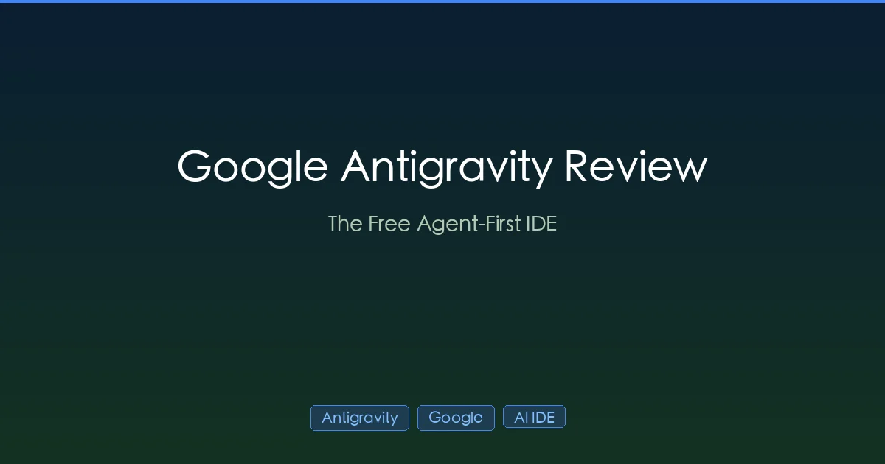

+++
date = '2026-03-07T10:00:00+08:00'
draft = false
title = 'Google Antigravity Review 2026: Free AI IDE Features & Setup'
description = 'Google Antigravity hands-on review: free Gemini 3-powered AI IDE with Manager View, multi-agent coding, and autonomous workflows. Compared with Cursor and Claude Code.'
toc = true
tags = ['Google Antigravity', 'AI Coding Tools', 'AI IDE', 'Gemini']
categories = ['AI Guides']
keywords = ['antigravity ai tool 2026', 'google antigravity ai coding tool 2026', 'google antigravity ai ide features 2026', 'google antigravity review', 'google antigravity setup', 'free ai ide 2026', 'antigravity vs cursor', 'antigravity vs claude code']

[[params.faqItems]]
question = "Is Google Antigravity free?"
answer = "Yes. Google Antigravity is currently free for individuals during public preview. A Pro tier at $20/month is also available with higher usage limits and priority access to Gemini 3 Pro."

[[params.faqItems]]
question = "What AI models does Google Antigravity support?"
answer = "Antigravity supports Gemini 3 Pro (Google's latest), Gemini 3 Flash (faster, cost-efficient), Claude Sonnet 4.6 (Anthropic), and GPT-OSS-120B (OpenAI's open-source variant). Gemini 3 Pro is the default."

[[params.faqItems]]
question = "Does Google Antigravity support MCP?"
answer = "Not yet. Unlike Cursor, Claude Code, and Codex CLI, Antigravity does not currently support the Model Context Protocol. Google has its own extension system instead. MCP support is expected in a future update."

[[params.faqItems]]
question = "How does Antigravity compare to Cursor?"
answer = "Antigravity is agent-first (AI works autonomously), while Cursor is editor-first (you write code with AI assistance). Antigravity is free, Cursor costs $20/month. Cursor has better VS Code compatibility. Antigravity excels at autonomous multi-step tasks."

[[params.faqItems]]
question = "Can I use my VS Code extensions in Antigravity?"
answer = "Partially. Antigravity is a heavily modified VS Code fork, so many extensions work. However, some extensions may have compatibility issues due to Antigravity's custom agent integration layer. The community extension marketplace is growing."
+++



Every few months, a new AI coding tool promises to "change everything." Most don't. But Google Antigravity — announced alongside Gemini 3 in November 2025 and now in public preview — might actually deliver. It's free, it's agent-first, and it approaches coding fundamentally differently from tools like [Cursor](/posts/ai/2026-01-19-cursor-agent-best-practices/) and [Claude Code](/posts/ai/2026-02-28-claude-code-complete-guide/).

After weeks of daily use, here's my honest take: what Antigravity does well, where it falls short, and whether you should switch.

## What Makes Antigravity Different

Most AI coding tools bolt intelligence onto an existing editor. Antigravity flips this: the **AI agent is the primary interface**, and the editor is secondary.

The core idea: instead of writing code and asking AI for help, you describe what you want and **agents build it for you** — planning, coding, testing, and verifying autonomously.

This isn't just marketing. The architecture genuinely reflects this philosophy:

```
┌─────────────────────────────────────┐
│        Google Antigravity           │
│                                     │
│  ┌───────────┐  ┌───────────────┐   │
│  │  Editor   │  │  Manager      │   │
│  │  View     │  │  View         │   │
│  │ (VS Code  │  │ (Mission      │   │
│  │  fork)    │  │  Control for  │   │
│  │           │  │  agents)      │   │
│  └───────────┘  └───────────────┘   │
│                                     │
│  ┌─────────────────────────────────┐│
│  │  Agents (autonomous workers)    ││
│  │  - Plan tasks from descriptions ││
│  │  - Write and edit code          ││
│  │  - Run tests and commands       ││
│  │  - Browse the web for research  ││
│  │  - Generate "Artifacts" (proof) ││
│  └─────────────────────────────────┘│
│                                     │
│  Gemini 3 Pro / Flash / Claude /    │
│  GPT-OSS                            │
└─────────────────────────────────────┘
```

## Installation and Setup

### Download

Head to [antigravity.google/download](https://antigravity.google/) and pick the right version:
- **macOS**: Separate builds for Intel and Apple Silicon
- **Windows**: 64-bit Windows 10+
- **Linux**: Requires glibc 2.28+

### First Launch

The setup wizard walks you through:

1. **Sign in** with your Google account
2. **Choose your development mode** (more on this below)
3. **Import VS Code settings** (optional — themes, keybindings, and many extensions carry over)

### Three Development Modes

This is where Antigravity starts differentiating itself:

| Mode | How It Works | Best For |
|------|-------------|----------|
| **Agent-Driven** ("Autopilot") | AI writes code autonomously, you review | Prototyping, scaffolding, repetitive tasks |
| **Review-Driven** | AI asks permission before each action | Production code, learning new codebases |
| **Agent-Assisted** (recommended) | You write code, AI handles safe automations | Daily development, team projects |

**My recommendation**: Start with **Agent-Assisted**. It gives you the best balance of productivity and control. Switch to Agent-Driven for throwaway prototypes and boilerplate generation.

## The Dual Interface: Editor View vs Manager View

### Editor View

This looks familiar — it's essentially VS Code with an AI agent sidebar. You get:
- Standard code editing with syntax highlighting, extensions, etc.
- An agent panel where you can describe tasks in natural language
- Inline suggestions and completions powered by Gemini 3
- Terminal integration

If you're coming from Cursor or VS Code, you'll feel at home instantly.

### Manager View: The Real Innovation

This is what sets Antigravity apart. Manager View is a **mission control dashboard** where you can:

- **Dispatch multiple agents simultaneously** — assign 5 different bugs to 5 agents working in parallel
- **Monitor agent progress** in real-time with status updates
- **Review Artifacts** — agents produce verifiable deliverables (task lists, implementation plans, screenshots, even browser recordings)
- **Approve or reject changes** before they're applied

Think of it like managing a team of junior developers. You assign tasks, they work independently, and you review their output before merging.

**This is the killer feature.** No other tool — not Cursor, not [Claude Code](/posts/ai/2026-02-28-claude-code-complete-guide/), not Codex CLI — offers this level of parallel agent orchestration in a visual interface.

## Supported AI Models

Antigravity doesn't lock you into Google's models:

| Model | Provider | Strengths | Availability |
|-------|----------|-----------|-------------|
| **Gemini 3 Pro** | Google | Best overall reasoning, multimodal | Default, free tier |
| **Gemini 3 Flash** | Google | Faster, cost-efficient | Free tier |
| **Claude Sonnet 4.6** | Anthropic | Strong code quality, fewer reworks | Free tier |
| **GPT-OSS-120B** | OpenAI | Open-source, good for sensitive projects | Free tier |

The multi-model support is surprisingly good. You can assign different models to different agents — for example, Gemini 3 Pro for architecture planning and Claude Sonnet for implementation.

**What's missing**: Claude Opus 4.6 and GPT-5 are not available. If you need the absolute strongest reasoning models, you'll still need [Claude Code](/posts/ai/2026-02-25-claude-code-pricing/) or [Codex CLI](/posts/ai/2026-03-10-codex-cli-deep-dive/).

## Artifacts: Trust Through Transparency

One of Antigravity's smartest design decisions is **Artifacts**. Instead of agents just showing tool calls and outputs, they produce structured deliverables:

- **Task lists** — Step-by-step plans before execution
- **Implementation plans** — Architectural decisions with justifications
- **Screenshots** — Visual proof of UI changes
- **Browser recordings** — Captured agent web research sessions
- **Test results** — Automated verification of changes

This matters because the biggest problem with autonomous agents is trust. "Did it actually do what I asked? Did it break something?" Artifacts give you verifiable evidence without reading every line of code diff.

## What Antigravity Does Well

### 1. Parallel Agent Workflows

Dispatch 5 agents on 5 tasks simultaneously. This is **genuinely faster** than sequential tools. In practice, I've seen 3-4x throughput improvement on independent tasks like fixing multiple bugs or adding tests to different modules.

### 2. Zero-Cost Entry

Free for individuals in public preview. No credit card, no trial period. Compare this to:
- [Claude Code](/posts/ai/2026-02-25-claude-code-pricing/): $20-$200/month
- [Cursor](/posts/ai/2026-02-28-claude-code-vs-cursor/): $20/month + overages
- [Codex CLI](/posts/ai/2026-03-10-codex-cli-deep-dive/): $20-$200/month (ChatGPT subscription)

For students, hobbyists, or developers evaluating AI coding tools, this is unbeatable.

### 3. Visual Agent Management

The Manager View makes agent orchestration accessible to people who don't want to work in terminals. If you prefer GUIs over CLIs, Antigravity is the most approachable option.

### 4. Multi-Model Flexibility

Being able to choose between Gemini, Claude, and GPT models — and assign different models to different agents — is a unique advantage no other IDE offers.

## Where Antigravity Falls Short

### 1. No MCP Support

This is the biggest gap. [MCP (Model Context Protocol)](/posts/ai/2026-02-28-mcp-protocol-explained/) has become the universal standard for connecting AI tools to external services. Claude Code, Cursor, and Codex CLI all support it. Antigravity uses Google's own extension system instead.

This means you can't use the [ecosystem of MCP servers](/posts/ai/2026-03-05-best-mcp-servers-claude-code/) that connect to databases, Figma, Sentry, GitHub, and hundreds of other services. Google says MCP support is coming, but it's not here yet.

### 2. Gemini 3 vs Opus 4.6 for Complex Reasoning

Gemini 3 Pro is excellent for most coding tasks. But for deeply complex reasoning — multi-step architecture decisions, subtle bug diagnosis across large codebases — Claude Opus 4.6 still has an edge. Multiple developer reports confirm Claude Code produces ~30% fewer code reworks than alternatives.

### 3. Agent Reliability on Complex Tasks

Autonomous agents work great for well-defined tasks (fix this bug, add this test, scaffold this component). For ambiguous, open-ended tasks ("refactor this module to be more maintainable"), agents sometimes go in circles or make questionable architectural choices.

This isn't unique to Antigravity — it's a fundamental limitation of current AI agents. But the "agent-first" design means you encounter it more frequently than with tools that keep humans in the loop by default.

### 4. Extension Compatibility

While Antigravity is a VS Code fork, not all extensions work perfectly. The custom agent integration layer can conflict with some popular extensions. The extension marketplace is growing but smaller than VS Code's.

## Antigravity vs Cursor vs Claude Code

| Feature | Antigravity | Cursor | Claude Code |
|---------|-------------|--------|-------------|
| **Philosophy** | Agent-first | Editor-first | Terminal-first |
| **Price** | Free (preview) | $20/mo | $20-$200/mo |
| **Best model** | Gemini 3 Pro | Multi-model | Claude Opus 4.6 |
| **Parallel agents** | Yes (Manager View) | No | Via [Worktree](/posts/ai/2026-02-28-claude-code-worktree-guide/) |
| **MCP support** | No | Yes | Yes |
| **VS Code compat** | Partial fork | Full fork | N/A (terminal) |
| **Reasoning depth** | Good | Good | Best |
| **Agent autonomy** | Highest | Medium | High |
| **Code rework rate** | Medium | Medium | Lowest (~30% fewer) |
| **Best for** | Prototyping, parallel tasks | Daily IDE workflow | Complex reasoning, automation |

### My Recommendation

**Use Antigravity when**: You're prototyping, working on multiple independent tasks, want a free option, or prefer visual agent management.

**Use Cursor when**: You want a familiar VS Code experience with AI assistance, need full extension compatibility, or prefer staying in control of every edit.

**Use [Claude Code](/posts/ai/2026-02-28-claude-code-complete-guide/) when**: You need deep reasoning for complex tasks, want terminal-based automation, need MCP integrations, or are doing heavy [multi-agent orchestration](/posts/ai/2026-02-22-claude-code-agent-teams/).

**The optimal setup for 2026**: Many developers are running Antigravity for quick prototyping + Claude Code for complex tasks. At $0 + $100/month (Claude Max 5x), it's a powerful combination.

## Tips for Getting the Most Out of Antigravity

### 1. Start with Agent-Assisted Mode

Don't jump straight to "Autopilot." Learn the tool's behavior patterns in Agent-Assisted mode first, then gradually grant more autonomy as you build trust.

### 2. Use Manager View for Independent Tasks

Manager View shines with **independent, well-defined tasks**. "Fix these 5 bugs" or "add unit tests to these 3 modules" are perfect use cases. Don't use it for tasks that depend on each other.

### 3. Assign Models Strategically

- **Gemini 3 Pro**: Architecture planning, complex implementations
- **Gemini 3 Flash**: Quick fixes, formatting, simple additions
- **Claude Sonnet 4.6**: High-quality code that needs fewer iterations

### 4. Review Artifacts Before Approving

Don't auto-approve agent changes. Read the Artifacts — especially implementation plans and test results. This is your quality gate.

### 5. Keep Tasks Small and Specific

"Build the login system" is too vague for an autonomous agent. "Create a login form component with email/password fields, form validation, and submit handler that calls the /api/auth endpoint" gives the agent a clear target.

## The Bigger Picture: What Antigravity Means for AI Coding

Antigravity represents a genuine shift in how we think about AI coding tools. The industry has moved through three phases:

1. **Autocomplete era** (2022-2024): Copilot, Tabnine — AI suggests the next line
2. **Agent-assisted era** (2024-2025): Cursor, Claude Code — AI helps you build
3. **Agent-first era** (2026): Antigravity — AI builds, you manage

Whether the agent-first approach becomes the default or remains a niche workflow depends on one thing: **reliability**. If agents can consistently produce production-quality code without constant human intervention, Antigravity's approach wins. If agents still need heavy oversight, editor-first tools like Cursor remain more efficient.

Right now, we're somewhere in between. Antigravity is excellent for the tasks it handles well, but it's not ready to replace human judgment on complex, production-critical work.

## Final Verdict

**Rating: 8/10**

Google Antigravity is the most innovative AI coding tool of 2026. The Manager View, multi-model support, and zero-cost entry make it genuinely compelling. The lack of MCP support and occasional agent reliability issues keep it from dethroning Claude Code for complex work or Cursor for daily IDE use.

**Should you try it?** Absolutely — it's free. Install it, spend an afternoon in Manager View dispatching parallel agents, and decide for yourself. At worst, you've added another powerful tool to your arsenal.

---

*Review based on Google Antigravity public preview, March 2026. Features and pricing may change as the product evolves.*

## Related Reading

- [Claude Code Complete Guide 2026](/posts/ai/2026-02-28-claude-code-complete-guide/) — The terminal-first alternative
- [Claude Code vs Cursor: Which Wins?](/posts/ai/2026-02-28-claude-code-vs-cursor/) — Editor-first vs terminal-first comparison
- [Codex CLI Deep Dive](/posts/ai/2026-03-10-codex-cli-deep-dive/) — OpenAI's terminal AI assistant
- [Claude Code Pricing 2026](/posts/ai/2026-02-25-claude-code-pricing/) — Cost comparison across all tools
- [MCP Protocol Explained](/posts/ai/2026-02-28-mcp-protocol-explained/) — The standard Antigravity doesn't support (yet)
- [Vibe Coding Explained](/posts/ai/2026-02-28-vibe-coding-explained/) — The coding philosophy Antigravity enables
