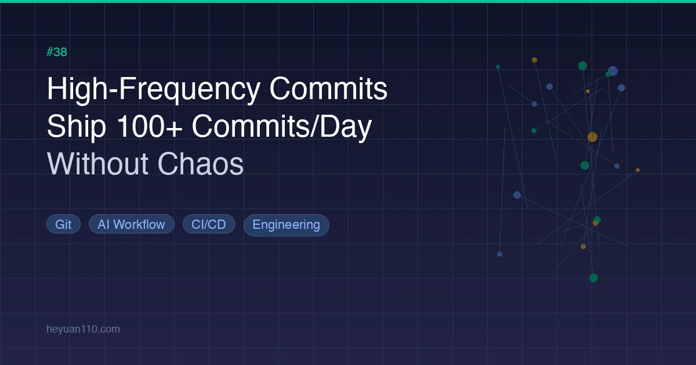

+++
date = '2026-03-10T18:00:00+08:00'
draft = false
title = '高频提交：如何做到日均 100+ Commit 而不翻车'
description = '日均 100+ 次 Git 提交怎么不翻车？AI 编程让团队日产 50-150 次提交成为常态，答案不是放慢速度而是建护栏：原子提交、约定式提交、5-15 分钟内返回结果的分层测试 CI、功能开关与渐进式发布——五大工程护城河帮你在 AI 时代安全提速。'
toc = true
tags = ['Git', 'AI Workflow', 'CI/CD', 'Engineering']
categories = ['AI Guides']
keywords = ['高频提交', 'git 提交策略', '原子提交', '约定式提交', 'AI 编程 git 工作流', '快速交付不翻车', 'git bisect', '功能开关', '渐进式发布']

[[params.faqItems]]
question = "日均 100+ 次提交是不是说明规划有问题？"
answer = "完全不是。高频提交是 AI 辅助编程、更短反馈环和更细粒度变更的自然产物。关键在于每次提交是否可解释、可审查、可回滚。"

[[params.faqItems]]
question = "原子提交的理想大小是多少？"
answer = "一个原子提交应该恰好代表一个逻辑变更——通常是几十到几百行 diff。如果一次提交同时包含修 bug、重构和新功能，就必须拆分。"

[[params.faqItems]]
question = "高频提交工作流对 CI 反馈速度有什么要求？"
answer = "核心回归测试套件应在 5 到 15 分钟内返回结果。超过这个时间就会形成瓶颈，让人不愿频繁提交，拖慢整个团队节奏。"

[[params.faqItems]]
question = "是不是每个新功能都需要功能开关？"
answer = "对于高频交付的团队，是的。功能开关将部署与发布解耦，让你可以快速合入主分支，同时精确控制用户何时看到新功能。"
+++



AI 编程工具从根本上改变了开发者交付代码的速度。有了 [Claude Code](/posts/ai/2026-02-28-claude-code-complete-guide/) 这样的 AI 助手以机器速度生成、重构和测试代码，很多团队现在每天产出 **50 到 150 次提交**——而且这个数字还在持续攀升。

但有一个不太舒服的问题：当提交频率飙升时，为什么有些项目越跑越快，有些却陷入了混乱？

答案不是放慢速度，而是构建正确的工程护栏，让每一次提交——无论多频繁——都保持**可解释、可回滚、可验证**。

> 把高频提交想象成高频电脉冲。没有隔离、缓冲和断路器，脉冲会击碎系统。但有了正确的工程约束，这些脉冲反而让系统更快收敛到稳定态。

## 为什么高频提交成了新常态

在深入策略之前先明确一点：**高频提交不是目标，而是结果**。没人会给自己定"今天提交 100 次"的 KPI。真正推动提交频率上升的是三股力量：

### 1. 更短的反馈环

AI 辅助编程把从想法到可用代码的周期压缩到了极致。当你[搭建好 AI 开发环境](/posts/ai/2026-03-10-ai-dev-environment-setup/)，可以在几秒内生成实现、跑测试、拿到修复建议时，每次实验的成本大幅下降。成本越低，实验越多——提交自然也越多。

### 2. 更细的变更粒度

现代 AI 工作流鼓励把工作拆成小而聚焦的变更，而不是巨型功能分支。不再是一天结束时的一个大提交，而是一串有明确目的的小变更。这正是 [Vibe Coding](/posts/ai/2026-02-28-vibe-coding-explained/) 实践者的日常体验——AI 处理样板代码，你通过快速迭代把控方向。

### 3. 流式交付

功能、修复、文档更新、重构全都持续进行，而非批量处理。整个团队以"流式"模式运作，工作全天源源不断地汇入主分支。

能在这种节奏下蓬勃发展的团队和翻车的团队，核心区别就一条：**你的工程体系是否支撑得住高频变更？**

本文接下来介绍五条让高频提交成为可能的工程"护城河"。

---

## 护城河 #1：原子提交——一次提交，一个目的

原子提交的核心原则听起来简单到不能再简单：**每次提交只做一件事**。

这话像是开发者的基本素养，但当提交频率飙到日均 100+ 时，它就从"最好这样"变成了关键基础设施。

### 原子提交为什么能加速

**用 git bisect 快速定位 bug。** 出了问题，`git bisect` 会在提交历史中做二分查找，精准定位引入 bug 的那次提交。但 bisect 好用的前提是每次提交都代表单一、隔离的变更。原子提交下 bisect 的效率接近 O(log N)；混杂提交下它几乎废了。

**安全、精准的回滚。** 需要回退时，你只回退一个清晰的变更——不是把一整天的混合工作全撤了。这就是 30 秒搞定和 3 小时拆线头的区别。

**更低的代码审查认知负担。** 每个 PR 或提交审查只聚焦一个目的。审查者可以快速、自信地评估变更，保持流水线畅通。

### 原子提交实战规则

以下是团队今天就能落地的具体指南：

- **大小目标**：每次提交的 diff 控制在几十到几百行（因语言和项目而异）
- **强制拆分**：如果一次提交包含重构 + 新功能 + 修 bug，**必须**拆成三个独立提交
- **重构先行模式**：大型重构应拆成多个"纯重构"提交，然后再引入行为变更
- **最小可提交单元**：拿不准时，做最小的提交，后续再补充

```
# 好：原子提交，目的清晰
git log --oneline
a1b2c3d feat: add email validation to signup form
e4f5g6h refactor: extract validation logic into shared module
i7j8k9l fix: correct timezone offset in event scheduler
m0n1o2p test: add edge case tests for email validator

# 坏：混杂提交，什么都改
git log --oneline
x9y8z7w updated signup form, fixed some bugs, cleaned up code
```

就像做手术：原子提交把一把大砍刀换成一系列精准的手术刀。

---

## 护城河 #2：约定式提交——让历史可搜索

团队日产 100+ 提交时，人的记忆力根本跟不上。你需要**机器可读的提交信息**，把 git 历史变成可查询的数据集。

[约定式提交](https://www.conventionalcommits.org/)正是这套结构：

| 前缀 | 用途 | 示例 |
|------|------|------|
| `feat:` | 新功能 | `feat: add dark mode toggle` |
| `fix:` | 修复缺陷 | `fix: resolve null pointer in user search` |
| `docs:` | 仅文档 | `docs: update API authentication guide` |
| `refactor:` | 代码重构（不改行为） | `refactor: simplify payment processing flow` |
| `test:` | 测试新增或修改 | `test: add integration tests for checkout` |
| `chore:` | 构建工具、依赖、配置 | `chore: upgrade Node.js to v22` |

### 为什么分类在规模化时至关重要

**项目健康度一目了然。** 跑一下最近提交的统计分析，就能看出团队是在建设功能还是在到处救火。如果上周 70% 的提交都是 `fix:`，这本身就说明了问题。

**自动生成发布日志。** [semantic-release](https://github.com/semantic-release/semantic-release) 之类的工具可以直接从约定式提交信息自动生成变更日志——零人工。

**差异化质量门禁。** 你可以配置 CI 对 `feat:` 和 `fix:` 提交执行更严格的检查，同时让 `docs:` 和 `chore:` 提交走更快的流水线。

**在 CI 中强制执行。** 用 [commitlint](https://commitlint.js.org/) 拒绝不符合规范的提交信息。对高频团队来说这不是可选项——没有强制执行，规范几周内就会被侵蚀殆尽。

```yaml
# 示例：在 GitHub Actions 中使用 commitlint
- name: Validate commit messages
  uses: wagoid/commitlint-github-action@v5
  with:
    configFile: .commitlintrc.yml
```

---

## 护城河 #3：类型隔离——不同风险，不同规则

很多团队失控的原因不是跑得太快，而是**把不同风险等级的变更塞进了同一套流程**。关键 bug 修复、大规模重构和实验性功能全用同一套规则处理——问题就出在这里。

类型隔离的意思是对不同类型的变更施加不同的规则：

### Fix：允许高频，但锁定范围

Bug 修复应该是通往生产环境最快的路径，但必须严格控制范围：

- 修复提交中不改公共 API
- 修复提交中不改数据结构
- 修复提交中不引入新依赖
- 修复只做**收敛**——不做扩展

当你看到一个"fix"提交同时还重新组织了文件结构，这就是红旗信号。重构必须是单独的提交。

### Feat：边界清晰，功能开关保护

新功能应该用[功能开关](https://martinfowler.com/articles/feature-toggles.html)包裹，默认关闭：

- 功能快速合入主分支（不搞长生命周期的功能分支）
- 功能对用户不可见，直到开关打开
- 灰度发布：1% → 10% → 50% → 100%

这把**部署**（代码在生产环境）和**发布**（用户看到功能）解耦了。你可以一天部署 20 次，在准备好之前用户什么变化也看不到。

### Refactor：只改结构，不改行为

重构提交必须能独立回滚，且不改变可观察行为。没有这条纪律，"重构"就会沦为"高风险重写"的委婉说法。

- 每个重构提交都应该在不修改测试的情况下通过现有测试套件
- 如果测试需要更新，说明重构改变了行为
- 大规模重构前考虑添加快照测试，捕获意外变更

### Docs：不是事后补课，而是产品组件

在高频交付环境中，文档的角色从"事后解释产品"转变为"实时控制产品复杂度"。当 [AI 编程代理](/posts/ai/2026-03-10-ai-coding-agents-comparison-2026/)生成代码的速度超过人类理解的速度时，及时更新的文档就成了维持团队共识的首要工具。

---

## 护城河 #4：测试覆盖 + 回归速度

测试是高频提交的安全网。但真正的瓶颈不是测试**覆盖率**——而是测试**反馈时间**。

### 速度基线

核心回归测试套件必须在 **5 到 15 分钟**内出结果。这没有商量余地。如果 CI 要跑 45 分钟，开发者就会开始攒变更一起提，原子提交纪律随之崩塌。

需要回答的关键问题：

- PR 流水线能否在 15 分钟内给出通过/失败判定？
- 是否有足够的单元测试让频繁重构变得安全？
- 端到端测试是否覆盖了关键用户路径（认证、支付、核心流程）？

### 分层测试策略

按不同执行频率将测试套件分层：

**第一层——单元测试（每次提交都跑）**
快速、隔离，覆盖单个函数和模块。目标：3 分钟内。

**第二层——集成测试（每个 PR 都跑）**
测试组件间交互。目标：10 分钟内。

**第三层——端到端测试（合入主分支时跑）**
关键路径的完整用户旅程测试。目标：20 分钟内。

**冒烟套件——最小可行回归（每次提交都跑）**
精选的测试子集，覆盖最关键的路径。冒烟套件通过，就有较高信心确认没有灾难性问题。

```
Commit → [单元 + 冒烟: 2 分钟] → PR → [集成: 8 分钟] → Merge → [E2E: 15 分钟]
```

### 对 Flaky 测试零容忍

Flaky 测试——没有代码变更却时过时不过的测试——是高频工作流的隐形杀手。当开发者开始忽略测试失败因为"那个测试一直 flaky"，你的安全网就彻底失效了。

立即隔离 flaky 测试。48 小时内修复或删除。把 flake rate 作为团队指标追踪。[GitHub Actions 文档](https://docs.github.com/actions)提供了测试重试和 flake 检测的模式可供参考。

---

## 护城河 #5：渐进式发布——从 Beta 到 Stable

你可以一天提交 100 次，但不必一天对所有用户发布 100 次。渐进式发布在代码速度和用户影响之间建立了缓冲区。

### 三通道模型

**主分支（持续集成）**
所有通过 CI 的提交都合入这里。分支始终处于可部署状态，但不意味着对所有人部署。

**Beta 通道（快速发布）**
一小部分用户——内部团队、早期体验者或一定比例的流量——在合入后很快收到每个变更。这是你的金丝雀。

**Stable 通道（验证后发布）**
只有在 Beta 期（通常 24-72 小时无事故）存活下来的变更才会晋升到服务所有用户的 Stable 通道。

### 语义化版本将一切串联

使用[语义化版本（SemVer）](https://semver.org/)让发布模型变得可预测：

- **Patch**（1.0.x）：`fix:` 提交的 bug 修复
- **Minor**（1.x.0）：`feat:` 提交的新功能
- **Major**（x.0.0）：破坏性变更

结合约定式提交，版本号升级可以完全自动化。`fix:` 提交触发 patch 发布到 beta；`feat:` 提交触发 minor 发布。破坏性变更（通过提交信息中的 `BREAKING CHANGE:` 标记）触发 major 发布。

### 数据库迁移：隐藏的风险

高频部署要求**前向兼容的数据库迁移**。使用 expand/contract 模式：

1. **Expand**：添加新列或新表，不删除旧的
2. **Migrate**：逐步将数据和代码迁移到使用新结构
3. **Contract**：只在所有代码更新完毕后才移除旧列

永远不要部署会破坏上一版代码的迁移。这确保你随时可以安全回退一个版本。

---

## 团队落地清单

以下是团队转向高频提交工作流的 10 点清单：

- [ ] **强制原子提交**：一次提交 = 一个逻辑变更。代码审查中拒绝混杂提交
- [ ] **采用约定式提交**：在 CI 中用 commitlint 或同类工具强制提交信息格式
- [ ] **所有新功能加功能开关**：`feat:` 提交必须用开关包裹，默认关闭
- [ ] **重构保持行为中立**：`refactor:` 提交必须在不修改测试的情况下通过现有测试
- [ ] **修复锁定范围**：`fix:` 提交不得扩大变更面
- [ ] **测试分层**：单元（每次提交）→ 集成（每个 PR）→ E2E（每次合并）
- [ ] **达到 15 分钟 CI 目标**：核心回归测试套件必须在 15 分钟内出结果
- [ ] **建设渐进式发布能力**：Beta → Stable 流水线，自动晋升
- [ ] **设计可回滚的部署**：数据库迁移使用 expand/contract 模式
- [ ] **监控质量指标**：追踪崩溃率、错误率、回滚次数和平均修复时间

把这个清单打印出来，贴到团队 Wiki 上，在下一次回顾会上过一遍。

---

## 常见误区

收尾之前，澄清三个让团队在高频工作流上栽跟头的误区：

### 误区一："提交越多 = 产出越高"

提交数量本身毫无意义，除非每次提交都是可解释、可回滚的。一个团队一天 200 次结构混乱的提交，产生的是噪音而非价值。**提交质量远比数量重要。** 上面描述的工程护城河才是把原始提交量转化为真实交付速度的关键。

### 误区二："靠人工审查就能兜住"

日均 100+ 提交时，光靠人工审查是扛不住的。你需要自动化体系：CI 检查、提交信息校验、测试套件、功能开关、渐进式发布。人工审查依然有价值，但它必须被自动化护栏支撑——而不是替代它们。

### 误区三："在 bug 修复里顺手重构能省时间"

这是最危险的捷径。当你在一个 `fix:` 提交里藏了结构性变更，你得到的既不是干净的修复也不是干净的重构。它没法安全 bisect，没法安全回滚，没法安全审查。短期感觉快了，长期必然导致事故。[上下文工程](/posts/ai/2026-03-10-context-engineering-guide/)的原则在这里同样适用——每次变更的意图越清晰，整个系统越可维护。

---

## 写在最后

高频提交本质上是**更短的反馈环**。当你建好正确的工程体系——原子提交纪律、语义化提交分类、基于类型的风险隔离、快速测试反馈、渐进式发布——提交次数的增加就不再意味着风险增加，而是意味着产品更快收敛到稳定态。

如果你正在采用 AI 编程工具，发现团队的提交频率在急剧攀升，这不是问题所在。**问题在于你还在用低频时代的工程实践来管理高频变更。**

升级体系，速度就会变成你的优势。

---

## 相关阅读

- [Claude Code 完全指南](/posts/ai/2026-02-28-claude-code-complete-guide/) — 搭建支撑高频工作流的 AI 编程助手
- [AI 开发环境搭建](/posts/ai/2026-03-10-ai-dev-environment-setup/) — 为 AI 辅助编程配置开发环境
- [Vibe Coding 详解](/posts/ai/2026-02-28-vibe-coding-explained/) — 理解这种自然产生更多提交的编程范式
- [约定式提交规范](https://www.conventionalcommits.org/) — 结构化提交信息的官方标准
- [语义化版本（SemVer）](https://semver.org/) — 与自动发布流水线配合的版本号规范
