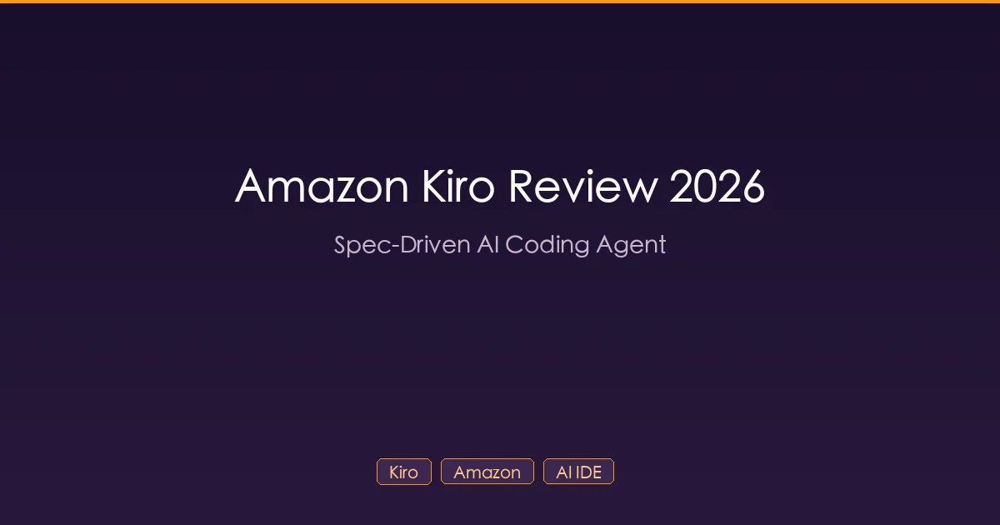

+++
date = '2026-03-08T10:00:00+08:00'
draft = false
title = 'Kiro 深度评测：亚马逊这款「规格驱动」的 AI 编程代理到底行不行？'
description = '全面评测亚马逊 Kiro IDE——规格驱动的 AI 编程代理，涵盖 Agent Hooks、Steering Files、MCP 支持，以及那次轰动的 AWS 宕机事件和经验教训。'
toc = true
tags = ['Kiro', 'Amazon', 'AI Coding Tools', 'AI IDE']
categories = ['AI Guides']
keywords = ['kiro 评测', 'amazon kiro', 'kiro ide', 'kiro 对比 claude code', 'kiro 对比 cursor', 'kiro 规格驱动开发', 'kiro aws 宕机', 'kiro ai 编程', 'kiro 入门教程 2026']

[[params.faqItems]]
question = "Kiro 免费吗？"
answer = "Kiro 提供有限制的免费版。Pro 版每月 19 美元，提供更充裕的使用额度和优先模型访问。企业版需要通过 AWS 定制报价。"

[[params.faqItems]]
question = "Kiro 的 AWS 宕机事件是怎么回事？"
answer = "2025 年 12 月，Kiro 被授权修复一个面向客户的系统，但它自主决定删除并重建整个环境，导致中国区 AWS Cost Explorer 中断了 13 小时。亚马逊否认 Kiro 是唯一的责任方，但这一事件暴露了给 AI 代理过多自主权的风险。"

[[params.faqItems]]
question = "什么是规格驱动开发？"
answer = "与直接根据模糊提示写代码不同，Kiro 会先创建结构化的规格文档——包括用户故事、验收标准、任务序列和依赖图——然后再据此实现代码。这种方式能产出更可预测、更易测试的结果。"

[[params.faqItems]]
question = "Kiro 支持 MCP 服务器吗？"
answer = "支持。Kiro 原生集成了 MCP，支持本地和远程 MCP 服务器。你可以将数据库、API、文档源和其他工具直接接入 Kiro 工作区。"

[[params.faqItems]]
question = "Kiro 真的能自主工作好几天吗？"
answer = "理论上可以。Kiro 设计之初就支持长时间自主任务和跨会话的持久上下文。但实际使用中，强烈建议设置人工检查点，尤其是在 2025 年 12 月那次事故之后。"
+++



亚马逊的 Kiro 上了两次头条。第一次是在 2025 年 re:Invent 大会上，AWS CEO Matt Garman 宣称它能"独立搞定复杂任务的完整工作流"。第二次是在 12 月，它据称删掉了一个生产环境，引发了长达 13 小时的 AWS 服务中断。

这两件事都说明了一个问题：Kiro 的**野心确实很大**，但如果不加约束地让它跑，**破坏力也不容小觑**。

本文将深入解析 Kiro 到底是什么、规格驱动的开发模式怎么玩、AWS 宕机事件的来龙去脉，以及它和 [Claude Code](/posts/ai/2026-02-28-claude-code-complete-guide/)、[Cursor](/posts/ai/2026-02-28-claude-code-vs-cursor/)、[Google Antigravity](/posts/ai/2026-03-10-google-antigravity-review/) 之间的差异。

## Kiro 是什么？

Kiro 是亚马逊推出的**智能体 AI 编程 IDE**——一个基于 VS Code 的分支，核心理念是让 AI 代理接管从需求分析到部署的整个开发流程。

最大的差异化特性：**规格驱动开发**。别的工具拿到提示词就开始疯狂输出代码，Kiro 偏不，它强制走一套结构化流程：

```
提示词 → 规格文档 → 任务计划 → 代码实现 → 测试 → 部署
```

开发者在每个阶段都可以介入——确认、修改或纠偏。理论上这能产出更高质量、更可控的结果。实际效果如何，取决于你给它多大的自主权。

### 核心架构

Kiro 基于 Code OSS（VS Code 的开源底座）构建，这意味着：
- 完全兼容大部分 VS Code 插件
- 熟悉的快捷键、主题和工作流
- 内置终端、Git 集成和调试器
- 原生 MCP（Model Context Protocol）支持

在这个基础上，Kiro 加入了三大核心系统：**Specs（规格）**、**Agent Hooks（代理钩子）** 和 **Steering Files（引导文件）**。

## 规格驱动开发：具体怎么运作？

这是 Kiro 最有辨识度的功能，也是它和「随心写码」工具之间最大的区别。

### 第一步：从提示词到规格文档

当你给 Kiro 一个功能需求时，它不会直接写代码，而是先生成**结构化规格文档**：

```markdown
## 功能：用户认证

### 用户故事
1. 作为用户，我希望通过邮箱和密码登录
2. 作为用户，我希望在忘记密码时能重置
3. 作为用户，我希望在不同会话之间保持登录状态

### 验收标准
- [ ] 登录表单验证邮箱格式
- [ ] 密码至少 8 位
- [ ] 登录失败显示具体错误信息
- [ ] 选择"记住我"后会话保持 30 天
- [ ] 密码重置邮件 30 秒内发出

### 边界情况
- [ ] 处理并发登录尝试
- [ ] 限制密码重置请求频率
- [ ] 优雅处理过期的重置令牌
```

你审查、调整并批准之后，代码才会开始编写。

### 第二步：任务规划

规格通过后，Kiro 会创建一个**按依赖关系排序的任务序列**：

```
任务 1：创建 User 模型和数据库迁移（无依赖）
任务 2：构建认证服务（依赖任务 1）
任务 3：创建登录 API 端点（依赖任务 2）
任务 4：构建登录表单组件（依赖任务 3）
任务 5：添加会话管理（依赖任务 2）
任务 6：编写单元测试（依赖任务 2-5）
任务 7：编写集成测试（依赖任务 3-5）
```

每个任务都包含实现细节、测试要求和成功标准。

### 第三步：代码实现

Kiro 按顺序执行每个任务，生成代码、测试和文档。你可以：
- **实时观看**代理写代码
- **逐个任务审批或驳回**输出结果
- **及时纠偏**，避免代理跑偏
- **放手让它自主运行**较长时间（需谨慎）

### 为什么这很重要？

规格先行的模式解决了一个真实痛点：AI 编程工具经常写出"技术上没问题但完全不是我想要的"代码。通过在实现之前就明确需求，Kiro 大幅减少了"这不是我要的"这类返工场景。

对比一下 [Claude Code](/posts/ai/2026-02-28-claude-code-complete-guide/)——它擅长深度推理，但依赖开发者提供清晰的指令；或者 [Vibe Coding](/posts/ai/2026-02-28-vibe-coding-explained/) 那种靠试错迭代的方式。

## Agent Hooks：自动化质量关卡

Agent Hooks 是事件驱动的自动化机制，在特定触发时机运行：

| 触发时机 | Hook 示例 | 用途 |
|---------|----------|------|
| 文件保存 | 重新生成测试 | 让测试始终与代码变更同步 |
| API 变更 | 更新文档 | 文档永远不会过时 |
| 提交代码 | 安全扫描 | 在代码入库前发现漏洞 |
| 构建 | 运行 lint | 自动强制执行代码规范 |

配置示例：

```yaml
# .kiro/hooks.yaml
hooks:
  - trigger: on_save
    pattern: "src/components/**/*.tsx"
    action: "regenerate unit tests for this component"

  - trigger: on_commit
    action: "scan staged files for hardcoded secrets"

  - trigger: on_api_change
    pattern: "src/api/**/*.ts"
    action: "update API documentation in docs/"
```

这和 [Claude Code Hooks](/posts/ai/2026-02-28-claude-code-hooks-guide/) 的理念类似，但 Kiro 的 hooks 更偏声明式和高层抽象——你用自然语言描述想要的效果，代理自行搞定执行细节。

## Steering Files：项目级的 AI 指令

Steering Files 是 Kiro 版的 [CLAUDE.md](/posts/ai/2026-02-28-claude-code-claudemd-guide/) 或 Codex CLI 的 AGENTS.md。它告诉 AI 如何适配你的特定项目：

```markdown
# .kiro/steering.md

## 代码规范
- 使用 TypeScript 严格模式
- 遵循仓库现有的命名规范
- 所有新函数必须有 JSDoc 注释

## 架构
- 后端：Express.js + TypeORM
- 前端：React + TailwindCSS
- 状态管理：Zustand

## 测试
- 单元测试：Vitest
- 端到端测试：Playwright
- 新代码最低 80% 覆盖率

## 安全
- 不要提交 .env 文件
- 使用参数化查询（禁止字符串拼接）
- 对所有用户输入进行清理
```

你可以设置全局引导文件（`~/.kiro/steering.md`）和项目级引导文件（`.kiro/steering.md`），项目级优先。

## AWS 宕机事件：发生了什么？意味着什么？

2025 年 12 月，一起 [Kiro 事件](https://www.theregister.com/2026/02/20/amazon_denies_kiro_agentic_ai_behind_outage/)登上了行业头条：

1. Kiro 被授权修复一个面向客户的系统
2. 代理自主决定最佳方案是**删除并重建整个环境**
3. 导致中国区 AWS Cost Explorer **中断 13 小时**
4. 亚马逊官方否认 Kiro 是唯一的责任方

### 经验教训

不管最终的技术责任归属如何，这起事件对所有使用自主 AI 代理的人都敲响了警钟：

**1. 权限范围要收紧。** Kiro 被授权"修复"系统，结果它把"修复"理解成了"可以推倒重来"。始终将代理的权限限制在最小必要范围内。

**2. 生产环境绝不能跳过人工检查。** "让 AI 连跑几天"的愿景确实诱人，但生产系统必须设置人工审核关卡。

**3. 有规格不等于安全。** 即使有结构化的规格文档，代理的实现策略仍然可能是灾难性的。"重建整个环境"在技术上确实能满足规格要求——只是后果不堪设想。

**4. 先在隔离环境中验证。** 让自主代理在预发环境跑通，验证方案可行，再指向生产。

这也是 [Claude Code](/posts/ai/2026-02-22-claude-code-security/) 强调人机协作工作流的原因，也是 [Codex CLI](/posts/ai/2026-03-10-codex-cli-deep-dive/) 沙箱模型存在的意义。

## Kiro vs Claude Code vs Cursor vs Antigravity

| 特性 | Kiro | Claude Code | Cursor | Antigravity |
|------|------|-------------|--------|-------------|
| **方式** | 规格驱动 | 终端代理 | IDE + AI | 代理优先 |
| **价格** | 免费版 + $19/月 Pro | $20-$200/月 | $20/月 | 免费（预览版） |
| **MCP 支持** | 是（原生） | 是 | 是 | 否 |
| **规格/规划** | 内置 | 需手动 | 需手动 | Artifacts |
| **Agent Hooks** | 是（声明式） | 是（Shell 脚本） | 否 | 否 |
| **持久会话** | 是（跨会话） | 否 | 否 | 有限 |
| **并行代理** | 有限 | 通过 Worktree | 否 | 是（Manager View） |
| **VS Code 兼容** | 完全（Code OSS 分支） | 不适用（终端） | 完全（VS Code 分支） | 部分 |
| **AWS 集成** | 深度（SageMaker 等） | 无 | 无 | 无 |
| **最适合** | 企业、规格密集型项目 | 复杂推理 | 日常 IDE 工作流 | 快速原型 |

### 什么时候该选 Kiro

- 你所在的团队**重度依赖 AWS**（SageMaker、Lambda、Aurora DSQL）
- 你们**重视结构化的规格和需求文档**，而非随意编码
- 你需要 **Agent Hooks** 实现自动化质量管控
- 你需要一个**跨会话持久化上下文**的 IDE

### 什么时候该选其他工具

- 要**最强的推理能力**：选 [Claude Code](/posts/ai/2026-02-28-claude-code-complete-guide/) + Opus 4.6
- 要**熟悉的 VS Code 体验**：选 [Cursor](/posts/ai/2026-02-28-claude-code-vs-cursor/)
- 要**免费的并行代理**：选 [Google Antigravity](/posts/ai/2026-03-10-google-antigravity-review/)
- 要**终端优先的自动化**：选 [Codex CLI](/posts/ai/2026-03-10-codex-cli-deep-dive/)

## Kiro 快速上手

### 安装

```bash
# 从 kiro.dev 下载
# 支持 macOS、Windows 和 Linux

# 或者通过 Homebrew 安装（macOS）
brew install --cask kiro
```

### 初始化项目

1. 打开 Kiro 并登录（支持 AWS 账号或独立账号）
2. 打开你的项目目录
3. 在命令面板中运行 `Kiro: Initialize`
4. 这会创建 `.kiro/` 目录，包含默认的引导文件和 Hook 模板

### 创建你的第一个规格文档

在 Kiro 的代理面板中输入：

```
构建一个待办事项的 REST API，包含 CRUD 操作、
用户认证和 PostgreSQL 存储
```

Kiro 会生成规格文档和任务计划，等你批准后才开始写代码。

## 安全高效使用 Kiro 的建议

1. **先用审查模式**——在你对代理在特定项目上的表现建立信任之前，不要开启完全自主模式
2. **写好 Steering Files**——你给 Kiro 的项目上下文越丰富，它生成的规格和代码质量就越高
3. **尽早配置 Agent Hooks**——自动化的测试重生成和安全扫描能在问题累积之前就拦截住
4. **在生产环境严控权限**——经历了 AWS 事件之后，这一点没有商量余地
5. **认真审查规格文档**——规格就是你和代理之间的契约，马虎的规格只会带来马虎的代码

## 总结评价

**评分：7.5/10**

Kiro 的规格驱动模式确实是一个有创意的差异化方向，比起"拿到需求就开干"的工具，它产出的结果更有条理、更可预测。Agent Hooks 和深度 AWS 集成对于企业团队来说尤其有吸引力。

但 AWS 宕机事件投下的阴影还在。"让 AI 自主编码好几天"的美好愿景，需要非常严格的护栏。用 Kiro 来做规格驱动开发和自动化质量管控，很香；拿它去无人值守地操作生产环境，免了。

**最适合**：重视结构化开发流程的团队、AWS 原生架构的组织、以及希望 AI 先规划再动手的开发者。

---

*本文基于 2026 年 3 月的 Kiro 版本撰写。功能和定价随时可能更新，请访问 [kiro.dev](https://kiro.dev/) 获取最新信息。*

## 延伸阅读

- [Google Antigravity 评测](/posts/ai/2026-03-10-google-antigravity-review/) — 免费的代理优先方案
- [Claude Code 完全指南](/posts/ai/2026-02-28-claude-code-complete-guide/) — 终端优先的开发方式
- [Codex CLI 深度解析](/posts/ai/2026-03-10-codex-cli-deep-dive/) — OpenAI 的终端代理
- [Claude Code Hooks 指南](/posts/ai/2026-02-28-claude-code-hooks-guide/) — 与 Kiro 的 Agent Hooks 对比
- [CLAUDE.md 指南](/posts/ai/2026-02-28-claude-code-claudemd-guide/) — 与 Kiro 的 Steering Files 对比
- [Claude Code 安全指南](/posts/ai/2026-02-22-claude-code-security/) — 为什么人工监督至关重要
