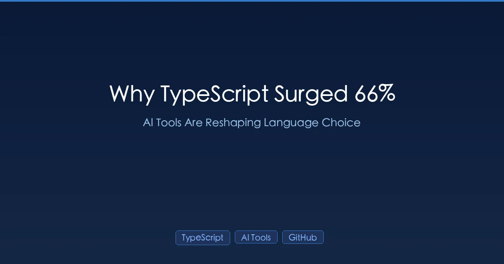

+++
date = '2026-03-09T10:00:00+08:00'
draft = false
title = 'TypeScript 暴涨 66% 的真相：AI 编程工具正在重塑语言选择'
description = 'TypeScript 以 66.6% 年增长率登顶 GitHub 第一语言，月活贡献者达 263 万，一年内超越 Python 和 JavaScript。背后推手是 AI 编程工具：研究发现 94% 的 LLM 编译错误是类型检查失败，静态类型让 AI 生成代码更可靠，「便利循环」如何运作一文讲透。'
toc = true
tags = ['TypeScript', 'AI Coding Tools', 'GitHub', 'Developer Trends']
categories = ['AI Guides']
keywords = ['typescript ai 工具', 'typescript 增长 66%', 'typescript github 第一', 'ai 编程语言选择', 'typescript vs javascript ai', '大模型静态类型', 'github octoverse typescript', 'ai 编程 2026']

[[params.faqItems]]
question = "TypeScript 在 GitHub 上为什么增长了 66%？"
answer = "Cursor、Claude Code、Copilot 等 AI 编程工具在处理 TypeScript 时表现远优于 JavaScript，因为静态类型提供了明确的约束条件。这形成了一个「便利循环」——更好的 AI 支持推动了采用率，更多代码意味着更好的训练数据，反过来又让 AI 更擅长 TypeScript。"

[[params.faqItems]]
question = "TypeScript 能让 AI 生成的代码更准确吗？"
answer = "能。2025 年的一项学术研究发现，大模型产生的编译错误中有 94% 是类型检查失败。TypeScript 的静态类型在编译期就能捕获这些错误，使 AI 生成的代码可靠性远超无类型的 JavaScript。"

[[params.faqItems]]
question = "我该从 JavaScript 切换到 TypeScript 吗？"
answer = "如果你经常使用 AI 编程工具，建议切换。TypeScript 为 AI 提供了关于代码意图的明确上下文，能减少 Bug、减少反复调试，生成更接近生产就绪的代码。迁移成本很低，因为 TypeScript 是 JavaScript 的超集。"

[[params.faqItems]]
question = "哪个 AI 编程工具对 TypeScript 支持最好？"
answer = "所有主流工具对 TypeScript 的支持都很出色。Claude Code 和 Cursor 表现尤为突出，它们能充分利用 TypeScript 的类型系统来深度理解代码。GitHub Copilot 的行内补全在 TypeScript 下也比 JavaScript 更准确。"
+++



TypeScript 刚刚成为 **GitHub 上的第一语言**。不是缓慢爬升——而是以 **66.6% 的年增长率**飙升至月活 260 万贡献者，一年内超越 Python 和 JavaScript。原因不是什么新框架或杀手级特性，而是 AI。

GitHub [Octoverse 报告](https://github.blog/news-insights/octoverse/octoverse-a-new-developer-joins-github-every-second-as-ai-leads-typescript-to-1/)讲了一个清晰的故事：AI 编程工具正在从根本上改变开发者的语言选择。工具在有类型的语言上表现更好，开发者注意到了，采用率自然跟上。GitHub 开发者布道师 Andrea Griffiths 将此称为**「便利循环」(convenience loop)**——一旦理解了这个循环，TypeScript 的统治地位就是必然的。

这对每一位使用 [Claude Code](/zh/posts/ai/2026-02-28-claude-code-complete-guide/)、[Cursor](/zh/posts/ai/2026-02-28-claude-code-vs-cursor/) 或其他 [AI 编程 Agent](/zh/posts/ai/2026-03-10-ai-coding-agents-comparison-2026/) 的开发者都至关重要。你写代码用的语言，直接决定了 AI 能帮到你多少。

## 数据说话：TypeScript 的爆发式增长

| 指标 | 数值 | 变化 |
|------|------|------|
| GitHub 月活贡献者 | 2,636,006 | **年增 66.6%** |
| GitHub 排名 | **第 1** | 从第 3 名升上来 |
| 新建仓库数 | 所有语言中最多 | — |
| 新增贡献者（年） | +105 万 | — |

这不仅仅是 TypeScript 在增长——更是一场向类型化语言的整体迁移：

| 语言 | 年增长率 | 原因 |
|------|---------|------|
| **TypeScript** | +66% | AI 工具 + Web 领域主导地位 |
| **Luau**（Roblox） | +194% | 渐进式类型的 Lua 变体 |
| **Typst** | +108% | 强类型的 LaTeX 替代品 |

趋势很明确：**有类型的语言正在赢得 AI 时代**。

## 便利循环：AI 如何驱动语言选择

便利循环的运作方式如下：

```
AI 工具生成更好的 TypeScript 代码
         ↓
开发者注意到并转向 TypeScript
         ↓
GitHub 上出现更多 TypeScript 代码
         ↓
AI 模型获得更多训练数据
         ↓
AI 工具变得更擅长 TypeScript
         ↓
（循环重复，不断加速）
```

这不是推测——GitHub 数据清楚地呈现了这一点。一种语言在训练数据中出现得越多，AI 模型就越擅长它。模型越擅长它，就越多开发者采用它。这是一个自我强化的循环。

JavaScript 在历史上也有类似的优势（庞大的代码库意味着良好的 AI 支持），但 TypeScript 多了一样 JavaScript 给不了的东西：**显式的类型信息，约束 AI 的输出**。

## 静态类型为什么能帮大模型写出更好的代码

这是 TypeScript 在 AI 工具中胜出的技术核心。

### 94% 的问题

一项 [2025 年的学术研究](https://visualstudiomagazine.com/articles/2025/10/31/typescript-tops-github-octoverse-as-ai-era-reshapes-language-choices.aspx)发现，**大模型产生的编译错误中有 94% 是类型检查失败**。AI 模型生成代码时，最常见的错误就是类型搞错——把字符串传到期望数字的地方、返回了错误的对象结构、调用了类型上不存在的方法。

在 JavaScript 里，这些错误**悄无声息地通过**，变成运行时 Bug。在 TypeScript 里，它们在**编译期就被立即捕获**。

```typescript
// TypeScript：AI 清楚地知道这个函数接收什么、返回什么
function processUser(user: { name: string; age: number; email: string }): UserProfile {
  // AI 有明确的约束——不可能意外返回错误的结构
  return {
    displayName: user.name,
    isAdult: user.age >= 18,
    contactEmail: user.email
  };
}

// JavaScript：AI 只能根据使用模式来猜
function processUser(user) {
  // user 有哪些字段？该返回什么？
  // AI 靠上下文推断——出错空间大得多
  return {
    displayName: user.name,
    isAdult: user.age >= 18,
    contactEmail: user.email
  };
}
```

TypeScript 版本为 AI 提供了**三条关键信息**，而 JavaScript 版本做不到：
1. 输入对象的精确结构
2. 预期输出的精确结构
3. 每个字段的类型

### 类型即语义检查点

当你在 TypeScript 中声明 `x: string` 时，AI 立即排除了所有非字符串操作。每一个类型注解都是一个**约束条件，缩小代码生成的搜索空间**。

打个比方：用 JavaScript 给 AI 写代码，就像不告诉路名让人导航。用 TypeScript 就像给了 GPS 坐标。两者都能到达目的地，但精确度天差地别。

```typescript
// 品牌类型让 AI 理解你的领域语言
type UserId = string & { readonly brand: unique symbol };
type OrderId = string & { readonly brand: unique symbol };

// AI 现在知道这两者语义不同——不会搞混
function getOrdersForUser(userId: UserId): Order[] { ... }
function cancelOrder(orderId: OrderId): void { ... }

// AI 生成的代码会正确使用对应的 ID 类型
// 因为类型编码了领域含义
```

### 接口契约引导 AI 架构设计

当 [Claude Code](/zh/posts/ai/2026-02-28-claude-code-complete-guide/) 或 [Cursor](/zh/posts/ai/2026-02-28-claude-code-vs-cursor/) 等 AI 工具需要生成与现有系统交互的代码时，TypeScript 接口充当了**引导代码生成的契约**：

```typescript
// 这个接口精确地告诉 AI 如何实现服务
interface PaymentService {
  charge(amount: Money, card: CardToken): Promise<PaymentResult>;
  refund(paymentId: PaymentId, reason: string): Promise<RefundResult>;
  getHistory(userId: UserId, limit?: number): Promise<Payment[]>;
}

// AI 能生成正确的实现，因为契约是显式的
class StripePaymentService implements PaymentService {
  // AI 准确地知道该实现哪些方法、
  // 接收什么参数、返回什么结果
}
```

在 JavaScript 中，AI 需要通读整个代码库才能隐式地理解这些契约。在 TypeScript 中，它们被显式声明了。

## 实际效果：TypeScript + AI 编程工具

### Claude Code 与 TypeScript

[Claude Code](/zh/posts/ai/2026-02-28-claude-code-complete-guide/) 利用 TypeScript 的类型系统深度理解代码。当你让 Claude Code「给支付流程加上错误处理」时，它会通过 TypeScript 类型来理解：
- 可能发生哪些错误（类型化的错误联合）
- 调用方期望返回什么（返回类型）
- 允许哪些副作用（void 和 Promise 类型）

用 JavaScript 的话，Claude Code 只能从上下文推断这些信息，消耗更多 token，结果也更不可靠。

### Cursor 与 TypeScript

[Cursor](/zh/posts/ai/2026-02-28-claude-code-vs-cursor/) 的行内补全在 TypeScript 下明显更准确。编辑器可以在你输入时向 AI 提供类型信息，补全结果因此能够：
- 匹配预期的返回类型
- 使用正确的方法签名
- 正确处理可空类型

### GitHub Copilot 与 TypeScript

Copilot 的自动补全准确度在 TypeScript 下显著提升，因为每个类型注解都提供了额外的上下文 token 来约束生成结果。

## 更广泛的语言变局

TypeScript 不是唯一的受益者。AI 时代正在制造一道清晰的分界线：

### AI 受益型语言

| 语言 | AI 加成原因 | 增长率 |
|------|-----------|--------|
| **TypeScript** | 显式类型约束 AI 输出 | +66% |
| **Rust** | 强类型系统 + 所有权模型 | +44% |
| **Go** | 简洁一致的模式，强类型 | +28% |
| **Python**（带 type hints） | 可选类型提升 AI 生成质量 | 平稳 |

### AI 吃力型语言

| 语言 | AI 困难原因 | 趋势 |
|------|-----------|------|
| **JavaScript**（无类型） | AI 只能从用法猜测类型 | 相对 TS 下降 |
| **Ruby** | 动态类型，元编程让 AI 困惑 | 持平 |
| **PHP**（旧版） | 模式不一致，范式混杂 | 下降 |

规律很明确：**语言提供的显式结构越多，AI 工具表现就越好**。

## 对你的技术栈意味着什么

### 如果你在用 JavaScript

迁移到 TypeScript 比以往更容易。TypeScript 是 JavaScript 的超集——你可以渐进式地采用：

```bash
# 先用宽松配置起步
npx tsc --init
# 先设置 strict: false

# 逐个文件改名
mv src/utils.js src/utils.ts

# 逐步添加类型
# AI 工具能帮忙——让 Claude Code「给这个文件加上 TypeScript 类型」
```

回报是立竿见影的：一旦加上类型，你的 AI 编程工具马上就能生成更好的代码。

### 如果你要开始新项目

Web 项目默认选 TypeScript。仅 AI 方面的优势就足以证明这个选择：
- 用 TypeScript 做 [Vibe Coding](/zh/posts/ai/2026-02-28-vibe-coding-explained/) 结果更可靠
- AI 生成的测试在有类型的代码上更准确
- 用 AI 工具重构时，类型能自动捕获回归问题

### 如果你在用 Python

加上 type hints。Python 的可选类型系统（通过 `mypy` 或 `pyright`）能给 AI 工具带来类似的好处：

```python
# 没有类型——AI 靠猜
def process_order(order, user):
    ...

# 有类型——AI 清楚地知道该生成什么
def process_order(order: Order, user: User) -> OrderResult:
    ...
```

Python 达不到 TypeScript 的结构类型系统那个水平，但 type hints 能显著改善 AI 代码生成质量。

## LLM SDK 的爆发

GitHub Octoverse 报告中的另一个数据点：**超过 110 万个公开仓库**使用了 LLM SDK，其中 693,867 个在过去 12 个月内创建（年增 178%）。最热门的 LLM SDK 语言：

1. **TypeScript/JavaScript** — LLM 应用开发的主力语言
2. **Python** — 在 ML/AI 研究和原型开发中强势
3. **Go** — 在生产级 LLM 服务中增长明显

这意味着 TypeScript 不仅从 AI 工具中获益——它正在成为**构建** AI 工具的首选语言。便利循环是双向的。

## 实战技巧：最大化 AI + TypeScript 效果

### 1. 开启严格模式

```json
// tsconfig.json
{
  "compilerOptions": {
    "strict": true,
    "noUncheckedIndexedAccess": true,
    "exactOptionalPropertyTypes": true
  }
}
```

配置越严格 = 约束越多 = AI 代码生成越好。

### 2. 先定义类型，再写实现

先写好接口和类型，然后让 AI 来实现：

```typescript
// 第 1 步：定义契约（你来写）
interface BlogService {
  getPosts(filters: PostFilters): Promise<PaginatedResult<Post>>;
  createPost(input: CreatePostInput): Promise<Post>;
  updatePost(id: PostId, input: UpdatePostInput): Promise<Post>;
  deletePost(id: PostId): Promise<void>;
}

// 第 2 步：让 AI 实现（AI 来生成）
// Claude Code 或 Cursor 会生成质量高得多的代码
// 因为类型完全指定了预期行为
```

### 3. 用 Zod 做运行时校验

将编译期类型与运行时校验结合，让 AI 生成的代码安全处理外部数据：

```typescript
import { z } from 'zod';

const UserSchema = z.object({
  name: z.string().min(1),
  email: z.string().email(),
  age: z.number().int().positive()
});

type User = z.infer<typeof UserSchema>;

// AI 同时获得编译期和运行时约束
function createUser(input: unknown): User {
  return UserSchema.parse(input);
}
```

### 4. 用 AI 生成类型

用 AI 工具为已有的无类型代码生成类型：

```
// 在 Claude Code 或 Cursor 中：
"为 src/api/ 下所有 API 端点生成 TypeScript 接口"
"给这个 JavaScript 模块加上严格类型"
"根据这些数据库模型创建 Zod schema"
```

这是 AI 编程工具投入产出比最高的用法之一——繁琐但机械的工作，AI 处理得恰到好处。

## 核心要点

1. **TypeScript 66% 的飙升由 AI 驱动** — AI 工具与类型化语言之间的便利循环是自我强化的
2. **大模型 94% 的编译错误是类型问题** — 静态类型在运行前就能捕获 AI 的失误
3. **类型就是约束，约束改善 AI 输出** — 每一个注解都在缩小搜索空间
4. **这个趋势在加速** — 更多 TypeScript 代码 → 更好的 AI 训练数据 → 更多 TypeScript 采用
5. **行动建议**：如果你每天用 AI 编程工具，请投入 TypeScript（或给 Python 加上 type hints）。生产力提升是即时且可衡量的。

「类型是可选的样板代码」的时代结束了。在 AI 时代，**类型是你能给工具的最重要的上下文**。

## 相关阅读

- [AI 编程 Agent 2026：7 款工具横评](/zh/posts/ai/2026-03-10-ai-coding-agents-comparison-2026/) — 哪些工具最适合 TypeScript
- [Claude Code 完全指南](/zh/posts/ai/2026-02-28-claude-code-complete-guide/) — TypeScript 是 Claude Code 最强的语言
- [上下文工程指南](/zh/posts/ai/2026-03-10-context-engineering-guide/) — 类型就是代码的上下文工程
- [Vibe Coding 详解](/zh/posts/ai/2026-02-28-vibe-coding-explained/) — TypeScript 让 Vibe Coding 更可靠
- [AI 开发环境搭建](/zh/posts/ai/2026-03-10-ai-dev-environment-setup/) — 配置你的 TypeScript + AI 工作流
- [Claude Code vs Cursor](/zh/posts/ai/2026-02-28-claude-code-vs-cursor/) — 两者在 TypeScript 上都很出色
