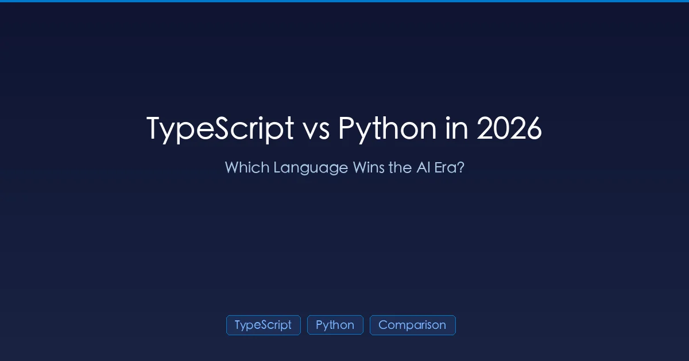

+++
date = '2026-03-10T20:00:00+08:00'
draft = false
title = 'TypeScript vs Python：AI 时代该选哪门语言？2026 全面对比'
description = 'TypeScript 在 GitHub 上以 66% 的增速超越 Python。从 AI 辅助编程、机器学习开发、全栈应用到职业规划，全面对比两门语言在 2026 年的优劣势。'
toc = true
tags = ['TypeScript', 'Python', 'AI Coding Tools', 'Comparison']
categories = ['Comparisons']
keywords = ['typescript vs python', 'typescript vs python 2026', 'typescript python 对比', 'AI 编程语言选择', 'typescript python 比较', '学 typescript 还是 python', 'typescript 超越 python']

[[params.faqItems]]
question = "TypeScript 真的在 GitHub 上超过 Python 了吗？"
answer = "是的。2025 年 8 月，TypeScript 以每月 263 万活跃贡献者成为 GitHub 使用量最高的语言，超越了 Python 和 JavaScript。TypeScript 同比增长 66%，Python 同比增长 48%。"

[[params.faqItems]]
question = "用 AI 写代码，TypeScript 比 Python 好吗？"
answer = "取决于你说的是哪种场景。如果是用 AI 工具写应用代码，TypeScript 更好——静态类型能帮助 LLM 生成更准确的代码。如果是构建 AI/ML 模型，Python 凭借其生态系统（PyTorch、TensorFlow、scikit-learn）依然占据绝对优势。"

[[params.faqItems]]
question = "我应该从 Python 转到 TypeScript 吗？"
answer = "不一定。更聪明的策略是两者都用：TypeScript 负责 Web 应用、API 和前端开发（这些场景下 AI 代码生成从静态类型中获益最大），Python 负责数据科学、ML 模型训练和 AI 研究。很多团队在同一个项目里同时使用两种语言。"

[[params.faqItems]]
question = "AI 编程工具对哪种语言支持更好？"
answer = "Claude Code、Cursor、Copilot 等 AI 编程工具对两种语言都支持良好，但在 TypeScript 中生成的代码更准确，因为静态类型提供了明确的约束。Python 加上类型注解（mypy）可以缩小部分差距，但无法完全匹配 TypeScript 的结构化类型系统。"

[[params.faqItems]]
question = "Python 会因为 TypeScript 的崛起而衰落吗？"
answer = "不会。Python 在 GitHub 上同比增长了 48%（新增 85 万贡献者），AI/ML 开发领域依然由 Python 主导——2025 年近一半的新 AI 仓库都是 Python。真正在变化的是 TypeScript 正在赢得应用开发领域，尤其是大量使用 AI 编程工具的场景。"
+++



十多年来，GitHub 上使用量最高的语言第一次换了——不是 Python，而是 [TypeScript 以 66% 的增速](/posts/ai/2026-03-10-typescript-ai-tools/)超越了 Python 和 JavaScript，背后的推手是 AI 编程工具与类型化语言之间形成的"正向飞轮"。

这是否意味着 Python 在走下坡路？你该不该转投 TypeScript？现实远比标题党复杂得多。

本文将从数据出发，拆解 2026 年两门语言各自的优势领域、AI 工具为何在某些场景偏爱 TypeScript 而在另一些场景偏爱 Python，以及如何为你的职业发展和项目做出正确选择。

## 数据说话：2026 年 GitHub 统计

| 指标 | TypeScript | Python | JavaScript |
|------|-----------|--------|------------|
| **月活贡献者** | 2,636,006 | ~2,400,000 | ~2,100,000 |
| **同比增长** | **+66%**（+105 万） | +48%（+85 万） | +25%（+42.7 万） |
| **GitHub 排名** | **#1** | #2 | #3 |
| **新建仓库（AI 标签）** | ~20% | **~50%** | ~15% |
| **LLM SDK 仓库** | #1（按数量） | #2 | — |

核心结论：**TypeScript 在整体活跃度上领先，但 Python 在 AI/ML 项目创建中依然占据主导地位。** 两者赢在不同的赛道。

## 逐项对比

### 类型系统

这是 AI 时代一切差异的根源。

| 维度 | TypeScript | Python |
|------|-----------|--------|
| **类型系统** | 结构化静态类型，编译时强制检查 | 可选（通过 mypy/pyright 的类型注解） |
| **类型覆盖度** | 完整（所有变量都有类型） | 部分（取决于开发者自觉性） |
| **AI 代码生成准确度** | **更高** — 类型约束 AI 输出 | 较低 — AI 需要自行推断类型 |
| **LLM 编译错误** | 编译时即可捕获 | 往往要到运行时才暴露 |

一项 [2025 年的学术研究](https://github.blog/ai-and-ml/llms/why-ai-is-pushing-developers-toward-typed-languages/)发现，**94% 的 LLM 编译错误都是类型检查失败**。TypeScript 能在编译阶段立即发现这些问题，而 Python……可能能发现，前提是你用了 mypy 并且类型注解覆盖率够高。

```typescript
// TypeScript：AI 精确知道这个函数的输入输出
interface User {
  id: string;
  name: string;
  email: string;
  role: 'admin' | 'user' | 'viewer';
}

function promoteUser(user: User): User {
  return { ...user, role: 'admin' };
}
// AI 不可能生成返回错误结构或无效角色的代码
```

```python
# Python 加类型注解：形式类似，但运行时不强制执行
from dataclasses import dataclass
from typing import Literal

@dataclass
class User:
    id: str
    name: str
    email: str
    role: Literal['admin', 'user', 'viewer']

def promote_user(user: User) -> User:
    return User(id=user.id, name=user.name, email=user.email, role='admin')
# 类型注解只是提示——Python 不会阻止你传入错误类型
```

**AI 编程方面的赢家：TypeScript** — 类型是强制的，不是可选的。

### AI/ML 生态系统

这是 Python 称霸、TypeScript 无法抗衡的领域。

| 库/框架 | Python | TypeScript |
|---------|--------|-----------|
| **PyTorch** | 原生支持 | 无对应方案 |
| **TensorFlow** | 原生支持 | TensorFlow.js（功能有限） |
| **scikit-learn** | 原生支持 | 无对应方案 |
| **pandas/numpy** | 原生支持 | 无对应方案 |
| **Hugging Face** | 原生支持 | 有限的 JS 绑定 |
| **LangChain** | 完整 SDK | 完整 SDK |
| **Anthropic SDK** | 完整 SDK | 完整 SDK |
| **OpenAI SDK** | 完整 SDK | 完整 SDK |

2025 年 GitHub 上近**一半的新 AI 仓库**都是 Python。从模型训练到数据处理再到部署，ML/AI 生态系统是 Python 原生的。

TypeScript 只在**应用层**追上来了——构建使用 AI 的产品，而非构建 AI 本身。

**AI/ML 方面的赢家：Python** — 生态系统无可替代。

### Web 与应用开发

| 维度 | TypeScript | Python |
|------|-----------|--------|
| **前端** | React、Vue、Svelte、Angular | 不适用 |
| **后端** | Node.js、Deno、Bun、Hono | FastAPI、Django、Flask |
| **全栈** | Next.js、Nuxt、SvelteKit | Django（配合模板） |
| **移动端** | React Native、Expo | Kivy（极少使用） |
| **基础设施** | Pulumi、AWS CDK | Boto3、Terraform (HCL) |
| **运行时性能** | 快（V8/Bun） | 较慢（CPython），uvloop 可提速 |

TypeScript 的杀手级优势：**全栈只用一种语言**。前端、后端、移动端、基础设施、工具链——统统用 TypeScript。这意味着：
- AI 工具只需理解一种语言就能通吃整个代码库
- 开发者可以参与项目的任何部分
- 前后端共享类型定义，直接消灭一类 Bug

```typescript
// 前后端共享类型
// api/types.ts — 服务端和客户端共用
export interface CreateOrderRequest {
  items: Array<{ productId: string; quantity: number }>;
  shippingAddress: Address;
  paymentMethod: PaymentToken;
}

export interface CreateOrderResponse {
  orderId: string;
  estimatedDelivery: string;
  total: Money;
}

// 服务端：Express 路由精确知道接收和返回什么
// 客户端：React 组件精确知道发送和期望什么
// AI 工具：基于共享类型在两端都能生成正确代码
```

Python 做不到这一点。Django/FastAPI 是很优秀的后端框架，但前端你还是得用 JavaScript/TypeScript。

**Web 开发方面的赢家：TypeScript** — 全栈类型安全无人能及。

### AI 辅助编码体验

各 [AI 编程工具](/posts/ai/2026-03-10-ai-coding-agents-comparison-2026/)与两种语言的配合如何？

| 工具 | TypeScript 体验 | Python 体验 |
|------|----------------|-------------|
| **[Claude Code](/posts/ai/2026-02-28-claude-code-complete-guide/)** | 优秀 — 利用类型深度理解代码 | 很好 — 有类型注解时更佳 |
| **[Cursor](/posts/ai/2026-02-28-claude-code-vs-cursor/)** | 优秀 — 行内补全高度准确 | 良好 — 没有类型时精度下降 |
| **GitHub Copilot** | 优秀 — 类型感知的智能建议 | 良好 — 依赖上下文 |
| **[Codex CLI](/posts/ai/2026-03-10-codex-cli-deep-dive/)** | 很好 | 很好 |

实际差异：当你让 AI 工具"给这个 API 端点加上错误处理"时，TypeScript 的类型告诉 AI：
- 可能出现哪些错误（类型化的错误联合体）
- 调用方期望什么（返回类型）
- HTTP 响应的结构是什么样的

在 Python 中，AI 需要从上下文推断这些信息——能用，但不够可靠，而且消耗更多 token。

**AI 辅助编码方面的赢家：TypeScript** — 静态类型为 AI 提供了更精确的约束。

### 学习曲线

| 因素 | TypeScript | Python |
|------|-----------|--------|
| **语法复杂度** | 中等（C 风格语法 + 类型注解） | 低（简洁、可读性强） |
| **写出第一个程序** | 数小时（需要理解类型系统） | 几分钟 |
| **写出生产级代码** | 数天 | 数天 |
| **高级概念** | 泛型、映射类型、条件类型 | 元类、装饰器、异步 |
| **AI 辅助学习** | AI 能很好地解释类型 | AI 什么都能解释得很好 |

Python 客观上更容易入门。语法读起来像自然语言，几分钟就能跑通代码。TypeScript 需要理解类型系统，而类型系统确实有一定复杂度（泛型、工具类型、条件类型）。

不过在 AI 时代，这个差距正在缩小。AI 工具可以解释 TypeScript 类型、自动生成类型定义，帮助你逐步学习。

**入门方面的赢家：Python** — 依然是最容易上手的语言。

### 职业前景与市场需求

| 因素 | TypeScript | Python |
|------|-----------|--------|
| **Web 开发岗位** | 主导 | 前端岗位极少 |
| **AI/ML 工程师岗位** | 增长中 | **主导** |
| **全栈岗位** | **强势**（一种语言搞定） | 前端还是需要 JS/TS |
| **数据科学岗位** | 少见 | **主导** |
| **DevOps/基础设施岗位** | 增长中（Pulumi、CDK） | 强势（Boto3、脚本） |
| **创业公司需求** | 非常高 | 非常高 |
| **平均薪资（美国，2026）** | $135-165K | $130-160K |

两种语言的需求都极其旺盛。选哪种语言不如你在这门语言上钻研多深来得重要。

**赢家：平手** — 赛道不同，都很吃香。

## 什么时候用 TypeScript

### 1. Web 应用（前端 + 后端）

构建 Web 产品时，TypeScript 是明确的首选。全栈共享类型，加上 AI 工具生成类型安全的代码，开发效率大幅提升。

```typescript
// Next.js 全栈示例 — 类型从数据库一路贯穿到 UI
// prisma/schema.prisma → 生成的类型 → API 路由 → React 组件
// AI 工具理解整条链路
```

### 2. AI 驱动的应用开发

构建**使用** AI 的产品（聊天机器人、SaaS 中的 AI 功能、LLM 驱动的工具）越来越多地选择 TypeScript：
- LLM SDK 支持一流（Anthropic、OpenAI、LangChain）
- 与 AI 服务交互时类型安全
- GitHub 上超过 69.3 万个 LLM SDK 仓库中，TypeScript 数量领先

### 3. 最大化 AI 编程工具效果

如果你每天都用 [Claude Code](/posts/ai/2026-02-28-claude-code-complete-guide/) 或 [Cursor](/posts/ai/2026-02-28-claude-code-vs-cursor/)，想要最好的 AI 辅助编码体验，TypeScript 能给你可衡量的更好结果。

### 4. 多人协作的团队项目

TypeScript 的类型系统就是活的文档。当 AI 工具和团队成员都需要理解你的代码时，显式类型能大幅减少沟通成本。

## 什么时候用 Python

### 1. AI/ML 模型开发

模型训练、微调、数据预处理、评估流水线——Python 是唯一的现实选择。生态系统（PyTorch、Hugging Face、scikit-learn）在 TypeScript 中没有对等方案。

```python
# 这整套工作流只存在于 Python 中
import torch
from transformers import AutoModelForCausalLM, AutoTokenizer

model = AutoModelForCausalLM.from_pretrained("meta-llama/Llama-3-8B")
tokenizer = AutoTokenizer.from_pretrained("meta-llama/Llama-3-8B")
# 微调、评估、部署...
```

### 2. 数据科学与数据分析

pandas、numpy、matplotlib、Jupyter notebooks——数据科学技术栈就是 Python 的。TypeScript 在探索性数据分析方面完全无法相提并论。

### 3. 快速原型和脚本

Python 极简的语法使它在写快速脚本、自动化和一次性任务时无可匹敌。需要 10 分钟内出活？Python 赢。

### 4. 科研与学术界

论文发布 Python 代码，高校课程教 Python。如果你在做研究，Python 就是通用语言。

## 聪明人的策略：两个都用

2026 年的现实是，**最优秀的开发者会策略性地使用两种语言**：

```
项目架构：

┌─────────────────────────────────────┐
│          TypeScript 层              │
│  前端 (React/Next.js)              │
│  API 层 (Express/Hono)             │
│  AI 集成 (LLM SDKs)               │
│  共享类型 (前端 ↔ 后端)            │
└────────────────┬────────────────────┘
                 │ API 调用
┌────────────────┴────────────────────┐
│            Python 层                │
│  ML 模型 (PyTorch/HF)             │
│  数据处理 (pandas/numpy)           │
│  训练流水线                         │
│  评估与监控                         │
└─────────────────────────────────────┘
```

**TypeScript** 负责用户能看到和交互的一切。**Python** 负责 AI 模型学习和预测所需的一切。两者完美互补。

### 工具搭配方案

| 任务 | 语言 | AI 工具 |
|------|------|---------|
| 构建 Web UI | TypeScript | Cursor |
| 编写 API | TypeScript | Claude Code |
| 训练 ML 模型 | Python | Jupyter + Copilot |
| 数据处理流水线 | Python | Claude Code |
| 部署基础设施 | TypeScript (CDK) | Claude Code |
| 编写自动化脚本 | Python | Claude Code |

### 用类型注解提升 Python 体验

如果你的主力语言是 Python，可以通过添加类型注解来获得部分 TypeScript 的 AI 优势：

```python
# 改造前：AI 只能猜
def process_order(order, user, discount=None):
    ...

# 改造后：AI 能生成质量好得多的代码
from typing import Optional
from models import Order, User, OrderResult

def process_order(
    order: Order,
    user: User,
    discount: Optional[float] = None
) -> OrderResult:
    ...
```

在 CI 流水线中运行 `mypy --strict` 来强制类型检查。虽然无法达到 TypeScript 编译时保证的水平，但能显著提升 AI 代码生成的质量。

## 快速决策指南

**选 TypeScript 的情况：**
- 构建 Web 应用（前端、后端或全栈）
- 想要最好的 AI 编程工具体验
- 团队同时负责前端和后端
- 构建使用 AI 的产品（而非构建 AI 本身）

**选 Python 的情况：**
- 训练 ML 模型或做数据科学
- 从事科研或学术工作
- 非 Web 应用的快速原型开发
- 团队以数据为核心

**两个都用的情况：**
- 构建 AI 驱动的 Web 产品（2026 年大多数创业公司的选择）
- 项目同时有应用层和 ML 层
- 你想让每个任务都用最合适的工具

## 要点总结

1. **TypeScript 在 GitHub 上超越了 Python** — 但两者赢在不同赛道，并非争夺同一个生态位
2. **AI 工具配合 TypeScript 写应用代码效果更好**，因为静态类型约束了生成范围 — 94% 的 LLM 错误是类型失败
3. **Python 在 AI/ML 领域不可替代** — 生态系统（PyTorch、Hugging Face、pandas）没有 TypeScript 对应方案
4. **最聪明的策略是两者兼用** — TypeScript 做应用层，Python 做 AI/ML 层
5. **给 Python 加上类型注解** — 这是提升 Python 项目 AI 代码生成质量的最低成本方案
6. **正向飞轮效应真实存在** — AI 工具推动 TypeScript 采用率上升，带来更多 TypeScript 训练数据，进而提升 AI 工具效果。这个循环将持续加速

## 延伸阅读

- [TypeScript 为何暴涨 66%](/posts/ai/2026-03-10-typescript-ai-tools/) — 数据背后的故事
- [2026 年 AI 编程代理工具：7 款横评](/posts/ai/2026-03-10-ai-coding-agents-comparison-2026/) — 各工具与不同语言的配合情况
- [上下文工程指南](/posts/ai/2026-03-10-context-engineering-guide/) — 类型就是一种上下文工程
- [Claude Code 完全指南](/posts/ai/2026-02-28-claude-code-complete-guide/) — TypeScript 和 Python 都能用好
- [AI 开发环境搭建](/posts/ai/2026-03-10-ai-dev-environment-setup/) — 配置多语言 AI 工作流
- [Vibe Coding 详解](/posts/ai/2026-02-28-vibe-coding-explained/) — TypeScript 让 vibe coding 更可靠
