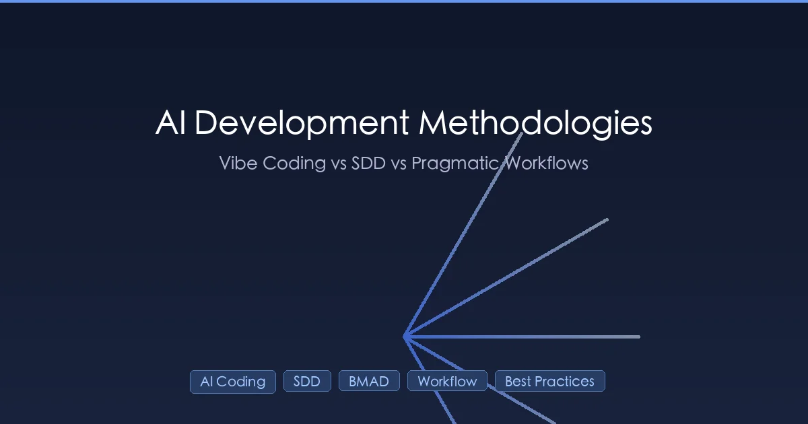

+++
date = '2026-03-11T18:00:00+08:00'
draft = false
title = 'AI 编程方法论对比 2026：Vibe Coding vs SDD vs BMAD 怎么选？'
description = '6 大 AI 开发方法论终极对比：Vibe Coding、SDD 规范驱动、BMAD、Ralph Loop、Peter 工作流和务实混合流。附 Martin Fowler 评价、YC 25% 公司数据和具体场景选型建议，一文帮你选对 AI 编程流程。'
toc = true
tags = ['AI Coding', 'Spec-Driven Development', 'Vibe Coding', 'BMAD Method', 'AI Workflow']
categories = ['AI Guides']
keywords = ['AI 开发方法论', 'vibe coding', '规范驱动开发', 'AI 编码工作流', 'BMAD 方法', 'Ralph Wiggum Loop', '上下文驱动开发', 'SDD 是什么', 'AI 编程最佳实践', 'AI 编程方法论', 'spec coding', 'vibe coding vs sdd', 'AI 编程流程']

[[params.faqItems]]
question = "Vibe Coding 和 SDD 规范驱动开发有什么区别？"
answer = "两者在频谱两端。Vibe Coding 是 Karpathy 提出的概念——对 AI 说话、让它跑、接受结果，几乎不审查代码；适合原型和副业。SDD（Spec-Driven Development）要求先写详细规范再让 AI 实现，适合生产项目和复杂系统。大多数成熟团队走混合路线：原型阶段 Vibe，进入生产前补规范。"

[[params.faqItems]]
question = "2026 年 AI 开发最靠谱的工作流是什么？"
answer = "没有银弹，但有共识模式：Peter Steinberger 式的「3-8 个 agent 并行 + worktree 隔离 + 高频原子提交 + CLAUDE.md 持久上下文」是目前被最多资深开发者验证的组合。快速修复用 Vibe，功能开发用 Peter 工作流，架构重构用 SDD。重点不是选某一种，是根据任务复杂度切换方法。"

[[params.faqItems]]
question = "BMAD 方法和 Ralph Loop 各适合什么场景？"
answer = "BMAD（Breakthrough Method for Agile AI-Driven Development）强调结构化 agent 角色（PM、架构师、开发、QA），适合复杂多人项目；Ralph Wiggum Loop 则是极简的「观察-反思-行动」循环，适合让单个 agent 自主完成耗时较长的任务。BMAD 是团队协作增强版，Ralph Loop 是单人长程自动化。"

[[params.faqItems]]
question = "并行跑多少个 AI agent 效率最高？"
answer = "Peter Steinberger 的经验数据是 3-8 个 agent。低于 3 个利用不足，超过 8 个协调开销超过收益。聚焦的重构任务 4 个最理想——每个 agent 在独立 worktree 里做不同模块，主 agent 做整合。低于这个数量其实不如单 agent + 明确上下文。"

[[params.faqItems]]
question = "SDD 会取代传统编程吗？什么时候该用？"
answer = "以目前形态不会取代。SDD 工具（Kiro、spec-kit、Tessl）在严格合规性和 AI 遵守规范方面还不够可靠。但 SDD 的核心原则——要求 AI 构建前先明确需求——会长期存在。建议：副业和原型跳过 SDD 直接 Vibe，复杂系统的关键模块（支付、认证、数据迁移）用 SDD 写清规范再让 AI 实现。"
+++



2025 年初，Andrej Karpathy 提出了「Vibe Coding」概念，AI 辅助开发的革命由此开始。到 Y Combinator 2025 冬季批次，**25% 的公司 95% 的代码由 AI 生成**。但蜜月期没持续多久——质量问题、技术债务和项目混乱迫使行业重新思考人类和 AI 应该如何协作编码。

本文深入剖析了在这场反思中诞生的 **六大 AI 开发方法论**。我会逐一分析每种方法的优势、不足，以及——最重要的——你到底该用哪一种。这不是泛泛的概述，而是基于实战经验、Martin Fowler 团队分析、Peter Steinberger 的演进工作流和真实生产数据的深度解读。

## 问题：为什么我们需要方法论？

2025 年以前，大多数开发者把 AI 当作高级自动补全。写个注释，得到建议，接受或拒绝。就这么简单。

然后 Agentic Coding 出现了——AI 能够规划、执行多步任务、编写完整功能。突然间，瓶颈转移了。难点不再是写代码，而是**告诉 AI 写什么，并确保它真的按你的意思做**。

可以想象成雇了一群速度极快但偶尔犯迷糊的初级开发者。他们能以超人的速度写代码，但没有明确的方向，他们会把错误的东西——写得漂亮、自信，而且规模化地搞砸。

这就是方法论重要的原因。它们是给 AI 提供正确上下文、正确约束和正确反馈回路的框架。

## 六大方法论

### 1. Vibe Coding — 狂野西部

**起源**：Andrej Karpathy，2025 年 2 月

Vibe Coding 是最简单的方式：直接和 AI 聊，看会发生什么。没有规划，没有规范，没有正式流程。你描述想要什么，AI 生成代码，你看结果，然后通过对话迭代。

```
想法 → 与 AI 对话 → 代码 → 检查结果 → 继续对话
```

**适用场景**：快速原型、一次性脚本、探索性开发、个人玩具项目。如果你在做下周就会扔掉的东西，Vibe Coding 再合适不过。

**失效场景**：项目超过几百行代码的那一刻。没有结构，AI 容易积累矛盾——修一个 bug 的同时引入两个新 bug。[Vibe Coding](/zh/posts/ai/2026-02-22-vibe-coding-guide/) 第一个小时感觉很神奇，到第十个小时就痛苦了。

**核心问题**：Vibe Coding 把代码当成一次性的。代码确实是一次性的时候没问题。但大多数专业软件不是。

> 把 Vibe Coding 想象成不看菜谱做菜。炒鸡蛋没问题。做婚礼蛋糕就完蛋了。

### 2. 规范驱动开发（SDD）— 钟摆摆向另一端

**代表**：AWS Kiro、GitHub Spec-Kit、ThoughtWorks

SDD 是另一个极端：在任何代码存在之前编写全面的规范，然后让 AI 从规范生成代码。规范是唯一的真相来源；代码只是副产品。

SDD 按 [Martin Fowler 团队](https://martinfowler.com/articles/exploring-gen-ai/sdd-3-tools.html) 的定义分三个层级：

| 层级 | 含义 | 人类编辑对象 |
|------|------|-------------|
| **Spec-first** | 规范引导初始开发，之后丢弃 | 代码 |
| **Spec-anchored** | 规范持续存在，随功能演进更新 | 规范 + 代码 |
| **Spec-as-source** | 规范是 *唯一* 真相来源，代码完全生成 | 仅规范 |

典型的 SDD 工作流（Kiro 风格）：

```
需求（用户故事 + Given/When/Then 验收标准）
  ↓
设计（架构图 + API 契约 + 数据模型）
  ↓
任务（原子化实现步骤）
  ↓
实现（AI 按任务逐一编写代码）
```

每个模块产出三个文件：`requirements.md` → `design.md` → `tasks.md`。

**适用场景**：需求明确的大型项目、需要审计追踪的多人团队、歧义可能造成严重后果的复杂业务逻辑。

**失效场景**：几乎所有其他情况。而且问题严重到 Martin Fowler 的团队专门做了深入分析。

#### Martin Fowler 对 SDD 的批评

经过对 SDD 工具的实际评估，Fowler 团队总结了六个系统性问题：

1. **工作流僵化**：一种固定流程无法适应所有问题规模。修个拼写错误和架构重新设计不应该走同样的仪式。在测试中，一个小 bug 修复被扩展成了 **4 个用户故事和 16 个验收标准**——"杀鸡用牛刀"。

2. **审查疲劳**：团队发现审查大量 markdown 规范比审查代码 *更糟*。一位工程师说："我宁可看代码也不想看这些 markdown 文件。"

3. **控制脆弱**：即使有精心设计的提示词和大上下文窗口，AI agent **经常忽略或过度解读规范**。规范说的是一回事，代码做的是另一回事。

4. **规范漂移**：随着时间推移，规范和代码不可避免地偏离。保持同步变成了没人愿意做的全职工作。

5. **受众不明**：SDD 是给谁用的？全栈开发者？产品-开发者组合？领域专家？方法论没有明确答案。

6. **历史重演**：SDD 与 2000 年代的 **模型驱动开发（MDD）** 惊人地相似——同样承诺从高层抽象生成代码，同样在现实复杂性介入时变得脆弱。MDD 最终失败了。SDD 面临同样的风险。

### 3. Peter Steinberger 的工作流 — 务实的中间路线

**创始人**：Peter Steinberger（OpenClaw 作者，前 PSPDFKit 创始人，后加入 OpenAI）

Peter 的方法可能是最有趣的，因为它**经历了失败而演变**。他从 SDD 的坚定信徒开始，最终成为最尖锐的批评者之一。

**2025 年初 — 全面 SDD**：
```
语音构思 → AI 起草规范 → AI 审查规范 → 迭代 → 实现
```

**2025 年中 — 幻灭期**：
```
直接与 AI 对话 → 一起构建功能 → 仅为复杂任务编写规范
```

**2026 年当前 — 多 Agent + 精简文档**：
```
精简的 AGENTS.md（核心规则）
  + 带 frontmatter 索引的 docs/（AI 按需读取）
  + 3-8 个 agent 并行工作
  + 原子化 git 提交
```

#### Frontmatter 索引创新

Peter 的关键创新是使用 **YAML frontmatter 的文档索引系统**。不是把所有文档塞进 AI 的上下文窗口，而是每个文档都有元数据头：

```yaml
---
summary: "模型认证：OAuth、API 密钥和 setup-token"
read_when:
  - 调试模型认证或 OAuth 过期时
  - 记录认证或凭据存储时
title: "认证"
---
```

当 AI agent 启动时，它运行 `pnpm run docs:list` 扫描所有 frontmatter 并构建索引。只在需要时才读取完整文档——而不是一开始就全部加载。

这很优雅，因为**上下文窗口是稀缺资源**。塞入每一个可能的文档实际上会 *降低* AI 性能。少即是多。

#### Peter 的核心原则

他的哲学可以提炼为四条规则：

- **"不再写完整规范——直接跟它聊，一起构建功能"** — 对于大多数任务，交互式迭代优于编写规范。
- **"保持 [AGENTS.md](/zh/posts/ai/2026-03-05-claude-code-claudemd-best-practices/) 精简。`logs: axiom or vercel cli` ——一行就够了"** — 简洁、聚焦的上下文优于全面的文档。
- **"不用 MCP——用 CLI 工具"** — 简单、直接的 CLI 命令（Vercel、psql、gh、axiom）比复杂的集成更可靠。
- **"约 20% 的时间用于完全由 agent 驱动的重构"** — AI 擅长大规模机械性重构。让它自主运行这类任务。

### 4. BMAD 方法 — 企业级航空母舰

**规模**：最全面的 SDD 框架。21 个专用 AI agent。50+ 引导式工作流。

BMAD（Breakthrough Method for Agile AI-Driven Development）用 AI 模拟整个产品团队：

```
/analyst → 产品简报
  ↓
/pm → PRD（产品需求文档）
  ↓
/architect → 架构设计 + 用户故事
  ↓
/dev → 实现
```

每个阶段由不同的 AI "角色" 处理，各有特定的专业知识、职责和约束。

**真实案例**：一个 3 人团队使用 BMAD 将一个 **50,000 行 COBOL 系统转换为 Java Spring Boot**，集成时间减少 40%。生产团队报告交付速度 [提升 2.7 倍，bug 减少 75%](https://github.com/bmad-code-org/BMAD-METHOD)。

**适用场景**：企业级项目、遗留系统迁移、需要合规审计和治理追踪的团队。

**不适用场景**：任何小于"企业级"的项目。如果你的项目不需要 21 个 AI agent 角色和 50+ 工作流，BMAD 就是杀鸡用牛刀。学习曲线陡峭，管理这么多 agent 角色的协调开销可能超过节省的时间。

> BMAD 是一艘战列舰。横渡大洋完美。在池塘钓鱼就荒谬了。

### 5. Ralph Wiggum Loop — 拥抱全新开始

**创始人**：Geoffrey Huntley

以《辛普森一家》中可爱但迷糊的角色命名，[Ralph Loop](https://github.com/ghuntley/how-to-ralph-wiggum) 采用了截然不同的方式：**每次 AI 会话都从全新状态开始**，git 作为持久化层。

```
启动新的 agent 进程（干净的上下文）
  ↓
从磁盘读取规范 + 任务列表
  ↓
选择一个任务
  ↓
实现 + git commit
  ↓
退出
  ↓
（循环）
```

控制令牌管理流程：
- `CONTINUE`：继续当前任务
- `SEND: <消息>`：向人类发送消息
- `RESTART`：放弃进度，重新开始

核心洞察是**上下文窗口污染是一个真实问题**。AI agent 工作时间越长，就会积累越多过时的上下文、矛盾的指令和认知漂移。通过每次迭代全新开始，但通过文件和 [git 提交](/zh/posts/ai/2026-03-10-high-frequency-commits/) 持久化进度，Ralph 完全避免了这个问题。

**适用场景**：长时间运行的自动化任务、上下文窗口溢出的项目、需要 AI 连夜自主运行的场景。

**不适用场景**：需要深度上下文理解且无法外化到文件的任务。每次重启都会丢失细微的会话上下文。

### 6. 上下文驱动开发（CDD）— 哲学层面

CDD 与其说是特定框架，不如说是指导原则：**专注于给 AI 提供正确的上下文，而非编写正确的规范**。

| 维度 | SDD | CDD |
|------|-----|-----|
| 关注点 | 写什么规范 | 提供什么上下文 |
| 投入 | 前期文档 | 组织代码库和参考资料 |
| 灵活性 | 固定流程 | 自适应 |

CDD 实践者关注：代码库理解、错误消息、截图、相关代码片段——任何帮助 AI 理解 *当前情况* 而非遵循预定计划的信息。

这与新兴的[上下文工程](/zh/posts/ai/2026-03-10-context-engineering-guide/)领域一致，该领域将 AI 周围的信息环境视为提升输出质量的主要杠杆。

## SDD 工具全景

如果你决定 SDD 适合你的项目，以下是工具对比：

### AWS Kiro

```
需求 → 设计 → 任务（三阶段）
```

- **引擎**：Claude Sonnet
- **格式**：每个模块 3 个 markdown 文件
- **特色**：EARS 标记法用于需求，"steering" 记忆库
- **问题**：即使是微小的 bug 也要走完整的三文件流程
- **评价**：适合已在 AWS 生态中的团队。更多详情请看 [Kiro 评测](/zh/posts/ai/2026-03-10-kiro-review/)。

### GitHub Spec-Kit

```
宪法 → 规范 → 计划 → 任务（四阶段循环）
```

- **分发**：开源 CLI 工具
- **特色**：Slash 命令（`/specify`），不可变的 "Constitution" 规则文件
- **问题**：生成的 markdown 倾向于冗长和重复

### Tessl 框架

```
规范 → 生成代码 → 测试（spec-as-source）
```

- **状态**：私有测试版
- **特色**：代码标记为 `// GENERATED FROM SPEC - DO NOT EDIT`
- **问题**：相同规范的代码生成不确定——同一规范，每次产出不同代码
- **评价**：被批评者称为"MDD 的僵化 + 不确定性"

### cc-sdd

```
Kiro 风格命令，支持 7+ AI 工具
```

- **来源**：日本开发团队
- **特色**：可与 Kiro 规范互换，支持 Claude Code、Codex、Cursor、Gemini CLI
- **评价**：如果你想要 SDD 但不想绑定供应商，这是最佳的工具无关选择

## 全面对比

| 维度 | Vibe Coding | SDD（严格） | Peter 工作流 | BMAD | Ralph Loop |
|------|------------|-------------|--------------|------|-----------|
| **学习曲线** | 无 | 中等 | 低 | 高 | 中等 |
| **前期成本** | 无 | 高（写规范） | 低（精简文档） | 极高 | 中等（任务列表） |
| **灵活性** | 最高 | 最低 | 高 | 低 | 中等 |
| **质量保证** | 无 | 高 | 中高 | 极高 | 中等 |
| **最佳规模** | 小型 | 大型 | 中型 | 超大型 | 中大型 |
| **团队协作** | 差 | 好 | 中等 | 优秀 | 中等 |
| **工具依赖** | 无 | Kiro/Spec-Kit | AGENTS.md + frontmatter | BMAD 框架 | Ralph 脚本 |
| **当前趋势** | 降温中 | 热门但有争议 | 在实践者圈层受尊重 | 小众但深度采用 | 小众 |

## 务实混合方案：真正有效的做法

研究了所有六种方法论之后，以下是我的建议——一个汲取各家之长的混合方案：

### 按任务复杂度匹配方法论

```
低复杂度（bug 修复、小功能）
  → Vibe Coding 或交互式迭代。无需规范。

中等复杂度（新模块、新功能）
  → Peter 工作流：精简 AGENTS.md + docs/ frontmatter 索引 + 仅在需要时编写规范

高复杂度（架构设计、系统重构）
  → SDD：编写需求 + 设计 + 任务，但不要教条化

企业级项目
  → BMAD 或定制化 SDD 流程
```

### 混合 AI 开发的五大支柱

1. **保持 AGENTS.md 精简**（Peter 风格） — 核心规则 + 技术栈 + 约束，不超过 200 行。你的 [CLAUDE.md](/zh/posts/ai/2026-02-28-claude-code-claudemd-guide/) 或 AGENTS.md 应该是备忘单，不是百科全书。

2. **给 docs/ 添加 frontmatter**（OpenClaw 风格） — `summary` + `read_when` 头信息，让 AI 按需读取文档，而非一次性全部加载。

3. **仅为复杂功能编写规范**（SDD 风格） — 不是每个任务都需要三文件仪式。把它留给歧义可能造成真正损害的功能。

4. **原子化 git 提交**（Ralph 风格） — 每个变更独立且可回滚。当[多个 agent 并行工作](/zh/posts/ai/2026-02-23-openclaw-multi-agent-guide/)时这至关重要。

5. **交互式迭代作为默认**（Peter 当前实践） — 对于大多数任务，直接跟 AI 对话。通过对话构建功能。只在复杂度需要时才切换到正式流程。

### 推荐项目结构

```
project/
├── AGENTS.md              # 精简的项目指令（所有 AI 工具通用）
├── docs/
│   ├── steering/          # 很少变更的"宪法"文档（带 frontmatter）
│   ├── specs/             # 按需的功能规范（带 frontmatter）
│   └── research/          # 研究笔记和决策记录（带 frontmatter）
```

每个文档都有 frontmatter 头：

```yaml
---
summary: "一句话解释这个文档的用途"
read_when:
  - AI 应该在什么时候阅读这个文档
title: "文档标题"
---
```

## 核心要点

1. **没有放之四海而皆准的方法论**。任何推销单一方法适用于所有情况的人都在卖蛇油。按问题规模匹配流程。

2. **SDD 的承诺超出了当前工具的成熟度**。Martin Fowler 的团队发现 AI agent 经常忽略规范，产生的是控制的幻觉而非真正的控制。工具会改进，但我们还没到那一步。

3. **更少的上下文往往意味着更好**。Peter Steinberger 最大的洞察：塞更多信息到 AI 的上下文窗口 *反而降低* 质量。聚焦的、相关的上下文胜过全面的文档。

4. **Git 才是真正的持久化层**。无论你使用 Ralph Loop 还是多 agent 工作流，git 提交是你保持理智的方式。[高频原子提交](/zh/posts/ai/2026-01-31-high-frequency-commits-strategy/)不是可选的——而是必需的。

5. **最好的方法论是你真正会遵循的那个**。你的团队忽略的完美 SDD 流程，不如你的团队实际使用的非正式 Vibe Coding。从简单开始，在痛点出现时添加结构。

## 常见问题

**问：应该从 Vibe Coding 还是 SDD 开始？**

从 Vibe Coding 开始学习和原型开发，然后随着项目增长过渡到混合方案。直接跳到完整 SDD 就像为了一个副业项目购买企业级软件。

**问：SDD 会取代传统开发吗？**

以目前的形式不会。工具太僵化，AI 的合规性太不可靠。但 *原则* ——在要求 AI 构建之前明确你想要什么——是合理的，并将以某种形式持续存在。

**问：应该并行运行多少个 agent？**

Peter Steinberger 的经验表明 **3-8 个 agent** 是最佳范围。低于 3 个，利用不足。超过 8 个，协调开销超过收益。对于聚焦的重构工作，4 个 agent 最理想。

**问：可以在同一项目中混合使用方法论吗？**

当然可以——而且你应该这样做。用 Vibe Coding 做快速修复，用 Peter 的工作流做功能开发，用 SDD 做复杂的架构工作。上面描述的混合方案就是为此设计的。

## 相关阅读

- [Vibe Coding Explained: Write Code by Talking to AI](/zh/posts/ai/2026-02-28-vibe-coding-explained/) — 对话式编码入门指南
- [Context Engineering Deep Dive](/zh/posts/ai/2026-03-10-context-engineering-guide/) — 如何优化 AI 看到的内容
- [Claude Code CLAUDE.md Best Practices](/zh/posts/ai/2026-03-05-claude-code-claudemd-best-practices/) — 编写有效的 AI 项目指令
- [High-Frequency Commits Strategy](/zh/posts/ai/2026-01-31-high-frequency-commits-strategy/) — AI 工作流中原子提交的重要性
- [OpenClaw Multi-Agent Guide](/zh/posts/ai/2026-02-23-openclaw-multi-agent-guide/) — 并行运行多个 AI agent
- [AI Coding Agents Comparison 2026](/zh/posts/ai/2026-03-10-ai-coding-agents-comparison-2026/) — 详细工具对比
- [Kiro Review](/zh/posts/ai/2026-03-10-kiro-review/) — AWS SDD IDE 深度评测

## 参考资料

- [Martin Fowler: Understanding SDD — Kiro, spec-kit, and Tessl](https://martinfowler.com/articles/exploring-gen-ai/sdd-3-tools.html)
- [ThoughtWorks: Spec-Driven Development](https://www.thoughtworks.com/en-us/insights/blog/agile-engineering-practices/spec-driven-development-unpacking-2025-new-engineering-practices)
- [Peter Steinberger: My Current AI Dev Workflow](https://steipete.me/posts/2025/optimal-ai-development-workflow)
- [Peter Steinberger: Just Talk To It](https://steipete.me/posts/just-talk-to-it)
- [BMAD Method (GitHub)](https://github.com/bmad-code-org/BMAD-METHOD)
- [Ralph Wiggum Loop (GitHub)](https://github.com/ghuntley/how-to-ralph-wiggum)
- [GitHub Blog: Spec-Driven Development Using Markdown](https://github.blog/ai-and-ml/generative-ai/spec-driven-development-using-markdown-as-a-programming-language-when-building-with-ai/)
- [Addy Osmani: How to Write a Good Spec for AI Agents](https://addyosmani.com/blog/good-spec/)
- [cc-sdd (GitHub)](https://github.com/gotalab/cc-sdd)
