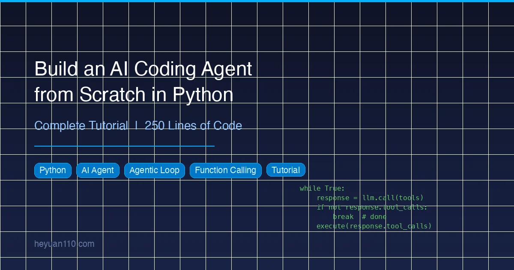

+++
date = '2026-03-11T10:00:00+08:00'
draft = false
title = 'Build an AI Coding Agent from Scratch in Python (Complete Tutorial)'
description = 'Learn how to build an AI agent in Python with agentic loops, function calling, and tool use. Step-by-step tutorial with complete runnable code in 250 lines.'
toc = true
tags = ['Python', 'AI Agent', 'Agentic Loop', 'Tutorial']
categories = ['AI Guides']
keywords = ['build ai agent python', 'ai agent tutorial', 'agentic loop python', 'function calling tutorial', 'build coding assistant python', 'AI agent from scratch', 'python tool use', 'openai function calling']

[[params.faqItems]]
question = "How many lines of code does it take to build an AI agent in Python?"
answer = "You can build a fully functional AI coding agent with an agentic loop, 6 tools (read/write/edit files, run commands, search code, list files), and a rich terminal UI in approximately 250 lines of Python code."

[[params.faqItems]]
question = "What is an agentic loop and why does it matter?"
answer = "An agentic loop is a while-loop pattern where the AI repeatedly calls tools, observes results, and decides its next action — autonomously — until the task is complete. It is the core architecture behind every modern AI coding tool including Claude Code, Cursor, and Copilot."

[[params.faqItems]]
question = "What is the difference between tool use and function calling?"
answer = "Tool use and function calling refer to the same concept. OpenAI calls it 'function calling' while Anthropic calls it 'tool use.' Both allow an LLM to request that your code executes specific functions, with the LLM deciding which function to call and what arguments to pass."

[[params.faqItems]]
question = "Can I use this AI agent architecture with models other than GPT-4?"
answer = "Yes. Because the tutorial uses the OpenAI Python SDK's standard interface, you can swap in any model that supports function calling — including DeepSeek, Qwen, Claude (via compatible endpoints), or local models through Ollama — by changing only the base URL and API key."
+++



Every AI coding tool — [Claude Code](/posts/ai/2026-02-28-claude-code-complete-guide/), Cursor, Copilot — runs on the same core architecture. In this tutorial, you will build that architecture yourself: a terminal AI coding agent in Python, from zero to a working 250-line tool that reads files, writes code, runs commands, and makes autonomous multi-step decisions.

No frameworks. No abstractions. Just Python and a clear understanding of how AI agents actually work.

## What You Will Build

By the end of this tutorial, you will have a working AI coding agent called **MagicCode** that can:

- Read and write files in your project
- Execute shell commands and observe results
- Search across codebases for patterns
- Make precise edits to existing files
- Chain multiple actions autonomously to complete complex tasks

We build incrementally across four versions:

| Version | What It Does | Lines of Code | Key Concept |
|---------|-------------|---------------|-------------|
| V1 | Basic chat | 20 | Chat Completions API |
| V2 | Streaming output | 30 | Token streaming |
| V3 | Rich terminal UI | 35 | Markdown rendering |
| V4 | Full agent with tools | 250 | Agentic Loop + Function Calling |

Each version is runnable on its own. You can stop at any version and have something that works.

## Why Build an AI Agent from Scratch?

Using an AI coding tool is one thing. Understanding how it works is something else entirely.

When you understand the architecture, you can customize it, extend it, debug it, or build something entirely new on the same foundation. The three concepts you will learn in this tutorial — the **agentic loop**, **tool use (function calling)**, and the **message protocol** — are the same three concepts that power every AI coding agent on the market today.

This is also a practical exercise in [context engineering](/posts/ai/2026-03-10-context-engineering-guide/) — the art of designing what information an AI receives and how. The system prompt, tool definitions, and conversation history you build here are all context engineering decisions that directly affect agent quality.

## The Architecture: What Makes an Agent Different from a Chatbot

Before writing code, let's answer the foundational question: **what separates an AI agent from a regular chatbot?**

### Chatbot vs. Agent

A chatbot responds to messages. An agent takes actions.

```
Chatbot:
  You: "Create a hello world program."
  AI:  "Here's the code: print('hello world')"
  You: (manually copy-paste, save, run)

Agent:
  You: "Create a hello world program."
  AI:  (creates hello.py → writes code → runs it → reports result)
```

The difference is **tool use**. The agent has access to tools — read files, write files, execute commands — and it autonomously decides when and how to use them.

### The Agentic Loop

The core pattern that enables autonomous behavior is called the **agentic loop**:

```
┌─────────────────────────────────────────────┐
│                                             │
│   User sends message                        │
│       ↓                                     │
│   LLM receives message + tool definitions   │
│       ↓                                     │
│   LLM decides: respond or use a tool?       │
│       ↓                                     │
│   ┌─ Text response → return to user         │
│   │                                         │
│   └─ Tool call → execute tool               │
│          ↓                                  │
│      Send result back to LLM                │
│          ↓                                  │
│      LLM decides again (loop) ──────────┐   │
│                                         │   │
│      (repeat until task is complete)  ◄──┘   │
│                                             │
└─────────────────────────────────────────────┘
```

This is what enables multi-step reasoning. The AI does not give you a one-shot answer. Instead, it works like a developer: look at the code, think about what to do, make a change, verify it works, repeat.

### How Function Calling Works

Both OpenAI and Anthropic APIs support tool use natively (OpenAI calls it "Function Calling"):

1. **You define tools** — name, description, parameter schema — and pass them to the API
2. **The LLM chooses** to call one or more tools in its response
3. **Your code executes** the tool and sends results back as `role: "tool"` messages
4. **The LLM continues** reasoning with the results

The critical insight: **the AI never executes tools itself.** It only decides *which* tool to call and *what arguments* to pass. Your Python code handles all actual execution. This is the security foundation — you control the execution boundary completely.

## Prerequisites and Setup

You need three things:

- **Python 3.10+** (3.12+ recommended)
- **An OpenAI API key** from [platform.openai.com](https://platform.openai.com)
- **A terminal** (any terminal works)

### Project Setup

```bash
mkdir magiccode && cd magiccode

python3 -m venv venv
source venv/bin/activate  # Windows: venv\Scripts\activate

pip install openai rich prompt_toolkit
```

Three dependencies:

| Library | Purpose |
|---------|---------|
| `openai` | API calls with native function calling support |
| `rich` | Markdown rendering, syntax highlighting, panels |
| `prompt_toolkit` | Enhanced terminal input with history |

### Configure Your API Key

```bash
export OPENAI_API_KEY="sk-your-key-here"
```

Add this to your `~/.zshrc` or `~/.bashrc` so it persists across sessions.

## V1: The 20-Line Foundation

Start embarrassingly simple. V1 is a plain chat loop — no streaming, no tools, no UI. Twenty lines that prove the API call works.

```python
#!/usr/bin/env python3
"""MagicCode v1 — A 20-line terminal AI assistant."""
from openai import OpenAI

client = OpenAI()  # Reads OPENAI_API_KEY from environment
history = [{"role": "system", "content": "You are MagicCode, a terminal AI coding assistant. Be concise and helpful."}]

print("MagicCode v1 — Type 'exit' to quit")
while True:
    user_input = input("\nYou > ")
    if user_input.strip().lower() in ("exit", "quit"):
        break

    history.append({"role": "user", "content": user_input})

    response = client.chat.completions.create(
        model="gpt-4o",
        messages=history,
    )

    reply = response.choices[0].message.content
    history.append({"role": "assistant", "content": reply})
    print(f"\n{reply}")
```

Save as `v1_basic.py` and run:

```bash
python v1_basic.py
```

It works — but it can only *talk*. It cannot *do* anything. It is a strategist who can plan battles but has no army.

### Key Concepts in V1

**The `history` list** is conversation memory. Every user message and AI response gets appended, and the entire list is sent with each API call. There is no magic persistence — just an ever-growing message array. This is also why long conversations hit token limits and get expensive.

**The `system` message** defines the AI's persona and behavioral rules. It serves the same purpose as a [CLAUDE.md file](/posts/ai/2026-02-28-claude-code-claudemd-guide/) in Claude Code — it tells the model who it is and how to behave.

## V2: Streaming — The Typewriter Effect

V1 has a UX problem: during long responses, you stare at a blank terminal while the model generates its full output, then everything appears at once. Streaming fixes this by sending tokens as they are generated.

```python
#!/usr/bin/env python3
"""MagicCode v2 — With streaming output."""
from openai import OpenAI

client = OpenAI()
history = [{"role": "system", "content": "You are MagicCode, a terminal AI coding assistant. Be concise and professional."}]

print("MagicCode v2 (streaming) — Type 'exit' to quit")
while True:
    user_input = input("\nYou > ")
    if user_input.strip().lower() in ("exit", "quit"):
        break

    history.append({"role": "user", "content": user_input})

    print("\nAI: ", end="", flush=True)
    full_reply = ""

    stream = client.chat.completions.create(
        model="gpt-4o",
        messages=history,
        stream=True,  # The key change
    )
    for chunk in stream:
        delta = chunk.choices[0].delta.content
        if delta:
            print(delta, end="", flush=True)
            full_reply += delta

    print()  # Newline after response
    history.append({"role": "assistant", "content": full_reply})
```

The only change: set `stream=True`, then iterate over chunks and print each `delta.content` as it arrives.

The `flush=True` parameter matters more than you might expect. Without it, Python buffers the output and you get text in bursts instead of smooth character-by-character streaming.

## V3: Rich Terminal UI with Markdown Rendering

Terminals do not have to look ugly. With the `rich` library, you get Markdown rendering, syntax highlighting, colored panels, and clean typography — all in the terminal.

```python
#!/usr/bin/env python3
"""MagicCode v3 — Rich Markdown rendering with live streaming."""
from openai import OpenAI
from rich.console import Console
from rich.markdown import Markdown
from rich.panel import Panel
from rich.live import Live

client = OpenAI()
console = Console()
history = [{"role": "system", "content": "You are MagicCode, a terminal AI coding assistant. Format responses in Markdown."}]

console.print(Panel(
    "[bold cyan]MagicCode v3[/] — Terminal AI Coding Assistant\nType 'exit' to quit",
    border_style="cyan"
))

while True:
    console.print()
    user_input = console.input("[bold green]You >[/] ")
    if user_input.strip().lower() in ("exit", "quit"):
        break

    history.append({"role": "user", "content": user_input})

    full_reply = ""
    stream = client.chat.completions.create(
        model="gpt-4o", messages=history, stream=True,
    )
    with Live(console=console, refresh_per_second=8) as live:
        for chunk in stream:
            delta = chunk.choices[0].delta.content
            if delta:
                full_reply += delta
                live.update(Panel(
                    Markdown(full_reply),
                    title="MagicCode",
                    border_style="blue",
                ))

    history.append({"role": "assistant", "content": full_reply})
```

The `Rich.Live` component continuously re-renders the panel as new content streams in. You can watch Markdown tables, code blocks, and formatted text materialize in real time.

## V4: The Tool System — Giving Your Agent Hands

The first three versions are chatbots with increasing polish. Now we give the AI actual capabilities — the ability to read files, write files, and execute commands. This is where it stops being a chatbot and becomes an **agent**.

This is the most important section of this tutorial.

### Step 1: Define Your Tools

OpenAI's Function Calling requires tool definitions in a specific JSON schema format. Each tool needs a name, description, and parameter schema:

```python
TOOLS = [
    {
        "type": "function",
        "function": {
            "name": "read_file",
            "description": "Read the contents of a file. Returns the content with line numbers.",
            "parameters": {
                "type": "object",
                "properties": {
                    "path": {
                        "type": "string",
                        "description": "File path to read"
                    }
                },
                "required": ["path"],
            },
        },
    },
    {
        "type": "function",
        "function": {
            "name": "write_file",
            "description": "Write content to a file. Creates parent directories if needed.",
            "parameters": {
                "type": "object",
                "properties": {
                    "path": {"type": "string", "description": "File path"},
                    "content": {"type": "string", "description": "Complete file content"},
                },
                "required": ["path", "content"],
            },
        },
    },
    {
        "type": "function",
        "function": {
            "name": "run_command",
            "description": "Execute a shell command. Times out after 30 seconds.",
            "parameters": {
                "type": "object",
                "properties": {
                    "command": {"type": "string", "description": "Shell command to execute"}
                },
                "required": ["command"],
            },
        },
    },
    {
        "type": "function",
        "function": {
            "name": "list_files",
            "description": "List directory contents (ignores node_modules, .git, etc.).",
            "parameters": {
                "type": "object",
                "properties": {
                    "path": {"type": "string", "description": "Directory path", "default": "."},
                },
                "required": [],
            },
        },
    },
]
```

Tool definitions matter more than you might think. The model reads these descriptions to decide *when* and *how* to use each tool. Three principles for good tool definitions:

- **Intuitive names**: `read_file` is immediately clear; `rf` is not
- **Specific descriptions**: The model uses these to judge when a tool is appropriate
- **Precise parameter schemas**: Required vs. optional, types, and defaults all guide the model's behavior

### Step 2: Implement Tool Execution

The AI decides what to call. **Your code does the actual work.** This separation is the security foundation of the architecture:

```python
import os
import subprocess

def execute_tool(name: str, params: dict) -> str:
    """Execute a tool call and return the result as a string."""
    try:
        if name == "read_file":
            with open(params["path"], "r", encoding="utf-8") as f:
                content = f.read()
            lines = content.split("\n")
            numbered = "\n".join(
                f"{i+1:4d} | {line}" for i, line in enumerate(lines)
            )
            return f"{params['path']} ({len(lines)} lines)\n{numbered}"

        elif name == "write_file":
            path = params["path"]
            os.makedirs(os.path.dirname(path) or ".", exist_ok=True)
            with open(path, "w", encoding="utf-8") as f:
                f.write(params["content"])
            return f"Written to {path} ({len(params['content'])} chars)"

        elif name == "run_command":
            cmd = params["command"]
            # Safety check: block destructive commands
            dangerous = ["rm -rf /", "mkfs", "dd if=", "> /dev/sd"]
            if any(d in cmd for d in dangerous):
                return "Refused to execute dangerous command"
            result = subprocess.run(
                cmd, shell=True, capture_output=True,
                text=True, timeout=30
            )
            output = result.stdout
            if result.stderr:
                output += "\n--- stderr ---\n" + result.stderr
            return output.strip() or "(Command completed with no output)"

        elif name == "list_files":
            path = params.get("path", ".")
            entries = sorted(os.listdir(path))
            result = []
            for entry in entries:
                full = os.path.join(path, entry)
                prefix = "[dir]" if os.path.isdir(full) else "[file]"
                result.append(f"{prefix} {entry}")
            return "\n".join(result) or "Empty directory"

    except Exception as e:
        return f"Error: {type(e).__name__}: {e}"
```

Design decisions worth noting:

1. **`read_file` returns line-numbered content** — this lets the AI precisely reference locations when it later needs to edit a file
2. **`write_file` auto-creates directories** — `os.makedirs(exist_ok=True)` eliminates "directory not found" errors
3. **`run_command` has a safety blocklist** — a simple but effective guard against destructive operations
4. **All tools return strings** — this is an API requirement, tool results must be serializable text

### Step 3: Build the Agentic Loop

This is the **core of the entire project**. In under 40 lines, it implements autonomous decision-making, multi-step tool execution, and self-directed task completion:

```python
def chat(user_input: str):
    """The Agentic Loop: autonomous AI decision-making."""
    history.append({"role": "user", "content": user_input})

    while True:
        # 1. Call the LLM with tool definitions
        response = client.chat.completions.create(
            model="gpt-4o",
            messages=history,
            tools=TOOLS,          # Pass the tool definitions
        )
        message = response.choices[0].message

        # 2. Store the AI's full response in history
        history.append(message)

        # 3. Display any text content
        if message.content:
            console.print(Panel(Markdown(message.content), title="MagicCode"))

        # 4. No tool calls? Task is complete — exit the loop
        if not message.tool_calls:
            break

        # 5. Execute each tool call and feed results back
        for tool_call in message.tool_calls:
            name = tool_call.function.name
            args = json.loads(tool_call.function.arguments)

            console.print(f"  Tool: {name}({args})")
            result = execute_tool(name, args)

            # Send tool results back as role="tool" messages
            history.append({
                "role": "tool",
                "tool_call_id": tool_call.id,
                "content": result,
            })
        # Back to the top of the while loop — AI continues thinking
```

**The elegance is in the `while True` loop.** A single user request can trigger a dozen tool calls, each one informed by the results of the last. Here is what a real multi-turn execution looks like:

```
User: "Add error handling to main.py"

Turn 1:
  AI: "Let me look at the project structure first."
  Tools: list_files("."), read_file("main.py")
  → Execute, send results back

Turn 2:
  AI: "I see the issue. I'll add try-except blocks..."
  Tools: edit_file("main.py", old_text, new_text)
  → Execute, send results back

Turn 3:
  AI: "Done. Let me verify with tests."
  Tools: run_command("python -m pytest")
  → Execute, send results back

Turn 4:
  AI: "All tests pass. Here's what I changed..."
  Tools: none → loop exits
```

The AI plans, acts, observes, and adapts — autonomously. This is what "agentic" means.

### Understanding the Message Protocol

The `history` array sent to the API follows a specific structure. Understanding this is essential for debugging:

```python
[
    # System message — defines behavior
    {"role": "system", "content": "You are MagicCode..."},

    # User message
    {"role": "user", "content": "Write me a hello world program"},

    # AI response — includes tool calls
    {
        "role": "assistant",
        "content": "I'll create the file for you.",
        "tool_calls": [{
            "id": "call_abc123",
            "type": "function",
            "function": {
                "name": "write_file",
                "arguments": '{"path":"hello.py","content":"print(\'hello world\')"}'
            }
        }]
    },

    # Tool result — matched by tool_call_id
    {
        "role": "tool",
        "tool_call_id": "call_abc123",
        "content": "Written to hello.py (20 chars)"
    },

    # AI continues reasoning...
]
```

Two details that will save you hours of debugging:

- **Tool results use `role: "tool"`**, not `role: "user"`. The model treats these differently — it knows this data came from tool execution, not from the human.
- **`tool_call_id` must match exactly.** Every tool result must reference the `id` of the corresponding `tool_call`. A mismatch causes an API error.

## The Complete Source Code: Full 250-Line Agent

Now let's combine everything into a single, production-quality implementation. We add two more tools (`edit_file` for precise text replacement and `search_code` for codebase search), a safety valve to prevent infinite loops, and a clean class-based structure.

Here is the complete `magic.py`:

```python
#!/usr/bin/env python3
"""
MagicCode — A terminal AI coding assistant built from scratch.
Demonstrates: Agentic Loop | Tool Use | Streaming | Rich UI
"""
import os
import json
import glob
import subprocess
from openai import OpenAI
from rich.console import Console
from rich.markdown import Markdown
from rich.panel import Panel

# ========== Configuration ==========
MODEL = os.getenv("MAGIC_MODEL", "gpt-4o")
client = OpenAI()  # Reads OPENAI_API_KEY from environment

SYSTEM_PROMPT = """You are MagicCode, a powerful terminal AI coding assistant.

## Your Tools
- read_file: Read file contents (with line numbers)
- write_file: Write to files (auto-creates directories)
- edit_file: Replace specific text in a file
- run_command: Execute shell commands (30s timeout)
- list_files: List directory structure
- search_code: Search for patterns in code

## Working Principles
1. Always read a file before modifying it
2. Break complex tasks into steps; verify each step
3. Never execute destructive commands (rm -rf, format, etc.)
4. Respond in Markdown format"""

# ========== Tool Definitions ==========
def _fn(name, desc, params, required):
    return {"type": "function", "function": {
        "name": name, "description": desc,
        "parameters": {"type": "object", "properties": params, "required": required},
    }}

TOOLS = [
    _fn("read_file", "Read file contents. Returns text with line numbers.",
        {"path": {"type": "string", "description": "File path"}}, ["path"]),
    _fn("write_file", "Write content to a file. Creates directories if needed.",
        {"path": {"type": "string", "description": "File path"},
         "content": {"type": "string", "description": "Complete file content"}},
        ["path", "content"]),
    _fn("edit_file", "Replace old_text with new_text in a file (first match).",
        {"path": {"type": "string", "description": "File path"},
         "old_text": {"type": "string", "description": "Text to find"},
         "new_text": {"type": "string", "description": "Replacement text"}},
        ["path", "old_text", "new_text"]),
    _fn("run_command", "Execute a shell command with 30-second timeout.",
        {"command": {"type": "string", "description": "Shell command"}},
        ["command"]),
    _fn("list_files", "Recursively list directory structure (max 3 levels).",
        {"path": {"type": "string", "description": "Directory path"}}, []),
    _fn("search_code", "Search for a pattern across all files in a directory.",
        {"pattern": {"type": "string", "description": "Search pattern"},
         "path": {"type": "string", "description": "Search directory"}},
        ["pattern"]),
]

IGNORED_DIRS = {".git", "node_modules", "__pycache__", ".venv", "venv", "dist", "build"}

# ========== Tool Execution ==========
def execute_tool(name: str, params: dict) -> str:
    try:
        if name == "read_file":
            with open(params["path"], "r", encoding="utf-8", errors="replace") as f:
                content = f.read()
            lines = content.split("\n")
            numbered = "\n".join(f"{i+1:4d} | {line}" for i, line in enumerate(lines))
            return f"{params['path']} ({len(lines)} lines)\n{numbered}"

        elif name == "write_file":
            path = params["path"]
            os.makedirs(os.path.dirname(path) or ".", exist_ok=True)
            with open(path, "w", encoding="utf-8") as f:
                f.write(params["content"])
            return f"Written to {path} ({len(params['content'])} chars)"

        elif name == "edit_file":
            path = params["path"]
            with open(path, "r", encoding="utf-8") as f:
                content = f.read()
            if params["old_text"] not in content:
                return "Error: Target text not found in file"
            new_content = content.replace(params["old_text"], params["new_text"], 1)
            with open(path, "w", encoding="utf-8") as f:
                f.write(new_content)
            return f"Edited {path}"

        elif name == "run_command":
            cmd = params["command"]
            dangerous = ["rm -rf /", "mkfs", "dd if=", "> /dev/sd"]
            if any(d in cmd for d in dangerous):
                return "Refused to execute dangerous command"
            result = subprocess.run(
                cmd, shell=True, capture_output=True, text=True, timeout=30
            )
            output = result.stdout
            if result.stderr:
                output += "\n--- stderr ---\n" + result.stderr
            return output.strip() or "(No output)"

        elif name == "list_files":
            path = params.get("path", ".")
            lines = []
            def walk(d, prefix="", depth=0):
                if depth >= 3: return
                try: entries = sorted(os.listdir(d))
                except PermissionError: return
                for e in entries:
                    full = os.path.join(d, e)
                    if e in IGNORED_DIRS or e.startswith("."): continue
                    if os.path.isdir(full):
                        lines.append(f"{prefix}[dir] {e}/")
                        walk(full, prefix + "  ", depth + 1)
                    else:
                        lines.append(f"{prefix}[file] {e}")
            walk(path)
            return "\n".join(lines[:200]) or "Empty directory"

        elif name == "search_code":
            pattern = params["pattern"]
            path = params.get("path", ".")
            matches = []
            for fp in glob.glob(os.path.join(path, "**", "*"), recursive=True):
                if any(d in fp for d in IGNORED_DIRS) or not os.path.isfile(fp):
                    continue
                try:
                    with open(fp, "r", encoding="utf-8", errors="replace") as f:
                        for i, line in enumerate(f, 1):
                            if pattern.lower() in line.lower():
                                matches.append(f"{fp}:{i}: {line.rstrip()}")
                                if len(matches) >= 50: break
                except OSError: continue
                if len(matches) >= 50: break
            return "\n".join(matches) or f"No matches for '{pattern}'"

    except Exception as e:
        return f"Error: {type(e).__name__}: {e}"

# ========== The Agentic Loop ==========
class MagicCode:
    def __init__(self):
        self.console = Console()
        self.history = [{"role": "system", "content": SYSTEM_PROMPT}]

    def chat(self, user_input: str):
        self.history.append({"role": "user", "content": user_input})
        tool_count = 0

        while True:
            response = client.chat.completions.create(
                model=MODEL, messages=self.history, tools=TOOLS,
            )
            message = response.choices[0].message
            self.history.append(message)

            # Display text response
            if message.content:
                self.console.print(Panel(
                    Markdown(message.content),
                    title="MagicCode", border_style="blue", padding=(1, 2),
                ))

            # No tool calls means the task is complete
            if not message.tool_calls:
                break

            # Execute each tool call
            for tc in message.tool_calls:
                tool_count += 1
                name = tc.function.name
                args = json.loads(tc.function.arguments)
                info = json.dumps(args, ensure_ascii=False)
                if len(info) > 120: info = info[:120] + "..."
                self.console.print(f"  [yellow][{tool_count}] {name}[/] [dim]{info}[/]")

                result = execute_tool(name, args)
                preview = result[:100].replace("\n", " ")
                self.console.print(f"  [green]  Done[/] [dim]{preview}[/]")

                self.history.append({
                    "role": "tool",
                    "tool_call_id": tc.id,
                    "content": result,
                })

            # Safety valve: prevent infinite loops
            if tool_count > 20:
                self.console.print("[red]Tool call limit reached (20)[/]")
                break

    def run(self):
        self.console.print(Panel(
            "[bold cyan]MagicCode[/] — Your Terminal AI Coding Assistant\n\n"
            "  [green]Tools[/]: Read/write files | Run commands | Search code | Edit files\n"
            "  [green]Commands[/]: exit to quit | clear to reset history",
            border_style="cyan", padding=(1, 2),
        ))
        self.console.print(f"  [dim]Working dir: {os.getcwd()}[/]")
        self.console.print(f"  [dim]Model: {MODEL}[/]\n")

        while True:
            try:
                user_input = self.console.input("[bold green]You >[/] ")
                cmd = user_input.strip().lower()
                if cmd in ("exit", "quit"): break
                elif cmd == "clear":
                    self.history = [{"role": "system", "content": SYSTEM_PROMPT}]
                    self.console.print("[dim]History cleared[/]")
                    continue
                elif not cmd: continue
                self.chat(user_input)
                self.console.print()
            except KeyboardInterrupt:
                self.console.print("\n[cyan]Goodbye![/]")
                break

if __name__ == "__main__":
    MagicCode().run()
```

Save as `magic.py` and run:

```bash
python magic.py
```

Try asking it to create a file, read it back, modify it, or run a command. Watch the agentic loop in action — the AI autonomously chains multiple tool calls to complete your request.

## How These 6 Tools Compare to Production Agents

You might wonder: are 6 tools enough? Here is how MagicCode compares to what production agents like [Claude Code](/posts/ai/2026-02-28-claude-code-complete-guide/) ship with:

| Capability | MagicCode | Claude Code |
|-----------|-----------|-------------|
| Read files | `read_file` | Read tool |
| Write files | `write_file` | Write tool |
| Edit files | `edit_file` | Edit tool |
| Run commands | `run_command` | Bash tool |
| List directory | `list_files` | Glob tool |
| Search code | `search_code` | Grep tool |
| MCP integration | Not included | Yes |
| Multi-file diffs | Not included | Yes |
| Notebook editing | Not included | Yes |
| Web search | Not included | Yes |

Claude Code has about 15 built-in tools. Our 6 tools cover roughly **80% of everyday use cases**. The remaining 20% is mostly advanced features like [MCP integration](/posts/ai/2026-02-28-mcp-protocol-explained/) and notebook editing — useful but not core to the architecture.

## Five Ways to Extend Your Agent

The foundation is solid. Here are five extensions that bring MagicCode closer to a production-grade tool.

### 1. Permission Confirmation

Production agents ask for confirmation before writing files or executing commands:

```python
def execute_tool_with_confirm(name, params):
    # Read-only operations: execute immediately
    if name in ("read_file", "list_files", "search_code"):
        return execute_tool(name, params)

    # Write operations: require user approval
    console.print(f"[yellow]Tool wants to: {name}({params})[/]")
    confirm = console.input("[bold]Allow? (y/n) [/]")
    if confirm.lower() == "y":
        return execute_tool(name, params)
    return "User denied this operation"
```

### 2. Project Context Loading

[Claude Code automatically reads CLAUDE.md](/posts/ai/2026-02-28-claude-code-claudemd-guide/) from the project root to understand context. You can do the same:

```python
def load_project_context():
    """Load project config files as context."""
    context = ""
    for name in ["CLAUDE.md", "AGENTS.md", "README.md"]:
        if os.path.exists(name):
            with open(name, "r") as f:
                context += f"\n\n--- {name} ---\n{f.read()}"
    return context

# Append to system prompt
project_ctx = load_project_context()
if project_ctx:
    SYSTEM_PROMPT += f"\n\n## Project Context\n{project_ctx}"
```

### 3. Swap in Any Model

MagicCode is not locked to GPT. Any model that supports function calling works. The OpenAI SDK's compatible interface makes switching trivial:

```python
from openai import OpenAI

# DeepSeek
client = OpenAI(api_key="your-key", base_url="https://api.deepseek.com/v1")

# Local Ollama
client = OpenAI(api_key="ollama", base_url="http://localhost:11434/v1")
```

This is one reason the tutorial uses the OpenAI SDK — it is the de facto standard interface, and virtually every model provider offers a compatible endpoint.

### 4. Conversation Persistence

Currently, conversation history vanishes when you exit. Persist it to JSON:

```python
import json

HISTORY_FILE = ".magiccode_history.json"

def save_history(history):
    with open(HISTORY_FILE, "w") as f:
        json.dump(history, f, ensure_ascii=False, default=str)

def load_history():
    if os.path.exists(HISTORY_FILE):
        with open(HISTORY_FILE, "r") as f:
            return json.load(f)
    return []
```

### 5. Token Usage Tracking

API calls cost money. Adding usage tracking is straightforward:

```python
total_input_tokens = 0
total_output_tokens = 0

# After each API call:
total_input_tokens += response.usage.prompt_tokens
total_output_tokens += response.usage.completion_tokens

# On exit:
console.print(f"[dim]Tokens — Input: {total_input_tokens} | Output: {total_output_tokens}[/]")
```

## Common Pitfalls and How to Avoid Them

Building your first agent, you will likely hit a few issues. Here is how to handle them:

| Problem | Cause | Solution |
|---------|-------|----------|
| `tool_call_id` mismatch error | Tool result does not reference the correct call ID | Always use `tool_call.id` from the response, never generate your own |
| Agent loops forever | No exit condition or model keeps calling tools | Add a `tool_count` limit (we use 20) |
| Model ignores tools | Tool descriptions are too vague | Write specific, actionable descriptions |
| Large file crashes | Reading entire file into memory | Add file size checks, truncate large files |
| Command hangs | No timeout on `subprocess.run` | Always set `timeout=30` (or appropriate value) |

## How This Connects to the Broader AI Agent Ecosystem

The architecture you built here is not just an exercise — it is the same pattern used across the industry. According to [Anthropic's research on building effective agents](https://www.anthropic.com/engineering/building-effective-agents), the agentic loop with tool use is the foundational pattern for all production AI agents.

If you want to see how this pattern scales to production, compare what you built with the agents covered in our [AI Coding Agents Comparison](/posts/ai/2026-03-10-ai-coding-agents-comparison-2026/). You will find the same three components — LLM API, tool definitions, agentic loop — at the core of every one of them.

For a deeper understanding of how tool integration is evolving, see our guide on the [MCP Protocol](/posts/ai/2026-02-28-mcp-protocol-explained/), which standardizes how AI agents discover and connect to external tools.

And if you want to understand how context engineering principles (like the system prompt and tool descriptions you designed) apply at scale, the [OpenAI Prompt Engineering Guide](https://platform.openai.com/docs/guides/prompt-engineering) is an excellent external resource.

## Key Takeaways

The entire architecture of a modern AI coding agent boils down to **three things**:

1. **An LLM API** that supports function calling
2. **Tool definitions** that describe available capabilities
3. **An agentic loop** that orchestrates the cycle of thinking and acting

Master these three concepts and you understand the core architecture of Claude Code, Cursor Agent, Copilot Workspace, and every other AI coding tool on the market.

The complete code is in this article — copy, paste, run. From 20 lines to 250, from chatbot to autonomous agent, you now have the foundation to build anything on top of this pattern.

## Related Reading

- [Claude Code: The Complete Guide](/posts/ai/2026-02-28-claude-code-complete-guide/) — Deep dive into using Claude Code effectively
- [CLAUDE.md: The Ultimate Guide](/posts/ai/2026-02-28-claude-code-claudemd-guide/) — How AI coding assistants understand project context
- [MCP Protocol Explained](/posts/ai/2026-02-28-mcp-protocol-explained/) — The universal standard for AI tool integration
- [Context Engineering Guide](/posts/ai/2026-03-10-context-engineering-guide/) — System prompt design and context management
- [AI Coding Agents Comparison 2026](/posts/ai/2026-03-10-ai-coding-agents-comparison-2026/) — How the top AI coding tools compare
- [Vibe Coding Explained](/posts/ai/2026-02-28-vibe-coding-explained/) — Natural language-driven AI programming
